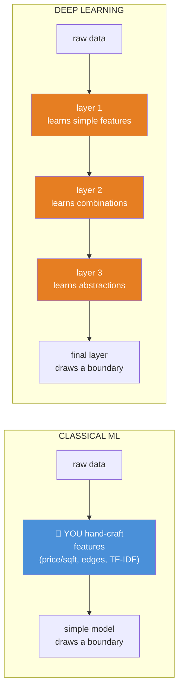
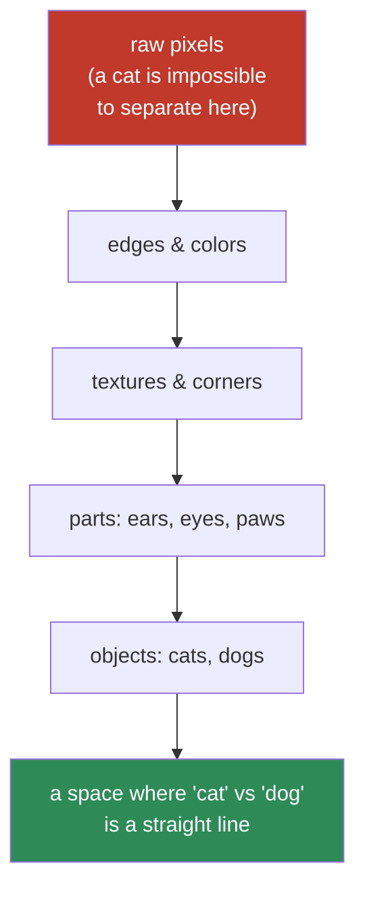
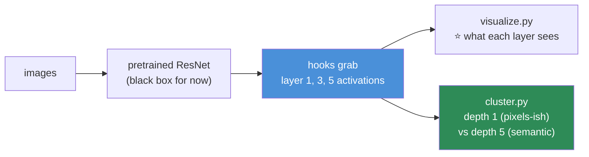

# 09.1 · Why Deep Learning?

[⬅ Lesson index](README.md) · [🏠 Module 09](../README.md) · [➡ 09.2 Neural Network Fundamentals](09.2-neural-network-fundamentals.md)

> **The lesson in one line:** Classical ML makes *you* invent the features; deep learning makes the *network* invent them — and that single shift is why it conquered images, audio, and text while leaving spreadsheets to gradient boosting.

---

## 🎯 Learning objectives

By the end of this lesson you can:

1. State the **one thing** deep learning changed, and it isn't "more layers."
2. Explain **representation learning** — and why it's the whole point.
3. Explain the **universal approximation theorem** intuitively, and why it's *less* useful than it sounds.
4. Say precisely **when to reach for deep learning** and when a GBM will beat it.
5. Explain what made deep learning suddenly work in 2012, when the ideas were 30 years old.

---

## 🧠 Mental model

> **Classical ML: you engineer the features, the model draws the boundary. Deep learning: the model engineers its own features, layer by layer.**



**This is the same distinction from [08.1](../../08-Machine-Learning/weeks/08.1-what-is-ml.md): who builds the features?** In classical ML, *you* do — and you're limited by your own imagination. In deep learning, **the layers are the features**, learned automatically from the data.

---

## 📖 Why classical ML hits a wall

Classical ML (Module 08) is superb — **on data where a human can name the useful features.** House prices? You can invent `price_per_sqft`, `age_at_sale`, `rooms_per_sqft`. Churn? `days_since_login`, `activity_trend`. **On tabular data, a human plus a gradient-boosted tree is genuinely hard to beat.**

**Now try to name the features for these:**

| Task | The features you'd have to hand-craft |
|---|---|
| "Is there a cat in this photo?" | 😰 Edge detectors? Fur-texture filters? Ear-shape templates? At *every* position, scale, rotation, and lighting? |
| "What does this sentence mean?" | 😰 Word counts lose all order. Grammar rules? Fifty years of linguists tried and failed |
| "Transcribe this audio" | 😰 Frequency bands? Phoneme templates? Across accents, speakers, noise? |

> [!IMPORTANT]
> **For unstructured data — images, audio, text — nobody can hand-engineer the features well enough.** People *tried*, for decades: SIFT and HOG for vision, n-grams and parse trees for language. These were brilliant, painstaking, and **they hit a ceiling** — because the useful features of a cat are not something a human can write down. They are hierarchical, position-invariant, and staggeringly numerous.
>
> **Deep learning's bet: don't hand-craft the features. Learn them.** And on unstructured data, that bet paid off so completely that it created the modern AI industry.

### The 2012 moment

The ideas — neurons, backprop, convolution — were **from the 1980s**. So why did deep learning explode in 2012, not 1988?

| What changed | Why it mattered |
|---|---|
| **Data** | ImageNet: 14 million labeled images. Networks are data-hungry; there finally was enough |
| **Compute** | **GPUs.** A neural net is [matrix multiplication](../../06-Mathematics/weeks/06.2-linear-algebra-vectors-matrices.md), and GPUs do matmul ~100× faster than CPUs |
| **A few tricks** | ReLU (no vanishing gradients), dropout, better initialization ([06.10](../../06-Mathematics/weeks/06.10-neural-network-math.md)) |

**AlexNet (2012) cut the ImageNet error rate almost in half overnight, and it ran on two consumer GPUs.** The theory was old; the *fuel* — data and compute — was new. **This is why deep learning is inseparable from hardware**, and why you'll spend lessons 09.6 and 09.14 thinking about GPUs.

---

## 🔬 Representation learning — the actual idea

**A "representation" is how data is encoded for a task.** The same cat photo can be represented as: raw pixels (useless for classification), or a vector where "catness" is one clean dimension (trivial for classification). **Deep learning learns the transformation from the first to the second.**



> [!IMPORTANT]
> **Each layer transforms the representation into one where the next layer's job is easier — and the final layer's job is trivial.** This is the deepest idea in the field:
>
> **A deep network is a stack of learned coordinate changes that gradually straighten out the data until a simple linear boundary suffices** ([06.2](../../06-Mathematics/weeks/06.2-linear-algebra-vectors-matrices.md): a matrix *is* a coordinate change). Early layers learn generic, reusable features (edges, textures — these look nearly identical across *all* vision tasks). Later layers learn task-specific abstractions (this particular breed of cat).
>
> **This is also why *transfer learning* works** (a theme for [09.11](09.11-cnns.md)): the early-layer features are so general that you can take a network trained on ImageNet, keep its first layers, and re-use them for medical imaging, satellite photos, or your own dataset — with a fraction of the data. **You are re-using learned representations.** It is the single most practically important consequence of the whole framework.

> 🖼️ **[IMAGE PLACEHOLDER: `assets/images/09-representation-hierarchy.png`]**
> *A four-column figure showing what the layers of a trained CNN actually detect (visualized via activation maximization, in the style of Zeiler & Fergus / OpenAI Microscope). Column 1 (layer 1): oriented edges and color blobs — small, simple, Gabor-like. Column 2 (layer 2): textures, corners, and simple patterns (grids, stripes). Column 3 (layer 3): recognizable object *parts* — eyes, wheels, faces, text. Column 4 (final layers): whole objects — dogs, cars, buildings. An arrow across the top labelled "simple & generic → complex & task-specific," and a caption: "Nobody programmed these. The network learned them from raw pixels and a label. The first columns are nearly identical across every vision task — which is why transfer learning works."*

---

## 📐 The Universal Approximation Theorem

**The theorem:** *A neural network with a single hidden layer and enough neurons can approximate any continuous function to arbitrary precision.*

**In plain English: neural networks can, in principle, represent essentially any input→output mapping you care about.** They are not limited to straight lines (like linear models) or axis-aligned boxes (like trees) — they can draw *any* shape.

> [!CAUTION]
> **The universal approximation theorem is true, famous, and much less useful than it sounds — and understanding *why* is more valuable than the theorem itself.**
>
> **What it does NOT tell you:**
> 1. **How WIDE** the layer needs to be. "Enough neurons" might mean *astronomically* many — a single-hidden-layer network that memorizes a complex function can need exponentially more neurons than a deep one.
> 2. **That you can FIND the weights.** The theorem says a good network *exists*. It says nothing about whether gradient descent can *reach* it. **Existence ≠ learnability.**
> 3. **That it will GENERALIZE.** A network that fits the training data perfectly ([08.2](../../08-Machine-Learning/weeks/08.2-ml-workflow.md)'s overfitting) is exactly what the theorem promises — and exactly what you don't want.
>
> **So why does DEPTH matter, if one wide layer is already universal?** Because **depth is exponentially more efficient.** A deep network reuses lower-level features to build higher-level ones ([representation hierarchy](#-representation-learning--the-actual-idea)) — so it can represent complex functions with *far* fewer parameters than a shallow-but-wide one. **The theorem says "possible"; depth is what makes it "practical."** *That* is the real lesson.

---

## ⚖️ Deep learning vs classical ML — the honest comparison

| | **Classical ML** | **Deep Learning** |
|---|---|---|
| **Features** | ⭐ **You** engineer them | ⭐ **The network** learns them |
| **Best data** | ⭐ **Tabular** (spreadsheets) | ⭐ **Unstructured** (images, audio, text) |
| **Data needed** | 100s – 100,000s | **Millions** (or transfer learning) |
| **Compute** | CPU, minutes | **GPU**, hours to weeks |
| **Interpretable** | 🟡 Often | ❌ Rarely |
| **Tuning** | Moderate | ⚠️ Extensive, finicky |
| **When it wins** | **Tabular, small data, interpretability needed** | **Perception, language, huge data** |

> [!IMPORTANT]
> **⭐ Deep learning did NOT win tabular data, and pretending otherwise will make you a worse engineer.**
>
> On the spreadsheet-shaped problems that make up most of business ML — churn, credit, demand, fraud — **gradient boosting still beats deep learning** ([08.1](../../08-Machine-Learning/weeks/08.1-what-is-ml.md), [08.6](../../08-Machine-Learning/weeks/08.6-ensembles.md)). It trains in seconds, needs no GPU, handles missing values natively, and is easier to deploy. This has been tested repeatedly and **it keeps being true** (Grinsztajn et al., 2022).
>
> **Deep learning's home turf is *perception and language*** — where the input is raw and high-dimensional and features must be learned. **Know which world your problem lives in.** Reaching for a Transformer on tabular customer data is a classic, expensive mistake — and being the person who says *"let's try LightGBM first"* is a sign of judgement, not ignorance.

---

## 🐛 Common mistakes

| Mistake | Consequence |
|---|---|
| **Deep learning on tabular data by default** | A GBM would be better, faster, cheaper, interpretable |
| **Thinking "deeper = better"** | Depth without data/regularization just overfits harder |
| **Citing universal approximation as a reason to use NNs** | It says "possible," not "learnable" or "generalizes" |
| **Ignoring the data requirement** | A network with 10,000 examples and no transfer learning will underperform a GBM |
| **Forgetting the GPU** | You'll wait 100× longer on a CPU |
| **Not considering transfer learning** | You trained from scratch when a pretrained backbone needed 1% of the data |

---

## 📝 Exercises

**Conceptual**
1. Explain "representation learning" to a backend engineer in three sentences. What does *each layer* do?
2. Why did deep learning explode in 2012 and not 1988? Name the three enablers.
3. State the universal approximation theorem, then list the **three things it does not tell you.**
4. Why does *depth* help, if a single wide layer is already universal?
5. Why does transfer learning work? Which layers transfer, and which don't?

**Judgement** — the most valuable ones
6. For each, decide **deep learning or classical ML**, and justify: (a) predict loan default from 30 tabular features; (b) detect tumors in X-rays; (c) forecast next week's demand from historical sales; (d) transcribe customer support calls; (e) rank search results; (f) classify sentiment of 500 product reviews.
7. Your manager wants "a deep learning solution" for a churn model with 50,000 rows of tabular data. **Write the three-sentence pushback.**
8. You have 2,000 labeled medical images. Training a CNN from scratch gives 61% accuracy. **What would you try instead, and why might it reach 90%?**

**Analysis**
9. Find a visualization of trained CNN filters (OpenAI Microscope, or the Zeiler & Fergus paper). Describe what layers 1, 3, and 5 detect. Does it match the representation hierarchy in this lesson?

---

## 🛠️ Mini project — *The Representation Explorer*

Build `code/09-deep-learning/representation-explorer/` — see representation learning happen, before you can even train a network.

**Requirements**
- Take a pretrained CNN (torchvision's ResNet — we'll use it as a black box for now).
- Extract and **visualize the activations** at layers 1, 3, and 5 for a few images.
- **Show that early-layer features are generic** (an edge detector fires the same way on a cat and a car).
- **Cluster images by their representations at different depths** and show that deeper = more semantic.

```
representation-explorer/
├── README.md
├── src/
│   ├── extract.py        # hook a pretrained CNN; grab intermediate activations
│   ├── visualize.py      # ⭐ what does each layer "see"?
│   ├── generic.py        # ⭐ show layer-1 features are shared across classes
│   └── cluster.py        # cluster by representation at depth 1 vs 5 (08.10)
└── notebooks/
```

**Architecture**



**Implementation guidance**
1. **Don't train anything.** This project is about *seeing* what a trained network has learned. `torchvision.models.resnet18(pretrained=True)`, register forward hooks, run some images through.
2. **`generic.py` is the point.** Take a cat and a car. Show that a **layer-1 activation** (an oriented-edge detector) responds similarly to edges in *both* — because edges are edges. Then show a **layer-5 activation** responds to "cat" but not "car." **This is representation learning, made visible: generic early, specific late.**
3. **`cluster.py` closes the loop.** Cluster the images ([08.10](../../08-Machine-Learning/weeks/08.10-clustering.md)) using their layer-1 representations, then their layer-5 representations. **The layer-5 clustering will align with the actual classes; the layer-1 one won't.** That *is* the hierarchy, quantified.

**Evaluation strategy:** qualitative (the visualizations) plus one quantitative check — the **Adjusted Rand Index** ([08.10](../../08-Machine-Learning/weeks/08.10-clustering.md)) between the clustering and the true labels should rise with depth.

**Testing plan:** assert the hooks fire and return the expected tensor shapes; assert the deep-representation clustering has a higher ARI than the shallow one.

**Future improvements:** add **activation maximization** (optimize an input image to maximally activate one neuron — this is how the famous "what does this neuron want to see?" images are made). Come back to this project after [09.11](09.11-cnns.md) and *train* your own CNN, then re-run the explorer on it.

**Why this project:** because before you spend five lessons learning *how* a network learns features, it's worth spending an hour *seeing that it does.* It makes everything that follows concrete.

---

## 📄 Cheat sheet

| | |
|---|---|
| **The one idea** | Classical ML: **you** build features. Deep learning: the **network** builds them |
| **Representation learning** | Each layer transforms the data into a form where the next layer's job is easier |
| **The hierarchy** | edges → textures → parts → objects. **Generic early, specific late** |
| **⭐ Transfer learning** | Re-use early-layer features → train on 1% of the data |
| **Universal approximation** | A big enough net can represent any function — but says nothing about **learnability or generalization** |
| **Why depth** | Exponentially more efficient than width (reuses lower features) |
| **The 2012 unlock** | **Data (ImageNet) + compute (GPUs)** + tricks (ReLU, dropout) |
| **⭐ When DL wins** | **Perception & language** (unstructured, high-dim, huge data) |
| **⭐ When DL loses** | **Tabular data** — gradient boosting still wins |

---

## 🎴 Flashcards

- **Q:** ⭐ What's the ONE thing deep learning changed? → **A:** **Who builds the features.** Classical ML: you hand-engineer them. Deep learning: the **network learns them, layer by layer**, from raw data.
- **Q:** What is representation learning? → **A:** Each layer transforms the data's representation into one where the next layer's job is easier — **edges → textures → parts → objects** — until a simple linear boundary suffices.
- **Q:** ⭐ Why does transfer learning work? → **A:** **Early-layer features are generic** (edges, textures look nearly identical across all vision tasks). You can reuse a pretrained network's early layers and train on a **fraction of the data.**
- **Q:** State the universal approximation theorem — and its three catches. → **A:** A big-enough net can approximate any continuous function. **Catches: (1) "enough" may be astronomical; (2) existence ≠ learnability (can GD find it?); (3) fitting ≠ generalizing.**
- **Q:** Why does depth matter if one wide layer is already universal? → **A:** **Depth is exponentially more efficient** — it reuses lower-level features to build higher ones, representing complex functions with far fewer parameters.
- **Q:** Why did deep learning explode in 2012? → **A:** **Data** (ImageNet) + **compute** (GPUs make matmul ~100× faster) + tricks (ReLU, dropout, better init). The ideas were from the 1980s; the fuel was new.
- **Q:** ⭐ When does deep learning LOSE to classical ML? → **A:** **On tabular data.** Gradient boosting still wins — faster, cheaper, no GPU, interpretable. DL's home turf is **perception and language.**

---

## 💼 Interview questions

1. **"What's the difference between deep learning and classical machine learning?"** — **Who engineers the features.** Then: DL wins on unstructured/high-dimensional data (perception, language); classical ML (esp. GBMs) wins on tabular. **The feature answer is what shows understanding.**
2. **"Explain the universal approximation theorem. Is it useful?"** — Any function is representable by a big-enough net. **But it's less useful than it sounds** — it says nothing about learnability or generalization, and depth (not width) is what makes it practical.
3. **"Your team wants deep learning for a tabular problem. React."** — Push back: **GBM will likely win**, train in seconds, need no GPU, and be interpretable. Offer to run both and show numbers.
4. **"Why did deep learning take off around 2012 if the ideas were decades old?"** — Data + GPUs + a few tricks. **The theory was old; the fuel was new.**
5. **"You have 2,000 images and a CNN gets 61%. What now?"** — **Transfer learning** — a pretrained backbone, fine-tuned. It reuses generic early-layer features and needs far less data.

---

## 📚 Summary

- **Deep learning changed one thing: who builds the features.** Classical ML makes you hand-engineer them (and caps you at your imagination); deep learning **learns them automatically**, layer by layer.
- **Representation learning is the whole point.** Each layer transforms the data into a representation where the next layer's job is easier — **edges → textures → parts → objects** — until the final layer's job is a trivial linear boundary. **Generic features early, task-specific late** — which is exactly why **transfer learning** works.
- **The universal approximation theorem** says a big-enough network can represent any function — but it's famously **less useful than it sounds**: it promises existence, not **learnability** or **generalization**, and **depth (not width)** is what makes it practical.
- **Deep learning exploded in 2012** because of **data (ImageNet) and compute (GPUs)**, not new theory. It is inseparable from hardware.
- **⭐ Deep learning did not win tabular data.** On spreadsheet-shaped problems, gradient boosting still beats it. **DL's home turf is perception and language.** Know which world your problem lives in.

**Next:** [09.2 Neural Network Fundamentals](09.2-neural-network-fundamentals.md) — we open the black box and build a neuron.

---

## 🔗 References

- LeCun, Bengio & Hinton (2015) — *Deep Learning* (Nature). The manifesto; clearest short statement of representation learning.
- Krizhevsky, Sutskever & Hinton (2012) — *ImageNet Classification with Deep CNNs* (**AlexNet**). The paper that started the modern era.
- Zeiler & Fergus (2014) — *Visualizing and Understanding Convolutional Networks*. **Where the "edges → parts → objects" pictures come from.** Look at the figures.
- Goodfellow, Bengio & Courville — *Deep Learning* (free at deeplearningbook.org), Ch. 1 and 6.4.1 (universal approximation).
- Grinsztajn et al. (2022) — *Why do tree-based models still outperform deep learning on tabular data?* — the receipts for "DL didn't win spreadsheets."
- OpenAI Microscope / Distill.pub *Feature Visualization* (Olah et al., 2017) — interactive, gorgeous, and it makes the representation hierarchy undeniable.

---

## 🧭 Navigation

| Direction | Link |
|---|---|
| ⬅ Previous | [Lesson index](README.md) |
| ➡ Next | [09.2 Neural Network Fundamentals](09.2-neural-network-fundamentals.md) |
| 🏠 Module | [Module 09](../README.md) |
| 🗺 Roadmap | [ROADMAP.md](../../../ROADMAP.md) |
