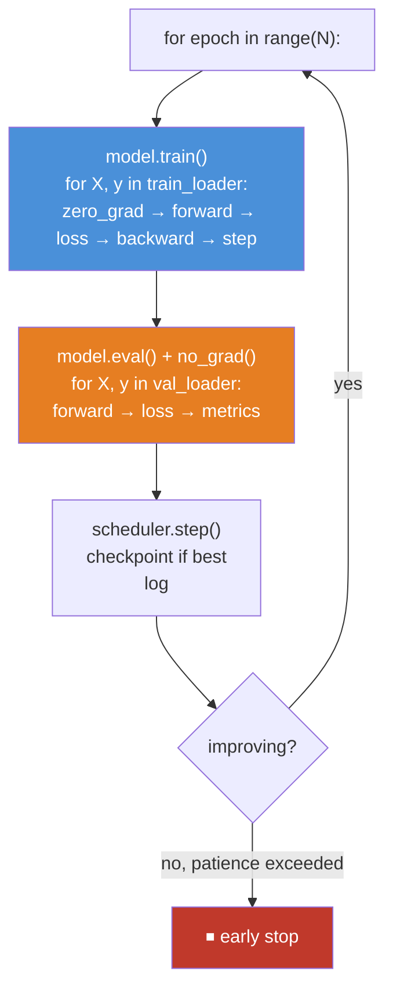
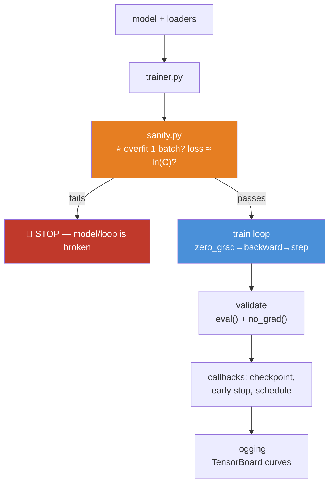

# 09.10 · The Training Loop

[⬅ 09.9 Data Loading](09.9-data-loading.md) · [🏠 Module 09](../README.md) · [➡ 09.11 CNNs](09.11-cnns.md)

> **The lesson in one line:** Everything you've built — model, data, optimizer, loss — comes together in one loop, and its beating heart is three lines you've already met: `zero_grad`, `backward`, `step`.

---

## 🎯 Learning objectives

By the end of this lesson you can:

1. Write a **complete, correct training loop** from memory and explain every line.
2. Add the **production essentials**: validation, checkpointing, logging, early stopping, LR scheduling.
3. Explain the **`model.train()` / `model.eval()` / `no_grad()` dance** and why each is mandatory.
4. Track metrics honestly ([08.12](../../08-Machine-Learning/weeks/08.12-evaluation.md)) — not just the loss.
5. Debug a training loop that runs but doesn't learn.
6. Package it all into a reusable trainer.

---

## 🧠 Mental model

> **For each epoch: loop over training batches (learn), then loop over validation batches (measure). Save the best. Stop when it stops improving.**



> [!IMPORTANT]
> **⭐ This is the loop you'll write for the rest of your career.** A CNN, a Transformer, a diffusion model — they all use *this exact loop*. The model changes; the loop does not. **Learn it once, deeply, and you can train anything.** It is, alongside [09.4](09.4-backpropagation.md)'s backprop, the load-bearing lesson of this module.

---

## 📐 The minimal loop

**Start with the smallest correct loop, then add production features one at a time.**

```python
model = MLP().to(device)                        # 09.8
optimizer = torch.optim.AdamW(model.parameters(), lr=1e-3)   # 09.5
loss_fn = torch.nn.CrossEntropyLoss()           # 09.3 — takes LOGITS

for epoch in range(10):
    model.train()                                # ⭐ training mode (dropout ON)
    for X, y in train_loader:                    # 09.9
        X, y = X.to(device), y.to(device)        # ⭐ move every batch (09.6)

        # ── THE THREE-LINE HEARTBEAT (09.7) ──
        optimizer.zero_grad()                    # 1 · clear last batch's gradients
        logits = model(X)                        # forward (09.8) — call model(x)
        loss = loss_fn(logits, y)                # scalar (09.3)
        loss.backward()                          # 2 · autograd fills .grad (09.7)
        optimizer.step()                         # 3 · update the weights (09.5)
```

**That's a working training loop.** Every line traces to a lesson you've done. Now we make it production-quality.

---

## 🎭 The train/eval/no_grad dance

**Before adding features, get this right — it's the source of the subtlest bugs** ([09.7](09.7-autograd.md)).

```python
# ── TRAINING ──
model.train()                    # ⭐ dropout ON, batchnorm updates its running stats
for X, y in train_loader:
    ...                          # (gradients tracked — this is what we want)

# ── VALIDATION ──
model.eval()                     # ⭐ dropout OFF, batchnorm uses running stats
with torch.no_grad():            # ⭐ no graph built — saves memory, faster
    for X, y in val_loader:
        logits = model(X)        # deterministic, gradient-free
        ...
```

> [!CAUTION]
> **⭐ Three things must all be right, and they are three DIFFERENT switches:**
>
> | Switch | Controls | Forgetting it... |
> |---|---|---|
> | **`model.train()`** | dropout ON, batchnorm learns stats | (usually fine — it's the default) |
> | **`model.eval()`** | dropout OFF, batchnorm uses saved stats | ⭐ **corrupts validation metrics** (dropout randomly zeros predictions) |
> | **`torch.no_grad()`** | no autograd graph | wastes memory, possible OOM on val |
>
> **The classic silent bug: forgetting `model.eval()` at validation.** Dropout stays on, so your validation predictions are randomly degraded, your val loss looks worse than it is, and you conclude your model is overfitting when it isn't. **And forgetting `model.train()` after validation** leaves the model in eval mode for the next epoch — no dropout, no batchnorm updates — so it silently overfits. **Set the mode explicitly at the start of every train and val phase.** This is the #1 correctness bug in beginner training loops.

---

## 📊 Tracking metrics — not just the loss

**The loss is a training signal, not a business metric** ([08.12](../../08-Machine-Learning/weeks/08.12-evaluation.md)). Track what you actually care about:

```python
def evaluate(model, loader, loss_fn, device):
    model.eval()
    total_loss, correct, n = 0.0, 0, 0
    with torch.no_grad():
        for X, y in loader:
            X, y = X.to(device), y.to(device)
            logits = model(X)
            total_loss += loss_fn(logits, y).item() * len(y)   # ⭐ .item() (09.7) — weight by batch size
            correct += (logits.argmax(1) == y).sum().item()
            n += len(y)
    return total_loss / n, correct / n         # avg loss, accuracy
```

> [!IMPORTANT]
> **⭐ Everything from [08.12](../../08-Machine-Learning/weeks/08.12-evaluation.md) applies unchanged.** Accuracy is a lie on imbalanced data — use **PR-AUC**. The threshold isn't 0.5 — **tune it on cost**. Report metrics with confidence intervals, sliced by segment. **A deep learning classifier is evaluated exactly like a logistic regression** — the loss is just how it learns; the *metric* is how you judge it. **Don't let the fancy model make you forget the honest evaluation.**
>
> And note `.item()` weighted by batch size: if `drop_last=False`, your last batch is smaller, so a plain average over batches is subtly wrong. Multiply by `len(y)` and divide by the total. A small correctness detail that matters.

---

## 💾 Checkpointing — save the best, not the last

```python
best_val_loss = float('inf')
for epoch in range(epochs):
    train_one_epoch(...)
    val_loss, val_acc = evaluate(model, val_loader, loss_fn, device)

    if val_loss < best_val_loss:                 # ⭐ save the BEST, by VALIDATION
        best_val_loss = val_loss
        torch.save({                             # ⭐ save everything needed to resume (09.16)
            'epoch': epoch,
            'model_state': model.state_dict(),
            'optimizer_state': optimizer.state_dict(),
            'best_val_loss': best_val_loss,
        }, 'best.pt')
```

> [!TIP]
> **⭐ Save the checkpoint with the best *validation* score, not the final epoch.** The last epoch is often overfit — its training loss is lowest but its validation performance has already started degrading. The best model is the one at the validation minimum, which you only know by tracking it. **This is "model checkpointing" and it's a free form of early stopping** — even if you train too long, you keep the best model. Save the **optimizer state too**, so you can resume training exactly where you left off ([09.16](09.16-saving-loading.md)).

---

## ⏹️ Early stopping — quit while you're ahead

**Stop training when validation stops improving** — it saves compute and prevents overfitting ([08.2](../../08-Machine-Learning/weeks/08.2-ml-workflow.md)).

```python
class EarlyStopping:
    def __init__(self, patience=5, min_delta=1e-4):
        self.patience, self.min_delta = patience, min_delta
        self.best, self.counter = float('inf'), 0

    def __call__(self, val_loss):
        if val_loss < self.best - self.min_delta:
            self.best, self.counter = val_loss, 0
            return False                          # improved — keep going
        self.counter += 1
        return self.counter >= self.patience      # ⭐ stalled for `patience` epochs → stop

stopper = EarlyStopping(patience=5)
for epoch in range(1000):                         # ⭐ set epochs HIGH; let early stopping decide
    train_one_epoch(...)
    val_loss, _ = evaluate(...)
    if stopper(val_loss):
        print(f"early stop at epoch {epoch}")
        break
```

> [!TIP]
> **The pattern echoes gradient boosting** ([08.6](../../08-Machine-Learning/weeks/08.6-ensembles.md)): **set the max epochs absurdly high and let early stopping decide when to quit.** `patience` is how many stalled epochs you tolerate before stopping (5–20 is typical). Combined with best-checkpoint saving, you get the best model *and* you don't waste compute training a network that's done learning.

---

## 📈 Learning-rate scheduling

**Nobody trains at a constant learning rate** ([09.5](09.5-optimization.md)). Start big, end small:

```python
scheduler = torch.optim.lr_scheduler.CosineAnnealingLR(optimizer, T_max=epochs)
# or ReduceLROnPlateau (reactive), OneCycleLR (aggressive), or warmup+cosine for Transformers

for epoch in range(epochs):
    train_one_epoch(...)
    val_loss, _ = evaluate(...)
    scheduler.step()                    # ⭐ most schedulers: step per EPOCH
    # (ReduceLROnPlateau is the exception: scheduler.step(val_loss))
    print(f"lr = {scheduler.get_last_lr()[0]:.6f}")
```

> [!CAUTION]
> **⭐ Where you call `scheduler.step()` matters, and getting it wrong is a common bug.** Most schedulers step **per epoch** (after the epoch's training). But `OneCycleLR` and warmup schedulers step **per batch**. And `ReduceLROnPlateau` needs the **validation metric** passed in: `scheduler.step(val_loss)`. **Read the scheduler's docs for the stepping frequency** — calling it in the wrong place silently ruins your LR schedule and your training with it.

---

## 🐍 The complete production loop

**Everything, assembled:**

```python
import torch

def train(model, train_loader, val_loader, epochs=100, lr=1e-3, patience=10, device='cuda'):
    model = model.to(device)
    optimizer = torch.optim.AdamW(model.parameters(), lr=lr, weight_decay=0.01)
    scheduler = torch.optim.lr_scheduler.CosineAnnealingLR(optimizer, T_max=epochs)
    loss_fn = torch.nn.CrossEntropyLoss()
    stopper = EarlyStopping(patience=patience)
    best_val = float('inf')
    history = {'train_loss': [], 'val_loss': [], 'val_acc': []}

    for epoch in range(epochs):
        # ── TRAIN ──
        model.train()                                    # ⭐ dropout on
        train_loss, n = 0.0, 0
        for X, y in train_loader:
            X, y = X.to(device), y.to(device)
            optimizer.zero_grad()                        # 1
            loss = loss_fn(model(X), y)                  # forward + loss
            loss.backward()                              # 2
            optimizer.step()                             # 3
            train_loss += loss.item() * len(y); n += len(y)
        train_loss /= n

        # ── VALIDATE ──
        val_loss, val_acc = evaluate(model, val_loader, loss_fn, device)   # model.eval() + no_grad inside
        scheduler.step()                                 # ⭐ per epoch

        # ── LOG · CHECKPOINT · EARLY STOP ──
        history['train_loss'].append(train_loss)
        history['val_loss'].append(val_loss)
        history['val_acc'].append(val_acc)
        print(f"epoch {epoch:3}  train {train_loss:.4f}  val {val_loss:.4f}  acc {val_acc:.1%}  "
              f"lr {scheduler.get_last_lr()[0]:.6f}")

        if val_loss < best_val:                          # ⭐ save the BEST
            best_val = val_loss
            torch.save({'model_state': model.state_dict(),
                        'optimizer_state': optimizer.state_dict(),
                        'epoch': epoch}, 'best.pt')
        if stopper(val_loss):                            # ⭐ stop when stalled
            print(f"early stop at epoch {epoch}"); break

    return history
```

> [!IMPORTANT]
> **⭐ Read this loop and notice: every single line traces to a lesson.** The three-line heartbeat is [09.7](09.7-autograd.md). `.to(device)` is [09.6](09.6-pytorch-tensors.md). `model.train()`/`eval()` is [09.7](09.7-autograd.md). AdamW is [09.5](09.5-optimization.md). The loss is [09.3](09.3-math-of-neural-networks.md). The metric is [08.12](../../08-Machine-Learning/weeks/08.12-evaluation.md). **Nothing here is new — it's the whole module, assembled.** This is why we built up to it: the training loop is the point where everything you've learned becomes one runnable thing.

---

## 🐛 The "runs but doesn't learn" checklist

**A loop that runs cleanly but whose loss won't drop is the most common — and most frustrating — situation.** Diagnose it in order ([09.15](09.15-debugging.md) goes deeper):

| Check | Fix |
|---|---|
| **Initial loss ≈ ln(C)?** | If not, bug before training ([09.3](09.3-math-of-neural-networks.md)) |
| **Called `zero_grad()`?** | Missing → gradients accumulate → `NaN` |
| **`model.train()` set?** | In eval mode, no batchnorm updates |
| **Learning rate sane?** | Too high → NaN; too low → crawls. **Try 10× each way** |
| **Applied softmax before the loss?** | Double softmax → won't learn ([09.3](09.3-math-of-neural-networks.md)) |
| **Data shuffled?** | Sorted batches → oscillation ([09.9](09.9-data-loading.md)) |
| **Labels correct dtype?** | `int64` for CrossEntropy ([09.6](09.6-pytorch-tensors.md)) |
| **⭐ Can it overfit ONE batch?** | The single best test — see below |

> [!TIP]
> **⭐ THE single most valuable debugging move: can your model overfit a SINGLE batch to ~100% accuracy?**
>
> Take one batch, and train on *only that batch* for a few hundred steps. **A correct model+loop should drive the loss to ~0 and the accuracy to 100% on that one batch** (it's memorizing 64 examples — trivial). **If it can't, your model or loop is broken** — a wrong loss, a detached gradient, a bug in `forward` — and you've isolated the problem to the model/loop, not the data or hyperparameters. **This is Karpathy's #1 recipe, and it will save you days.** Only after your model can overfit one batch should you worry about generalization.

---

## ⚡ Performance & GPU considerations

| Fix | Impact |
|---|---|
| **`.item()` once per batch, not per step** | Each forces a GPU sync ([09.3](09.3-math-of-neural-networks.md)) |
| **`no_grad()` at validation** | ⭐ Big memory saving |
| **Mixed precision** (`autocast`) | 2× faster, half the memory ([09.14](09.14-performance.md)) |
| **Bigger validation batches** | No backward pass → more memory available ([09.9](09.9-data-loading.md)) |
| **`num_workers`** | Keep the GPU fed ([09.9](09.9-data-loading.md)) |
| **Log to TensorBoard/W&B, not just print** | Real-time curves, comparison across runs ([09.16](09.16-saving-loading.md)) |

---

## 🐛 Common mistakes

| Mistake | Consequence |
|---|---|
| **Forgetting `model.eval()` at validation** | ⭐ Dropout on → corrupted, pessimistic val metrics |
| **Forgetting `model.train()` after validation** | Stuck in eval → silent overfitting |
| **Forgetting `zero_grad()`** | Gradients accumulate → `NaN` |
| **Forgetting `no_grad()` at validation** | Wasted memory; possible OOM |
| **Saving the last epoch, not the best** | You keep an overfit model |
| **`scheduler.step()` in the wrong place** | Silently ruins the LR schedule |
| **Tracking only the loss** | You miss that accuracy/PR-AUC tells a different story |
| **Not checking initial loss ≈ ln(C)** | Miss a bug at step 0 |
| **Not trying to overfit one batch** | Debug for days what a 2-minute test would reveal |
| **Averaging loss over batches, not examples** | Subtly wrong with a partial last batch |

---

## 📝 Exercises

**Building the loop**
1. Write the **minimal** training loop (the three-line heartbeat + device movement) from memory. Train the MNIST MLP.
2. Add a **validation phase** with the correct `model.eval()` + `no_grad()`. Track val loss and accuracy.
3. Add **checkpointing** (save the best-by-val-loss). Add **early stopping**. Add a **cosine LR schedule**.
4. Assemble the full `train()` function. Run it end to end on MNIST. Plot train/val loss and val accuracy over epochs.

**The dance**
5. ⭐ **Reproduce the eval bug**: build a model with dropout, run validation **without** `model.eval()`, and show the val metrics are noisy and pessimistic. Fix with `eval()`.
6. Forget `model.train()` after validation. Train for several epochs. **Show the model silently stops using dropout/batchnorm updates.**

**Debugging**
7. ⭐ **The overfit-one-batch test**: take a single batch and train on only it. Show the loss goes to ~0. Then break the loop (remove `zero_grad`, or apply softmax before the loss) and show it *can't* overfit one batch. **This is the test.**
8. Set the learning rate to 100. Watch the loss go to `NaN`. Set it to 1e-8. Watch it crawl. Find a good value.
9. Feed a sorted (unshuffled) dataset. Plot the oscillating loss. Fix with `shuffle=True`.

**Metrics**
10. Compute PR-AUC and a confusion matrix at the end of training, not just accuracy ([08.12](../../08-Machine-Learning/weeks/08.12-evaluation.md)). On an imbalanced dataset, **show accuracy and PR-AUC disagree.**

---

## 🛠️ Mini project — *The PyTorch Training Framework*

Build `code/09-deep-learning/training-framework/` — a reusable, production-quality `Trainer` you'll use for every remaining project in this module.

**Requirements**
- A `Trainer` class: train, validate, checkpoint, log, early-stop, schedule — model-agnostic.
- **Correct `train()`/`eval()`/`no_grad()` handling**, verified by a test.
- **The overfit-one-batch sanity check** built in.
- **TensorBoard (or W&B) logging** of curves.
- **Resume-from-checkpoint** support.

```
training-framework/
├── README.md
├── src/
│   ├── trainer.py        # ⭐ the Trainer class — model-agnostic
│   ├── callbacks.py      # EarlyStopping, Checkpoint, LRScheduler
│   ├── metrics.py        # accuracy, PR-AUC, confusion matrix (08.12)
│   ├── sanity.py         # ⭐ overfit-one-batch check; initial-loss check
│   └── logging.py        # TensorBoard / print
├── tests/
│   ├── test_overfit_batch.py   # ⭐⭐ a correct model overfits one batch
│   ├── test_modes.py           # ⭐ eval() switches dropout off
│   └── test_resume.py          # checkpoint + resume gives identical state
└── notebooks/
```

**Architecture**



**Implementation guidance**
1. **⭐ `sanity.py` runs BEFORE full training, and it's the highest-value file.** It (a) asserts the initial loss ≈ ln(C) ([09.3](09.3-math-of-neural-networks.md)), and (b) runs the **overfit-one-batch test** — trains on a single batch and asserts the loss drops near zero. **If either fails, the framework refuses to start a full run and tells you the model or loop is broken.** This turns "train for two hours, get 10% accuracy, wonder why" into "fail in 30 seconds with a clear message." It is the single most useful thing in the project.
2. **`trainer.py` is model-agnostic.** `Trainer(model, train_loader, val_loader, optimizer, loss_fn).fit(epochs)`. **The whole point is reuse** — you write it once here and use it for the CNN ([09.11](09.11-cnns.md)), the sequence model ([09.12](09.12-sequence-models.md)), and every project after. **This is how real codebases work: nobody rewrites the training loop per model.**
3. **`test_modes.py` encodes the eval-mode bug as a test.** Build a model with dropout, assert its output is deterministic after `.eval()` and non-deterministic after `.train()`. **A test that documents the #1 correctness bug can't be forgotten.**
4. **`test_resume.py`** — save a checkpoint mid-training, load it into a fresh trainer, and assert the model *and optimizer* states match. **Resuming correctly requires saving the optimizer state** ([09.16](09.16-saving-loading.md)) — this test proves you did.

**Testing plan:** `test_overfit_batch` (the correctness proof), `test_modes` (eval switches dropout), `test_resume` (checkpoint round-trips including optimizer state).

**Evaluation:** the framework trains the MNIST MLP to >97%, logs clean curves, and passes all three tests. **The deliverable is a trainer you trust and reuse for the rest of the module.**

**Future improvements:** add mixed precision ([09.14](09.14-performance.md)), gradient accumulation, gradient clipping, and W&B experiment tracking ([09.16](09.16-saving-loading.md)) — turning this into a genuinely production-grade trainer.

---

## 📄 Cheat sheet

| The heartbeat | |
|---|---|
| **1** | `optimizer.zero_grad()` |
| **2** | `loss = loss_fn(model(X), y); loss.backward()` |
| **3** | `optimizer.step()` |

| The dance | |
|---|---|
| **Train phase** | `model.train()` — dropout on, batchnorm learns |
| **Val phase** | `model.eval()` **+** `with torch.no_grad():` — **both** |
| **After val** | back to `model.train()` for the next epoch |

| Production feature | |
|---|---|
| **Checkpoint** | Save the **best-by-val**, incl. optimizer state |
| **Early stopping** | Max epochs high; stop after `patience` stalls |
| **LR schedule** | Cosine (per epoch); mind where `.step()` goes |
| **Metrics** | Not just loss — PR-AUC, sliced (08.12) |
| **⭐ Sanity** | Initial loss ≈ ln(C); **can it overfit one batch?** |
| **`.item()`** | Once per batch (each forces a GPU sync) |

**⭐ The model changes; the loop does not.**

---

## 🎴 Flashcards

- **Q:** ⭐ What is the three-line heartbeat of every training loop? → **A:** `optimizer.zero_grad()` → `loss.backward()` → `optimizer.step()`. Clear last batch's gradients, compute new ones, update. **Every model — CNN, Transformer, diffusion — uses this exact loop.**
- **Q:** ⭐ What three switches must be right for train vs validation? → **A:** **`model.train()`** (dropout on) for training; **`model.eval()`** (dropout off, batchnorm running stats) *and* **`torch.no_grad()`** (no graph) for validation. They're three different switches — you need all of them.
- **Q:** ⭐ What's the #1 correctness bug in training loops? → **A:** **Forgetting `model.eval()` at validation** — dropout stays on, so val metrics are noisy and pessimistically wrong. (And forgetting `model.train()` after leaves you stuck in eval → silent overfitting.)
- **Q:** ⭐ The single best "is my model broken?" test? → **A:** **Can it overfit a single batch to ~100%?** Train on one batch for a few hundred steps — a correct model+loop drives the loss to ~0. If it can't, the model or loop is broken (not the data or hyperparameters). Karpathy's #1 recipe.
- **Q:** Which checkpoint should you save? → **A:** The **best-by-validation**, not the last epoch (which is often overfit). Save the **optimizer state too**, to resume exactly.
- **Q:** How do you use early stopping? → **A:** Set max epochs **high**; stop after `patience` epochs with no validation improvement. Combined with best-checkpointing, you get the best model and don't waste compute.
- **Q:** Where do you call `scheduler.step()`? → **A:** **Usually per epoch** — but `OneCycleLR`/warmup step per **batch**, and `ReduceLROnPlateau` needs `.step(val_loss)`. **Check the scheduler's docs** — wrong placement silently ruins training.
- **Q:** Why track more than the loss? → **A:** The loss is a training signal; the **metric** (accuracy, PR-AUC) is how you judge. On imbalanced data they disagree. **Evaluation doesn't change because the model got deep** ([08.12](../../08-Machine-Learning/weeks/08.12-evaluation.md)).

---

## 💼 Interview questions

1. **⭐ "Walk me through a PyTorch training loop."** — For each epoch: `model.train()`, loop over batches (`zero_grad → forward → loss → backward → step`), then `model.eval()` + `no_grad()` for validation, then checkpoint/schedule/early-stop. **Emphasize the three switches and the three-line heartbeat.**
2. **⭐ "Your model trains but the loss won't drop. Debug it."** — **Can it overfit one batch?** Then: initial loss ≈ ln(C)? `zero_grad` called? `model.train()`? LR sane (try 10× each way)? Double softmax? Data shuffled? **The overfit-one-batch test isolates the problem fastest.**
3. **"`model.eval()` vs `torch.no_grad()`?"** — `eval()` changes dropout/batchnorm behaviour; `no_grad()` stops gradient tracking. **Different jobs; you need both at validation.**
4. **"Which model checkpoint do you keep?"** — The **best-by-validation**, not the last epoch. Save the optimizer state to resume. It's a free form of early stopping.
5. **"How do you know your metric is honest?"** — Same as Module 08: right metric for the class balance (PR-AUC if imbalanced), sliced by segment, with confidence intervals. **The deep model doesn't change the evaluation.**

---

## 📚 Summary

- **⭐ The training loop is where everything assembles** — model ([09.8](09.8-building-models.md)), data ([09.9](09.9-data-loading.md)), optimizer ([09.5](09.5-optimization.md)), loss ([09.3](09.3-math-of-neural-networks.md)) — and its heartbeat is three lines you've already met: **`zero_grad` → `backward` → `step`.**
- **⭐ Get the train/eval dance right:** `model.train()` for training; `model.eval()` **and** `torch.no_grad()` for validation; back to `model.train()` after. Forgetting `eval()` is the #1 correctness bug — it leaves dropout on and corrupts your validation metrics.
- **Add production essentials one at a time:** validation, **best-by-validation checkpointing** (save the optimizer state), **early stopping** (max epochs high, stop after `patience` stalls), and **LR scheduling** (mind where `.step()` goes).
- **Track metrics, not just the loss.** Everything from [08.12](../../08-Machine-Learning/weeks/08.12-evaluation.md) applies unchanged — PR-AUC on imbalanced data, tuned thresholds, sliced reporting. **A deep classifier is evaluated exactly like a logistic regression.**
- **⭐ The single best debugging test: can your model overfit one batch to ~100%?** If it can't, the model or loop is broken — and you've isolated it in two minutes instead of two days. Combined with the `ln(C)` initial-loss check, it catches most bugs before a full run.
- **⭐ The model changes; the loop does not.** A CNN, a Transformer, a diffusion model — all use this exact loop. Learn it once and you can train anything.

**Next:** [09.11 Convolutional Neural Networks](09.11-cnns.md) — the architecture that started the deep learning revolution, and your first real image classifier.

---

## 🔗 References

- **Karpathy — *A Recipe for Training Neural Networks*** (blog). ⭐⭐ **The overfit-one-batch discipline and the whole "get one thing working" method come from here. Read it before your next training run.**
- PyTorch — [Optimization tutorial](https://pytorch.org/tutorials/beginner/basics/optimization_tutorial.html) and [the full training loop](https://pytorch.org/tutorials/beginner/basics/quickstart_tutorial.html).
- PyTorch Lightning docs — the training loop, abstracted (worth reading to see what a mature `Trainer` provides).
- Stevens et al. — *Deep Learning with PyTorch*, Ch. 5–8.
- [08.2 The ML Workflow](../../08-Machine-Learning/weeks/08.2-ml-workflow.md) and [08.12 Evaluation](../../08-Machine-Learning/weeks/08.12-evaluation.md) — early stopping, learning curves, and the metrics that don't change.

---

## 🧭 Navigation

| Direction | Link |
|---|---|
| ⬅ Previous | [09.9 Data Loading](09.9-data-loading.md) |
| ➡ Next | [09.11 Convolutional Neural Networks](09.11-cnns.md) |
| 🏠 Module | [Module 09](../README.md) |
| 🗺 Roadmap | [ROADMAP.md](../../../ROADMAP.md) |
