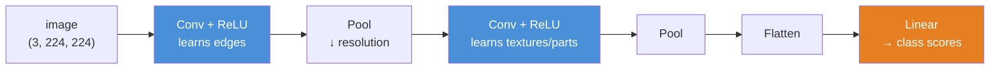
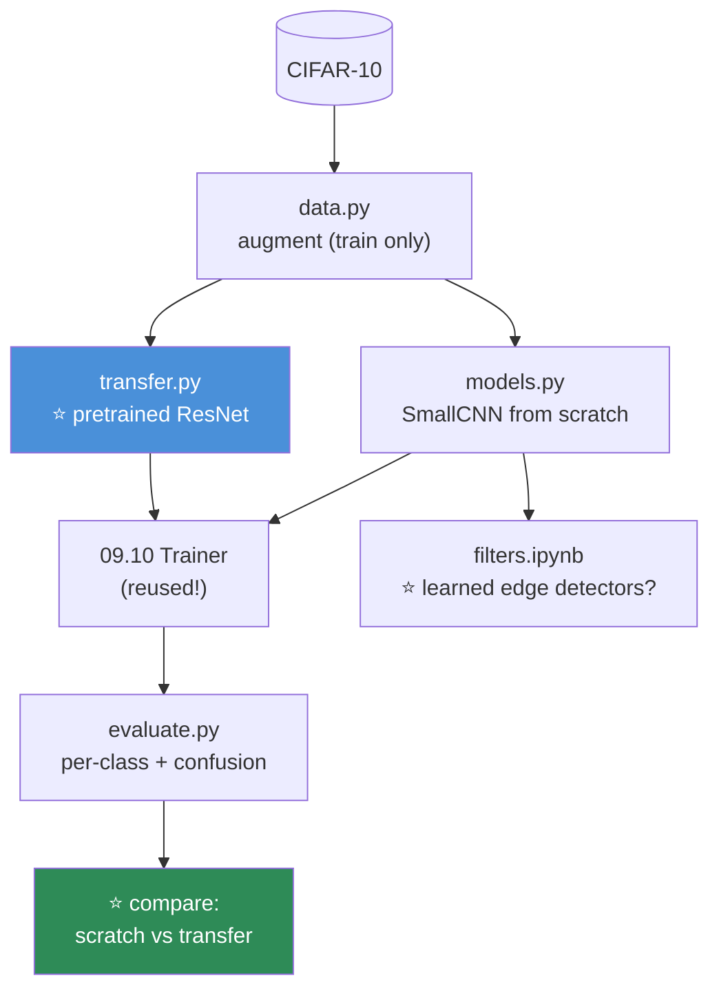

# 09.11 · Convolutional Neural Networks

[⬅ 09.10 The Training Loop](09.10-training-loop.md) · [🏠 Module 09](../README.md) · [➡ 09.12 Sequence Models](09.12-sequence-models.md)

> **The lesson in one line:** A convolution is a small pattern-detector slid across an image, sharing its weights everywhere — and that weight-sharing is the trick that made vision tractable, because an edge in the top-left corner is the same as an edge in the bottom-right.

---

## 🎯 Learning objectives

By the end of this lesson you can:

1. Explain **why** a fully-connected network fails on images, and how convolution fixes it.
2. Explain a **convolution** as a shared, sliding pattern-detector.
3. Compute output shapes from **kernel size, stride, and padding.**
4. Explain **pooling** and why it exists.
5. Build a working **image classifier** in PyTorch.
6. Explain **transfer learning** and why it's the practical default.

---

## 🧠 Mental model

> **Slide a small learned filter across the image. Wherever the filter's pattern appears, it lights up. Do that with many filters, stack the results, repeat — and you've learned the [edges → parts → objects](09.1-why-deep-learning.md) hierarchy.**



---

## 📐 Why not just use a fully-connected network?

A 224×224 RGB image has **150,528 pixels.** A single fully-connected layer of 1,000 neurons on that input has **150 million weights** — for *one layer.* And it would be a terrible model, for three reasons:

| Problem with FC on images | Why |
|---|---|
| **Too many parameters** | 150M weights per layer → overfits instantly, can't train |
| **No spatial structure** | Flattening throws away that neighbouring pixels are related |
| **Not translation-invariant** | A cat in the top-left and a cat in the bottom-right are *unrelated* inputs to an FC layer — it must learn "cat" separately at every position |

> [!IMPORTANT]
> **⭐ The killer problem is translation invariance. A cat is a cat wherever it appears in the image — but a fully-connected layer has to learn a separate detector for every position.** That's absurdly wasteful and needs absurdly much data.
>
> **Convolution's insight: use the SAME small filter at every position.** If you learn an edge-detector, you apply it everywhere — an edge in the corner and an edge in the center are detected by the identical weights. **This is called weight sharing, and it's the entire idea.** It cuts parameters by orders of magnitude *and* builds in translation invariance for free. **A cat detector learned in one place works everywhere.** This is why CNNs, not FC networks, cracked vision.

---

## 🔬 What a convolution actually does

**A convolution slides a small window (the *kernel* or *filter*) across the image. At each position, it computes a [dot product](../../06-Mathematics/weeks/06.2-linear-algebra-vectors-matrices.md) between the kernel's weights and the pixels underneath — one number, measuring how much that patch matches the kernel's pattern.** Slide it everywhere and you get a **feature map**: a grid showing where the pattern was found.

```
Image patch:        Kernel (an edge detector):    Output:
┌──┬──┬──┐          ┌──┬──┬──┐
│ 1│ 1│ 1│          │-1│-1│-1│                    dot product
├──┼──┼──┤    ⊙     ├──┼──┼──┤    →    Σ    =    of the two
│ 0│ 0│ 0│          │ 0│ 0│ 0│                    = "how much edge here?"
├──┼──┼──┤          ├──┼──┼──┤
│-1│-1│-1│          │ 1│ 1│ 1│
└──┴──┴──┘          └──┴──┴──┘
```

> [!TIP]
> **⭐ The kernel's weights ARE the pattern it detects — and they're learned, not designed.** A classic edge-detector kernel has negative weights on top and positive on the bottom, so it fires on horizontal edges. But you don't design these: **the network learns thousands of kernels by gradient descent**, and — exactly as [09.1](09.1-why-deep-learning.md) showed — the early ones become edge and color detectors, the middle ones textures and corners, the deep ones object parts. **Convolution is just the dot-product pattern-matching you already know ([09.2](09.2-neural-network-fundamentals.md)), applied with a sliding, weight-shared window.**

> 🖼️ **[IMAGE PLACEHOLDER: `assets/images/09-convolution.png`]**
> *An animated-style figure (or a filmstrip) showing a 3×3 kernel sliding across a 5×5 input image, computing one output value at each position. At each step: the kernel is highlighted over a 3×3 patch, an elementwise-multiply-then-sum is shown, and the result drops into the corresponding cell of a 3×3 output feature map. Below, a second panel shows the effect of stride 2 (the kernel jumps 2 cells → smaller output) and padding (a border of zeros → same-size output). Caption: "A convolution slides a shared filter across the image. Same weights everywhere = translation invariance. Kernel size, stride, and padding determine the output size."*

### Channels: many filters, stacked

An image has **3 input channels** (R, G, B). A conv layer applies **many filters** (say 64), each producing one feature map — so the output has **64 channels.** Each filter learns to detect a different pattern. **The next layer's filters then combine those 64 feature maps into higher-level patterns.** This is the [representation hierarchy](09.1-why-deep-learning.md) building itself.

---

## 📏 Output shapes — kernel, stride, padding

**Three knobs control the output size, and you must be able to compute it** (shape errors are the #1 CNN bug — [09.3](09.3-math-of-neural-networks.md)):

| Knob | What it does |
|---|---|
| **Kernel size** (e.g. 3×3) | The window size — how big a pattern each filter sees |
| **Stride** | How far the window jumps each step. Stride 2 → **half the output size** |
| **Padding** | A border of zeros around the input → keeps the output from shrinking |

$$\text{output size} = \left\lfloor\frac{\text{input} - \text{kernel} + 2\cdot\text{padding}}{\text{stride}}\right\rfloor + 1$$

```python
import torch.nn as nn

conv = nn.Conv2d(in_channels=3, out_channels=64, kernel_size=3, stride=1, padding=1)
# ⭐ kernel=3, stride=1, padding=1 → output SAME spatial size as input ("same" padding)

x = torch.randn(32, 3, 224, 224)     # (batch, channels, height, width) — ⭐ the NCHW convention
out = conv(x)
print(out.shape)                      # (32, 64, 224, 224)  — 64 channels, same H×W
```

> [!TIP]
> **⭐ The magic recipe: `kernel_size=3, stride=1, padding=1` keeps the spatial size unchanged.** This "3×3 same-padding conv" is the workhorse of modern CNNs — you stack many of them, and use pooling (or strided convs) to *deliberately* reduce size when you want to. **Memorize this recipe;** and note the shape convention: PyTorch images are **`(N, C, H, W)`** — batch, channels, height, width. Getting the channel dimension in the wrong place is a classic error.

---

## 🌊 Pooling — deliberate downsampling

**Pooling shrinks the feature maps** — it takes a window (say 2×2) and replaces it with one number (the max, for max-pooling). This:

| Benefit | Why |
|---|---|
| **Reduces computation** | Half the resolution → quarter the pixels |
| **Adds translation robustness** | A feature that shifts by 1 pixel still lands in the same pool |
| **Grows the receptive field** | Deeper neurons "see" a larger part of the original image |

```python
pool = nn.MaxPool2d(kernel_size=2, stride=2)     # 224×224 → 112×112
```

> [!NOTE]
> **Max-pooling is being replaced by strided convolutions in modern architectures** (a stride-2 conv both downsamples *and* learns, whereas pooling is a fixed operation). But pooling is still everywhere in existing models, conceptually clear, and worth understanding. **The trend: let the network learn the downsampling too, rather than hard-coding "take the max."**

---

## 🐍 A working image classifier

```python
import torch.nn as nn

class SmallCNN(nn.Module):
    def __init__(self, num_classes=10):
        super().__init__()
        self.features = nn.Sequential(
            nn.Conv2d(3, 32, 3, padding=1), nn.ReLU(), nn.MaxPool2d(2),   # 32×32 → 16×16
            nn.Conv2d(32, 64, 3, padding=1), nn.ReLU(), nn.MaxPool2d(2),  # 16×16 → 8×8
            nn.Conv2d(64, 128, 3, padding=1), nn.ReLU(), nn.MaxPool2d(2), # 8×8 → 4×4
        )
        self.classifier = nn.Sequential(
            nn.AdaptiveAvgPool2d(1),          # ⭐ (B, 128, 4, 4) → (B, 128, 1, 1), any input size
            nn.Flatten(),                     # → (B, 128)
            nn.Linear(128, num_classes),      # → (B, 10) logits (09.3)
        )

    def forward(self, x):
        x = self.features(x)                  # conv stack: learn features
        return self.classifier(x)             # pool + linear: classify

model = SmallCNN().to(device)
# ⭐ Then train it with the EXACT loop from 09.10. The model changed; the loop didn't.
```

> [!TIP]
> **⭐ `nn.AdaptiveAvgPool2d(1)` is a small trick worth knowing: it pools any spatial size down to 1×1, so your classifier works on any input image size** — no need to hardcode "the flattened dimension is 128×4×4 = 2048." It also has far fewer parameters than a giant flatten→linear, which reduces overfitting. **This "global average pooling" is standard in modern CNNs**, and it's why models like ResNet accept variable input sizes.
>
> And note the structure: a **feature extractor** (the conv stack) followed by a **classifier head** (pool + linear). This split is exactly what makes transfer learning possible.

---

## ⭐ Transfer learning — the practical default

**You almost never train a CNN from scratch. You take a network already trained on ImageNet (14M images) and adapt it to your task** ([09.1](09.1-why-deep-learning.md)).

```python
import torchvision.models as models

# ── Load a pretrained backbone ──────────────────────────────────
model = models.resnet50(weights='IMAGENET1K_V2')

# ── Option A: FEATURE EXTRACTION — freeze the backbone, train a new head ──
for param in model.parameters():
    param.requires_grad = False               # ⭐ freeze the pretrained features
model.fc = nn.Linear(model.fc.in_features, num_classes)   # ⭐ new head (trainable)
# Only model.fc trains — needs very little data, very fast

# ── Option B: FINE-TUNING — unfreeze some/all, train with a small LR ──
for param in model.parameters():
    param.requires_grad = True
optimizer = torch.optim.AdamW(model.parameters(), lr=1e-4)   # ⭐ SMALL lr — don't wreck the features
```

> [!IMPORTANT]
> **⭐ Transfer learning is the single most important practical technique in computer vision, and it's why [09.1](09.1-why-deep-learning.md)'s representation-learning lesson matters.** The early layers of an ImageNet model are **generic edge/texture detectors that work for any vision task** — medical scans, satellite images, your product photos. So you **reuse them** and only train a new head (or gently fine-tune).
>
> **The payoff:** a task that needs *millions* of images from scratch needs only *thousands* with transfer learning — because you're not learning "what an edge is" again, only "how to combine these features for my classes." **A CNN that gets 61% from scratch on 2,000 images can hit 90%+ with a pretrained backbone.** This is the answer to [09.1](09.1-why-deep-learning.md)'s exercise, and it's what you'll do in nearly every real project.
>
> **The rule of thumb:** small dataset + similar to ImageNet → **feature extraction** (freeze, train head). Larger dataset or different domain → **fine-tuning** (unfreeze, small LR). Always use a **small learning rate** when fine-tuning, or you'll destroy the carefully-learned features.

---

## 🏛️ The famous architectures (know the names)

| Architecture | Contribution |
|---|---|
| **LeNet** (1998) | The original CNN (handwritten digits) |
| **AlexNet** (2012) | Started the revolution — ReLU, dropout, GPUs ([09.1](09.1-why-deep-learning.md)) |
| **VGG** (2014) | Deep + simple (all 3×3 convs) |
| **ResNet** (2015) | ⭐ **Residual connections** (`x + f(x)`) → 152 layers trainable ([06.4](../../06-Mathematics/weeks/06.4-calculus.md)) |
| **EfficientNet** | Principled scaling of depth/width/resolution |
| **Vision Transformer (ViT)** | Applies attention to image patches — CNNs' modern challenger |

> [!NOTE]
> **ResNet's residual connection is the same gradient-highway idea from [06.4](../../06-Mathematics/weeks/06.4-calculus.md) and [09.4](09.4-backpropagation.md):** `x + f(x)` gives the gradient an unmultiplied path back, so 152-layer networks became trainable. **It's the single most important architectural idea in deep learning, and you'll see it in every model after 2015** — including Transformers. If you build one thing from this lesson, build a residual block and watch the gradient stop vanishing.

---

## ⚡ Performance & GPU considerations

| Fact | Consequence |
|---|---|
| **Convs are matmuls (via im2col)** | GPU-friendly; the whole reason CNNs need GPUs |
| **Feature maps dominate memory** | Early layers are large (224×224×64) → most of the activation cache |
| **Batch size limited by feature-map memory** | Not just parameters — the activations are the memory hog |
| **cuDNN** | NVIDIA's optimized conv kernels — PyTorch uses them automatically |
| **`torch.backends.cudnn.benchmark = True`** | Lets cuDNN pick the fastest conv algorithm (small speedup, fixed input sizes) |
| **Mixed precision** | Big win for CNNs ([09.14](09.14-performance.md)) |

---

## 🐛 Common mistakes

| Mistake | Consequence |
|---|---|
| **Fully-connected on raw images** | 150M params, overfits, no translation invariance |
| **Wrong channel order** | PyTorch is `(N, C, H, W)`. Getting it wrong → shape error |
| **Miscomputing conv output shape** | Shape error at the flatten. Use the formula |
| **Training from scratch on small data** | ⭐ **Use transfer learning** |
| **Large LR when fine-tuning** | Destroys the pretrained features. Use ~1e-4 |
| **Forgetting to freeze/unfreeze correctly** | Training the whole backbone when you meant to train the head |
| **Not normalizing with ImageNet stats** (transfer) | Input distribution mismatch → bad transfer ([09.9](09.9-data-loading.md)) |
| **Hardcoding the flatten dimension** | Breaks on different input sizes. Use `AdaptiveAvgPool2d` |

---

## 📝 Exercises

**Conceptual**
1. Why does a fully-connected layer fail on images? Give the three reasons. **Which is the killer?**
2. Explain weight sharing. How does it give translation invariance *and* fewer parameters?
3. Compute the output shape of `Conv2d(3, 32, kernel=5, stride=2, padding=1)` on a 224×224 input. Use the formula.
4. What does pooling do, and why? What's replacing it in modern architectures?
5. Explain transfer learning. When do you freeze the backbone vs fine-tune?

**Implementation**
6. Build `SmallCNN` and train it on **CIFAR-10** with your [09.10](09.10-training-loop.md) trainer. Report test accuracy.
7. Visualize the **first-layer filters** of your trained model. Do they look like edge detectors? ([09.1](09.1-why-deep-learning.md))
8. ⭐ **Transfer learning**: take a pretrained ResNet, replace the head, freeze the backbone, and fine-tune on a small dataset (e.g. a few hundred images of two classes). **Compare its accuracy to `SmallCNN` trained from scratch on the same data.** The gap is the lesson.
9. Compute and print the output shape after **every** layer of your CNN. Verify against the formula.
10. Build a residual block. Train a deep CNN with and without residuals. **Plot the layer-1 gradient magnitude** — show residuals keep it alive ([09.4](09.4-backpropagation.md)).

**Debugging**
11. Feed a `(B, H, W, C)` tensor (wrong channel order) to a `Conv2d`. Read the error. Fix it with `.permute()`.
12. Your CNN's loss won't drop. Run the overfit-one-batch test ([09.10](09.10-training-loop.md)). Then check: right input normalization? Right channel order? Sane LR?

---

## 🛠️ Mini project — *CIFAR-10 Image Classifier*

Build `code/09-deep-learning/cifar-classifier/` — a real image classifier, from a custom CNN and via transfer learning, with the two compared honestly.

**Requirements**
- A **custom CNN** trained from scratch on CIFAR-10.
- A **transfer-learning** version (pretrained ResNet, fine-tuned).
- **Reuse the [09.10](09.10-training-loop.md) trainer** — don't rewrite the loop.
- **Data augmentation** (train only — [09.9](09.9-data-loading.md)).
- **Honest evaluation**: per-class accuracy, confusion matrix, CI ([08.12](../../08-Machine-Learning/weeks/08.12-evaluation.md)).

```
cifar-classifier/
├── README.md
├── src/
│   ├── data.py           # CIFAR-10 + augmentation (train only)
│   ├── models.py         # ⭐ SmallCNN + ResidualCNN
│   ├── transfer.py       # ⭐ pretrained ResNet, frozen/fine-tuned
│   ├── train.py          # uses the 09.10 Trainer
│   └── evaluate.py       # per-class acc, confusion matrix (08.12)
├── tests/
│   ├── test_shapes.py    # conv output shapes are correct
│   └── test_overfit.py   # ⭐ overfits one batch (09.10)
└── notebooks/
    └── filters.ipynb     # ⭐ visualize learned filters
```

**Architecture**



**Implementation guidance**
1. **⭐ The comparison is the deliverable.** Train `SmallCNN` from scratch and a fine-tuned ResNet on the *same* CIFAR-10 data, and report both accuracies **with confidence intervals** ([08.12](../../08-Machine-Learning/weeks/08.12-evaluation.md)). The transfer version will win, and win faster — **that gap is the empirical proof of [09.1](09.1-why-deep-learning.md)'s representation-learning claim.** Then reduce the training set to 1,000 images and re-run: the transfer gap *widens dramatically*, because transfer learning shines when data is scarce. **That second experiment is the one that will stick with you.**
2. **Reuse the [09.10](09.10-training-loop.md) Trainer verbatim.** This is the whole point of building it — you change `SmallCNN` to `ResNet`, and the loop, checkpointing, early stopping, and logging all just work. **Nobody rewrites the training loop per model**, and proving that to yourself here cements the [09.10](09.10-training-loop.md) lesson.
3. **`filters.ipynb` closes the loop back to [09.1](09.1-why-deep-learning.md).** Visualize your trained model's first-layer filters. **They will look like oriented edge and color detectors** — the same generic features that OpenAI Microscope shows, learned by *your* network from CIFAR. Seeing your own model discover edge-detection from scratch is genuinely satisfying and makes representation learning concrete.
4. **`evaluate.py` slices by class.** A confusion matrix reveals *which* classes the model confuses (cats and dogs; cars and trucks) — far more informative than a single accuracy number ([08.12](../../08-Machine-Learning/weeks/08.12-evaluation.md)).

**Testing plan:** `test_shapes` (conv output shapes match the formula), `test_overfit` (the model overfits one batch — [09.10](09.10-training-loop.md)).

**Evaluation:** scratch vs transfer accuracy (with CIs), per-class confusion matrix, and the filter visualizations. **The deliverable is a real, working image classifier and the transfer-learning intuition.**

**Future improvements:** try test-time augmentation; try a ViT and compare; add Grad-CAM (visualize *where* the model is looking) — a beautiful interpretability tool for CNNs.

---

## 📄 Cheat sheet

| | |
|---|---|
| **Why not FC on images** | 150M params, no spatial structure, **no translation invariance** |
| **⭐ Convolution** | Slide a shared filter; dot-product each patch → feature map |
| **⭐ Weight sharing** | Same filter everywhere → translation invariance + few params |
| **Kernel/stride/padding** | Window size / jump / border. Output = ⌊(in − k + 2p)/s⌋ + 1 |
| **⭐ The recipe** | `Conv2d(c, c', 3, stride=1, padding=1)` → same spatial size |
| **Shape convention** | `(N, C, H, W)` — batch, channels, height, width |
| **Pooling** | Downsample; robustness + bigger receptive field (being replaced by strided conv) |
| **`AdaptiveAvgPool2d(1)`** | Any spatial size → 1×1; works on any input size |
| **⭐ Transfer learning** | Reuse a pretrained backbone; train from 1000s not millions of images |
| **Freeze vs fine-tune** | Small/similar data → freeze; larger/different → fine-tune (**small LR!**) |
| **ResNet** | Residual `x + f(x)` → 152 layers trainable |

---

## 🎴 Flashcards

- **Q:** ⭐ Why does a fully-connected network fail on images? → **A:** Too many parameters (150M/layer), no spatial structure, and — the killer — **no translation invariance** (a cat in the corner and the center are unrelated inputs, so it learns "cat" separately at every position).
- **Q:** ⭐ What is weight sharing and why does it matter? → **A:** A convolution applies the **same small filter at every position.** This gives **translation invariance** (a pattern detected anywhere by the same weights) *and* cuts parameters by orders of magnitude. It's the entire idea behind CNNs.
- **Q:** What does a convolution compute? → **A:** A **dot product** between a small learned filter and each image patch, slid across the whole image → a **feature map** showing where the filter's pattern appears. **The filter's weights ARE the learned pattern.**
- **Q:** What's the "same-padding" recipe? → **A:** `kernel_size=3, stride=1, padding=1` → **output has the same spatial size as the input.** The workhorse of modern CNNs.
- **Q:** What does pooling do? → **A:** **Downsamples** feature maps (e.g. 2×2 max). Reduces computation, adds translation robustness, grows the receptive field. **Being replaced by strided convolutions** (which learn the downsampling).
- **Q:** ⭐ What is transfer learning, and why is it the default? → **A:** Take a network pretrained on ImageNet, reuse its **generic early-layer features** (edges/textures work for any vision task), and train a new head. **Needs thousands of images instead of millions** — a from-scratch 61% becomes 90%+. The single most important practical CV technique.
- **Q:** Freeze the backbone or fine-tune? → **A:** **Small/similar-to-ImageNet data → freeze** (feature extraction, train head only). **Larger/different domain → fine-tune** (unfreeze, **small LR** to avoid destroying the features).
- **Q:** What is ResNet's key idea? → **A:** **Residual connections** `x + f(x)` — a gradient highway that made 152-layer networks trainable. The same idea from [06.4](../../06-Mathematics/weeks/06.4-calculus.md), and it's in every model after 2015 (including Transformers).

---

## 💼 Interview questions

1. **⭐ "Why do we use CNNs instead of fully-connected networks for images?"** — **Translation invariance and weight sharing.** A shared filter detects a pattern anywhere with the same weights — far fewer parameters, and a cat detector works everywhere. FC layers would need to learn "cat" at every position.
2. **"What does a convolution compute, and what determines the output size?"** — A dot product of a filter with each patch → a feature map. Output size = ⌊(input − kernel + 2·padding)/stride⌋ + 1. The 3×3-stride1-pad1 recipe preserves size.
3. **⭐ "You have 2,000 images. How would you build a classifier?"** — **Transfer learning.** A pretrained backbone (ResNet), freeze it, train a new head — or fine-tune with a small LR. Training from scratch on 2,000 images would badly underperform.
4. **"When would you freeze the backbone vs fine-tune it?"** — Freeze for small datasets similar to ImageNet (feature extraction); fine-tune for larger or different-domain data, always with a **small learning rate.**
5. **"What's ResNet's contribution?"** — Residual connections (`x + f(x)`), a gradient highway that made very deep networks trainable. It's in every modern architecture, including Transformers.

---

## 📚 Summary

- **A fully-connected network fails on images** — 150M parameters per layer, no spatial structure, and no translation invariance (it must learn "cat" separately at every position).
- **⭐ Convolution fixes this with weight sharing:** slide the **same** small filter across the whole image. A pattern is detected anywhere by the identical weights → **translation invariance and orders-of-magnitude fewer parameters.** This is why CNNs cracked vision.
- **A convolution is dot-product pattern-matching with a sliding window** ([09.2](09.2-neural-network-fundamentals.md)). The filter's weights *are* the learned pattern, and stacking conv layers builds the [edges → parts → objects](09.1-why-deep-learning.md) hierarchy — **the same representation learning, made concrete.**
- **Kernel size, stride, and padding determine the output shape** (`⌊(in − k + 2p)/s⌋ + 1`); the `3×3-stride1-pad1` recipe preserves size. **Pooling** downsamples (being replaced by strided convs). The shape convention is `(N, C, H, W)`.
- **⭐ Transfer learning is the practical default and the payoff of [09.1](09.1-why-deep-learning.md).** Reuse a pretrained backbone's generic early features and train a new head — thousands of images instead of millions. Freeze for small/similar data; fine-tune (small LR!) otherwise.
- **ResNet's residual connection** (`x + f(x)`) is the gradient highway from [06.4](../../06-Mathematics/weeks/06.4-calculus.md), and it's in every model since — including Transformers.
- **⭐ You train a CNN with the exact [09.10](09.10-training-loop.md) loop — the model changed, the loop didn't.**

**Next:** [09.12 Sequence Models](09.12-sequence-models.md) — RNNs, LSTMs, and the specific limitations that led directly to the Transformer.

---

## 🔗 References

- LeCun et al. (1998) — *Gradient-Based Learning Applied to Document Recognition* (**LeNet**).
- Krizhevsky et al. (2012) — **AlexNet**; He et al. (2015) — **ResNet** (residual connections).
- **CS231n — *Convolutional Neural Networks for Visual Recognition*** (Stanford, free). ⭐ The definitive course; the conv arithmetic and intuition come from here.
- Dosovitskiy et al. (2020) — *An Image is Worth 16×16 Words* (**ViT**) — CNNs' modern challenger.
- torchvision — [models & transfer learning tutorial](https://pytorch.org/tutorials/beginner/transfer_learning_tutorial.html).
- [09.1 Why Deep Learning?](09.1-why-deep-learning.md) — representation learning, which this lesson makes concrete.

---

## 🧭 Navigation

| Direction | Link |
|---|---|
| ⬅ Previous | [09.10 The Training Loop](09.10-training-loop.md) |
| ➡ Next | [09.12 Sequence Models](09.12-sequence-models.md) |
| 🏠 Module | [Module 09](../README.md) |
| 🗺 Roadmap | [ROADMAP.md](../../../ROADMAP.md) |
