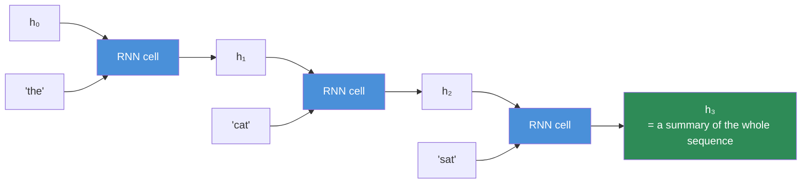
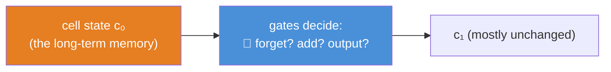
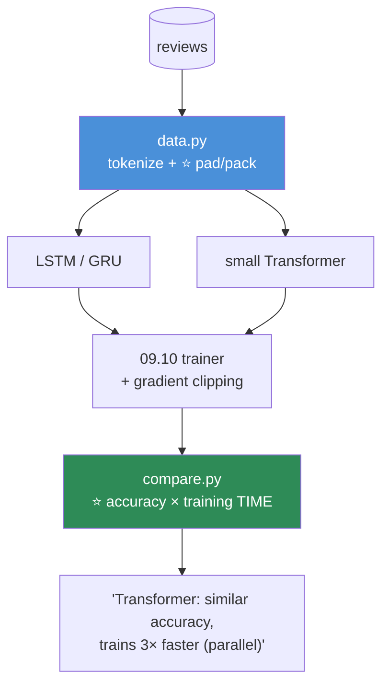

# 09.12 · Sequence Models — RNN, LSTM, GRU

[⬅ 09.11 CNNs](09.11-cnns.md) · [🏠 Module 09](../README.md) · [➡ 09.13 Regularization](09.13-regularization.md)

> **The lesson in one line:** A recurrent network processes a sequence one step at a time, carrying a memory forward — an elegant idea with two fatal flaws (it forgets, and it can't parallelize) that led directly to the Transformer.

---

## 🎯 Learning objectives

By the end of this lesson you can:

1. Explain a **recurrent neural network** as a loop that carries a hidden state.
2. Explain **why vanilla RNNs forget** — and how LSTM/GRU gates fix it.
3. Explain the **two limitations that killed RNNs** — and why they led to Transformers.
4. Build a working sequence model in PyTorch (`nn.LSTM`).
5. Handle **variable-length sequences** (padding, packing).
6. Understand *why* [06.11](../../06-Mathematics/weeks/06.11-transformer-math.md)'s attention exists — from the failures it fixed.

---

## 🧠 Mental model

> **A CNN sees the whole image at once. An RNN reads a sequence one token at a time, updating a running "memory" (the hidden state) at each step — like reading a sentence word by word and updating your understanding.**



**The same cell (the same weights) is applied at every step** — weight sharing again ([09.11](09.11-cnns.md)), now across *time* instead of space. The hidden state $h_t$ is the network's memory of everything it has read so far.

---

## 📐 The vanilla RNN

$$h_t = \tanh(W_h h_{t-1} + W_x x_t + b)$$

**Read it as: the new memory is a blend of the old memory ($h_{t-1}$) and the current input ($x_t$).** One matrix mixes the past, another mixes the present, and `tanh` squashes ([09.2](09.2-neural-network-fundamentals.md)). Apply it token by token, and the final $h_t$ is a summary of the whole sequence — which you can feed to a classifier (sentiment) or use to generate the next token (language modelling).

```python
import torch.nn as nn

rnn = nn.RNN(input_size=128, hidden_size=256, batch_first=True)
x = torch.randn(32, 10, 128)          # (batch, sequence_length, features)
output, h_n = rnn(x)
print(output.shape, h_n.shape)         # (32, 10, 256) all steps; (1, 32, 256) final state
```

---

## ⚠️ Why vanilla RNNs forget — the vanishing gradient, again

> [!IMPORTANT]
> **⭐ Vanilla RNNs can't remember anything from more than ~10 steps ago — and the reason is exactly the vanishing gradient problem from [09.4](09.4-backpropagation.md).**
>
> To learn a dependency across the sequence (e.g. "the cat, which was grey and had been sleeping all day, **was** tired" — matching "was" to "cat" 12 words back), the gradient must flow *backward through every intermediate step.* But backprop-through-time **multiplies the same recurrent weight matrix at every step** ([06.10](../../06-Mathematics/weeks/06.10-neural-network-math.md)) — so the gradient shrinks (or explodes) exponentially with distance. After ~10 steps, $\lambda^{10} \approx 0$: **the signal from far-back words vanishes, so the network literally cannot learn long-range dependencies.**
>
> This is the same $\lambda^n$ table from [09.4](09.4-backpropagation.md), now unfolding across *time* rather than layers. **A vanilla RNN has the memory of a goldfish**, and that's a fatal problem for language, where meaning routinely depends on words far apart.

---

## 🚪 LSTM & GRU — gates that protect the memory

**LSTM (Long Short-Term Memory) fixes forgetting with a clever addition: a separate "cell state" that information can flow along nearly unchanged, controlled by learned *gates*.**



| Gate | Decides |
|---|---|
| **Forget gate** | What to erase from memory |
| **Input gate** | What new information to store |
| **Output gate** | What to read out of memory |

> [!IMPORTANT]
> **⭐ The LSTM's key insight: the cell state has a nearly-uninterrupted path through time, so gradients can flow across many steps without vanishing.** It's the *same idea as ResNet's residual connection* ([09.11](09.11-cnns.md)) and the gradient highway from [06.4](../../06-Mathematics/weeks/06.4-calculus.md) — **a path where information (and gradient) travels without being repeatedly multiplied down.** The gates learn *when* to remember and *when* to forget, so an LSTM can hold onto "the subject was singular" across 50 words. **LSTMs extended usable memory from ~10 steps to ~100s** — and powered a decade of machine translation, speech recognition, and text generation before Transformers.
>
> **GRU (Gated Recurrent Unit)** is a simpler LSTM — two gates instead of three, no separate cell state. **Nearly as good, fewer parameters, faster.** In practice, try both; GRU is often the better default for smaller data.

```python
lstm = nn.LSTM(input_size=128, hidden_size=256, num_layers=2, batch_first=True, dropout=0.2)
output, (h_n, c_n) = lstm(x)          # ⭐ LSTM returns hidden AND cell state
```

---

## ⭐ Why RNNs lost to Transformers — the two fatal flaws

**LSTMs were the state of the art for years. Then in 2017 the Transformer ([06.11](../../06-Mathematics/weeks/06.11-transformer-math.md)) replaced them almost entirely. Understanding *why* is the point of this lesson.**

> [!IMPORTANT]
> **⭐ RNNs have two fundamental limitations, and the Transformer fixes both:**
>
> **1 · They're inherently SEQUENTIAL — they can't parallelize.**
> An RNN *must* compute $h_1$ before $h_2$ before $h_3$ — each step depends on the previous one. **You cannot process a 1,000-word sequence in parallel; you must march through it one step at a time.** On a GPU — a massively parallel machine ([09.6](09.6-pytorch-tensors.md)) — this is a catastrophe: the hardware sits mostly idle. **A Transformer processes every position simultaneously** (attention is one big matmul — [06.11](../../06-Mathematics/weeks/06.11-transformer-math.md)), so it uses the GPU fully and trains *far* faster. **This is the killer flaw — it's why you can train a Transformer on the whole internet and never an RNN.**
>
> **2 · Even LSTMs struggle with VERY long dependencies.**
> Gates extended memory from ~10 to ~100s of steps, but a word 500 tokens back still has to survive being partially forgotten at every intermediate step. **Attention gives every position a *direct* connection to every other position** ([06.11](../../06-Mathematics/weeks/06.11-transformer-math.md)) — no marching, no gradual forgetting. The path length between any two tokens is **1**, not the distance between them.
>
> **The Transformer's slogan "Attention Is All You Need" is literally a rejection of recurrence.** It said: throw away the sequential loop entirely, connect everything to everything with attention, and you get better long-range modelling *and* full parallelism. **Recurrence was the bottleneck; attention removed it.** *(And attention's cost is O(n²) — [06.11](../../06-Mathematics/weeks/06.11-transformer-math.md) — which is the trade-off that long-context research still fights.)*

| | **RNN / LSTM** | **Transformer** |
|---|---|---|
| Processing | ⚠️ **Sequential** (one step at a time) | ⭐ **Parallel** (all positions at once) |
| Long-range | 🟡 LSTM: ~100s of steps | ⭐ **Direct** (any distance, path length 1) |
| GPU utilization | ❌ Poor (can't parallelize) | ✅ Full (it's matmul) |
| Cost | O(n) | O(n²) in sequence length |
| Status in 2026 | Legacy | ⭐ **Dominant** (every LLM) |

---

## 🐍 A working sentiment classifier

```python
class SentimentLSTM(nn.Module):
    def __init__(self, vocab_size, embed_dim=128, hidden=256, num_classes=2):
        super().__init__()
        self.embed = nn.Embedding(vocab_size, embed_dim)     # ⭐ tokens → vectors (06.11)
        self.lstm = nn.LSTM(embed_dim, hidden, batch_first=True)
        self.fc = nn.Linear(hidden, num_classes)

    def forward(self, x):                                     # x: (B, seq) token ids
        emb = self.embed(x)                                   # (B, seq, embed_dim)
        _, (h_n, _) = self.lstm(emb)                          # h_n: (1, B, hidden) — final state
        return self.fc(h_n.squeeze(0))                        # (B, num_classes) logits

# ⭐ Train it with the EXACT 09.10 loop. The model changed; the loop didn't.
```

> [!TIP]
> **`nn.Embedding` is a lookup table: it maps each token id to a learned dense vector** ([06.11](../../06-Mathematics/weeks/06.11-transformer-math.md)). It's how discrete text becomes something a network can process — and it's the same `nn.Embedding` that sits at the bottom of every LLM. The embeddings are learned by gradient descent alongside everything else.

---

## 🧩 Variable-length sequences — padding & packing

**Sequences have different lengths, but a batch is a rectangular tensor. You pad short sequences to the batch's max length:**

```python
from torch.nn.utils.rnn import pad_sequence, pack_padded_sequence

# ── pad a batch to uniform length (in a collate_fn — 09.9) ──────
padded = pad_sequence(batch_of_sequences, batch_first=True)   # shorter seqs get 0-padding

# ── pack: tell the LSTM to IGNORE the padding ───────────────────
packed = pack_padded_sequence(padded, lengths, batch_first=True, enforce_sorted=False)
output, _ = lstm(packed)          # ⭐ the LSTM skips padded positions
```

> [!CAUTION]
> **⭐ If you don't "pack" padded sequences, the LSTM processes the padding tokens as if they were real** — the padding contaminates the hidden state, and your model learns from meaningless zeros. **`pack_padded_sequence` tells the LSTM where each sequence actually ends** so it ignores the padding. This is a real, subtle bug: your model trains, but slightly wrong, because it's paying attention to padding. (Transformers handle this more cleanly with an *attention mask* — [06.11](../../06-Mathematics/weeks/06.11-transformer-math.md).)

---

## ⚡ Performance & GPU considerations

| Fact | Consequence |
|---|---|
| **RNNs are sequential** | ⚠️ Can't parallelize over time → poor GPU utilization (the fatal flaw) |
| **cuDNN fused RNN kernels** | `nn.LSTM` uses optimized kernels — much faster than a hand-rolled loop |
| **Padding wastes compute** | A batch padded to the longest sequence wastes work on short ones. Pack, or sort by length |
| **Gradient clipping is essential** | RNNs are prone to **exploding** gradients ([09.14](09.14-performance.md)) |
| **Truncated BPTT** | For very long sequences, backprop through a limited window to save memory |

> [!TIP]
> **⭐ Gradient clipping is nearly mandatory for RNNs.** Because backprop-through-time multiplies the recurrent weights many times, gradients frequently *explode* ([09.4](09.4-backpropagation.md)) → `NaN`. **`torch.nn.utils.clip_grad_norm_(model.parameters(), max_norm=1.0)`** caps the gradient magnitude and rescues the run. You'll meet clipping properly in [09.14](09.14-performance.md), but for RNNs specifically, expect to need it.

---

## 🐛 Common mistakes

| Mistake | Consequence |
|---|---|
| **Expecting a vanilla RNN to remember long-range** | It forgets after ~10 steps. Use LSTM/GRU |
| **Not packing padded sequences** | ⭐ The LSTM learns from padding tokens |
| **No gradient clipping** | RNNs explode → `NaN` |
| **Wrong tensor shape** | `nn.RNN` expects `(seq, batch, feat)` unless `batch_first=True` |
| **Forgetting `nn.Embedding`** | Feeding raw token ids to an LSTM |
| **Using an RNN when a Transformer would win** | For most NLP in 2026, a Transformer is better |
| **Sorting-related packing bugs** | `enforce_sorted=False` if your batch isn't length-sorted |

---

## 📝 Exercises

**Conceptual**
1. Explain an RNN's hidden state. What does it represent?
2. ⭐ **Why do vanilla RNNs forget?** Connect it to the vanishing-gradient table from [09.4](09.4-backpropagation.md), unfolded across time.
3. How do LSTM gates fix forgetting? What's the analogy to a residual connection?
4. ⭐ **State the two fatal limitations of RNNs that led to Transformers.** Which is the killer, and why?
5. Why can a Transformer process a sequence in parallel but an RNN can't?

**Implementation**
6. Build `SentimentLSTM` and train it on a text dataset (IMDB) with your [09.10](09.10-training-loop.md) trainer. Report accuracy.
7. Swap `nn.LSTM` for `nn.GRU` and for `nn.RNN`. **Compare accuracy and training time.** Which forgets most?
8. Implement a `collate_fn` that pads a batch of variable-length sequences. Verify the LSTM handles it with packing.
9. ⭐ **Demonstrate the packing bug**: train once without packing (LSTM sees padding) and once with. **Show the accuracy difference.**
10. Add **gradient clipping** to an RNN training run. Remove it and show the loss goes to `NaN` on a longer sequence.

**Comparison**
11. On the same text task, compare an LSTM against a small Transformer (`nn.TransformerEncoder`). **Report accuracy AND training time.** Which trains faster, and why?
12. Construct a task with a long-range dependency (the label depends on the first and last token, 100 tokens apart). **Show the LSTM struggles and attention doesn't.**

---

## 🛠️ Mini project — *The Sentiment Classifier*

Build `code/09-deep-learning/sentiment-lstm/` — a text classifier, plus the RNN-vs-Transformer comparison that motivates the next era.

**Requirements**
- An LSTM sentiment classifier on real reviews (IMDB or similar).
- **Correct padding/packing** for variable-length sequences.
- **Gradient clipping** in the training loop.
- **A comparison** against a small Transformer — accuracy and training speed.
- **Reuse the [09.10](09.10-training-loop.md) trainer.**

```
sentiment-lstm/
├── README.md
├── src/
│   ├── data.py           # tokenize; ⭐ collate_fn with padding
│   ├── models.py         # ⭐ LSTM + GRU + a small Transformer
│   ├── train.py          # 09.10 trainer + gradient clipping
│   └── compare.py        # ⭐ LSTM vs Transformer: acc & speed
├── tests/
│   ├── test_packing.py   # ⭐ padding is ignored
│   └── test_overfit.py   # overfits one batch (09.10)
└── notebooks/
```

**Architecture**



**Implementation guidance**
1. **⭐ `compare.py` is the deliverable, and it's the bridge to [Module 10](../../10-NLP/README.md).** Train an LSTM and a small Transformer on the *same* data, and report **accuracy AND wall-clock training time.** You'll likely find similar accuracy but the **Transformer trains substantially faster** — because it parallelizes over the sequence while the LSTM marches through it ([09.6](09.6-pytorch-tensors.md)). **That speed gap, measured with your own stopwatch, is the empirical reason the field abandoned recurrence.** It makes [06.11](../../06-Mathematics/weeks/06.11-transformer-math.md)'s "attention is all you need" concrete.
2. **`test_packing.py` catches the padding bug.** Build a batch with very different sequence lengths, and assert the model's output for a short sequence is identical whether or not extra padding is appended. **Without packing, it won't be — the padding leaks into the hidden state.** This test encodes a subtle, real bug.
3. **Gradient clipping goes in the training step** (`clip_grad_norm_` after `backward()`, before `step()`). Show a run that `NaN`s without it and succeeds with it — RNNs make this failure easy to reproduce.
4. **Reuse the [09.10](09.10-training-loop.md) trainer** — same lesson as the CNN project. The model is completely different (recurrent, not convolutional), and the loop is unchanged.

**Testing plan:** `test_packing` (padding ignored), `test_overfit` (overfits one batch).

**Evaluation:** LSTM/GRU/Transformer accuracy with CIs, and the training-time comparison. **The deliverable is a working text classifier and a *felt* understanding of why Transformers won.**

**Future improvements:** use pretrained embeddings (GloVe) or a pretrained Transformer (a preview of [Module 10](../../10-NLP/README.md)); add attention visualization for the Transformer.

---

## 📄 Cheat sheet

| | |
|---|---|
| **RNN** | $h_t = \tanh(W_h h_{t-1} + W_x x_t + b)$ — carry a memory, one step at a time |
| **Hidden state** | The memory of everything read so far |
| **⭐ Vanilla RNN forgets** | Vanishing gradient across time — ~10 steps max |
| **⭐ LSTM/GRU** | Gates + a protected cell state → memory across ~100s of steps (a gradient highway) |
| **GRU** | Simpler LSTM (2 gates) — often the better default |
| **⭐ Why Transformers won** | RNNs are **sequential (can't parallelize)** + struggle with very long range. Attention fixes both |
| **`nn.Embedding`** | Tokens → learned vectors |
| **Shape** | `(batch, seq, feat)` with `batch_first=True` |
| **⭐ Packing** | `pack_padded_sequence` so the LSTM ignores padding |
| **⭐ Clip gradients** | RNNs explode — `clip_grad_norm_` is nearly mandatory |
| **Status 2026** | Legacy — every LLM is a Transformer |

---

## 🎴 Flashcards

- **Q:** What is an RNN's hidden state? → **A:** Its **memory** — a running summary of everything read so far, updated at each step by the same shared cell (weight sharing across time).
- **Q:** ⭐ Why do vanilla RNNs forget? → **A:** **The vanishing gradient across time.** Backprop-through-time multiplies the recurrent weights at every step, so the gradient from far-back tokens shrinks to zero after ~10 steps. Same $\lambda^n$ problem as depth ([09.4](09.4-backpropagation.md)), unfolded across time.
- **Q:** How do LSTMs fix forgetting? → **A:** A **protected cell state** that information flows along nearly unchanged, plus learned **gates** (forget/input/output) that decide what to remember. It's a gradient highway — the same idea as a residual connection — extending memory to ~100s of steps.
- **Q:** GRU vs LSTM? → **A:** GRU is a **simpler LSTM** (2 gates, no separate cell state) — nearly as good, fewer parameters, faster. Often the better default for smaller data.
- **Q:** ⭐ What are the two limitations that killed RNNs? → **A:** **(1) They're sequential — can't parallelize** (must compute step by step, wasting the GPU) — the killer. **(2) Even LSTMs struggle with very long dependencies.** Attention fixes both: parallel processing + a direct path between any two positions.
- **Q:** Why can a Transformer parallelize but an RNN can't? → **A:** An RNN's step *t* needs step *t−1* first — an unavoidable sequential dependency. A Transformer's attention processes **all positions at once** (one big matmul), fully using the parallel GPU.
- **Q:** ⭐ Why must you "pack" padded sequences? → **A:** Otherwise the LSTM **processes the padding tokens as real input**, contaminating the hidden state. `pack_padded_sequence` tells it where each sequence ends. (Transformers use an attention mask instead.)
- **Q:** Why do RNNs need gradient clipping? → **A:** Backprop-through-time multiplies the recurrent weights many times → gradients frequently **explode** → `NaN`. `clip_grad_norm_` caps them.

---

## 💼 Interview questions

1. **⭐ "Why did Transformers replace RNNs?"** — Two reasons: **RNNs are sequential (can't parallelize → waste the GPU → can't scale)** and struggle with very long dependencies. **Attention processes all positions in parallel with a direct path between any two.** The parallelism is the killer — it's why you can train a Transformer on the whole internet.
2. **"Why do vanilla RNNs forget?"** — Vanishing gradient across time — backprop-through-time multiplies the recurrent weight at every step. LSTM/GRU gates and a protected cell state fix it (a gradient highway).
3. **"LSTM vs GRU?"** — GRU is simpler (2 gates), nearly as good, faster — often the better default. LSTM has a separate cell state and three gates.
4. **"How do you handle variable-length sequences?"** — Pad to the batch max, then **pack** (`pack_padded_sequence`) so the RNN ignores padding. Transformers use an attention mask.
5. **"Would you use an LSTM today?"** — Rarely for NLP — a Transformer is better and parallelizes. LSTMs still appear in some time-series and low-latency streaming settings, but the field has moved to attention.

---

## 📚 Summary

- **An RNN reads a sequence one step at a time, carrying a hidden state (its memory), applying the same cell at every step** — weight sharing across time.
- **⭐ Vanilla RNNs forget after ~10 steps** — the vanishing gradient from [09.4](09.4-backpropagation.md), unfolded across time (backprop-through-time multiplies the recurrent weights repeatedly).
- **LSTM and GRU fix forgetting with gates and a protected cell state** — a gradient highway (the same idea as a residual connection) that extends usable memory to hundreds of steps. GRU is a simpler, often-better default.
- **⭐ Two fatal flaws killed RNNs: they're sequential (can't parallelize, so they waste the GPU and can't scale) and even LSTMs struggle with very long range.** The Transformer fixes both — attention processes all positions in parallel with a direct path between any two ([06.11](../../06-Mathematics/weeks/06.11-transformer-math.md)). **"Attention is all you need" is a literal rejection of recurrence**, and the parallelism is the killer.
- **Handle variable-length sequences by padding and packing** (`pack_padded_sequence`), or the LSTM learns from padding. **RNNs need gradient clipping** — they explode easily.
- **You train a sequence model with the exact [09.10](09.10-training-loop.md) loop** — the model is recurrent, not convolutional, and the loop is unchanged.

**Next:** [09.13 Regularization](09.13-regularization.md) — dropout, batch norm, weight decay, and augmentation: how to make a deep network generalize instead of memorize.

---

## 🔗 References

- Hochreiter & Schmidhuber (1997) — *Long Short-Term Memory* (**LSTM**). The paper.
- Cho et al. (2014) — *Learning Phrase Representations* (**GRU**).
- **Vaswani et al. (2017) — *Attention Is All You Need*** (**the Transformer**). ⭐ Read the intro's critique of recurrence — it's this lesson.
- Olah — *Understanding LSTM Networks* (colah's blog). ⭐ The single best visual explanation of LSTM gates.
- Karpathy — *The Unreasonable Effectiveness of Recurrent Neural Networks* (blog) — a snapshot of the RNN era, and why it was exciting.
- [06.11 Transformer Math](../../06-Mathematics/weeks/06.11-transformer-math.md) — attention, derived; the thing that replaced everything here.

---

## 🧭 Navigation

| Direction | Link |
|---|---|
| ⬅ Previous | [09.11 CNNs](09.11-cnns.md) |
| ➡ Next | [09.13 Regularization](09.13-regularization.md) |
| 🏠 Module | [Module 09](../README.md) |
| 🗺 Roadmap | [ROADMAP.md](../../../ROADMAP.md) |
