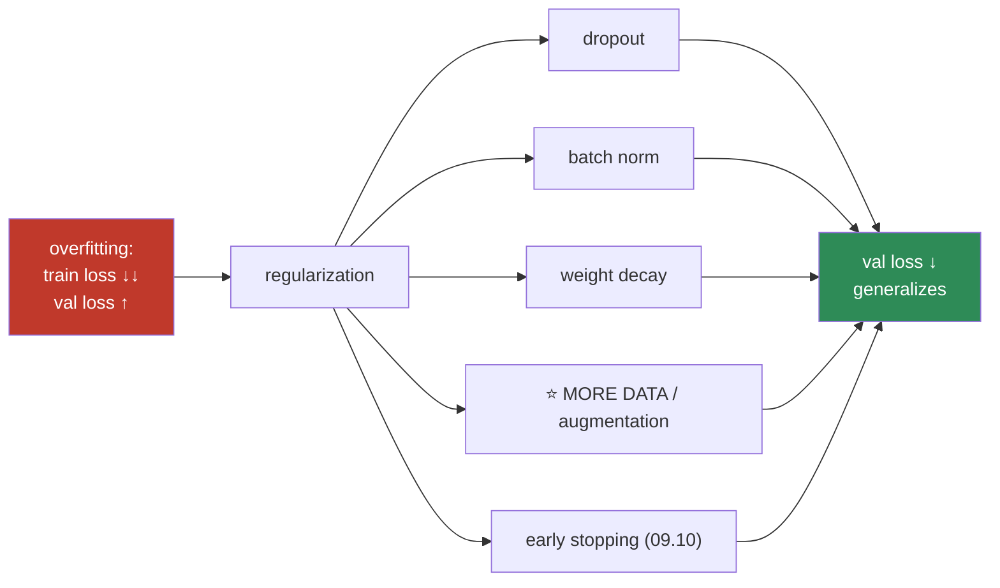
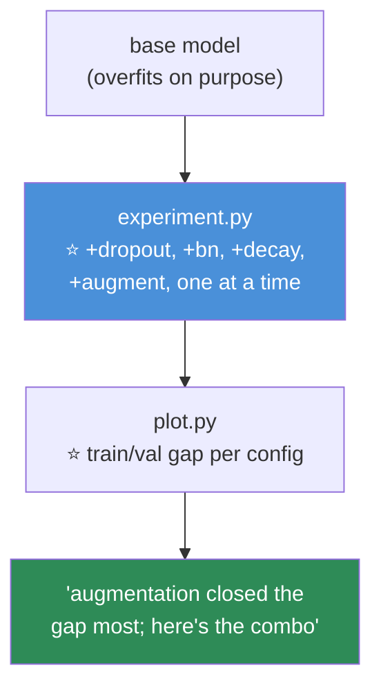

# 09.13 · Regularization

[⬅ 09.12 Sequence Models](09.12-sequence-models.md) · [🏠 Module 09](../README.md) · [➡ 09.14 Performance Optimization](09.14-performance.md)

> **The lesson in one line:** A deep network has enough capacity to memorize your training set perfectly — regularization is the set of techniques that force it to *generalize* instead, and the biggest one is simply more data.

---

## 🎯 Learning objectives

By the end of this lesson you can:

1. Diagnose **overfitting vs underfitting** in a deep network (the [08.2](../../08-Machine-Learning/weeks/08.2-ml-workflow.md) diagnostic, unchanged).
2. Explain **dropout** — what it does and why it works.
3. Explain **batch normalization** — and the train/eval subtlety that catches everyone.
4. Use **weight decay** correctly (and its AdamW connection).
5. Explain why **data augmentation is often the strongest regularizer.**
6. Combine them, and know which to reach for first.

---

## 🧠 Mental model

> **A deep network is a high-variance learner ([08.2](../../08-Machine-Learning/weeks/08.2-ml-workflow.md)): with millions of parameters, it *can* memorize noise. Regularization is anything that says "stay simple; don't memorize."**



> [!IMPORTANT]
> **⭐ The overfitting diagnostic is exactly [08.2](../../08-Machine-Learning/weeks/08.2-ml-workflow.md)'s, unchanged: compare train loss to validation loss.** Train loss low + val loss high (and rising) → **overfitting** → regularize. Both high → **underfitting** → bigger model / train longer / *less* regularization. **Nothing about this changed because the model got deep** — a Transformer overfits the same way a decision tree does, and you diagnose it the same way. Check the two numbers before reaching for any technique.

---

## 1 · Dropout — randomly drop neurons during training

**During training, randomly set a fraction `p` of activations to zero — a different random set each forward pass.** At test time, use all neurons (scaled appropriately).

```python
self.dropout = nn.Dropout(p=0.5)     # drop 50% of activations during training
# ...
x = self.dropout(torch.relu(self.fc1(x)))
```

> [!IMPORTANT]
> **⭐ Why does randomly breaking your network make it better? Two intuitions:**
> 1. **It prevents co-adaptation.** If neurons can't rely on any specific other neuron being present (it might be dropped), each must learn a **robust, independently-useful feature** rather than a fragile feature that only works alongside its neighbours.
> 2. **It's an implicit ensemble.** Each forward pass uses a different random sub-network, so training is like training exponentially many networks that share weights — and averaging them at test time ([08.6](../../08-Machine-Learning/weeks/08.6-ensembles.md)'s variance reduction, built into one model).
>
> **The catch you already know: dropout must be OFF at inference** ([09.7](09.7-autograd.md), [09.10](09.10-training-loop.md)). `model.eval()` handles it — forget it, and your validation predictions are randomly corrupted. **This is why `model.train()`/`model.eval()` exists**, and it's the #1 reason to set the mode explicitly.

> 🖼️ **[IMAGE PLACEHOLDER: `assets/images/09-dropout.png`]**
> *Two network diagrams side by side. Left ("training"): a small fully-connected network with ~40% of the neurons crossed out (dropped) and their connections greyed, with a label "each forward pass drops a different random subset → forces robust features." Right ("inference"): the full network with all neurons active, label "eval(): all neurons on, scaled." Caption: "Dropout trades away co-adaptation for robustness — an implicit ensemble of sub-networks. Mandatory: off at inference."*

---

## 2 · Batch Normalization — normalize activations mid-network

**Batch norm normalizes each layer's activations to mean 0, std 1 (across the batch), then scales/shifts with learned parameters.** It was a landmark — it made deep networks train dramatically faster and more stably.

```python
self.bn = nn.BatchNorm2d(64)          # after a conv, before the activation (usually)
x = torch.relu(self.bn(self.conv(x)))
```

| Benefit | Why |
|---|---|
| **Faster training** | Keeps activations in a sane range → bigger learning rates work ([09.5](09.5-optimization.md)) |
| **Stabilizes gradients** | Prevents the activation-scale drift that vanishes/explodes gradients ([09.4](09.4-backpropagation.md)) |
| **Mild regularization** | The batch-to-batch noise in the statistics acts a bit like dropout |
| **Less sensitive to init** | The normalization forgives a bad initialization |

> [!CAUTION]
> **⭐ Batch norm behaves DIFFERENTLY in train vs eval mode, and this is the subtlest bug in deep learning.**
> - **Training:** it normalizes using the **current batch's** mean and std, *and* updates a running average of them.
> - **Evaluation:** it uses the **stored running average** (because at inference you might have a batch of 1, which has no meaningful batch statistics).
>
> **`model.eval()` switches this over** — forget it, and batch norm uses the wrong statistics at inference, producing subtly (or wildly) wrong predictions. **This, plus dropout, is exactly why the [09.10](09.10-training-loop.md) train/eval dance is non-negotiable.** And it interacts badly with **very small batches** (the statistics become noisy) — which is when you reach for **LayerNorm** instead.

> [!TIP]
> **LayerNorm vs BatchNorm — and why Transformers use LayerNorm.** BatchNorm normalizes across the *batch* dimension (each feature, over all examples in the batch). **LayerNorm normalizes across the *feature* dimension (each example, over its own features)** — so it **doesn't depend on batch size or other examples.** That independence is why **every Transformer uses LayerNorm** ([06.11](../../06-Mathematics/weeks/06.11-transformer-math.md)): sequence models have variable-length inputs and often small batches, where BatchNorm's statistics are unreliable. **BatchNorm for CNNs; LayerNorm for Transformers** is a good default to remember.

---

## 3 · Weight decay — penalize large weights

**Weight decay adds a penalty for large weights** — the L2 regularization from [08.3](../../08-Machine-Learning/weeks/08.3-linear-regression.md), now on a neural network's millions of weights. Smaller weights → a simpler function → less overfitting.

```python
optimizer = torch.optim.AdamW(model.parameters(), lr=1e-3, weight_decay=0.01)
#                             ⭐ AdamW decouples the decay correctly (09.5)
```

> [!IMPORTANT]
> **⭐ Use `weight_decay` via AdamW, not manual L2, and this is exactly the [09.5](09.5-optimization.md) lesson.** Adding L2 to the loss and dividing it by Adam's adaptive scaling is wrong (heavily-updated weights get less decay); **AdamW decouples the decay so it's applied uniformly.** This is *the* reason AdamW is the default. Typical values: `0.01` to `0.1`. **And, as in [08.3](../../08-Machine-Learning/weeks/08.3-linear-regression.md), you generally don't decay the bias or the normalization parameters** — only the weight matrices (many implementations handle this with parameter groups).

---

## 4 · ⭐ Data augmentation & more data — the strongest regularizer

> [!IMPORTANT]
> **⭐ The best regularizer is more data. The second best is fake more data (augmentation). Everything else is a distant third.**
>
> Dropout, batch norm, and weight decay all *constrain* the model. **Data augmentation *expands the problem*** — it shows the model a flipped, rotated, cropped, color-jittered version of each image every epoch ([09.9](09.9-data-loading.md)), so it can't memorize any single view and must learn the invariances that actually matter ("a cat is a cat, flipped or not"). **For images, augmentation frequently beats every other regularizer combined.**
>
> This echoes [08.2](../../08-Machine-Learning/weeks/08.2-ml-workflow.md)'s learning curves: **if your validation curve is still falling with more data, more data is the highest-return investment you can make.** And augmentation gives you "more data" for free. Modern methods (**Mixup**, **CutMix**, **RandAugment**) are remarkably effective and worth knowing.

| Regularizer | Reach for it when |
|---|---|
| **⭐ More data / augmentation** | ✅ **Always first** (for images especially) |
| **Early stopping** | ✅ Free, always ([09.10](09.10-training-loop.md)) |
| **Weight decay (AdamW)** | ✅ Default on |
| **Dropout** | Fully-connected layers, Transformers |
| **Batch/Layer norm** | ✅ Almost always (also speeds training) |
| **Smaller model** | When you genuinely have little data |

---

## 🐍 A regularized model

```python
class RegularizedMLP(nn.Module):
    def __init__(self, in_dim=784, hidden=512, out_dim=10, p=0.5):
        super().__init__()
        self.net = nn.Sequential(
            nn.Linear(in_dim, hidden),
            nn.BatchNorm1d(hidden),           # ⭐ normalize
            nn.ReLU(),
            nn.Dropout(p),                    # ⭐ drop
            nn.Linear(hidden, hidden),
            nn.BatchNorm1d(hidden),
            nn.ReLU(),
            nn.Dropout(p),
            nn.Linear(hidden, out_dim),       # logits, no dropout on the output
        )
    def forward(self, x):
        return self.net(x)

# ── weight decay via the optimizer; augmentation in the DataLoader; early stopping in the loop ──
optimizer = torch.optim.AdamW(model.parameters(), lr=1e-3, weight_decay=0.01)
```

---

## ⚡ Performance & GPU considerations

| Fact | Consequence |
|---|---|
| **Dropout is nearly free** | Just a random mask |
| **Batch norm needs a reasonable batch size** | Tiny batches → noisy stats → use LayerNorm/GroupNorm |
| **Batch norm + gradient accumulation clash** | The effective batch stats are per-micro-batch, not the full accumulated batch ([09.14](09.14-performance.md)) |
| **Augmentation can bottleneck the CPU** | Heavy augmentation → data-loading becomes the limit ([09.9](09.9-data-loading.md)) |
| **`model.eval()` changes dropout & batchnorm** | ⭐ The reason the mode switch is mandatory |

---

## 🐛 Common mistakes

| Mistake | Consequence |
|---|---|
| **Regularizing before diagnosing** | You added dropout to an *underfitting* model → worse |
| **Forgetting `model.eval()`** | ⭐ Dropout on + batchnorm wrong stats at inference |
| **Batch norm with tiny batches** | Noisy statistics → unstable. Use LayerNorm/GroupNorm |
| **Manual L2 instead of AdamW's decay** | Wrongly scaled ([09.5](09.5-optimization.md)) |
| **Too much dropout** | Underfitting; the model can't learn |
| **Decaying the bias/norm params** | Usually hurts — decay weight matrices only |
| **Ignoring augmentation** | Left the strongest, cheapest regularizer on the table |
| **BatchNorm in a Transformer** | Use LayerNorm — batch-independent |

---

## 📝 Exercises

**Conceptual**
1. Give the overfit/underfit diagnostic. **Why do the two need opposite responses to regularization?**
2. Explain dropout two ways (co-adaptation and implicit ensemble). Why must it be off at inference?
3. Explain batch norm's train vs eval behaviour. **Why does it use running stats at inference?**
4. BatchNorm vs LayerNorm — what's normalized in each, and why do Transformers use LayerNorm?
5. Why is data augmentation often the strongest regularizer?

**Implementation**
6. Train a model **without** regularization and plot train/val loss — show it overfitting. Then add dropout + weight decay + augmentation one at a time, **plotting the val curve after each.** Which helped most?
7. ⭐ **Reproduce the batchnorm eval bug**: train a model with batch norm, then evaluate **without** `model.eval()`. Show the metrics are wrong. Fix with `eval()`. Explain.
8. Sweep the dropout rate (0, 0.2, 0.5, 0.8). Plot train and val accuracy. **Find the point where too much dropout causes underfitting.**
9. Compare BatchNorm and LayerNorm on the same model with batch size 4. **Which is more stable, and why?**
10. On an image task, compare no augmentation vs standard augmentation vs Mixup. Report val accuracy.

**Debugging**
11. A model overfits badly. Walk through your regularization checklist in order. Which do you try first?
12. A model underfits and someone suggests adding dropout. **Explain why that's the wrong move** and what to do instead.

---

## 🛠️ Mini project — *The Regularization Study*

Build `code/09-deep-learning/regularization-study/` — a controlled experiment showing exactly what each regularizer buys you.

**Requirements**
- One base model, one dataset, deliberately set up to overfit (small training set, big model).
- **Add each regularizer independently** and measure the effect on the train/val gap.
- **Combine them** and find the best configuration.
- **Reproduce the batchnorm eval bug** as a cautionary test.

```
regularization-study/
├── README.md
├── src/
│   ├── model.py          # a configurable model (dropout/bn on/off)
│   ├── experiment.py     # ⭐ train with each regularizer, log train/val gap
│   ├── augment.py        # augmentation pipelines (09.9)
│   └── plot.py           # ⭐ the train/val curves for each config
├── tests/
│   └── test_eval_mode.py # ⭐ batchnorm/dropout differ train vs eval
└── notebooks/
    └── study.ipynb
```

**Architecture**



**Implementation guidance**
1. **Deliberately overfit first.** Use a big model on a small training set until train loss ≈ 0 and val loss is high — **you need a clear overfitting baseline to measure regularization against.** This mirrors [08.2](../../08-Machine-Learning/weeks/08.2-ml-workflow.md)'s learning-curve thinking: you can only tell what closes the gap if there's a gap.
2. **⭐ Add each regularizer independently and plot the val curve.** This is a proper ablation — the same experimental discipline as [08.13](../../08-Machine-Learning/weeks/08.13-cross-validation.md). **You'll typically find augmentation closes the gap most**, dropout and weight decay help moderately, and the combination is best. **Producing that ablation table with your own numbers teaches more than reading which regularizer is "best."**
3. **`test_eval_mode.py` encodes the mode bug.** Assert that a model with dropout/batchnorm produces **different** output in `.train()` vs `.eval()` mode. This documents *why* the mode switch matters, as a test that can't be forgotten.

**Testing plan:** `test_eval_mode` (train vs eval differ); a test that each regularizer reduces the train/val gap on the overfit baseline.

**Evaluation:** the ablation table and val-curve plots. **The deliverable is a *quantified* intuition for what each regularizer does — not a memorized ranking.**

**Future improvements:** add Mixup/CutMix; add stochastic depth (dropout for entire layers); measure how regularization needs change as you scale the dataset size.

---

## 📄 Cheat sheet

| Regularizer | What | Note |
|---|---|---|
| **⭐ More data / augmentation** | Expand the problem | **The strongest. Try first (images)** |
| **Early stopping** | Stop at val minimum | Free (09.10) |
| **Weight decay** | Penalize big weights | Via **AdamW** (0.01–0.1) |
| **Dropout** | Random neuron drop | ⭐ **OFF at inference** (`eval()`) |
| **Batch norm** | Normalize activations | ⭐ **train/eval differ** · faster training |
| **Layer norm** | Per-example normalize | ✅ **Transformers** (batch-independent) |
| **Smaller model** | Less capacity | When data is truly scarce |

**⭐ Diagnose first:** train↓ val↑ → **overfit** (regularize) · both high → **underfit** (do the opposite).
**⭐ `model.eval()` is mandatory** — it switches dropout off and batchnorm to running stats.

---

## 🎴 Flashcards

- **Q:** ⭐ How do you diagnose whether to regularize? → **A:** The [08.2](../../08-Machine-Learning/weeks/08.2-ml-workflow.md) diagnostic, unchanged: **train loss low + val loss high → overfitting → regularize.** Both high → underfitting → do the opposite (bigger model, *less* regularization). Deep models overfit the same way trees do.
- **Q:** ⭐ Why does dropout work? → **A:** **(1) Prevents co-adaptation** — neurons can't rely on specific others being present, so each learns a robust independent feature. **(2) Implicit ensemble** — each pass uses a different sub-network. **Must be OFF at inference** (`model.eval()`).
- **Q:** ⭐ How does batch norm differ in train vs eval? → **A:** **Train:** normalizes with the current **batch's** statistics and updates a running average. **Eval:** uses the **stored running average** (a batch of 1 has no meaningful stats). **`model.eval()` switches it** — forgetting it gives wrong predictions.
- **Q:** BatchNorm vs LayerNorm — why do Transformers use LayerNorm? → **A:** BatchNorm normalizes across the **batch** (batch-size-dependent); LayerNorm normalizes across the **features** of each example (**batch-independent**). Transformers have variable-length, small-batch inputs, so LayerNorm's independence is essential.
- **Q:** How should you apply weight decay? → **A:** Via **AdamW's `weight_decay`** — it decouples the decay from the adaptive scaling (Adam's L2 is wrongly scaled). Typically 0.01–0.1, and generally **not** on biases/norm params.
- **Q:** ⭐ What's the strongest regularizer? → **A:** **More data — and augmentation is "more data" for free.** It expands the problem rather than constraining the model, forcing it to learn real invariances. For images it often beats every other regularizer combined.
- **Q:** When would adding dropout make things *worse*? → **A:** When the model is **underfitting** — dropout reduces capacity, so it makes an already-too-simple model worse. **Diagnose before you regularize.**

---

## 💼 Interview questions

1. **"How do you prevent a deep network from overfitting?"** — **Diagnose first** (train vs val gap). Then, in order: **more data/augmentation** (strongest), early stopping, weight decay (AdamW), dropout, batch/layer norm. Try a smaller model if data is truly scarce.
2. **⭐ "Explain dropout and batch norm, and their train/eval behaviour."** — Dropout: random neuron drop → robustness + implicit ensemble; off at inference. BatchNorm: normalize activations; **train uses batch stats, eval uses running stats.** Both are switched by `model.eval()` — forgetting it is the #1 bug.
3. **"Why do Transformers use LayerNorm instead of BatchNorm?"** — LayerNorm is **batch-independent** (normalizes per-example over features). Transformers have variable-length, often small-batch inputs where BatchNorm's statistics are unreliable.
4. **"What's the single most effective regularizer?"** — **More data**, and augmentation approximates it for free. Everything else constrains the model; augmentation expands the problem.
5. **"Your model underfits and a colleague adds dropout. Comment."** — **Wrong move** — dropout reduces capacity, hurting an already-underfitting model. Underfitting calls for a *bigger* model, more features, longer training, or *less* regularization.

---

## 📚 Summary

- **A deep network can memorize its training set; regularization forces it to generalize.** **Diagnose first** with the [08.2](../../08-Machine-Learning/weeks/08.2-ml-workflow.md) train-vs-val gap — this is unchanged by depth.
- **Dropout** randomly zeros activations during training → prevents co-adaptation and acts as an implicit ensemble. **It must be off at inference** (`model.eval()`).
- **Batch norm** normalizes activations → faster, more stable training. **Its train/eval behaviour differs** (batch stats vs running stats), which is exactly why the mode switch is mandatory. **Transformers use LayerNorm** because it's batch-independent.
- **Weight decay** (the L2 from [08.3](../../08-Machine-Learning/weeks/08.3-linear-regression.md)) should be applied via **AdamW**, which decouples it correctly.
- **⭐ The strongest regularizer is more data, and augmentation is "more data" for free** — it expands the problem instead of constraining the model, and for images it often beats everything else combined.
- **Order of reach: data/augmentation → early stopping → weight decay → dropout → norm.** And **diagnose before you regularize** — adding dropout to an underfitting model makes it worse.

**Next:** [09.14 Performance Optimization](09.14-performance.md) — mixed precision, gradient clipping, and squeezing every FLOP out of your GPU.

---

## 🔗 References

- Srivastava et al. (2014) — *Dropout: A Simple Way to Prevent Overfitting* (the paper).
- Ioffe & Szegedy (2015) — *Batch Normalization* — a landmark, though *why* it works is still debated.
- Ba, Kiros & Hinton (2016) — *Layer Normalization* — why Transformers use it.
- Loshchilov & Hutter (2019) — *Decoupled Weight Decay* (**AdamW**).
- Zhang et al. (2017) — *mixup: Beyond Empirical Risk Minimization*; Cubuk et al. — *RandAugment*.
- [08.2 The ML Workflow](../../08-Machine-Learning/weeks/08.2-ml-workflow.md) — the overfitting diagnostic and learning curves this lesson reuses.

---

## 🧭 Navigation

| Direction | Link |
|---|---|
| ⬅ Previous | [09.12 Sequence Models](09.12-sequence-models.md) |
| ➡ Next | [09.14 Performance Optimization](09.14-performance.md) |
| 🏠 Module | [Module 09](../README.md) |
| 🗺 Roadmap | [ROADMAP.md](../../../ROADMAP.md) |
