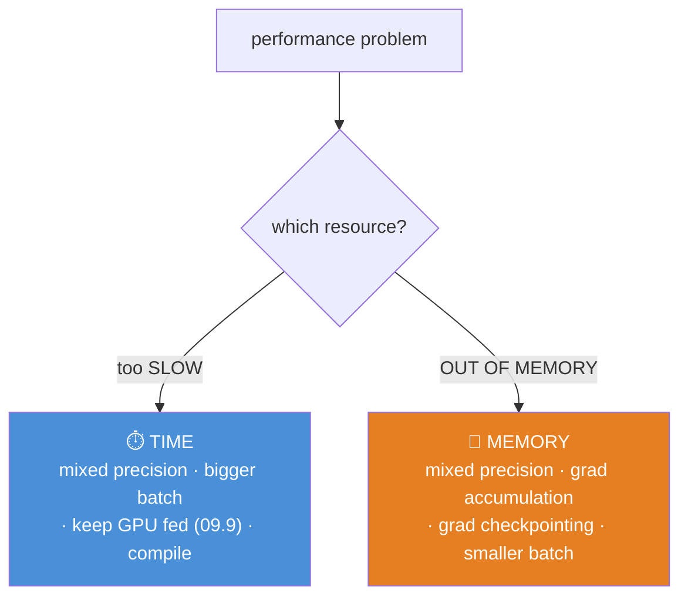
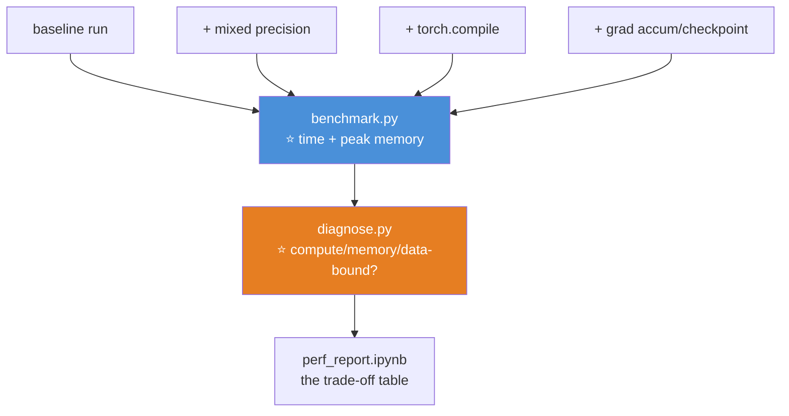

# 09.14 · Performance Optimization

[⬅ 09.13 Regularization](09.13-regularization.md) · [🏠 Module 09](../README.md) · [➡ 09.15 Model Debugging](09.15-debugging.md)

> **The lesson in one line:** GPU time is expensive and memory is finite — mixed precision buys you 2× speed and half the memory almost for free, and the rest is about keeping the GPU busy and the memory from overflowing.

---

## 🎯 Learning objectives

By the end of this lesson you can:

1. Use **mixed precision** training and explain why it's a near-free 2× speedup.
2. Apply **gradient clipping** to tame exploding gradients.
3. Diagnose and fix the **two bottlenecks**: an idle GPU and out-of-memory.
4. Use **gradient accumulation** and **gradient checkpointing** to fit bigger models.
5. **Profile** a training run to find where the time and memory actually go.
6. Reason about GPU utilization like an engineer, not a hoper.

---

## 🧠 Mental model

> **Two resources are scarce: GPU *time* (keep it busy, make each op fast) and GPU *memory* (fit the model + activations + optimizer state). Every technique here targets one or the other.**



> [!IMPORTANT]
> **⭐ Diagnose before optimizing** ([08.15](../../08-Machine-Learning/weeks/08.15-hyperparameter-tuning.md)'s lesson). Is your GPU **slow** or **out of memory**? They have different fixes. And is it even the GPU? **A low GPU-utilization number means the bottleneck is the data pipeline** ([09.9](09.9-data-loading.md)), not the model — no amount of mixed precision fixes a starved GPU. **Look at `nvidia-smi` first.**

---

## 1 · ⭐ Mixed precision — the near-free 2× win

**Train with a mix of `float16`/`bfloat16` (fast, half the memory) and `float32` (kept where precision matters).** PyTorch's `autocast` does this automatically.

```python
scaler = torch.cuda.amp.GradScaler()          # handles float16's tiny range

for X, y in loader:
    X, y = X.to(device), y.to(device)
    optimizer.zero_grad()
    with torch.autocast(device_type='cuda', dtype=torch.bfloat16):   # ⭐ mixed precision
        logits = model(X)
        loss = loss_fn(logits, y)
    scaler.scale(loss).backward()             # scale the loss (for float16)
    scaler.step(optimizer)
    scaler.update()
```

> [!IMPORTANT]
> **⭐ Mixed precision is the single highest-ROI performance technique, and you should use it by default.** Modern GPUs have dedicated hardware (Tensor Cores) for half-precision matmul — so half-precision ops run **~2× faster** *and* use **half the memory** ([06.9](../../06-Mathematics/weeks/06.9-numerical-computing.md)). The accuracy cost is usually negligible.
>
> **Why "mixed" and not just half?** Because some operations (the loss, the softmax, accumulations) need `float32`'s precision to avoid `NaN`. `autocast` automatically keeps those in `float32` and does the matmuls in half — you get the speed where it's safe and the stability where it's needed. **With `bfloat16`** (float32's range — [06.9](../../06-Mathematics/weeks/06.9-numerical-computing.md)) you often don't even need the `GradScaler`; with **`float16`** you do (its tiny range makes small gradients underflow, so you scale the loss up before backward and down after). **This is why every LLM trains in bf16.**

---

## 2 · Gradient clipping — tame exploding gradients

**Cap the gradient's magnitude so it can't explode** ([09.4](09.4-backpropagation.md), [09.12](09.12-sequence-models.md)):

```python
loss.backward()
torch.nn.utils.clip_grad_norm_(model.parameters(), max_norm=1.0)   # ⭐ before step()
optimizer.step()
```

> [!TIP]
> **Gradient clipping is your seatbelt against `NaN`.** When gradients explode (common in RNNs, deep networks, and early training — [09.4](09.4-backpropagation.md)'s $\lambda^n$ table), clipping rescales any gradient whose norm exceeds `max_norm`, keeping the update sane. **It's nearly mandatory for RNNs and Transformers**, cheap, and it turns a run that would `NaN` into one that survives. Put it between `backward()` and `step()`. `max_norm=1.0` is a common default.

---

## 3 · Gradient accumulation — a big batch that doesn't fit

**Want an effective batch of 256 but only 64 fits in memory? Accumulate gradients over 4 mini-batches, then step once** ([09.4](09.4-backpropagation.md)):

```python
accum_steps = 4
optimizer.zero_grad()
for i, (X, y) in enumerate(loader):
    loss = loss_fn(model(X), y) / accum_steps   # ⭐ scale down (so the sum averages)
    loss.backward()                              # ADDS to .grad (PyTorch accumulates — 09.4)
    if (i + 1) % accum_steps == 0:
        optimizer.step()                         # step every 4 mini-batches
        optimizer.zero_grad()
```

> [!IMPORTANT]
> **⭐ This is *why* PyTorch accumulates gradients by default** ([09.4](09.4-backpropagation.md)) — so you can simulate a large batch that won't fit in memory. Four batches of 64, gradients summed, one step = the same update as one batch of 256. **It trades time for memory** (you do 4 forward/backward passes per step), and it's how people train big models on modest GPUs. **Note:** divide the loss by `accum_steps` so you're averaging, not summing. *(Caveat: it interacts badly with batch norm, whose statistics are per-micro-batch — [09.13](09.13-regularization.md).)*

---

## 4 · Gradient checkpointing — trade compute for memory

**The activation cache is what makes training memory-hungry** ([09.4](09.4-backpropagation.md)). Gradient checkpointing **throws away most activations during the forward pass and recomputes them during backward** — trading extra compute for a large memory saving.

```python
from torch.utils.checkpoint import checkpoint
# wrap expensive blocks: checkpoint(block, x) — activations recomputed in backward
```

> [!TIP]
> **Gradient checkpointing can cut activation memory by ~√N** (for N layers) at the cost of ~30% more compute (one extra forward pass). **It's how you fit a model whose activations don't fit** — essential for training large Transformers on limited hardware. The trade: you recompute the forward pass during backward instead of storing it. **Reach for it when you're OOM on *activations* (not parameters).**

---

## 5 · Diagnosing the two bottlenecks

### Bottleneck A — the GPU is idle (slow, low utilization)

```bash
watch -n 1 nvidia-smi          # ⭐ GPU-Util column — is it ~95% or bouncing around 30%?
```

| GPU-Util | Diagnosis | Fix |
|---|---|---|
| **~95%** | ✅ GPU-bound (good) | Mixed precision, bigger batch, `torch.compile` |
| **Low, bouncing** | ⚠️ **Data-bound** (the GPU is starving) | ⭐ **More `num_workers`, `pin_memory`, cache preprocessing** ([09.9](09.9-data-loading.md)) |

> [!WARNING]
> **⭐ The most common performance mistake is optimizing the model when the *data pipeline* is the bottleneck.** People spend days on mixed precision and a fancier architecture while their GPU sits 30% idle waiting for slow JPEG decoding. **Check `nvidia-smi` first.** If utilization is low, the fix is in the DataLoader ([09.9](09.9-data-loading.md)), not the model. This is the single highest-leverage diagnosis in deep learning performance.

### Bottleneck B — out of memory

```
RuntimeError: CUDA out of memory. Tried to allocate 2.00 GiB...
```

| Fix | Trade-off |
|---|---|
| **Mixed precision** | ⭐ Half the activation memory, ~free |
| **Smaller batch size** | Fewer activations; but noisier gradient / slower |
| **Gradient accumulation** | Keep effective batch, less memory, more time |
| **Gradient checkpointing** | Big activation saving, ~30% more compute |
| **Smaller model** | Last resort |
| **8-bit optimizer** | Adam's state is 3× the model ([09.5](09.5-optimization.md)); quantize it |

> [!NOTE]
> **Where the memory actually goes, in a training run:** model **parameters** (1×), **gradients** (1×), **optimizer state** (Adam: 2× — [09.5](09.5-optimization.md)), and the **activation cache** (often the biggest, and batch-size-dependent — [09.4](09.4-backpropagation.md)). **Knowing which one is overflowing tells you which fix to use:** activations → checkpointing or smaller batch; optimizer state → 8-bit Adam or LoRA; parameters → a smaller model or model parallelism.

---

## 6 · Profiling

**Don't guess where the time goes — measure it.**

```python
from torch.profiler import profile, ProfilerActivity

with profile(activities=[ProfilerActivity.CPU, ProfilerActivity.CUDA]) as prof:
    for _ in range(10):
        loss = loss_fn(model(X), y); loss.backward(); optimizer.step(); optimizer.zero_grad()

print(prof.key_averages().table(sort_by="cuda_time_total", row_limit=10))
# ⭐ shows which operations dominate — often not what you'd guess
```

> [!TIP]
> **⭐ `torch.compile(model)` is the modern one-line speedup** (PyTorch 2.0+). It traces your dynamic graph ([09.7](09.7-autograd.md)) and JIT-compiles it into optimized, fused kernels — often **1.3–2× faster** for a single line: `model = torch.compile(model)`. It recovers some of the ahead-of-time-optimization benefit that dynamic graphs gave up ([09.7](09.7-autograd.md)). **Try it — it's free.** (First-run compilation is slow, then it's fast.)

---

## 🐛 Common mistakes

| Mistake | Consequence |
|---|---|
| **Not using mixed precision** | Leaving a 2× speedup / half the memory on the table |
| **Optimizing the model when data-bound** | ⭐ **Check `nvidia-smi` first** — the fix is in the DataLoader |
| **`float16` without `GradScaler`** | Small gradients underflow → training stalls |
| **No gradient clipping on RNNs/Transformers** | Exploding gradients → `NaN` |
| **Forgetting to divide loss by `accum_steps`** | You sum instead of average → effective LR is wrong |
| **Timing without `synchronize()`** | You timed the async queue ([09.6](09.6-pytorch-tensors.md)) |
| **`.item()` in a tight loop** | Each forces a GPU sync ([09.3](09.3-math-of-neural-networks.md)) |
| **Batch norm + gradient accumulation** | Stats are per-micro-batch, not the full batch |
| **Guessing the bottleneck** | Profile. It's rarely where you think |

---

## 📝 Exercises

**Mixed precision**
1. Train a model with and without `autocast`. **Report the speedup and the memory difference.** Confirm the accuracy is nearly identical.
2. Explain why it's "mixed," not just half. Which operations stay in float32?
3. Reproduce a `float16` underflow (a training run that stalls), then fix it with `GradScaler` or `bfloat16`.

**Memory**
4. ⭐ **Trigger a CUDA OOM** by making the batch too big. Then fit it four ways: smaller batch, mixed precision, gradient accumulation, gradient checkpointing. **Report the memory and time trade-off for each.**
5. Implement gradient accumulation to reach an effective batch of 256 from mini-batches of 64. **Verify the update equals a true batch-256 update** (within float tolerance).
6. Compute the memory breakdown (params + gradients + Adam state + activations) for a model. **Which is biggest?**

**Diagnosis**
7. ⭐ **On a GPU, deliberately create a data-bound run** (`num_workers=0`, heavy augmentation). Watch `nvidia-smi` show low utilization. Fix it and watch utilization rise. **Explain why optimizing the model wouldn't have helped.**
8. Profile a training step with `torch.profiler`. **Which operation dominates?** Is it what you expected?
9. Apply `torch.compile` and benchmark the speedup (remember: first run is slow).
10. Add gradient clipping to a run that `NaN`s. Show it now survives.

---

## 🛠️ Mini project — *The Performance Lab*

Build `code/09-deep-learning/performance-lab/` — a benchmark suite that measures every optimization on real training runs.

**Requirements**
- A baseline training run, then each optimization applied and measured.
- **Report time AND memory** for: baseline, mixed precision, `torch.compile`, gradient accumulation, gradient checkpointing.
- **A bottleneck diagnoser**: is this run compute-bound, memory-bound, or data-bound?
- **The `nvidia-smi` utilization story**, plotted.

```
performance-lab/
├── README.md
├── src/
│   ├── benchmark.py      # ⭐ time + peak memory per configuration
│   ├── amp.py            # mixed precision + GradScaler
│   ├── memory.py         # gradient accumulation, checkpointing
│   ├── diagnose.py       # ⭐ compute-/memory-/data-bound?
│   └── profile.py        # torch.profiler wrapper
├── tests/
│   └── test_accum.py     # ⭐ accumulation == big-batch update
└── notebooks/
    └── perf_report.ipynb
```

**Architecture**



**Implementation guidance**
1. **⭐ `diagnose.py` is the skill that transfers.** Given a training run, determine the bottleneck: **measure GPU utilization** (data-bound if low), **peak memory** (memory-bound if near capacity), else compute-bound. **Then recommend the right fix.** This is exactly how a senior engineer approaches a slow run — *diagnose the resource, then apply the matching technique* — rather than throwing every optimization at it and hoping.
2. **`benchmark.py` must measure PEAK memory, not just time** (`torch.cuda.max_memory_allocated()`), and **time correctly with `synchronize()`** ([09.6](09.6-pytorch-tensors.md)). Peak memory is what determines whether a run OOMs; timing the async queue is a classic mistake. **Produce the trade-off table** — baseline vs each optimization, on both axes.
3. **`test_accum.py` proves gradient accumulation is correct**: assert that N micro-batches accumulated equals one N×-larger batch (within float tolerance). This is the [09.4](09.4-backpropagation.md) accumulation lesson, verified — and it catches the common "forgot to divide by accum_steps" bug.
4. **Show the mixed-precision win concretely:** the same model, same accuracy, ~2× faster and ~half the memory. **That number, from your own benchmark, is why you'll use it by default.**

**Testing plan:** `test_accum` (accumulation correctness); a test that mixed precision produces near-identical accuracy to full precision.

**Evaluation:** the trade-off table (time × memory per optimization) and the bottleneck diagnoser. **The deliverable is the ability to make a training run faster or fit-in-memory, deliberately rather than by guessing.**

**Future improvements:** add 8-bit Adam; add multi-GPU (`DistributedDataParallel`) benchmarking; add a memory timeline visualization.

---

## 📄 Cheat sheet

| Problem | Fix |
|---|---|
| **Too slow (GPU ~95%)** | ⭐ **Mixed precision** · bigger batch · `torch.compile` |
| **Too slow (GPU idle)** | ⭐ **Data-bound → more `num_workers`** (09.9). **Check `nvidia-smi` FIRST** |
| **Out of memory (activations)** | Mixed precision · **gradient checkpointing** · smaller batch |
| **Out of memory (optimizer state)** | 8-bit Adam · LoRA (Adam = 3× params — 09.5) |
| **Want a bigger effective batch** | **Gradient accumulation** (divide loss by accum_steps) |
| **Exploding gradients / NaN** | **`clip_grad_norm_(params, 1.0)`** before `step()` |
| **Find the real bottleneck** | `torch.profiler` — don't guess |
| **Free speedup** | `torch.compile(model)` (PyTorch 2.0+) |

**⭐ Mixed precision: use it by default — 2× faster, half the memory, ~free.**
**⭐ Diagnose the resource first: time vs memory, compute vs data-bound.**

---

## 🎴 Flashcards

- **Q:** ⭐ What is mixed precision and why use it by default? → **A:** Train with half-precision (bf16/fp16) matmuls and float32 where precision matters (loss, softmax). Modern GPUs have Tensor Cores for half-precision → **~2× faster, half the memory, ~free.** `autocast` handles it. **Why LLMs train in bf16.**
- **Q:** Why "mixed" and not just half precision? → **A:** Some ops (loss, accumulations) need float32 to avoid `NaN`. `autocast` keeps those in float32 and does matmuls in half — speed where safe, stability where needed. **bf16 keeps float32's range (no GradScaler needed); fp16 needs loss scaling.**
- **Q:** ⭐ What is gradient accumulation, and why does PyTorch accumulate by default? → **A:** Sum gradients over several mini-batches, then step once → **simulate a big batch that won't fit in memory.** PyTorch accumulates *so that this works.* Divide the loss by `accum_steps` to average.
- **Q:** What is gradient checkpointing? → **A:** **Throw away activations during forward, recompute them during backward** — trades ~30% more compute for a big memory saving. For when you're OOM on *activations*.
- **Q:** ⭐ How do you tell if you're data-bound or compute-bound? → **A:** **`nvidia-smi` GPU-Util.** ~95% = compute-bound (optimize the model). Low/bouncing = **data-bound** (fix the DataLoader — more `num_workers`). **Check this FIRST** — optimizing the model won't help a starved GPU.
- **Q:** Why gradient clipping? → **A:** Caps the gradient norm so exploding gradients (common in RNNs/Transformers) don't `NaN`. `clip_grad_norm_(params, 1.0)` between `backward()` and `step()`.
- **Q:** Where does training memory go? → **A:** Parameters (1×) + gradients (1×) + **optimizer state (Adam: 2×)** + the **activation cache** (often biggest, batch-dependent). Knowing which overflows tells you which fix to use.
- **Q:** What is `torch.compile`? → **A:** A one-line JIT compiler (PyTorch 2.0+) that fuses your dynamic graph into optimized kernels — often **1.3–2× faster**, free. Recovers some ahead-of-time optimization that dynamic graphs gave up.

---

## 💼 Interview questions

1. **⭐ "How would you make training faster?"** — **Diagnose first: `nvidia-smi`.** If data-bound, fix the DataLoader (`num_workers`). If compute-bound: **mixed precision** (2×, ~free), bigger batch, `torch.compile`. **Emphasize diagnosing the resource before optimizing.**
2. **"What is mixed precision and how does it work?"** — Half-precision matmuls on Tensor Cores + float32 for stability-critical ops. 2× speed, half memory. bf16 (range) vs fp16 (needs a GradScaler for underflow).
3. **⭐ "You're out of memory. What are your options?"** — Mixed precision (halves activations), smaller batch, **gradient accumulation** (keep effective batch), **gradient checkpointing** (recompute activations), 8-bit optimizer, smaller model. **Match the fix to which memory overflowed.**
4. **"Your GPU utilization is 30%. What's wrong?"** — **The data pipeline is starving it** — loading is slower than compute. Fix `num_workers`, `pin_memory`, cache preprocessing. Optimizing the model wouldn't help.
5. **"How does gradient accumulation let you use a bigger batch?"** — Sum gradients over N mini-batches, step once → the same update as an N×-bigger batch, at N× the time but 1/N the memory. It's why PyTorch accumulates by default.

---

## 📚 Summary

- **Two scarce resources: GPU time and GPU memory.** Every technique targets one. **Diagnose which before optimizing** — and check `nvidia-smi` first, because a low utilization means the *data pipeline* is the bottleneck, not the model.
- **⭐ Mixed precision is the highest-ROI technique — use it by default.** Half-precision matmuls on Tensor Cores give ~2× speed and half the memory, near-free. It's "mixed" because stability-critical ops stay in float32. **bf16 (float32's range) is why LLMs train in it.**
- **Gradient clipping** (`clip_grad_norm_`) is your seatbelt against exploding gradients — nearly mandatory for RNNs and Transformers.
- **Gradient accumulation** simulates a large batch that won't fit (sum over mini-batches, step once — which is *why* PyTorch accumulates by default). **Gradient checkpointing** trades compute for activation memory (recompute instead of store).
- **Training memory = parameters + gradients + optimizer state (Adam: 2×) + the activation cache.** Knowing which overflows tells you the fix.
- **⭐ Profile, don't guess.** `torch.profiler` shows where the time goes; `torch.compile` is a free one-line speedup. **Diagnose the resource, then apply the matching technique** — the mark of an engineer over a hoper.

**Next:** [09.15 Model Debugging](09.15-debugging.md) — the systematic workflow for when training goes wrong: NaN losses, dead neurons, and gradients that vanish or explode.

---

## 🔗 References

- PyTorch — [Automatic Mixed Precision](https://pytorch.org/docs/stable/amp.html) and the [AMP recipe](https://pytorch.org/tutorials/recipes/recipes/amp_recipe.html).
- Micikevicius et al. (2018) — *Mixed Precision Training* (the paper; loss scaling comes from here).
- PyTorch — [Profiler tutorial](https://pytorch.org/tutorials/recipes/recipes/profiler_recipe.html) and [`torch.compile`](https://pytorch.org/tutorials/intermediate/torch_compile_tutorial.html).
- Chen et al. (2016) — *Training Deep Nets with Sublinear Memory Cost* (gradient checkpointing).
- Dettmers et al. — *8-bit Optimizers* (`bitsandbytes`) — quantized Adam state.
- [09.9 Data Loading](09.9-data-loading.md) — the `num_workers` fix for a starved GPU.

---

## 🧭 Navigation

| Direction | Link |
|---|---|
| ⬅ Previous | [09.13 Regularization](09.13-regularization.md) |
| ➡ Next | [09.15 Model Debugging](09.15-debugging.md) |
| 🏠 Module | [Module 09](../README.md) |
| 🗺 Roadmap | [ROADMAP.md](../../../ROADMAP.md) |
