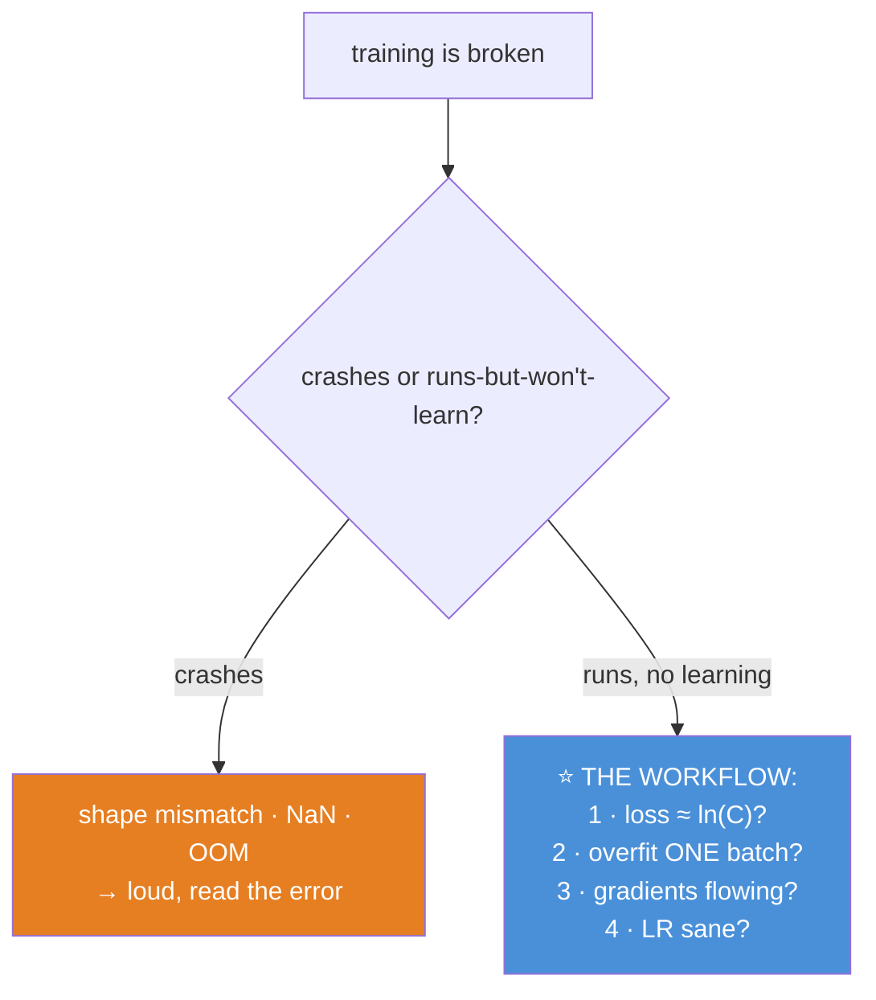
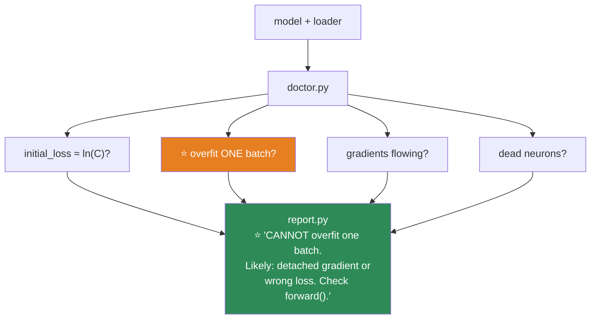

# 09.15 · Model Debugging

[⬅ 09.14 Performance Optimization](09.14-performance.md) · [🏠 Module 09](../README.md) · [➡ 09.16 Saving & Loading](09.16-saving-loading.md)

> **The lesson in one line:** Deep learning fails silently — the code runs, the loss just doesn't drop — so you need a *systematic* debugging workflow, and it starts with a single question: can the model overfit one batch?

---

## 🎯 Learning objectives

By the end of this lesson you can:

1. Follow a **systematic debugging workflow** instead of randomly changing things.
2. Diagnose a **`NaN` loss** from its symptoms.
3. Diagnose **vanishing and exploding gradients** — and know they're the [09.4](09.4-backpropagation.md) $\lambda^n$ problem.
4. Spot **dead neurons** and **shape mismatches.**
5. Use **the overfit-one-batch test** as your first move, always.
6. Read the diagnostic signals — gradient norms, activation histograms, the loss curve.

---

## 🧠 Mental model

> **Deep learning bugs come in two flavours: it CRASHES (a shape error, a NaN — loud, findable) or it RUNS BUT DOESN'T LEARN (silent, maddening). The second is worse, and the systematic workflow is how you attack it.**



> [!IMPORTANT]
> **⭐ The cardinal rule of DL debugging: change ONE thing at a time, and make the model prove it works on something trivial before you ask it to generalize.** The temptation, when a model won't learn, is to change five things at once — the LR, the architecture, the optimizer, the batch size — and hope. **That's not debugging; it's flailing.** The systematic workflow below isolates the problem to one component, fast.

---

## ⭐ The debugging workflow — in order

**Karpathy's discipline, adapted. Follow it top to bottom; don't skip.**

### Step 0 — Check the initial loss ≈ ln(C)

```python
# Before training a single step:
print(f"initial loss: {loss.item():.4f}  (expected ≈ {np.log(num_classes):.4f})")
```

**An untrained C-class classifier should output near-uniform probabilities → loss ≈ ln(C)** ([09.3](09.3-math-of-neural-networks.md), [06.10](../../06-Mathematics/weeks/06.10-neural-network-math.md)). If it's way off, you have a bug **before training** — a wrong number of output neurons, a double softmax, a label mismatch. **The cheapest check in deep learning; run it every time.**

### Step 1 — ⭐ Can it overfit ONE batch?

```python
X, y = next(iter(train_loader))               # ONE batch
X, y = X.to(device), y.to(device)
for step in range(300):                        # train on ONLY this batch
    optimizer.zero_grad()
    loss = loss_fn(model(X), y)
    loss.backward()
    optimizer.step()
    if step % 50 == 0:
        print(f"step {step}  loss {loss.item():.4f}")
# ⭐ loss MUST go to ~0. A model that can't memorize 64 examples is BROKEN.
```

> [!IMPORTANT]
> **⭐ This is the single most valuable debugging test in all of deep learning.** A correct model+loop can trivially memorize one batch (64 examples) — drive the loss to ~0, accuracy to 100%. **If it can't, the problem is in your model or loop** (a detached gradient, a wrong loss, a bug in `forward`, a frozen layer), **not in your data or hyperparameters.** You've isolated the bug to a tiny, fast-to-debug surface. **Only after your model can overfit one batch should you worry about why it doesn't generalize.** Do this *first*, every time. It has saved more debugging days than any other single technique.

### Step 2 — Are gradients flowing?

```python
loss.backward()
for name, p in model.named_parameters():
    if p.grad is None:
        print(f"🚨 {name}: NO GRADIENT (detached from the graph?)")
    else:
        print(f"{name:30} grad norm {p.grad.norm().item():.2e}")
# ⭐ look for: None (broken graph), ~0 (vanishing), huge (exploding)
```

### Step 3 — Is the learning rate sane?

**Try 10× up and 10× down.** Too high → loss oscillates/`NaN`; too low → crawls ([09.5](09.5-optimization.md)). The LR is the #1 hyperparameter and the most common single cause of a stuck model.

---

## 🔴 `NaN` loss — the diagnosis

**A `NaN` loss poisons everything** (NaN is contagious — [06.9](../../06-Mathematics/weeks/06.9-numerical-computing.md)). Diagnose by *when* it appears:

| When | Likely cause | Fix |
|---|---|---|
| **From step 0** | `log(0)` in the loss, bad init, NaN in the data | Check data (`torch.isnan(X).any()`); stable loss ([09.3](09.3-math-of-neural-networks.md)) |
| **After a loss spike** | **Exploding gradients** | **Gradient clipping** ([09.14](09.14-performance.md)), lower LR, warmup |
| **Suddenly, mid-training** | `exp` overflow (softmax), division by ~0 | Stable softmax, add `eps` |
| **Only in mixed precision** | float16 overflow | Use bfloat16, or a GradScaler ([09.14](09.14-performance.md)) |

```python
torch.autograd.set_detect_anomaly(True)       # ⭐ points at the EXACT op that produced NaN
```

> [!TIP]
> **⭐ `torch.autograd.set_detect_anomaly(True)` is the `NaN` detective — it tells you the exact operation that produced the NaN**, with a stack trace, instead of leaving you to guess. It's slow (so turn it off after), but it turns "somewhere in my 200-layer network there's a NaN" into "line 47, the log in your custom loss." Also: **check your data for NaN first** (`assert not torch.isnan(X).any()`) — one corrupted input poisons the whole batch's gradient ([06.9](../../06-Mathematics/weeks/06.9-numerical-computing.md)).

---

## 🌊 Vanishing & exploding gradients

**These are the [09.4](09.4-backpropagation.md) $\lambda^n$ problem, in production.** Diagnose by watching gradient norms per layer:

```python
def grad_norms(model):
    return {name: p.grad.norm().item()
            for name, p in model.named_parameters() if p.grad is not None}
# ⭐ VANISHING: early-layer norms ≈ 0, later layers fine → early layers don't learn
# ⭐ EXPLODING: norms grow huge, loss spikes → NaN
```

| Symptom | Diagnosis | Fix |
|---|---|---|
| Early-layer gradients ≈ 0; loss plateaus early | **Vanishing** | ReLU/GELU (not sigmoid), **residual connections**, batch/layer norm, better init |
| Gradient norms explode; loss → `NaN` | **Exploding** | **Gradient clipping**, lower LR, warmup, better init |

> [!IMPORTANT]
> **⭐ This is [09.4](09.4-backpropagation.md)'s $\lambda^n$ table, diagnosed empirically.** Sigmoid's 0.25 derivative → $0.25^{n}$ → vanishing; a large recurrent/weight matrix → $\lambda^n > 1$ → exploding. **The fixes are the architectural ones you already know**: ReLU (derivative 1), **residual connections** (the gradient highway — [06.4](../../06-Mathematics/weeks/06.4-calculus.md), [09.11](09.11-cnns.md)), normalization ([09.13](09.13-regularization.md)), careful init. When you *see* early-layer gradients at 1e-30 in your own model, the abstract lesson becomes a concrete diagnosis.

---

## 💀 Dead neurons

**A ReLU neuron whose pre-activation is always negative outputs 0 forever — its gradient is 0, so it never recovers** ([09.2](09.2-neural-network-fundamentals.md)). In a badly-initialized or high-LR network, 40% can die.

```python
# ⭐ Diagnose: what fraction of ReLU activations are always zero?
activations = []  # hook a ReLU layer, collect its output over a batch
dead_fraction = (torch.stack(activations) == 0).all(dim=0).float().mean()
print(f"dead neurons: {dead_fraction:.1%}")   # >20% → a problem
```

**Fixes:** lower the learning rate (high LR kills ReLUs), Leaky ReLU / GELU (no hard-off region), better initialization.

---

## 📏 Shape mismatches — the loud, easy bugs

```
RuntimeError: mat1 and mat2 shapes cannot be multiplied (32x784 and 256x10)
```

**The inner dimensions don't match** (784 ≠ 256) — you skipped a layer or transposed wrong ([09.3](09.3-math-of-neural-networks.md)). **Fix by printing shapes in `forward`:**

```python
def forward(self, x):
    print(x.shape)                    # ⭐ debug: print at every step
    x = self.fc1(x); print(x.shape)
    ...
```

> [!TIP]
> **Shape errors are the *good* kind of bug — they're loud, they name the mismatched dimensions, and they're fixed by reading the shapes.** Print `.shape` at every step in `forward` (or use `torchinfo.summary` — [09.8](09.8-building-models.md)). The channel-order convention (`NCHW` — [09.11](09.11-cnns.md)) and forgetting the batch dimension are the usual culprits. Annoying, but never mysterious.

---

## 📈 Reading the loss curve

| Loss curve | Diagnosis |
|---|---|
| **Flat from the start** | LR too low, dead network, broken graph, or wrong loss |
| **Decreases then `NaN`** | Exploding gradients → clip |
| **Oscillates wildly** | LR too high, or unshuffled data ([09.9](09.9-data-loading.md)) |
| **Train ↓, val ↑** | Overfitting → regularize ([09.13](09.13-regularization.md)) |
| **Both flat and high** | Underfitting → bigger model, more features |
| **Smooth ↓ then plateau** | ✅ Healthy — maybe more capacity or a schedule |

---

## 🐛 Common mistakes (the debugging anti-patterns)

| Anti-pattern | Better |
|---|---|
| **Changing five things at once** | ⭐ Change **one** thing; isolate |
| **Skipping the overfit-one-batch test** | ⭐ Do it **first** — it isolates model/loop bugs in 2 min |
| **Not checking initial loss** | Run the ln(C) check — free bug detection |
| **Guessing at NaN** | `set_detect_anomaly(True)` — it points at the exact op |
| **Not checking the data** | `torch.isnan(X).any()` — one bad input poisons everything |
| **Blaming the model when it's the data pipeline** | Overfit-one-batch works? → it's the data/hyperparameters |
| **Tuning the LR blindly** | Watch gradient norms and the loss curve for *which* problem |
| **Not printing shapes** | Print them in `forward` — shape bugs are easy once seen |

---

## 📝 Exercises

**The workflow**
1. State the debugging workflow in order. **Why does the overfit-one-batch test come so early?**
2. ⭐ Take a working model, **break it** three ways (remove `zero_grad`; apply softmax before the loss; freeze all parameters). For each, run the overfit-one-batch test and show it fails. **Explain how the test localizes each bug.**
3. Set the initial loss check up. Deliberately use the wrong number of output classes and show the check catches it.

**NaN**
4. Cause a `NaN` three ways (LR=1000; `log(0)` in a custom loss; a NaN injected into the data). For each, use `set_detect_anomaly` to find it.
5. Cause an exploding-gradient `NaN` and fix it with gradient clipping. Plot the gradient norm over training, with and without clipping.

**Gradients & neurons**
6. ⭐ Build a deep **sigmoid** network. Plot the per-layer gradient norms. **Show the early layers vanish.** Then swap to ReLU + residual connections and show they recover.
7. Train a network with a high learning rate and measure the **dead-neuron fraction**. Lower the LR and show it drops. Try Leaky ReLU.
8. Write a `diagnose(model, batch)` function that reports: initial loss vs ln(C), per-layer gradient norms, dead-neuron fraction, and whether it can overfit the batch.

**Shapes & curves**
9. Trigger three different shape errors. For each, read the error, print shapes in `forward`, and fix it.
10. Given five loss curves (flat, NaN-after-spike, oscillating, train↓val↑, both-high), **diagnose each** and name the fix.

---

## 🛠️ Mini project — *The Model Doctor*

Build `code/09-deep-learning/model-doctor/` — an automated diagnostic that runs the whole debugging workflow on any model+loop and tells you what's wrong.

**Requirements**
- One command that runs the full workflow: initial-loss check, overfit-one-batch, gradient-flow analysis, dead-neuron check.
- **Clear, actionable output**: "your model can't overfit one batch — check for a detached gradient or a wrong loss."
- **A suite of deliberately-broken models** to test the doctor against.
- **NaN detection** with `set_detect_anomaly`.

```
model-doctor/
├── README.md
├── src/
│   ├── doctor.py         # ⭐ run the full workflow → a diagnosis
│   ├── checks/
│   │   ├── initial_loss.py   # ≈ ln(C)?
│   │   ├── overfit_batch.py  # ⭐ can it memorize one batch?
│   │   ├── gradients.py      # ⭐ vanishing/exploding/None per layer
│   │   └── dead_neurons.py   # dead-ReLU fraction
│   └── report.py         # actionable diagnosis
├── tests/
│   └── broken_models.py  # ⭐ 6 deliberately-broken models to diagnose
└── notebooks/
```

**Architecture**



**Implementation guidance**
1. **⭐ `overfit_batch.py` is the centerpiece** — it trains on one batch and asserts the loss drops near zero. **If it fails, the doctor reports that the bug is in the model/loop, not the data** — the single most useful piece of localization there is. This encodes Karpathy's #1 test as a reusable tool.
2. **`broken_models.py` is how you *validate the doctor itself*** — a mutation-testing idea ([08.13](../../08-Machine-Learning/weeks/08.13-cross-validation.md), [07.9](../../07-Data-Analysis/weeks/07.9-data-quality.md)). Build 6 models each broken in a specific way (no `zero_grad`, double softmax, frozen params, wrong output size, sigmoid-induced vanishing, exploding init). **Assert the doctor correctly diagnoses each.** A diagnostic tool that can't detect known bugs is worthless — proving it can on planted bugs is the whole point.
3. **`report.py` must be ACTIONABLE, not just descriptive.** Not "gradient norm at layer 1 is 3e-31" but **"early-layer gradients are vanishing — switch to ReLU, add residual connections, or add normalization."** The value is in translating the symptom into the fix. This mirrors [08.16](../../08-Machine-Learning/weeks/08.16-interpretability.md)'s philosophy: a diagnosis you can act on.
4. **Wire in `set_detect_anomaly`** for the NaN case, so the doctor can point at the exact offending operation.

**Testing plan:** `broken_models.py` — assert the doctor diagnoses each of the 6 planted bugs correctly (and passes a healthy model).

**Evaluation:** the doctor correctly diagnoses all 6 broken models and clears the healthy one. **The deliverable is a tool you'll actually run whenever a training run goes wrong — and the systematic instinct it builds.**

**Future improvements:** add activation-histogram analysis (are activations unit-scaled?); add a learning-rate-range-test; integrate with TensorBoard for live monitoring during training.

---

## 📄 Cheat sheet

| The workflow (in order) | |
|---|---|
| **0** | Initial loss ≈ **ln(C)**? |
| **1** | ⭐ **Can it overfit ONE batch?** (→0 or it's broken) |
| **2** | Gradients flowing? (None / ~0 / huge) |
| **3** | LR sane? (try 10× each way) |

| Symptom | Fix |
|---|---|
| **NaN from step 0** | Check data · stable loss · init |
| **NaN after a spike** | ⭐ **Gradient clipping** · lower LR · warmup |
| **NaN mid-training** | `set_detect_anomaly(True)` finds the op |
| **Vanishing gradients** | ReLU · **residuals** · norm · better init |
| **Exploding gradients** | **Clip** · lower LR · warmup |
| **Dead neurons** | Lower LR · Leaky ReLU/GELU · better init |
| **Shape error** | Print `.shape` in `forward`; check NCHW |
| **Loss flat** | LR too low / broken graph / wrong loss |

**⭐ Change ONE thing at a time.**
**⭐ Overfit one batch FIRST — it isolates model/loop bugs from data/hyperparameter bugs.**

---

## 🎴 Flashcards

- **Q:** ⭐ What's the single most valuable debugging test? → **A:** **Can the model overfit ONE batch to ~100%?** A correct model+loop can trivially memorize 64 examples. If it can't, the bug is in the **model or loop** (not the data/hyperparameters) — isolating it to a tiny surface. Do it **first**.
- **Q:** What's the cardinal rule of DL debugging? → **A:** **Change ONE thing at a time**, and make the model prove it works on something trivial (overfit one batch) before asking it to generalize. Changing five things at once is flailing, not debugging.
- **Q:** How do you diagnose a NaN loss? → **A:** By **when** it appears: step 0 → data/loss/init; after a spike → **exploding gradients** (clip); mid-training → overflow (stable softmax). Use **`torch.autograd.set_detect_anomaly(True)`** to find the exact op, and check the data for NaN first.
- **Q:** ⭐ How do you diagnose vanishing vs exploding gradients? → **A:** **Watch per-layer gradient norms.** Early layers ≈ 0 → **vanishing** (fix: ReLU, residuals, norm, init). Norms exploding + loss spike → **exploding** (fix: clip, lower LR). It's [09.4](09.4-backpropagation.md)'s $\lambda^n$ table, diagnosed empirically.
- **Q:** What is a dead neuron and how do you spot it? → **A:** A **ReLU stuck always-negative → outputs 0 → gradient 0 → never recovers.** Measure the fraction of always-zero activations; >20% is a problem. Fix: lower LR, Leaky ReLU/GELU, better init.
- **Q:** How do you debug a shape error? → **A:** **Print `.shape` at every step in `forward`** (or `torchinfo.summary`). The error names the mismatched dimensions. Usual culprits: wrong channel order (NCHW) or a forgotten batch dimension. Loud and findable.
- **Q:** What does a flat-from-the-start loss curve mean? → **A:** LR too low, a dead/broken network, a detached graph, or the wrong loss. Run the overfit-one-batch test to localize.

---

## 💼 Interview questions

1. **⭐ "Your model trains but the loss won't drop. Walk me through debugging it."** — **The systematic workflow**: initial loss ≈ ln(C)? **Can it overfit one batch?** (isolates model/loop from data). Gradients flowing? LR sane (10× each way)? Double softmax? Data shuffled? **Emphasize the overfit-one-batch test as the first move.**
2. **"Your loss went to NaN. How do you find the cause?"** — Diagnose by *when*: step 0 (data/loss/init), after a spike (exploding gradients → clip), mid-training (overflow). Use `set_detect_anomaly` to find the exact op; check the data for NaN.
3. **"How do you diagnose vanishing gradients?"** — Log per-layer gradient norms; early layers near zero = vanishing. Fixes: ReLU, **residual connections**, normalization, better init. It's the chain rule multiplying $\lambda^n$.
4. **"What's a dead ReLU and how do you fix it?"** — A neuron stuck always-negative outputs 0 with zero gradient forever. Caused by high LR / bad init. Fix: lower LR, Leaky ReLU/GELU.
5. **"What's your first move when a new model won't learn?"** — **Overfit one batch.** If it can't, the model or loop is broken; if it can, the problem is generalization (data, regularization, hyperparameters). It localizes the bug in two minutes.

---

## 📚 Summary

- **Deep learning fails silently** — the code runs, the loss just doesn't drop — so you need a **systematic workflow**, not random changes. **Change one thing at a time.**
- **⭐ The workflow, in order:** initial loss ≈ ln(C)? → **can it overfit ONE batch?** → gradients flowing? → LR sane? **The overfit-one-batch test is the single most valuable move** — a correct model+loop can memorize 64 examples, so if it can't, the bug is in the model or loop, not the data or hyperparameters. Do it first.
- **Diagnose `NaN` by *when* it appears** (step 0 → data/loss/init; after a spike → exploding gradients; mid-training → overflow). **`torch.autograd.set_detect_anomaly(True)` points at the exact op**, and one NaN in the data poisons everything.
- **Vanishing and exploding gradients are [09.4](09.4-backpropagation.md)'s $\lambda^n$ problem, diagnosed by watching per-layer gradient norms.** The fixes are the architectural ones you know: ReLU, **residual connections**, normalization, careful init, gradient clipping.
- **Dead neurons** (always-negative ReLUs) never recover — spot them by the fraction of always-zero activations; fix with a lower LR or Leaky ReLU/GELU.
- **Shape errors are the *good* bugs** — loud, they name the mismatched dimensions, and printing shapes in `forward` fixes them.
- **The loss curve tells you which problem you have** — flat (LR/broken), NaN-after-spike (exploding), oscillating (LR/shuffling), train↓val↑ (overfitting).

**Next:** [09.16 Saving & Loading Models](09.16-saving-loading.md) — persisting your trained model, resuming training, and reproducibility.

---

## 🔗 References

- **Karpathy — *A Recipe for Training Neural Networks*** (blog). ⭐⭐ **The overfit-one-batch discipline and this whole systematic workflow come from here. The single most useful debugging resource in deep learning.**
- PyTorch — [`torch.autograd.set_detect_anomaly`](https://pytorch.org/docs/stable/autograd.html#anomaly-detection).
- Bengio (2012) — *Practical Recommendations for Gradient-Based Training* — the classic on gradient diagnostics.
- [09.4 Backpropagation](09.4-backpropagation.md) — the $\lambda^n$ vanishing/exploding table this lesson diagnoses.
- [06.9 Numerical Computing](../../06-Mathematics/weeks/06.9-numerical-computing.md) — where NaN comes from and how it spreads.

---

## 🧭 Navigation

| Direction | Link |
|---|---|
| ⬅ Previous | [09.14 Performance Optimization](09.14-performance.md) |
| ➡ Next | [09.16 Saving & Loading Models](09.16-saving-loading.md) |
| 🏠 Module | [Module 09](../README.md) |
| 🗺 Roadmap | [ROADMAP.md](../../../ROADMAP.md) |
