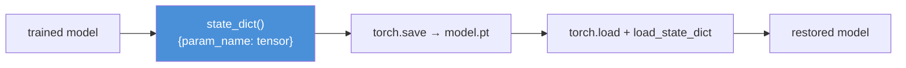
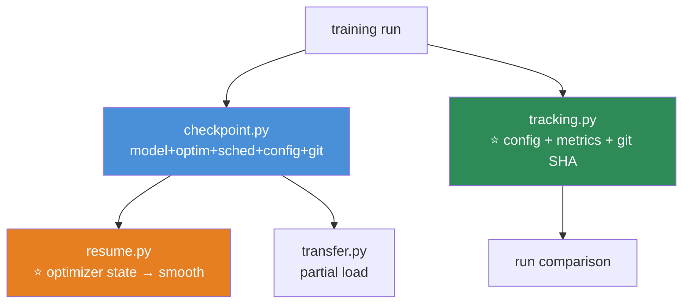

# 09.16 · Saving & Loading Models

[⬅ 09.15 Model Debugging](09.15-debugging.md) · [🏠 Module 09](../README.md) · [➡ 09.17 Production Deep Learning](09.17-production.md)

> **The lesson in one line:** Save the `state_dict` (the weights as a dictionary), not the whole model object — and to *resume* training, you also need the optimizer state, the epoch, and the seed.

---

## 🎯 Learning objectives

By the end of this lesson you can:

1. Save and load a model with **`state_dict`** — and explain why not to pickle the whole model.
2. Save a **full checkpoint** for resuming training.
3. Do **partial loading** for transfer learning.
4. Make a training run **reproducible** (seeds, determinism).
5. Use **experiment tracking** to compare runs.
6. Avoid the security and version pitfalls of loading model files.

---

## 🧠 Mental model

> **A model's "knowledge" is a dictionary of numbers (the `state_dict`). Save the numbers, not the Python object.**



---

## 📐 Save the `state_dict`, not the model

```python
# ✅ RIGHT — save the weights (a dictionary of tensors)
torch.save(model.state_dict(), 'model.pt')

# ── to load: recreate the architecture, then load the weights ──
model = MLP()                                 # ⭐ you need the class definition
model.load_state_dict(torch.load('model.pt'))
model.eval()                                  # ⭐ for inference (09.10)

# ❌ WRONG — pickling the whole model object
torch.save(model, 'model.pt')                 # fragile: ties the file to your exact code
```

> [!IMPORTANT]
> **⭐ Save the `state_dict`, not the whole model. This is the #1 PyTorch saving best practice.**
>
> `torch.save(model, ...)` pickles the entire Python object — including the *path* to your model class. **If you rename the file, move the class, or refactor, the saved model won't load.** It's brittle and version-fragile. The `state_dict` is just a dictionary of tensors ([09.8](09.8-building-models.md)) — portable, robust, and decoupled from your code structure. **You recreate the architecture from your class definition, then pour the saved weights in.** This is how every serious codebase does it, and it's why you keep your model class in version control alongside the weights.

---

## 💾 A full checkpoint — for resuming training

**To *resume* training (not just infer), you need more than the weights** ([09.10](09.10-training-loop.md)):

```python
# ── SAVE everything needed to resume exactly ────────────────────
torch.save({
    'epoch': epoch,
    'model_state': model.state_dict(),
    'optimizer_state': optimizer.state_dict(),      # ⭐ Adam's m, v buffers (09.5)!
    'scheduler_state': scheduler.state_dict(),
    'best_val_loss': best_val_loss,
    'rng_state': torch.get_rng_state(),             # for reproducibility
}, 'checkpoint.pt')

# ── RESUME ──────────────────────────────────────────────────────
ckpt = torch.load('checkpoint.pt')
model.load_state_dict(ckpt['model_state'])
optimizer.load_state_dict(ckpt['optimizer_state'])  # ⭐ WITHOUT this, Adam restarts cold
scheduler.load_state_dict(ckpt['scheduler_state'])
start_epoch = ckpt['epoch'] + 1
```

> [!IMPORTANT]
> **⭐ To resume training you MUST save the optimizer state, not just the weights.** Adam maintains momentum and variance buffers (`m`, `v` — [09.5](09.5-optimization.md)) that took hundreds of steps to build up. **Resume from just the weights and Adam starts cold** — its adaptive learning rates reset, and you get a loss spike or unstable training right where you resumed. Save the optimizer state, the scheduler state, and the epoch. **This is the difference between "resume" and "restart," and it's the [09.10](09.10-training-loop.md) checkpoint lesson made precise.**

---

## 🔀 Partial loading — for transfer learning

**Load *some* of a saved model's weights, leave the rest fresh** ([09.11](09.11-cnns.md)):

```python
pretrained = torch.load('resnet_imagenet.pt')
model_dict = model.state_dict()

# ⭐ keep only the weights that match (skip the classifier head)
compatible = {k: v for k, v in pretrained.items()
              if k in model_dict and v.shape == model_dict[k].shape}
model_dict.update(compatible)
model.load_state_dict(model_dict)             # backbone loaded, new head stays random

# or: load_state_dict(..., strict=False) to ignore mismatches
```

> [!TIP]
> **`load_state_dict(..., strict=False)` loads what matches and ignores the rest** — exactly what you want for transfer learning ([09.11](09.11-cnns.md)): load the pretrained backbone, leave your new task-specific head random. Because the `state_dict` is a plain dictionary keyed by layer name, partial loading is trivial — you filter the dictionary. **This is why the `state_dict` design is so powerful: it makes transfer learning a dictionary operation.**

---

## 🎲 Reproducibility — same code, same result

**Deep learning has many sources of randomness** ([07.11](../../07-Data-Analysis/weeks/07.11-pipelines.md), [08.13](../../08-Machine-Learning/weeks/08.13-cross-validation.md)):

```python
def set_seed(seed=42):
    torch.manual_seed(seed)               # PyTorch RNG (weights, dropout, shuffling)
    torch.cuda.manual_seed_all(seed)      # GPU RNG
    np.random.seed(seed)                  # NumPy
    random.seed(seed)                     # Python
    # ⭐ full determinism (slower):
    torch.backends.cudnn.deterministic = True
    torch.backends.cudnn.benchmark = False
```

> [!CAUTION]
> **⭐ Full GPU determinism costs speed, and "reproducible" is harder than it looks.** Setting seeds handles *most* randomness, but some GPU operations (certain reductions, `atomicAdd`) are **non-deterministic by design** for speed — so identical seeds can still give slightly different results across runs, and *definitely* across different GPUs or PyTorch versions.
>
> **`torch.backends.cudnn.deterministic = True` forces determinism** at a speed cost, and `torch.use_deterministic_algorithms(True)` errors if any op can't be made deterministic. **For debugging and paper reproducibility, use them. For fast training, accept small run-to-run variation** and report results as mean ± std across a few seeds ([06.6](../../06-Mathematics/weeks/06.6-statistics.md), [08.13](../../08-Machine-Learning/weeks/08.13-cross-validation.md)) — which is more honest anyway. **Reproducibility in DL is a spectrum, not a switch.**

---

## 📊 Experiment tracking

**When you run dozens of experiments (different LRs, architectures, augmentations), `print()` doesn't scale.** Use a tracker:

```python
import wandb                               # or tensorboard, mlflow

wandb.init(project='mnist', config={'lr': 1e-3, 'batch_size': 64})
for epoch in range(epochs):
    ...
    wandb.log({'train_loss': train_loss, 'val_loss': val_loss, 'val_acc': val_acc})
```

| Tool | For |
|---|---|
| **TensorBoard** | ✅ Free, local, PyTorch-native. Curves, histograms, images |
| **Weights & Biases (W&B)** | ⭐ Hosted, gorgeous, compares runs, logs configs — the popular choice |
| **MLflow** | Self-hosted, ties into the model registry ([08.17](../../08-Machine-Learning/weeks/08.17-production-ml.md)) |

> [!IMPORTANT]
> **⭐ Log the config, not just the metrics — this is the [08.17](../../08-Machine-Learning/weeks/08.17-production-ml.md) versioning lesson.** When run #47 gets the best validation accuracy, you need to know *exactly* what produced it: the learning rate, the architecture, the augmentation, the seed, the git SHA, the data version ([07.11](../../07-Data-Analysis/weeks/07.11-pipelines.md)). **A metric without its config is unreproducible.** Experiment trackers log all of it automatically and let you compare runs side by side — which is how you actually do the error analysis and ablation studies from Module 08 at deep-learning scale.

---

## 🔒 Security & version considerations

| Concern | Note |
|---|---|
| **`torch.load` runs pickle** | ⭐ **Arbitrary code execution** — a malicious `.pt` file runs anything. **Only load models you trust** ([08.17](../../08-Machine-Learning/weeks/08.17-production-ml.md)) |
| **`weights_only=True`** | ⭐ Newer PyTorch: `torch.load(f, weights_only=True)` refuses to unpickle arbitrary code — **use it for untrusted files** |
| **Version fragility** | A model saved in PyTorch 2.1 may not load in 1.13. **Pin and record the version** |
| **`state_dict` needs the class** | You must have the model's code to reconstruct it |
| **safetensors** | ⭐ A safe, fast alternative to pickle (used by HuggingFace) — no code execution risk |

> [!WARNING]
> **⭐ `torch.load` on an untrusted `.pt` file is remote code execution** — it's pickle under the hood ([08.17](../../08-Machine-Learning/weeks/08.17-production-ml.md), [07.10](../../07-Data-Analysis/weeks/07.10-performance.md)). Downloading a random model checkpoint and loading it can run malware. **Use `weights_only=True`** (PyTorch's guard against this) or the **safetensors** format (which stores only tensors, no code) for anything you didn't produce. This is a real, exploited attack vector, and it's why HuggingFace pushed safetensors as the default.

---

## 🐛 Common mistakes

| Mistake | Consequence |
|---|---|
| **Pickling the whole model** | Fragile — breaks on refactor/rename |
| **Saving only weights when resuming** | ⭐ Adam restarts cold → loss spike |
| **Forgetting `model.eval()` after loading** | Dropout on / batchnorm wrong at inference ([09.10](09.10-training-loop.md)) |
| **`torch.load` on untrusted files** | ⭐ **RCE.** Use `weights_only=True` / safetensors |
| **Loading to the wrong device** | `torch.load(f, map_location=device)` |
| **Not pinning the PyTorch version** | A model may not load in a different version |
| **Expecting perfect GPU reproducibility** | Some ops are non-deterministic; report mean ± std |
| **Logging metrics without the config** | Unreproducible — you can't tell what produced the best run |

---

## 📝 Exercises

**Saving & loading**
1. Save a model's `state_dict`, load it into a fresh instance, and verify identical predictions. Then pickle the whole model and show why it's fragile (rename the class).
2. Save a **full checkpoint** (model + optimizer + scheduler + epoch). Resume training from it. **Verify the loss continues smoothly** rather than spiking.
3. ⭐ **Demonstrate the optimizer-state bug**: resume from *only* the model weights (no optimizer state) and show the loss spikes; then resume *with* it and show it's smooth. Explain.
4. Do **partial loading** for transfer learning: load a backbone, leave a new head random. Use `strict=False`.

**Reproducibility**
5. Train the same model twice with the same seed. Are the results identical on CPU? On GPU? Explain any difference.
6. Enable full determinism (`cudnn.deterministic`). Measure the speed cost. When is it worth it?
7. Train the same model with 3 different seeds. Report the mean ± std of the final accuracy ([06.6](../../06-Mathematics/weeks/06.6-statistics.md)). **Why is this more honest than a single number?**

**Tracking & security**
8. Set up TensorBoard (or W&B) logging for a training run. Log loss curves and the config. Compare two runs.
9. ⭐ Explain why `torch.load` on an untrusted file is dangerous. Load a model with `weights_only=True`. Convert a checkpoint to safetensors.
10. Save a model in one PyTorch version and try to load it in another (if available). Note any warnings.

---

## 🛠️ Mini project — *The Checkpoint Manager*

Build `code/09-deep-learning/checkpoint-manager/` — a robust save/load/resume system with experiment tracking.

**Requirements**
- Save **full checkpoints** (model + optimizer + scheduler + epoch + config + git SHA).
- **Resume training** exactly — verify the loss continues smoothly.
- **Partial loading** for transfer learning.
- **Experiment tracking** (config + metrics), and a **run comparison**.
- **Safe loading** (`weights_only` / safetensors).

```
checkpoint-manager/
├── README.md
├── src/
│   ├── checkpoint.py     # ⭐ save/load full checkpoints
│   ├── resume.py         # ⭐ resume training exactly (optimizer state!)
│   ├── transfer.py       # partial loading (strict=False)
│   ├── reproducibility.py# set_seed, determinism
│   └── tracking.py       # ⭐ log config + metrics + git SHA (08.17)
├── tests/
│   ├── test_resume.py    # ⭐⭐ resumed loss == uninterrupted loss
│   └── test_partial.py   # backbone loads, head stays random
└── notebooks/
```

**Architecture**



**Implementation guidance**
1. **⭐ `test_resume.py` is the deliverable and it's a genuine correctness proof.** Train for 10 epochs uninterrupted. Then train for 5, checkpoint, and resume for 5 more. **Assert the final model state matches** (within float tolerance). **This only works if you saved and restored the optimizer AND scheduler state** — the test *forces* you to get resumption right, and it catches the "loss spikes on resume" bug that comes from restarting Adam cold ([09.5](09.5-optimization.md)).
2. **`tracking.py` logs the config with the metrics, including the git SHA and data version** — the [08.17](../../08-Machine-Learning/weeks/08.17-production-ml.md)/[07.11](../../07-Data-Analysis/weeks/07.11-pipelines.md) reproducibility discipline. **A run you can't reproduce is a run you can't learn from.** Make it so that six months later, you can look at your best run and know *exactly* what produced it.
3. **Use `weights_only=True` (or safetensors) in `checkpoint.py`'s load path** and document why — the RCE risk is real, and a checkpoint manager that loads unsafely is teaching a bad habit.
4. **`transfer.py`** proves partial loading works: load a backbone, assert the head is still at its initialization, train, and confirm only the intended parameters changed.

**Testing plan:** `test_resume` (resumed == uninterrupted — the correctness proof), `test_partial` (backbone loaded, head random).

**Evaluation:** the resume test passes (proving optimizer state is handled), runs are tracked with full config, and loading is safe. **The deliverable is a checkpoint system you trust for real long-running training.**

**Future improvements:** integrate with W&B; add automatic best-checkpoint pruning (keep the top-3 by val); add model export to safetensors and ONNX ([09.17](09.17-production.md)).

---

## 📄 Cheat sheet

| | |
|---|---|
| **⭐ Save this** | `torch.save(model.state_dict(), 'model.pt')` — **not the whole model** |
| **Load** | recreate class → `load_state_dict(torch.load(...))` → `model.eval()` |
| **⭐ Resume training** | Save **model + optimizer + scheduler + epoch**. Optimizer state is essential |
| **Transfer learning** | `load_state_dict(..., strict=False)` — partial load |
| **Device** | `torch.load(f, map_location=device)` |
| **⭐ Reproducibility** | seed torch/cuda/numpy/python; `cudnn.deterministic` (slower); report mean ± std |
| **Tracking** | Log **config + metrics + git SHA** (TensorBoard / W&B / MLflow) |
| **⭐ Security** | `torch.load` = pickle = **RCE**. Use `weights_only=True` / **safetensors** |

---

## 🎴 Flashcards

- **Q:** ⭐ Why save the `state_dict` instead of the whole model? → **A:** The whole-model save **pickles the Python object including the path to your class** — so it breaks on any refactor/rename. The `state_dict` is a portable **dictionary of tensors**, decoupled from your code. Recreate the architecture, then load the weights.
- **Q:** ⭐ What do you need to *resume* training (not just infer)? → **A:** The **optimizer state** (Adam's m, v buffers — built over hundreds of steps), the scheduler state, and the epoch — not just the weights. **Resume from weights alone and Adam restarts cold → loss spike.**
- **Q:** How does transfer learning use `state_dict`? → **A:** **Partial loading** — the `state_dict` is a plain dict keyed by layer name, so you filter it (or use `strict=False`) to load a pretrained backbone and leave your new head random.
- **Q:** ⭐ Can you get perfectly reproducible GPU results? → **A:** **Not easily.** Seeds handle most randomness, but some GPU ops are non-deterministic by design (for speed). `cudnn.deterministic=True` forces it at a speed cost. **For fast training, accept small variation and report mean ± std across seeds** — more honest anyway.
- **Q:** Why log the config, not just metrics? → **A:** **A metric without its config is unreproducible** — you can't tell what produced the best run. Log the LR, architecture, seed, git SHA, and data version. That's how you do ablations at scale.
- **Q:** ⭐ Why is `torch.load` a security risk? → **A:** It uses **pickle → arbitrary code execution.** A malicious `.pt` file runs anything. Use **`weights_only=True`** or the **safetensors** format for untrusted files.
- **Q:** What must you do after loading a model for inference? → **A:** **`model.eval()`** — switch dropout off and batchnorm to running stats ([09.10](09.10-training-loop.md)). Forgetting it corrupts predictions.

---

## 💼 Interview questions

1. **⭐ "How do you save a PyTorch model?"** — Save the **`state_dict`** (a dict of tensors), not the whole model (which pickles the class path and is fragile). Recreate the architecture, load the weights, call `eval()`.
2. **⭐ "What's needed to resume training vs just infer?"** — Inference: weights + `eval()`. **Resume: weights + optimizer state + scheduler state + epoch.** The optimizer state matters — Adam's buffers took hundreds of steps to build; restarting cold spikes the loss.
3. **"How do you do transfer learning at the file level?"** — Partial `state_dict` loading (`strict=False`) — load the pretrained backbone, leave the new head random. Trivial because `state_dict` is a keyed dictionary.
4. **"How reproducible is deep learning?"** — Seeds handle most randomness, but some GPU ops are non-deterministic by design. Full determinism costs speed. **Best practice: report mean ± std across seeds.**
5. **"Any security concerns loading a model file?"** — Yes — **`torch.load` is pickle → RCE.** Use `weights_only=True` or safetensors for untrusted files. Real, exploited vector.

---

## 📚 Summary

- **⭐ Save the `state_dict`, not the whole model.** The whole-model save pickles the class path and breaks on any refactor; the `state_dict` is a portable dictionary of tensors. Recreate the architecture from your (version-controlled) class, load the weights, call `model.eval()`.
- **⭐ To resume training, save a full checkpoint** — model **and optimizer and scheduler state and epoch**. The optimizer state is essential: Adam's momentum/variance buffers took hundreds of steps to build, and resuming without them restarts Adam cold and spikes the loss.
- **Transfer learning is partial loading** — filter the `state_dict` (or `strict=False`) to load a pretrained backbone and keep a fresh head. Trivial because the `state_dict` is a keyed dictionary.
- **⭐ Reproducibility is a spectrum, not a switch.** Seed everything; use `cudnn.deterministic` for debugging (at a speed cost); but accept that some GPU ops are non-deterministic and **report results as mean ± std across seeds** — which is more honest anyway.
- **Experiment tracking (TensorBoard / W&B / MLflow) logs config + metrics + git SHA** — because a metric without its config is unreproducible. This is the [08.17](../../08-Machine-Learning/weeks/08.17-production-ml.md) versioning discipline at DL scale.
- **⭐ `torch.load` is pickle — an RCE risk.** Use `weights_only=True` or safetensors for anything you didn't produce.

**Next:** [09.17 Production Deep Learning](09.17-production.md) — from a trained checkpoint to a served model: latency, throughput, TorchScript, and ONNX.

---

## 🔗 References

- PyTorch — [Saving and Loading Models](https://pytorch.org/tutorials/beginner/saving_loading_models.html) — the authoritative guide (state_dict, checkpoints, transfer).
- PyTorch — [Reproducibility notes](https://pytorch.org/docs/stable/notes/randomness.html) — the honest account of what's determinizable.
- HuggingFace — [safetensors](https://github.com/huggingface/safetensors) — the safe serialization format.
- Weights & Biases / TensorBoard docs — experiment tracking.
- [08.17 Production ML](../../08-Machine-Learning/weeks/08.17-production-ml.md) and [07.11 Pipelines](../../07-Data-Analysis/weeks/07.11-pipelines.md) — the versioning and reproducibility discipline this inherits.

---

## 🧭 Navigation

| Direction | Link |
|---|---|
| ⬅ Previous | [09.15 Model Debugging](09.15-debugging.md) |
| ➡ Next | [09.17 Production Deep Learning](09.17-production.md) |
| 🏠 Module | [Module 09](../README.md) |
| 🗺 Roadmap | [ROADMAP.md](../../../ROADMAP.md) |
