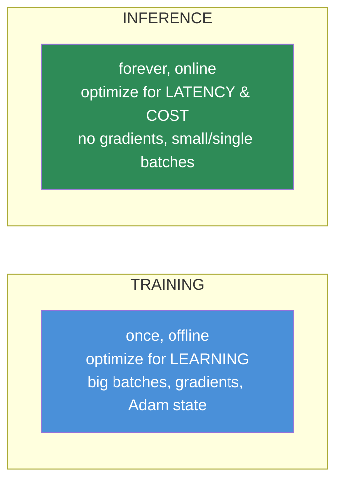
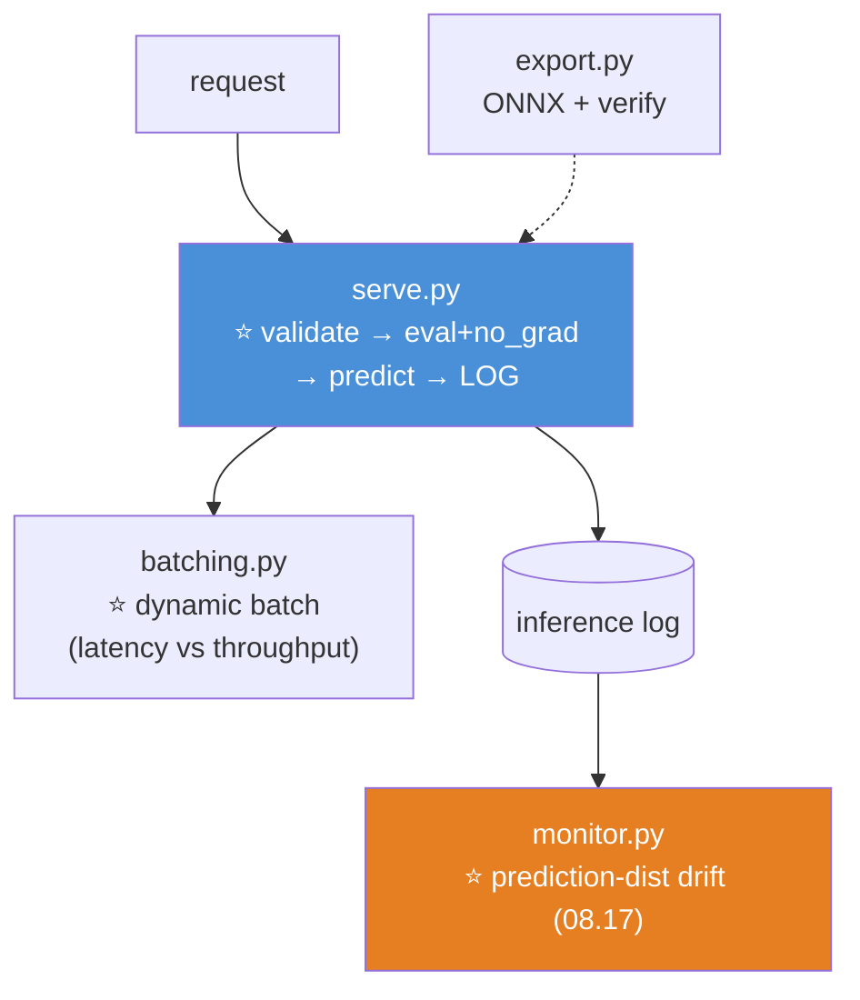

# 09.17 · Production Deep Learning

[⬅ 09.16 Saving & Loading](09.16-saving-loading.md) · [🏠 Module 09](../README.md) · [➡ 09.18 Projects & Summary](09.18-projects-summary.md)

> **The lesson in one line:** Training optimizes for *learning*; serving optimizes for *latency, throughput, and cost* — different goals, different techniques, and everything you learned about deploying a logistic regression in Module 08 still applies unchanged.

---

## 🎯 Learning objectives

By the end of this lesson you can:

1. Explain why **inference is a different problem** than training.
2. Choose between **batch and online** inference.
3. Reason about **latency vs throughput** and the levers for each.
4. **Optimize a model for inference** (eval mode, no-grad, half precision, compilation).
5. Explain **TorchScript and ONNX** — what they're for.
6. Connect back to Module 08: **monitoring, drift, and versioning don't change.**

---

## 🧠 Mental model

> **Training is a one-time offline cost (hours, on your terms). Inference is a forever online cost (milliseconds, on the user's terms). You optimize them for opposite things.**



> [!IMPORTANT]
> **⭐ At inference you can throw away most of what training needed.** No gradients (no activation cache — [09.4](09.4-backpropagation.md)), no optimizer state ([09.5](09.5-optimization.md)), no dropout, no augmentation. **This is why a 7B model that needs ~80 GB to *train* runs inference in ~14 GB** ([09.5](09.5-optimization.md)) — the optimizer state and activation cache are gone. Inference is a much lighter problem, and optimizing it is about *speed and cost*, not *learning*.

---

## 🔧 Optimizing a model for inference

```python
model.eval()                                  # ⭐ dropout off, batchnorm running stats (09.10)
with torch.no_grad():                         # ⭐ no graph → less memory, faster (09.7)
    with torch.autocast('cuda', dtype=torch.bfloat16):   # ⭐ half precision (09.14)
        output = model(x)
```

| Technique | Why |
|---|---|
| **`model.eval()`** | ⭐ Correct behaviour ([09.10](09.10-training-loop.md)) — mandatory, not optional |
| **`torch.no_grad()`** | No autograd graph → memory + speed ([09.7](09.7-autograd.md)) |
| **Half precision** | ~2× faster ([09.14](09.14-performance.md)) |
| **`torch.compile`** | JIT-fused kernels ([09.14](09.14-performance.md)) |
| **Quantization** | int8 weights → smaller, faster (small accuracy cost) |
| **Batching requests** | Amortize the fixed cost across many requests |

> [!CAUTION]
> **⭐ Forgetting `model.eval()` + `no_grad()` at inference is the two-bug combo you've now met three times** ([09.7](09.7-autograd.md), [09.10](09.10-training-loop.md), [09.13](09.13-regularization.md)). In production it's worse: `eval()` off means dropout randomly corrupts every prediction, and `no_grad()` off means you build (and leak) a computational graph you never use, wasting memory and slowing every request. **This pair belongs at the top of every inference path.**

---

## ⚡ Latency vs throughput — the fundamental tension

| | **Latency** | **Throughput** |
|---|---|---|
| Means | Time for **one** prediction | Predictions **per second** |
| Matters for | Real-time (fraud, autocomplete, chat) | Batch jobs (nightly scoring, embeddings) |
| Improved by | Smaller model, quantization, no batching wait | **Bigger batches**, more GPUs |
| Tension | ⭐ **They trade off** | ⭐ |

> [!IMPORTANT]
> **⭐ Batching improves throughput but *hurts* latency — this is the central trade-off in ML serving.**
>
> To use the GPU efficiently, you want to process many requests in one batch ([09.2](09.2-neural-network-fundamentals.md)). But to *build* a batch, requests must **wait** for enough others to arrive — so each individual request is slower. **A user-facing chat model that batched aggressively would feel laggy; a nightly embedding job should batch as hard as possible.** The engineering answer is **dynamic batching** (wait a few milliseconds to collect requests, then process them together) — a tunable knob between the two extremes. **Know which axis your product cares about**, because it dictects your whole serving strategy.

---

## 📦 Batch vs online inference

| Pattern | When | Example |
|---|---|---|
| **⭐ Batch (offline)** | ✅ **Start here.** No latency SLA | Nightly: embed all documents, score all users |
| **Online (real-time)** | The prediction needs request-time data | Fraud on this transaction, chat, ranking |

> [!TIP]
> **⭐ Start with batch inference** — the same advice as Module 08 ([08.17](../../08-Machine-Learning/weeks/08.17-production-ml.md)). A nightly job that writes predictions to a table has no latency SLA, no serving infrastructure, and trivial rollback. **Go real-time only when the prediction genuinely depends on data that arrives at request time.** A surprising amount of "we need a real-time model" is actually "we need a nightly batch job." The deep model doesn't change this calculus.

---

## 🚀 TorchScript, ONNX, and deployment formats

**A trained PyTorch model is Python + weights. Production often can't run Python** (a C++ server, a mobile app, a browser). **These formats decouple the model from Python:**

| Format | What | Use |
|---|---|---|
| **TorchScript** | Serialize a model to a Python-free graph (`torch.jit.script`/`trace`) | Deploy in C++ (LibTorch), no Python dependency |
| **ONNX** | ⭐ An **open, cross-framework** model format | Run in ONNX Runtime, TensorRT, browsers, mobile — **framework-agnostic** |
| **`torch.compile`** | JIT speedup, still in Python | Faster training/inference *within* PyTorch |
| **TensorRT** | NVIDIA's inference optimizer | Fastest GPU inference (quantization, fusion) |

```python
# ── TorchScript: trace the dynamic graph into a static one ──────
scripted = torch.jit.script(model)
scripted.save('model.pt')                     # loads without the Python class

# ── ONNX: export to the open format ─────────────────────────────
torch.onnx.export(model, example_input, 'model.onnx')
# → run anywhere: ONNX Runtime, TensorRT, the browser, mobile
```

> [!IMPORTANT]
> **⭐ The dynamic graph that made PyTorch great for research ([09.7](09.7-autograd.md)) is a liability in production — TorchScript and ONNX convert it back to a static, optimizable, Python-free graph.** In research you *want* define-by-run (real Python control flow, easy debugging). In production you want a fixed graph that can be optimized ahead of time, run without a Python interpreter, and deployed to C++/mobile/browser environments. **This is the trade-off from [09.7](09.7-autograd.md) coming full circle:** PyTorch gave up static-graph optimization for research ergonomics, then recovered it for deployment via TorchScript/ONNX/`torch.compile`. **ONNX is the one to know** — it's the open standard, framework-agnostic, and how most models actually ship to non-Python environments.

---

## 📉 Monitoring & the rest of Module 08 — unchanged

> [!IMPORTANT]
> **⭐ Everything from [08.17](../../08-Machine-Learning/weeks/08.17-production-ml.md) applies to a deep learning model without a single change — and this is the most important thing in the lesson.**
>
> - **Monitor the inputs, not just performance** — labels arrive late; drift is a leading indicator.
> - **The prediction-distribution canary** — the cheapest drift signal, no labels needed.
> - **Version code + data + model.** **Retraining needs a gate that can refuse.**
> - **Log inference inputs from day one** — the #1 regret.
> - **Shadow mode → canary → ramp**, with a rollback plan.
> - **Evaluate honestly** — the right metric for the class balance, sliced by segment, with CIs ([08.12](../../08-Machine-Learning/weeks/08.12-evaluation.md)).
>
> **The model got fancier; deployment did not.** A drifting Transformer is caught by the same PSI monitor as a drifting logistic regression; a leaked deep model fails the same way. **If you learned Module 08's production lesson, you already know how to deploy a deep model** — the only additions are the *inference-optimization* techniques above (eval mode, half precision, batching, ONNX). Don't let the impressive architecture make you skip the boring, essential MLOps.

**Deep-learning-specific additions to monitoring:** GPU memory/utilization, inference latency percentiles (p50/p99 — [08.12](../../08-Machine-Learning/weeks/08.12-evaluation.md)), and — for generative models — output quality, which is genuinely harder to monitor than a classification metric.

---

## 🐛 Common mistakes

| Mistake | Consequence |
|---|---|
| **No `model.eval()` + `no_grad()` at inference** | ⭐ Corrupted predictions + wasted memory |
| **Batching a latency-critical service** | Users wait for the batch to fill |
| **Not batching a throughput job** | Wasted GPU; higher cost |
| **Shipping Python where it can't run** | Use TorchScript/ONNX |
| **Skipping Module 08's MLOps** | ⭐ No monitoring → silent drift; no versioning → unreproducible |
| **Not logging inference inputs** | Can't detect drift or debug ([08.17](../../08-Machine-Learning/weeks/08.17-production-ml.md)) |
| **Full-precision inference** | 2× slower than necessary |
| **Ignoring latency percentiles** | p50 looks fine; p99 users are timing out |

---

## 📝 Exercises

**Inference optimization**
1. Benchmark a model's inference **with and without** `eval()` + `no_grad()`. Report latency and memory. Explain the difference.
2. Add half-precision inference (`autocast`). Report the speedup. Then `torch.compile`. Report that too.
3. ⭐ Measure **latency vs throughput** as you vary the batch size (1, 8, 32, 128). Plot both. **Find the trade-off curve.**
4. Quantize a model to int8. Report the size, speed, and accuracy change.

**Serving**
5. Wrap a model in a simple FastAPI endpoint (like [08.17](../../08-Machine-Learning/weeks/08.17-production-ml.md)). Validate input, run inference in `eval`+`no_grad`, log the input. Measure p50 and p99 latency.
6. Implement **dynamic batching**: collect requests for up to 10ms, then process together. Measure the latency/throughput change.

**Export**
7. Export a model to **ONNX**. Load it in ONNX Runtime and verify identical predictions. Compare inference speed to PyTorch.
8. Export to **TorchScript** (`jit.script`). Show it loads without the model class.
9. ⭐ Explain when you'd use ONNX vs TorchScript vs `torch.compile`. Which decouples from Python? Which is cross-framework?

**Production discipline (from Module 08)**
10. Set up **prediction-distribution monitoring** for a deployed model ([08.17](../../08-Machine-Learning/weeks/08.17-production-ml.md)). Simulate drift and show it fires — **without labels.**

---

## 🛠️ Mini project — *The Model Server*

Build `code/09-deep-learning/model-server/` — take a trained model to production, properly, reusing Module 08's MLOps.

**Requirements**
- A **FastAPI inference server** with correct `eval`+`no_grad`, input validation, and input logging.
- **Latency benchmarking** (p50/p99) and **dynamic batching**.
- **ONNX export** with a verification that predictions match.
- **The Module 08 production essentials**: prediction-distribution monitoring, model versioning.

```
model-server/
├── README.md
├── src/
│   ├── serve.py          # ⭐ FastAPI: validate → eval+no_grad → predict → LOG
│   ├── optimize.py       # half precision, compile, quantize
│   ├── batching.py       # ⭐ dynamic batching (latency vs throughput)
│   ├── export.py         # ⭐ ONNX + verify
│   └── monitor.py        # ⭐ prediction-distribution drift (08.17)
├── tests/
│   ├── test_onnx.py      # ⭐ ONNX predictions == PyTorch
│   └── test_eval_mode.py # ⭐ eval+no_grad in the inference path
└── notebooks/
    └── latency.ipynb
```

**Architecture**



**Implementation guidance**
1. **⭐ `serve.py` reuses [08.17](../../08-Machine-Learning/weeks/08.17-production-ml.md)'s serving pattern exactly** — validate the input schema, run inference in `model.eval()` + `no_grad()`, and **log the inputs**. **The deep model changed nothing about the serving discipline**, and building this proves it: the FastAPI endpoint is nearly identical to the logistic-regression one from Module 08, plus the inference-optimization wrapper. `test_eval_mode.py` asserts the inference path uses eval+no_grad.
2. **⭐ `batching.py` makes the latency/throughput trade-off concrete.** Implement dynamic batching (collect requests for a few ms, process together) and **measure p50/p99 latency and throughput as you tune the batch window.** You'll *see* that batching raises throughput and latency together — the central serving trade-off, on your own numbers. **This is the number that decides real serving architectures.**
3. **`export.py` + `test_onnx.py`** — export to ONNX and assert the ONNX Runtime predictions match PyTorch's within tolerance. **This is the deployment path for anything that can't run Python**, and verifying parity is non-negotiable (export bugs are subtle and silent).
4. **`monitor.py` is the [08.17](../../08-Machine-Learning/weeks/08.17-production-ml.md) prediction-distribution canary, unchanged** — track the distribution of the model's outputs, alarm on a shift. **No labels needed, catches drift immediately.** Its presence in a deep-learning project is the whole point: **MLOps doesn't change because the model got deep.**

**Testing plan:** `test_onnx` (parity with PyTorch), `test_eval_mode` (inference path is correct), and a monitoring test (planted drift fires the alarm).

**Evaluation:** the server handles requests with p99 latency measured, ONNX parity verified, drift monitoring active. **The deliverable is a real, deployable, monitored inference service — proving you can take a deep model all the way to production.**

**Future improvements:** add TensorRT for max GPU speed; add A/B testing infrastructure ([08.17](../../08-Machine-Learning/weeks/08.17-production-ml.md)); add a model registry with staging→production promotion.

---

## 📄 Cheat sheet

| | |
|---|---|
| **Training vs inference** | Learning (offline, heavy) vs latency/cost (online, light) |
| **⭐ Inference is lighter** | No gradients, no optimizer state → 7B trains in 80GB, infers in 14GB |
| **⭐ The inference path** | `model.eval()` + `torch.no_grad()` — always |
| **Speed** | Half precision · `torch.compile` · quantization · batching |
| **⭐ Latency vs throughput** | **Batching helps throughput, hurts latency.** Dynamic batching is the tunable middle |
| **Batch vs online** | ⭐ **Start with batch.** Online only when request-time data is needed |
| **Deploy formats** | **TorchScript** (Python-free, C++) · **ONNX** (open, cross-framework) · TensorRT (fastest GPU) |
| **⭐ Why export** | The dynamic graph is a research asset, a production liability — export to a static graph |
| **⭐ MLOps unchanged** | Monitor inputs · prediction-dist canary · version everything · retraining gate · log inputs (08.17) |

---

## 🎴 Flashcards

- **Q:** ⭐ Why is inference a lighter problem than training? → **A:** **No gradients, no optimizer state, no activation cache, no dropout.** A 7B model trains in ~80 GB but infers in ~14 GB — the optimizer state and activation cache are gone. Inference optimizes for speed/cost, not learning.
- **Q:** What two things must every inference path have? → **A:** **`model.eval()`** (dropout off, batchnorm running stats) **+ `torch.no_grad()`** (no graph → less memory, faster). Forgetting either corrupts predictions or wastes memory.
- **Q:** ⭐ What's the central trade-off in ML serving? → **A:** **Latency vs throughput.** Batching improves throughput (efficient GPU use) but **hurts latency** (requests wait to fill the batch). Real-time products want low latency; batch jobs want high throughput. **Dynamic batching** is the tunable middle.
- **Q:** Batch or online inference? → **A:** **Start with batch** (offline, no latency SLA, trivial rollback). Go **online only when the prediction needs data that arrives at request time.** Much "real-time" ML should be a nightly batch job.
- **Q:** ⭐ What are TorchScript and ONNX for? → **A:** Both convert a PyTorch model to a **static, Python-free graph** for deployment. **TorchScript** → C++/LibTorch. **ONNX** → open, cross-framework (ONNX Runtime, TensorRT, browser, mobile). The dynamic graph is a research asset but a production liability.
- **Q:** ⭐ How much of Module 08's production lesson applies to deep learning? → **A:** **All of it, unchanged** — monitor inputs (not just performance), the prediction-distribution canary, version everything, retraining gates, log inputs, shadow→canary→ramp. **The model got fancier; deployment did not.**
- **Q:** What deep-learning-specific monitoring is added? → **A:** GPU memory/utilization, inference latency **percentiles** (p50/p99), and — for generative models — output quality (genuinely harder than a classification metric).

---

## 💼 Interview questions

1. **⭐ "How do you optimize a model for inference?"** — `model.eval()` + `no_grad()` (mandatory), half precision, `torch.compile`/TorchScript/ONNX, quantization, and **batching for throughput.** Note that inference is much lighter than training (no gradients/optimizer state).
2. **⭐ "Latency vs throughput — how do you think about it?"** — They trade off. Batching raises throughput but hurts latency. Real-time → low latency (small/no batch); batch jobs → high throughput (big batches). **Dynamic batching** tunes between them.
3. **"When would you use ONNX vs TorchScript?"** — Both make a Python-free static graph. **ONNX is open and cross-framework** (runs in ONNX Runtime, TensorRT, browser, mobile); TorchScript is PyTorch-specific (C++/LibTorch). ONNX for framework-agnostic deployment.
4. **"How is deploying a deep learning model different from a logistic regression?"** — **The MLOps is identical** — monitor inputs, version, gate retraining, log inputs. The *additions* are inference optimization (eval mode, half precision, batching, export) and GPU/latency monitoring. **Don't skip the boring MLOps because the model is impressive.**
5. **"How do you monitor a deployed deep model for drift?"** — Same as Module 08: **monitor the input distribution and the prediction-distribution canary** (no labels needed, immediate). Performance monitoring lags because labels arrive late.

---

## 📚 Summary

- **Training and inference optimize for opposite things** — learning (offline, heavy) vs latency/cost (online, light). **⭐ Inference is much lighter**: no gradients, no optimizer state, no activation cache — which is why a 7B model trains in ~80 GB but infers in ~14 GB.
- **⭐ Every inference path needs `model.eval()` + `torch.no_grad()`** — mandatory, and the two-bug combo you've now met three times. Then optimize with half precision, `torch.compile`, quantization, and batching.
- **⭐ Latency and throughput trade off** — batching improves throughput but hurts latency. Real-time products minimize latency; batch jobs maximize throughput; **dynamic batching** is the tunable middle. **Start with batch inference**; go online only when request-time data is needed.
- **TorchScript and ONNX convert the dynamic graph to a static, Python-free one** for deployment — the [09.7](09.7-autograd.md) trade-off coming full circle. **ONNX is the open, cross-framework standard** to know.
- **⭐ Everything from [08.17](../../08-Machine-Learning/weeks/08.17-production-ml.md) applies unchanged** — monitor inputs, the prediction-distribution canary, version code+data+model, retraining gates, log inputs, shadow→canary→ramp. **The model got fancier; deployment did not.** The only additions are inference optimization and GPU/latency monitoring. **If you learned Module 08's production lesson, you already know how to deploy a deep model.**

**Next:** [09.18 Projects & Summary](09.18-projects-summary.md) — seven projects and the consolidation of everything you've built.

---

## 🔗 References

- **Huyen — *Designing Machine Learning Systems*** — the best book on serving, latency/throughput, and monitoring (applies to DL directly).
- PyTorch — [TorchScript](https://pytorch.org/docs/stable/jit.html) and [ONNX export](https://pytorch.org/tutorials/beginner/onnx/export_simple_model_to_onnx_tutorial.html) tutorials.
- ONNX Runtime / NVIDIA TensorRT docs — inference optimization.
- NVIDIA Triton Inference Server — production serving with dynamic batching.
- [08.17 Production ML](../../08-Machine-Learning/weeks/08.17-production-ml.md) — the MLOps that applies unchanged, and the source of the monitoring/versioning/serving discipline.

---

## 🧭 Navigation

| Direction | Link |
|---|---|
| ⬅ Previous | [09.16 Saving & Loading](09.16-saving-loading.md) |
| ➡ Next | [09.18 Projects & Summary](09.18-projects-summary.md) |
| 🏠 Module | [Module 09](../README.md) |
| 🗺 Roadmap | [ROADMAP.md](../../../ROADMAP.md) |
