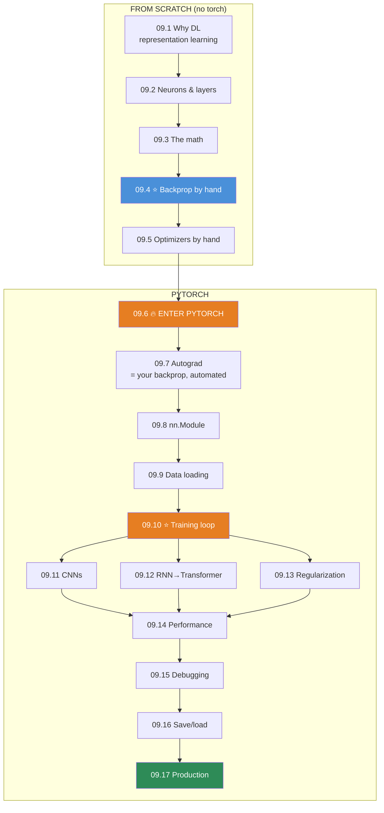

# 09.18 · Projects & Module Summary

[⬅ 09.17 Production Deep Learning](09.17-production.md) · [🏠 Module 09](../README.md) · [➡ Module 10 · NLP](../../10-NLP/README.md)

> **The lesson in one line:** Seven projects that take you from a NumPy network you wrote by hand to a deployed, monitored deep learning service — and the consolidation of everything the module taught.

---

## The seven projects

| # | Project | Proves you can | Lessons |
|---|---|---|---|
| 1 | **Neural Network from Scratch (NumPy)** | Build backprop by hand and verify it | [09.4](09.4-backpropagation.md) |
| 2 | **PyTorch Training Framework** | Write the loop everyone reuses | [09.10](09.10-training-loop.md) |
| 3 | **MNIST Classifier** | The full pipeline, end to end | [09.6](09.6-pytorch-tensors.md)–[09.10](09.10-training-loop.md) |
| 4 | **CIFAR-10 Image Classifier** | CNNs and transfer learning | [09.11](09.11-cnns.md) |
| 5 | **Sentiment Classifier** | Sequence models, and why Transformers won | [09.12](09.12-sequence-models.md) |
| 6 | **Regression Model** | DL on tabular (and when *not* to) | [09.2](09.2-neural-network-fundamentals.md), [09.13](09.13-regularization.md) |
| 7 | **Model Server** | Deploy, optimize, and monitor | [09.16](09.16-saving-loading.md), [09.17](09.17-production.md) |

```
code/09-deep-learning/
├── README.md
├── requirements.txt      # torch, torchvision, numpy, matplotlib, wandb, onnx, pytest
├── nn-from-scratch/      # 1  (09.4) — the flagship of the first half
├── training-framework/   # 2  (09.10) — the flagship of the second half
├── mnist-classifier/     # 3
├── cifar-classifier/     # 4  (09.11)
├── sentiment-lstm/       # 5  (09.12)
├── tabular-regression/   # 6
├── model-server/         # 7  (09.17)
└── shared/               # ⭐ the reusable Trainer, from project 2
```

> [!IMPORTANT]
> **⭐ Two projects are load-bearing, and everything else builds on them.** **`nn-from-scratch`** ([09.4](09.4-backpropagation.md)) proves you understand what PyTorch does — you wrote `backward()` by hand and verified it against autograd. **`training-framework`** ([09.10](09.10-training-loop.md)) is the loop you *reuse* for every other project — the CNN, the LSTM, the regression model all use the identical trainer. **Build these two well and the rest are variations.**

---

## Project 1 — Neural Network from Scratch (NumPy) ⭐

**The flagship of the pre-PyTorch half.** Full spec in [09.4](09.4-backpropagation.md#️-mini-project--neural-network-from-scratch-numpy).

**The deliverable is understanding, proven by gradient checks.** A complete network — forward, backward, SGD/Adam — in pure NumPy, every layer gradient-checked in float64, trained on MNIST to >95%. **When you later call `loss.backward()`, you know exactly what runs, because you wrote it.**

**The moment it clicks:** your hand-written `backward()` gradients match PyTorch's `autograd` via `torch.allclose` ([09.7](09.7-autograd.md)'s project). Not belief — proof.

---

## Project 2 — PyTorch Training Framework ⭐

**The flagship of the PyTorch half.** Full spec in [09.10](09.10-training-loop.md#️-mini-project--the-pytorch-training-framework).

A model-agnostic `Trainer`: train/validate, checkpoint the best, log, early-stop, schedule. **With the overfit-one-batch and ln(C) sanity checks built in** ([09.15](09.15-debugging.md)) — so it refuses to start a doomed run.

**Why it matters:** you build it once and use it for projects 3–6. **Nobody rewrites the training loop per model** — proving that to yourself is the point.

---

## Project 3 — MNIST Classifier

**The "hello world" of deep learning, done properly.** The full pipeline: `Dataset`/`DataLoader` ([09.9](09.9-data-loading.md)), an `nn.Module` MLP ([09.8](09.8-building-models.md)), the [09.10](09.10-training-loop.md) trainer, honest evaluation ([08.12](../../08-Machine-Learning/weeks/08.12-evaluation.md)). **Then rebuild the *exact* network in NumPy (project 1) and confirm the loss curves match — the transparency moment.**

---

## Project 4 — CIFAR-10 Image Classifier

Full spec in [09.11](09.11-cnns.md#️-mini-project--cifar-10-image-classifier).

**The lesson: transfer learning wins, especially on small data.** Train a CNN from scratch and a fine-tuned ResNet on the same data, compare with CIs — then shrink the training set and watch the transfer gap *widen*. **Visualize the learned filters** and see your own network discover edge detection ([09.1](09.1-why-deep-learning.md)).

---

## Project 5 — Sentiment Classifier

Full spec in [09.12](09.12-sequence-models.md#️-mini-project--the-sentiment-classifier).

**An LSTM, plus the RNN-vs-Transformer comparison that motivates the next era.** Correct padding/packing, gradient clipping, and — the deliverable — **measure that the Transformer trains faster because it parallelizes** ([09.6](09.6-pytorch-tensors.md)). That stopwatch reading is the empirical reason the field abandoned recurrence.

---

## Project 6 — Regression Model (and when *not* to use DL)

Build `code/09-deep-learning/tabular-regression/` — a deep model on tabular data, **compared honestly against a gradient-boosted tree.**

**Requirements**
- A deep MLP for a tabular regression task (with normalization, dropout, weight decay).
- **A LightGBM baseline** ([08.6](../../08-Machine-Learning/weeks/08.6-ensembles.md)).
- **An honest comparison**: accuracy, training time, and interpretability.

> [!IMPORTANT]
> **⭐ This project's real lesson is [09.1](09.1-why-deep-learning.md)'s: deep learning did NOT win tabular data.** Build the deep MLP carefully — normalize, regularize, tune — and **it will very likely lose to LightGBM**, which trains in seconds, needs no GPU, and is interpretable ([08.1](../../08-Machine-Learning/weeks/08.1-what-is-ml.md), [08.6](../../08-Machine-Learning/weeks/08.6-ensembles.md)). **Producing that result with your own hands is the most valuable thing in this project** — it inoculates you against the expensive, common mistake of reaching for deep learning on spreadsheet-shaped problems. **A senior engineer knows when *not* to use the fancy tool**, and this project makes you one.

---

## Project 7 — Model Server

Full spec in [09.17](09.17-production.md#️-mini-project--the-model-server).

**Take a trained model to production, reusing Module 08's MLOps.** FastAPI serving (`eval` + `no_grad`), dynamic batching (measure latency vs throughput), ONNX export with verified parity, and **the prediction-distribution drift monitor from [08.17](../../08-Machine-Learning/weeks/08.17-production-ml.md), unchanged.** The deliverable: a real, deployable, monitored service — proving **MLOps doesn't change because the model got deep.**

---

## 📊 Module Summary — everything, connected

### The eighteen lessons as one arc



### The ideas that did the most work

| Idea | Where it reappeared |
|---|---|
| **⭐ A layer is a matmul + bias + nonlinearity** | 09.2 → everything |
| **⭐ The nonlinearity is why depth works** | 09.2 (proved), 09.4 (or gradients vanish) |
| **⭐ Backprop = the chain rule, cached, right-to-left** | 09.4 (by hand) → 09.7 (autograd) |
| **⭐ `predicted − actual`** | The gradient of the fused loss (09.3, 09.4) |
| **⭐ The vanishing/exploding $\lambda^n$ problem** | 09.4, 09.12 (across time), 09.15 (diagnosed) |
| **⭐ Residual connections = the gradient highway** | 09.4, 09.11 (ResNet), 09.12 (LSTM cell), 09.13 |
| **⭐ The train/eval/no_grad dance** | 09.7, 09.10, 09.13, 09.17 |
| **⭐ Mixed precision & the memory story** | 09.5 (Adam 3×), 09.6, 09.14, 09.17 |
| **⭐ Overfit one batch first** | 09.10, 09.15 (the debugging move) |
| **⭐ The training loop never changes** | 09.10 → CNN, LSTM, regression all reuse it |
| **⭐ Evaluation & MLOps don't change from Module 08** | 09.10, 09.17 |

> [!IMPORTANT]
> **⭐ Notice how much of this module was Module 06 and Module 08, made concrete.** The chain rule ([06.4](../../06-Mathematics/weeks/06.4-calculus.md)) became a `backward()` method. Cross-entropy ([06.8](../../06-Mathematics/weeks/06.8-information-theory.md)) became the loss. Adam ([06.7](../../06-Mathematics/weeks/06.7-optimization.md)) became `torch.optim.AdamW`. The overfitting diagnostic ([08.2](../../08-Machine-Learning/weeks/08.2-ml-workflow.md)), the honest evaluation ([08.12](../../08-Machine-Learning/weeks/08.12-evaluation.md)), and the deployment discipline ([08.17](../../08-Machine-Learning/weeks/08.17-production-ml.md)) transferred **unchanged.** **Deep learning added a new *model*, not a new *discipline*** — and recognizing that is what separates an engineer who ships models from one who is dazzled by them.

---

## ✅ Self-assessment

**Foundations (no PyTorch)**
- [ ] I can explain why the nonlinearity is mandatory (one-line proof)
- [ ] I can **derive and implement backprop** for a full network
- [ ] I **gradient-check** a hand-written backward pass in float64
- [ ] I can implement Adam in twelve lines and explain each

**PyTorch**
- [ ] I know what a tensor adds to a NumPy array (device + autograd)
- [ ] I fix the "tensors on different devices" error reflexively
- [ ] I explain the **dynamic graph** and why it made PyTorch win
- [ ] I get the **`train()`/`eval()`/`no_grad()` dance** right
- [ ] I use `nn.ModuleList`, not a plain list, for dynamic layers
- [ ] I never leak memory by appending un-detached tensors

**Training & architectures**
- [ ] I write the **training loop** from memory
- [ ] I keep the GPU fed (`num_workers`) and diagnose an idle GPU
- [ ] I explain why CNNs beat FC on images (weight sharing)
- [ ] I explain why Transformers beat RNNs (parallelism + long range)
- [ ] I use **transfer learning** on small data
- [ ] I diagnose vanishing/exploding gradients and dead neurons

**Optimize, debug, ship**
- [ ] I use **mixed precision** by default
- [ ] My **first debugging move is overfit-one-batch**
- [ ] I save the **`state_dict`** and the **optimizer state** for resuming
- [ ] I know `torch.load` is an RCE risk
- [ ] I know **DL didn't win tabular data**
- [ ] I know **MLOps doesn't change** because the model got deep

---

## 🎯 What this module bought you

**Before:** neural networks were magic, PyTorch was incantations, and a `NaN` loss meant randomly changing things and hoping.

**Now:**
- You **wrote `backward()` by hand** and proved PyTorch's autograd does the same thing.
- You know a network is **matmul → nonlinearity → repeat → loss**, and the loop is **`zero_grad` → `backward` → `step`.**
- You know **why gradients vanish** (the chain rule multiplies) and **the fixes** (ReLU, residuals, norm).
- Your **first debugging move is to overfit one batch** — and you fix `NaN`s systematically.
- You use **mixed precision by default**, diagnose an idle GPU, and know why the optimizer state is what OOMs you.
- You can **deploy a model** — and you know the MLOps is exactly Module 08's.
- You know **when NOT to use deep learning** — which is a senior instinct.

**You can build, train, optimize, debug, and deploy deep learning models while understanding the theory underneath.** That's the whole goal of the module.

---

## 🧭 Where this leads

| Next | What Module 09 gives you |
|---|---|
| [**10 · NLP**](../../10-NLP/README.md) | ⭐ **Everything.** Embeddings, sequence models, and the Transformer you'll now build |
| [**11 · LLMs**](../../11-LLMs/README.md) | The Transformer, at scale — you know its every component |
| [**13 · RAG**](../../13-RAG/README.md) | Embeddings from a trained model |
| [**15 · Fine-Tuning**](../../15-Fine-Tuning/README.md) | Transfer learning + the Adam-memory story = **why LoRA exists** |
| [**16 · MLOps**](../../16-MLOps/README.md) | Serving, monitoring, versioning — you've built miniatures |

> [!IMPORTANT]
> **⭐ Module 10 will build a Transformer, and you already understand every piece of it.** Attention is [matmul + softmax](../../06-Mathematics/weeks/06.11-transformer-math.md); the feed-forward block is [Linear → GELU → Linear](09.8-building-models.md); it's trained with [the exact loop](09.10-training-loop.md) you built; it uses [LayerNorm](09.13-regularization.md), [residual connections](09.11-cnns.md), and [AdamW](09.5-optimization.md); and it exists **because RNNs couldn't parallelize** ([09.12](09.12-sequence-models.md)). **You are not about to learn something new — you are about to assemble things you already know into the architecture that runs the world.**

---

## 📄 Module cheat sheet

| Lesson | The one thing |
|---|---|
| **09.1** | DL learns features; **it didn't win tabular data** |
| **09.2** | A layer = **matmul + bias + nonlinearity**; nonlinearity is why depth works |
| **09.3** | Loss takes **logits**; check initial loss ≈ **ln(C)** |
| **09.4** | ⭐ **Backprop = chain rule, cached, right-to-left.** Gradient-check it |
| **09.5** | ⭐ **AdamW.** Adam = 3× param memory |
| **09.6** | Tensor = NumPy + **device + autograd.** Move every batch |
| **09.7** | ⭐ Autograd = your backprop, automated. **`eval()` ≠ `no_grad()`** |
| **09.8** | `nn.Module`: `__init__` = parts, `forward` = wiring. **`ModuleList`, not list** |
| **09.9** | ⭐ **`num_workers`** or the GPU starves. Augment **train only** |
| **09.10** | ⭐ **`zero_grad`→`backward`→`step`.** The model changes; the loop doesn't |
| **09.11** | ⭐ Weight sharing → translation invariance. **Transfer learning** |
| **09.12** | ⭐ Transformers won: **parallel + long range.** RNNs are sequential |
| **09.13** | Diagnose first. **Data/augmentation is the strongest regularizer** |
| **09.14** | ⭐ **Mixed precision by default.** Diagnose the resource first |
| **09.15** | ⭐ **Overfit one batch FIRST.** Change one thing at a time |
| **09.16** | Save the **`state_dict`** + optimizer state. `torch.load` = RCE |
| **09.17** | ⭐ **MLOps doesn't change.** Inference is lighter; batch vs latency |

**⭐ The universal loop:** `zero_grad → forward → loss → backward → step`.
**⭐ The universal debug move:** can it overfit one batch?

---

## 📚 References — the short list

1. **Karpathy — *Neural Networks: Zero to Hero*** (YouTube). ⭐⭐ Build micrograd, then makemore, then GPT. **The best practical deep-learning education that exists, and it *is* this module.**
2. **Karpathy — *A Recipe for Training Neural Networks*** (blog). ⭐ The overfit-one-batch discipline and the whole debugging method.
3. **Goodfellow, Bengio & Courville — *Deep Learning*** (free). The rigorous reference.
4. **Stevens, Antiga & Viehmann — *Deep Learning with PyTorch*** (free from Manning). The best PyTorch book.
5. **PyTorch official tutorials** — start with the 60-minute Blitz.
6. **3Blue1Brown — *Neural Networks*** (YouTube). The visual intuition.

---

## 🧭 Navigation

| Direction | Link |
|---|---|
| ⬅ Previous | [09.17 Production Deep Learning](09.17-production.md) |
| ➡ Next module | [10 · NLP](../../10-NLP/README.md) |
| 🏠 Module | [Module 09](../README.md) |
| 📖 All lessons | [Lesson index](README.md) |
| 🗺 Roadmap | [ROADMAP.md](../../../ROADMAP.md) |
