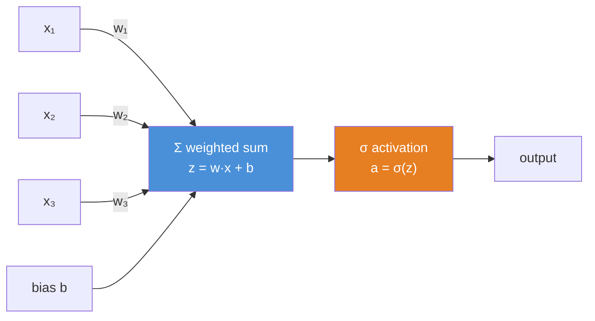
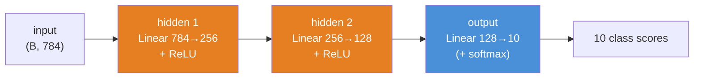
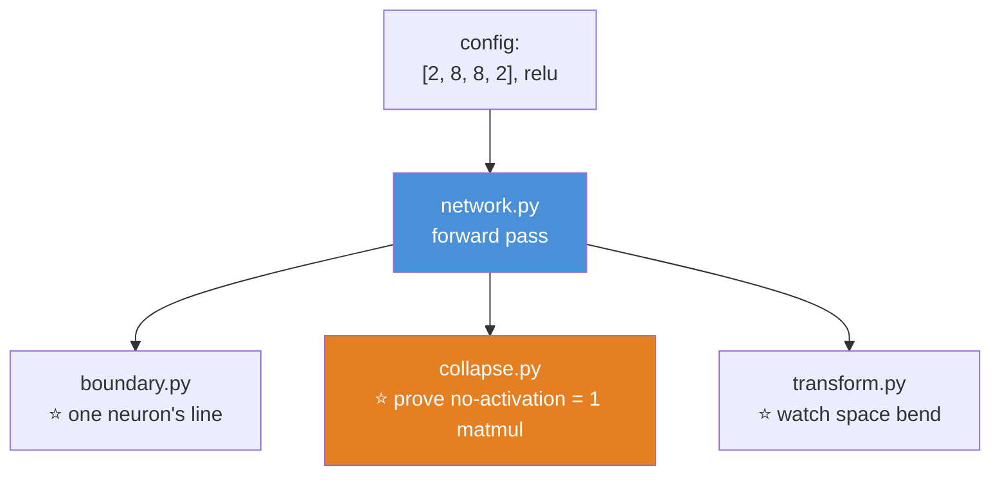

# 09.2 · Neural Network Fundamentals

[⬅ 09.1 Why Deep Learning?](09.1-why-deep-learning.md) · [🏠 Module 09](../README.md) · [➡ 09.3 The Mathematics](09.3-math-of-neural-networks.md)

> **The lesson in one line:** A neuron is a dot product with a squash; a layer is a matrix multiply with a squash; a network is that, stacked — and there is genuinely nothing more to it.

---

## 🎯 Learning objectives

By the end of this lesson you can:

1. Explain an **artificial neuron** as a weighted sum plus a bias plus a nonlinearity.
2. Explain why the **bias** exists and what breaks without it.
3. See a **layer as one matrix multiplication** — the single most important reframing in the module.
4. Trace a **forward pass** through a small network, tracking every shape.
5. Choose an **activation function** and defend it from its derivative.
6. Explain — with a one-line proof — **why the nonlinearity is non-negotiable.**

---

## 🧠 Mental model

> **`output = activation(weights · input + bias)`. That's a neuron. Everything else is bookkeeping.**



The **biological inspiration** (a real neuron fires when its inputs exceed a threshold) is a nice story and where the name comes from — **but forget it now.** An artificial neuron is not a model of a brain cell; it is **a dot product followed by a nonlinear function**, and thinking of it as anything more mystical will slow you down. It's math, and the math is simple.

---

## 📐 The artificial neuron

$$z = \sum_i w_i x_i + b = \mathbf{w}\cdot\mathbf{x} + b \qquad\qquad a = \sigma(z)$$

Three parts, each with a job:

| Part | What it is | Its job |
|---|---|---|
| **Weights** $\mathbf{w}$ | One number per input | *"How much does each input matter?"* — the learned knowledge |
| **Bias** $b$ | One number | Shifts the threshold — *"how easy is this neuron to activate?"* |
| **Activation** $\sigma$ | A nonlinear function | Bends the output — **the thing that makes depth worth anything** |

**The weighted sum $\mathbf{w}\cdot\mathbf{x}$ is a [dot product](../../06-Mathematics/weeks/06.2-linear-algebra-vectors-matrices.md) — a measure of alignment.** A neuron "fires" (outputs a large value) when its input **points in the same direction as its weights.** **Each neuron is a pattern detector**, and its weights *are* the pattern it looks for. That's the whole intuition, and it's worth holding onto: the weights of a trained neuron literally are the feature it detects.

### Why the bias?

> [!IMPORTANT]
> **Without a bias, every neuron is forced to output $\sigma(0)$ when its input is zero — its decision boundary must pass through the origin.** That's a crippling constraint.
>
> Think of a single neuron drawing a line. `w·x = 0` is a line **through the origin**. `w·x + b = 0` is a line **anywhere**. The bias is what lets the boundary *move* — it decouples "which direction the neuron cares about" (the weights) from "where the threshold sits" (the bias).
>
> **It's the exact same role as the intercept in linear regression** ([08.3](../../08-Machine-Learning/weeks/08.3-linear-regression.md)): without it, your line is nailed to the origin, and most data doesn't pass through the origin. Every neuron has one.

---

## ⭐ The reframe: a layer is ONE matrix multiplication

**This is the most important idea in the lesson.** You don't compute neurons one at a time. **A whole layer of neurons is a single matrix multiply.**

Say layer takes $d$ inputs and has $h$ neurons. Stack the neurons' weight vectors as the *rows* of a weight matrix $W$ (shape $(h, d)$). Then **all $h$ neurons compute at once:**

$$\mathbf{z} = W\mathbf{x} + \mathbf{b} \qquad (h,) \leftarrow (h, d)(d,) + (h,)$$
$$\mathbf{a} = \sigma(\mathbf{z}) \qquad (h,)$$

And for a whole **batch** of $B$ inputs, stack them as rows of $X$ (shape $(B, d)$):

$$Z = X W^\top + \mathbf{b} \qquad (B, h) \leftarrow (B, d)(d, h) + (h,)$$

> [!IMPORTANT]
> **A neural network layer IS matrix multiplication + a bias + an elementwise nonlinearity.** That's it. That's the whole thing.
>
> This is why [06.2](../../06-Mathematics/weeks/06.2-linear-algebra-vectors-matrices.md) mattered so much: **>90% of the FLOPs in training a neural network are matmuls**, and it's why GPUs (which are matmul machines) run networks 100× faster than CPUs. When someone says "7 billion parameters," they mean **the numbers inside these weight matrices.**
>
> **The bias broadcasts** across the batch ([06.9](../../06-Mathematics/weeks/06.9-numerical-computing.md)) — one bias vector `(h,)` is added to every one of the `B` rows.

> [!NOTE]
> **A convention warning that will save you an hour.** In the math above, $W$ is $(h, d)$ and we write $XW^\top$. **PyTorch's `nn.Linear(d, h)` stores its weight as `(h, d)`** — the "out, in" convention from [06.2](../../06-Mathematics/weeks/06.2-linear-algebra-vectors-matrices.md) — and computes `x @ W.T + b`. Half of all shape errors in real code come from forgetting this. **Write the shape next to every layer.**

---

## 🏗️ Layers and the network



| Layer type | Role |
|---|---|
| **Input layer** | Not really a layer — just where the data enters. Its "size" is the number of features |
| **Hidden layers** | Where the [representation learning](09.1-why-deep-learning.md) happens. "Deep" = many of these |
| **Output layer** | Produces the answer. Its size and activation depend on the task (below) |

### The output layer depends on the task ([08.1](../../08-Machine-Learning/weeks/08.1-what-is-ml.md), [06.8](../../06-Mathematics/weeks/06.8-information-theory.md))

| Task | Output neurons | Output activation | Loss |
|---|---|---|---|
| **Regression** | 1 | **None** (raw value) | MSE |
| **Binary classification** | 1 | **Sigmoid** → a probability | Binary cross-entropy |
| **Multi-class** (10 classes) | 10 | **Softmax** → a distribution | Cross-entropy |
| **Multi-label** | one per label | **Sigmoid** each | Binary cross-entropy each |

> [!TIP]
> **The hidden layers all look the same (Linear + ReLU); the output layer is where the task lives.** Get the output layer wrong — sigmoid instead of softmax, 1 neuron instead of 10 — and nothing else can save you. **Match the output activation to the loss** ([09.3](09.3-math-of-neural-networks.md)).

---

## ⚡ Activation functions — and why they're mandatory

### ⭐ The one-line proof that you need them

Stack two Linear layers with **no** activation between them:

$$\mathbf{z}_2 = W_2(W_1\mathbf{x} + \mathbf{b}_1) + \mathbf{b}_2 = \underbrace{(W_2 W_1)}_{\text{just another matrix}}\mathbf{x} + \underbrace{(W_2\mathbf{b}_1 + \mathbf{b}_2)}_{\text{just another bias}}$$

> [!IMPORTANT]
> **A stack of 100 Linear layers with no nonlinearity collapses into ONE Linear layer.** The composition of linear functions is linear ([06.2](../../06-Mathematics/weeks/06.2-linear-algebra-vectors-matrices.md): matmul is function composition). Without an activation, a 100-layer network has *exactly* the expressive power of logistic regression — a single straight boundary.
>
> **The activation is the ONLY reason depth buys you anything.** Every "bend" between the matmuls is what lets the network carve non-linear shapes ([09.1](09.1-why-deep-learning.md)'s representation hierarchy). This is not a detail. It is the entire justification for the field. *(You proved this once in [06.10](../../06-Mathematics/weeks/06.10-neural-network-math.md); it's worth proving again, because it's that important.)*

### The activations you'll use

| Activation | Formula | Derivative | Verdict |
|---|---|---|---|
| **Sigmoid** | $\frac{1}{1+e^{-z}}$ | $\sigma(1-\sigma) \le \mathbf{0.25}$ | ❌ Hidden layers (**vanishing gradients**). ✅ Binary output |
| **Tanh** | $\frac{e^z-e^{-z}}{e^z+e^{-z}}$ | $1-\tanh^2 \le 1$ | 🟡 Zero-centered but still saturates. Old RNNs |
| **ReLU** | $\max(0, z)$ | **1** if z>0 else **0** | ✅ **The default.** Cheap, no vanishing — but can *die* |
| **Leaky ReLU** | $\max(0.01z, z)$ | 1 or 0.01 | ✅ Fixes dying ReLU |
| **GELU** | $z\cdot\Phi(z)$ | smooth | ✅ **Transformers** (BERT, GPT) |
| **SiLU/Swish** | $z\cdot\sigma(z)$ | smooth | ✅ Modern CNNs, LLaMA |

> [!IMPORTANT]
> **⭐ Read the derivative column — it decides everything, and it's the same lesson as [06.10](../../06-Mathematics/weeks/06.10-neural-network-math.md).**
>
> Backprop **multiplies** these derivatives across layers ([09.4](09.4-backpropagation.md)). Sigmoid's derivative maxes at **0.25**, so 10 sigmoid layers multiply gradients by at most $0.25^{10} \approx 10^{-6}$ — **the gradient is annihilated and the early layers never learn.** That is the *vanishing gradient problem*, and it's why sigmoid was abandoned in hidden layers.
>
> **ReLU's derivative is exactly 1 when active.** Multiply by 1 as many times as you like — nothing vanishes. **ReLU didn't win because it's elegant; it won because its derivative is 1**, and that single fact is what made networks deeper than a few layers trainable at all.

### The dying ReLU problem

ReLU's derivative is **0** for negative inputs. If a neuron's pre-activation goes persistently negative, its gradient is **exactly zero forever** — it can never update, never recover. It is **dead**. In a badly-initialized or high-learning-rate network, 40% of your neurons can silently die. **Fix:** Leaky ReLU (a small negative slope keeps a trickle of gradient) or GELU/SiLU (smooth, no hard-off region). This is a real failure mode you'll diagnose in [09.15](09.15-debugging.md).

> 🖼️ **[IMAGE PLACEHOLDER: `assets/images/09-activations.png`]**
> *A 2×3 grid. Top row: sigmoid, tanh, ReLU, GELU plotted on z ∈ [−5, 5]. Bottom row: their derivatives on the same axes and scale. The sigmoid-derivative panel has a horizontal dashed line at 0.25 labelled "MAX 0.25 → gradients vanish across depth"; the ReLU-derivative panel is a step function annotated "= 1 when active → gradients survive → why deep nets became trainable"; the GELU-derivative is smooth and nonzero everywhere, labelled "no dead neurons." Caption: "Choose an activation by looking at the bottom row. The derivative is what backprop multiplies."*

---

## 🐍 A forward pass, from scratch

**No PyTorch. Just NumPy and the four ideas above.** A 2-hidden-layer network classifying MNIST digits (784 pixels → 10 classes):

```python
import numpy as np

def relu(z):    return np.maximum(0, z)

def softmax(z):                                  # numerically stable (06.9)
    z = z - z.max(axis=1, keepdims=True)
    e = np.exp(z)
    return e / e.sum(axis=1, keepdims=True)

# ── The network's parameters (random for now; 09.4 learns them) ───
rng = np.random.default_rng(0)
W1 = rng.normal(0, np.sqrt(2/784), (784, 256)).astype(np.float32)   # He init (06.5)
b1 = np.zeros(256, dtype=np.float32)
W2 = rng.normal(0, np.sqrt(2/256), (256, 128)).astype(np.float32)
b2 = np.zeros(128, dtype=np.float32)
W3 = rng.normal(0, np.sqrt(2/128), (128, 10)).astype(np.float32)
b3 = np.zeros(10, dtype=np.float32)

def forward(X):                                  # X: (B, 784)
    z1 = X  @ W1 + b1;  a1 = relu(z1)            # (B, 256)  ← layer 1: matmul + squash
    z2 = a1 @ W2 + b2;  a2 = relu(z2)            # (B, 128)  ← layer 2
    z3 = a2 @ W3 + b3                            # (B, 10)   ← output (logits)
    return softmax(z3)                           # (B, 10)   ← probabilities

X = rng.normal(size=(4, 784)).astype(np.float32)  # a batch of 4 fake images
probs = forward(X)
print(probs.shape)                # (4, 10)
print(probs.sum(axis=1))          # [1. 1. 1. 1.]  ← each row is a probability distribution
print(probs.argmax(axis=1))       # the predicted digit for each image
```

> [!TIP]
> **Read that `forward` function. It is a complete neural network's forward pass, and it is six lines.** Three matmuls, two ReLUs, one softmax. **When you later write `model(x)` in PyTorch, this is what runs.** The whole rest of this module is (a) learning the weights instead of randomizing them, and (b) doing it fast on a GPU. **The forward pass itself will never get more complicated than this.**

---

## 🏭 Production examples

| Where | The network |
|---|---|
| Image classifier | Conv layers → Linear → softmax ([09.11](09.11-cnns.md)) |
| A recommender's "tower" | Linear + ReLU stack → an embedding |
| An LLM's feed-forward block | Linear → GELU → Linear (2/3 of a Transformer's params — [06.11](../../06-Mathematics/weeks/06.11-transformer-math.md)) |
| Tabular deep model | Linear + BatchNorm + ReLU + dropout, repeated |

**Even the largest models are made of the layer you just built.** A Transformer's feed-forward network is *literally* `Linear → GELU → Linear`. You now understand a real component of GPT.

---

## ⚡ Performance & GPU considerations

| Fact | Consequence |
|---|---|
| A layer is a **matmul** | GPUs do matmul ~100× faster → **networks run on GPUs** |
| Cost is **O(B · d · h)** per layer | Doubling a layer's width **quadruples** its cost |
| Bigger batches = better GPU use | One big matmul beats many small ones ([06.2](../../06-Mathematics/weeks/06.2-linear-algebra-vectors-matrices.md)) |
| **Activations are cheap; matmuls dominate** | ReLU is ~free; the Linear layers are where the time goes |
| The bias broadcasts | Negligible cost, but get the shape right |

---

## 🐛 Common mistakes

| Mistake | Consequence |
|---|---|
| **No activation between Linear layers** | 100 layers collapse to 1 — logistic regression with extra steps |
| **Sigmoid/tanh in deep hidden layers** | Gradients vanish (0.25ⁿ); early layers don't learn |
| **No bias** | The decision boundary is nailed to the origin |
| **Wrong output activation** | Softmax for regression, or 1 neuron for 10 classes — nothing else can fix it |
| **Forgetting `nn.Linear` is (out, in)** | Half of all shape errors |
| Softmax without max-subtraction | `exp` overflow → `NaN` ([06.9](../../06-Mathematics/weeks/06.9-numerical-computing.md)) |
| Zero-initializing weights | All neurons compute the same thing — symmetry never breaks ([06.10](../../06-Mathematics/weeks/06.10-neural-network-math.md)) |
| Not tracking shapes | The #1 source of confusion. Annotate every layer |

---

## 📝 Exercises

**Mathematical**
1. Write out a single neuron's computation for 3 inputs. Then rewrite a layer of 4 such neurons as **one matrix multiplication.** State the shape of $W$.
2. **Prove that a network with no activations is equivalent to a single Linear layer.** *(One line.)*
3. Why does the bias let the decision boundary move off the origin? Draw `w·x = 0` and `w·x + b = 0`.
4. Sigmoid's derivative maxes at 0.25. Compute $0.25^{10}$. **What does that mean for a 10-layer sigmoid network?**

**Tensor & implementation**
5. Implement the `forward` function above from memory. Feed it a batch of 8. **Verify every row of the output sums to 1** and print the shapes at each layer.
6. Add a **bias-free** version and a **no-activation** version. Show (numerically) that the no-activation 3-layer network can be reproduced by a single matmul.
7. Swap ReLU for sigmoid. Feed in a batch and print the activations at each layer. Then imagine 20 layers — **why would the early gradients vanish?**
8. Implement Leaky ReLU and GELU. Plot all four activations and their derivatives on one figure.

**Analysis**
9. For each task, specify the **output layer** (number of neurons + activation) and the **loss**: (a) predict house price; (b) is this email spam?; (c) classify a photo into 1,000 categories; (d) tag a photo with any of 20 possible objects.
10. A network has `Linear(100, 50)`. What shape is its weight matrix **in the math convention** and **in PyTorch's convention**? Why do they differ?

---

## 🛠️ Mini project — *The Neuron Playground*

Build `code/09-deep-learning/neuron-playground/` — an interactive NumPy network that makes every concept visible, with zero frameworks.

**Requirements**
- A pure-NumPy `Network` class: configurable layer sizes and activations, forward pass only (learning comes in [09.4](09.4-backpropagation.md)).
- **Visualize a single neuron's decision boundary** as you drag its weights and bias.
- **Show the collapse:** a multi-layer no-activation network reproduced by one matmul.
- **Show representation:** plot how a 2-D input is transformed by each layer.

```
neuron-playground/
├── README.md
├── src/
│   ├── network.py        # ⭐ pure-NumPy forward pass, configurable
│   ├── activations.py    # relu, sigmoid, tanh, gelu + derivatives
│   ├── boundary.py       # ⭐ plot one neuron's boundary vs weights/bias
│   ├── collapse.py       # ⭐ no-activation stack == one matmul
│   └── transform.py      # ⭐ how each layer bends 2-D space
├── tests/
│   └── test_shapes.py    # every layer's output shape is correct
└── notebooks/
```

**Architecture**



**Implementation guidance**
1. **`network.py` first — forward only.** `Network([784, 256, 128, 10], activation='relu')`. He initialization ([06.5](../../06-Mathematics/weeks/06.5-probability.md)), a `forward(X)` that returns per-layer activations (you'll want them for backprop in [09.4](09.4-backpropagation.md), and for visualization now). **Keep it minimal — this is the object [09.4](09.4-backpropagation.md) will teach to learn.**
2. **`collapse.py` is the lesson made undeniable.** Build a 3-layer network with `activation='none'`. Compute its output. Then compute `W1 @ W2 @ W3`-equivalent as a single matmul and show they're identical with `np.allclose`. **Now add ReLU and show the equivalence breaks.** *You have just proven, in code, why activations exist.*
3. **`transform.py` is the representation-learning demo, in 2-D.** Take a grid of 2-D points (or two interleaved spirals). Plot them, then plot them after layer 1, layer 2, layer 3. **With ReLU, watch the tangled spirals gradually straighten** — that's [09.1](09.1-why-deep-learning.md)'s "each layer makes the next layer's job easier," visible in two dimensions. (The weights are random for now, so it won't perfectly separate — but you'll *see* the bending.)

**Testing plan:** assert every layer's output shape matches the config; assert the softmax output sums to 1 per row; assert `collapse.py`'s no-activation network equals a single matmul.

**Evaluation:** qualitative — the three visualizations. **The "collapse" plot is the deliverable**: it's the most convincing possible argument for why nonlinearity is mandatory.

**Future improvements:** this is the *exact* class you'll add `backward()` to in [09.4](09.4-backpropagation.md). Design it with that in mind — have `forward` cache the intermediate activations, because backprop needs them.

---

## 📄 Cheat sheet

| | |
|---|---|
| **Neuron** | $a = \sigma(\mathbf{w}\cdot\mathbf{x} + b)$ — a dot product + a squash |
| **⭐ Layer** | $Z = XW^\top + \mathbf{b}$, then $\sigma(Z)$ — **ONE matmul + bias + activation** |
| **Weights** | The learned pattern each neuron detects |
| **Bias** | Moves the boundary off the origin (like a regression intercept) |
| **⭐ Why activations** | **No nonlinearity → 100 layers collapse to 1** (linear ∘ linear = linear) |
| **Output layer** | Regression: 1, none. Binary: 1, sigmoid. Multi-class: k, softmax |
| **Shapes** | `nn.Linear(in, out)` stores W as **(out, in)**; computes `x @ W.T + b` |

| Activation | Derivative | Use |
|---|---|---|
| Sigmoid | ≤ 0.25 | ❌ hidden (vanishing) · ✅ binary output |
| **ReLU** | **1** or 0 | ✅ **the default** — derivative 1 = no vanishing |
| GELU/SiLU | smooth | ✅ Transformers, modern CNNs |

**⭐ >90% of a network's FLOPs are matmuls → that's why it runs on GPUs.**

---

## 🎴 Flashcards

- **Q:** What is an artificial neuron? → **A:** A **dot product plus a bias, passed through a nonlinearity**: $a = \sigma(\mathbf{w}\cdot\mathbf{x} + b)$. It fires when the input aligns with its weights — so **its weights ARE the pattern it detects.**
- **Q:** ⭐ What is a neural network layer, computationally? → **A:** **One matrix multiplication + a bias + an elementwise activation.** That's the whole thing — and it's why >90% of a network's FLOPs are matmuls, and why networks run on GPUs.
- **Q:** Why does a neuron need a bias? → **A:** Without it, the decision boundary is **forced through the origin** ($\mathbf{w}\cdot\mathbf{x}=0$). The bias lets the boundary **move anywhere** — exactly like a regression intercept.
- **Q:** ⭐ Prove you need an activation function. → **A:** A stack of Linear layers with no nonlinearity **collapses to a single Linear layer** ($W_2(W_1x+b_1)+b_2 = W'x + b'$). Without activations, 100 layers = logistic regression. **The nonlinearity is the only reason depth helps.**
- **Q:** Why did ReLU win over sigmoid for hidden layers? → **A:** Backprop multiplies per-layer derivatives. **Sigmoid's maxes at 0.25** (0.25¹⁰ ≈ 10⁻⁶ → vanishing gradients); **ReLU's is exactly 1 when active** → nothing vanishes. It won *because* its derivative is 1.
- **Q:** What is the dying ReLU problem? → **A:** A neuron stuck with negative pre-activation has gradient **exactly 0 forever** — it can never recover. Fix with **Leaky ReLU or GELU**.
- **Q:** How do you choose the output layer? → **A:** By the task. **Regression:** 1 neuron, no activation, MSE. **Binary:** 1, sigmoid, BCE. **Multi-class:** k neurons, softmax, cross-entropy.
- **Q:** Why does `nn.Linear(in, out)` store its weight as `(out, in)`? → **A:** The "out, in" convention: it computes `x @ W.T + b`. Forgetting this causes half of all shape errors.

---

## 💼 Interview questions

1. **"What is a neuron?"** — A dot product plus a bias through a nonlinearity. **Then note the weights ARE the learned pattern** — that framing shows depth.
2. **⭐ "Why do neural networks need activation functions?"** — Give the **one-line collapse proof**: without them, any depth of Linear layers is a single Linear layer. **The nonlinearity is the entire reason depth works.**
3. **"Why did ReLU replace sigmoid?"** — Its derivative is 1 (vs sigmoid's max of 0.25), so gradients don't vanish across depth. Also cheaper. Mention the dying-ReLU trade-off.
4. **"A layer is `Linear(512, 256)`. What's the compute, and why does it run on a GPU?"** — It's a matrix multiply, O(B·512·256). It runs on a GPU because **>90% of a network is matmuls**, which GPUs do ~100× faster than CPUs.
5. **"How do you pick the output layer for a 10-class classifier?"** — 10 neurons, **softmax**, cross-entropy loss. Match the output activation to the loss.

---

## 📚 Summary

- **A neuron is a dot product plus a bias through a nonlinearity:** $a = \sigma(\mathbf{w}\cdot\mathbf{x}+b)$. It's a **pattern detector** — its weights *are* the pattern, and it fires when the input aligns with them.
- **The bias** moves the decision boundary off the origin — the same role as a regression intercept. Every neuron has one.
- **⭐ A whole layer is ONE matrix multiplication + a bias + an elementwise activation.** This is the most important reframe in the module: it's why >90% of a network's compute is matmuls, and why networks live on GPUs.
- **⭐ The nonlinearity is non-negotiable.** Without it, a stack of Linear layers **collapses to a single Linear layer** — 100 layers with the expressive power of logistic regression. The activation is the *only* reason depth buys you anything.
- **Choose activations by their derivative.** Sigmoid's ≤ 0.25 (vanishing gradients across depth); **ReLU's is exactly 1** when active — which is *why* it made deep networks trainable. GELU/SiLU (smooth, no dead neurons) win in Transformers.
- **The output layer is where the task lives:** regression → 1 neuron/no activation/MSE; binary → sigmoid/BCE; multi-class → softmax/cross-entropy. Get it wrong and nothing else helps.
- **The forward pass is six lines of NumPy** — three matmuls, two ReLUs, a softmax. When you later write `model(x)`, this is what runs. It never gets more complicated than this.

**Next:** [09.3 The Mathematics of Neural Networks](09.3-math-of-neural-networks.md) — every equation, tied to the NumPy that runs it.

---

## 🔗 References

- Nielsen — *Neural Networks and Deep Learning*, Ch. 1 (free online). The clearest introduction to the neuron ever written.
- Goodfellow et al. — *Deep Learning*, Ch. 6 (Deep Feedforward Networks).
- 3Blue1Brown — *Neural Networks*, chapters 1–2 (YouTube). The visual intuition for "a layer is a matrix" is his.
- Glorot & Bengio (2010); He et al. (2015) — weight initialization (why the `√(2/n)` in the code).
- [06.2 Vectors & Matrices](../../06-Mathematics/weeks/06.2-linear-algebra-vectors-matrices.md) and [06.10 Neural Network Math](../../06-Mathematics/weeks/06.10-neural-network-math.md) — the algebra this lesson turns into a mental model.

---

## 🧭 Navigation

| Direction | Link |
|---|---|
| ⬅ Previous | [09.1 Why Deep Learning?](09.1-why-deep-learning.md) |
| ➡ Next | [09.3 The Mathematics of Neural Networks](09.3-math-of-neural-networks.md) |
| 🏠 Module | [Module 09](../README.md) |
| 🗺 Roadmap | [ROADMAP.md](../../../ROADMAP.md) |
