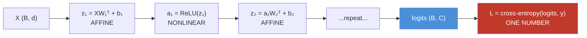
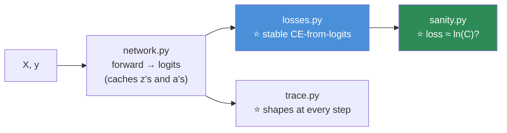

# 09.3 · The Mathematics of Neural Networks

[⬅ 09.2 Neural Network Fundamentals](09.2-neural-network-fundamentals.md) · [🏠 Module 09](../README.md) · [➡ 09.4 Backpropagation](09.4-backpropagation.md)

> **The lesson in one line:** A forward pass is `affine → nonlinear → affine → nonlinear → loss`, every step is a NumPy one-liner, and the loss is a single number that measures how wrong the whole thing is.

---

## 🎯 Learning objectives

By the end of this lesson you can:

1. Recognize a layer as an **affine transformation** and say what "affine" means.
2. Track a tensor's **shape** through an entire forward pass without hesitation.
3. Choose the right **loss function** for a task, and explain why it's paired with a specific output activation.
4. Explain **why `nn.CrossEntropyLoss` takes logits, not probabilities** — the numerical reason and the mathematical one.
5. Write the whole forward-pass-plus-loss in NumPy and reason about every line.

---

## 🧠 Mental model

> **Forward pass = a chain of affine transforms and squashes. Loss = one number that says "how wrong."**



**Everything to the left of the loss is *deterministic given the weights*. The loss is the compass** — the single scalar that [09.4](09.4-backpropagation.md)'s backprop will differentiate to find which way to nudge every weight.

---

## 📐 The affine transformation

**A layer's linear part, $W\mathbf{x} + \mathbf{b}$, is an *affine* transformation** — a **linear transformation followed by a shift.**

| Term | Means |
|---|---|
| **Linear** | $W\mathbf{x}$ — rotate, stretch, shear, project ([06.2](../../06-Mathematics/weeks/06.2-linear-algebra-vectors-matrices.md)). **Keeps the origin fixed** |
| **Affine** | $W\mathbf{x} + \mathbf{b}$ — linear **plus a translation**. **The origin can move** |

**That's why "linear layer" is technically a misnomer — it's affine** (the bias makes it so). The distinction matters because it's exactly what the bias buys you: the ability to *translate*, not just rotate/stretch ([09.2](09.2-neural-network-fundamentals.md)).

> [!NOTE]
> **You'll hear "linear," "dense," "fully-connected," and "affine" all used for the same layer.** They mean the same thing: `xW + b`. PyTorch calls it `nn.Linear`; TensorFlow calls it `Dense`. Don't let the vocabulary confuse you — **it's the layer from [09.2](09.2-neural-network-fundamentals.md), and it's a matmul plus a bias.**

---

## 🔢 Shape tracking — the skill that prevents 90% of bugs

**Deep learning bugs are, overwhelmingly, shape bugs.** The single most valuable habit you can build is **annotating the shape of every tensor.**

```python
import numpy as np
B = 32                        # batch size

X  = np.random.randn(B, 784)  # (32, 784)   ← 32 images, 784 pixels each
W1 = np.random.randn(784, 256) #             ← (in, out) in math convention
b1 = np.random.randn(256)      # (256,)

z1 = X @ W1 + b1              # (32, 256)   ← (32,784)@(784,256) → (32,256), +bias broadcasts
a1 = np.maximum(0, z1)       # (32, 256)   ← ReLU is elementwise, shape unchanged

W2 = np.random.randn(256, 10)
z2 = a1 @ W2                 # (32, 10)    ← logits
```

**The rules, from [06.2](../../06-Mathematics/weeks/06.2-linear-algebra-vectors-matrices.md):**
- **Matmul:** `(B, in) @ (in, out) → (B, out)`. **The inner dimensions must match and vanish; the outer survive.**
- **Bias:** `(out,)` **broadcasts** across all B rows ([06.9](../../06-Mathematics/weeks/06.9-numerical-computing.md)).
- **Elementwise ops (ReLU, sigmoid):** shape unchanged.

> [!IMPORTANT]
> **⭐ When you meet a `RuntimeError: mat1 and mat2 shapes cannot be multiplied (32x784 and 256x10)`, you already know how to read it:** the inner dimensions don't match (784 ≠ 256), so you skipped a layer or transposed something. **Shape errors are the most common error in deep learning and the easiest to fix — *if* you've been tracking shapes.** Print `.shape` liberally. It is not a beginner crutch; senior engineers do it constantly.

### The batch dimension

Everything has a leading **batch dimension** `B`. You never process one example — you process `B` at once, because **one big matmul is far more efficient than B small ones** ([06.2](../../06-Mathematics/weeks/06.2-linear-algebra-vectors-matrices.md), [09.2](09.2-neural-network-fundamentals.md)). The batch dimension is why every shape starts with `B`, and it's a source of confusion until you internalize it: **the network's math is written for one example, but it runs on a whole batch simultaneously via broadcasting.**

---

## 🎯 Loss functions — the compass

**The loss turns "how good is this network?" into a single number to minimize** ([08.1](../../08-Machine-Learning/weeks/08.1-what-is-ml.md)'s box 2). Lower = better. It's the thing gradient descent descends.

| Task | Loss | Formula | Paired output activation |
|---|---|---|---|
| **Regression** | **MSE** | $\frac{1}{n}\sum(\hat{y}-y)^2$ | None |
| Regression, outliers | **Huber / L1** | robust | None |
| **Binary classification** | **BCE** | $-[y\log\hat{p} + (1-y)\log(1-\hat{p})]$ | Sigmoid |
| **Multi-class** | **Cross-entropy** | $-\sum_c y_c\log\hat{p}_c$ | Softmax |
| **Multi-label** | **BCE per label** | sum of BCEs | Sigmoid each |

**These are exactly the losses from [08.3](../../08-Machine-Learning/weeks/08.3-linear-regression.md), [08.4](../../08-Machine-Learning/weeks/08.4-logistic-regression.md), and [06.8](../../06-Mathematics/weeks/06.8-information-theory.md).** Nothing about the loss changes because the model got deeper — **a deep classifier and a logistic regression minimize the identical cross-entropy.** That's a reassuring continuity: the whole of Module 08's evaluation and loss knowledge transfers unchanged.

### ⭐ Cross-entropy — the loss of nearly every classifier

$$L = -\frac{1}{B}\sum_{i}\log\hat{p}_{i,\,y_i}$$

For a one-hot target this collapses to: **the negative log of the probability your model assigned to the correct class** ([06.8](../../06-Mathematics/weeks/06.8-information-theory.md)). *"How much probability did you put on the truth? Take its negative log."*

| Prob on correct class | Loss $-\log\hat{p}$ |
|---|---|
| 0.99 | **0.01** ✅ confident and right |
| 0.5 | 0.69 |
| 0.01 | **4.61** ❌ confidently wrong |
| **0.0** | **∞** ☠️ certain and wrong |

**Cross-entropy punishes confident wrongness toward infinity** — which is exactly the incentive you want, and exactly why `log(0)` is the classic `NaN` ([09.15](09.15-debugging.md)).

---

## ⭐ Why the loss takes *logits*, not probabilities

**This is the single most important API fact in PyTorch, and it confuses everyone once.**

```python
# ❌ WRONG — applies softmax TWICE
probs = softmax(logits)
loss = nn.CrossEntropyLoss()(probs, y)      # CrossEntropyLoss ALSO applies softmax!

# ✅ RIGHT — pass the raw logits; the loss does the softmax internally
loss = nn.CrossEntropyLoss()(logits, y)     # logits, NOT probabilities
```

> [!IMPORTANT]
> **`nn.CrossEntropyLoss` = softmax + log + negative-log-likelihood, fused into one operation.** So you pass it **raw logits** (the output layer's pre-softmax scores), and it does the softmax for you. **If you apply softmax yourself first, it gets applied twice** — silently flattening your distribution and wrecking training. No error is raised. It's one of the most common beginner bugs.
>
> **Why fuse them? Two reasons, both from [06.8](../../06-Mathematics/weeks/06.8-information-theory.md) and [06.9](../../06-Mathematics/weeks/06.9-numerical-computing.md):**
> 1. **Numerical stability.** The fused version uses the **log-sum-exp** trick and never materializes a probability that could underflow to exactly 0 (which would make `log(0) = -inf → NaN`).
> 2. **A clean gradient.** The softmax+cross-entropy gradient w.r.t. the logits simplifies to `predicted − actual` — the ugly $\sigma'$ terms cancel exactly. The framework exploits this.
>
> **The same is true for binary:** use `nn.BCEWithLogitsLoss` (which fuses sigmoid + BCE), **not** `nn.BCELoss` (which expects probabilities). **The rule: your model's output layer produces logits; the loss function applies the final activation.** Learn this once and never suffer it again.

---

## 🐍 The complete forward pass + loss, in NumPy

```python
import numpy as np

def relu(z): return np.maximum(0, z)

def cross_entropy_from_logits(logits, y):
    """Numerically stable. logits: (B, C), y: (B,) integer labels."""
    # ── log-softmax, the stable way (06.9) — never form a probability that can be 0 ──
    logits = logits - logits.max(axis=1, keepdims=True)         # ⭐ subtract the max
    log_probs = logits - np.log(np.exp(logits).sum(axis=1, keepdims=True))
    B = y.shape[0]
    return -log_probs[np.arange(B), y].mean()                   # −log(prob of the truth)

# ── A 2-hidden-layer classifier, forward + loss ──────────────────
rng = np.random.default_rng(0)
X = rng.normal(size=(32, 784)).astype(np.float32)
y = rng.integers(0, 10, size=32)                               # true labels

W1 = rng.normal(0, np.sqrt(2/784), (784, 256)).astype(np.float32); b1 = np.zeros(256, np.float32)
W2 = rng.normal(0, np.sqrt(2/256), (256, 10)).astype(np.float32);  b2 = np.zeros(10,  np.float32)

# forward
z1 = X @ W1 + b1;  a1 = relu(z1)          # (32, 256)
logits = a1 @ W2 + b2                     # (32, 10)   ← raw scores, NO softmax here

loss = cross_entropy_from_logits(logits, y)
print(f"loss: {loss:.4f}")                # ~2.30  ← ln(10), because it's untrained (08.10, 06.10)
```

> [!TIP]
> **⭐ That initial loss of ~2.30 is not a coincidence — it's `ln(10)`, and it's the cheapest sanity check in deep learning.** An untrained 10-class classifier outputs a near-uniform distribution, so cross-entropy = $-\log(1/10) = \ln(10) \approx 2.303$ ([06.10](../../06-Mathematics/weeks/06.10-neural-network-math.md)). **If your initial loss isn't ≈ ln(C), you have a bug *before* you've trained a single step** — a broken loss, a label mismatch, a bad init. **Print the initial loss, every time.** For a 50,257-token language model, that number is ln(50257) ≈ 10.8.

---

## 🏭 Production examples

| Task | Output shape | Loss |
|---|---|---|
| ImageNet (1000 classes) | `(B, 1000)` logits | `CrossEntropyLoss` |
| Sentiment (pos/neg) | `(B, 1)` logit | `BCEWithLogitsLoss` |
| House price | `(B, 1)` | `MSELoss` |
| LLM next-token | `(B, seq, 50257)` logits | `CrossEntropyLoss` (flattened) |
| Object detection | multiple heads | a **sum** of losses (box + class) |

> [!NOTE]
> **A model can have multiple losses, summed** (or weighted). Object detectors, multi-task models, and VAEs all minimize `loss_a + λ·loss_b`. The optimizer doesn't care — it just descends the total. **Weighting those terms is a real, and underrated, hyperparameter.**

---

## ⚡ Performance & GPU considerations

| Fact | Consequence |
|---|---|
| Matmuls dominate | The affine layers are ~all the compute; losses and activations are cheap |
| **The loss is a reduction** | It collapses `(B, C)` → a scalar. Cheap, but it's a **synchronization point** on GPU (below) |
| Fused loss ops | `CrossEntropyLoss` is one optimized kernel, not three Python steps |
| `float32` vs `float16` | The loss is often kept in `float32` even in mixed precision, for stability ([09.14](09.14-performance.md)) |

> [!WARNING]
> **`loss.item()` forces a GPU→CPU sync.** Reading the loss value pulls it off the GPU, which **stalls the pipeline** until the GPU finishes. Fine once per batch for logging; **catastrophic if you call it inside a tight inner loop.** ([09.14](09.14-performance.md)) A subtle performance lesson hiding in an innocent-looking line.

---

## 🐛 Common mistakes

| Mistake | Consequence |
|---|---|
| **Applying softmax before `CrossEntropyLoss`** | Softmax applied **twice** → flattened distribution → training silently degrades |
| **`nn.BCELoss` on logits** | Expects probabilities. Use `BCEWithLogitsLoss` |
| Softmax without max-subtraction (from scratch) | `exp` overflow → `NaN` |
| `log(0)` in a from-scratch loss | `-inf → NaN`. Use log-sum-exp |
| **Not tracking shapes** | The #1 bug source. `RuntimeError: shapes cannot be multiplied` |
| Wrong loss for the task | MSE for classification learns slowly; cross-entropy for regression is undefined |
| **Not checking the initial loss ≈ ln(C)** | You miss a whole class of bugs at step 0 |
| Forgetting the batch dimension | Shape confusion; a `(784,)` where a `(B, 784)` was needed |

---

## 📝 Exercises

**Mathematical**
1. What does "affine" mean, and why is `nn.Linear` affine rather than linear? What does the bias contribute geometrically?
2. Track the shapes through: `Linear(784, 512) → ReLU → Linear(512, 128) → ReLU → Linear(128, 10)` for a batch of 64. Write the shape after **every** operation.
3. Derive cross-entropy for a one-hot target from $-\sum_c y_c\log\hat{p}_c$. Show it's $-\log\hat{p}_{\text{correct}}$.
4. **Why is the initial loss of an untrained C-class classifier ≈ ln(C)?** Compute it for C = 2, 10, 1000, 50257.

**Tensor & implementation**
5. Implement `cross_entropy_from_logits` from memory. **Break the stability** (remove the max-subtraction) and find a logit value that makes it `NaN`.
6. Feed the from-scratch network a batch and confirm the initial loss ≈ ln(10). Now set all weights to zero — **what's the loss, and why?**
7. Implement `mse_loss` and `bce_from_logits`. Verify `bce_from_logits` numerically against applying sigmoid then BCE, and explain why the fused version is safer.
8. Deliberately apply softmax *before* your cross-entropy. Train for a few steps (you can reuse random gradients). **Show that the loss barely moves**, and explain why (the double-softmax flattens the distribution).

**Debugging**
9. You get `RuntimeError: mat1 and mat2 shapes cannot be multiplied (64x256 and 512x128)`. **What went wrong?** Which layer's dimensions are inconsistent?
10. Your 10-class classifier's initial loss is 6.9, not 2.3. Give three possible bugs. *(Hint: 6.9 ≈ ln(1000).)*

---

## 🛠️ Mini project — *The Forward-Pass Engine*

Build `code/09-deep-learning/forward-engine/` — extend the [09.2](09.2-neural-network-fundamentals.md) network with losses, and make it the exact object [09.4](09.4-backpropagation.md) will teach to learn.

**Requirements**
- A NumPy network that computes a **forward pass + loss** for regression, binary, and multi-class tasks.
- **Numerically stable** losses (log-sum-exp, max-subtraction).
- A **shape tracer** that prints the shape after every operation.
- **The `ln(C)` sanity check** built in.

```
forward-engine/
├── README.md
├── src/
│   ├── network.py        # from 09.2 — now caches intermediates for backprop
│   ├── losses.py         # ⭐ stable MSE / BCE-with-logits / CE-with-logits
│   ├── trace.py          # ⭐ print shape after every op
│   └── sanity.py         # ⭐ assert initial loss ≈ ln(C)
├── tests/
│   ├── test_stable.py    # naive loss NaNs; stable one doesn't
│   └── test_sanity.py    # initial loss ≈ ln(C)
└── notebooks/
```

**Architecture**



**Implementation guidance**
1. **`losses.py` must be stable, and `test_stable.py` must prove it.** Write the naive cross-entropy (no max-subtraction) *and* the stable one. Assert the naive one produces `NaN` on large logits and the stable one doesn't. **Testing that your bug reproduces is what makes the fix meaningful** ([06.9](../../06-Mathematics/weeks/06.9-numerical-computing.md)).
2. **`sanity.py` bakes in the `ln(C)` check.** After a forward pass on an untrained network, assert the loss is within tolerance of `ln(num_classes)`. **This one assertion will catch more bugs than any amount of staring at code** — a wrong number of output neurons, a broken loss, or a label off-by-one all show up here immediately.
3. **`network.py` caches the intermediate `z`s and `a`s.** You don't need them for the forward pass — but [09.4](09.4-backpropagation.md)'s backprop will, and designing for it now saves a refactor. This is literally the object the next lesson teaches to *learn.*

**Testing plan:** `test_stable.py` (naive NaNs, stable doesn't), `test_sanity.py` (loss ≈ ln(C)), and a shape test asserting the logits are `(B, num_classes)`.

**Evaluation:** the deliverable is a working, stable forward-pass-plus-loss with a sanity check — the foundation everything else builds on.

**Future improvements:** this becomes the from-scratch network of [09.4](09.4-backpropagation.md). Keep the cached intermediates; you'll need every one of them for the backward pass.

---

## 📄 Cheat sheet

| | |
|---|---|
| **Affine layer** | $XW^\top + b$ — linear + shift. "Linear"/"dense"/"fully-connected" all mean this |
| **Matmul shapes** | `(B, in) @ (in, out) → (B, out)` — inner match & vanish; outer survive |
| **Bias** | `(out,)` broadcasts across the batch |
| **Elementwise** | ReLU/sigmoid — shape unchanged |
| **⭐ Shape errors** | The #1 bug. **Print `.shape` liberally** |
| **MSE** | regression | **BCE** | binary (+ sigmoid) |
| **⭐ Cross-entropy** | multi-class (+ softmax) — $-\log\hat{p}_{\text{correct}}$ |
| **⭐ Loss takes LOGITS** | `CrossEntropyLoss` = softmax+log+NLL fused. **Don't softmax yourself** |
| **Binary** | `BCEWithLogitsLoss` (fused), **not** `BCELoss` |
| **⭐ Sanity check** | Initial loss ≈ **ln(C)**. Print it every time |

---

## 🎴 Flashcards

- **Q:** What does "affine" mean, and why is a "linear" layer actually affine? → **A:** Affine = linear transformation **+ a shift** ($Wx + b$). The bias is the shift — it lets the boundary translate off the origin, not just rotate/stretch.
- **Q:** State the matmul shape rule for a layer. → **A:** `(B, in) @ (in, out) → (B, out)`. **Inner dimensions must match and disappear; outer dimensions survive.** The bias `(out,)` broadcasts across the batch.
- **Q:** ⭐ Why does `nn.CrossEntropyLoss` take logits, not probabilities? → **A:** It **fuses softmax + log + NLL** into one op — for **numerical stability** (log-sum-exp, never a `log(0)`) and the clean `predicted − actual` gradient. **Applying softmax yourself applies it twice** and silently wrecks training.
- **Q:** What's the binary equivalent? → **A:** **`BCEWithLogitsLoss`** (fuses sigmoid + BCE), **not** `BCELoss`. The rule: **the model outputs logits; the loss applies the final activation.**
- **Q:** ⭐ What should an untrained C-class classifier's loss be? → **A:** **≈ ln(C)** (uniform output → $-\log(1/C)$). ln(10) ≈ 2.30; ln(50257) ≈ 10.8. **If it isn't, you have a bug before training.**
- **Q:** What is cross-entropy for a one-hot target? → **A:** **$-\log(\text{probability assigned to the correct class})$.** It punishes confident wrongness toward infinity — which is also why `log(0)` is the classic `NaN`.
- **Q:** Why does everything have a leading batch dimension `B`? → **A:** You process B examples at once, because **one big matmul is far more efficient than B small ones.** The math is written for one example; broadcasting runs it on the whole batch.
- **Q:** How do you read `RuntimeError: mat1 and mat2 shapes cannot be multiplied (32x784 and 256x10)`? → **A:** **The inner dimensions don't match** (784 ≠ 256) — you skipped a layer or transposed something. Shape errors are the most common bug and the easiest to fix *if* you track shapes.

---

## 💼 Interview questions

1. **⭐ "Why does `CrossEntropyLoss` take logits instead of probabilities?"** — Fused softmax+log+NLL for **numerical stability and the clean gradient.** Applying softmax yourself applies it twice. **A favourite PyTorch interview question.**
2. **"What loss would you use for [task]?"** — Regression → MSE (Huber if outliers); binary → BCEWithLogits; multi-class → CrossEntropy; multi-label → BCE per label. **Match the loss to the task and the output activation to the loss.**
3. **"Your 10-class model's initial loss is 6.9, not 2.3. What's wrong?"** — It should be ln(10)=2.30; **6.9 ≈ ln(1000)**, so you likely have the wrong number of output neurons, or a label/logit mismatch.
4. **"How do you debug a shape error?"** — Print `.shape` at every step; read the error's dimensions; find where inner dimensions stop matching. **Shape errors are the most common and most fixable bug.**
5. **"What's an affine transformation?"** — Linear + translation. It's what a Linear/Dense layer computes, and the bias is the translation.

---

## 📚 Summary

- **A forward pass is a chain of affine transforms and nonlinearities; the loss is one number that measures wrongness.** Everything before the loss is deterministic given the weights; the loss is the compass backprop follows.
- **A "linear" layer is actually affine** — a linear transformation plus a bias shift. "Linear," "dense," "fully-connected," and "affine" all name the same `xW + b`.
- **⭐ Track shapes.** Deep learning bugs are overwhelmingly shape bugs. `(B, in) @ (in, out) → (B, out)`; the bias broadcasts; elementwise ops preserve shape. **Print `.shape` liberally — senior engineers do it constantly.**
- **The loss is the same as in Module 08:** MSE for regression, BCE for binary, cross-entropy for multi-class. **Nothing changes because the model got deeper** — a deep classifier and a logistic regression minimize the identical cross-entropy.
- **⭐ The loss takes LOGITS, not probabilities.** `nn.CrossEntropyLoss` fuses softmax+log+NLL for numerical stability and a clean gradient. **Applying softmax yourself applies it twice** — the most common beginner bug, and it raises no error. Same for `BCEWithLogitsLoss`.
- **⭐ Check that the initial loss ≈ ln(C).** The cheapest, most effective sanity check in deep learning — it catches an entire class of bugs before you've trained a single step.

**Next:** [09.4 Backpropagation from Scratch](09.4-backpropagation.md) — the payoff. We make the network *learn*, by hand, before autograd ever appears.

---

## 🔗 References

- Goodfellow et al. — *Deep Learning*, Ch. 6.2 (loss functions) and 4.1 (numerical stability).
- Nielsen — *Neural Networks and Deep Learning*, Ch. 3 (the cross-entropy cost).
- Karpathy — *A Recipe for Training Neural Networks* (blog) — the `ln(C)` initial-loss check, and why you should verify it.
- PyTorch docs — [`CrossEntropyLoss`](https://pytorch.org/docs/stable/generated/torch.nn.CrossEntropyLoss.html) and [`BCEWithLogitsLoss`](https://pytorch.org/docs/stable/generated/torch.nn.BCEWithLogitsLoss.html). **Read the "This criterion combines..." line — it's the whole lesson.**
- [06.8 Information Theory](../../06-Mathematics/weeks/06.8-information-theory.md) and [06.9 Numerical Computing](../../06-Mathematics/weeks/06.9-numerical-computing.md) — cross-entropy and the stability tricks, derived.

---

## 🧭 Navigation

| Direction | Link |
|---|---|
| ⬅ Previous | [09.2 Neural Network Fundamentals](09.2-neural-network-fundamentals.md) |
| ➡ Next | [09.4 Backpropagation from Scratch](09.4-backpropagation.md) |
| 🏠 Module | [Module 09](../README.md) |
| 🗺 Roadmap | [ROADMAP.md](../../../ROADMAP.md) |
