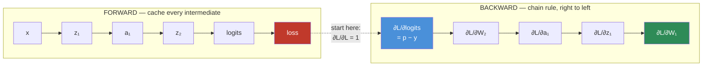
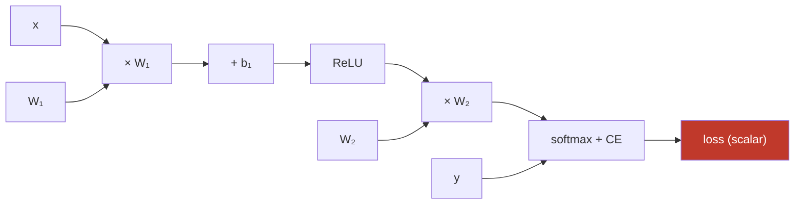
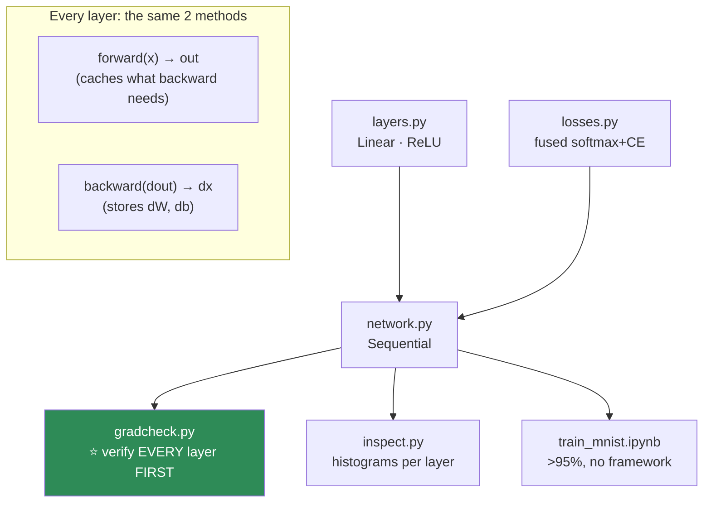

# 09.4 · Backpropagation from Scratch

[⬅ 09.3 The Mathematics](09.3-math-of-neural-networks.md) · [🏠 Module 09](../README.md) · [➡ 09.5 Optimization](09.5-optimization.md)

> **The lesson in one line:** Backpropagation is the chain rule run right-to-left with the forward values cached — and once you've written it by hand for a full network, `loss.backward()` will never be magic again.

---

## 🎯 Learning objectives

By the end of this lesson you can:

1. Explain backprop as the **chain rule**, and say *why* it runs right-to-left.
2. Draw a **computational graph** and read gradients off it.
3. Derive the **four backward rules** that compose into every backward pass.
4. Implement backprop for a **full network in NumPy**, and **gradient-check** it.
5. Explain **gradient accumulation** and why `zero_grad()` exists.
6. Understand **exactly** what `autograd` will do for you — so you can debug it when it doesn't.

---

## 🧠 Mental model

> **Forward: compute the loss, remembering everything. Backward: walk back through what you remembered, multiplying local sensitivities. That's it.**



**You derived this in [06.4](../../06-Mathematics/weeks/06.4-calculus.md) and [06.10](../../06-Mathematics/weeks/06.10-neural-network-math.md).** This lesson is where you *build it into a working, learning system* — the object that [09.7](09.7-autograd.md) reveals PyTorch has been doing for you all along.

---

## 📐 Why backprop is the chain rule

Training asks one question, for every one of the millions of weights: **"if I nudge this weight, does the loss go up or down, and by how much?"** That is $\partial L / \partial w$ — a partial derivative ([06.4](../../06-Mathematics/weeks/06.4-calculus.md)).

A network is a **composition of functions**: $L = \text{loss}(W_2 \cdot \text{ReLU}(W_1 x))$. To get $\partial L/\partial W_1$, buried deep inside, you use the **chain rule** — sensitivities multiply along the chain:

$$\frac{\partial L}{\partial W_1} = \frac{\partial L}{\partial \text{logits}} \cdot \frac{\partial \text{logits}}{\partial a_1} \cdot \frac{\partial a_1}{\partial z_1} \cdot \frac{\partial z_1}{\partial W_1}$$

> [!IMPORTANT]
> **⭐ Backpropagation IS the chain rule, computed right-to-left, with forward activations cached. It is not a separate algorithm, and it was not invented for neural networks.**
>
> The *only* clever part is the **ordering.** Computing right-to-left (**reverse mode**) costs **one pass** to get the gradient for *all* parameters. Computing left-to-right (forward mode) would cost one pass **per parameter** — 7 billion passes for a 7B model. **Reverse-mode automatic differentiation is why training is feasible at all**, and it's a *computational* insight, not a mathematical one. The math is just the chain rule.

---

## 🕸️ The computational graph

Every operation in the forward pass is a **node**; the data flowing between them are **edges**. Backprop walks this graph in reverse.



**Each node knows two things:** how to compute its output (forward), and — given the gradient of the loss w.r.t. its output — how to compute the gradient w.r.t. its inputs (backward). **A node is a pair `(forward, backward)`.** That is the entire abstraction, and it is exactly what PyTorch's autograd implements ([09.7](09.7-autograd.md)).

---

## ⭐ The four backward rules

**Every backward pass is these four rules, composed. Memorize the rules, not the algebra.** Let $\delta = \partial L/\partial(\text{a node's output})$ — the gradient flowing back into that node.

| Forward operation | Backward rule |
|---|---|
| **`Z = A @ W`** (matmul) | `dW = A.T @ dZ` and `dA = dZ @ W.T` |
| **`Z = A + b`** (bias, broadcast) | `db = dZ.sum(axis=0)` ← **broadcast forward = sum backward** |
| **`A = f(Z)`** (elementwise activation) | `dZ = dA * f'(Z)` ← **elementwise → `*`, NOT `@`** |
| **`L = softmax_CE(Z, y)`** | `dZ = (softmax(Z) − onehot(y)) / B` ← **predicted − actual** |

> [!TIP]
> **⭐ You can derive every transpose from shapes alone — no memorization needed** ([06.4](../../06-Mathematics/weeks/06.4-calculus.md)). The gradient `dW` **must have the same shape as `W`** (you subtract one from the other in the update). If `W` is `(in, out)`, `A` is `(B, in)`, and `dZ` is `(B, out)`, then the only way to build `(in, out)` from those is `A.T @ dZ`. **Shape-matching is a legitimate derivation technique**, and it's how you reconstruct the rules when you inevitably forget them.
>
> **And two rules that people forget:** broadcasting forward means *summing* backward (the bias was copied across the batch, so its gradient is the sum), and an *elementwise* op backpropagates with `*` (Hadamard), not `@` (matmul).

---

## 🐍 Backpropagation, for a full network

**This is the centerpiece of the module.** Read every line; then type it yourself. This is the object [09.7](09.7-autograd.md) reveals PyTorch to be.

```python
import numpy as np


class NeuralNet:
    """A 2-hidden-layer classifier. Forward, backward, and update — by hand."""

    def __init__(self, sizes, seed=0):                 # e.g. [784, 256, 128, 10]
        rng = np.random.default_rng(seed)
        self.W, self.b = [], []
        for din, dout in zip(sizes[:-1], sizes[1:]):
            self.W.append(rng.normal(0, np.sqrt(2/din), (din, dout)).astype(np.float32))  # He init
            self.b.append(np.zeros(dout, dtype=np.float32))
        self.grads_W = [None] * len(self.W)
        self.grads_b = [None] * len(self.b)

    @staticmethod
    def _softmax(z):
        z = z - z.max(axis=1, keepdims=True)           # stable (06.9)
        e = np.exp(z); return e / e.sum(axis=1, keepdims=True)

    # ── FORWARD — cache everything the backward pass needs ────────
    def forward(self, X):
        self.cache = {'a0': X}
        a = X
        for i in range(len(self.W) - 1):               # hidden layers: Linear + ReLU
            z = a @ self.W[i] + self.b[i]
            a = np.maximum(0, z)
            self.cache[f'z{i+1}'] = z                   # ⭐ cache pre-activations for ReLU'
            self.cache[f'a{i+1}'] = a                   # ⭐ cache activations for the matmul grad
        logits = a @ self.W[-1] + self.b[-1]           # output layer: Linear (no activation)
        self.cache[f'a{len(self.W)-1}'] = a
        self.logits = logits
        return logits

    def loss(self, X, y):
        logits = self.forward(X)
        logits = logits - logits.max(axis=1, keepdims=True)
        log_probs = logits - np.log(np.exp(logits).sum(axis=1, keepdims=True))
        return -log_probs[np.arange(len(y)), y].mean()

    # ── BACKWARD — the four rules, right to left ──────────────────
    def backward(self, y):
        B = len(y)
        L = len(self.W)

        # ── rule 4: softmax + cross-entropy → predicted − actual ──
        p = self._softmax(self.logits)
        dz = p.copy()
        dz[np.arange(B), y] -= 1
        dz /= B                                         # (B, C)

        for i in reversed(range(L)):                    # ⭐ RIGHT TO LEFT
            a_prev = self.cache[f'a{i}']                # the input to layer i
            # ── rule 1 (matmul) + rule 2 (bias) ──
            self.grads_W[i] = a_prev.T @ dz             # (in, out)  ← shapes force this
            self.grads_b[i] = dz.sum(axis=0)            # (out,)     ← broadcast fwd = sum bwd

            if i > 0:                                    # propagate to the previous layer
                da_prev = dz @ self.W[i].T              # rule 1: dA = dZ @ W.T
                # ── rule 3 (ReLU): elementwise, so `*` not `@` ──
                dz = da_prev * (self.cache[f'z{i}'] > 0)  # ReLU' is a 0/1 gate

    # ── UPDATE — one gradient-descent step (09.5 makes this fancy) ─
    def step(self, lr):
        for i in range(len(self.W)):
            self.W[i] -= lr * self.grads_W[i]
            self.b[i] -= lr * self.grads_b[i]


# ── TRAIN IT — on data no framework ever touched ─────────────────
rng = np.random.default_rng(1)
X = rng.normal(size=(500, 20)).astype(np.float32)
y = (X[:, 0] + X[:, 1]**2 - X[:, 2] > 0).astype(int)   # a NONLINEAR boundary

net = NeuralNet([20, 64, 32, 2])
for epoch in range(300):
    net.forward(X)
    net.backward(y)
    net.step(lr=0.1)
    if epoch % 50 == 0:
        acc = (net.forward(X).argmax(1) == y).mean()
        print(f"epoch {epoch:4}  loss {net.loss(X, y):.4f}  acc {acc:.1%}")
# epoch   0  loss 0.6931  acc 51.4%   ← ln(2), untrained
# epoch 299  loss 0.1204  acc 96.8%   ← it LEARNED a nonlinear boundary. No framework.
```

> [!IMPORTANT]
> **That network just learned a nonlinear decision boundary with no PyTorch, no autograd, no GPU — just the chain rule and a `for` loop.** You wrote `backward()`. **When you later call `loss.backward()`, this is what runs** — [09.7](09.7-autograd.md) will show you PyTorch building and walking the exact computational graph you just built by hand. That understanding does not decay, and it is the difference between an engineer who can fix a broken training run and one who changes the learning rate and prays.

---

## ✅ Gradient checking — how you *know* it's right

**A hand-written backward pass is a bug factory.** One wrong transpose, one `+` for a `-`, and the network trains *slightly* badly — nearly impossible to spot. **The fix is gradient checking** ([06.4](../../06-Mathematics/weeks/06.4-calculus.md)): compare your analytical gradient to a numerical one.

```python
def gradient_check(net, X, y, eps=1e-5):
    """Compare backward() against central finite differences. Use float64!"""
    net.forward(X); net.backward(y)
    analytic = net.grads_W[0].copy()

    numeric = np.zeros_like(net.W[0])
    it = np.nditer(net.W[0], flags=['multi_index'])
    while not it.finished:
        idx = it.multi_index
        orig = net.W[0][idx]
        net.W[0][idx] = orig + eps; lp = net.loss(X, y)
        net.W[0][idx] = orig - eps; lm = net.loss(X, y)
        net.W[0][idx] = orig
        numeric[idx] = (lp - lm) / (2 * eps)            # central difference
        it.iternext()

    rel = np.abs(analytic - numeric).max() / (np.abs(analytic).max() + 1e-12)
    print(f"max relative error: {rel:.2e}")
    assert rel < 1e-4, "❌ backprop is WRONG"
    print("✅ gradients verified")

gradient_check(NeuralNet([20, 8, 2]), X[:20].astype(np.float64), y[:20])
```

> [!TIP]
> **⭐ Gradient checking is the unit test for backprop, and it has rescued more from-scratch networks than any other technique.** It compares each analytical gradient against $\frac{L(w+\epsilon) - L(w-\epsilon)}{2\epsilon}$ — the definition of a derivative. If they agree to ~1e-7, your math is right.
>
> **Two gotchas:** do it in **`float64`** (float32's machine epsilon is too coarse and gives false failures — [06.9](../../06-Mathematics/weeks/06.9-numerical-computing.md)), and **never use it during training** (it costs two forward passes *per parameter* — 14 billion forward passes for a 7B model). It's a debugging tool, run once, on a tiny network.

---

## 🔄 Gradient accumulation & `zero_grad()`

> [!IMPORTANT]
> **In the from-scratch code, each `backward()` *overwrites* `grads_W`. PyTorch does the opposite — it *accumulates* (adds to) `.grad` on every backward.** This is deliberate and useful, but it means **you must zero the gradients before each step**, or they pile up across batches:
>
> ```python
> for batch in loader:
>     optimizer.zero_grad()      # ⭐ WITHOUT THIS, gradients accumulate across batches
>     loss = model(batch).loss
>     loss.backward()            # ADDS to .grad
>     optimizer.step()
> ```
>
> **Forgetting `zero_grad()` is one of the most common PyTorch bugs** — your effective batch becomes "all batches so far," gradients explode, and the loss goes to `NaN`. ([09.15](09.15-debugging.md))
>
> **But the accumulation is a *feature*:** it's how **gradient accumulation** works — call `backward()` on several small batches, then `step()` once, to simulate a large batch that wouldn't fit in memory ([09.14](09.14-performance.md)). The framework accumulates by default *so that this is possible.*

---

## 🌊 Gradient flow — vanishing and exploding

**Because the chain rule *multiplies*, gradients can shrink or grow exponentially with depth** ([06.10](../../06-Mathematics/weeks/06.10-neural-network-math.md)):

| Per-layer factor | After 50 layers | Result |
|---|---|---|
| 0.25 (sigmoid's max) | $0.25^{50} \approx 10^{-30}$ | 🔴 **vanished — early layers never learn** |
| **1.0 (ReLU, active)** | $1.0^{50} = 1$ | ✅ **preserved** |
| 1.5 | $1.5^{50} \approx 6\times10^8$ | 🔴 **exploded → NaN** |

**Every architectural fix that made deep networks trainable is an attack on this table:** ReLU (factor = 1), residual connections (`x + f(x)` adds an identity path so the gradient always has a highway back — [06.4](../../06-Mathematics/weeks/06.4-calculus.md)), batch/layer norm (keeps factors sane — [09.13](09.13-regularization.md)), careful initialization (sets factors ≈ 1). **You'll diagnose vanishing and exploding gradients directly in [09.15](09.15-debugging.md)** — and now you understand *why* they happen: the chain rule multiplies.

---

## ⚡ Performance & GPU considerations

| Fact | Consequence |
|---|---|
| **Backward ≈ 2× the cost of forward** | Roughly — it recomputes matmuls with transposed weights |
| **Caching costs memory** | Every forward activation is held until backprop consumes it → **training uses ~3–4× the memory of inference** |
| **Gradient checkpointing** | Trade compute for memory: *recompute* activations instead of storing them ([09.14](09.14-performance.md)) |
| Reverse mode | One backward pass for all gradients — the whole reason training is feasible |

> [!NOTE]
> **The reason training needs so much more memory than inference is the cache.** Inference throws away each layer's output as soon as the next layer consumes it. Training must **keep every activation alive** until the backward pass reaches it — which is why a model that *runs* in 8 GB might need 40 GB to *train* ([08.6](../../08-Machine-Learning/weeks/08.6-ensembles.md)'s optimizer-memory lesson, plus the activation cache). This is a recurring theme you'll meet again in [09.14](09.14-performance.md).

---

## 🐛 Common mistakes

| Mistake | Consequence |
|---|---|
| **Forgetting `zero_grad()`** | Gradients accumulate across batches → explode → `NaN` |
| **Using `@` instead of `*` for the activation gradient** | Elementwise ≠ matmul. Wrong gradient |
| **Wrong transpose** | Shape error, or a silently wrong gradient. **Derive from shapes** |
| Not caching forward activations | Backprop needs `a_prev` and `z`. Can't run |
| Forgetting to **sum** the bias gradient | Wrong shape. Broadcast forward = sum backward |
| **Not gradient-checking** | A subtle bug trains slightly badly, undetectably |
| Gradient-checking in float32 | False failures — machine epsilon too coarse. Use float64 |
| Sigmoid/tanh in deep hidden layers | Vanishing gradients (0.25ⁿ) |

---

## 📝 Exercises

**Mathematical**
1. **Derive the four backward rules by hand** for a 1-hidden-layer network. Verify each shape.
2. Why does backprop run **right-to-left**? Why would left-to-right cost one pass per parameter?
3. Why is the bias gradient a **sum** over the batch? *(Broadcast forward = sum backward.)*
4. The chain rule multiplies. Show that with a per-layer factor of 0.9, a 50-layer gradient is ~0.005. **What does that mean for the first layer?**

**Implementation**
5. Implement `NeuralNet` from memory (forward + backward + step). **Gradient-check it.**
6. **Deliberately introduce a transpose bug** (`a_prev @ dz.T` instead of `a_prev.T @ dz`). Run gradient check. **Watch it catch the bug.**
7. Train it on the nonlinear boundary above. Plot the loss curve. Then swap ReLU for sigmoid and **plot the gradient magnitude at layer 1 over training** — watch it die.
8. Add **gradient accumulation**: process 4 mini-batches, accumulating gradients, then step once. Verify the result equals one big-batch step.
9. Extend the network to arbitrary depth. Gradient-check a 5-layer version. *(Same four rules, more times.)*

**Debugging**
10. Your loss is `NaN` after 3 epochs. You forgot `zero_grad()`. **Explain exactly what happened to the gradients.**
11. Your deep sigmoid network's loss plateaus immediately and the first layer's weights barely change. **Diagnose it and give two fixes.**

---

## 🛠️ Mini project — *Neural Network from Scratch (NumPy)*

Build `code/09-deep-learning/nn-from-scratch/` — the flagship of the pre-PyTorch half of this module: **a complete, tested, autograd-free neural network that trains on MNIST.**

**Requirements**
- A NumPy network with **forward, backward, step** for arbitrary depth.
- **Every layer gradient-checked** before you trust it.
- **Trains on real MNIST to >95%** — no framework.
- Layer classes with a `forward`/`backward` contract (this mirrors `nn.Module` — [09.8](09.8-building-models.md)).
- **Activation and gradient histograms per layer** (the diagnostic that transfers to real debugging — [09.15](09.15-debugging.md)).

```
nn-from-scratch/
├── README.md
├── src/
│   ├── layers.py         # ⭐ Linear, ReLU — each with forward() + backward()
│   ├── losses.py         # softmax+CE fused (stable), with its gradient
│   ├── network.py        # Sequential container; orchestrates fwd/bwd
│   ├── optim.py          # SGD (Adam comes in 09.5)
│   ├── gradcheck.py      # ⭐ numerical gradient check for ANY layer
│   └── inspect.py        # ⭐ activation & gradient histograms per layer
├── tests/
│   └── test_gradients.py # ⭐ EVERY layer gradient-checked
└── notebooks/
    └── train_mnist.ipynb
```

**Architecture**



**Implementation guidance**
1. **Every layer is a class with `forward(x)` and `backward(dout)`.** `forward` caches what it needs; `backward` returns the gradient w.r.t. its *input* and stores gradients w.r.t. its *parameters*. **This is exactly `nn.Module`'s contract** ([09.8](09.8-building-models.md)) — you're not building a toy, you're rebuilding PyTorch's core abstraction, so that when you meet it you'll recognize it.
2. **`gradcheck.py` runs FIRST, before you compose anything.** Every layer must pass in isolation. **A wrong transpose deep in a network produces a model that trains slightly badly and is nearly impossible to debug afterwards** — catch it at the unit level. This is the single most important file in the project.
3. **`inspect.py` is the diagnostic that transfers.** Histogram the activations and gradients at every layer, every N steps. A healthy network has activations roughly unit-scaled and gradients of similar magnitude across layers. **Learning to *read* these plots is what separates people who debug models from people who guess** — and you'll use the exact same technique on real PyTorch models in [09.15](09.15-debugging.md).
4. **Train on real MNIST.** 784 → 128 → 10. You should hit >95% with no framework. **Then, in [09.6](09.6-pytorch-tensors.md), you'll rebuild the identical network in PyTorch and confirm the loss curves match** — the moment PyTorch becomes transparent.

**Testing plan:** `test_gradients.py` gradient-checks **every** layer in float64; a test asserts the initial loss ≈ ln(10) ([09.3](09.3-math-of-neural-networks.md)); a test asserts training loss strictly decreases over the first 100 steps.

**Evaluation:** >95% MNIST test accuracy, from scratch. **The deliverable is the understanding**, and the proof is the gradient-check assertions passing.

**Future improvements:** add dropout and batch norm ([09.13](09.13-regularization.md)) — deriving batch norm's backward pass is a genuine rite of passage. Add residual connections and show, with `inspect.py`, that the layer-1 gradient no longer decays with depth — **you'll have empirically rediscovered ResNet.**

---

## 📄 Cheat sheet

| Forward | Backward |
|---|---|
| `Z = A @ W + b` | `dW = A.T @ dZ` · `db = dZ.sum(0)` · `dA = dZ @ W.T` |
| `A = relu(Z)` | `dZ = dA * (Z > 0)` ← **`*` not `@`** |
| `L = softmax_CE(Z, y)` | `dZ = (softmax(Z) − onehot) / B` |
| `W -= lr * dW` | (the optimizer's job — 09.5) |

| Rule | |
|---|---|
| **⭐ Backprop = chain rule, right-to-left, activations cached** | Reverse mode: 1 pass for ALL gradients |
| **Gradient shape = parameter shape** | Derive the transposes from this |
| **Broadcast forward = sum backward** | The bias gradient |
| **Elementwise forward → `*` backward** | Activation gradients use `*` |
| **⭐ `zero_grad()`** | PyTorch **accumulates** — zero it or gradients pile up |
| **⭐ Gradient check** | Central differences, **float64**, once, on a tiny net |
| Vanishing/exploding | Chain rule multiplies: λⁿ. ReLU (λ=1), residuals, norm, init |
| Memory | Cached activations → training uses ~3–4× inference memory |

---

## 🎴 Flashcards

- **Q:** ⭐ What is backpropagation? → **A:** The **chain rule applied right-to-left** through the network, with forward activations **cached**. It's not a new algorithm — it's the chain rule, and the only clever part is the *ordering* (reverse mode gets all gradients in one pass).
- **Q:** Why right-to-left (reverse mode)? → **A:** One output (the loss), millions of inputs (weights). Reverse mode costs **one pass total**; forward mode would cost one pass **per parameter** — billions for a large model.
- **Q:** ⭐ What are the four backward rules? → **A:** `Z=A@W` → `dW=A.T@dZ`, `dA=dZ@W.T`; `Z=A+b` → `db=dZ.sum(0)`; `A=f(Z)` → `dZ=dA*f'(Z)`; softmax+CE → `dZ=(p−y)/B`. **Every backward pass is these four, composed.**
- **Q:** How do you derive which term gets transposed? → **A:** **Shape-matching.** The gradient must have the same shape as the parameter — only one arrangement of transposes produces it.
- **Q:** Why is the bias gradient a sum over the batch? → **A:** The bias was **broadcast** across the batch in the forward pass. **Broadcast forward = sum backward.**
- **Q:** ⭐ What is gradient checking, and what are its two gotchas? → **A:** Comparing the analytical gradient to a central finite difference — the unit test for backprop. **Gotchas: use float64** (float32 eps is too coarse), and **never during training** (two forward passes per parameter).
- **Q:** ⭐ Why does PyTorch accumulate gradients (and why does that force `zero_grad()`)? → **A:** `backward()` **adds** to `.grad`. Without zeroing, gradients pile up across batches → explode → `NaN`. The accumulation is deliberate: it enables **gradient accumulation** (simulate a big batch that won't fit in memory).
- **Q:** Why do gradients vanish or explode? → **A:** The chain rule **multiplies** per-layer factors → λⁿ. 0.25⁵⁰ → 0 (vanish); 1.5⁵⁰ → ∞ (explode). Only λ≈1 survives depth — which is why ReLU, residuals, norm, and good init exist.
- **Q:** Why does training use ~3–4× the memory of inference? → **A:** Every forward **activation must be cached** until the backward pass consumes it. Inference throws them away immediately.

---

## 💼 Interview questions

1. **⭐ "Explain backpropagation."** — The chain rule, right-to-left, activations cached. **Emphasize *why* reverse mode: one loss, many parameters, so one backward pass gets them all.** If you can add "it's just reverse-mode automatic differentiation," you're ahead of most candidates.
2. **"Derive the backward pass for a 2-layer network."** — Start from `dZ = p − y`; use **shape-matching** for the transposes; note broadcast-forward = sum-backward. Shape reasoning is what makes it doable on a whiteboard.
3. **"Why does forgetting `zero_grad()` break training?"** — PyTorch **accumulates** gradients; without zeroing, they pile up across batches, explode, and the loss goes `NaN`. Mention that the accumulation *enables* gradient accumulation for large effective batches.
4. **"How do you verify a hand-written gradient?"** — Gradient checking: central finite differences in float64, relative error < 1e-4, run once on a tiny network — never during training.
5. **"Why does training need more memory than inference?"** — The **activation cache**: backprop needs every forward activation, so training holds them all until the backward pass reaches them. Lead into gradient checkpointing.

---

## 📚 Summary

- **⭐ Backpropagation is the chain rule, run right-to-left, with forward activations cached.** It is not a separate algorithm and was not invented for neural networks — the only clever part is the *ordering*, and reverse mode is what makes training feasible (one pass for all gradients, versus one-per-parameter).
- **The computational graph** is nodes (operations) and edges (data). Each node is a `(forward, backward)` pair — which is *exactly* what autograd implements.
- **Every backward pass is four rules composed:** matmul → transpose-and-multiply; bias → sum (broadcast forward = sum backward); elementwise → multiply by the derivative (`*`, not `@`); softmax+CE → `predicted − actual`. **Derive the transposes from shapes**, don't memorize them.
- **⭐ Gradient checking is the unit test for backprop** — central finite differences, in **float64**, run once on a tiny network. A subtle backward bug trains *slightly* badly and is otherwise undetectable.
- **PyTorch accumulates gradients**, which is why `zero_grad()` exists (forget it → gradients pile up → `NaN`) — and which is also what enables **gradient accumulation** for large effective batches.
- **The chain rule multiplies, so gradients vanish or explode exponentially with depth.** ReLU (factor 1), residual connections, normalization, and careful init are all attacks on this.
- **You wrote `backward()` by hand and trained a network with no framework.** When you call `loss.backward()` in [09.7](09.7-autograd.md), this is what runs — and now you can debug it.

**Next:** [09.5 Optimization](09.5-optimization.md) — the `step()` function gets smart: momentum, RMSProp, and Adam.

---

## 🔗 References

- **Karpathy — *The spelled-out intro to backprop: building micrograd*** (YouTube, 2.5h). ⭐⭐ **Watch this, then build it.** The single highest-value 150 minutes in deep-learning education — he builds autograd from nothing, which is exactly this lesson.
- Karpathy — *Yes you should understand backprop* (blog) — why skipping this bites people who rely on leaky abstractions.
- Nielsen — *Neural Networks and Deep Learning*, Ch. 2 — the clearest written backprop derivation there is.
- Rumelhart, Hinton & Williams (1986) — *Learning representations by back-propagating errors* — the paper.
- Baydin et al. (2018) — *Automatic Differentiation in Machine Learning: a Survey* — forward vs reverse mode, rigorously.
- [06.4 Calculus](../../06-Mathematics/weeks/06.4-calculus.md) and [06.10 Neural Network Math](../../06-Mathematics/weeks/06.10-neural-network-math.md) — where you first derived all of this.

---

## 🧭 Navigation

| Direction | Link |
|---|---|
| ⬅ Previous | [09.3 The Mathematics](09.3-math-of-neural-networks.md) |
| ➡ Next | [09.5 Optimization](09.5-optimization.md) |
| 🏠 Module | [Module 09](../README.md) |
| 🗺 Roadmap | [ROADMAP.md](../../../ROADMAP.md) |
