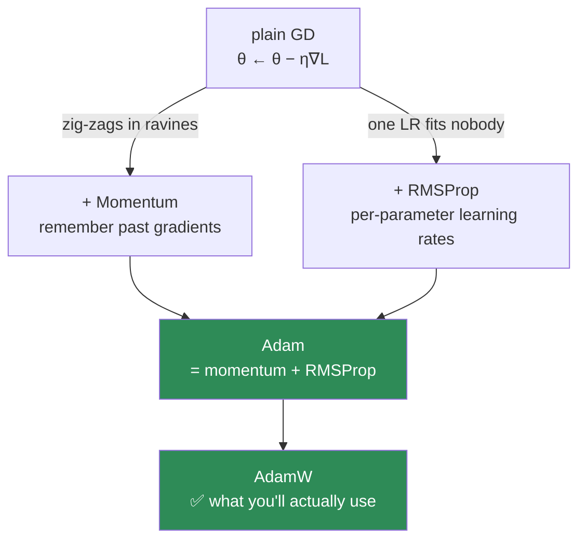
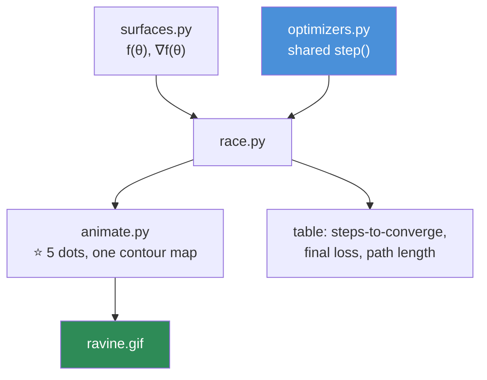

# 09.5 · Optimization

[⬅ 09.4 Backpropagation](09.4-backpropagation.md) · [🏠 Module 09](../README.md) · [➡ 09.6 PyTorch Tensors](09.6-pytorch-tensors.md)

> **The lesson in one line:** Backprop gives you the gradient; the optimizer decides what to do with it — and the whole story from SGD to Adam is three specific fixes to three specific ways plain gradient descent fails.

---

## 🎯 Learning objectives

By the end of this lesson you can:

1. Separate the two jobs: **backprop computes the gradient; the optimizer updates the weights.**
2. Explain **SGD, momentum, RMSProp, and Adam** as a chain of fixes, not a list to memorize.
3. Implement **Adam from scratch in NumPy** — the optimizer that trained GPT, in twelve lines.
4. Explain why **AdamW** is the default for everything modern, and what it fixes.
5. Explain **why Adam needs 3× the parameter memory**, and what that costs you.
6. Choose an optimizer and learning rate, and defend the choice.

---

## 🧠 Mental model

> **Every optimizer answers one question: given the gradient, how big a step, and in exactly which direction?**

**You met all of this in [06.7](../../06-Mathematics/weeks/06.7-optimization.md).** This lesson is where you *build* it — the `step()` function from [09.4](09.4-backpropagation.md) gets smart — and then hand it off to `torch.optim`, which does the identical thing faster.



| Failure of plain gradient descent | The fix | The optimizer |
|---|---|---|
| Zig-zags across ravines; stalls on plateaus | **Remember past gradients** | **Momentum** |
| One learning rate can't suit every parameter | **Per-parameter rates** | **RMSProp** |
| Want both | **Do both** | **Adam** |

**That table is the entire lesson. Adam is not a monolith to memorize — it's momentum + RMSProp, and both are one-line ideas.**

---

## 📐 The four optimizers

### 1 · SGD — the baseline

$$\theta \leftarrow \theta - \eta\,\nabla L$$

**Step opposite the gradient, scaled by the learning rate.** Simple, memory-light, and — with a good learning-rate schedule — still competitive, especially in computer vision. But it **zig-zags** in ravines (long, narrow valleys, which most loss surfaces are) and **stalls** on plateaus and saddle points ([06.7](../../06-Mathematics/weeks/06.7-optimization.md)).

> [!NOTE]
> **"SGD" (stochastic gradient descent) means computing the gradient on a *mini-batch* rather than the whole dataset** ([06.7](../../06-Mathematics/weeks/06.7-optimization.md)). The "stochastic" is the batch-to-batch noise — and that noise is a *feature*: it helps the optimizer escape sharp minima and find flatter, better-generalizing ones. In deep learning, you *always* use mini-batches, so "SGD" and "gradient descent" are used interchangeably.

### 2 · Momentum — give the ball mass

Accumulate a **velocity** — an exponentially-decayed running average of past gradients — and step along *that*:

$$v \leftarrow \beta v + \nabla L \qquad\qquad \theta \leftarrow \theta - \eta\, v$$

**Physical intuition: a rolling ball instead of a sliding point.** Where gradients keep pointing the same way (the ravine's long axis), they **accumulate** → acceleration. Where they keep flipping sign (the zig-zag axis), they **cancel** → damping. Three problems, one fix. (β = 0.9 typically, averaging the last ~10 gradients.)

### 3 · RMSProp — a learning rate per parameter

**One global learning rate can't suit every weight.** Some get huge gradients (need small steps); some get tiny gradients (rare features — need big steps). RMSProp divides each parameter's step by the root-mean-square of its recent gradients:

$$s \leftarrow \beta s + (1-\beta)(\nabla L)^2 \qquad\qquad \theta \leftarrow \theta - \frac{\eta}{\sqrt{s}+\epsilon}\nabla L$$

**Loud parameters get smaller steps; quiet ones get bigger ones.** Every parameter gets its own effective learning rate, for free. *(The `ε` prevents division by ~0 → the classic `NaN` guard — [06.9](../../06-Mathematics/weeks/06.9-numerical-computing.md).)*

### 4 · ⭐ Adam — momentum + RMSProp

**Two running averages instead of one.** That's genuinely all it is:

$$m \leftarrow \beta_1 m + (1-\beta_1)\nabla L \qquad \text{(momentum — the 1st moment)}$$
$$v \leftarrow \beta_2 v + (1-\beta_2)(\nabla L)^2 \qquad \text{(RMSProp — the 2nd moment)}$$
$$\hat{m} = \frac{m}{1-\beta_1^t}, \quad \hat{v} = \frac{v}{1-\beta_2^t} \qquad \text{(bias correction)}$$
$$\theta \leftarrow \theta - \frac{\eta}{\sqrt{\hat{v}}+\epsilon}\hat{m}$$

**Defaults that work almost everywhere:** $\beta_1 = 0.9$, $\beta_2 = 0.999$, $\epsilon = 10^{-8}$, $\eta = 10^{-3}$ (or $10^{-4}$–$10^{-5}$ for fine-tuning).

**Bias correction:** both $m$ and $v$ start at zero, so the early estimates are biased toward zero. Dividing by $(1-\beta^t)$ undoes it — it matters most in the first ~100 steps, when the model is most fragile.

---

## 🐍 Adam from scratch — twelve lines

**The optimizer that trained GPT. Read every line.**

```python
import numpy as np


class Adam:
    """Adam. Twelve lines. This is what torch.optim.Adam does."""

    def __init__(self, params, lr=1e-3, b1=0.9, b2=0.999, eps=1e-8):
        self.params = params                       # a list of weight arrays (by reference)
        self.lr, self.b1, self.b2, self.eps = lr, b1, b2, eps
        self.m = [np.zeros_like(p) for p in params]   # ⭐ 1st moment (momentum)
        self.v = [np.zeros_like(p) for p in params]   # ⭐ 2nd moment (RMSProp)
        self.t = 0

    def step(self, grads):
        self.t += 1
        for i, (p, g) in enumerate(zip(self.params, grads)):
            self.m[i] = self.b1 * self.m[i] + (1 - self.b1) * g          # momentum
            self.v[i] = self.b2 * self.v[i] + (1 - self.b2) * g**2       # per-param scale
            m_hat = self.m[i] / (1 - self.b1**self.t)                    # bias correction
            v_hat = self.v[i] / (1 - self.b2**self.t)
            p -= self.lr * m_hat / (np.sqrt(v_hat) + self.eps)          # ⭐ in-place update
```

```python
# Plug it into the NeuralNet from 09.4 — same backward(), smarter step()
net = NeuralNet([20, 64, 32, 2])
opt = Adam(net.W + net.b, lr=1e-3)                 # optimize all weights and biases

for epoch in range(300):
    net.forward(X)
    net.backward(y)
    opt.step(net.grads_W + net.grads_b)            # ⭐ Adam instead of plain SGD
```

> [!IMPORTANT]
> **⭐ You just wrote Adam. `torch.optim.Adam` is this, plus GPU kernels and a decade of engineering — but the algorithm is these twelve lines.** When you later call `optimizer.step()`, this is what runs. **Watching Adam glide down the ravine that plain SGD zig-zags across is the best possible advertisement for it** — do exercise 8 and see it.

---

## ⭐ AdamW — the one you'll actually use

Standard Adam implements L2 regularization ("weight decay") by adding $\lambda\theta$ to the gradient. But then that penalty gets divided by $\sqrt{\hat{v}}$ along with everything else — so **parameters with large gradients get *less* regularization**, which is backwards.

**AdamW decouples the decay** — it shrinks the weights *directly*, outside the adaptive scaling:

$$\theta \leftarrow \theta - \eta\left(\frac{\hat{m}}{\sqrt{\hat{v}}+\epsilon} + \lambda\theta\right)$$

> [!IMPORTANT]
> **⭐ Use AdamW, not Adam.** Every serious modern model — GPT, LLaMA, Mistral, BERT, ViT — trains with AdamW. The fix is one line, it measurably improves generalization, and it became the field-wide default within two years of the paper. **In PyTorch: `torch.optim.AdamW(model.parameters(), lr=..., weight_decay=0.01)`.** There is almost no reason to reach for plain `Adam` in 2026.

---

## ⚖️ The comparison

| Optimizer | Memory | Converges | Generalizes | Use when |
|---|---|---|---|---|
| **SGD** | 1× params | Slow | ✅ Often **best** | You'll tune a schedule; vision |
| **SGD + Momentum** | 2× | Good | ✅ Excellent | The classic vision default |
| RMSProp | 2× | Good | OK | RNNs (historical) |
| **Adam** | **3×** | ✅ **Fast, robust** | Good | Safe default for anything new |
| **⭐ AdamW** | 3× | ✅ Fast, robust | ✅ **Better** | **✅ Transformers, LLMs, most things** |

> [!WARNING]
> **⭐ Adam costs 3× the parameter memory** — the weights plus **two** full-size buffers ($m$ and $v$). For a 7B model in fp32: 28 GB of weights + **56 GB of optimizer state.** This is why full fine-tuning a 7B model needs ~80 GB of VRAM while *inference* needs only 14 GB — **the optimizer state, not the model, is what doesn't fit** ([06.7](../../06-Mathematics/weeks/06.7-optimization.md), [08.6](../../08-Machine-Learning/weeks/08.6-ensembles.md)). It's the single biggest reason LoRA exists: with LoRA you only keep optimizer state for the tiny adapter matrices.

### When SGD still beats Adam

**Adam converges faster, but SGD+momentum often *generalizes* better — especially in computer vision.** The leading explanation: Adam's per-parameter scaling drives it toward *sharp* minima, while SGD's uniform noise favours *flat* ones, which generalize better ([06.7](../../06-Mathematics/weeks/06.7-optimization.md)). Many state-of-the-art vision results still use plain SGD+momentum with a good schedule. **For Transformers and LLMs, AdamW dominates unambiguously** (the gradient scales across a Transformer's parameters vary so wildly that adaptive rates are essentially mandatory).

---

## 🎚️ The learning rate — the #1 hyperparameter

> [!IMPORTANT]
> **⭐ If you tune exactly one thing, tune the learning rate.** It matters more than the architecture, the batch size, or the optimizer choice. A well-tuned SGD beats a badly-tuned Adam.

| LR | Symptom |
|---|---|
| **Too small** | Loss crawls; you waste days of compute |
| **Just right** | Steady decrease, then plateau |
| **Too large** | Loss oscillates, spikes, or goes to **`NaN`** |

**And nobody uses a constant learning rate.** Start big (explore), end small (settle) — via a **schedule** ([09.10](09.10-training-loop.md)):

| Schedule | Used by |
|---|---|
| **Cosine annealing** | ✅ The modern default |
| **Linear warmup + cosine decay** | ✅ Every LLM |
| Step decay | Classic vision |
| ReduceLROnPlateau | A safe reactive fallback |

> [!TIP]
> **Why do Transformers need warmup?** In the first steps, Adam's second-moment estimate $v$ is built from almost no data and is unreliable — so full-size adaptive steps can blow up an untrained model. **Warmup** (linearly ramping the LR from 0 over ~2000 steps) gives $v$ time to stabilize. It's a statistics fix for an optimizer's cold-start problem, and it is **not optional** for Transformers ([06.7](../../06-Mathematics/weeks/06.7-optimization.md)).

---

## ⚡ Performance & GPU considerations

| Fact | Consequence |
|---|---|
| **Adam = 3× parameter memory** | Optimizer state, not the model, is what OOMs you during training |
| **The optimizer update is elementwise** | Cheap compared to the backward pass, but memory-bandwidth-bound |
| **8-bit Adam** | Quantize the optimizer state → big memory saving ([09.14](09.14-performance.md)) |
| Fused optimizers | `torch.optim.AdamW(..., fused=True)` — one CUDA kernel, faster on GPU |
| `foreach` optimizers | Vectorize the update across all parameters — PyTorch's default now |

---

## 🐛 Common mistakes

| Mistake | Consequence |
|---|---|
| **Learning rate too high** | Loss → `NaN` or oscillates. Lower it 10× |
| **Learning rate too low** | Loss crawls; wasted compute |
| **Using `Adam` instead of `AdamW`** | Weight decay silently scaled wrong; worse generalization |
| **Forgetting `zero_grad()`** | Gradients accumulate → explode ([09.4](09.4-backpropagation.md)) |
| **No warmup with Adam on a Transformer** | Early instability, divergence |
| No LR schedule | Loss plateaus early and stays there |
| Ignoring optimizer memory | OOM when fine-tuning. Adam = 3× params |
| `eps=0` | Division by ~0 → `NaN` |
| Assuming Adam always wins | SGD+momentum often generalizes better in vision |

---

## 📝 Exercises

**Mathematical**
1. Write the update rules for SGD, momentum, RMSProp, and Adam. **For each, say which failure of plain SGD it fixes.**
2. Why is Adam = momentum + RMSProp? Name what each half contributes.
3. What is bias correction in Adam, and when does it matter most?
4. Why does AdamW decouple the weight decay? What was wrong with Adam's L2?

**Implementation**
5. Implement `Adam` from memory. Plug it into your [09.4](09.4-backpropagation.md) `NeuralNet`. **Compare its loss curve to plain SGD.**
6. Implement **SGD, Momentum, RMSProp, and Adam** with a shared interface (~10 lines each).
7. Add **AdamW** (decoupled decay). Verify it differs from Adam + L2.
8. ⭐ **Run all four on the ravine** $f(x,y) = x^2 + 10y^2$ from [06.7](../../06-Mathematics/weeks/06.7-optimization.md), starting at (5, 5). **Plot all four trajectories on one contour map.** Watch SGD zig-zag and Adam glide.
9. Implement a **cosine learning-rate schedule** with warmup. Plot the LR curve.

**Debugging**
10. Your loss goes to `NaN` at step 300. List five candidate causes, ranked. *(LR is #1.)*
11. Your loss decreases then flatlines at a high value. Diagnose — is it the optimizer or something else?
12. You fine-tune a 7B model and hit OOM. The weights fit in inference. **Explain, with arithmetic, what didn't fit.**

---

## 🛠️ Mini project — *The Optimizer Zoo*

Build `code/09-deep-learning/optimizer-zoo/` — implement every optimizer, race them, and *see* why Adam won.

**Requirements**
- Implement SGD, Momentum, RMSProp, Adam, AdamW with a shared `step()` interface.
- **Race them on test surfaces** (bowl, ravine, saddle) and on the [09.4](09.4-backpropagation.md) MNIST network.
- **Animate the trajectories** on a contour map.
- Implement **warmup + cosine** scheduling.

```
optimizer-zoo/
├── README.md
├── src/
│   ├── optimizers.py     # ⭐ SGD, Momentum, RMSProp, Adam, AdamW — shared interface
│   ├── surfaces.py       # bowl, ravine, saddle, Rosenbrock
│   ├── schedules.py      # constant, cosine, warmup+cosine
│   ├── race.py           # all optimizers × all surfaces
│   └── animate.py        # ⭐ side-by-side contour animation
├── tests/
│   └── test_convergence.py   # each must converge on the convex bowl
└── outputs/
    └── ravine.gif        # ⭐ the deliverable
```

**Architecture**



**Implementation guidance**
1. **One interface for all optimizers** — a `step(params, grads)` that mutates params in place. Each holds its own state (`v`, `m`, `s`, `t`). **This is exactly how `torch.optim` is structured** — you're not simplifying, you're reimplementing, so `torch.optim.AdamW` will be familiar when you meet it.
2. **The ravine is the essential surface.** `x² + 10y²` is where momentum and Adam visibly earn their keep — SGD zig-zags across the steep axis while creeping along the shallow one; Adam's per-parameter rates fix exactly that. **Report *path length* per optimizer** — it quantifies the zig-zagging that momentum eliminates.
3. **`animate.py` is the payoff.** Five dots descending the same contour map. **When you watch it, optimization stops being a list of formulas and becomes a physical intuition you own permanently.** This GIF is the portfolio artifact.
4. **Then run them on the real MNIST network** from [09.4](09.4-backpropagation.md). Toy surfaces are clean; real loss landscapes are messier, and comparing wall-clock-to-95%-accuracy across optimizers is where the lesson meets reality.

**Testing plan:** `test_convergence.py` asserts each optimizer reaches the minimum of the convex bowl; a test asserts AdamW's update differs from Adam+L2 on the same gradients.

**Evaluation:** the trade-off table (steps, final loss, path length, wall-clock) plus the ravine animation. **The deliverable is the intuition.**

**Future improvements:** add **8-bit Adam** (quantized state) and measure the memory saving; add **gradient clipping** ([09.14](09.14-performance.md)) and show it rescuing a run that would otherwise `NaN`.

---

## 📄 Cheat sheet

| Optimizer | Update | Fixes |
|---|---|---|
| **SGD** | $\theta \mathrel{-}= \eta g$ | (baseline) |
| **Momentum** | $v = \beta v + g$; $\theta \mathrel{-}= \eta v$ | ravine zig-zag |
| **RMSProp** | $s = \beta s + (1{-}\beta)g^2$ | one-LR-fits-nobody |
| **Adam** | momentum + RMSProp + bias correction | both |
| **⭐ AdamW** | Adam, decay applied outside the scaling | ✅ **the default** |

| | |
|---|---|
| **Adam defaults** | lr=1e-3, β₁=0.9, β₂=0.999, ε=1e-8 |
| **⭐ Adam memory** | **3× params** (weights + m + v) → why fine-tuning OOMs |
| **⭐ LR is the #1 hyperparameter** | Tune it first, tune it most |
| **Schedule** | warmup + cosine decay |
| **Warmup exists because** | Adam's `v` estimate is unreliable at step 0 |
| **Gradient noise** | A *feature* — finds flat, generalizing minima |
| **SGD sometimes beats Adam** | Vision — flatter minima generalize better |

---

## 🎴 Flashcards

- **Q:** What are backprop's and the optimizer's two separate jobs? → **A:** **Backprop computes the gradient; the optimizer decides what to do with it** (how big a step, in which direction). Keep them separate in your code and your head.
- **Q:** What does momentum fix? → **A:** **Ravine zig-zag and plateau stalls.** It accumulates a velocity, so consistent gradients build up and oscillating ones cancel.
- **Q:** What does RMSProp fix? → **A:** **One global LR can't suit every parameter.** It divides each step by an EMA of that parameter's recent squared gradients — a per-parameter learning rate.
- **Q:** ⭐ What is Adam? → **A:** **Momentum (1st moment) + RMSProp (2nd moment) + bias correction.** Three ideas, twelve lines. It's what trained GPT.
- **Q:** ⭐ Why AdamW over Adam? → **A:** Adam's L2 penalty gets divided by √v along with the gradient, so heavily-updated params get less decay — backwards. **AdamW decouples the decay.** Standard for every modern model.
- **Q:** ⭐ How much memory does Adam add? → **A:** **Two extra copies of every parameter (m and v) → 3× total.** It's why full fine-tuning needs far more VRAM than inference, and a core motivation for LoRA.
- **Q:** ⭐ What's the #1 hyperparameter? → **A:** **The learning rate**, by a wide margin. A well-tuned SGD beats a badly-tuned Adam.
- **Q:** Why do Transformers need LR warmup? → **A:** Adam's second-moment estimate is unreliable in the first steps, so full-size adaptive steps can destabilize an untrained model. Warmup gives it time to stabilize.
- **Q:** When does SGD beat Adam? → **A:** Often in **computer vision** — SGD+momentum's uniform noise favours **flat minima**, which generalize better than the sharp minima Adam tends toward.

---

## 💼 Interview questions

1. **⭐ "Explain Adam."** — Momentum + RMSProp + bias correction. **Then say *why each part exists*** (ravines; per-parameter scales; zero-initialized estimates). Then volunteer AdamW and the 3× memory cost. That's a complete answer.
2. **"Your loss is NaN. Debug it."** — LR too high (#1); exploding gradients; forgot `zero_grad()`; `log(0)`/`exp(overflow)` in the loss; `eps=0`. Fixes: lower LR, warmup, clip gradients.
3. **"Why does full fine-tuning need more memory than inference?"** — Weights + gradients + **Adam's two moment buffers** ≈ 4× the weights, plus the activation cache. Lead into LoRA/QLoRA.
4. **"When would you use SGD over Adam?"** — Vision, where SGD+momentum often generalizes better (flatter minima), and when you have the budget to tune a schedule.
5. **"How do you choose a learning rate?"** — LR range test (sweep exponentially, plot loss vs LR, pick the steepest-descent region), then warmup + cosine decay.

---

## 📚 Summary

- **Backprop computes the gradient; the optimizer decides what to do with it.** Two separate jobs.
- **The story from SGD to Adam is three fixes:** **momentum** (accumulate a velocity → kill ravine zig-zag), **RMSProp** (per-parameter learning rates), and **Adam = both + bias correction.** Not a list to memorize — a chain of fixes.
- **⭐ You can write Adam in twelve lines**, and it's what trained GPT. `torch.optim.Adam` is this plus GPU kernels.
- **⭐ Use AdamW, not Adam.** It decouples weight decay (Adam scaled it wrongly), and it's the default for every modern Transformer and LLM.
- **⭐ Adam costs 3× the parameter memory** (weights + two moment buffers) — which is why the optimizer state, not the model, is what OOMs you during fine-tuning, and a core reason LoRA exists.
- **⭐ The learning rate is the #1 hyperparameter** — tune it first and most. Use a **schedule** (warmup + cosine); warmup exists because Adam's variance estimate is unreliable at step 0.
- **SGD+momentum still wins in vision** (flatter, better-generalizing minima); **AdamW dominates Transformers.**

**Next:** [09.6 PyTorch Tensors](09.6-pytorch-tensors.md) — **we finally import torch.** Everything you've built by hand is about to get a GPU and an autograd engine.

---

## 🔗 References

- Kingma & Ba (2014) — *Adam: A Method for Stochastic Optimization*. **You can read this now — you implemented its central algorithm.**
- Loshchilov & Hutter (2019) — *Decoupled Weight Decay Regularization* (**AdamW**). A short paper, a one-line fix, a field-wide default.
- Ruder (2016) — *An overview of gradient descent optimization algorithms* (blog). The best single survey.
- Keskar et al. (2017) — *On Large-Batch Training* — the sharp-vs-flat minima argument (why SGD generalizes).
- distill.pub — *Why Momentum Really Works* — a beautiful interactive explanation.
- [06.7 Optimization](../../06-Mathematics/weeks/06.7-optimization.md) — where you first derived all of this.

---

## 🧭 Navigation

| Direction | Link |
|---|---|
| ⬅ Previous | [09.4 Backpropagation](09.4-backpropagation.md) |
| ➡ Next | [09.6 PyTorch Tensors](09.6-pytorch-tensors.md) |
| 🏠 Module | [Module 09](../README.md) |
| 🗺 Roadmap | [ROADMAP.md](../../../ROADMAP.md) |
