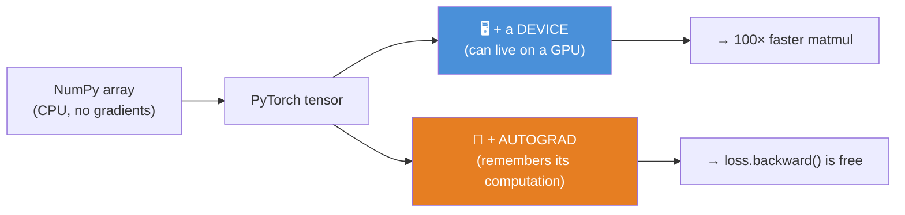
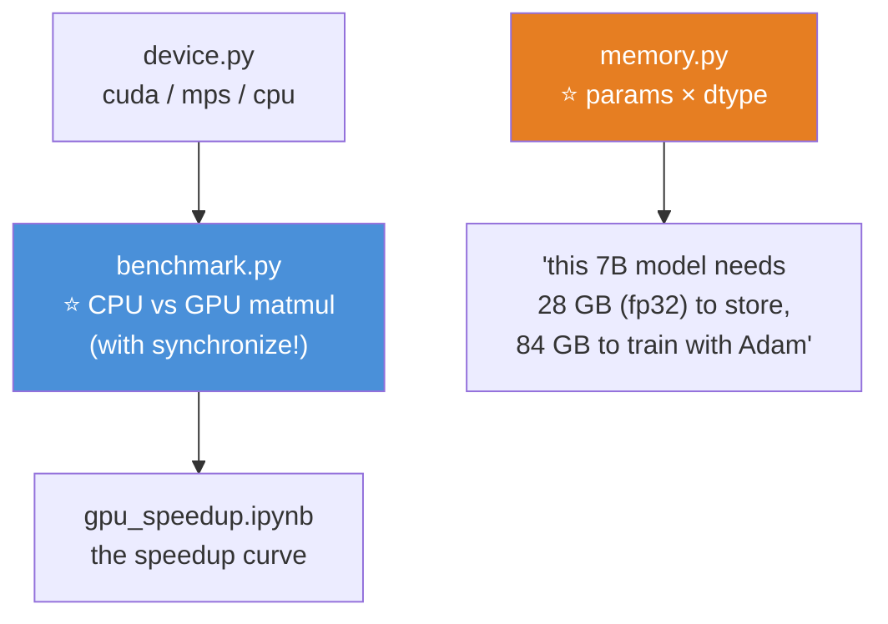

# 09.6 · PyTorch Fundamentals — Tensors

[⬅ 09.5 Optimization](09.5-optimization.md) · [🏠 Module 09](../README.md) · [➡ 09.7 Autograd](09.7-autograd.md)

> **The lesson in one line:** A PyTorch tensor is a NumPy array that (a) lives on a GPU and (b) remembers how it was computed so it can be differentiated — and those two additions are the entire reason the framework exists.

---

## 🎯 Learning objectives

By the end of this lesson you can:

1. Explain what a tensor **adds** to a NumPy array — and why those two things matter.
2. Move data and models between **CPU and GPU** correctly, and diagnose the `device` errors.
3. Explain what **CUDA** is and why it made deep learning possible.
4. Reuse everything you know about NumPy **broadcasting, indexing, and shapes** — because it's the same.
5. Reason about **memory layout, `contiguous()`, and views vs copies** on the GPU.
6. Convert between NumPy and PyTorch without the shared-memory gotcha.

---

## 🧠 Mental model

> **Tensor = NumPy array + a device (CPU/GPU) + an autograd tape.** Everything else you already know.



> [!IMPORTANT]
> **You already know 90% of PyTorch, because you know NumPy.** The array operations, broadcasting, slicing, reductions, dtypes, shape rules ([07.2](../../07-Data-Analysis/weeks/07.2-numpy.md), [06.9](../../06-Mathematics/weeks/06.9-numerical-computing.md)) — all identical. **The only genuinely new ideas are the two additions above: devices (this lesson) and autograd ([09.7](09.7-autograd.md)).** Don't relearn arrays; learn what's new.

---

## 📐 Tensors are NumPy, with two superpowers

```python
import torch
import numpy as np

# ── Creation — the NumPy vocabulary, near-identical ──────────────
t = torch.tensor([[1., 2.], [3., 4.]])        # from data
z = torch.zeros(3, 4)                          # np.zeros((3,4))
o = torch.ones(2, 3)
r = torch.randn(3, 4)                          # np.random.randn — standard normal
a = torch.arange(0, 10, 2)                     # np.arange
e = torch.empty(2, 2)                          # ⚠️ uninitialized (like np.empty)

# ── Operations — the SAME as NumPy ───────────────────────────────
r @ r.T                                         # matmul (06.2)
r + 1                                           # broadcasting (06.9)
r[r > 0]                                        # boolean indexing (07.2)
r.sum(dim=0)                                    # reduction — note: 'dim', not 'axis'
r.mean(); r.std(); r.max()
r.reshape(4, 3); r.T; r.view(2, 6)             # reshape/transpose

print(r.shape, r.dtype, r.device)              # torch.Size([3,4]) torch.float32 cpu
```

> [!TIP]
> **⭐ The vocabulary map: NumPy → PyTorch.** Almost everything transfers; a few names change.
>
> | NumPy | PyTorch |
> |---|---|
> | `np.array(x)` | `torch.tensor(x)` |
> | `.reshape()` | `.reshape()` or `.view()` |
> | `axis=` | **`dim=`** ← the one that trips everyone |
> | `np.concatenate` | `torch.cat` |
> | `arr.astype(np.float32)` | `t.float()` or `t.to(torch.float32)` |
> | `arr @ arr` | `t @ t` (identical) |
> | `np.matmul` | `torch.matmul` |
>
> **The single most common friction is `dim` vs `axis`.** PyTorch uses `dim`. Otherwise, your NumPy muscle memory works.

---

## 🖥️ Devices — CPU vs GPU

**This is the first genuinely new idea, and it's where beginners spend their first day of errors.**

```python
# ⭐ The canonical device-selection line — put it at the top of every script
device = torch.device('cuda' if torch.cuda.is_available() else 'cpu')
#       ('mps' on Apple Silicon: 'mps' if torch.backends.mps.is_available() else ...)

x = torch.randn(1000, 1000)
x = x.to(device)                               # ⭐ MOVE it to the GPU
y = torch.randn(1000, 1000, device=device)     # ⭐ or CREATE it there directly

z = x @ y                                       # this matmul runs on the GPU — ~100× faster
result = z.cpu().numpy()                        # ⭐ bring it back to CPU to use with NumPy/plot
```

> [!CAUTION]
> **⭐ The #1 PyTorch error: `RuntimeError: Expected all tensors to be on the same device, but found at least two devices, cuda:0 and cpu!`**
>
> **You cannot do arithmetic between a CPU tensor and a GPU tensor.** They must be on the same device. This happens constantly — you move your model to the GPU but forget to move a batch of data, or you create a new tensor without a `device=` and it defaults to CPU.
>
> **The fix is a discipline: move the *model* once (at setup), and move *every batch* inside the loop:**
> ```python
> model = model.to(device)                     # once
> for X, y in loader:
>     X, y = X.to(device), y.to(device)         # ⭐ every batch — the line everyone forgets
>     ...
> ```
> Get this reflex and 90% of your "device" errors vanish.

### What is CUDA?

**CUDA is NVIDIA's platform for running general-purpose code on the GPU.** A GPU has thousands of small cores optimized for doing the same operation on many numbers at once — which is *exactly* what a matmul is ([09.2](09.2-neural-network-fundamentals.md)). PyTorch's GPU operations are CUDA kernels under the hood.

> [!IMPORTANT]
> **⭐ CUDA is why deep learning exists in its current form.** A neural network is >90% matmul ([09.2](09.2-neural-network-fundamentals.md)), a GPU does matmul ~100× faster than a CPU, and CUDA is the bridge that lets PyTorch use it. **AlexNet (2012) ran on two consumer GPUs** ([09.1](09.1-why-deep-learning.md)) — without CUDA, the modern era doesn't happen. This is also why NVIDIA became one of the most valuable companies on Earth: they own the platform the entire industry trains on.

> [!TIP]
> **You don't need to own a GPU to learn this.** **Google Colab's free tier gives you a real NVIDIA GPU** (`Runtime → Change runtime type → GPU`). Every project in this module runs there ([00.5](../../00-Orientation/weeks/00.5-development-environment.md)). Apple Silicon Macs have `mps` (the Metal backend), which is slower than CUDA but works for learning.

---

## 🔢 Dtypes — the memory & precision decision

```python
torch.float32     # the default. "single precision"
torch.float64     # "double" — rarely needed in DL, 2× memory
torch.float16     # "half" — GPU memory saver, ⚠️ tiny range (overflows)
torch.bfloat16    # ⭐ the modern DL default for training — float32's range, less precision
torch.int64       # "long" — the default for indices and labels
torch.bool        # masks
```

> [!IMPORTANT]
> **⭐ Two dtype facts you'll meet constantly:**
> 1. **Labels for `CrossEntropyLoss` must be `int64` (`long`).** `y.long()` — a frequent early error.
> 2. **Training uses `bfloat16` or mixed precision, not `float16`** — because `float16` has a tiny range (max ~65,504) and overflows, while `bfloat16` keeps float32's full range and just drops precision ([06.9](../../06-Mathematics/weeks/06.9-numerical-computing.md)). **This is why every LLM trains in bf16**, and it's the [09.14](09.14-performance.md) mixed-precision story in miniature.

---

## 🔀 NumPy ↔ PyTorch — the shared-memory gotcha

```python
# NumPy → PyTorch
np_arr = np.array([1., 2., 3.])
t = torch.from_numpy(np_arr)        # ⚠️ SHARES memory — no copy
t2 = torch.tensor(np_arr)           # ✅ COPIES

# PyTorch → NumPy
back = t.numpy()                    # ⚠️ SHARES memory (CPU tensors only)
```

> [!CAUTION]
> **⭐ `torch.from_numpy()` and `.numpy()` SHARE memory — they don't copy.** Modify the NumPy array and the tensor changes too, silently:
> ```python
> np_arr[0] = 999
> print(t[0])       # tensor(999.)  😱 the tensor changed!
> ```
> This is the exact same **view-vs-copy** trap as NumPy ([07.2](../../07-Data-Analysis/weeks/07.2-numpy.md)), now crossing the library boundary. **Use `torch.tensor(np_arr)` when you want an independent copy** — the zero-copy version is a performance optimization that becomes a bug when you don't expect it. (And `.numpy()` only works on **CPU** tensors — you must `.cpu()` a GPU tensor first.)

---

## 🧠 Memory layout & `contiguous()`

Tensors, like NumPy arrays, are a **header (shape, strides) over a flat memory buffer** ([07.2](../../07-Data-Analysis/weeks/07.2-numpy.md)). `.T` and `.view()` return **views** — they change the strides without moving data.

```python
x = torch.randn(3, 4)
xt = x.T                            # a VIEW — no data moved (strides swapped)
print(x.is_contiguous(), xt.is_contiguous())   # True False

xt.view(12)                         # ❌ RuntimeError: view size incompatible with stride
xt.reshape(12)                      # ✅ works (copies if needed)
xt.contiguous().view(12)            # ✅ force a contiguous copy, then view
```

> [!TIP]
> **⭐ `view()` vs `reshape()`:** `view()` **requires the tensor to be contiguous** and never copies (fast, but errors on a transposed tensor); `reshape()` copies if it has to (safe, occasionally slower). **When you hit `RuntimeError: view size is not compatible with input tensor's size and stride`, the fix is either `.reshape()` or `.contiguous().view()`.** It happens most often after a `.T` or a `.permute()`. This is the [06.9](../../06-Mathematics/weeks/06.9-numerical-computing.md) strides lesson, now with a PyTorch error message attached.

---

## ⭐ Rebuild the from-scratch network in PyTorch — the transparency moment

**Take the exact MNIST network from [09.4](09.4-backpropagation.md) and write its forward pass with tensors. Same math, GPU-ready.**

```python
import torch

device = torch.device('cuda' if torch.cuda.is_available() else 'cpu')

# ── Parameters — tensors instead of NumPy arrays, on the GPU ─────
def init(din, dout):
    return (torch.randn(din, dout, device=device) * (2/din)**0.5).requires_grad_()  # He init + track grads

W1 = init(784, 256); b1 = torch.zeros(256, device=device, requires_grad=True)
W2 = init(256, 10);  b2 = torch.zeros(10,  device=device, requires_grad=True)

def forward(X):                     # X: (B, 784) on the GPU
    a1 = torch.relu(X @ W1 + b1)    # ⭐ SAME as the NumPy version — just tensors
    return a1 @ W2 + b2             # logits (B, 10)

X = torch.randn(32, 784, device=device)
logits = forward(X)
print(logits.shape, logits.device)  # torch.Size([32, 10]) cuda:0
```

> [!IMPORTANT]
> **⭐ Compare this `forward` to the NumPy one from [09.2](09.2-neural-network-fundamentals.md). It is line-for-line the same — `@` for matmul, `torch.relu` for ReLU.** The *only* differences: tensors live on the GPU, and `requires_grad=True` means PyTorch is now recording the computation so that **`loss.backward()` will replace the entire `backward()` method you wrote by hand.** That's the whole promise of the next lesson: **you never write backprop again.** But because you *did* write it, you'll know exactly what autograd is doing.

---

## ⚡ Performance & GPU considerations

| Fact | Consequence |
|---|---|
| **GPU ops are asynchronous** | The Python line returns before the GPU finishes; **timing needs `torch.cuda.synchronize()`** |
| **`.item()` / `.cpu()` force a sync** | They stall the pipeline. Fine per-batch; costly in a tight loop ([09.3](09.3-math-of-neural-networks.md)) |
| **CPU↔GPU transfer is slow** | Minimize it. Move data once; keep it on the GPU |
| **Small ops waste the GPU** | The GPU is idle waiting for tiny kernels — batch operations |
| `pin_memory=True` in DataLoader | Faster CPU→GPU transfer ([09.9](09.9-data-loading.md)) |
| **float64 on GPU is very slow** | Consumer GPUs cripple fp64. Use fp32/bf16 |

> [!WARNING]
> **⭐ GPU operations are *asynchronous*, which makes naive timing lie to you.** When you write `z = x @ y`, the Python line returns *immediately* — it just queues the work; the GPU computes in the background. So `start = time(); z = x @ y; print(time() - start)` reports near-zero, because you timed the *queuing*, not the *computing*. **To time GPU code, call `torch.cuda.synchronize()` before reading the clock.** This asynchrony is a *feature* (Python and GPU work in parallel) that becomes a trap the first time you profile.

---

## 🐛 Common mistakes

| Mistake | Consequence |
|---|---|
| **Tensors on different devices** | `Expected all tensors on the same device`. Move every batch |
| **Forgetting to move the batch** | Model on GPU, data on CPU → the device error |
| **Labels not `.long()`** | `CrossEntropyLoss` needs int64 labels |
| **`.numpy()` on a GPU tensor** | Error — `.cpu()` it first |
| **`torch.from_numpy` when you meant a copy** | Shared memory → silent mutation |
| **`view()` on a transposed tensor** | Stride error → use `.reshape()` or `.contiguous()` |
| **Timing GPU code without `synchronize()`** | You timed the queue, not the compute |
| **`float16` for training** | Overflows. Use `bfloat16` |
| **Excessive CPU↔GPU transfer** | Slow. Keep data on the GPU |

---

## 📝 Exercises

**Tensor manipulation**
1. Create tensors with `zeros`, `ones`, `randn`, `arange`. Print each one's `.shape`, `.dtype`, and `.device`.
2. Translate five NumPy operations into PyTorch: a matmul, a broadcast add, a boolean mask, a `sum(axis=0)`, and a reshape. **Which one changes its keyword name?**
3. Demonstrate the `torch.from_numpy` shared-memory gotcha: create an array, make a tensor, mutate the array, show the tensor changed. Then fix it with `torch.tensor`.
4. Take a `(3, 4)` tensor, transpose it, and try `.view(12)`. Explain the error and fix it two ways.

**Devices & GPU**
5. Write the canonical `device = ...` line. Move a tensor to the device, do a matmul, bring the result back to CPU and convert to NumPy.
6. Deliberately create the "tensors on different devices" error (one tensor on CPU, one on GPU, add them). Read the error. Fix it.
7. On a GPU (Colab), time a `(4096, 4096)` matmul **without** `synchronize()` and **with** it. **Explain the difference.**
8. Compare the memory of the same tensor in float32, float16, and bfloat16. Then find a value that overflows float16 but not bfloat16.

**Implementation**
9. Rewrite the [09.4](09.4-backpropagation.md) `forward` pass in PyTorch tensors. Confirm the output shape and that it runs on the GPU (if available).
10. Write a function `describe(t)` that prints shape, dtype, device, `is_contiguous`, and `nbytes`. Use it on a tensor and its transpose.

---

## 🛠️ Mini project — *The Tensor Toolkit*

Build `code/09-deep-learning/tensor-toolkit/` — a set of utilities and benchmarks that make the CPU/GPU/memory story concrete.

**Requirements**
- A **device-agnostic** helper module (works on cuda, mps, or cpu).
- **Benchmark** matmul on CPU vs GPU across sizes, timed correctly (`synchronize`).
- **Demonstrate** the shared-memory gotcha, the device error, and the view/reshape distinction — each with a test.
- A **memory calculator**: given a model's layer sizes, estimate parameter and activation memory in each dtype.

```
tensor-toolkit/
├── README.md
├── src/
│   ├── device.py         # ⭐ get_device(); move_to(device, *tensors)
│   ├── benchmark.py      # ⭐ CPU vs GPU matmul, timed with synchronize
│   ├── memory.py         # ⭐ param & activation memory per dtype
│   └── gotchas.py        # shared memory, device mismatch, view/reshape
├── tests/
│   ├── test_device.py
│   └── test_shared_memory.py   # ⭐ assert from_numpy shares, tensor copies
└── notebooks/
    └── gpu_speedup.ipynb
```

**Architecture**



**Implementation guidance**
1. **`benchmark.py` must call `torch.cuda.synchronize()` before reading the clock**, or your speedup numbers are fiction (you'd be timing the async queue). **Plot the speedup vs matrix size** — you'll see the GPU lose at tiny sizes (kernel-launch overhead dominates) and win enormously at large ones. **That curve is the whole argument for batching** ([09.9](09.9-data-loading.md)): small ops waste the GPU.
2. **`memory.py` is the practical payoff.** Given `[784, 256, 128, 10]`, compute parameter count, then multiply by bytes-per-dtype and by 3 (for Adam's state — [09.5](09.5-optimization.md)). **Print the human-readable verdict:** *"Storing this model: X MB. Training it with Adam in fp32: 3X MB."* Scale it up to 7B and you'll produce the exact "why fine-tuning OOMs" number from [09.5](09.5-optimization.md).
3. **`test_shared_memory.py` asserts the gotcha**: `torch.from_numpy` shares (mutating one changes the other), `torch.tensor` copies. Encoding the gotcha as a passing test is how you make sure you actually understand it.

**Testing plan:** device selection returns a valid device; the shared-memory behaviours are asserted; the memory calculator matches a hand-computed parameter count.

**Evaluation:** the GPU-speedup curve and the memory-verdict output. **The deliverable is intuition for where the GPU helps and where memory goes.**

**Future improvements:** add a mixed-precision benchmark (fp32 vs bf16 matmul speed and memory) — a preview of [09.14](09.14-performance.md).

---

## 📄 Cheat sheet

| | |
|---|---|
| **Tensor** | NumPy array **+ device + autograd** |
| **Create** | `torch.zeros/ones/randn/arange/tensor` |
| **Ops** | Same as NumPy — but **`dim`**, not `axis` |
| **⭐ Device** | `device = 'cuda' if torch.cuda.is_available() else 'cpu'` |
| **Move** | `.to(device)` · create with `device=` · `.cpu()` to bring back |
| **⭐ The #1 error** | "tensors on different devices" → **move every batch inside the loop** |
| **NumPy → torch** | `torch.tensor(a)` (copy) · `torch.from_numpy(a)` (⚠️ **shares**) |
| **torch → NumPy** | `t.cpu().numpy()` (⚠️ shares; CPU only) |
| **Labels** | `.long()` for `CrossEntropyLoss` |
| **⭐ Training dtype** | **bfloat16** (float32's range) — not float16 (overflows) |
| **view vs reshape** | `view` needs contiguous, never copies; `reshape` copies if needed |
| **⭐ Timing GPU** | Call `torch.cuda.synchronize()` — GPU ops are **async** |

---

## 🎴 Flashcards

- **Q:** ⭐ What does a PyTorch tensor add to a NumPy array? → **A:** Two things: **a device** (it can live on a GPU → ~100× faster matmul) and **an autograd tape** (it remembers its computation → `loss.backward()` is free). Everything else is NumPy.
- **Q:** ⭐ What's the #1 PyTorch runtime error, and how do you prevent it? → **A:** *"Expected all tensors on the same device."* Prevent it by moving the **model once** at setup and **every batch inside the loop** (`X.to(device)`).
- **Q:** What is CUDA and why does it matter? → **A:** NVIDIA's platform for running code on the GPU. It's the bridge that lets PyTorch use a GPU's thousands of cores for matmul — **without it, modern deep learning doesn't exist.**
- **Q:** ⭐ Why does `torch.from_numpy` cause silent bugs? → **A:** It **shares memory** with the array (no copy) — mutating the array mutates the tensor. Use `torch.tensor(a)` for an independent copy. (Same view-vs-copy trap as NumPy.)
- **Q:** Why must training use bfloat16, not float16? → **A:** float16 has a **tiny range** (max ~65,504) and overflows; **bfloat16 keeps float32's full range** and drops precision instead. This is why every LLM trains in bf16.
- **Q:** ⭐ Why does timing GPU code need `torch.cuda.synchronize()`? → **A:** GPU ops are **asynchronous** — the Python line returns before the GPU finishes computing. Without a sync, you time the *queuing*, not the *work*, and see near-zero.
- **Q:** `view()` vs `reshape()`? → **A:** `view()` requires a contiguous tensor and never copies (fast, errors after a transpose); `reshape()` copies if needed (safe). Fix a view error with `.reshape()` or `.contiguous().view()`.
- **Q:** What dtype must labels be for `CrossEntropyLoss`? → **A:** **`int64` (`.long()`)** — a common early error.

---

## 💼 Interview questions

1. **"What's the difference between a NumPy array and a PyTorch tensor?"** — **A device and an autograd tape.** GPU + gradients. Everything else is the same array you already know.
2. **⭐ "You get 'expected all tensors on the same device.' What happened?"** — A CPU tensor met a GPU tensor. Usually you moved the model but forgot a batch. **Move every batch inside the loop.**
3. **"Why is deep learning done on GPUs?"** — Networks are >90% matmul; GPUs have thousands of cores doing the same op in parallel — ~100× faster. **CUDA is the platform that makes it accessible.**
4. **"Why do you train in bfloat16 rather than float16?"** — Range. bf16 keeps float32's 8-bit exponent (range ~1e38); fp16 maxes at ~65k and overflows.
5. **"Your GPU matmul benchmark shows near-zero time. Why, and how do you fix it?"** — GPU ops are **async** — you timed the queue. Call `torch.cuda.synchronize()` before reading the clock.

---

## 📚 Summary

- **A PyTorch tensor is a NumPy array plus two things: a device (CPU/GPU) and an autograd tape.** You already know 90% of PyTorch because you know NumPy — the array ops, broadcasting, indexing, and shapes are identical (just `dim` instead of `axis`).
- **⭐ Devices are the first new idea.** Tensors must be on the same device to interact; the #1 error is mixing CPU and GPU. **Move the model once at setup and every batch inside the loop.**
- **CUDA is why deep learning exists in its current form** — the bridge that lets PyTorch run matmuls on a GPU's thousands of cores. **You don't need to own a GPU; Colab's free tier is enough.**
- **⭐ `torch.from_numpy` and `.numpy()` share memory** — the NumPy view-vs-copy trap, crossing the library boundary. Use `torch.tensor()` for a copy.
- **Training uses bfloat16, not float16** (range beats precision), and **labels for `CrossEntropyLoss` must be `int64`.**
- **`view` needs contiguous and never copies; `reshape` copies if needed** — the strides lesson with a PyTorch error attached.
- **⭐ GPU operations are asynchronous** — time them with `torch.cuda.synchronize()`, or you're timing the queue.
- **The from-scratch forward pass rewrites line-for-line in tensors** — and `requires_grad=True` is what will let [09.7](09.7-autograd.md) replace your hand-written `backward()` entirely.

**Next:** [09.7 Autograd](09.7-autograd.md) — the moment `loss.backward()` replaces every line of the backprop you wrote by hand.

---

## 🔗 References

- PyTorch — [official 60-minute Blitz](https://pytorch.org/tutorials/beginner/deep_learning_60min_blitz.html) and the [Tensor tutorial](https://pytorch.org/tutorials/beginner/basics/tensorqs_tutorial.html). Start here.
- PyTorch docs — [`torch.Tensor`](https://pytorch.org/docs/stable/tensors.html) and [CUDA semantics](https://pytorch.org/docs/stable/notes/cuda.html) (**read the async section**).
- Stevens, Antiga & Viehmann — *Deep Learning with PyTorch* (free from Manning), Ch. 3 (Tensors). The best book treatment.
- [07.2 NumPy](../../07-Data-Analysis/weeks/07.2-numpy.md) — strides, views vs copies, broadcasting — all of which transfer directly.
- [06.9 Numerical Computing](../../06-Mathematics/weeks/06.9-numerical-computing.md) — float16 vs bfloat16, and why range matters.

---

## 🧭 Navigation

| Direction | Link |
|---|---|
| ⬅ Previous | [09.5 Optimization](09.5-optimization.md) |
| ➡ Next | [09.7 Autograd](09.7-autograd.md) |
| 🏠 Module | [Module 09](../README.md) |
| 🗺 Roadmap | [ROADMAP.md](../../../ROADMAP.md) |
