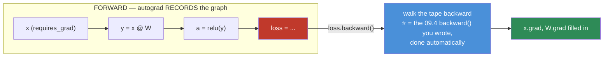
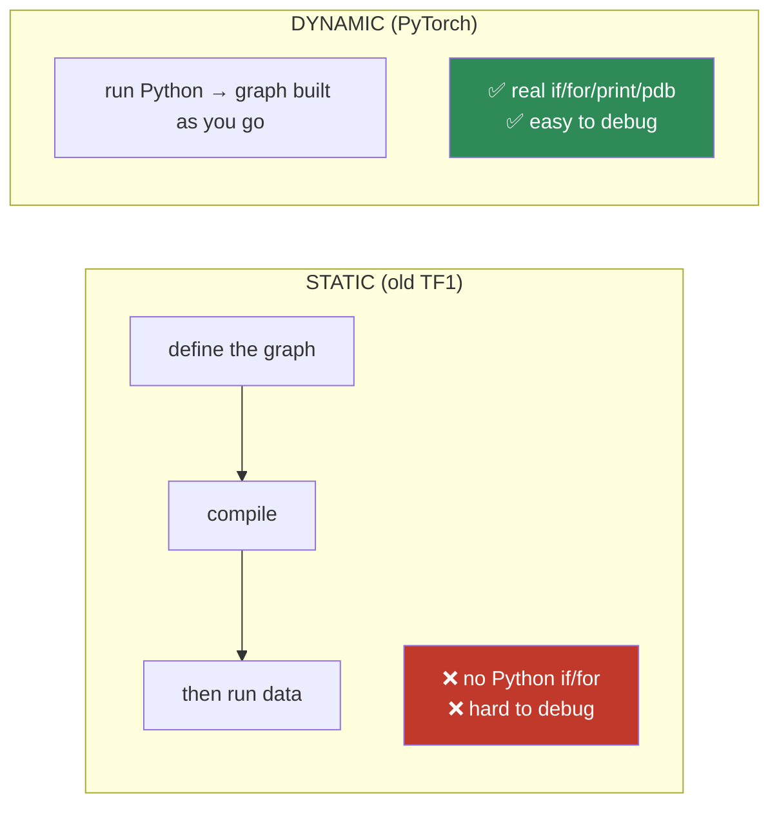
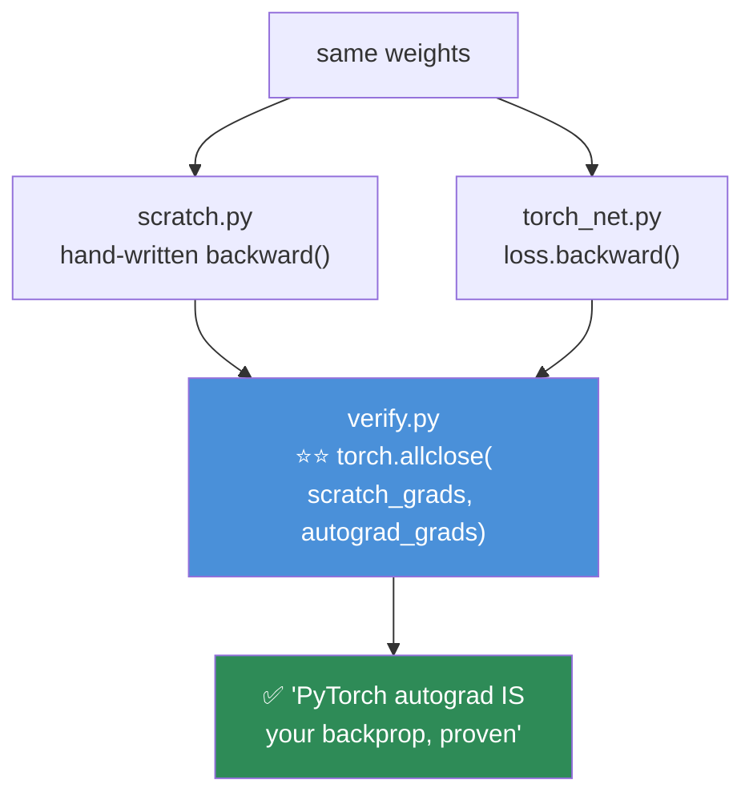

# 09.7 · Autograd

[⬅ 09.6 PyTorch Tensors](09.6-pytorch-tensors.md) · [🏠 Module 09](../README.md) · [➡ 09.8 Building Models](09.8-building-models.md)

> **The lesson in one line:** Autograd records every operation you do onto a graph, and `loss.backward()` walks that graph backward applying the chain rule — it is the `backward()` method you wrote in 09.4, built once and for all.

---

## 🎯 Learning objectives

By the end of this lesson you can:

1. Explain what **autograd** does, and connect it directly to the [09.4](09.4-backpropagation.md) backward pass you wrote.
2. Use **`requires_grad`, `.grad`, and `backward()`** correctly.
3. Explain **why PyTorch's graph is *dynamic*** — and why that matters.
4. Use **`no_grad()`** and **`.detach()`**, and know when each is required.
5. Explain **why gradients accumulate** and where `zero_grad()` fits.
6. Debug the common autograd errors (`backward` called twice, `requires_grad` on the wrong thing, breaking the graph).

---

## 🧠 Mental model

> **Autograd is a tape recorder. Every operation on a tensor with `requires_grad=True` is recorded. `backward()` rewinds the tape, applying the chain rule at each step.**



> [!IMPORTANT]
> **⭐ Autograd is not new to you. It is the exact thing you built in [09.4](09.4-backpropagation.md).** There, each layer was a `(forward, backward)` pair, and you walked them right-to-left by hand. **Autograd does the same — it just builds the `(forward, backward)` graph *automatically* as you write the forward pass, and walks it for you.** Every operation (`+`, `@`, `relu`) knows how to backpropagate through itself. **You never write `backward()` again — but because you did once, you know exactly what's happening.**

---

## 📐 The core API — three things

```python
import torch

# ── 1 · requires_grad: "track operations on this tensor" ─────────
x = torch.tensor([2.0], requires_grad=True)      # a leaf we want gradients for
w = torch.tensor([3.0], requires_grad=True)
b = torch.tensor([1.0], requires_grad=True)

# ── forward: autograd silently records each op onto the graph ────
y = w * x + b                                     # y = 3*2 + 1 = 7
loss = y ** 2                                      # loss = 49

# ── 2 · backward: walk the graph, fill in .grad ─────────────────
loss.backward()

# ── 3 · .grad: the gradient of loss w.r.t. each leaf ────────────
print(x.grad)     # tensor([84.])   ∂loss/∂x = 2y · w = 2·7·3 = 42... wait
print(w.grad)     # tensor([28.])   ∂loss/∂w = 2y · x = 2·7·2 = 28 ✓
print(b.grad)     # tensor([14.])   ∂loss/∂b = 2y · 1 = 14 ✓
```

*(∂loss/∂x = 2y·w = 2·7·3 = 42 — verify the chain rule by hand; it's exactly [06.4](../../06-Mathematics/weeks/06.4-calculus.md).)*

| Piece | Means |
|---|---|
| **`requires_grad=True`** | "Record operations on this tensor; I want its gradient." Set automatically on model parameters |
| **`loss.backward()`** | Walk the graph from `loss` back to every leaf, filling `.grad` via the chain rule |
| **`tensor.grad`** | The accumulated $\partial\text{loss}/\partial\text{tensor}$ — same shape as the tensor |

> [!TIP]
> **`backward()` can only be called on a scalar** (a single number), which is why you call it on the **loss** — a scalar — and not on the logits (a tensor). *"Gradient of what, with respect to what?"* only has a clean answer when the "what" is one number. (For non-scalar outputs you'd pass a `gradient=` argument, but you almost never need to.)

---

## ⚡ The dynamic graph — PyTorch's defining choice

> [!IMPORTANT]
> **⭐ PyTorch builds the computational graph *dynamically* — it's constructed fresh on every forward pass, as your Python code runs ("define-by-run").** This is the single biggest design decision that made PyTorch win, and it's worth understanding *why.*
>
> **The old way (TensorFlow 1.x): static graphs.** You first *defined* the whole graph as a data structure, then *ran* data through it. Powerful, but you couldn't use a normal Python `if` or `for` or a debugger — the graph was a separate, opaque thing.
>
> **PyTorch's way: the graph IS your Python code.** A different control flow on different inputs builds a different graph:
> ```python
> def forward(x):
>     for _ in range(x.shape[0]):        # ⭐ a real Python loop
>         x = layer(x)
>         if x.mean() > 0:               # ⭐ a real Python if
>             x = other_layer(x)
>     return x
> ```
> **You can use `print()`, `pdb`, and any Python construct inside your model, because there is no separate graph to compile — it's just code that happens to be recorded.** This is why PyTorch is so much easier to debug and prototype in, and it's why researchers adopted it en masse. *(The trade-off — a static graph can be optimized ahead of time — is recovered later by `torch.compile` and TorchScript, [09.17](09.17-production.md).)*



---

## 🛑 `no_grad()` and `.detach()` — turning the recorder off

**Sometimes you don't want autograd recording** — at inference, when you have no intention of calling `backward()`, recording the graph just wastes memory and time.

```python
# ── no_grad(): a context that disables graph-building ────────────
model.eval()
with torch.no_grad():                    # ⭐ MANDATORY for inference/validation
    predictions = model(X_test)          # no graph built → less memory, faster
    val_loss = loss_fn(predictions, y)

# ── detach(): pull ONE tensor off the graph ─────────────────────
logits = model(X)
probs = logits.detach()                  # a copy that won't track gradients
metric = probs.cpu().numpy()             # now safe to convert
```

| Tool | Scope | Use for |
|---|---|---|
| **`with torch.no_grad():`** | A whole block | ⭐ **Inference & validation** — no gradients needed, saves memory |
| **`tensor.detach()`** | One tensor | Extract a value *out* of the graph (for logging, metrics, a stop-gradient) |
| **`model.eval()`** | Model mode | Switches dropout/batchnorm to eval mode — **different from `no_grad`!** |

> [!CAUTION]
> **⭐ `model.eval()` and `torch.no_grad()` are DIFFERENT and you usually need BOTH for inference.**
> - **`no_grad()`** stops autograd from building the graph (saves memory/compute). It does **not** change the model's behaviour.
> - **`model.eval()`** switches **dropout off** and **batch norm to use running statistics** ([09.13](09.13-regularization.md)). It does **not** stop gradient tracking.
>
> **Forgetting `model.eval()` at validation is a classic, silent bug:** dropout stays *on*, so your validation predictions are randomly corrupted and your metrics look worse than they are — or batch norm uses the wrong statistics and your numbers are subtly off. **Always pair them for inference: `model.eval()` + `with torch.no_grad():`. And remember to switch back with `model.train()` before the next training epoch.**

> [!WARNING]
> **⭐ The #1 way people leak memory in PyTorch: accumulating tensors that are still attached to the graph.**
> ```python
> losses = []
> for batch in loader:
>     loss = compute_loss(batch)
>     losses.append(loss)              # 😱 keeps the ENTIRE graph alive, every batch
> ```
> Each `loss` still references its whole computational graph. Appending them all keeps **every graph from every batch** in memory — and your GPU OOMs after a few hundred steps. **The fix: `losses.append(loss.item())`** (pull out the Python float) **or `loss.detach()`.** This is one of the most common "why is my memory growing?" bugs, and now you know exactly why it happens.

---

## 🔄 Gradient accumulation & `zero_grad()` — revisited

You met this in [09.4](09.4-backpropagation.md): **PyTorch *accumulates* gradients** — each `backward()` **adds** to `.grad` rather than overwriting it. So the training loop must zero them:

```python
for X, y in loader:
    optimizer.zero_grad()        # ⭐ or gradients from the last batch pile onto this one
    logits = model(X)
    loss = loss_fn(logits, y)
    loss.backward()              # ADDS to every parameter's .grad
    optimizer.step()             # update, using .grad
```

> [!TIP]
> **`optimizer.zero_grad(set_to_none=True)` is the modern, slightly-faster form** (it sets grads to `None` instead of zeroing the buffer — saves a memory write, and it's the default in newer PyTorch). And the accumulation is deliberate: it's what enables **gradient accumulation** for large effective batches ([09.4](09.4-backpropagation.md), [09.14](09.14-performance.md)).

---

## ⭐ The full picture: your 09.4 network, now with autograd

**Take the from-scratch network. Delete the entire `backward()` method. Let autograd do it.**

```python
import torch

device = torch.device('cuda' if torch.cuda.is_available() else 'cpu')

# ── parameters that track gradients ─────────────────────────────
W1 = (torch.randn(20, 64, device=device) * (2/20)**0.5).requires_grad_()
b1 = torch.zeros(64, device=device, requires_grad=True)
W2 = (torch.randn(64, 2, device=device) * (2/64)**0.5).requires_grad_()
b2 = torch.zeros(2, device=device, requires_grad=True)
params = [W1, b1, W2, b2]

opt = torch.optim.Adam(params, lr=1e-2)     # ⭐ your 09.5 Adam, now built-in
loss_fn = torch.nn.CrossEntropyLoss()

for epoch in range(300):
    logits = torch.relu(X @ W1 + b1) @ W2 + b2   # ⭐ FORWARD — autograd records it
    loss = loss_fn(logits, y)                     # scalar

    opt.zero_grad()          # 1 · clear old gradients
    loss.backward()          # 2 · ⭐ autograd fills W1.grad, b1.grad, ... — NO hand-written backward!
    opt.step()               # 3 · Adam updates every parameter
```

> [!IMPORTANT]
> **⭐ Compare this to the [09.4](09.4-backpropagation.md) training loop. The forward pass is identical. The `backward()` method — thirty lines of chain rule you wrote by hand — is gone, replaced by one line: `loss.backward()`.** And the optimizer — your twelve-line Adam — is one import. **This is the entire value of PyTorch, and you can now see *exactly* what each line replaced**, because you built both by hand. The three-line ritual — `zero_grad()`, `backward()`, `step()` — is the heartbeat of every training loop you will ever write ([09.10](09.10-training-loop.md)).

---

## ⚡ Performance & GPU considerations

| Fact | Consequence |
|---|---|
| **The graph costs memory** | Every intermediate is kept for backward → training memory ≫ inference ([09.4](09.4-backpropagation.md)) |
| **`no_grad()` at inference** | ⭐ No graph built → **big memory savings**, faster |
| **Retaining graph references** | The #1 memory leak — `.item()`/`.detach()` for logging |
| **`backward()` frees the graph** | By default the graph is discarded after one backward. `retain_graph=True` to keep it (rarely needed; usually a bug) |
| `torch.compile(model)` | Traces the dynamic graph and JIT-compiles it → speedups ([09.17](09.17-production.md)) |

---

## 🐛 Common mistakes

| Mistake | Consequence |
|---|---|
| **Forgetting `no_grad()` at inference** | Wasted memory; possible OOM on the validation set |
| **Forgetting `model.eval()` at inference** | **Dropout stays on, batch norm uses wrong stats** → corrupted metrics |
| **Forgetting `zero_grad()`** | Gradients accumulate → explode → `NaN` |
| **Appending un-detached tensors** | ⭐ Memory leak — the whole graph stays alive |
| **Calling `backward()` twice** | `RuntimeError: graph freed` — the graph is discarded after one backward |
| **`requires_grad` on your data** | Wastes memory tracking gradients you don't need (only params need it) |
| **`.numpy()` on a graph tensor** | Error — `.detach().cpu().numpy()` |
| **Breaking the graph accidentally** | An in-place op or a `.item()` mid-forward stops gradients flowing |

---

## 📝 Exercises

**Autograd basics**
1. Create `x` with `requires_grad=True`. Compute `y = x**2 + 3*x`. Call `backward()`. **Verify `x.grad` matches the analytical derivative `2x + 3` by hand.**
2. Build a 3-node graph (`y = w*x + b`, `loss = y**2`). Call `backward()`. Verify all three gradients against the chain rule.
3. Show that calling `backward()` **twice** raises an error. Explain why (the graph is freed). Then fix it with `retain_graph=True` and explain when you'd actually want that.
4. Demonstrate gradient accumulation: `backward()` twice without `zero_grad()`, and show `.grad` is the **sum** of the two.

**no_grad / detach / eval**
5. Wrap an inference call in `torch.no_grad()`. Show (via a memory measurement or `.grad_fn`) that no graph was built.
6. ⭐ **Reproduce the memory leak**: append 500 un-detached losses to a list and watch GPU memory grow. Fix it with `.item()`.
7. Build a tiny model with dropout. Run inference **with and without `model.eval()`**. Show the predictions differ (dropout is random). Explain why forgetting `eval()` corrupts validation metrics.
8. Use `.detach()` to compute a metric from logits without tracking gradients. Explain the difference from `no_grad()`.

**Implementation**
9. Rewrite the [09.4](09.4-backpropagation.md) network to use autograd + `torch.optim.Adam`. **Delete your hand-written `backward()`.** Confirm it still trains.
10. ⭐ **Verify autograd against your hand-written gradients.** Compute the gradient of a small network both ways (your [09.4](09.4-backpropagation.md) `backward()` and `loss.backward()`) and assert they match with `torch.allclose`. *(This is the transparency moment, proven.)*

---

## 🛠️ Mini project — *Micrograd-to-PyTorch*

Build `code/09-deep-learning/autograd-bridge/` — prove, in code, that PyTorch's autograd is the backprop you wrote by hand.

**Requirements**
- Keep your [09.4](09.4-backpropagation.md) from-scratch `NeuralNet` (with hand-written `backward()`).
- Build the **identical** network in PyTorch.
- **Verify the gradients match** with `torch.allclose` — the proof.
- **Demonstrate the memory leak** and its fix, as a test.
- **Demonstrate the eval-mode bug** (dropout on at inference), as a test.

```
autograd-bridge/
├── README.md
├── src/
│   ├── scratch.py        # your 09.4 NeuralNet (hand-written backward)
│   ├── torch_net.py      # ⭐ the identical net in PyTorch
│   ├── verify.py         # ⭐ assert scratch grads == autograd grads
│   ├── leak.py           # the un-detached-tensor memory leak + fix
│   └── eval_bug.py       # ⭐ dropout-on-at-inference bug
├── tests/
│   ├── test_grads_match.py   # ⭐⭐ the transparency proof
│   └── test_no_leak.py       # memory doesn't grow with .item()
└── notebooks/
```

**Architecture**



**Implementation guidance**
1. **`verify.py` is the entire point of this project, and `test_grads_match.py` is the deliverable.** Initialize both networks with the *identical* weights, feed the *same* batch, compute gradients both ways — your hand-written `backward()` and PyTorch's `loss.backward()` — and **assert they match with `torch.allclose(atol=1e-5)`.** **When that assertion passes, autograd is no longer magic — you have *proven*, in your own code, that it computes exactly the chain rule you wrote in [09.4](09.4-backpropagation.md).** That proof is worth more than any explanation.
2. **`leak.py` makes the memory leak visceral.** Log `torch.cuda.memory_allocated()` while appending un-detached losses to a list — watch it climb. Then `.item()` and watch it stay flat. **Encoding this as a test (`test_no_leak.py`: memory after 500 steps ≈ memory after 10) is how you internalize the fix.**
3. **`eval_bug.py`** — a model with dropout, run at inference with and without `model.eval()`. Show the outputs differ (and are worse) without it. **This is the bug that silently degrades everyone's validation metrics once.**

**Testing plan:** `test_grads_match.py` (the proof — scratch grads == autograd grads); `test_no_leak.py` (memory flat with `.item()`).

**Evaluation:** the passing gradient-match test. **The deliverable is certainty**: you now *know*, not believe, what autograd does.

**Future improvements:** build a tiny autograd engine yourself (Karpathy's micrograd — a `Value` class that overloads `+`, `*`, etc. and implements `backward()`), and verify *it* against PyTorch too. Doing so makes the graph abstraction completely concrete.

---

## 📄 Cheat sheet

| | |
|---|---|
| **Autograd** | Records ops on `requires_grad` tensors; `backward()` walks the graph = **your 09.4 backward(), automated** |
| **`requires_grad=True`** | "Track this tensor's gradient." Automatic on model parameters |
| **`loss.backward()`** | Fill `.grad` on every leaf (loss must be a **scalar**) |
| **`tensor.grad`** | The accumulated ∂loss/∂tensor |
| **⭐ Dynamic graph** | Built fresh each forward → real Python `if`/`for`/`print`/`pdb` work |
| **`with torch.no_grad():`** | ⭐ Inference/validation — no graph, saves memory |
| **`model.eval()`** | ⭐ Dropout off, batchnorm eval stats. **Different from no_grad — need BOTH** |
| **`.detach()`** | Pull one tensor off the graph (metrics, logging, stop-grad) |
| **⭐ The memory leak** | Appending un-detached tensors → use **`.item()`** |
| **⭐ The ritual** | `zero_grad()` → `backward()` → `step()` |

---

## 🎴 Flashcards

- **Q:** ⭐ What is autograd? → **A:** A tape recorder: every op on a `requires_grad` tensor is recorded onto a graph, and `backward()` walks it applying the chain rule. **It's the `backward()` you wrote in 09.4, built automatically — you never write it again.**
- **Q:** What does `loss.backward()` do, and why must `loss` be a scalar? → **A:** It walks the graph from `loss` to every leaf, filling `.grad` via the chain rule. It needs a **scalar** because "gradient of *what*?" only has a clean answer for a single number — which is why you call it on the (scalar) loss.
- **Q:** ⭐ Why is PyTorch's graph "dynamic," and why did that make it win? → **A:** The graph is built **fresh each forward pass, as your Python runs** ("define-by-run"). So real Python `if`/`for`/`print`/`pdb` work inside your model — **it's just code, with no separate graph to compile.** Researchers adopted it because it's so much easier to debug and prototype.
- **Q:** ⭐ `model.eval()` vs `torch.no_grad()`? → **A:** **`no_grad()`** stops graph-building (saves memory) but doesn't change behaviour. **`model.eval()`** switches dropout off and batchnorm to running stats. **You need BOTH for inference** — forgetting `eval()` silently corrupts validation metrics (dropout stays on).
- **Q:** ⭐ What's the #1 way to leak memory in PyTorch? → **A:** **Appending un-detached tensors** (like `losses.append(loss)`) — each keeps its whole graph alive. Fix: **`.item()`** or `.detach()`.
- **Q:** When do you use `.detach()`? → **A:** To pull a single tensor **off** the graph — for logging, computing a metric, or a stop-gradient — without disabling autograd for a whole block.
- **Q:** Why does calling `backward()` twice error? → **A:** The graph is **freed after one backward** (to save memory). Use `retain_graph=True` to keep it — but needing that is usually a sign of a bug.
- **Q:** What's the training-loop ritual? → **A:** **`zero_grad()` → `backward()` → `step()`.** Clear old gradients, compute new ones, update. The heartbeat of every training loop.

---

## 💼 Interview questions

1. **⭐ "How does autograd work?"** — It records operations on a **dynamic graph** as the forward pass runs; `backward()` walks the graph backward applying the chain rule, filling `.grad`. **It's automatic reverse-mode differentiation** — the same thing you'd write by hand.
2. **⭐ "Static vs dynamic computational graphs?"** — Static (old TF): define then run, hard to debug, no Python control flow. **Dynamic (PyTorch): the graph is your code, built each forward pass** — real `if`/`for`/`pdb` work. It's why PyTorch won research.
3. **"`model.eval()` vs `torch.no_grad()`?"** — `eval()` changes dropout/batchnorm behaviour; `no_grad()` stops gradient tracking. **Different jobs; you need both at inference.** Forgetting `eval()` corrupts metrics.
4. **⭐ "Your GPU memory grows every batch. Why?"** — You're **retaining tensors attached to the graph** (e.g. appending losses). Each keeps its computational graph alive. Fix with `.item()` / `.detach()`.
5. **"Walk me through the three lines of a training step."** — `zero_grad()` (PyTorch accumulates, so clear last batch's grads), `backward()` (autograd fills `.grad`), `step()` (optimizer updates using `.grad`).

---

## 📚 Summary

- **⭐ Autograd is the `backward()` you wrote in [09.4](09.4-backpropagation.md), built once and for all.** It records every operation on a `requires_grad` tensor onto a graph, and `loss.backward()` walks that graph backward applying the chain rule — filling `.grad` on every parameter. **You never write backprop again, but because you did, you know exactly what it does.**
- **The API is three things:** `requires_grad=True` (track it), `backward()` (fill the gradients — on a scalar loss), and `.grad` (read them).
- **⭐ PyTorch's graph is dynamic** — built fresh each forward pass as your Python runs. Real `if`/`for`/`print`/`pdb` work inside your model, which is *why* PyTorch won: it's just code, with no separate graph to compile.
- **⭐ Inference needs BOTH `model.eval()` and `torch.no_grad()`** — the first switches dropout off and batchnorm to running stats (behaviour), the second stops graph-building (memory). Forgetting `eval()` silently corrupts your validation metrics.
- **⭐ The #1 memory leak is appending un-detached tensors** — each keeps its whole graph alive. Use `.item()` or `.detach()`.
- **PyTorch accumulates gradients** (which enables gradient accumulation), so the loop's ritual is **`zero_grad()` → `backward()` → `step()`.**
- **The transparency moment: rewrite your 09.4 network with autograd, and the thirty-line hand-written `backward()` collapses to one line — `loss.backward()`.** You can now see exactly what PyTorch replaced.

**Next:** [09.8 Building Models with `nn.Module`](09.8-building-models.md) — from loose parameters to real, reusable model classes.

---

## 🔗 References

- PyTorch — [Autograd tutorial](https://pytorch.org/tutorials/beginner/basics/autogradqs_tutorial.html) and [Autograd mechanics](https://pytorch.org/docs/stable/notes/autograd.html) (the authoritative reference).
- **Karpathy — *building micrograd*** (YouTube) — builds an autograd engine from scratch; watch this and the dynamic graph becomes completely concrete.
- Paszke et al. (2019) — *PyTorch: An Imperative Style, High-Performance Deep Learning Library* (NeurIPS) — **the paper that argues for define-by-run.** Read the intro.
- [09.4 Backpropagation](09.4-backpropagation.md) — the hand-written backward pass this lesson automates.
- [06.4 Calculus](../../06-Mathematics/weeks/06.4-calculus.md) — the chain rule autograd applies.

---

## 🧭 Navigation

| Direction | Link |
|---|---|
| ⬅ Previous | [09.6 PyTorch Tensors](09.6-pytorch-tensors.md) |
| ➡ Next | [09.8 Building Models with nn.Module](09.8-building-models.md) |
| 🏠 Module | [Module 09](../README.md) |
| 🗺 Roadmap | [ROADMAP.md](../../../ROADMAP.md) |
