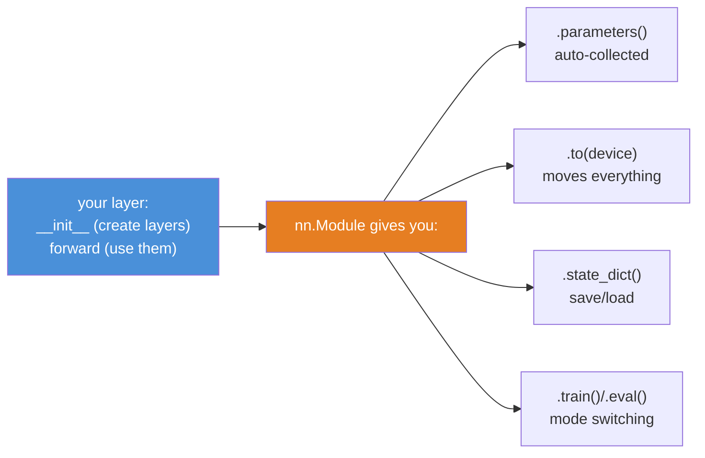
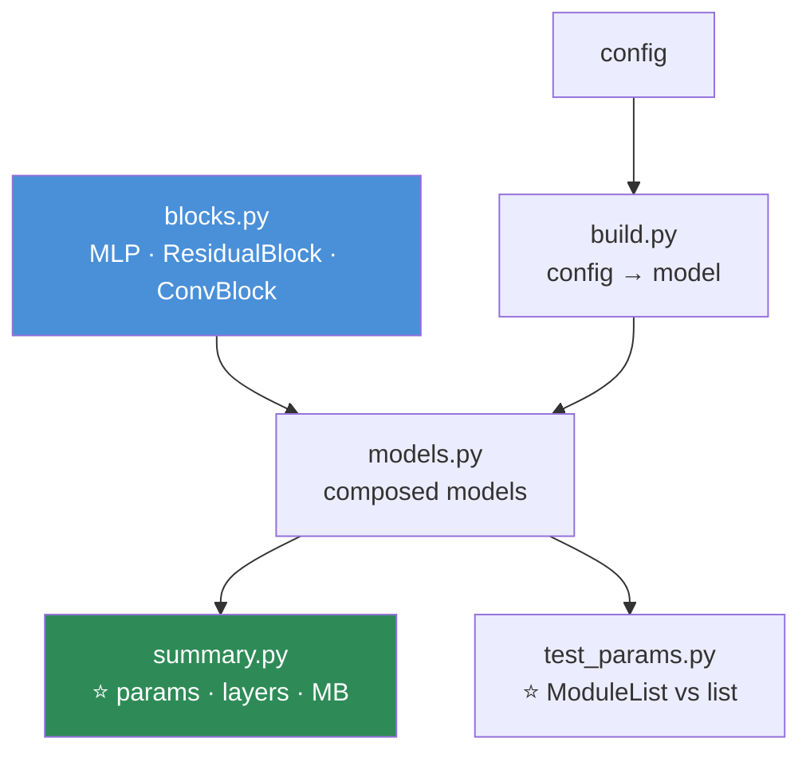

# 09.8 · Building Models with `nn.Module`

[⬅ 09.7 Autograd](09.7-autograd.md) · [🏠 Module 09](../README.md) · [➡ 09.9 Data Loading](09.9-data-loading.md)

> **The lesson in one line:** `nn.Module` is the exact `forward`/`backward`-layer contract you built in 09.4 — now with automatic parameter tracking, device movement, and composition — so you write the forward pass and it manages everything else.

---

## 🎯 Learning objectives

By the end of this lesson you can:

1. Explain what `nn.Module` gives you beyond loose tensors, and connect it to your [09.4](09.4-backpropagation.md) layer classes.
2. Write a model as a **subclass with `__init__` and `forward`** — the idiom you'll use forever.
3. Use **`nn.Sequential`** for simple stacks and know when to reach past it.
4. Explain **`parameters()`, `state_dict()`, and `.to(device)`** and why they Just Work.
5. Build a **custom layer** and a **model composed of sub-models**.
6. Read a real model's `__init__`/`forward` and know exactly what it does.

---

## 🧠 Mental model

> **`nn.Module` is a container that (a) auto-discovers your parameters, (b) moves them all to the GPU with one call, and (c) composes — a module can contain other modules. You write `forward`; it does the rest.**



> [!IMPORTANT]
> **⭐ `nn.Module` is your [09.4](09.4-backpropagation.md) `Layer` class, grown up.** There, each layer had `forward`, cached what it needed, and stored its parameters. `nn.Module` is the same contract — **you define `forward`; autograd ([09.7](09.7-autograd.md)) provides `backward` for free** — plus three conveniences that matter enormously at scale: it *finds* all your parameters automatically (so the optimizer can update them), *moves* them all to a device with one call, and *nests* (so a Transformer is modules-inside-modules-inside-modules). **You already understand the core; this lesson is the ergonomics.**

---

## 📐 The idiom — `__init__` and `forward`

**Every PyTorch model you will ever write follows this exact shape:**

```python
import torch
import torch.nn as nn

class MLP(nn.Module):
    def __init__(self, in_dim=784, hidden=256, out_dim=10):
        super().__init__()                          # ⭐ MUST call this first
        # ── CREATE the layers (this is where parameters are born) ──
        self.fc1 = nn.Linear(in_dim, hidden)        # a Linear layer: 784→256
        self.fc2 = nn.Linear(hidden, out_dim)       # 256→10
        self.act = nn.ReLU()

    def forward(self, x):                            # ⭐ x: (B, 784)
        # ── USE the layers (this is the forward pass from 09.2-09.3) ──
        x = self.act(self.fc1(x))                    # (B, 256)
        return self.fc2(x)                           # (B, 10) logits — NO softmax (09.3)

model = MLP()
print(model)                    # prints the architecture — a free readable summary
logits = model(torch.randn(32, 784))    # ⭐ call model(x), NOT model.forward(x)
print(logits.shape)             # torch.Size([32, 10])
```

| Convention | Why |
|---|---|
| **`super().__init__()` first** | Registers the machinery. Forget it → cryptic errors |
| **Create layers in `__init__`** | Assigning `self.fc1 = nn.Linear(...)` **auto-registers its parameters** ([why](#-the-magic-parameter-discovery)) |
| **Define the forward pass in `forward`** | The [09.2](09.2-neural-network-fundamentals.md)–[09.3](09.3-math-of-neural-networks.md) chain of ops |
| **Call `model(x)`, not `model.forward(x)`** | `model(x)` runs hooks + `forward`. Calling `forward` directly skips them |
| **Output logits, no softmax** | The loss applies it ([09.3](09.3-math-of-neural-networks.md)) |

> [!TIP]
> **⭐ Read `__init__` as "what pieces do I have?" and `forward` as "how do I connect them?"** That split is the whole mental model. `__init__` is a parts list; `forward` is the wiring diagram. When you read *any* PyTorch model — a ResNet, a Transformer, someone's research code — read `__init__` to see the layers, then `forward` to see the dataflow. **Every model in the world is these two methods.**

---

## ✨ The magic: parameter discovery

**Why does the optimizer know about your weights without you telling it?**

```python
model = MLP()
opt = torch.optim.AdamW(model.parameters(), lr=1e-3)   # ⭐ where do parameters() come from?

for name, p in model.named_parameters():
    print(name, tuple(p.shape))
# fc1.weight (256, 784)   ← auto-discovered!
# fc1.bias   (256,)
# fc2.weight (10, 256)
# fc2.bias   (10,)
```

> [!IMPORTANT]
> **⭐ When you write `self.fc1 = nn.Linear(...)` inside a module, PyTorch *registers* that layer's parameters automatically** (via `__setattr__` magic). So `model.parameters()` finds every weight in the entire nested structure — even layers inside layers inside layers — and hands them to the optimizer. **You never maintain a list of parameters** (unlike your [09.5](09.5-optimization.md) `Adam(net.W + net.b)`, where you *did* have to). This is the single biggest ergonomic win of `nn.Module`, and it scales to models with thousands of layers.
>
> **The one gotcha this creates:** a plain Python list of layers is **NOT** registered. `self.layers = [nn.Linear(10,10), nn.Linear(10,10)]` — those parameters are **invisible** to `.parameters()`, so the optimizer never updates them and your model silently doesn't learn. **Use `nn.ModuleList` (or `nn.Sequential`) instead of a plain list.** This is a real, silent bug that catches everyone once.

```python
# ❌ SILENT BUG — parameters invisible, model won't learn
self.layers = [nn.Linear(10, 10) for _ in range(3)]

# ✅ registered properly
self.layers = nn.ModuleList([nn.Linear(10, 10) for _ in range(3)])
```

### `.to(device)` moves everything

```python
model = MLP().to(device)        # ⭐ ONE call moves EVERY parameter to the GPU
```

Because `nn.Module` tracks all parameters, `.to(device)` moves them all at once — you don't move `fc1.weight`, `fc1.bias`, `fc2.weight`, … individually. (Your data you still move per-batch — [09.6](09.6-pytorch-tensors.md).)

---

## 🧱 `nn.Sequential` — for simple stacks

**When your model is just a linear chain of layers, `nn.Sequential` writes the `forward` for you:**

```python
model = nn.Sequential(
    nn.Linear(784, 256),
    nn.ReLU(),
    nn.Linear(256, 128),
    nn.ReLU(),
    nn.Linear(128, 10),
)                               # forward = run each layer in order. Done.
logits = model(torch.randn(32, 784))
```

| Use `nn.Sequential` when | Use a custom `nn.Module` when |
|---|---|
| A **straight-line** stack of layers | **Branching** (residual `x + f(x)`, skip connections) |
| No control flow | You need `if`/`for`/multiple inputs in `forward` |
| Quick prototypes | Anything real |

> [!TIP]
> **`nn.Sequential` is a convenience, not a limitation to fear.** It's perfect for the parts of a model that *are* a simple stack (a Transformer's feed-forward block is a `Sequential` of Linear→GELU→Linear). But **the moment you need a residual connection** (`return x + self.block(x)`) **or two inputs or a conditional, you write a custom `nn.Module`** — because `Sequential` can only pass one tensor straight through, in order. Most real models are custom modules that *contain* `Sequential` blocks.

---

## 🏗️ Composition — modules inside modules

**This is where `nn.Module` earns its keep: a module can contain other modules, arbitrarily deep.**

```python
class ResidualBlock(nn.Module):
    """A block with a skip connection — the ResNet/Transformer building block."""
    def __init__(self, dim):
        super().__init__()
        self.block = nn.Sequential(
            nn.Linear(dim, dim), nn.ReLU(),
            nn.Linear(dim, dim),
        )
    def forward(self, x):
        return x + self.block(x)          # ⭐ the residual: gradient highway (06.4)

class DeepNet(nn.Module):
    def __init__(self, dim=128, n_blocks=6):
        super().__init__()
        self.input = nn.Linear(784, dim)
        self.blocks = nn.ModuleList([ResidualBlock(dim) for _ in range(n_blocks)])   # ⭐ ModuleList
        self.output = nn.Linear(dim, 10)
    def forward(self, x):
        x = torch.relu(self.input(x))
        for block in self.blocks:          # ⭐ real Python loop — dynamic graph (09.7)
            x = block(x)
        return self.output(x)

model = DeepNet()
opt = torch.optim.AdamW(model.parameters())   # ⭐ finds ALL params, through every nested block
```

> [!IMPORTANT]
> **⭐ This nesting is how every large model is built.** A Transformer is: a `TransformerBlock` module, containing an `Attention` module and a `FeedForward` module, stacked N times in a `ModuleList`, wrapped in a top-level module. **GPT-3 is this structure, 96 blocks deep** ([06.11](../../06-Mathematics/weeks/06.11-transformer-math.md)). And `model.parameters()` still finds every single weight, and `.to(device)` still moves them all, because composition is built into `nn.Module`. **You now understand the *structure* of a real LLM's code** — it's modules inside modules, and the residual `x + block(x)` you see above is in every Transformer block.

---

## 🧰 The layers you'll actually use

| Layer | What it does | Lesson |
|---|---|---|
| **`nn.Linear(in, out)`** | Affine: `xW.T + b` | [09.2](09.2-neural-network-fundamentals.md) |
| **`nn.ReLU` / `nn.GELU`** | Activation | [09.2](09.2-neural-network-fundamentals.md) |
| **`nn.Conv2d`** | Convolution | [09.11](09.11-cnns.md) |
| **`nn.BatchNorm` / `nn.LayerNorm`** | Normalization | [09.13](09.13-regularization.md) |
| **`nn.Dropout(p)`** | Regularization | [09.13](09.13-regularization.md) |
| **`nn.Embedding`** | Lookup table (tokens → vectors) | [09.12](09.12-sequence-models.md) |
| **`nn.LSTM` / `nn.GRU`** | Recurrent | [09.12](09.12-sequence-models.md) |
| **`nn.MultiheadAttention`** | Attention | [06.11](../../06-Mathematics/weeks/06.11-transformer-math.md) |

**They all follow the same contract: create in `__init__`, use in `forward`.** Once you know the pattern, adding a new layer type is trivial — you're just adding a part and wiring it in.

---

## ⚙️ `state_dict` — the parameters as a dictionary

```python
sd = model.state_dict()          # ⭐ OrderedDict: {param_name: tensor}
print(list(sd.keys())[:3])       # ['input.weight', 'input.bias', 'blocks.0.block.0.weight']

torch.save(model.state_dict(), 'model.pt')       # save (09.16)
model.load_state_dict(torch.load('model.pt'))    # load
```

> [!TIP]
> **`state_dict()` is just a dictionary of all the model's learnable tensors, keyed by name.** It's what you save and load ([09.16](09.16-saving-loading.md)), and — because it's a plain dict — it's how you do partial loading (transfer learning: load the backbone's weights, leave the new head random). **You'll meet it properly in [09.16](09.16-saving-loading.md); for now, know that a model's entire "knowledge" is this dictionary of numbers.**

---

## ⚡ Performance & GPU considerations

| Fact | Consequence |
|---|---|
| **`model.to(device)` moves all params** | One call; do it once at setup |
| **Layers in a Python list are invisible** | ⭐ Use `nn.ModuleList` or params won't move/train |
| **`model(x)` runs hooks; `model.forward(x)` doesn't** | Always call `model(x)` |
| **`print(model)` is free** | A readable architecture summary — use it constantly |
| **`sum(p.numel() for p in model.parameters())`** | Count parameters — know your model's size |
| **`torch.compile(model)`** | JIT-compile the module for speedups ([09.17](09.17-production.md)) |

```python
# ⭐ Always know your parameter count
n_params = sum(p.numel() for p in model.parameters())
print(f"{n_params:,} parameters ({n_params * 4 / 1e6:.1f} MB in fp32)")
```

---

## 🐛 Common mistakes

| Mistake | Consequence |
|---|---|
| **Forgetting `super().__init__()`** | Cryptic error — machinery not registered |
| **Layers in a plain Python `list`** | ⭐ **Invisible to `.parameters()`** → not trained, not moved. Use `nn.ModuleList` |
| **Calling `model.forward(x)`** | Skips hooks; call `model(x)` |
| **Applying softmax in `forward`** | Double softmax with `CrossEntropyLoss` ([09.3](09.3-math-of-neural-networks.md)) |
| **Creating layers in `forward`** | New random weights every call — the model never learns |
| **Not moving the model to the device** | Device-mismatch errors |
| **Reusing a `nn.ReLU()` object vs the functional `F.relu`** | Both fine; but a *stateful* layer (dropout) must not be shared unless you mean it |
| **Wrong input shape** | Shape error — `print(x.shape)` in `forward` while debugging |

---

## 📝 Exercises

**Building models**
1. Write an `MLP` for MNIST as an `nn.Module` (`__init__` + `forward`). Print it. Count its parameters.
2. Build the **same** model with `nn.Sequential`. Confirm identical output on the same input and weights.
3. **When can't you use `nn.Sequential`?** Write a model with a residual connection and explain why it needs a custom `forward`.
4. Build a `DeepNet` of 6 residual blocks (as above). Confirm `model.parameters()` finds every weight through the nesting.

**The ModuleList bug**
5. ⭐ **Reproduce the silent bug**: put layers in a plain Python `list`, print `len(list(model.parameters()))`, and show it's missing them. Fix with `nn.ModuleList` and show they appear. **Then train both and show the list-version doesn't learn.**
6. Move a model to the GPU with `.to(device)`. Verify every parameter's device. Show that a list-based layer's parameters *didn't* move.

**Reading real models**
7. Print `torchvision.models.resnet18()`. Identify its `__init__` structure (the blocks). Trace `forward` conceptually.
8. Count the parameters of resnet18, resnet50, and a small BERT. Convert to MB. **Which fits on a Colab GPU?**

**Composition**
9. Write a custom `TransformerBlock`-shaped module: an attention placeholder + a feed-forward `Sequential` + two residual connections. (Don't implement attention — use `nn.Identity()` as a stand-in.) Confirm `forward` runs and shapes are preserved.
10. Write a model that takes **two** inputs (e.g. an image and a tabular vector), processes each, and concatenates. Explain why this *requires* a custom `nn.Module`.

---

## 🛠️ Mini project — *The Model Zoo*

Build `code/09-deep-learning/model-zoo/` — a library of reusable, composable model components, built the way real codebases are.

**Requirements**
- A set of building blocks (`MLP`, `ResidualBlock`, `ConvBlock`) each as an `nn.Module`.
- **Composed models** that reuse the blocks.
- **A parameter counter and architecture printer** for every model.
- **Tests** that catch the `ModuleList` bug and verify shapes.

```
model-zoo/
├── README.md
├── src/
│   ├── blocks.py         # ⭐ MLP, ResidualBlock, ConvBlock — reusable nn.Modules
│   ├── models.py         # composed models (a deep MLP, a small CNN)
│   ├── summary.py        # ⭐ param count, layer table, memory estimate
│   └── build.py          # config → model (like a real training repo)
├── tests/
│   ├── test_params.py    # ⭐ ModuleList registers; plain list doesn't
│   └── test_shapes.py    # forward preserves/produces expected shapes
└── notebooks/
```

**Architecture**



**Implementation guidance**
1. **Build reusable blocks, then compose them** — this is how real codebases (torchvision, timm, HuggingFace) are structured. A `ResidualBlock` you write once is reused across every deep model. **This teaches the composition mindset that makes large-model code readable:** it's blocks all the way down.
2. **`summary.py` is the tool you'll actually reuse.** Given any model, print a table: layer name, output shape, parameter count. Total the parameters, convert to MB (× 4 for fp32, × 3 more if training with Adam — [09.5](09.5-optimization.md)). **`torchinfo.summary(model, input_size)` does this professionally — build a mini version first to understand it, then use the library.** Knowing your model's size and where the parameters live is a basic engineering competency.
3. **`test_params.py` encodes the `ModuleList` bug as a test.** Assert that a model using `nn.ModuleList` exposes all its parameters, and that an intentionally-broken version using a plain `list` exposes fewer. **A test that documents the trap is worth more than a comment** — it can't be forgotten.
4. **`build.py` mirrors a real training repo:** a config dict (`{'type': 'mlp', 'hidden': [256, 128], ...}`) that constructs a model. This is the pattern every serious codebase uses, and building a tiny version demystifies the giant `build_model(cfg)` functions you'll read later.

**Testing plan:** parameter registration (ModuleList vs list), forward-pass shapes for each block and composed model, and that every model moves to a device cleanly.

**Evaluation:** the summary table for each model, and the passing tests. **The deliverable is fluency with `nn.Module` composition** — the skill that lets you read and write any real model.

**Future improvements:** add a `ConvBlock` and build a small CNN ([09.11](09.11-cnns.md)); add weight initialization options; add `torch.compile` and benchmark the speedup.

---

## 📄 Cheat sheet

| | |
|---|---|
| **The idiom** | `class Net(nn.Module): __init__ (create layers) + forward (use them)` |
| **⭐ `super().__init__()`** | First line of `__init__`. Always |
| **Read a model** | `__init__` = parts list · `forward` = wiring |
| **Call it** | `model(x)` — **NOT** `model.forward(x)` |
| **Output** | Logits, no softmax (the loss applies it) |
| **⭐ `.parameters()`** | Auto-discovered — the optimizer's input |
| **⭐ Plain list = invisible** | Use `nn.ModuleList` / `nn.Sequential` or params won't train |
| **`.to(device)`** | Moves all parameters at once |
| **`nn.Sequential`** | Straight-line stacks only. Branching → custom `forward` |
| **Composition** | Modules inside modules — how every big model is built |
| **`state_dict()`** | The model's weights as a dict → save/load (09.16) |
| **Count params** | `sum(p.numel() for p in model.parameters())` |

---

## 🎴 Flashcards

- **Q:** ⭐ What is `nn.Module`? → **A:** The `forward`/`backward`-layer contract from [09.4](09.4-backpropagation.md), grown up: **you write `forward`; autograd gives `backward`; and it auto-discovers parameters, moves them all with `.to(device)`, and composes** (modules inside modules).
- **Q:** How do you read any PyTorch model? → **A:** **`__init__` is the parts list** (what layers exist), **`forward` is the wiring** (how they connect). Every model in the world is these two methods.
- **Q:** Why call `model(x)` and not `model.forward(x)`? → **A:** `model(x)` runs registered hooks *and* `forward`; calling `forward` directly **skips the hooks** (which matter for things like `torch.compile` and profiling).
- **Q:** ⭐ Why does `model.parameters()` find your weights automatically? → **A:** Assigning `self.fc = nn.Linear(...)` **auto-registers** its parameters via `__setattr__`. So the optimizer sees every weight through arbitrary nesting — you never maintain a list.
- **Q:** ⭐ What's the silent `nn.Module` bug? → **A:** Layers in a **plain Python list** are **invisible to `.parameters()`** — not trained, not moved to the GPU. **Use `nn.ModuleList` or `nn.Sequential`.** Catches everyone once.
- **Q:** When can't you use `nn.Sequential`? → **A:** When you need **branching** (a residual `x + f(x)`), **multiple inputs**, or **control flow** in `forward`. Sequential only passes one tensor straight through, in order.
- **Q:** How is a large model like GPT structured? → **A:** **Modules inside modules** — a `Block` containing `Attention` + `FeedForward`, stacked N times in a `ModuleList`. Composition is built into `nn.Module`, so `.parameters()` and `.to(device)` still work through all of it.
- **Q:** What is `state_dict()`? → **A:** An ordered dict of all the model's learnable tensors, keyed by name — the model's entire "knowledge." It's what you save and load.

---

## 💼 Interview questions

1. **⭐ "What does `nn.Module` give you?"** — Automatic parameter discovery (`.parameters()` for the optimizer), one-call device movement (`.to()`), composition (modules in modules), mode switching (`train`/`eval`), and save/load (`state_dict`). **You write `forward`; it manages the rest.**
2. **"Walk me through a basic PyTorch model."** — Subclass `nn.Module`, `super().__init__()`, create layers in `__init__`, define the dataflow in `forward`, output logits. Call `model(x)`.
3. **⭐ "Your model isn't learning some layers. Why?"** — They're probably in a **plain Python list** instead of `nn.ModuleList`, so `.parameters()` never sees them and the optimizer never updates them. Silent, and it catches everyone once.
4. **"`nn.Sequential` vs a custom module?"** — Sequential for straight-line stacks; a custom `forward` for **branching, residual connections, multiple inputs, or control flow.** Most real models are custom modules containing Sequential blocks.
5. **"How is a Transformer organized in code?"** — Modules inside modules: a block (attention + feed-forward + residuals), stacked N times in a ModuleList. `nn.Module` composition makes this natural.

---

## 📚 Summary

- **⭐ `nn.Module` is your [09.4](09.4-backpropagation.md) layer contract, grown up.** You define `forward`; autograd provides `backward` ([09.7](09.7-autograd.md)); and it adds three things that matter at scale: **automatic parameter discovery**, **one-call device movement**, and **composition**.
- **The idiom is universal:** subclass `nn.Module`, call `super().__init__()`, **create layers in `__init__`, use them in `forward`.** Read any model as `__init__` (parts list) + `forward` (wiring).
- **Call `model(x)`, not `model.forward(x)`.** Output **logits, no softmax** (the loss applies it).
- **⭐ Assigning `self.layer = nn.Linear(...)` auto-registers its parameters** — which is why `model.parameters()` finds them all and `.to(device)` moves them all. **But a plain Python list of layers is invisible** — a silent bug that stops those layers from training. Use `nn.ModuleList` / `nn.Sequential`.
- **`nn.Sequential`** writes `forward` for straight-line stacks; **custom modules** handle branching, residuals, multiple inputs, and control flow.
- **⭐ Composition — modules inside modules — is how every large model is built.** A Transformer is blocks-inside-blocks, N deep; `.parameters()` and `.to(device)` still work through all of it. You now understand the structure of a real LLM's code.
- **`state_dict()` is the model's weights as a dictionary** — its entire knowledge, and what you save and load.

**Next:** [09.9 Data Loading](09.9-data-loading.md) — the model is ready; now feed it efficiently.

---

## 🔗 References

- PyTorch — [`nn.Module` tutorial](https://pytorch.org/tutorials/beginner/basics/buildmodel_tutorial.html) and the [`nn.Module` docs](https://pytorch.org/docs/stable/generated/torch.nn.Module.html).
- Stevens et al. — *Deep Learning with PyTorch*, Ch. 6–8. The best book treatment of building models.
- `torchinfo` — [github.com/TylerYep/torchinfo](https://github.com/TylerYep/torchinfo) — the professional `summary()` your project reimplements.
- torchvision / timm / HuggingFace `transformers` source — **read real `__init__`/`forward` code.** It's all the composition pattern from this lesson.
- [09.4 Backpropagation](09.4-backpropagation.md) — the layer contract `nn.Module` formalizes.

---

## 🧭 Navigation

| Direction | Link |
|---|---|
| ⬅ Previous | [09.7 Autograd](09.7-autograd.md) |
| ➡ Next | [09.9 Data Loading](09.9-data-loading.md) |
| 🏠 Module | [Module 09](../README.md) |
| 🗺 Roadmap | [ROADMAP.md](../../../ROADMAP.md) |
