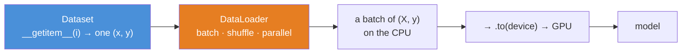
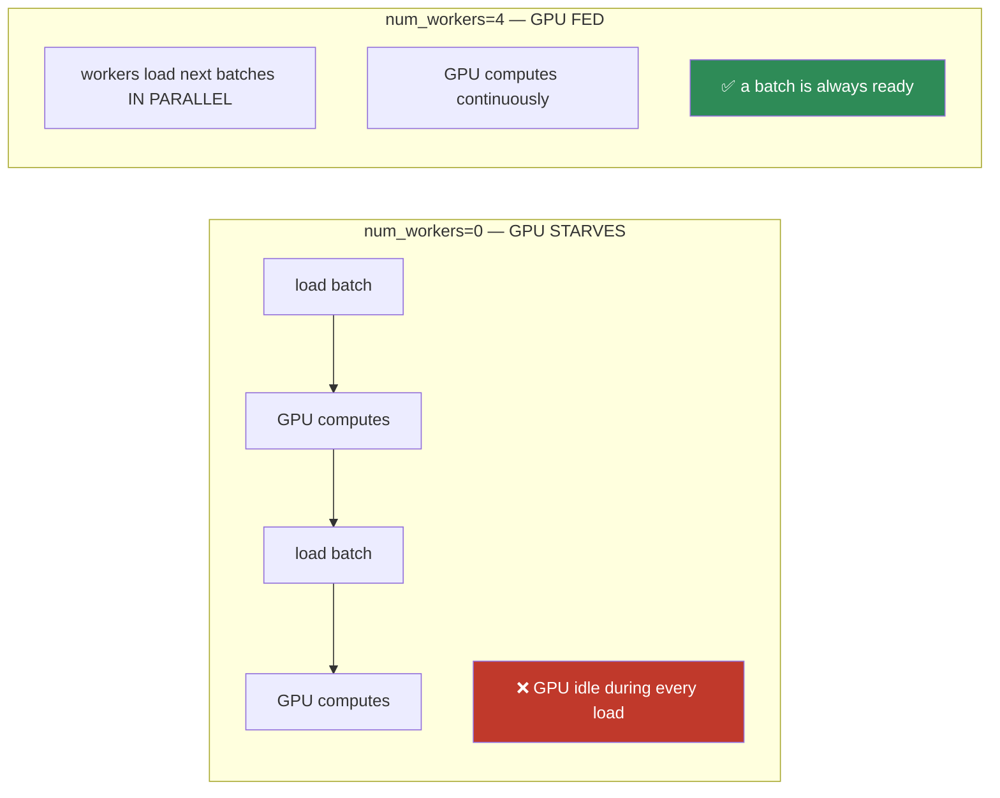
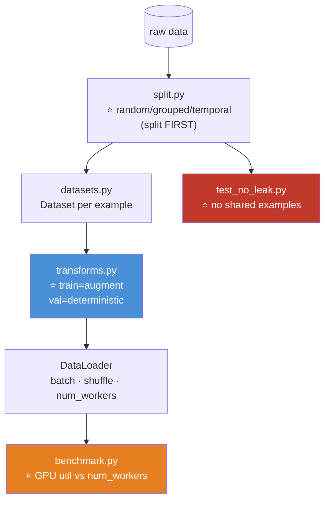

# 09.9 · Data Loading

[⬅ 09.8 Building Models](09.8-building-models.md) · [🏠 Module 09](../README.md) · [➡ 09.10 The Training Loop](09.10-training-loop.md)

> **The lesson in one line:** A GPU that costs $10/hour sitting idle waiting for a slow data pipeline is the most expensive mistake in deep learning — so `Dataset` says *what* your data is, and `DataLoader` feeds it to the GPU fast enough to keep it busy.

---

## 🎯 Learning objectives

By the end of this lesson you can:

1. Write a custom **`Dataset`** — the two-method contract.
2. Configure a **`DataLoader`** and explain every important argument.
3. Explain **why batching, shuffling, and parallel loading exist** — each solves a specific problem.
4. Diagnose the **"my GPU is idle" bottleneck** and fix it.
5. Apply **data augmentation** correctly — and know the train/val asymmetry that trips everyone up.
6. Avoid the leakage that a naive data pipeline invites.

---

## 🧠 Mental model

> **`Dataset` = "here's one example, given an index." `DataLoader` = "batch them, shuffle them, and load them in parallel so the GPU never waits."**



> [!IMPORTANT]
> **⭐ The separation is the whole design.** `Dataset` knows *what* the data is and how to produce a single example; `DataLoader` knows *how to serve it efficiently*. This split means you write the "what" once and get batching, shuffling, and multi-process loading for free — and you can swap the loading strategy (bigger batches, more workers) without touching your data logic. **Every PyTorch training pipeline is these two objects.**

---

## 📐 `Dataset` — the two-method contract

**A `Dataset` needs exactly two methods:** `__len__` (how many examples?) and `__getitem__` (give me example `i`).

```python
import torch
from torch.utils.data import Dataset

class MyDataset(Dataset):
    def __init__(self, X, y, transform=None):
        self.X = X                          # could be tensors, file paths, anything
        self.y = y
        self.transform = transform          # optional augmentation (below)

    def __len__(self):                       # ⭐ how many examples?
        return len(self.X)

    def __getitem__(self, i):                # ⭐ return ONE (x, y) pair
        x, y = self.X[i], self.y[i]
        if self.transform:
            x = self.transform(x)            # ⭐ augment HERE, per-example
        return x, y
```

> [!TIP]
> **⭐ `__getitem__` returns ONE example, not a batch — the `DataLoader` does the batching.** This is the most common early confusion. You write the logic for a single item (load one image, tokenize one sentence), and PyTorch calls it `batch_size` times and stacks the results. **Keep `__getitem__` doing the minimum per-example work**, because it runs millions of times.

### The two flavours

| Flavour | When |
|---|---|
| **Map-style** (`__getitem__` + `__len__`) | ⭐ The default. You can index into it, know its length, and shuffle it |
| **Iterable-style** (`__iter__`) | Streaming data too big to index (a data stream, an infinite generator) |

**Use map-style unless your data genuinely doesn't fit or doesn't have a length.** Most datasets are map-style.

---

## 🚚 `DataLoader` — the efficient feeder

```python
from torch.utils.data import DataLoader

train_loader = DataLoader(
    train_dataset,
    batch_size=64,           # ⭐ how many examples per batch
    shuffle=True,            # ⭐ reshuffle every epoch (TRAIN only!)
    num_workers=4,           # ⭐ parallel loading processes (the #1 speed knob)
    pin_memory=True,         # ⭐ faster CPU→GPU transfer
    drop_last=True,          # drop the final partial batch (keeps shapes uniform)
    persistent_workers=True, # keep workers alive between epochs (avoids re-spawn cost)
)

for X, y in train_loader:    # ⭐ iterate → get batches
    X, y = X.to(device), y.to(device)     # move each batch (09.6)
    ...
```

| Argument | What it does | Why it matters |
|---|---|---|
| **`batch_size`** | Examples per batch | Bigger = better GPU use, more memory ([06.7](../../06-Mathematics/weeks/06.7-optimization.md)) |
| **`shuffle=True`** | Reshuffle each epoch | ⭐ **Train only** — see below |
| **`num_workers`** | Parallel loading processes | ⭐ **The #1 fix for an idle GPU** |
| **`pin_memory=True`** | Page-locked CPU memory | Faster, async CPU→GPU transfer |
| **`drop_last`** | Drop the last partial batch | Uniform shapes (matters for batch norm) |
| **`collate_fn`** | Custom batch assembly | Variable-length sequences (padding) — [09.12](09.12-sequence-models.md) |

---

## 🔀 Why batching, shuffling, and parallelism exist

### Batching — for the GPU and the gradient

**Two reasons, both from earlier modules:**
1. **Hardware.** One big matmul beats `B` small ones — a GPU processing one example uses ~1% of its cores; processing 256 uses them all ([09.2](09.2-neural-network-fundamentals.md), [06.2](../../06-Mathematics/weeks/06.2-linear-algebra-vectors-matrices.md)).
2. **The gradient.** A mini-batch gradient is a good, slightly-noisy estimate — and that noise is a *feature* ([06.7](../../06-Mathematics/weeks/06.7-optimization.md)) that helps find flat, generalizing minima.

**Batch size is a real hyperparameter:** bigger = smoother gradients, faster epochs, but worse generalization and more memory. **Rule: the largest that fits in memory and still generalizes** — and if you increase it, scale the learning rate up too (the linear scaling rule — [06.7](../../06-Mathematics/weeks/06.7-optimization.md)).

### ⭐ Shuffling — train only, and why it's mandatory

> [!IMPORTANT]
> **⭐ Shuffle the training set every epoch. Do NOT shuffle validation or test.**
>
> **Why shuffle train:** if your data is ordered (all class-0 examples, then all class-1), a batch might contain *only* class 0. The gradient for that batch points in a wildly wrong direction, and training becomes unstable — the model swings back and forth. **Shuffling ensures each batch is a representative mix**, so each gradient is a reasonable estimate of the true gradient.
>
> **Why NOT shuffle val/test:** there's no training happening, so order doesn't affect the result — and shuffling just makes runs non-reproducible for no benefit. `shuffle=False` on the validation loader.
>
> **The classic bug:** forgetting `shuffle=True` on a sorted training set. The loss oscillates violently and the model barely learns — and it looks like a learning-rate problem, so people waste hours tuning the LR when the fix is one keyword.

### Parallel loading — keeping the GPU fed

> [!CAUTION]
> **⭐ The most expensive mistake in deep learning: an idle GPU waiting for data.**
>
> If loading a batch (reading images from disk, decoding JPEGs, augmenting) takes longer than the model's forward+backward pass, **the GPU sits idle** — you're paying for a Ferrari and driving it in traffic. On a slow pipeline, your $10/hour GPU might be **utilized 20% of the time.**
>
> **The fix: `num_workers > 0`.** This spawns parallel processes that prepare the *next* batches **while the GPU is computing the current one** — so a batch is always ready the instant the GPU finishes. **Set `num_workers` to roughly your CPU core count** (4–8 is typical), and watch GPU utilization climb.
>
> **Diagnose it with `nvidia-smi`** ([09.14](09.14-performance.md)): if GPU utilization is low and bouncing, your data pipeline is the bottleneck, not your model. **This is one of the highest-ROI fixes in all of deep learning, and beginners almost never think of it.**



---

## 🎨 Data augmentation — more data, for free

**Augmentation applies random, label-preserving transformations to each example — so the model sees a slightly different version every epoch.** A flipped cat is still a cat; a slightly-rotated digit is the same digit. This **artificially expands your dataset and is one of the strongest regularizers there is** ([09.13](09.13-regularization.md)).

```python
from torchvision import transforms

# ── TRAIN: random augmentation (different every epoch) ───────────
train_tf = transforms.Compose([
    transforms.RandomHorizontalFlip(),          # ⭐ random — a cat flipped is still a cat
    transforms.RandomRotation(10),
    transforms.RandomResizedCrop(224),
    transforms.ColorJitter(brightness=0.2),
    transforms.ToTensor(),
    transforms.Normalize(mean=[0.485, 0.456, 0.406],   # ⭐ standardize (07.5)
                         std=[0.229, 0.224, 0.225]),
])

# ── VAL/TEST: NO random augmentation — deterministic ────────────
val_tf = transforms.Compose([
    transforms.Resize(256),
    transforms.CenterCrop(224),                  # ⭐ deterministic, NOT random crop
    transforms.ToTensor(),
    transforms.Normalize(mean=[0.485, 0.456, 0.406], std=[0.229, 0.224, 0.225]),
])
```

> [!CAUTION]
> **⭐ Augment the training set. Do NOT randomly augment validation or test — and this trips up nearly everyone.**
>
> **Why:** random augmentation at eval time makes your metrics **non-deterministic and noisy** — the same image scores differently each run, so you can't compare models. Worse, it means you're evaluating on *distorted* data, not the real distribution you'll see in production. **Validation should use deterministic transforms** (resize + center crop + normalize) — the same preprocessing your production inference will use.
>
> **The rule, echoing [07.5](../../07-Data-Analysis/weeks/07.5-data-cleaning.md) and [08.14](../../08-Machine-Learning/weeks/08.14-feature-engineering.md):** the *fitted* preprocessing (the normalization statistics) is computed on train and applied to both; the *random* augmentation is applied to train only. Get this asymmetry right or your evaluation lies to you.

> [!TIP]
> **The normalization statistics leak, too.** `Normalize(mean, std)` uses statistics that should come from your **training set** (or, for transfer learning, ImageNet's — the values above). Computing them over the full dataset including val/test is the same scaling leakage from [08.14](../../08-Machine-Learning/weeks/08.14-feature-engineering.md). For standard pretrained models, use the canonical ImageNet stats (above); for a custom dataset, compute them on train only.

---

## 🐍 A complete data pipeline

```python
from torchvision import datasets

# ── built-in datasets: Dataset + download, for free ─────────────
train_ds = datasets.MNIST('data', train=True,  download=True, transform=train_tf)
val_ds   = datasets.MNIST('data', train=False, download=True, transform=val_tf)

train_loader = DataLoader(train_ds, batch_size=64, shuffle=True,
                          num_workers=4, pin_memory=True)
val_loader   = DataLoader(val_ds,   batch_size=256, shuffle=False,   # ⭐ no shuffle, bigger batch
                          num_workers=4, pin_memory=True)

# a batch
X, y = next(iter(train_loader))
print(X.shape, y.shape, y.dtype)     # (64, 1, 28, 28) (64,) torch.int64
```

> [!NOTE]
> **Validation batches can be bigger than training batches.** There's no backward pass at validation (no activation cache — [09.4](09.4-backpropagation.md)), so you have far more memory to spare. A `batch_size` of 256 for validation vs 64 for training is common and makes validation faster.

---

## ⚡ Performance & GPU considerations

| Fix | Impact |
|---|---|
| **`num_workers=4-8`** | ⭐ The biggest fix for an idle GPU |
| **`pin_memory=True`** | Faster, overlapping CPU→GPU transfer |
| **`persistent_workers=True`** | Avoid re-spawning workers each epoch |
| **Preprocess once, cache** | Don't decode the same JPEG every epoch — cache tensors |
| **Efficient formats** | Many small files are slow; use WebDataset / LMDB / a single tensor file for huge datasets |
| **Bigger batches** | Better GPU utilization (up to a memory limit) |
| **`prefetch_factor`** | How many batches each worker preloads |

> [!WARNING]
> **`num_workers` on Windows and in notebooks can misbehave** — worker processes need to `pickle` your Dataset, and on Windows/Jupyter this sometimes hangs or errors (the multiprocessing start method differs). **If `num_workers > 0` hangs, set it to 0 to confirm that's the cause**, then wrap your training code in `if __name__ == '__main__':` (on Windows) or move the Dataset to an importable module. A frustrating platform quirk, and worth knowing before it eats an afternoon.

---

## 🔒 Leakage & correctness considerations

**Everything from [07.12](../../07-Data-Analysis/weeks/07.12-case-studies.md) and [08.13](../../08-Machine-Learning/weeks/08.13-cross-validation.md) applies — the data pipeline is where leakage sneaks in:**

| Concern | Guard |
|---|---|
| **Duplicate/near-duplicate examples** across the split | Deduplicate before splitting (esp. images — perceptual hash) |
| **Grouped data** (same patient/user in train and val) | Split by group, not randomly ([08.13](../../08-Machine-Learning/weeks/08.13-cross-validation.md)) |
| **Augmenting or normalizing with test statistics** | Fit on train only |
| **Shuffling that mixes train and val** | Split *first*, then build separate loaders |
| **Temporal data** | Time-based split; the loader must not shuffle across time boundaries |

> [!IMPORTANT]
> **⭐ A deep learning model with a leaked data pipeline is exactly as worthless as a leaked logistic regression** ([08.13](../../08-Machine-Learning/weeks/08.13-cross-validation.md)). The framework got fancier; the ways you fool yourself did not. **The most common image-ML failure — the same patient's scans in both train and test — happens in the `Dataset`/`DataLoader`, so it's your responsibility here.**

---

## 🐛 Common mistakes

| Mistake | Consequence |
|---|---|
| **`__getitem__` returns a batch** | It should return **one** example; the loader batches |
| **Forgetting `shuffle=True` on train** | Loss oscillates; model barely learns. Looks like an LR bug |
| **`shuffle=True` on validation** | Non-reproducible metrics for no benefit |
| **⭐ Random augmentation at eval** | Non-deterministic, noisy metrics; evaluating on distorted data |
| **`num_workers=0`** | ⭐ Idle GPU — your #1 performance bug |
| **Not moving the batch to the device** | Device-mismatch error ([09.6](09.6-pytorch-tensors.md)) |
| **Heavy work in `__getitem__`** | It runs millions of times — keep it minimal, cache if you can |
| **Normalizing with test statistics** | Scaling leakage |
| **Grouped data split randomly** | Leakage — the model learns the patient, not the disease |

---

## 📝 Exercises

**Building datasets**
1. Write a custom `Dataset` for a folder of images (paths in `__init__`, load in `__getitem__`). Return one `(image, label)`.
2. Wrap it in a `DataLoader` with `batch_size=32, shuffle=True, num_workers=4`. Iterate one batch and print the shapes.
3. **Why does `__getitem__` return one example, not a batch?** What does the DataLoader do?

**Batching & shuffling**
4. ⭐ **Demonstrate the sorted-data bug**: build a dataset sorted by class, train with `shuffle=False`, and plot the loss (it'll oscillate). Then `shuffle=True` and show it smooths out. **Explain why.**
5. Compare training with `batch_size` 16, 64, 256. Report wall-clock per epoch and final accuracy. Which is fastest? Which generalizes best?
6. Build separate train and val loaders. **Verify val has `shuffle=False`** and can use a bigger batch.

**Augmentation**
7. Build train and val transform pipelines. **Show the train images differ across epochs (random) and the val images don't (deterministic).**
8. ⭐ **Reproduce the eval-augmentation bug**: apply `RandomHorizontalFlip` to validation. Evaluate twice. **Show the metrics differ.** Explain why that's wrong.

**Performance**
9. ⭐ On a GPU (Colab), train with `num_workers=0` and `num_workers=4`. **Report GPU utilization (`nvidia-smi`) and time per epoch for each.** Explain the difference.
10. Profile where the time goes: is your bottleneck the model or the data pipeline? (Time a batch of loading vs a batch of forward+backward.)

---

## 🛠️ Mini project — *The Data Pipeline*

Build `code/09-deep-learning/data-pipeline/` — a correct, fast, leakage-safe input pipeline you can reuse for every project in this module.

**Requirements**
- Custom `Dataset` classes for images and for tabular data.
- **Correct train/val transform split** (random augmentation on train, deterministic on val).
- **A GPU-utilization benchmark** proving `num_workers` matters.
- **Leakage guards**: the split happens before augmentation; grouped/temporal splitting supported.

```
data-pipeline/
├── README.md
├── src/
│   ├── datasets.py       # ⭐ image + tabular Dataset classes
│   ├── transforms.py     # ⭐ train (augment) vs val (deterministic)
│   ├── split.py          # random / grouped / temporal splitting (08.13)
│   ├── benchmark.py      # ⭐ GPU utilization vs num_workers
│   └── build.py          # config → train_loader, val_loader
├── tests/
│   ├── test_shapes.py    # batches have the right shape/dtype
│   ├── test_no_leak.py   # ⭐ no example in both train and val
│   └── test_eval_deterministic.py   # ⭐ val transforms are deterministic
└── notebooks/
    └── num_workers_speedup.ipynb
```

**Architecture**



**Implementation guidance**
1. **`split.py` runs FIRST, before any transform or loader** — this is the [08.13](../../08-Machine-Learning/weeks/08.13-cross-validation.md) discipline. Support random, **grouped** (by patient/user id), and **temporal** splits. `test_no_leak.py` asserts no example appears in both train and val — **the single most important test for any data pipeline.**
2. **`transforms.py` makes the train/val asymmetry structural.** The train pipeline has random augmentation; the val pipeline is deterministic. **`test_eval_deterministic.py` asserts the val transform produces identical output on repeated calls** — encoding the "don't augment eval" rule as a test so it can't be forgotten.
3. **`benchmark.py` is the lesson made undeniable.** Train a few epochs at `num_workers` = 0, 2, 4, 8, logging **GPU utilization** (via `torch.cuda` or shelling out to `nvidia-smi`) and time per epoch. **Plot it.** You'll see utilization jump from ~30% to ~95% as workers increase — **that plot is the argument for `num_workers`, and it's a number you can show your team to justify the change.**

**Testing plan:** `test_no_leak` (no shared examples — the critical one), `test_eval_deterministic` (val transforms repeatable), `test_shapes` (batch shapes/dtypes correct, labels are `int64`).

**Evaluation:** the `num_workers` speedup curve, and the passing leakage/determinism tests. **The deliverable is a pipeline you trust and reuse.**

**Future improvements:** add caching (decode-once); add a `collate_fn` for variable-length sequences ([09.12](09.12-sequence-models.md)); support WebDataset for large-scale streaming.

---

## 📄 Cheat sheet

| | |
|---|---|
| **`Dataset`** | `__len__` + `__getitem__(i) → one (x, y)`. Returns ONE example |
| **`DataLoader`** | Batches, shuffles, loads in parallel |
| **`batch_size`** | Largest that fits + still generalizes |
| **⭐ `shuffle=True`** | **Train only.** Prevents class-clustered batches |
| **`shuffle=False`** | Val/test — reproducible, no benefit to shuffling |
| **⭐ `num_workers=4-8`** | **The #1 fix for an idle GPU** |
| **`pin_memory=True`** | Faster CPU→GPU transfer |
| **`drop_last=True`** | Uniform batch shapes |
| **⭐ Augment TRAIN only** | Random transforms on train; deterministic on val |
| **Normalize** | Statistics from **train** (or ImageNet for transfer) |
| **Diagnose idle GPU** | `nvidia-smi` — low util = data-bound, not model-bound |

---

## 🎴 Flashcards

- **Q:** What are `Dataset` and `DataLoader`? → **A:** **`Dataset`** = "give me one example, given an index" (`__len__` + `__getitem__`). **`DataLoader`** = "batch, shuffle, and load them in parallel." The split lets you write the "what" once and get efficient serving for free.
- **Q:** Why does `__getitem__` return one example, not a batch? → **A:** The **DataLoader** does the batching — it calls `__getitem__` `batch_size` times and stacks the results. Keep `__getitem__` minimal; it runs millions of times.
- **Q:** ⭐ Why shuffle the training set but not validation? → **A:** **Train:** ordered data gives class-clustered batches → wildly wrong gradients → unstable training. Shuffling makes each batch representative. **Val:** no training happens, so order doesn't matter, and shuffling just breaks reproducibility.
- **Q:** ⭐ What's the most expensive mistake in deep learning? → **A:** **An idle GPU waiting for data.** If loading is slower than the forward+backward pass, the GPU starves. Fix: **`num_workers > 0`** (parallel loading — prepare the next batch while the GPU computes the current one). Diagnose with `nvidia-smi`.
- **Q:** ⭐ Why augment the training set but not validation? → **A:** Random augmentation at eval makes metrics **non-deterministic and noisy**, and evaluates on **distorted** data rather than the real distribution. Val uses **deterministic** transforms (resize + center crop + normalize).
- **Q:** What statistics should `Normalize` use? → **A:** The **training set's** (or ImageNet's for transfer learning). Computing them over the full dataset including val/test is scaling **leakage**.
- **Q:** How can a data pipeline leak? → **A:** Duplicate examples across the split, **grouped data** (same patient in train and val), normalizing with test statistics, or splitting after augmenting. **Split first, then build separate loaders.**

---

## 💼 Interview questions

1. **"How does data loading work in PyTorch?"** — `Dataset` produces one example; `DataLoader` batches, shuffles, and loads it in parallel. The separation lets you swap the loading strategy without touching data logic.
2. **⭐ "Your GPU utilization is 30%. What's wrong?"** — **The data pipeline is starving it.** Loading is slower than compute. Fix: increase `num_workers`, `pin_memory=True`, cache preprocessing, use efficient file formats. **One of the highest-ROI fixes in DL.**
3. **⭐ "Should you augment the validation set?"** — **No.** Random augmentation makes metrics non-deterministic and evaluates on distorted data. Val gets deterministic transforms — the same preprocessing production will use.
4. **"Why shuffle training data?"** — To avoid class-clustered batches that produce wildly wrong gradients and unstable training. **Train only** — never shuffle val/test.
5. **"How do you prevent leakage in an image pipeline?"** — Deduplicate before splitting, **split by group** (not randomly) when data is grouped, and normalize with train-only statistics. A leaked deep model is as worthless as a leaked logistic regression.

---

## 📚 Summary

- **`Dataset` says *what* your data is** (`__getitem__(i)` returns one example); **`DataLoader` serves it efficiently** (batching, shuffling, parallel loading). Every PyTorch pipeline is these two objects, and the separation is the whole design.
- **Batching** exists for the GPU (one big matmul beats many small) and the gradient (noisy mini-batch estimates find flat minima). Batch size is a real hyperparameter.
- **⭐ Shuffle the training set every epoch** (to avoid class-clustered batches and wildly wrong gradients) — **but not validation or test** (no benefit, breaks reproducibility). Forgetting `shuffle=True` on sorted data is a classic silent bug that mimics a learning-rate problem.
- **⭐ An idle GPU waiting for data is the most expensive mistake in deep learning.** `num_workers > 0` loads the next batches in parallel while the GPU computes the current one — diagnose a starved GPU with `nvidia-smi`, and this is one of the highest-ROI fixes there is.
- **⭐ Augment the training set; never randomly augment validation.** Random eval-time transforms make metrics non-deterministic and evaluate on distorted data. And normalize with **train-only** statistics — the same scaling-leakage rule from Module 08.
- **The data pipeline is where leakage sneaks in** — duplicate examples, grouped data split randomly, test-statistic normalization. **A leaked deep model is exactly as worthless as a leaked logistic regression.**

**Next:** [09.10 The Training Loop](09.10-training-loop.md) — the model, the data, the optimizer, and the loss finally come together into the loop that runs everything.

---

## 🔗 References

- PyTorch — [Datasets & DataLoaders tutorial](https://pytorch.org/tutorials/beginner/basics/data_tutorial.html) and the [`torch.utils.data` docs](https://pytorch.org/docs/stable/data.html).
- torchvision — [transforms docs](https://pytorch.org/vision/stable/transforms.html) — the augmentation toolkit.
- Stevens et al. — *Deep Learning with PyTorch*, Ch. 7 (data).
- [07.5 Data Cleaning](../../07-Data-Analysis/weeks/07.5-data-cleaning.md) and [08.13 Cross-Validation](../../08-Machine-Learning/weeks/08.13-cross-validation.md) — the leakage discipline this lesson inherits.

---

## 🧭 Navigation

| Direction | Link |
|---|---|
| ⬅ Previous | [09.8 Building Models](09.8-building-models.md) |
| ➡ Next | [09.10 The Training Loop](09.10-training-loop.md) |
| 🏠 Module | [Module 09](../README.md) |
| 🗺 Roadmap | [ROADMAP.md](../../../ROADMAP.md) |
