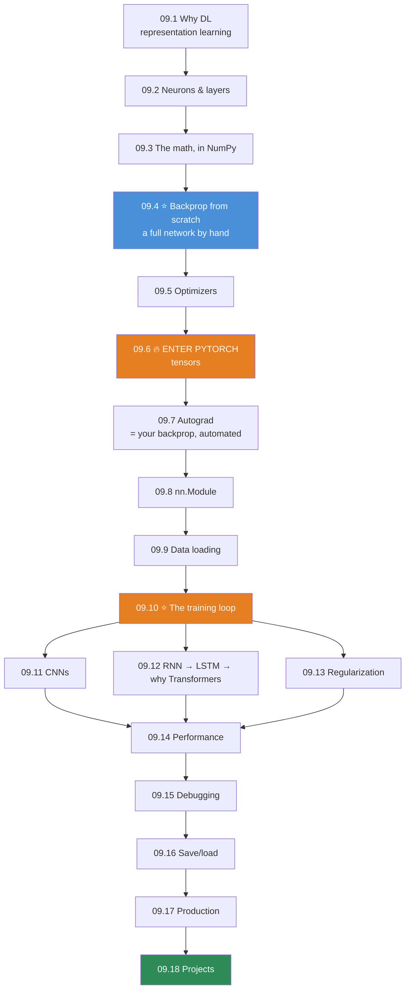

# Module 09 · Deep Learning Systems with PyTorch — Lessons

[⬅ Module home](../README.md) · [🗺 Roadmap](../../../ROADMAP.md) · [📚 Curriculum](../../../CURRICULUM.md)

> This is the map of Module 09. **We do not import `torch` until lesson 09.6.** First you build a neural network — forward pass, backprop, and an optimizer — **from scratch in NumPy**, so that when PyTorch finally appears, it is a *faster version of code you already wrote*, not magic.

---

## The rule of this module

> [!IMPORTANT]
> **You cannot debug what you cannot picture.**
>
> A deep learning framework is a leaky abstraction. When your loss goes to `NaN`, when your gradients vanish, when the model trains but won't learn — **the people who fix it are the ones who once wrote `loss.backward()` by hand.** This module makes you one of them.
>
> **The plan:** derive the math → **build it in NumPy** → *then* meet PyTorch → verify PyTorch against your from-scratch version → build production systems. The from-scratch network in lesson 09.4 is not a toy. It is the thing that makes `nn.Module` transparent.

This module cashes in **[Module 06](../../06-Mathematics/README.md)** completely: the [chain rule *is* backpropagation](../../06-Mathematics/weeks/06.4-calculus.md), [cross-entropy](../../06-Mathematics/weeks/06.8-information-theory.md) is the loss, [Adam](../../06-Mathematics/weeks/06.7-optimization.md) is the optimizer, [numerical stability](../../06-Mathematics/weeks/06.9-numerical-computing.md) is why your softmax subtracts the max. And it inherits **[Module 08](../../08-Machine-Learning/README.md)**'s discipline: evaluation, leakage, and deployment **do not change** because the model got deeper. *A Transformer with a leaked test set is exactly as worthless as a logistic regression with one.*

---

## Lessons

| # | Lesson | Section | Torch yet? |
|---|---|---|---|
| 09.1 | [Why Deep Learning?](09.1-why-deep-learning.md) | §1 representation learning; universal approximation | ❌ |
| 09.2 | [Neural Network Fundamentals](09.2-neural-network-fundamentals.md) | §2 neurons, weights, layers, forward propagation | ❌ |
| 09.3 | [The Mathematics of Neural Networks](09.3-math-of-neural-networks.md) | §3 affine transforms, activations, losses — in NumPy | ❌ |
| 09.4 | [Backpropagation from Scratch](09.4-backpropagation.md) | §4 the chain rule, computational graph, a full network by hand | ❌ |
| 09.5 | [Optimization](09.5-optimization.md) | §5 SGD, momentum, RMSProp, Adam, AdamW | ❌ |
| 09.6 | [PyTorch Fundamentals — Tensors](09.6-pytorch-tensors.md) | §6 tensors, devices, CUDA, broadcasting, memory | ✅ **enter torch** |
| 09.7 | [Autograd](09.7-autograd.md) | §7 dynamic graphs, `requires_grad`, `backward()`, `no_grad` |  ✅ |
| 09.8 | [Building Models with `nn.Module`](09.8-building-models.md) | §8 layers, parameters, Sequential, custom modules | ✅ |
| 09.9 | [Data Loading](09.9-data-loading.md) | §9 Dataset, DataLoader, batching, augmentation | ✅ |
| 09.10 | [The Training Loop](09.10-training-loop.md) | §10 train/val, checkpointing, logging, early stopping, scheduling | ✅ |
| 09.11 | [Convolutional Neural Networks](09.11-cnns.md) | §11 convolution, pooling, padding, stride, feature maps | ✅ |
| 09.12 | [Sequence Models — RNN, LSTM, GRU](09.12-sequence-models.md) | §12 recurrence, and why it led to Transformers | ✅ |
| 09.13 | [Regularization](09.13-regularization.md) | §13 dropout, batch norm, weight decay, augmentation | ✅ |
| 09.14 | [Performance Optimization](09.14-performance.md) | §14 mixed precision, gradient clipping, GPU utilization, profiling | ✅ |
| 09.15 | [Model Debugging](09.15-debugging.md) | §15 exploding/vanishing gradients, NaN, dead neurons, shapes | ✅ |
| 09.16 | [Saving & Loading Models](09.16-saving-loading.md) | §16 state_dict, checkpoints, reproducibility, experiment tracking | ✅ |
| 09.17 | [Production Deep Learning](09.17-production.md) | §17 inference, serving, latency/throughput, TorchScript, ONNX | ✅ |
| 09.18 | [Projects & Summary](09.18-projects-summary.md) | §18 seven projects + module consolidation | ✅ |

### Companion artifacts
- 🏋️ [Exercises](../exercises/) — math, tensor manipulation, autograd, implementation, debugging, performance
- 🧠 [Flashcards](../flashcards/deck.md) — spaced-repetition deck
- 📝 [Quiz](../quizzes/quiz-01.md) — self-assessment with answers
- 📄 [Cheat sheet](../cheat-sheets/dl-cheatsheet.md) — tensors, autograd, layers, training, debugging

---

## How the lessons build

**09.4 (backprop from scratch) and 09.10 (the training loop) are the two load-bearing lessons.** Everything before 09.4 exists to make backprop inevitable; everything after 09.10 is a variation on the loop you build there.

**Estimated time:** ~30 hours reading · ~16 hours projects · ~6 hours review.

---

## What carries over

| From | Where it lands |
|---|---|
| [06.4 Chain rule = backprop](../../06-Mathematics/weeks/06.4-calculus.md) | 09.4 — you'll implement exactly this |
| [06.7 Adam, momentum, SGD](../../06-Mathematics/weeks/06.7-optimization.md) | 09.5 — from scratch, then `torch.optim` |
| [06.8 Cross-entropy, softmax](../../06-Mathematics/weeks/06.8-information-theory.md) | 09.3, 09.10 — the loss and why it's fused |
| [06.9 Overflow, log-sum-exp](../../06-Mathematics/weeks/06.9-numerical-computing.md) | 09.15 — where `NaN` comes from |
| [06.10 Forward/backward/init](../../06-Mathematics/weeks/06.10-neural-network-math.md) | 09.2–09.4 — the algebra, now made a system |
| [06.11 Attention](../../06-Mathematics/weeks/06.11-transformer-math.md) | 09.12 — why RNNs lost to Transformers |
| [08.2 Bias–variance, learning curves](../../08-Machine-Learning/weeks/08.2-ml-workflow.md) | 09.13 — regularization, at scale |
| [08.12 Evaluation, thresholds](../../08-Machine-Learning/weeks/08.12-evaluation.md) | 09.10, 09.17 — metrics don't change |
| [08.17 Monitoring, drift](../../08-Machine-Learning/weeks/08.17-production-ml.md) | 09.17 — deployment doesn't change |

> [!TIP]
> **Get a GPU before lesson 09.11.** Lessons 09.1–09.10 run fine on a laptop CPU. From CNNs onward, you'll want a GPU — **Google Colab's free tier is enough** for every project in this module ([00.5 Development Environment](../../00-Orientation/weeks/00.5-development-environment.md)). You do not need to buy hardware to learn this.
