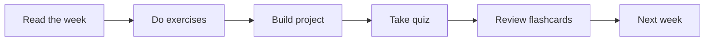

# Module 10 · NLP

[⬅ 09 · Deep Learning](../09-Deep-Learning/README.md) · [🏠 docs](../README.md) · [🗺 Roadmap](../../ROADMAP.md) · [11 · LLMs ➡](../11-LLMs/README.md)

> Language modeling and the Transformer architecture.

---

## Purpose

This module covers **NLP**. Language modeling and the Transformer architecture. It fits into the overall program as described in the [Roadmap](../../ROADMAP.md) and [Curriculum](../../CURRICULUM.md).

## What you'll learn

- Tokenization and text representation
- Embeddings and semantic similarity
- The attention mechanism from first principles
- Building a Transformer block

## 📖 Lessons (start here)

> ✅ **This module's content is written.** Work through the lessons in order via the [lesson index](weeks/README.md).

| # | Lesson | From scratch? |
|---|---|---|
| 10.1 | [Introduction to NLP](weeks/10.1-introduction-to-nlp.md) | — |
| 10.2 | [Text Processing](weeks/10.2-text-processing.md) | ✅ |
| 10.3 | [Text Representation — BoW & TF-IDF](weeks/10.3-text-representation.md) | ✅ |
| 10.4 | [Word Embeddings](weeks/10.4-word-embeddings.md) ⭐ | ✅ |
| 10.5 | [Sequence Models for NLP](weeks/10.5-sequence-models.md) | ✅ |
| 10.6 | [NLP Tasks](weeks/10.6-nlp-tasks.md) | — |
| 10.7 | [Attention — Built From Scratch](weeks/10.7-attention.md) ⭐⭐ | ✅ |
| 10.8 | [Sequence-to-Sequence Models](weeks/10.8-seq2seq.md) | ✅ |
| 10.9 | [Evaluation](weeks/10.9-evaluation.md) | — |
| 10.10 | [NLP Data](weeks/10.10-nlp-data.md) | — |
| 10.11 | [NLP with PyTorch](weeks/10.11-nlp-with-pytorch.md) | ✅ |
| 10.12 | [NLP with Modern Libraries](weeks/10.12-modern-libraries.md) | — |
| 10.13 | [NLP Production Systems](weeks/10.13-production.md) | — |
| 10.14 | [NLP Ethics & Safety](weeks/10.14-ethics-safety.md) | — |
| 10.15 | [Projects & Summary](weeks/10.15-projects-summary.md) | ✅ |

**Companion artifacts:** [Exercises](exercises/README.md) · [Quiz](quizzes/quiz-01.md) · [Flashcards](flashcards/deck.md) · [Cheat sheet](cheat-sheets/nlp-cheatsheet.md)

> [!IMPORTANT]
> **⭐ The rule of this module: every lesson is a better answer to one question — "how do I turn text into vectors without losing meaning?"**
>
> One-hot vectors can't tell "king" from "queen." Bag-of-words can't tell "dog bites man" from "man bites dog." **Embeddings** ([10.4](weeks/10.4-word-embeddings.md)) fix the first; **sequence models** ([10.5](weeks/10.5-sequence-models.md)) fix the second; **attention** ([10.7](weeks/10.7-attention.md)) fixes both at once and scales — which is the entire reason Transformers exist. You will **build attention by hand in NumPy** and verify it against PyTorch, so that [Module 11](../11-LLMs/README.md)'s Transformer is assembly of parts you already own.
>
> **And the discipline that carries through: deep learning added a new model, not a new discipline.** The [training loop](../09-Deep-Learning/weeks/09.10-training-loop.md), evaluation, and MLOps from Modules 08–09 transfer **unchanged** — TF-IDF + logistic regression is still a real baseline, and *data leakage in NLP is exactly as fatal as anywhere else.*

## How this module is organized

Content is delivered week by week. Each module uses the same subfolders:

| Folder | Contents |
|---|---|
| [`weeks/`](weeks/) | Weekly lesson content, one file per week (`week-01.md`, `week-02.md`, …). |
| [`diagrams/`](diagrams/) | Mermaid sources and exported diagram assets for this module. |
| [`exercises/`](exercises/) | Hands-on practice problems with solutions. |
| [`projects/`](projects/) | Buildable projects that apply this module's skills. |
| [`quizzes/`](quizzes/) | Self-assessment question banks with answer keys. |
| [`flashcards/`](flashcards/) | Spaced-repetition Q/A decks for active recall. |
| [`cheat-sheets/`](cheat-sheets/) | One-page quick references for this module. |
| [`references/`](references/) | Paper summaries and deep-dive notes. |

## Suggested study flow

## File & naming conventions

| Item | Convention | Example |
|---|---|---|
| Weekly lesson | `week-NN.md` | `weeks/week-01.md` |
| Exercise | `exercise-NN.md` (+ `solution-NN.*`) | `exercises/exercise-01.md` |
| Project | `project-NN/` folder with `README.md` | `projects/project-01/` |
| Quiz | `quiz-NN.md` (+ `answers-NN.md`) | `quizzes/quiz-01.md` |
| Flashcards | `deck.md` | `flashcards/deck.md` |
| Diagram | `topic.mmd` / `topic.png` | `diagrams/attention.mmd` |

## Markdown conventions

This file follows the repository Markdown standards — see [CONTRIBUTING.md](../../CONTRIBUTING.md): one H1 per file, tables over prose, GitHub callouts (`> [!NOTE]`), fenced code blocks with a language, Mermaid for diagrams, and relative internal links.

## Related modules

- [Deep Learning](../09-Deep-Learning/README.md)
- [LLMs](../11-LLMs/README.md)

---

## Navigation

| Direction | Link |
|---|---|
| ⬆ Parent | [docs/](../README.md) |
| ⬅ Previous | [⬅ 09 · Deep Learning](../09-Deep-Learning/README.md) |
| ➡ Next | [11 · LLMs ➡](../11-LLMs/README.md) |
| 🗺 Roadmap | [ROADMAP.md](../../ROADMAP.md) |
| 📚 Curriculum | [CURRICULUM.md](../../CURRICULUM.md) |
| 🏠 Repo root | [README.md](../../README.md) |
