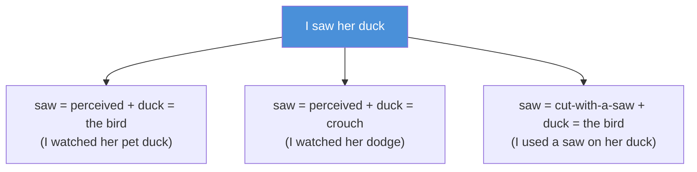
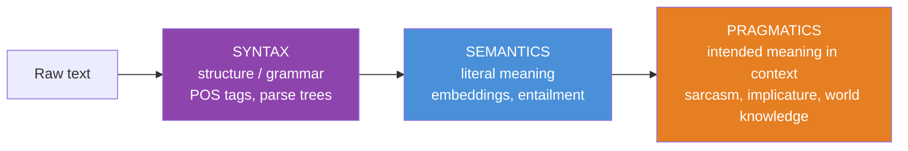
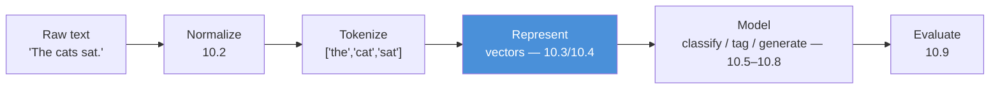

# 10.1 · Introduction to NLP — Why Language Is Hard

[🏠 Module 10](../README.md) · [📖 Lessons](README.md) · [➡ 10.2 Text Processing](10.2-text-processing.md)

> **The lesson in one line:** Human language is ambiguous, contextual, compositional, and infinite — and every one of those properties is a wall that structured data never made you climb.

---

## 🎯 Learning objectives

- Define NLP as the discipline of turning **unstructured language into computable structure**.
- Name the four properties that make language hard: **ambiguity, context-dependence, compositionality, and the long tail**.
- Distinguish **syntax, semantics, and pragmatics** — and know which one each NLP technique actually touches.
- Explain, concretely, why the tools from [Module 08](../../08-Machine-Learning/README.md) (which assumed a clean feature matrix) don't apply until you've *created* that matrix.

## ✅ Prerequisites

- [Module 09](../../09-Deep-Learning/README.md) in full — you'll lean on embeddings, sequence models, and the training loop.
- [Module 08 · evaluation](../../08-Machine-Learning/weeks/08.12-evaluation.md) — precision/recall/F1 carry over unchanged.

---

## 🧠 Mental model

> [!IMPORTANT]
> **A machine-learning model is a function from vectors to vectors. Language is not vectors. NLP is the entire discipline of bridging that gap — and everything hard about NLP lives in the bridge, not in the model.**

In [Module 08](../../08-Machine-Learning/README.md) the data arrived as a table: rows of examples, columns of numbers. The hard part was choosing a model. In NLP **the table does not exist yet.** You are handed `"The bank raised rates."` and you must, somehow, produce a vector — and that vector must preserve enough of the sentence's *meaning* that a downstream model can do its job.

That is the whole subject. Tokenization, embeddings, attention — they are all answers to one question:

**How do I turn this string into numbers without throwing away what it means?**

Hold that sentence. It is the spine of all fifteen lessons.

---

## Why language is genuinely hard

Structured data is *designed* to be computed on. Language evolved to be spoken between humans who share a world model, a context, and a lifetime of priors. Four properties fall out of that, and each one breaks a naive approach.

### 1. Ambiguity — the same string means different things



One five-word sentence, three grammatical parses, and *you* resolved it instantly using context you weren't aware of using. Ambiguity is not an edge case in language; it is the default. It appears at every level:

| Level | Example | The ambiguity |
|---|---|---|
| **Lexical** | "bank" | river edge or financial institution? |
| **Syntactic** | "I saw the man with the telescope" | who has the telescope? |
| **Referential** | "The trophy didn't fit in the suitcase because *it* was too big" | what is "it"? (the trophy) |
| **Scope** | "Every student read a book" | one book, or one each? |

> [!NOTE]
> That referential example is a **Winograd schema**. Swap "big" for "small" and "it" now refers to the *suitcase*. Resolving it requires knowing that big things don't fit in small containers — **world knowledge, not grammar.** For decades this was considered near-impossible; large language models mostly solve it now, which is a large part of why they felt like a step change.

### 2. Context-dependence — meaning is not in the word

The word "it" has no meaning on its own. "Bank" has no *single* meaning. A word's meaning is a function of the words around it — which is exactly why the great leap of this module ([embeddings, 10.4](10.4-word-embeddings.md), then [contextual embeddings via attention, 10.7](10.7-attention.md)) is about representing a word *in context*, not in isolation.

### 3. Compositionality — infinite meaning from finite parts

You have never seen the sentence "The purple algorithm sneezed quietly at the committee," yet you understood it. Language is **generative**: a finite vocabulary and a finite grammar produce infinitely many valid sentences. No lookup table can enumerate them. This is why NLP must *generalize* — and why the from-scratch statistical methods of [10.3](10.3-text-representation.md) eventually give way to models that learn compositional structure.

### 4. The long tail — Zipf's law

Word frequencies follow a brutal power law: the most common word ("the") appears about twice as often as the second, three times as often as the third, and so on.

> **[FIGURE: Zipf's law.** A log-log plot of word rank (x) vs frequency (y) forming a near-straight downward line. Annotation: the top ~100 words cover ~50% of all tokens; the millions of rare words in the tail each appear once or twice ("hapax legomena"). Caption: "Half your text is a hundred words; the other half is a near-infinite tail you'll never have enough data for."**]

The consequence: no matter how much text you collect, at inference time you *will* meet words you never saw in training. Every serious NLP system needs an answer for the unseen — the origin of **subword tokenization** ([10.2](10.2-text-processing.md), [10.12](10.12-modern-libraries.md)).

---

## The three layers: syntax, semantics, pragmatics

A useful map of *what* you're trying to extract. Most NLP techniques operate on one layer and are blind to the others.



| Layer | Question | Example technique | What it can't do |
|---|---|---|---|
| **Syntax** | Is it grammatically well-formed? | POS tagging, dependency parsing ([10.6](10.6-nlp-tasks.md)) | knows "colorless green ideas sleep furiously" is *grammatical* but not that it's *meaningless* |
| **Semantics** | What does it literally mean? | embeddings ([10.4](10.4-word-embeddings.md)), entailment | knows "it's raining" ≈ "there is precipitation" but not that you're implying *bring an umbrella* |
| **Pragmatics** | What did the speaker *intend*? | requires world knowledge + context | "Can you pass the salt?" is a request, not a yes/no question about your abilities |

> [!TIP]
> Classical NLP fought its way up this ladder one rung at a time, with a separate hand-built system per rung. The reason LLMs felt like magic is that a single next-token objective, trained on enough text, learns all three layers *jointly* — pragmatics included. This module builds the rungs so that magic becomes mechanism.

---

## Mathematical intuition

There is no equation for "meaning." But there is a working hypothesis that the entire field runs on — the **distributional hypothesis**:

> **"You shall know a word by the company it keeps."** — J.R. Firth, 1957

Formally: a word's meaning can be approximated by the *distribution* of contexts it appears in. Two words are similar to the degree that they appear in similar contexts. "Cat" and "dog" both follow "my pet" and precede "barked/purred/ran" — so they end up close.

This one hypothesis is what makes NLP *tractable*. It converts an unanswerable philosophical question ("what does 'dog' mean?") into a countable statistical one ("what words co-occur with 'dog'?"). Every representation from [TF-IDF](10.3-text-representation.md) to [Word2Vec](10.4-word-embeddings.md) to attention is a different way of cashing in that hypothesis. Keep it in view — it is the theoretical bedrock under all fifteen lessons.

---

## Internal implementation — the NLP pipeline

Almost every classical NLP system is the same pipeline. You will build each stage in this module.



The center of gravity is **stage D — representation.** Get the vector wrong and no model downstream can recover. That's why four of the first seven lessons are about representation.

---

## 💻 A first taste: the same task, three eras

To orient you, here is sentiment classification of one sentence, sketched three ways — the arc of this module in miniature.

```python
sentence = "this movie was not good"

# ERA 1 — Bag of Words (10.3): counts, no order. "not good" ≈ "good not".
#   A logistic-regression baseline. Cheap, strong, order-blind.
bow = {"this": 1, "movie": 1, "was": 1, "not": 1, "good": 1}
#   ⚠️ "not good" and "good, not bad" have overlapping words → the model struggles with negation.

# ERA 2 — Embeddings + LSTM (10.4, 10.5): dense vectors, read in order.
#   The LSTM sees "not" *before* "good" and can learn to flip the sentiment.

# ERA 3 — Attention / Transformer (10.7 → Module 11): every word attends to every other.
#   "good" directly attends to "not" regardless of distance — negation solved structurally.
```

> [!IMPORTANT]
> **Notice what improves and what stays fixed.** The *task* (is this positive or negative?), the *evaluation* (F1 on a held-out set), and the *engineering* (a pipeline, a training loop, monitoring) are constant. What changes across eras is **only the representation and how it flows through the model.** That is the one axis this module moves along.

---

## 🏭 Production examples

| System | The NLP underneath | Layer it leans on |
|---|---|---|
| **Spam filter** | text classification on BoW/TF-IDF + logistic regression — *still* a strong production baseline | semantics (shallow) |
| **Search / retrieval** | embeddings + nearest-neighbor ([10.4](10.4-word-embeddings.md), → [RAG, Module 13](../../13-RAG/README.md)) | semantics |
| **Voice assistant** | intent classification + NER ([10.6](10.6-nlp-tasks.md)) | syntax + pragmatics |
| **Machine translation** | seq2seq → Transformer ([10.8](10.8-seq2seq.md)) | all three |
| **Autocomplete / LLMs** | next-token language modeling (→ [Module 11](../../11-LLMs/README.md)) | all three, jointly |

---

## ⚡ Performance considerations

- **Text is variable-length**, unlike the fixed-width rows of Module 08. Every batching, padding, and memory decision in NLP flows from this. ([Padding & packing, 09.12](../../09-Deep-Learning/weeks/09.12-sequence-models.md) — you already met it.)
- **Vocabulary size is a first-class cost.** A one-hot vector over a 100k-word vocabulary is a 100k-dimensional vector that is 99.999% zeros. Sparse representations ([10.3](10.3-text-representation.md)) are big and slow; the move to dense embeddings ([10.4](10.4-word-embeddings.md)) is partly a *performance* argument, not only an accuracy one.

## 🔒 Security & privacy considerations

> [!CAUTION]
> **Text is the most privacy-dense data type you will handle.** A table of numbers is abstract; a paragraph of text can contain names, addresses, medical details, and opinions — often *incidentally*, in fields nobody flagged as sensitive. Two consequences that recur through this module:
> - **PII hides in free text.** A "comments" column looks harmless in a schema and is a GDPR liability in practice. NER ([10.6](10.6-nlp-tasks.md)) is often deployed *specifically* to find and redact it ([10.14](10.14-ethics-safety.md)).
> - **Language encodes the biases of the people who wrote it.** Because meaning is learned from co-occurrence (the distributional hypothesis), a model trained on human text inherits human prejudice by construction — "doctor" ends up near "he," "nurse" near "she." This is not a bug you can patch after the fact; it is baked into the representation ([10.4](10.4-word-embeddings.md), [10.14](10.14-ethics-safety.md)).

---

## 🚫 Common mistakes

| Mistake | Why it's wrong |
|---|---|
| **Treating text like tabular data** | There is no feature matrix until you build one; the representation *is* the hard part. |
| **Assuming preprocessing is neutral** | Every normalization step is lossy — lowercasing destroys "US" vs "us" ([10.2](10.2-text-processing.md)). |
| **Ignoring the long tail** | "It worked on my test set" — until production hands you a word you never saw. |
| **Confusing syntax with meaning** | A grammatically perfect sentence can be nonsense; a typo-ridden one can be crystal clear. |
| **Expecting one metric to capture "good language"** | See [10.9](10.9-evaluation.md): BLEU and ROUGE are useful *and* systematically misleading. |

## ✅ Best practices

- **Start with the strongest simple baseline** ([TF-IDF + logistic regression](10.3-text-representation.md)) before anything neural. It's fast, interpretable, and shockingly hard to beat on many tasks.
- **Look at your data by hand** — read 50 raw examples before writing any code. NLP data is messy in ways summary statistics hide (encoding errors, mixed languages, HTML fragments).
- **Decide what layer your task needs.** Sentiment is semantics; grammar-checking is syntax; sarcasm detection is pragmatics and will humble you.
- **Name your privacy surface up front.** Assume every free-text field contains PII until you've proven otherwise.

---

## 🏋️ Exercises

1. **Ambiguity hunt.** For each sentence, write out every distinct meaning and name the *type* of ambiguity (lexical/syntactic/referential/scope): (a) "Visiting relatives can be boring." (b) "The chicken is ready to eat." (c) "I told the mechanic I would pay him when he fixed my car, and he did."
2. **Layer classification.** For sentiment analysis, sarcasm detection, POS tagging, and question answering, state which of syntax/semantics/pragmatics each most depends on. Defend the hard cases.
3. **Distributional hypothesis by hand.** Take three short paragraphs. For the words "coffee," "tea," and "laptop," list every word within ±2 positions. Which two words share more context neighbors? Does that match your intuition of their similarity?
4. **The long tail.** Tokenize a book chapter (any text you have). Plot rank vs frequency on log-log axes. Roughly how many distinct words cover 50% of all tokens? How many appear exactly once?
5. **Break BoW.** Find three sentence pairs that have *identical* bag-of-words but *opposite* meaning. (Hint: negation, word order, and pronoun reference are your friends.)

---

## 🛠️ Mini project — "The Meaning-Blindness Demo"

**Goal:** viscerally demonstrate what each representation throws away, before you learn to fix it.

**Requirements**
- Take 20 sentence pairs where word *order* or *negation* flips the meaning ("dog bites man" / "man bites dog"; "not bad" / "bad, not good").
- Represent each with (a) bag-of-words counts. Compute cosine similarity within each pair.
- **Deliverable:** a table showing that BoW rates these opposite-meaning pairs as nearly identical — a number that makes the problem concrete.
- Write a one-paragraph prediction: which lesson's technique ([10.4](10.4-word-embeddings.md)? [10.5](10.5-sequence-models.md)? [10.7](10.7-attention.md)?) will fix each failure, and why.

**Folder structure**
```
meaning-blindness/
├── pairs.txt          # 20 opposite-meaning sentence pairs
├── bow_similarity.py  # counts + cosine
└── findings.md        # the table + your predictions
```

**Future improvements:** revisit this project after [10.4](10.4-word-embeddings.md), [10.5](10.5-sequence-models.md), and [10.7](10.7-attention.md); re-run each pair and watch the similarities finally reflect meaning. This project is your *before* photo.

---

## 📄 Cheat sheet

| Concept | One line |
|---|---|
| **NLP** | turning unstructured language into computable structure |
| **The core problem** | text → vectors without losing meaning |
| **Ambiguity** | one string, many meanings — the *default*, not the exception |
| **Distributional hypothesis** | ⭐ "know a word by the company it keeps" — the field's bedrock |
| **Syntax / semantics / pragmatics** | structure / literal meaning / intended meaning |
| **Zipf / long tail** | a few words dominate; the tail is infinite → you'll always meet unseen words |
| **Compositionality** | infinite sentences from finite parts → must generalize, can't memorize |

## 🎴 Flashcards

- **What is the one problem all of NLP is solving?** → Turning text into vectors without discarding meaning.
- **State the distributional hypothesis.** → A word's meaning is approximated by the distribution of contexts it appears in ("company it keeps").
- **⭐ Why is language hard, in four words?** → Ambiguity, context, compositionality, long-tail.
- **Syntax vs semantics vs pragmatics?** → Grammar / literal meaning / intended meaning in context.
- **Why can't a lookup table do NLP?** → Language is compositional — infinitely many valid sentences; you must generalize.
- **Why does every NLP system need an "unknown word" plan?** → Zipf's law guarantees you meet unseen words at inference.
- **Where does bias in NLP come from?** → The distributional hypothesis: models learn meaning from human co-occurrence, inheriting human prejudice.

## 💬 Interview questions

1. Why can't you apply a standard classifier directly to raw text? What has to happen first, and why is *that* the hard part?
2. Give an example of a sentence that is syntactically valid but semantically meaningless, and one that is semantically clear but syntactically broken.
3. What is the distributional hypothesis, and why is it the foundation of word embeddings?
4. Explain how Zipf's law forces design decisions in a production NLP system.
5. A stakeholder says "just lowercase everything and remove punctuation." Give two concrete cases where that destroys the signal.

---

## 📝 Summary

- **NLP is the discipline of representation:** a model sees only the vectors you turn text into, and every result is bounded by that choice.
- Language is hard because it is **ambiguous, context-dependent, compositional, and long-tailed** — properties structured data doesn't have.
- The field runs on the **distributional hypothesis**: meaning ≈ the company a word keeps. This turns an unanswerable question into a countable one.
- Techniques operate on **syntax, semantics, or pragmatics**; classical NLP climbed that ladder one rung at a time, while modern models learn all three jointly.
- Everything ahead — tokenization, embeddings, sequence models, attention — is a better answer to **"text → vectors without losing meaning."**

## 📚 References

1. **Jurafsky & Martin — _Speech and Language Processing_ (3rd ed., free online).** ⭐⭐ The definitive NLP textbook; chapters 1–2 for this lesson.
2. **Firth, J.R. (1957) — _A synopsis of linguistic theory_.** The origin of the distributional hypothesis.
3. **Levy & Goldberg (2014) — _Linguistic Regularities in Sparse and Explicit Word Representations_.** Makes the distributional hypothesis quantitative.
4. **Manning & Schütze — _Foundations of Statistical NLP_.** The classical-era reference.

---

## 🧭 Navigation

| Direction | Link |
|---|---|
| ⬅ Previous | [Module 09 · Deep Learning](../../09-Deep-Learning/README.md) |
| ➡ Next | [10.2 · Text Processing](10.2-text-processing.md) |
| 🏠 Module | [Module 10](../README.md) |
| 📖 Lessons | [Lesson index](README.md) |
