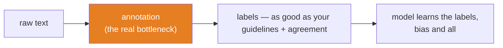
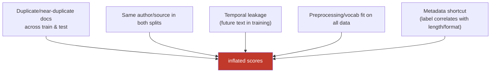
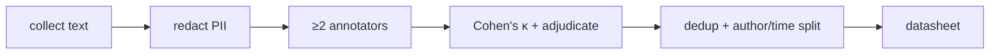

# 10.10 · NLP Data — Annotation, Label Quality, Bias, Leakage

[⬅ 10.9 Evaluation](10.9-evaluation.md) · [🏠 Module 10](../README.md) · [➡ 10.11 NLP with PyTorch](10.11-nlp-with-pytorch.md)

> **The lesson in one line:** In NLP the model is rarely the bottleneck — the labels are; a mediocre model on clean, unbiased, leak-free data beats a great model on the opposite, every time.

---

## 🎯 Learning objectives

- Understand why **dataset construction and annotation** dominate NLP outcomes.
- Measure and improve **label quality** (inter-annotator agreement, adjudication).
- Recognize NLP-specific **class imbalance, data leakage, and bias** — and how they differ from tabular versions.
- Handle the **privacy** minefield of text data (PII in free text).

## ✅ Prerequisites

- [Module 07 · data](../../07-Data-Analysis/README.md) — cleaning, leakage, quality; this lesson is its NLP specialization.
- [10.4 embedding bias](10.4-word-embeddings.md), [08.13 leakage](../../08-Machine-Learning/weeks/08.13-cross-validation.md).

---

## 🧠 Mental model

> [!IMPORTANT]
> **Your model learns exactly what your labels teach it — including every inconsistency, bias, and shortcut baked into how the data was collected and annotated.** In [Module 07](../../07-Data-Analysis/README.md) you learned "garbage in, garbage out" for tabular data. In NLP it's sharper: language is subjective, so *the labels themselves are a modeling decision*. Two reasonable annotators disagree on whether a tweet is "offensive." The model can't be more consistent than the humans who taught it.

The uncomfortable reframe: **in NLP, most of the engineering leverage is in the data, not the model.** Swapping BiLSTM for a Transformer might buy you 2 F1 points; fixing 15% mislabeled data buys you 10. The [error-analysis discipline of 08.2](../../08-Machine-Learning/weeks/08.2-ml-workflow.md) — read your errors by hand — is where NLP wins are actually found.



---

## Dataset construction & annotation

Labeled NLP data is expensive because it needs *humans reading text*. The pipeline:

1. **Write annotation guidelines.** The single highest-leverage artifact. Ambiguous guidelines → inconsistent labels → a ceiling on model quality. "Label this tweet as toxic" is useless; "toxic = a direct threat, slur, or dehumanizing statement targeting a person or group; sarcasm is not toxic unless..." is a real spec.
2. **Multiple annotators per example.** One annotator = no way to catch errors or measure reliability.
3. **Measure agreement, adjudicate disagreements.** (Below.)
4. **Iterate the guidelines** as edge cases surface.

> [!TIP]
> **The guideline document is where label quality is won or lost.** Every disagreement between annotators is either a genuinely ambiguous example (fine — the world is ambiguous) or a gap in your guidelines (fixable). Treat annotation as software: the guidelines are the spec, disagreements are bug reports, and you version both.

---

## Label quality — measure it

Because language is subjective, you must *quantify* how reliable your labels are. The standard tool is **inter-annotator agreement (IAA)**, and the right metric is **Cohen's κ (kappa)** — not raw agreement.

Raw agreement is misleading because annotators agree *by chance* sometimes (on a binary task, ~50% for free). Kappa corrects for chance:

$$\kappa = \frac{p_o - p_e}{1 - p_e}$$

where $p_o$ = observed agreement, $p_e$ = agreement expected by chance. κ = 1 is perfect, κ = 0 is chance-level.

| κ range | Interpretation |
|---|---|
| < 0.20 | poor — your task or guidelines are broken |
| 0.20–0.40 | fair |
| 0.40–0.60 | moderate |
| 0.60–0.80 | substantial — usable |
| > 0.80 | near-perfect — rare for subjective tasks |

> [!IMPORTANT]
> **Inter-annotator agreement is the ceiling on your model's achievable accuracy.** If two trained humans agree only 70% of the time on "is this sarcastic," a model *cannot* meaningfully exceed 70% — the remaining 30% is genuine ambiguity with no ground truth. Reporting 85% accuracy on a task with κ=0.5 is a red flag: you're either overfitting label noise or your test set is contaminated. **Always measure and report IAA; it tells you what "good" even means for your task.**

**Adjudication:** for disagreements, either a senior annotator decides, or you use majority vote, or you *keep* the disagreement as a signal (some tasks have legitimately soft labels — "40% of readers found this offensive" is more honest than a forced binary).

---

## Class imbalance in NLP

Imbalance is the norm, not the exception: spam is rare, toxic comments are rare, the entity you care about is rare, the positive class in medical text is rare. This is the [08.12 imbalance problem](../../08-Machine-Learning/weeks/08.12-evaluation.md), and the same rules apply — **use F1/PR-AUC, not accuracy; tune the threshold on cost** — plus NLP-specific handling:

| Approach | NLP note |
|---|---|
| **Resampling** | oversample the rare class or downsample the frequent one |
| **Class weights** | weight the loss toward the rare class ([09.3](../../09-Deep-Learning/weeks/09.3-math-of-neural-networks.md)) |
| **Data augmentation** | back-translation, synonym swap, paraphrase — text-specific augmentation |
| **⚠️ Skepticism of SMOTE** | interpolating between *text embeddings* rarely yields valid sentences; be careful ([07.6](../../07-Data-Analysis/weeks/07.6-feature-engineering.md)) |

> [!TIP]
> **Text augmentation is genuinely useful and genuinely dangerous.** Back-translation (translate to French and back) creates natural paraphrases. Synonym replacement can *flip the label* ("good" → "great" is safe; "sick" → "ill" changes meaning in slang). Always spot-check augmented examples — automated augmentation that corrupts labels is worse than no augmentation.

---

## Data leakage — the NLP flavors

Leakage ([08.13](../../08-Machine-Learning/weeks/08.13-cross-validation.md), [07.12](../../07-Data-Analysis/weeks/07.12-real-case-studies.md)) is as fatal in NLP and has extra hiding places:



| Leak | NLP-specific example | Fix |
|---|---|---|
| **Duplicate documents** | scraped corpora are full of reposts, quotes, boilerplate — the *same* text in train and test | dedup (exact + near-dup) **before** splitting |
| **Author/source leakage** | a reviewer's style in both splits; a model learns the author, not the sentiment | split by author/source ([GroupKFold, 08.13](../../08-Machine-Learning/weeks/08.13-cross-validation.md)) |
| **Temporal leakage** | training on text written after the test period (topics, slang, events bleed in) | time-based split |
| **Vocabulary/TF-IDF fit on all data** | IDF computed over train+test ([10.3](10.3-text-representation.md)) | fit on train only |
| **Metadata shortcut** | positive reviews happen to be longer; the model learns length, not sentiment | check for spurious correlates; balance them |

> [!CAUTION]
> **Near-duplicate leakage is the silent killer of NLP benchmarks.** Web-scraped datasets contain the same passage many times (reposts, syndication, quotation). If exact or fuzzy duplicates land in both train and test, your test score is partly measuring *memorization*. **Deduplicate before splitting** — and at LLM scale, this is [benchmark contamination (10.9)](10.9-evaluation.md), which has invalidated many published results.

---

## Bias in NLP data

Bias in NLP is not a corner case — it is the **default**, because language *is* the record of human society, prejudice included. It enters at every stage:

| Source | Example |
|---|---|
| **Sampling bias** | training on Twitter → a model that thinks all language is short, informal, English |
| **Label bias** | annotators rate African-American English as "more toxic" (documented) |
| **Historical bias** | résumé data reflects past hiring discrimination → the model reproduces it |
| **Representation bias** | embeddings encode "he→engineer, she→nurse" ([10.4](10.4-word-embeddings.md)) |

> [!IMPORTANT]
> **NLP bias compounds: biased data → biased labels → biased embeddings → biased model → biased decisions that generate more biased data.** It's a feedback loop ([08.17](../../08-Machine-Learning/weeks/08.17-production-ml.md)). You cannot fully remove it — language carries it inherently — but you can **measure** it (disaggregate metrics by demographic group), **document** it (datasheets, model cards), and **mitigate** it (balanced sampling, debiasing, human review of consequential decisions). The full treatment is [10.14](10.14-ethics-safety.md); the point here is that **bias is a data problem first**, and it's your job to catch it before the model amplifies it.

---

## 🔒 Security & privacy considerations

> [!CAUTION]
> **Text data is a PII minefield — this is the highest-stakes section of the lesson.**
> - **PII hides in free text** where no schema flags it: names, addresses, phone numbers, medical details, and account numbers appear inside "comments," "notes," and "message" fields. You *must* scan and redact — NER ([10.6](10.6-nlp-tasks.md)) is the standard tool — before the text enters training or logs.
> - **Consent and provenance.** Web-scraped text was written by people who didn't consent to train your model. Copyright, GDPR "right to be forgotten," and terms-of-service all apply. Track dataset provenance and licensing ([07.11 dataset versioning](../../07-Data-Analysis/weeks/07.11-reusable-pipelines.md)).
> - **Annotators see raw data.** Your labeling workforce reads real user text — a privacy exposure requiring PII redaction *before* annotation, and care for annotator wellbeing when the content is toxic (content moderation is psychologically hazardous work).
> - **Memorization = delayed leakage.** Models trained on PII can regurgitate it ([10.5](10.5-sequence-models.md), [10.14](10.14-ethics-safety.md)). The only robust defense is not putting PII in the training set — redact at ingestion, per [07.x pseudonymization](../../07-Data-Analysis/weeks/07.9-data-quality.md).

## ⚡ Performance considerations

- **Deduplication is a preprocessing cost worth paying** — MinHash/LSH for near-duplicate detection scales to huge corpora and prevents both leakage and wasted compute training on repeats.
- **Annotation is the schedule bottleneck**, not training — active learning (label the examples the model is most uncertain about) gets more label-value per annotator-hour.
- **Store raw + processed separately** ([10.2](10.2-text-processing.md)) so re-annotation doesn't require re-collection.

## 🚫 Common mistakes

| Mistake | Consequence |
|---|---|
| **Single annotator, no IAA** | no way to know if labels are reliable; a false quality ceiling |
| **Not deduplicating before splitting** | near-duplicate leakage → inflated, unreproducible scores |
| **Splitting randomly when author/time matters** | author/temporal leakage |
| **Ignoring PII in free-text fields** | GDPR/HIPAA violation; downstream memorization |
| **Reporting accuracy above the IAA ceiling** | overfitting label noise or hidden leakage |
| **Blind text augmentation** | label-flipping paraphrases corrupt the data |

## ✅ Best practices

- **Write and version annotation guidelines**; treat disagreements as bug reports.
- **Use ≥2 annotators; measure Cohen's κ; report it** as the quality ceiling.
- **Deduplicate (exact + near) before splitting**; split by **author/source/time** when those leak.
- **Redact PII at ingestion**, before annotation, training, or logging.
- **Disaggregate metrics by group** to surface bias ([10.14](10.14-ethics-safety.md)); publish a datasheet/model card.
- **Read your errors by hand** ([08.2](../../08-Machine-Learning/weeks/08.2-ml-workflow.md)) — the biggest NLP wins hide in the labels, not the model.

## 🏋️ Exercises

1. **Measure agreement.** Have two people (or two labeling passes) annotate 50 tweets for sentiment. Compute raw agreement and Cohen's κ. Interpret the gap. What's your model's achievable ceiling?
2. **Find the leak.** Take a public text-classification dataset. Search for exact and near-duplicate documents across the train/test split. Report how many, and estimate the score inflation.
3. **Guideline iteration.** Write a one-paragraph "is this a complaint?" guideline. Have two people label 30 support messages. For every disagreement, decide: ambiguous example or guideline gap? Revise the guideline.
4. **PII hunt.** Run an NER model over a "free-text comments" column. Count how many rows contain names, emails, or phone numbers. Write the redaction policy you'd deploy.
5. **Bias audit.** Split a toxicity dataset's model errors by dialect or demographic markers (where available/ethical). Are false-positive rates equal across groups? Document what you find.
6. **Augmentation check.** Back-translate 20 sentiment examples (EN→FR→EN). Spot-check: how many changed meaning or flipped the label?

## 🛠️ Mini project — "A Labeled Dataset, Done Right"

**Goal:** construct a small but *rigorous* labeled NLP dataset and produce the quality artifacts a real project ships.

**Requirements**
- Pick a subjective task (sentiment, toxicity, or complaint detection) and ~300 texts.
- Write **versioned annotation guidelines**; have ≥2 annotators label all examples.
- Compute **Cohen's κ**; adjudicate disagreements; report the achievable ceiling.
- **Deduplicate** and split by **author/time** to avoid leakage.
- **Redact PII** at ingestion.
- Produce a **datasheet** ([documenting collection, bias, and limitations](10.14-ethics-safety.md)).

**Folder structure**
```
dataset-done-right/
├── guidelines.md      # versioned annotation spec
├── annotate.py        # collect multi-annotator labels
├── agreement.py       # Cohen's κ, disagreement report
├── dedup_split.py     # near-dup removal + author/time split
├── redact.py          # PII redaction (NER)
├── datasheet.md       # provenance, bias, limitations
└── data/
```

**Architecture diagram**


**Testing:** assert no document appears in two splits; assert no author spans splits; assert redaction removes flagged PII; assert κ is reported.
**Evaluation:** the dataset *is* the deliverable; validate by training a baseline and checking its accuracy sits at/below the IAA ceiling (a sanity check, not a failure).
**Future improvements:** add active learning to prioritize uncertain examples for the next annotation round; add a bias audit disaggregated by available metadata.

## 📄 Cheat sheet

| Concept | One line |
|---|---|
| **⭐ The bottleneck** | labels, not the model — most NLP leverage is in the data |
| **Annotation guidelines** | the spec; disagreements are bug reports |
| **⭐ Inter-annotator agreement** | Cohen's κ (chance-corrected); the **ceiling** on model accuracy |
| **Class imbalance** | the norm → F1/PR-AUC, class weights, careful augmentation |
| **⭐ Near-duplicate leakage** | dedup **before** splitting; the silent benchmark killer |
| **Author/temporal leakage** | split by author/source/time, not randomly |
| **⭐ Bias** | the default in language data; measure (disaggregate), document, mitigate |
| **⭐ PII in free text** | redact at ingestion; the highest-stakes risk |

## 🎴 Flashcards

- **⭐ What's the real bottleneck in NLP?** → Label quality, not the model — clean, unbiased, leak-free data beats a better model on worse data.
- **What is inter-annotator agreement and why Cohen's κ?** → How consistently annotators label; κ corrects for chance agreement (raw agreement overstates reliability).
- **⭐ Why is IAA a ceiling on model accuracy?** → If trained humans only agree X%, the remaining disagreement is genuine ambiguity with no ground truth to learn.
- **What is near-duplicate leakage?** → The same/similar document in train and test → the score partly measures memorization; dedup before splitting.
- **Why split by author or time?** → Random splits let the model learn the author/period instead of the task (author/temporal leakage).
- **⭐ Where does NLP bias come from?** → Every stage — sampling, labeling, history, embeddings — and it compounds into a feedback loop.
- **Why is text a PII minefield?** → PII hides in unstructured free-text fields no schema flags; redact at ingestion before training/logging.

## 💬 Interview questions

1. Why is annotation quality often more important than model choice in NLP? How do you measure it?
2. What is inter-annotator agreement, and why does it bound achievable model accuracy?
3. Name three NLP-specific forms of data leakage and how to prevent each.
4. How does bias enter an NLP dataset, and why can't you fully remove it? What can you do?
5. How do you handle PII in a free-text training corpus, end to end?
6. Your model reports 90% accuracy on a task where two annotators agree only 65% of the time. What's your reaction?

## 📝 Summary

- **In NLP the labels are the bottleneck** — most engineering leverage is in dataset construction, annotation, and cleaning, not model architecture.
- **Measure label quality with inter-annotator agreement (Cohen's κ)**; it's the **ceiling** on achievable accuracy and the honest definition of "good" for subjective tasks.
- **Class imbalance is the norm** — use F1/PR-AUC and careful (label-preserving) augmentation.
- **Leakage has NLP-specific forms** — near-duplicates, author, and temporal — so **dedup and split by author/time** before training.
- **Bias is the default in language data**, compounding across the pipeline; measure it (disaggregated metrics), document it (datasheets), and mitigate it.
- **Text is a PII minefield** — redact at ingestion, before annotation, training, and logging.

## 📚 References

1. **Gebru et al. (2018) — _Datasheets for Datasets_.** ⭐ The standard for documenting dataset provenance and bias.
2. **Artstein & Poesio (2008) — _Inter-Coder Agreement for Computational Linguistics_.** ⭐ The definitive IAA reference.
3. **Sap et al. (2019) — _The Risk of Racial Bias in Hate Speech Detection_.** Documented label bias against dialects.
4. **Bender & Friedman (2018) — _Data Statements for NLP_.** Documenting NLP data for bias/transparency.
5. **Lee et al. (2022) — _Deduplicating Training Data Makes Language Models Better_.** ⭐ Why near-duplicate removal matters at scale.
6. **[Module 07 · Data Analysis](../../07-Data-Analysis/README.md).** Your own foundation for cleaning, quality, and leakage.

---

## 🧭 Navigation

| Direction | Link |
|---|---|
| ⬅ Previous | [10.9 · Evaluation](10.9-evaluation.md) |
| ➡ Next | [10.11 · NLP with PyTorch](10.11-nlp-with-pytorch.md) |
| 🏠 Module | [Module 10](../README.md) |
| 📖 Lessons | [Lesson index](README.md) |
