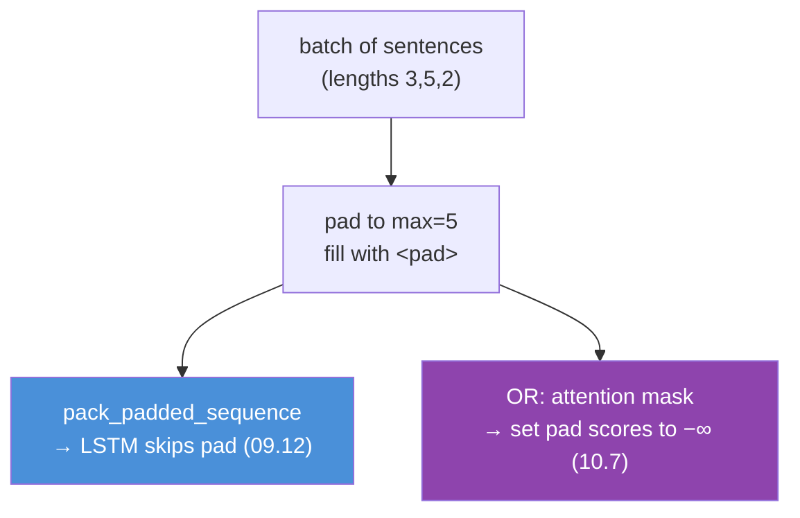
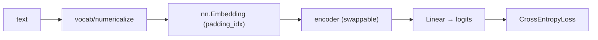

# 10.11 · NLP with PyTorch — The Full Text Pipeline

[⬅ 10.10 NLP Data](10.10-nlp-data.md) · [🏠 Module 10](../README.md) · [➡ 10.12 Modern Libraries](10.12-modern-libraries.md)

> **The lesson in one line:** Assemble everything — tokens → vocab → embedding → encoder → head — into a working PyTorch text model, and discover it's the [09.10 training loop](../../09-Deep-Learning/weeks/09.10-training-loop.md) you already own, with a text-specific front end bolted on.

---

## 🎯 Learning objectives

- Build the complete PyTorch NLP pipeline: **numericalization, `nn.Embedding`, padding/packing, encoder, head, loss**.
- Correctly handle **variable-length batches** (padding, packing, masking) — the one thing text adds to the [09.x](../../09-Deep-Learning/README.md) loop.
- Implement a **text classifier**, an **embedding model**, a **sequence model**, and an **attention-based model** as variations on one skeleton.
- Debug the NLP-specific failure modes (padding leakage, wrong loss over pad tokens, device mismatches).

## ✅ Prerequisites

- [09.8 nn.Module](../../09-Deep-Learning/weeks/09.8-building-models.md), [09.9 DataLoader](../../09-Deep-Learning/weeks/09.9-data-loading.md), [09.10 training loop](../../09-Deep-Learning/weeks/09.10-training-loop.md), [09.12 packing](../../09-Deep-Learning/weeks/09.12-sequence-models.md).
- [10.4](10.4-word-embeddings.md)–[10.7](10.7-attention.md) — the components you're now wiring together.

---

## 🧠 Mental model

> [!IMPORTANT]
> **A PyTorch NLP model is the exact [09.10 training loop](../../09-Deep-Learning/weeks/09.10-training-loop.md) with a text-shaped front end.** The loop — `zero_grad → forward → loss → backward → step` — does not change. What text adds is a *pipeline before the model*: turn strings into integer IDs (numericalize), look those IDs up in an embedding table, and handle the fact that sentences have different lengths (pad + pack + mask). Master that front end and every NLP model in this module is a small variation.


---

## Stage 1 — Vocabulary & numericalization

Neural nets consume integers, not strings. Build a **vocabulary** mapping each token to an ID, with reserved special tokens.

```python
from collections import Counter

def build_vocab(tokenized_docs, min_freq=2):
    counter = Counter(tok for doc in tokenized_docs for tok in doc)
    # ⭐ Special tokens FIRST, at fixed IDs
    vocab = {"<pad>": 0, "<unk>": 1}
    for tok, freq in counter.most_common():
        if freq >= min_freq:                    # drop the long tail (10.1) → smaller vocab
            vocab[tok] = len(vocab)
    return vocab

def numericalize(tokens, vocab):
    return [vocab.get(tok, vocab["<unk>"]) for tok in tokens]  # OOV → <unk>
```

> [!IMPORTANT]
> **Two special tokens are non-negotiable.** `<pad>` (ID 0) fills short sequences to a common length. `<unk>` catches out-of-vocabulary words — the [long tail from 10.1](10.1-introduction-to-nlp.md) *will* hand you unseen words at inference, and without `<unk>` your code crashes on the first one. **Build the vocab on training data only** ([10.3 leakage](10.3-text-representation.md)) — fitting it on test data leaks which words exist there.

---

## Stage 2 — `nn.Embedding` — the lookup layer

`nn.Embedding` is the trainable embedding table from [10.4](10.4-word-embeddings.md): a `(vocab_size, embed_dim)` matrix where row *i* is the vector for token ID *i*. Crucially, it's an **indexing operation, not a matmul** ([09.8](../../09-Deep-Learning/weeks/09.8-building-models.md)) — you pass integer IDs, it returns rows.

```python
import torch.nn as nn

embedding = nn.Embedding(
    num_embeddings=len(vocab),
    embedding_dim=100,
    padding_idx=0,          # ⭐ <pad> row stays all-zeros and gets no gradient
)
# ids: (batch, seq_len) of ints → out: (batch, seq_len, 100)

# Optional: initialize from pretrained GloVe (10.4), then fine-tune
# embedding.weight.data.copy_(pretrained_matrix)
```

> [!TIP]
> **Always pass `padding_idx`.** It pins the `<pad>` embedding to zero and excludes it from gradient updates, so padding contributes nothing. Forgetting it lets the model learn a meaningful vector for "nothing," a subtle bug. And prefer **initializing from pretrained embeddings** ([10.4](10.4-word-embeddings.md)) when labels are scarce — it's transfer learning for text.

---

## Stage 3 — Variable-length batches (the hard part)

Text sequences have different lengths; tensors must be rectangular. So you **pad** each batch to its longest sequence, then tell the model which positions are real.

```python
from torch.nn.utils.rnn import pad_sequence, pack_padded_sequence

def collate_fn(batch):
    # batch: list of (ids_tensor, label). Sort by length for packing.
    batch.sort(key=lambda x: len(x[0]), reverse=True)
    seqs, labels = zip(*batch)
    lengths = torch.tensor([len(s) for s in seqs])
    padded = pad_sequence(seqs, batch_first=True, padding_value=0)  # (batch, max_len)
    return padded, lengths, torch.tensor(labels)

# In the model, pack before the RNN so it skips padding (09.12):
# packed = pack_padded_sequence(embedded, lengths.cpu(), batch_first=True)
# out, (h, c) = self.lstm(packed)
```



> [!CAUTION]
> **Padding must be masked, or it corrupts everything.** Two mechanisms, matching the two encoders:
> - **RNN/LSTM:** `pack_padded_sequence` so the LSTM never processes pad tokens ([09.12 gotcha](../../09-Deep-Learning/weeks/09.12-sequence-models.md)).
> - **Attention:** an **attention mask** that sets pad positions' scores to −∞ before softmax ([10.7](10.7-attention.md)), so no token attends to padding.
> - **Loss/pooling:** exclude pad positions from mean-pooling and from per-token loss (`ignore_index=<pad>` in `CrossEntropyLoss` for tagging).
>
> Skip any of these and the model learns from meaningless padding — a silent [leakage bug (10.10)](10.10-nlp-data.md) that inflates or degrades results unpredictably.

---

## Stage 4 — The four models as one skeleton

Every model below is `Embedding → Encoder → Head`. Only the encoder and head change ([the four shapes, 10.6](10.6-nlp-tasks.md)).

### A. Text classifier (seq → label)

```python
class TextClassifier(nn.Module):
    def __init__(self, vocab_size, embed_dim, hidden, n_classes):
        super().__init__()
        self.embed = nn.Embedding(vocab_size, embed_dim, padding_idx=0)
        self.lstm  = nn.LSTM(embed_dim, hidden, batch_first=True, bidirectional=True)
        self.head  = nn.Linear(hidden * 2, n_classes)     # *2 for bidirectional

    def forward(self, ids, lengths):
        x = self.embed(ids)                                # (B, T, E)
        packed = pack_padded_sequence(x, lengths.cpu(), batch_first=True)
        _, (h, _) = self.lstm(packed)                      # h: (2, B, hidden)
        sentence = torch.cat([h[0], h[1]], dim=1)          # concat fwd+bwd → (B, 2*hidden)
        return self.head(sentence)                         # LOGITS (09.3)
```

### B. Embedding model (unsupervised representation)

Skip-gram from [10.4](10.4-word-embeddings.md): two `nn.Embedding` tables (center + context), trained with negative sampling and `BCEWithLogitsLoss`. Keep the center table as your embeddings.

### C. Sequence model (seq → per-token, tagging)

Same as the classifier but the head applies **per position**, and the loss uses `ignore_index` for pads:

```python
self.head = nn.Linear(hidden * 2, n_tags)   # applied at every timestep
# out: (B, T, n_tags); loss = CrossEntropyLoss(ignore_index=PAD)(out.view(-1, n_tags), tags.view(-1))
```

### D. Attention-based model

Replace (or augment) the LSTM with the [10.7 self-attention](10.7-attention.md) you built. PyTorch gives you `nn.MultiheadAttention` (or `nn.TransformerEncoderLayer`) — but you now know *exactly* what's inside it, having written it by hand.

```python
# self.attn = nn.MultiheadAttention(embed_dim, num_heads=4, batch_first=True)
# attn_out, weights = self.attn(x, x, x, key_padding_mask=pad_mask)  # self-attention
# ⭐ key_padding_mask is the attention mask — set pad positions True to ignore them
```

> [!IMPORTANT]
> **Notice the training loop never appeared in this lesson.** That's the point — it's [09.10](../../09-Deep-Learning/weeks/09.10-training-loop.md), unchanged: `model.train()`, `zero_grad`, forward, `CrossEntropyLoss` on logits, `backward`, `clip_grad_norm_`, `step`, then `model.eval()` + `no_grad()` for validation. **Deep learning added a new *front end* for text, not a new discipline** — the same lesson as [09.18](../../09-Deep-Learning/weeks/09.18-projects-summary.md).

---

## 💻 The pipeline, end to end

```python
# 1. Data
train_tokens = [tokenize(t) for t in train_texts]      # 10.2
vocab = build_vocab(train_tokens)                       # train only!
train_ds = [(torch.tensor(numericalize(t, vocab)), y)   # 10.11
            for t, y in zip(train_tokens, train_labels)]
loader = DataLoader(train_ds, batch_size=32, shuffle=True, collate_fn=collate_fn)

# 2. Model
model = TextClassifier(len(vocab), 100, 128, n_classes).to(device)
opt   = torch.optim.AdamW(model.parameters(), lr=1e-3)   # 09.5
loss_fn = nn.CrossEntropyLoss()                          # takes LOGITS (09.3)

# 3. The 09.10 loop, verbatim
for epoch in range(N):
    model.train()
    for ids, lengths, y in loader:
        ids, y = ids.to(device), y.to(device)            # 09.6: every batch
        opt.zero_grad()
        logits = model(ids, lengths)
        loss = loss_fn(logits, y)
        loss.backward()
        torch.nn.utils.clip_grad_norm_(model.parameters(), 1.0)  # 09.14: RNNs explode
        opt.step()
    # model.eval() + torch.no_grad() for validation ...
```

---

## 🏭 Production examples

| Model | Production use |
|---|---|
| **BiLSTM classifier** | intent detection, sentiment, ticket routing |
| **Skip-gram embeddings** | item2vec for recommendations; domain embeddings |
| **BiLSTM tagger** | NER redaction, POS features |
| **Attention/Transformer** | everything modern → but usually via Hugging Face ([10.12](10.12-modern-libraries.md)) |

## ⚡ Performance considerations

- **Sort-and-bucket by length** so batches have similar lengths → less padding → less wasted compute (the biggest cheap NLP speedup).
- **`pin_memory=True`, `num_workers>0`** — keep the GPU fed ([09.9 idle-GPU](../../09-Deep-Learning/weeks/09.9-data-loading.md)); tokenization is often the bottleneck.
- **The embedding table dominates memory** ([10.4](10.4-word-embeddings.md)) — cap vocab with `min_freq`.
- **Clip gradients** — RNNs explode ([09.14](../../09-Deep-Learning/weeks/09.14-performance.md)).
- **Mixed precision** ([09.14](../../09-Deep-Learning/weeks/09.14-performance.md)) for attention models.

## 🔒 Security & privacy considerations

> [!CAUTION]
> - **The vocabulary is a data artifact** ([10.3](10.3-text-representation.md)) — it lists every token in your training corpus, including rare names/PII. Treat a saved vocab as sensitive.
> - **Embeddings memorize** — a fine-tuned `nn.Embedding` on private text encodes it and can leak under inversion ([10.4](10.4-word-embeddings.md), [10.14](10.14-ethics-safety.md)).
> - **`weights_only=True` when loading checkpoints** — `torch.load` is pickle/RCE ([09.16](../../09-Deep-Learning/weeks/09.16-saving-loading.md)).
> - **Log metrics, not raw text** — dumping user inputs into training logs is a common breach ([07.x](../../07-Data-Analysis/weeks/07.9-data-quality.md)).

## 🚫 Common mistakes

| Mistake | Consequence |
|---|---|
| **No `<unk>` token** | crash on the first OOV word at inference |
| **Building vocab on train+test** | leakage ([10.3](10.3-text-representation.md)) |
| **Forgetting `padding_idx`** | model learns a vector for "nothing" |
| **Not packing/masking padding** | model trains on pad tokens → corrupt results |
| **Loss over pad positions in tagging** | pad tokens dominate the loss → use `ignore_index` |
| **Softmaxing before CrossEntropyLoss** | double softmax ([09.3](../../09-Deep-Learning/weeks/09.3-math-of-neural-networks.md)) |
| **No gradient clipping on RNNs** | exploding gradients → NaN |

## ✅ Best practices

- **Special tokens first, fixed IDs** (`<pad>`=0, `<unk>`=1); vocab on train only.
- **`padding_idx=0`** on the embedding; **pack (RNN) or mask (attention)** always.
- **Init from pretrained embeddings** when data is limited; fine-tune.
- **Output logits; use `CrossEntropyLoss`/`BCEWithLogitsLoss`** ([09.3](../../09-Deep-Learning/weeks/09.3-math-of-neural-networks.md)).
- **Overfit one batch first** ([09.15](../../09-Deep-Learning/weeks/09.15-debugging.md)) — the NLP failure modes (masking, loss shape) surface immediately.
- **Bucket by length; clip gradients; mixed precision** for speed/stability.

## 🏋️ Exercises

1. **Vocab & OOV.** Build a vocab with `min_freq=2`. Report vocab size and the OOV rate on a held-out set. Lower `min_freq` and watch vocab size and OOV trade off.
2. **Masking ablation.** Train a BiLSTM classifier with and without `pack_padded_sequence`. Measure the accuracy difference and explain the corruption.
3. **`padding_idx`.** Train with and without `padding_idx=0`. Inspect the `<pad>` row's norm after training in each case.
4. **Build the classifier.** Implement `TextClassifier`, overfit one batch to ~100%, then train fully. Report macro-F1.
5. **Swap the encoder.** Replace the LSTM with `nn.MultiheadAttention` + masking. Compare F1 and speed. Relate to [10.7](10.7-attention.md)'s parallelism advantage.
6. **Tagging loss.** For an NER model, train with and without `ignore_index=<pad>`. Show how pad tokens distort the loss without it.

## 🛠️ Mini project — "A PyTorch Text Classification Framework"

**Goal:** a reusable, model-agnostic text-classification framework — the [09.10 Trainer](../../09-Deep-Learning/weeks/09.10-training-loop.md) with an NLP front end — that swaps encoders (BoW-MLP / BiLSTM / attention) behind one interface.

**Requirements**
- Data pipeline: tokenize, build vocab (train only), numericalize, `collate_fn` with padding + lengths.
- Three interchangeable encoders — **mean-pooled embeddings (MLP)**, **BiLSTM**, **self-attention** — behind a common `forward(ids, lengths)`.
- The [09.10 loop](../../09-Deep-Learning/weeks/09.10-training-loop.md) with clipping, best-by-val checkpointing, overfit-one-batch smoke test.
- Compare all three against the [10.3 TF-IDF baseline](10.3-text-representation.md), overall and on a hard (negation/order) subset ([10.5](10.5-sequence-models.md)).

**Folder structure**
```
text-classification-framework/
├── data.py            # vocab, numericalize, collate_fn (pad + lengths)
├── encoders.py        # MeanPoolMLP | BiLSTM | SelfAttention
├── model.py           # Embedding → encoder → head
├── trainer.py         # 09.10 loop, clipping, checkpoint, overfit-one-batch
├── evaluate.py        # macro-F1 overall + hard subset vs TF-IDF
└── README.md
```

**Architecture diagram**


**Testing:** overfit-one-batch passes for each encoder; assert masking is applied (pad positions don't affect output); `np.allclose` on the mean-pool path vs a manual computation.
**Evaluation:** macro-F1 overall and on the hard subset; a table showing where each encoder wins.
**Future improvements:** replace the from-scratch encoders with a pretrained Transformer via Hugging Face ([10.12](10.12-modern-libraries.md)) behind the *same interface* — the payoff of a clean abstraction.

## 📄 Cheat sheet

| Stage | Do |
|---|---|
| **Vocab** | specials first (`<pad>`=0,`<unk>`=1); **train only**; `min_freq` to prune |
| **Numericalize** | tokens → IDs; OOV → `<unk>` |
| **Embedding** | `nn.Embedding(V, d, padding_idx=0)`; init from GloVe if scarce data |
| **⭐ Padding** | `pad_sequence` + **`pack_padded_sequence` (RNN)** or **attention mask** |
| **Encoder** | BiLSTM (pack) / MultiheadAttention (mask) |
| **Head** | pool→Linear (classify) · per-token Linear (`ignore_index`) (tag) |
| **Loss** | `CrossEntropyLoss` on **logits** (09.3) |
| **Loop** | ⭐ **[09.10](../../09-Deep-Learning/weeks/09.10-training-loop.md), unchanged** + `clip_grad_norm_` |

## 🎴 Flashcards

- **What does the NLP front end add to the 09.10 loop?** → Numericalization (strings→IDs), an embedding lookup, and variable-length handling (pad/pack/mask). The loop itself is unchanged.
- **Why two special tokens?** → `<pad>` fills short sequences; `<unk>` catches OOV words (the long tail guarantees them at inference).
- **⭐ What does `padding_idx` do?** → Pins the pad embedding to zeros and excludes it from gradients.
- **⭐ How do you stop padding from corrupting the model?** → `pack_padded_sequence` (RNN), attention mask setting pad scores to −∞ (attention), `ignore_index` (tagging loss).
- **Why build vocab on train only?** → Fitting on test leaks which tokens exist there (a preprocessing leak).
- **Is `nn.Embedding` a matmul?** → No — it's a row-lookup by integer ID (mathematically equal to one-hot × matrix, but done as indexing).
- **⭐ Which loop do NLP models use?** → The exact 09.10 loop; text changes the front end, not the discipline.

## 💬 Interview questions

1. Walk through the full PyTorch NLP pipeline from raw string to loss. Where does text differ from tabular?
2. How do you handle variable-length sequences in a batch? Give the RNN and attention mechanisms.
3. What is `padding_idx` and why does it matter? What breaks without masking?
4. Why must the vocabulary be built on training data only?
5. How would you swap a BiLSTM encoder for a Transformer without changing the rest of the pipeline?
6. Your NER model's loss is dominated by pad tokens. What's the fix?

## 📝 Summary

- A PyTorch NLP model is **`Embedding → Encoder → Head`** feeding the **[09.10 training loop, unchanged](../../09-Deep-Learning/weeks/09.10-training-loop.md)** — text adds a *front end*, not a new discipline.
- **Numericalize** with a train-only vocabulary and reserved **`<pad>`/`<unk>`** tokens; OOV is guaranteed by the long tail.
- **`nn.Embedding`** is the trainable lookup table from [10.4](10.4-word-embeddings.md); always set **`padding_idx`** and consider **pretrained init**.
- **Variable-length batches are the one hard part** — pad, then **pack (RNN)** or **mask (attention)**, and exclude pads from pooling and loss.
- The four models (classifier, embedding, tagger, attention) are one skeleton with a swappable **encoder and head** ([10.6](10.6-nlp-tasks.md)).

## 📚 References

1. **PyTorch tutorials — _Text Classification_ and _Sequence Models_.** ⭐ Official, runnable.
2. **[09.10 The Training Loop](../../09-Deep-Learning/weeks/09.10-training-loop.md) & [09.12 Sequence Models](../../09-Deep-Learning/weeks/09.12-sequence-models.md).** Your own foundation — packing lives there.
3. **Stevens, Antiga & Viehmann — _Deep Learning with PyTorch_, text chapters.** ⭐
4. **torchtext documentation** — vocab, datasets, and the collation utilities.
5. **Karpathy — _makemore_ / _minGPT_.** ⭐ Building text models in PyTorch from the ground up.

---

## 🧭 Navigation

| Direction | Link |
|---|---|
| ⬅ Previous | [10.10 · NLP Data](10.10-nlp-data.md) |
| ➡ Next | [10.12 · NLP with Modern Libraries](10.12-modern-libraries.md) |
| 🏠 Module | [Module 10](../README.md) |
| 📖 Lessons | [Lesson index](README.md) |
