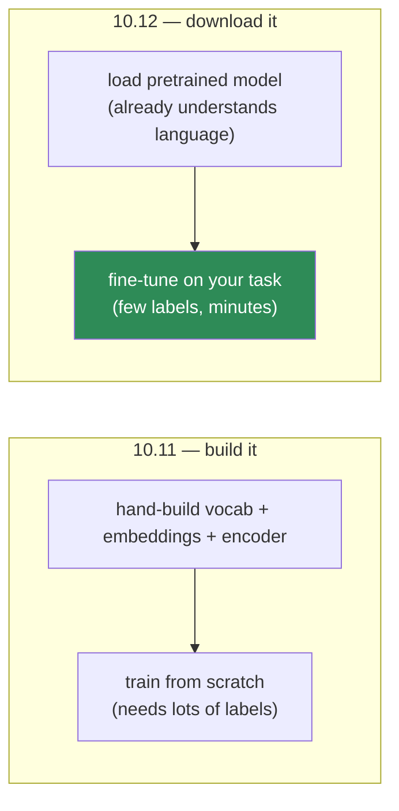
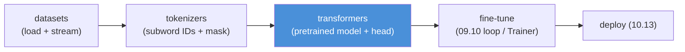
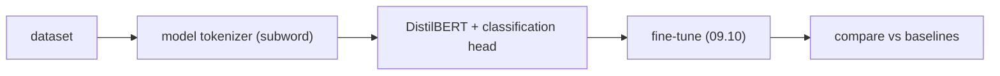

# 10.12 · NLP with Modern Libraries — Hugging Face, Tokenizers, Datasets

[⬅ 10.11 NLP with PyTorch](10.11-nlp-with-pytorch.md) · [🏠 Module 10](../README.md) · [➡ 10.13 Production](10.13-production.md)

> **The lesson in one line:** Hugging Face is the front end you just built by hand ([10.11](10.11-nlp-with-pytorch.md)) — subword tokenizer, embedding, encoder, head — packaged with thousands of pretrained models, so you download understanding instead of training it from scratch.

---

## 🎯 Learning objectives

- Understand the three pillars — **`transformers`, `tokenizers`, `datasets`** — and what each replaces from [10.11](10.11-nlp-with-pytorch.md).
- Understand **subword tokenization (BPE/WordPiece)** concretely — the [10.2](10.2-text-processing.md) preview, now the real thing.
- Grasp the **pretrain → fine-tune** paradigm that made modern NLP transfer learning.
- Know *conceptually* how to load a model, tokenize, and run inference — without diving into LLM applications (that's [Module 11](../../11-LLMs/README.md)).

## ✅ Prerequisites

- [10.7 attention](10.7-attention.md) (what's inside these models), [10.11 PyTorch pipeline](10.11-nlp-with-pytorch.md) (what these libraries abstract).
- [09.11 transfer learning](../../09-Deep-Learning/weeks/09.11-cnns.md) — the same idea, now for text.

> [!NOTE]
> **This lesson is deliberately conceptual.** The brief reserves deep LLM application work for [Module 11](../../11-LLMs/README.md). Here you learn *what the ecosystem is and why it exists*, so you recognize the pieces — not how to build a RAG chatbot.

---

## 🧠 Mental model

> [!IMPORTANT]
> **Everything you built by hand in [10.11](10.11-nlp-with-pytorch.md) — tokenizer, vocab, embeddings, encoder, training loop — Hugging Face provides pretrained and battle-tested. The paradigm flips: instead of *training* a model to understand language, you *download* one that already does, and adapt it.** A model like BERT was pretrained on billions of words at a cost of thousands of GPU-hours; you fine-tune it on your few thousand labeled examples in minutes. This is [transfer learning (09.11)](../../09-Deep-Learning/weeks/09.11-cnns.md) for text, and it is the single biggest productivity shift in NLP history.



---

## The three pillars

| Library | Replaces (from 10.11) | Role |
|---|---|---|
| **`tokenizers`** | your regex tokenizer + vocab ([10.2](10.2-text-processing.md), [10.11](10.11-nlp-with-pytorch.md)) | fast subword tokenization |
| **`transformers`** | your `nn.Module` encoder + head ([10.11](10.11-nlp-with-pytorch.md)) | thousands of pretrained models |
| **`datasets`** | your `Dataset`/`DataLoader` ([09.9](../../09-Deep-Learning/weeks/09.9-data-loading.md)) | efficient, memory-mapped data loading |

---

## Pillar 1 — `tokenizers`: subwords, for real

[10.2](10.2-text-processing.md) previewed subword tokenization as the answer to the long tail. Here's the substance. The two dominant algorithms:

### Byte-Pair Encoding (BPE)

Start with individual characters. Repeatedly find the **most frequent adjacent pair** and merge it into a new token. Stop at a target vocabulary size (e.g., 50,000).

```
Corpus: "low lower lowest"
Start:  l o w | l o w e r | l o w e s t
Merge most frequent pair 'l'+'o' → 'lo'
        lo w | lo w e r | lo w e s t
Merge 'lo'+'w' → 'low'
        low | low e r | low e s t
... vocabulary grows: {low, e, r, s, t, ...}
```

Any future word decomposes into these learned pieces — and worst case, into individual characters, so **there are no unknown words** ([10.1's long tail](10.1-introduction-to-nlp.md), solved).

### WordPiece

BERT's variant. Same idea, but merges the pair that most increases the *likelihood* of the training data (not just raw frequency). Marks word-continuation with `##`:

```
"unhappiness" → ["un", "##happ", "##iness"]
"tokenization" → ["token", "##ization"]
```


> [!IMPORTANT]
> **Subword tokenization is why modern models handle any input.** Typos, new slang, code, URLs, other languages — all decompose into subwords. The tokenizer is *fit once* (its merges are learned from a corpus) and shipped *with* the model — you must use the **exact tokenizer the model was pretrained with**, or the token IDs won't match the embeddings. This is the #1 Hugging Face beginner bug: mismatched tokenizer and model.

The Hugging Face `tokenizers` library implements these in Rust — **fast enough to keep a GPU fed** ([the idle-GPU problem from 09.9](../../09-Deep-Learning/weeks/09.9-data-loading.md)), unlike a Python-loop tokenizer.

```python
from transformers import AutoTokenizer

tok = AutoTokenizer.from_pretrained("bert-base-uncased")
out = tok("Transformers are powerful.", return_tensors="pt")
# out["input_ids"]: token IDs (with special [CLS]/[SEP] tokens)
# out["attention_mask"]: 1 for real tokens, 0 for padding — the 10.7/10.11 mask!
tok.tokenize("tokenization")   # ['token', '##ization']
```

Note `attention_mask` — the exact padding mask you built by hand in [10.11](10.11-nlp-with-pytorch.md), now returned for free.

---

## Pillar 2 — `transformers`: pretrained models

The library hosts thousands of models. The ones to recognize (families, not an exhaustive list):

| Model family | Architecture | Best at | Shape ([10.6](10.6-nlp-tasks.md)) |
|---|---|---|---|
| **BERT / RoBERTa** | encoder-only (bidirectional) | *understanding* — classification, NER, similarity | 1, 2, 4 |
| **GPT** | decoder-only (causal) | *generation* | 3 |
| **T5 / BART** | encoder–decoder | *text-to-text* — translation, summarization | 3 |
| **Sentence-BERT** | bi-encoder ([10.6](10.6-nlp-tasks.md)) | embeddings for search/similarity | 4 |

> [!TIP]
> **The encoder/decoder split maps directly onto [10.6's task shapes](10.6-nlp-tasks.md) and [10.8's seq2seq lineage](10.8-seq2seq.md).** BERT is a stack of the **self-attention encoders** you built ([10.7](10.7-attention.md)) — bidirectional, great for understanding, useless for generation (it sees the whole input at once). GPT is a stack of **causal decoders** — forward-only, built to generate. T5/BART are the full **encoder–decoder** ([10.8](10.8-seq2seq.md)). You already understand all three architectures; these are just pretrained, scaled versions.

### The `pipeline` — inference in three lines

```python
from transformers import pipeline

clf = pipeline("sentiment-analysis")           # downloads a fine-tuned model
clf("This module finally made attention click.")
# [{'label': 'POSITIVE', 'score': 0.9998}]

ner = pipeline("ner", aggregation_strategy="simple")
ner("Tim Cook visited Paris.")                  # → PER, LOC spans (10.6)
```

The `pipeline` wraps tokenizer + model + post-processing. For understanding tasks it's often all you need; no training required.

### Fine-tuning — adapt to your task

Load a pretrained model, add/replace the task head ([10.6](10.6-nlp-tasks.md)), and train on your labels with the [09.10 loop](../../09-Deep-Learning/weeks/09.10-training-loop.md) (or the library's `Trainer`, which *is* that loop):

```python
from transformers import AutoModelForSequenceClassification

model = AutoModelForSequenceClassification.from_pretrained(
    "bert-base-uncased", num_labels=3)          # a fresh classification head
# then fine-tune with Trainer or your own 09.10 loop — the loop is UNCHANGED
```

> [!IMPORTANT]
> **Fine-tuning is [transfer learning (09.11)](../../09-Deep-Learning/weeks/09.11-cnns.md) exactly.** The pretrained model's early/middle layers already encode grammar, meaning, and world knowledge (from billions of words of self-supervised pretraining — [10.4's fake-task idea](10.4-word-embeddings.md) at massive scale). You freeze or lightly-tune those and train a small head on your labels. A from-scratch [10.11](10.11-nlp-with-pytorch.md) BiLSTM might need 100k labeled examples; a fine-tuned BERT beats it with 1,000. **This is why nobody trains NLP models from scratch anymore** — and why [Module 15](../../15-Fine-Tuning/README.md) exists.

---

## Pillar 3 — `datasets`

Memory-mapped, streaming-capable data loading for corpora too big for RAM ([09.9](../../09-Deep-Learning/weeks/09.9-data-loading.md), [07.9 out-of-core](../../07-Data-Analysis/weeks/07.9-data-quality.md)). Loads standard benchmarks in one line, applies tokenization lazily, and integrates with the `Trainer`.

```python
from datasets import load_dataset
ds = load_dataset("imdb")                        # streams; doesn't load all into RAM
ds = ds.map(lambda x: tok(x["text"], truncation=True), batched=True)  # lazy tokenize
```

---

## The whole thing, connected



> [!IMPORTANT]
> **You are not learning a new subject here — you are learning the *packaged* form of everything from [10.2](10.2-text-processing.md) through [10.11](10.11-nlp-with-pytorch.md).** Subword tokenizer ([10.2](10.2-text-processing.md)), embeddings ([10.4](10.4-word-embeddings.md)), self-attention encoder ([10.7](10.7-attention.md)), the four task shapes ([10.6](10.6-nlp-tasks.md)), the training loop ([09.10](../../09-Deep-Learning/weeks/09.10-training-loop.md)) — all pretrained and wrapped in a clean API. The reason to build it by hand first was so this library is *transparent*, not magic. When `AutoModel` returns a tensor, you know it's the attention stack you wrote.

---

## 🏭 Production examples

| Task | Hugging Face approach |
|---|---|
| **Sentiment / classification** | fine-tune BERT or use a `pipeline` |
| **NER / PII redaction** | fine-tuned token-classification model ([10.6](10.6-nlp-tasks.md)) |
| **Semantic search** | Sentence-BERT bi-encoder → vector DB ([10.4](10.4-word-embeddings.md), [Module 13](../../13-RAG/README.md)) |
| **Summarization / translation** | T5/BART, or a `pipeline` |
| **Serving** | `transformers` + ONNX/TorchScript ([09.17](../../09-Deep-Learning/weeks/09.17-production.md), [10.13](10.13-production.md)) |

## ⚡ Performance considerations

- **Use the fast (Rust) tokenizer** (`use_fast=True`, the default for `AutoTokenizer`) — Python tokenizers starve the GPU.
- **Truncate and pad to a sane `max_length`** — attention is [O(n²) (10.7)](10.7-attention.md); a few overly-long sequences dominate cost.
- **Dynamic padding** (pad per batch, not to a global max) via a data collator — the [10.11 bucketing](10.11-nlp-with-pytorch.md) idea.
- **Distilled models** (DistilBERT, MiniLM) — ~40% smaller, ~60% faster, ~97% of accuracy; usually the right production default over full BERT.
- **Mixed precision + batching** for inference ([09.14](../../09-Deep-Learning/weeks/09.14-performance.md), [10.13](10.13-production.md)).

## 🔒 Security & privacy considerations

> [!CAUTION]
> - **Downloaded models and tokenizers are executable artifacts.** `from_pretrained` fetches remote code/weights; a malicious model repo can ship harmful code (`trust_remote_code=True` runs arbitrary Python) or pickled weights (RCE, [09.16](../../09-Deep-Learning/weeks/09.16-saving-loading.md)). **Pin versions, verify sources, prefer safetensors, and avoid `trust_remote_code` unless you audited it.**
> - **Pretrained models carry their training data's biases and memorized content** ([10.4](10.4-word-embeddings.md), [10.10](10.10-nlp-data.md)) — you inherit them wholesale. Read the model card; audit before high-stakes use.
> - **Sending text to a hosted inference API** ships user data to a third party — a privacy/compliance decision, not just a technical one ([10.13](10.13-production.md), [10.14](10.14-ethics-safety.md)).
> - **Tokenizer mismatch is a silent correctness bug**, not a crash — wrong IDs → wrong embeddings → quietly degraded output.

## 🚫 Common mistakes

| Mistake | Consequence |
|---|---|
| **Mismatched tokenizer and model** | token IDs don't match embeddings → garbage output (no error) |
| **`trust_remote_code=True` blindly** | arbitrary code execution |
| **Full BERT when Distil* would do** | 2–3× the cost for ~3% more accuracy |
| **No truncation** | one long doc blows up O(n²) attention memory |
| **Ignoring the model card** | inheriting undocumented bias/limitations |
| **Assuming a `pipeline` is production-ready** | no batching, monitoring, or error handling ([10.13](10.13-production.md)) |

## ✅ Best practices

- **Always pair a model with its own tokenizer** (`AutoTokenizer.from_pretrained(same_name)`).
- **Fine-tune a pretrained model** rather than training from scratch — few labels, minutes, better results.
- **Start with a distilled model**; scale up only if accuracy demands it.
- **Read the model card** for training data, bias, license, and intended use.
- **Pin versions, prefer safetensors, avoid unaudited remote code.**
- **Remember what's inside** — when debugging, it's the attention stack you built ([10.7](10.7-attention.md)), not a black box.

## 🏋️ Exercises

1. **Subword exploration.** Tokenize "unbelievable", "COVID-19", "🤗", "antidisestablishmentarianism", and a URL with BERT's tokenizer. Report the subword splits. Which produce many pieces? Which become `[UNK]` (few, if any)?
2. **Tokenizer mismatch.** Load BERT's model with GPT-2's tokenizer (or vice versa) and run inference. Show the output is nonsense, and explain why there's no error.
3. **`pipeline` speed run.** Use `pipeline` for sentiment, NER, and summarization on 5 texts each. Note which need no training.
4. **Fine-tune.** Fine-tune DistilBERT on a small sentiment set. Compare its F1 (and label count needed) to your [10.11 BiLSTM](10.11-nlp-with-pytorch.md) and [10.3 TF-IDF](10.3-text-representation.md) baselines.
5. **Distillation tradeoff.** Compare BERT-base vs DistilBERT on the same task: F1, latency, and memory. Is the accuracy gap worth the cost?
6. **BPE by hand (revisited).** Run 5 BPE merges by hand on a toy corpus ([10.2 exercise](10.2-text-processing.md)); then confirm `tokenizers` produces the same merges on the same corpus.

## 🛠️ Mini project — "Fine-Tune a Transformer, Beat Your Baselines"

**Goal:** fine-tune a pretrained Transformer on the task you've carried through the module and prove, with numbers, how far transfer learning has come from [10.3](10.3-text-representation.md).

**Requirements**
- The same sentiment (or NER) dataset from [10.3](10.3-text-representation.md)/[10.5](10.5-sequence-models.md)/[10.11](10.11-nlp-with-pytorch.md).
- Fine-tune **DistilBERT** with the `Trainer` (or your [09.10 loop](../../09-Deep-Learning/weeks/09.10-training-loop.md)); use its own tokenizer; dynamic padding.
- **Head-to-head table**: TF-IDF+LR ([10.3](10.3-text-representation.md)) vs BiLSTM ([10.11](10.11-nlp-with-pytorch.md)) vs fine-tuned DistilBERT — F1, training time, params, and **F1 on the hard negation/order subset** ([10.5](10.5-sequence-models.md)).
- A **data-efficiency curve**: F1 vs number of labeled examples for each model — showing the Transformer wins most when labels are scarce ([transfer learning, 09.11](../../09-Deep-Learning/weeks/09.11-cnns.md)).

**Folder structure**
```
finetune-transformer/
├── data.py            # load + tokenize (model's own tokenizer)
├── train.py           # Trainer / 09.10 loop, dynamic padding
├── compare.py         # TF-IDF vs BiLSTM vs DistilBERT
├── efficiency.py      # F1 vs #labels curve
└── README.md
```

**Architecture diagram**


**Testing:** assert tokenizer matches the model; overfit-one-batch smoke test; assert the fine-tuned model beats TF-IDF on the hard subset.
**Evaluation:** macro-F1 overall + hard subset; the data-efficiency curve.
**Future improvements:** try full BERT vs DistilBERT (accuracy vs cost); add a bias audit ([10.14](10.14-ethics-safety.md)); export to ONNX for serving ([10.13](10.13-production.md)). This is the on-ramp to [Module 11](../../11-LLMs/README.md) and [Module 15](../../15-Fine-Tuning/README.md).

## 📄 Cheat sheet

| Pillar | Replaces | Key point |
|---|---|---|
| **`tokenizers`** | your tokenizer+vocab | ⭐ **subword (BPE/WordPiece)** — no unknown words; ship with the model |
| **`transformers`** | your encoder+head | thousands of pretrained models; `pipeline` for zero-training inference |
| **`datasets`** | Dataset/DataLoader | memory-mapped, streaming |
| **BERT / GPT / T5** | encoder / decoder / enc-dec | understand / generate / text-to-text ([10.6](10.6-nlp-tasks.md)/[10.8](10.8-seq2seq.md)) |
| **⭐ Fine-tuning** | training from scratch | transfer learning (09.11): few labels, minutes, better |
| **⭐ #1 bug** | — | **tokenizer must match the model** (silent, not a crash) |

## 🎴 Flashcards

- **What are Hugging Face's three pillars?** → `tokenizers` (subword), `transformers` (pretrained models), `datasets` (efficient loading).
- **⭐ What is subword tokenization?** → BPE/WordPiece build a vocabulary of frequent character sequences, so any word (incl. unseen) decomposes into known pieces — no unknown tokens.
- **⭐ Why must the tokenizer match the model?** → Token IDs index the pretrained embeddings; a mismatched tokenizer produces wrong IDs → garbage output, with no error.
- **BERT vs GPT vs T5?** → Encoder (understanding, bidirectional) / decoder (generation, causal) / encoder–decoder (text-to-text).
- **⭐ What is fine-tuning?** → Transfer learning for text: adapt a pretrained model with a new head on your labels — few examples, minutes.
- **Why not train NLP models from scratch anymore?** → Pretrained models already encode grammar/meaning/world-knowledge; fine-tuning beats from-scratch with far fewer labels.
- **What's inside `AutoModel`?** → The self-attention stack you built in 10.7 — pretrained and scaled, not a black box.

## 💬 Interview questions

1. What do `transformers`, `tokenizers`, and `datasets` each provide, and what do they replace from a hand-built pipeline?
2. Explain subword tokenization and why it solves the out-of-vocabulary problem.
3. Why must you use a model's own tokenizer? What happens if you don't?
4. Contrast BERT, GPT, and T5 by architecture and best-fit task.
5. What is fine-tuning, and why does it beat training from scratch with limited labels?
6. What security risks come with `from_pretrained` and `trust_remote_code`?

## 📝 Summary

- Hugging Face packages **everything from [10.2](10.2-text-processing.md)–[10.11](10.11-nlp-with-pytorch.md)** — subword tokenizer, embeddings, self-attention encoder, task heads — pretrained and wrapped in a clean API.
- **Subword tokenization (BPE/WordPiece)** eliminates unknown words and must be used with the **exact model it was trained with** — the #1 silent bug.
- **`transformers`** hosts pretrained **BERT (understand) / GPT (generate) / T5 (text-to-text)** — the architectures you built, scaled — with a `pipeline` for zero-training inference.
- **Fine-tuning is transfer learning ([09.11](../../09-Deep-Learning/weeks/09.11-cnns.md))**: adapt a pretrained model with a small head on few labels — which is why nobody trains from scratch anymore.
- You build it by hand first so the library is **transparent** — the on-ramp to [LLMs (Module 11)](../../11-LLMs/README.md) and [fine-tuning (Module 15)](../../15-Fine-Tuning/README.md).

## 📚 References

1. **Hugging Face — _Transformers / Tokenizers / Datasets_ documentation & the free _NLP Course_.** ⭐⭐ The canonical resource.
2. **Devlin et al. (2019) — _BERT_.** ⭐ The pretrain-then-fine-tune paradigm.
3. **Sennrich et al. (2016) — _BPE for NMT_** & **Wu et al. (2016) — _WordPiece / Google's NMT_.** The subword algorithms.
4. **Sanh et al. (2019) — _DistilBERT_.** The distillation tradeoff.
5. **Tunstall, von Werra & Wolf — _Natural Language Processing with Transformers_.** ⭐ The Hugging Face book.

---

## 🧭 Navigation

| Direction | Link |
|---|---|
| ⬅ Previous | [10.11 · NLP with PyTorch](10.11-nlp-with-pytorch.md) |
| ➡ Next | [10.13 · NLP Production Systems](10.13-production.md) |
| 🏠 Module | [Module 10](../README.md) |
| 📖 Lessons | [Lesson index](README.md) |
