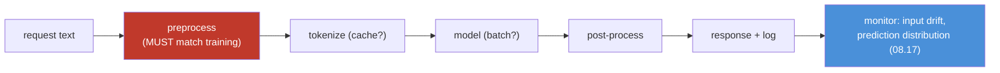
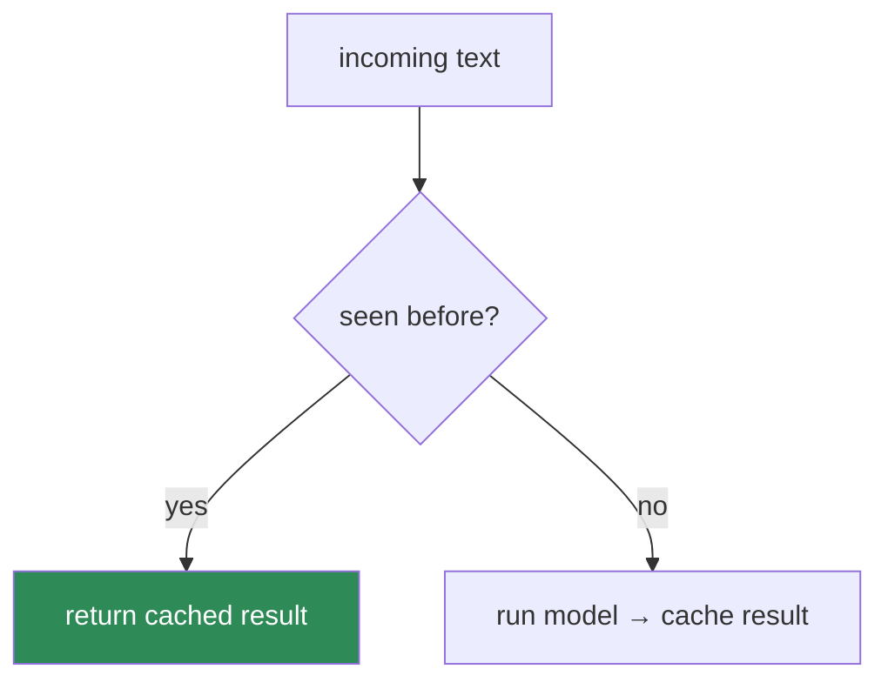
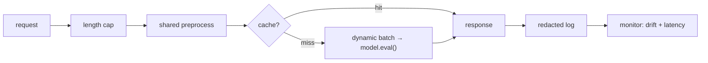

# 10.13 · NLP Production Systems — Pipelines, Latency, Caching, Monitoring

[⬅ 10.12 Modern Libraries](10.12-modern-libraries.md) · [🏠 Module 10](../README.md) · [➡ 10.14 Ethics & Safety](10.14-ethics-safety.md)

> **The lesson in one line:** Shipping NLP is [09.17](../../09-Deep-Learning/weeks/09.17-production.md) + [08.17](../../08-Machine-Learning/weeks/08.17-production-ml.md) with three text-specific twists — the preprocessing must match training exactly, latency is dominated by tokenization and O(n²) attention, and drift means the *language itself* changed.

---

## 🎯 Learning objectives

- Build a **serving pipeline** where inference preprocessing is *identical* to training (train/serve skew is the #1 NLP production bug).
- Choose **batch vs online** inference and manage the **latency/throughput** tradeoff for text.
- Apply **caching** to the parts of NLP that repeat.
- **Version** models + tokenizers + vocab together, and **monitor** for the NLP-specific form of drift.

## ✅ Prerequisites

- [09.17 production deep learning](../../09-Deep-Learning/weeks/09.17-production.md), [08.17 production ML](../../08-Machine-Learning/weeks/08.17-production-ml.md) — this lesson specializes both.
- [07.11 pipelines & train/serve skew](../../07-Data-Analysis/weeks/07.11-reusable-pipelines.md).

---

## 🧠 Mental model

> [!IMPORTANT]
> **NLP production is the [Module 08](../../08-Machine-Learning/weeks/08.17-production-ml.md)/[09](../../09-Deep-Learning/weeks/09.17-production.md) discipline, unchanged, plus three things text makes acute: (1) the preprocessing pipeline must be byte-identical between training and serving, (2) latency is dominated by tokenization and quadratic attention, and (3) "drift" means the language your users write actually changed.** Everything else — versioning, monitoring, canaries, retraining gates — carries over verbatim. The model got fancier; deployment did not.



---

## Twist 1 — Train/serve skew is the #1 NLP bug

The single most common way NLP models fail in production: **the text is preprocessed differently at inference than in training.** A different tokenizer version, a lowercase step that was in the training script but not the server, a normalization ([10.2](10.2-text-processing.md)) mismatch — any of these silently corrupts inputs so the model sees a distribution it never trained on.

> [!CAUTION]
> **This is [07.11's training/serving skew](../../07-Data-Analysis/weeks/07.11-reusable-pipelines.md), and it is lethal in NLP because text preprocessing has so many steps to get wrong.** The model won't error — it'll just quietly perform worse. Defenses:
> - **Ship the exact preprocessing with the model** — same Unicode normalization, same tokenizer *version*, same vocab. With Hugging Face, save and load the tokenizer *alongside* the model ([10.12](10.12-modern-libraries.md)); never reconstruct it.
> - **One preprocessing function, imported by both training and serving** — never two copies that can drift ([07.11 fit/transform](../../07-Data-Analysis/weeks/07.11-reusable-pipelines.md)).
> - **A skew test in CI:** run the same text through the training and serving paths; assert identical token IDs.

This is why [10.12](10.12-modern-libraries.md) stressed that the tokenizer ships *with* the model — it's a production-correctness guarantee, not a convenience.

---

## Twist 2 — Latency & throughput for text

Text inference has NLP-specific cost drivers ([09.17 latency-vs-throughput](../../09-Deep-Learning/weeks/09.17-production.md)):

| Cost driver | Why | Lever |
|---|---|---|
| **Tokenization** | often CPU-bound, can rival model time | fast Rust tokenizer ([10.12](10.12-modern-libraries.md)) |
| **⭐ Sequence length (O(n²))** | attention is quadratic ([10.7](10.7-attention.md)) | truncate; cap `max_length` |
| **Autoregressive generation** | one forward pass per output token ([10.8](10.8-seq2seq.md)) | KV-cache; smaller model |
| **Model size** | big models = high latency + memory | **distillation** (DistilBERT — [10.12](10.12-modern-libraries.md)); quantization |

### Batch vs online

- **Batch (offline):** score a whole corpus overnight (classify all documents, embed a knowledge base). Maximize throughput; latency irrelevant. Start here when possible ([08.17](../../08-Machine-Learning/weeks/08.17-production-ml.md)).
- **Online (real-time):** classify a message as the user types. Latency-bound; the [09.17 latency/throughput tradeoff](../../09-Deep-Learning/weeks/09.17-production.md) bites. **Dynamic batching** (briefly hold requests to fill a batch) recovers GPU efficiency at a small latency cost.

> [!TIP]
> **The single biggest NLP latency win is a smaller model, not fancier serving.** A distilled model ([10.12](10.12-modern-libraries.md)) is ~2× faster for ~3% accuracy loss — usually the right trade in production. Reach for DistilBERT/MiniLM before you reach for exotic serving infrastructure. Match model size to the latency budget, then optimize serving.

---

## Twist 3 — Caching what repeats

NLP has natural caching opportunities because language repeats:



| Cache | When it helps |
|---|---|
| **Embedding cache** | the same documents/queries embedded repeatedly (semantic search, [10.4](10.4-word-embeddings.md)) — embed the corpus **once**, offline (the [10.6 bi-encoder](10.6-nlp-tasks.md) advantage) |
| **Result cache** | duplicate inputs (FAQs, common queries) — return the stored answer |
| **KV-cache** | within one autoregressive generation, reuse past keys/values ([10.7](10.7-attention.md), [10.8](10.8-seq2seq.md)) |

> [!IMPORTANT]
> **Pre-computing document embeddings offline is the highest-leverage NLP optimization, full stop.** In semantic search / RAG ([Module 13](../../13-RAG/README.md)), the corpus is embedded once and stored in a vector index; at query time you embed *only the query* and do a nearest-neighbor lookup. This is why [10.6](10.6-nlp-tasks.md) emphasized bi-encoders — they make the expensive work cacheable. Never re-embed a static corpus per request.

---

## Versioning & monitoring — Module 08, one twist

**Version everything together** ([08.17](../../08-Machine-Learning/weeks/08.17-production-ml.md)): model weights, **tokenizer**, **vocabulary**, and preprocessing code as one atomic artifact. An NLP model without its exact tokenizer is broken ([10.12](10.12-modern-libraries.md)).

**Monitoring** is [08.17](../../08-Machine-Learning/weeks/08.17-production-ml.md), unchanged in method:

- **Monitor inputs, not just performance** — labels arrive late (or never), so **input drift and the prediction-distribution canary are your leading indicators** ([08.17](../../08-Machine-Learning/weeks/08.17-production-ml.md)).
- **The prediction-distribution canary** — if your sentiment model's positive-rate jumps from 40% to 70% overnight with no product change, something broke (skew, drift, an upstream bug) — the cheapest, best signal, no labels needed.

> [!IMPORTANT]
> **NLP drift is special: the language itself changes.** New slang, new topics, new events, code-switching, an influx of a new user population writing differently — the input distribution shifts in ways numeric features don't. A model trained pre-2020 didn't know "COVID"; a moderation model trained last year doesn't know this month's evasion spelling. Monitor **vocabulary drift** (rate of OOV/`<unk>` tokens — [10.11](10.11-nlp-with-pytorch.md)) and **embedding drift** (are inputs landing in new regions of the space?) as NLP-specific canaries, on top of the standard [PSI/prediction-distribution monitors (08.17)](../../08-Machine-Learning/weeks/08.17-production-ml.md).

---

## 🏭 Production examples

| System | Serving shape | Key optimization |
|---|---|---|
| **Real-time toxicity filter** | online, low-latency | distilled model + result cache for repeats |
| **Nightly document classification** | batch | max throughput; length bucketing |
| **Semantic search** | online query + offline index | ⭐ pre-computed corpus embeddings |
| **Support chatbot** | online, autoregressive | KV-cache; response length cap ([10.8](10.8-seq2seq.md)) |
| **PII redaction pipeline** | batch or streaming | NER model; skew-tested preprocessing ([10.6](10.6-nlp-tasks.md)) |

## ⚡ Performance considerations

- **Profile first** ([09.14 data-vs-compute-bound](../../09-Deep-Learning/weeks/09.14-performance.md)): is tokenization or the model the bottleneck? Optimize the actual one.
- **Truncate aggressively** — attention's O(n²) means a few long inputs dominate p99 latency.
- **Quantize** (int8) for CPU serving; **distill** for a smaller model; **ONNX/TorchScript** ([09.17](../../09-Deep-Learning/weeks/09.17-production.md)) for a Python-free graph.
- **Length-bucket batches** ([10.11](10.11-nlp-with-pytorch.md)) to minimize padding waste.

## 🔒 Security & privacy considerations

> [!CAUTION]
> - **Logging inputs logs user text** — the [07.x "logs are the least-protected data store"](../../07-Data-Analysis/weeks/07.9-data-quality.md) problem, amplified: NLP inputs are dense with PII ([10.10](10.10-nlp-data.md)). Log **metrics and redacted samples**, not raw text; if you must log text, redact PII first ([10.6](10.6-nlp-tasks.md) NER) and set retention limits.
> - **Caches store user content** — a result/embedding cache is a data store subject to the same privacy rules (and deletion requests) as any database.
> - **Input length is a DoS vector** — O(n²) attention means a maliciously long input can exhaust memory/compute ([10.7](10.7-attention.md)). Enforce hard length caps at the edge.
> - **Hosted inference APIs ship data to third parties** ([10.12](10.12-modern-libraries.md)) — a compliance decision requiring data-processing agreements.

## 🚫 Common mistakes

| Mistake | Consequence |
|---|---|
| **Different preprocessing in serving vs training** | train/serve skew — silent accuracy collapse |
| **Reconstructing the tokenizer instead of shipping it** | version mismatch → wrong IDs |
| **Re-embedding a static corpus per request** | massive wasted compute; huge latency |
| **No length cap** | O(n²) latency spikes; DoS exposure |
| **Logging raw user text** | PII breach |
| **Monitoring only accuracy** | miss drift until labels arrive months late |
| **Ignoring vocabulary/language drift** | model silently degrades as language evolves |

## ✅ Best practices

- **One preprocessing function, imported by training and serving**; a CI skew test asserting identical token IDs.
- **Version model + tokenizer + vocab + preprocessing as one artifact.**
- **Pre-compute static embeddings offline**; cache repeated results.
- **Start batch; go online only when needed**; use dynamic batching + a distilled model for real-time.
- **Cap input length** (correctness, latency, and security).
- **Monitor input drift, prediction distribution, and NLP-specific vocabulary/embedding drift**; gate retraining ([08.17](../../08-Machine-Learning/weeks/08.17-production-ml.md)).
- **Redact PII before logging.**

## 🏋️ Exercises

1. **Skew test.** Build a preprocessing function; write a test that runs the same 100 texts through the "training" and "serving" call sites and asserts identical token IDs. Then introduce a subtle difference (a stray `.lower()`) and watch it fail.
2. **Latency profile.** For a Transformer classifier, measure the time split between tokenization and the forward pass. Which dominates? At what sequence length does attention take over?
3. **Distillation payoff.** Serve BERT and DistilBERT under a fixed latency SLA. Report throughput and accuracy for each. Which meets the SLA?
4. **Embedding cache.** Build a semantic search over 10k docs. Compare per-query latency for (a) re-embedding all docs each query vs (b) a pre-built index. Quantify the win.
5. **Drift canary.** Simulate language drift by injecting new slang/OOV tokens into a stream. Show the `<unk>` rate rising and design an alert threshold.

## 🛠️ Mini project — "A Production Text-Classification Service"

**Goal:** wrap a fine-tuned model ([10.12](10.12-modern-libraries.md)) into a real, monitored, skew-safe service — the [09.17 model server](../../09-Deep-Learning/weeks/09.17-production.md), specialized for text.

**Requirements**
- FastAPI service: `POST /classify` → label + confidence; `model.eval()` + `no_grad()` ([09.10](../../09-Deep-Learning/weeks/09.10-training-loop.md)).
- **Shared preprocessing** module imported by both training and serving, with a **CI skew test**.
- **Dynamic batching** and an **input length cap**.
- **Result caching** for duplicate inputs.
- **Monitoring**: prediction-distribution canary + `<unk>`-rate (vocabulary drift) + latency percentiles ([08.17](../../08-Machine-Learning/weeks/08.17-production-ml.md)).
- **PII-redacted logging.**
- Export to **ONNX** and verify parity ([09.17](../../09-Deep-Learning/weeks/09.17-production.md)).

**Folder structure**
```
text-service/
├── preprocess.py      # ⭐ the ONE shared preprocessing fn
├── serve.py           # FastAPI, dynamic batching, length cap, cache
├── monitor.py         # pred-dist canary, unk-rate drift, latency
├── logging_safe.py    # PII redaction before logging
├── export_onnx.py     # + parity check
├── tests/test_skew.py # training path == serving path (token IDs)
└── README.md
```

**Architecture diagram**


**Data pipeline:** the model, tokenizer, vocab, and `preprocess.py` are versioned as one artifact.
**Testing:** the **skew test** (training==serving token IDs) is the headline; plus ONNX parity, length-cap enforcement, cache correctness.
**Evaluation:** latency p50/p95/p99 under load; throughput with/without dynamic batching; drift-alert firing on injected slang.
**Future improvements:** add shadow-mode deployment of a new model version ([08.17](../../08-Machine-Learning/weeks/08.17-production-ml.md)); add a retraining gate triggered by sustained vocabulary drift.

## 📄 Cheat sheet

| Concept | One line |
|---|---|
| **⭐ #1 NLP prod bug** | **train/serve skew** — preprocessing must be byte-identical |
| **Ship the tokenizer** | with the model; never reconstruct it |
| **⭐ Latency drivers** | tokenization + **O(n²) attention** + autoregressive generation |
| **Batch vs online** | start batch; online needs dynamic batching + small model |
| **⭐ Distill first** | ~2× faster for ~3% accuracy — the top latency lever |
| **⭐ Cache** | pre-compute static embeddings offline; result cache; KV-cache |
| **Version** | model + tokenizer + vocab + preprocessing as one artifact |
| **⭐ Monitor** | input drift + prediction canary (08.17) + **`<unk>`/vocab drift** |
| **Cap length** | correctness + latency + DoS defense |

## 🎴 Flashcards

- **⭐ What's the #1 NLP production bug?** → Train/serve skew — preprocessing/tokenization differs between training and serving, silently corrupting inputs.
- **How do you prevent skew?** → One shared preprocessing function, ship the exact tokenizer with the model, and a CI test asserting identical token IDs.
- **⭐ What dominates NLP inference latency?** → Tokenization (CPU), O(n²) attention on long sequences, and autoregressive generation (one pass per token).
- **Batch vs online inference?** → Batch maximizes throughput (offline corpus scoring); online is latency-bound (real-time), helped by dynamic batching.
- **⭐ The biggest latency win?** → A smaller (distilled) model, before fancier serving.
- **The highest-leverage NLP optimization?** → Pre-compute static-corpus embeddings offline; embed only the query at request time.
- **⭐ What's special about NLP drift?** → The language itself changes (new slang/topics); monitor `<unk>`/vocabulary drift and embedding drift on top of standard canaries.

## 💬 Interview questions

1. What is train/serve skew in NLP, why is it so common, and how do you prevent it?
2. What drives latency in a Transformer serving system, and how do you reduce each?
3. When would you choose batch vs online inference for a text task?
4. Why is pre-computing document embeddings the biggest optimization in semantic search?
5. How does drift in NLP differ from tabular drift, and how do you monitor for it?
6. What must be versioned together for an NLP model, and why?

## 📝 Summary

- NLP production is **[08.17](../../08-Machine-Learning/weeks/08.17-production-ml.md)/[09.17](../../09-Deep-Learning/weeks/09.17-production.md), unchanged**, plus three text twists.
- **Train/serve skew is the #1 NLP bug** — enforce identical preprocessing via one shared function, ship the exact tokenizer, and CI-test token IDs.
- **Latency is driven by tokenization, O(n²) attention, and autoregressive generation** — the biggest win is a **distilled model**; cap sequence length.
- **Cache what repeats** — above all, **pre-compute static-corpus embeddings offline**.
- **Version model+tokenizer+vocab+preprocessing together**; **monitor input drift, the prediction canary, and NLP-specific vocabulary/language drift** since the language your users write actually changes.

## 📚 References

1. **[09.17 Production Deep Learning](../../09-Deep-Learning/weeks/09.17-production.md) & [08.17 Production ML](../../08-Machine-Learning/weeks/08.17-production-ml.md).** ⭐ The foundation this lesson specializes.
2. **Hugging Face — _Optimum_ (ONNX, quantization) and pipeline optimization docs.**
3. **Chip Huyen — _Designing Machine Learning Systems_.** ⭐ Serving, monitoring, and drift in practice.
4. **NVIDIA — _Triton Inference Server_ / dynamic batching docs.** Production batching.
5. **Sanh et al. (2019) — _DistilBERT_.** The distillation latency lever.

---

## 🧭 Navigation

| Direction | Link |
|---|---|
| ⬅ Previous | [10.12 · NLP with Modern Libraries](10.12-modern-libraries.md) |
| ➡ Next | [10.14 · NLP Ethics & Safety](10.14-ethics-safety.md) |
| 🏠 Module | [Module 10](../README.md) |
| 📖 Lessons | [Lesson index](README.md) |
