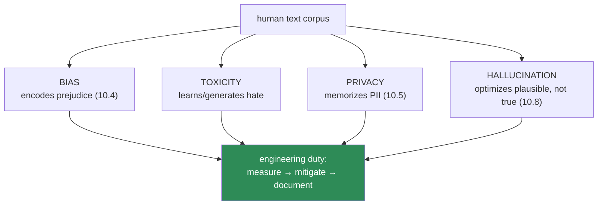
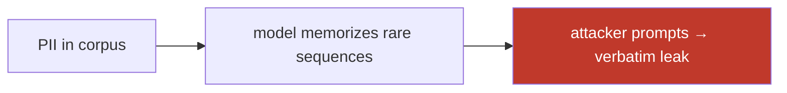
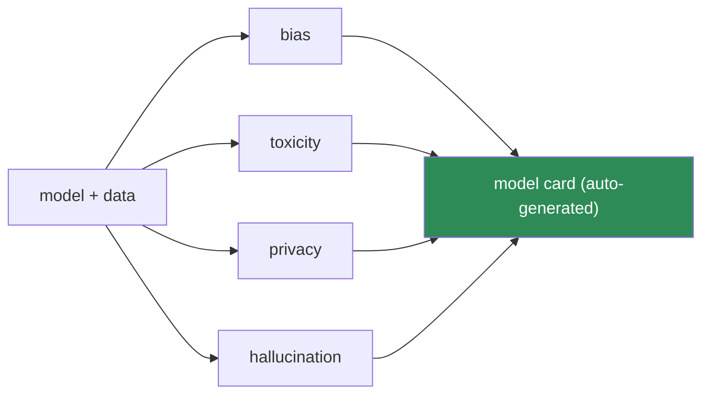

# 10.14 · NLP Ethics & Safety — Bias, Toxicity, PII, Hallucination

[⬅ 10.13 Production](10.13-production.md) · [🏠 Module 10](../README.md) · [➡ 10.15 Projects & Summary](10.15-projects-summary.md)

> **The lesson in one line:** Language models learn from human text, so they inherit human bias, memorize human secrets, and generate confident falsehoods — and identifying and reducing these harms is an engineering responsibility, not a footnote.

---

## 🎯 Learning objectives

- Understand the four core NLP harms — **bias, toxicity, privacy/PII leakage, and hallucination** — and *why each is structural*, not incidental.
- Learn to **measure** each harm, not just gesture at it.
- Apply concrete **mitigation** techniques at the data, model, and system levels.
- Adopt the documentation practices (**model cards, datasheets**) that make risks visible and accountable.

## ✅ Prerequisites

- [10.4 embedding bias](10.4-word-embeddings.md), [10.10 data bias & PII](10.10-nlp-data.md) — this lesson consolidates and extends them.
- [08.16 fairness & interpretability](../../08-Machine-Learning/weeks/08.16-interpretability.md) — the fairness-impossibility result applies here.

---

## 🧠 Mental model

> [!IMPORTANT]
> **Every NLP harm traces back to one fact: the model learns language from a corpus of human text, and human text contains prejudice, private information, and falsehood stated confidently.** Bias isn't a bug someone introduced — it's the faithful reflection of a biased world ([the distributional hypothesis, 10.1](10.1-introduction-to-nlp.md), doing its job too well). You cannot "turn off" these harms; you can only measure, reduce, and stay accountable for them. Treating that as optional is how engineers ship discriminatory or dangerous systems while believing they were neutral.



---

## Harm 1 — Bias

Consolidating [10.4](10.4-word-embeddings.md) and [10.10](10.10-nlp-data.md): bias enters through the data, is encoded as geometry in embeddings, and is amplified by deployment decisions.

**Measure it.** Don't assert bias — quantify it:
- **Embedding association tests (WEAT):** measure whether "he" sits closer to "engineer" than "she" does, across many word sets — a statistical bias score ([10.4](10.4-word-embeddings.md)).
- **Disaggregated metrics:** compute your model's error/false-positive rate *per demographic group*. Equal overall accuracy can hide that the model fails twice as often for one group ([08.16 fairness](../../08-Machine-Learning/weeks/08.16-interpretability.md)).
- **Counterfactual tests:** swap "he"→"she", "John"→"Jamal" in the same sentence and check whether the prediction changes. If "John is a doctor" and "Jamal is a doctor" score differently, that's measurable bias.

**Mitigate it.** At three levels:
- **Data:** balanced sampling, augmentation to fill gaps, careful annotation ([10.10](10.10-nlp-data.md)).
- **Model:** debiasing (project out a bias direction) — but [10.4](10.4-word-embeddings.md)'s caveat holds: it's partial and can *hide* rather than remove bias.
- **System:** human review of consequential decisions; never fully automate hiring, lending, or moderation on a biased model.

> [!CAUTION]
> **Removing the protected attribute does not remove the bias** ([08.16 proxies](../../08-Machine-Learning/weeks/08.16-interpretability.md)). Deleting "gender" from a résumé model doesn't help — name, pronouns, school, and word choice reconstruct it. In NLP this is acute because *everything is a proxy*: writing style correlates with demographics. You can't sanitize your way out; you must measure outcomes.

---

## Harm 2 — Toxicity

Models trained on internet text learn to recognize *and generate* hate speech, harassment, and slurs. Two failure modes:

1. **Generating toxicity** — a generative model ([10.8](10.8-seq2seq.md)) completes a prompt with a slur or threat.
2. **Biased toxicity detection** — a moderation model that flags African-American English or reclaimed slurs as "toxic" at higher rates, silencing the groups it should protect ([10.10 label bias](10.10-nlp-data.md)).

**Mitigate:** content filters on inputs and outputs, toxicity classifiers (themselves audited for bias), reinforcement learning from human feedback (RLHF — [Module 11](../../11-LLMs/README.md)) to suppress harmful generation, and human-in-the-loop for edge cases.

> [!CAUTION]
> **Toxicity detection is a fairness minefield.** The [Sap et al. finding (10.10)](10.10-nlp-data.md) is essential: naive toxicity models penalize dialects and reclaimed language, so a moderation system meant to protect marginalized groups can end up disproportionately censoring them. Always disaggregate a toxicity classifier's error rates by dialect/group before deploying.

---

## Harm 3 — Privacy & PII leakage

Two distinct risks (consolidating [10.5](10.5-sequence-models.md), [10.10](10.10-nlp-data.md)):

**A. PII in training data.** Free text is dense with names, addresses, medical details ([10.10](10.10-nlp-data.md)). If it's in the corpus, it's in the model.

**B. Memorization and extraction.** Language models **memorize** rare training sequences verbatim and can be prompted to **regurgitate** them — real credit card numbers, addresses, and private messages have been extracted from production models.



**Mitigate:**
- **Redact PII at ingestion** ([10.10](10.10-nlp-data.md)) — the only robust defense is *not training on it*. Use NER ([10.6](10.6-nlp-tasks.md)) to find and mask it.
- **Deduplicate** ([10.10](10.10-nlp-data.md)) — memorization risk rises sharply with how often a sequence repeats.
- **Differential privacy** in training — bounds how much any single example influences the model (with an accuracy cost).
- **Output filtering** — scan generations for PII patterns before returning them.

> [!IMPORTANT]
> **"We only shipped the model, not the data" is false comfort.** A model *is* a lossy, queryable compression of its training data. Membership-inference attacks reveal whether a specific person's text was in training; extraction attacks recover it. Treat a model trained on sensitive text as a **sensitive artifact** subject to the same controls as the data ([10.4](10.4-word-embeddings.md), [10.11](10.11-nlp-with-pytorch.md)).

---

## Harm 4 — Hallucination

A generative model ([10.8](10.8-seq2seq.md)) produces **fluent, confident text that is factually wrong** — invented citations, fake statistics, plausible-sounding falsehoods. This is not a rare glitch; it's inherent to how generation works.

> [!IMPORTANT]
> **Hallucination is structural: a language model is trained to produce *probable* text, not *true* text** ([10.8 decoding](10.8-seq2seq.md), [10.9 metrics](10.9-evaluation.md)). It has no notion of truth — only of what tokens plausibly follow. A confident, well-formed lie *is* high-probability text. This is why [10.9](10.9-evaluation.md) stressed that fluency metrics (perplexity, BLEU) don't measure correctness, and why a summarizer can score high ROUGE while fabricating facts.

**Mitigate:**
- **Retrieval-augmentation (RAG, [Module 13](../../13-RAG/README.md))** — ground generation in retrieved documents so the model quotes sources instead of inventing.
- **Cite and verify** — require the model to point to evidence; check it.
- **Confidence calibration & abstention** — teach the model to say "I don't know" ([08.16 calibration](../../08-Machine-Learning/weeks/08.16-interpretability.md)).
- **Human review for high-stakes output** — medical, legal, financial text must not be trusted unverified.

---

## The four harms, together

| Harm | Root cause | Measure | Mitigate |
|---|---|---|---|
| **Bias** | corpus reflects a biased world | WEAT, disaggregated metrics, counterfactuals | balanced data, debiasing, human review |
| **Toxicity** | internet text contains hate | audited toxicity classifiers | filters, RLHF, human-in-loop |
| **Privacy** | PII in corpus + memorization | membership/extraction tests | redact at ingestion, dedup, DP, output filter |
| **Hallucination** | trained for probable, not true | factuality/faithfulness checks | RAG, citations, calibration, review |

---

## Documentation — making risk accountable

You cannot manage what you don't document. Two standard artifacts:

- **Datasheets for datasets** ([10.10](10.10-nlp-data.md), Gebru et al.) — how the data was collected, its biases, its limitations, consent/licensing.
- **Model cards** (Mitchell et al.) — intended use, out-of-scope use, disaggregated performance, known biases, and ethical considerations.

> [!TIP]
> **A model card is where "we tested for bias" becomes verifiable.** It forces you to report performance *per group*, state intended and forbidden uses, and name known failure modes — before deployment, in writing. Shipping a consequential NLP system without one is a professional lapse, and increasingly a regulatory one (the EU AI Act and similar require exactly this kind of documentation).

---

## 🏭 Production examples

| System | Primary harm | Guardrail |
|---|---|---|
| **Résumé screener** | bias | disaggregated metrics; human-in-loop; often **don't build it** |
| **Content moderation** | toxicity + bias | dialect-audited classifier; human appeal path |
| **Chatbot / assistant** | hallucination + PII | RAG grounding; output PII filter; abstention |
| **Healthcare NLP** | privacy + hallucination | PII redaction; verified output; never autonomous |
| **Any model on user text** | privacy | redact at ingestion; model card |

## ⚡ Performance considerations

- **Guardrails add latency** — input/output filters, PII scanners, and retrieval each cost time ([10.13](10.13-production.md)). Budget for them; they're not optional.
- **Differential privacy costs accuracy** — a real tradeoff to negotiate, not ignore.
- **Human review doesn't scale** — reserve it for high-stakes decisions; use confidence thresholds to route only uncertain cases to humans.

## 🔒 Security & privacy considerations

> [!CAUTION]
> This lesson *is* the security & privacy section for NLP. The through-line: **an NLP model is a queryable compression of human text, so it inherits that text's biases, secrets, and falsehoods.** Concretely — audit for bias with disaggregated metrics; redact PII at ingestion and filter outputs; treat models trained on sensitive data as sensitive; ground generation to fight hallucination; and document everything in a model card. **Assume adversaries will probe your model to extract data and elicit harm — because they will.**

## 🚫 Common mistakes

| Mistake | Consequence |
|---|---|
| **Assuming the model is "neutral"** | ships a biased system while believing it's fair |
| **Removing protected attributes to "fix" bias** | proxies reconstruct them; bias persists, now hidden |
| **Deploying a toxicity model without dialect audit** | censors the groups it should protect |
| **Training on un-redacted PII** | memorization → extraction → breach |
| **Trusting fluent generation as factual** | hallucinations delivered confidently |
| **No model card / datasheet** | unaccountable, undocumented, increasingly illegal |
| **Fully automating consequential decisions** | no human check on biased/wrong outputs |

## ✅ Best practices

- **Measure every harm** — WEAT, disaggregated metrics, counterfactuals, extraction tests, factuality checks. No assertions without numbers.
- **Redact PII at ingestion; filter outputs; dedup** — the only robust privacy defenses.
- **Audit toxicity classifiers for dialect/group bias** before deploying.
- **Ground generation (RAG) and require citations** to fight hallucination; enable abstention.
- **Keep a human in the loop** for hiring, lending, moderation, medical, and legal decisions.
- **Write a datasheet and a model card** — document intended use, disaggregated performance, and known risks.
- **Sometimes the right decision is not to build it** — a résumé-ranking model on biased data may have no safe version.

## 🏋️ Exercises

1. **Measure embedding bias.** Implement a WEAT-style test on pretrained embeddings for gender-profession associations. Report the effect size. Which professions are most skewed?
2. **Disaggregate.** Take a toxicity classifier and a labeled set with dialect markers (use published research data). Compute false-positive rates per group. Is the model fair?
3. **Counterfactual test.** For a sentiment/hiring model, swap names/pronouns in 50 sentences and measure how often the prediction flips. Quantify the bias.
4. **Extraction demo.** On a small model you fine-tune on a corpus with planted "canary" strings (fake PII), test whether prompting can extract them. Vary duplication count and observe memorization.
5. **Hallucination audit.** Prompt a generative model for factual claims (dates, citations). Verify each. Report the hallucination rate and one confident-but-false example.
6. **Write a model card.** For any model you built in this module, write a complete model card: intended use, out-of-scope use, disaggregated metrics, known biases, limitations.

## 🛠️ Mini project — "An NLP Safety Audit Toolkit"

**Goal:** a reusable toolkit that audits any NLP model for the four harms and emits a model card — turning "we should think about ethics" into a repeatable, quantitative gate.

**Requirements**
- **Bias module:** WEAT on embeddings + disaggregated-metrics + counterfactual tests.
- **Toxicity module:** run a toxicity classifier, disaggregate its errors by group.
- **Privacy module:** PII scanner (NER) over training data + a canary-based memorization/extraction test.
- **Hallucination module:** a factuality check for generative models (claim → verify against a source).
- **Report generator:** auto-produce a **model card** with all measurements.

**Folder structure**
```
nlp-safety-audit/
├── bias.py            # WEAT, disaggregated metrics, counterfactuals
├── toxicity.py        # classifier + group-disaggregated errors
├── privacy.py         # PII scan + canary extraction test
├── hallucination.py   # claim extraction + verification
├── model_card.py      # assemble the report
└── README.md
```

**Architecture diagram**


**Testing:** validate each metric against a known-biased and a known-clean reference; assert the canary test detects planted PII; assert the report includes all four harm sections.
**Evaluation:** run it on models you built earlier in the module — what does it reveal?
**Future improvements:** wire the audit into CI as a **deployment gate** ([08.17 retraining gate](../../08-Machine-Learning/weeks/08.17-production-ml.md)) — a model that fails the bias/privacy thresholds cannot ship. This is the [credit-risk fairness-audit-that-fails-the-build (08.18)](../../08-Machine-Learning/weeks/08.18-projects-summary.md), for text.

## 📄 Cheat sheet

| Harm | Root cause | Fix |
|---|---|---|
| **Bias** | biased corpus → biased geometry (10.4) | measure (WEAT, disaggregate), balance, human review |
| **Toxicity** | internet text | audited filters, RLHF; **check dialect fairness** |
| **⭐ Privacy** | PII in corpus + **memorization** | **redact at ingestion**, dedup, DP, output filter |
| **⭐ Hallucination** | trained for **probable, not true** | RAG grounding, citations, calibration, review |
| **Proxies** | everything correlates with demographics | removing the attribute doesn't remove the bias |
| **⭐ Docs** | accountability | **datasheet + model card** |

**⭐ An NLP model is a queryable compression of human text — bias, secrets, and falsehood included.**

## 🎴 Flashcards

- **⭐ Why is NLP bias structural, not a bug?** → Models learn meaning from human co-occurrence (10.1), so they faithfully encode human prejudice; you can only measure and reduce it.
- **How do you measure bias?** → WEAT (embedding associations), disaggregated metrics per group, and counterfactual swaps.
- **Why doesn't removing the protected attribute fix bias?** → Proxies (name, style, school) reconstruct it — in text, everything correlates with demographics.
- **⭐ What are the two privacy risks?** → PII in the training corpus, and memorization → extraction (models regurgitate rare training sequences).
- **What's the only robust privacy defense?** → Don't train on PII — redact at ingestion; dedup reduces memorization.
- **⭐ Why is hallucination structural?** → Generation optimizes *probable* text, not *true* text — a fluent lie is high-probability.
- **How do you fight hallucination?** → RAG grounding, required citations, calibration/abstention, human review.
- **Why is toxicity detection a fairness minefield?** → Naive models flag dialects/reclaimed language, censoring the groups they should protect.
- **What documents make NLP risk accountable?** → Datasheets (data) and model cards (model): intended use + disaggregated performance + known risks.

## 💬 Interview questions

1. Why is bias in NLP models structural rather than incidental? How would you measure and reduce it?
2. Why doesn't removing a protected attribute eliminate bias, especially in text?
3. Explain the two distinct privacy risks in NLP and how to mitigate each.
4. Why do language models hallucinate, and what are the leading mitigations?
5. Why is deploying a toxicity classifier a fairness risk, and how do you check for it?
6. What goes in a model card, and why does it matter legally and ethically?

## 📝 Summary

- Every NLP harm has one root: **the model learns from human text and inherits its bias, secrets, and falsehoods** — none of these are optional footnotes.
- **Bias** is structural (encoded as embedding geometry); measure it (WEAT, disaggregated metrics, counterfactuals) because removing protected attributes doesn't remove it.
- **Toxicity** cuts both ways — models generate it, and naive detectors censor dialects; audit for group fairness.
- **Privacy** has two faces — PII in the corpus and **memorization/extraction**; the only robust defense is not training on it (redact at ingestion, dedup).
- **Hallucination** is inherent — models optimize *probable*, not *true*; fight it with RAG grounding, citations, and review.
- **Document everything** in datasheets and model cards, and keep humans in the loop for consequential decisions — sometimes the right call is not to build it.

## 📚 References

1. **Bolukbasi et al. (2016) — _Man is to Computer Programmer…_** & **Caliskan et al. (2017) — _Semantics derived automatically… contain human biases_ (WEAT).** ⭐ Measuring embedding bias.
2. **Carlini et al. (2021) — _Extracting Training Data from Large Language Models_.** ⭐⭐ The memorization/extraction attack.
3. **Mitchell et al. (2019) — _Model Cards for Model Reporting_** & **Gebru et al. (2018) — _Datasheets for Datasets_.** ⭐ The documentation standards.
4. **Sap et al. (2019) — _The Risk of Racial Bias in Hate Speech Detection_.** Toxicity detection's fairness problem.
5. **Bender, Gebru et al. (2021) — _On the Dangers of Stochastic Parrots_.** ⭐ The consolidated critique of large LM harms.
6. **Ji et al. (2023) — _Survey of Hallucination in Natural Language Generation_.** The hallucination taxonomy and mitigations.

---

## 🧭 Navigation

| Direction | Link |
|---|---|
| ⬅ Previous | [10.13 · NLP Production Systems](10.13-production.md) |
| ➡ Next | [10.15 · Projects & Summary](10.15-projects-summary.md) |
| 🏠 Module | [Module 10](../README.md) |
| 📖 Lessons | [Lesson index](README.md) |
