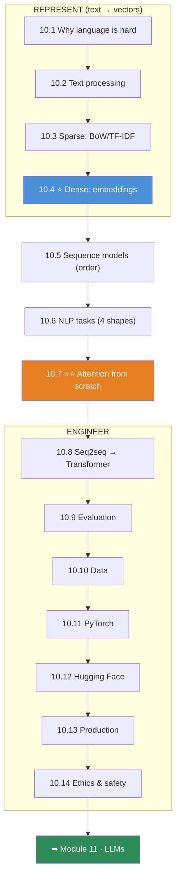
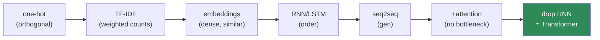

# 10.15 · Projects & Module Summary

[⬅ 10.14 Ethics & Safety](10.14-ethics-safety.md) · [🏠 Module 10](../README.md) · [➡ Module 11 · LLMs](../../11-LLMs/README.md)

> **The lesson in one line:** Seven projects that trace the whole arc — from a bag-of-words spam filter to an attention mechanism you wrote by hand — plus the consolidation of everything this module taught, aimed straight at the Transformer.

---

## The seven projects

| # | Project | Proves you can | Lessons |
|---|---|---|---|
| 1 | **Spam Classifier** | ship a strong count-based baseline | [10.3](10.3-text-representation.md) |
| 2 | **Sentiment Analysis System** | use order & context (embeddings + sequence) | [10.4](10.4-word-embeddings.md), [10.5](10.5-sequence-models.md), [10.11](10.11-nlp-with-pytorch.md) |
| 3 | **Named Entity Recognition System** | per-token tagging + PII redaction | [10.6](10.6-nlp-tasks.md) |
| 4 | **Semantic Search Engine** | meaning-based retrieval | [10.4](10.4-word-embeddings.md) |
| 5 | **Text Similarity Engine** | pair scoring, bi/cross-encoders | [10.6](10.6-nlp-tasks.md) |
| 6 | **Attention From Scratch** ⭐ | build the mechanism that runs modern AI | [10.7](10.7-attention.md) |
| 7 | **Sequence-to-Sequence Translator** | encoder–decoder + attention end to end | [10.8](10.8-seq2seq.md) |

```
code/10-nlp/
├── README.md
├── requirements.txt        # numpy, scikit-learn, torch, transformers, faiss
├── spam-classifier/        # 1  (10.3) — the baseline everything must beat
├── sentiment-system/       # 2  (10.4, 10.5, 10.11)
├── ner-system/             # 3  (10.6) — + PII redaction
├── semantic-search/        # 4  (10.4) — becomes a RAG retriever (Module 13)
├── text-similarity/        # 5  (10.6)
├── attention-from-scratch/ # 6  ⭐ (10.7) — the flagship
├── seq2seq-translator/     # 7  (10.8)
└── shared/                 # vocab, preprocessing, the 09.10 trainer
```

> [!IMPORTANT]
> **The load-bearing project is #6, Attention From Scratch.** Everything before it builds the need for attention (sparse→dense→sequence→bottleneck); attention resolves it; and #7 assembles attention into a working translator that is one step from a Transformer. **Build #6 well and [Module 11](../../11-LLMs/README.md) is assembly, not discovery.**

---

## Project highlights

**Project 1 — Spam Classifier.** Full spec in [10.3](10.3-text-representation.md). TF-IDF from scratch (verified vs sklearn), logistic regression / Naive Bayes, cost-tuned threshold. **The baseline every later project must beat — and often barely does, which is the point.**

**Project 2 — Sentiment Analysis System.** Embeddings + BiLSTM ([10.5](10.5-sequence-models.md), [10.11](10.11-nlp-with-pytorch.md)), proven to beat the baseline *specifically on negation/order* cases. Then fine-tune a Transformer ([10.12](10.12-modern-libraries.md)) and chart the data-efficiency win.

**Project 3 — NER System.** Full spec in [10.6](10.6-nlp-tasks.md). BiLSTM(-CRF), entity-level F1, and a **PII-redaction demo** — the privacy application ([10.14](10.14-ethics-safety.md)).

**Project 4 — Semantic Search Engine.** Full spec in [10.4](10.4-word-embeddings.md). Embed corpus offline, retrieve by cosine + ANN. **Finds documents that share no keywords with the query — what TF-IDF cannot do.** Becomes a [RAG retriever (Module 13)](../../13-RAG/README.md).

**Project 5 — Text Similarity Engine.** Bi-encoder vs cross-encoder ([10.6](10.6-nlp-tasks.md)); the retrieve-then-rerank pattern; the latency/accuracy tradeoff made concrete.

**Project 6 — Attention From Scratch ⭐.** Full spec in [10.7](10.7-attention.md). Scaled dot-product, self-, and multi-head attention in NumPy, verified against PyTorch with `torch.allclose`. The polysemy demo ("river bank" vs "money bank"). **The single most important thing you build in this module.**

**Project 7 — Seq2Seq Translator.** Full spec in [10.8](10.8-seq2seq.md). Encoder–decoder + cross-attention + teacher forcing + beam search + BLEU + alignment heatmaps. The with/without-attention ablation proves the bottleneck's cost. **Swap the RNN for self-attention and you have a Transformer.**

---

## 📊 Module Summary — everything, connected

### The fifteen lessons as one arc



### The ideas that did the most work

| Idea | Where it reappeared |
|---|---|
| **⭐ Text → vectors without losing meaning** | every lesson from 10.3 |
| **⭐ Sparse → dense → contextual** | 10.3 (orthogonal) → 10.4 (similar) → 10.7 (context-aware) |
| **⭐ The distributional hypothesis** | 10.1 → TF-IDF (10.3) → Word2Vec (10.4) → attention (10.7) |
| **Word order is signal** | discarded (10.3), kept (10.5), positioned (10.7) |
| **⭐ `predicted − actual` gradient** | Word2Vec (10.4), every classifier (10.6, 10.11) — from [09.4](../../09-Deep-Learning/weeks/09.4-backpropagation.md) |
| **⭐ softmax(QKᵀ/√d)·V** | 10.7 (built), 10.8 (fixes seq2seq) → Module 11 |
| **The fixed-vector bottleneck** | seq2seq fails (10.5, 10.8) → attention wins |
| **⭐ The training loop never changes** | 10.11 = [09.10](../../09-Deep-Learning/weeks/09.10-training-loop.md), unchanged |
| **Evaluation & MLOps don't change** | 10.9, 10.13 inherit [Module 08](../../08-Machine-Learning/README.md) |
| **⭐ Bias/PII are structural in language** | 10.4 → 10.10 → 10.14 |

> [!IMPORTANT]
> **The whole module was one question — "text → vectors without losing meaning" — answered better and better.** One-hot lost everything but presence. BoW/TF-IDF kept frequency but not order or similarity. Embeddings gave similarity but one frozen vector per word. Sequence models restored order but choked on distance and couldn't parallelize. **Attention gave direct access to every token, context-aware vectors, and parallelism — and that is why it became the Transformer.** You didn't just learn the history; you built the final answer by hand.

### The lineage, one more time



---

## ✅ Self-assessment

**Representation**
- [ ] I can explain why one-hot/BoW are "meaning-blind" (orthogonality)
- [ ] I can derive TF-IDF and explain why IDF uses a log
- [ ] I can explain what embeddings fix and how Word2Vec + negative sampling work
- [ ] I know the one thing static embeddings can't do (context)

**Sequence & attention**
- [ ] I can explain why word order is signal and how a hidden state captures it
- [ ] I can connect the vanishing gradient to concrete NLP failures
- [ ] I can **write scaled dot-product attention from scratch** and explain every term
- [ ] I understand why the `√d_k` scaling exists
- [ ] I can explain the seq2seq bottleneck and how attention resolves it

**Engineering**
- [ ] I can name the four NLP I/O shapes and pick the right head/metric
- [ ] I know why BLEU/ROUGE/perplexity are useful *and* misleading
- [ ] I know inter-annotator agreement is the ceiling on model accuracy
- [ ] I can build the full PyTorch pipeline (vocab → embed → encode → head)
- [ ] I know why the tokenizer must ship with the model (skew)
- [ ] I can name the four NLP harms and how to measure/mitigate each

---

## 🎯 What this module bought you

**Before:** text was a mysterious input, embeddings were "vectors somehow," attention was an equation you'd seen but not felt, and Transformers were magic.

**Now:**
- You know **all of NLP is one problem** — text → vectors without losing meaning — and you know the sparse→dense→contextual arc that solves it.
- You **built attention by hand** and proved it matches PyTorch — so `nn.MultiheadAttention` is transparent.
- You understand **why every design exists**: embeddings fix orthogonality, LSTMs fix vanishing gradients, attention fixes the bottleneck and non-parallelism.
- You can build, evaluate, and **ship** NLP systems, and you know the **data, bias, PII, and hallucination** risks that come with them.
- You know **when the simple thing wins** — TF-IDF + logistic regression is still a real baseline.

**You understand how computers represent, process, analyze, and generate human language — from first principles up to the doorstep of the Transformer.** That was the goal.

---

## 🧭 Where this leads

| Next | What Module 10 gives you |
|---|---|
| [**11 · LLMs**](../../11-LLMs/README.md) | ⭐ **Everything.** The Transformer is your attention (10.7) + FFN + LayerNorm + residuals, scaled |
| [**13 · RAG**](../../13-RAG/README.md) | Your semantic search (10.4) *is* the retriever |
| [**15 · Fine-Tuning**](../../15-Fine-Tuning/README.md) | Fine-tuning (10.12) + transfer learning = the whole subject |
| [**16 · MLOps**](../../16-MLOps/README.md) | Your production/monitoring (10.13) generalizes |

> [!IMPORTANT]
> **Module 11 will build a Transformer, and you already own its heart.** Self-attention ([10.7](10.7-attention.md)) — you wrote it. The feed-forward block — [Linear → GELU → Linear (09.8)](../../09-Deep-Learning/weeks/09.8-building-models.md). LayerNorm and residuals — [09.11](../../09-Deep-Learning/weeks/09.11-cnns.md)/[09.13](../../09-Deep-Learning/weeks/09.13-regularization.md). Positional encoding — because attention is order-blind ([10.7](10.7-attention.md)). Subword tokenization — [10.2](10.2-text-processing.md)/[10.12](10.12-modern-libraries.md). Trained with [the loop you built (09.10)](../../09-Deep-Learning/weeks/09.10-training-loop.md), decoded with the strategies from [10.8](10.8-seq2seq.md), evaluated with perplexity ([10.9](10.9-evaluation.md)). **There is nothing left in a Transformer that is new to you. Module 11 is assembly.**

---

## 📄 Module cheat sheet

| Lesson | The one thing |
|---|---|
| **10.1** | NLP = text → vectors without losing meaning; language is ambiguous/contextual/compositional |
| **10.2** | preprocessing is lossy; **subword tokenization** kills unknown words |
| **10.3** | one-hot/BoW/**TF-IDF** — sparse, meaning-blind; still a real baseline |
| **10.4** | ⭐ embeddings = **meaning as geometry**; Word2Vec + negative sampling |
| **10.5** | word order is signal; LSTM fixes vanishing gradient; **seq2seq bottleneck** |
| **10.6** | four I/O shapes → head + metric; NER needs a CRF |
| **10.7** | ⭐⭐ **attention = softmax(QKᵀ/√d)·V**; contextual embeddings; O(n²) |
| **10.8** | encoder–decoder + teacher forcing + beam; drop the RNN → Transformer |
| **10.9** | F1 (classify), **BLEU/ROUGE/perplexity** (generate) — all lie; human eval is truth |
| **10.10** | labels are the bottleneck; **IAA is the accuracy ceiling**; dedup before splitting |
| **10.11** | the [09.10 loop](../../09-Deep-Learning/weeks/09.10-training-loop.md), unchanged + a text front end; pad/pack/mask |
| **10.12** | Hugging Face = it all, pretrained; **fine-tune, don't train from scratch** |
| **10.13** | ⭐ **train/serve skew** is the #1 bug; ship the tokenizer; pre-embed offline |
| **10.14** | bias/toxicity/PII/hallucination are **structural**; measure, mitigate, document |

**⭐ The one equation:** `Attention(Q,K,V) = softmax(QKᵀ/√dₖ)·V`.
**⭐ The one idea:** text → vectors without losing meaning, done better and better until it became the Transformer.

---

## 📚 References — the short list

1. **Jurafsky & Martin — _Speech and Language Processing_ (3rd ed., free).** ⭐⭐ The whole module, rigorously.
2. **Vaswani et al. (2017) — _Attention Is All You Need_.** ⭐⭐ Read it now — you understand every line.
3. **Jay Alammar — _The Illustrated Word2Vec_ & _The Illustrated Transformer_.** ⭐ The best visual intuition.
4. **Hugging Face — _NLP Course_.** ⭐ The modern practical path.
5. **Mikolov (2013), Bahdanau (2014), Devlin/BERT (2019).** The papers behind the lineage.
6. **Tunstall, von Werra & Wolf — _NLP with Transformers_.** The production bridge to Module 11.

---

## 🧭 Navigation

| Direction | Link |
|---|---|
| ⬅ Previous | [10.14 · NLP Ethics & Safety](10.14-ethics-safety.md) |
| ➡ Next module | [11 · LLMs](../../11-LLMs/README.md) |
| 🏠 Module | [Module 10](../README.md) |
| 📖 All lessons | [Lesson index](README.md) |
| 🗺 Roadmap | [ROADMAP.md](../../../ROADMAP.md) |
