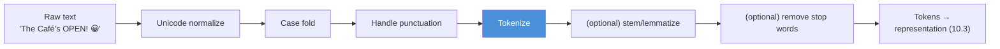
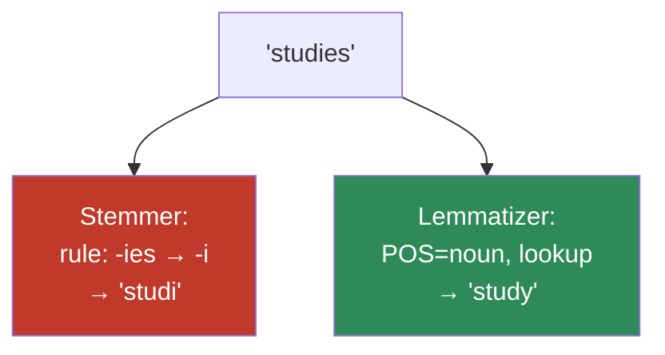
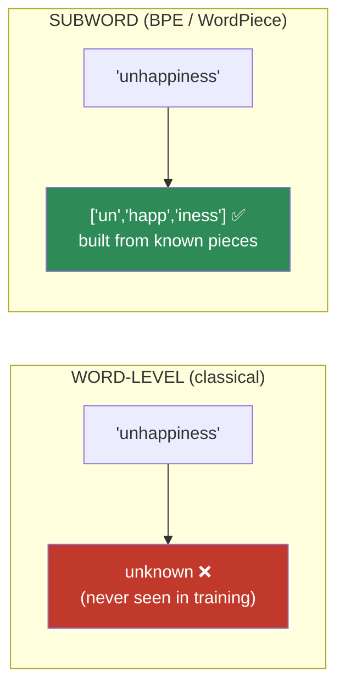
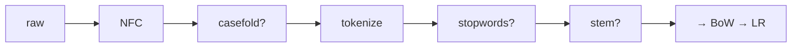

# 10.2 · Text Processing — Normalization, Tokenization, and What It Costs

[⬅ 10.1 Introduction](10.1-introduction-to-nlp.md) · [🏠 Module 10](../README.md) · [➡ 10.3 Text Representation](10.3-text-representation.md)

> **The lesson in one line:** Every preprocessing step is a lossy compression of your text — some steps recover signal, others destroy it, and knowing which is which is the difference between a working system and a silently broken one.

---

## 🎯 Learning objectives

- Turn raw bytes into clean tokens: **Unicode normalization, case folding, punctuation handling, tokenization, sentence segmentation**.
- Implement a tokenizer from scratch and understand why "split on whitespace" is a trap.
- Distinguish **stemming** from **lemmatization** and know when each is worth its cost.
- Internalize the central discipline: **preprocessing is lossy — justify every step by the downstream task**.
- Understand why modern NLP largely *abandoned* aggressive preprocessing in favor of **subword tokenization**.

## ✅ Prerequisites

- [10.1](10.1-introduction-to-nlp.md) — the long tail and the "text → vectors" framing.
- Comfort with Python strings and Unicode basics (you know `str` is not `bytes`).

---

## 🧠 Mental model

> [!IMPORTANT]
> **Preprocessing is a series of controlled information losses.** Each step — lowercasing, stemming, removing stop words — deletes distinctions. The art is deleting distinctions that are *noise for your task* while preserving the ones that are *signal*. There is no universally correct pipeline; there is only "correct for this task, with this model."

The mistake beginners make is treating preprocessing as a fixed ritual you always perform. The senior view: **preprocessing is a set of dials, each with a cost, that you tune against a downstream metric.** Lowercasing helps topic classification and destroys named-entity recognition. Stemming helps sparse bag-of-words and is pointless with subword embeddings. The dial is never "on" by default.



---

## Stage 1 — Unicode normalization (the step everyone skips and regrets)

Before you can process text you must agree on what the *characters* are. Unicode has a nasty property: **the same visible string can have different byte representations.**

The character "é" can be:
- **One code point:** U+00E9 (`é`, "precomposed").
- **Two code points:** U+0065 + U+0301 (`e` + combining acute accent, "decomposed").

They look identical. `"café" == "café"` can be `False`. Your vocabulary treats them as two different words. Your `set()` of unique tokens double-counts.

```python
import unicodedata

a = "café"                      # precomposed é
b = "café"                # e + combining accent
print(a == b)                   # False  ← the silent bug

# NFC = Normalization Form Composed — collapse to the single-code-point form
print(unicodedata.normalize("NFC", a) == unicodedata.normalize("NFC", b))  # True
```

| Form | What it does | Use when |
|---|---|---|
| **NFC** | compose to precomposed form | ⭐ the default for storage/comparison |
| **NFD** | decompose to base + combining marks | when stripping accents |
| **NFKC** | NFC + compatibility folding (½ → 1/2, fi → fi) | search/matching where visual variants should collapse |
| **NFKD** | NFD + compatibility | aggressive normalization |

> [!CAUTION]
> **NFKC is lossy in ways you may not want.** It turns "①" into "1", full-width "Ａ" into "A", and the ligature "ff" into "ff". Great for a search index, potentially wrong if those distinctions matter. Choose deliberately; don't cargo-cult `NFKC`.

Other byte-level gremlins to normalize: smart quotes (`"` vs `"`), non-breaking spaces (U+00A0 that isn't a regular space), zero-width characters, and the classic **mojibake** (UTF-8 decoded as Latin-1, turning "café" into "café").

---

## Stage 2 — Case folding

Lowercasing shrinks the vocabulary: "The", "the", "THE" become one token. That's a real win for sparse representations. But it is **lossy**, and sometimes the loss is the signal:

| Original | Lowercased | Distinction destroyed |
|---|---|---|
| "US" (the country) | "us" (pronoun) | entity vs pronoun |
| "Apple" (company) | "apple" (fruit) | named entity |
| "MAY" (shouting) | "may" | sentiment / emphasis |
| "iPhone" | "iphone" | brand casing |

> [!TIP]
> Case is **noise for topic classification** (you don't care about "The" vs "the") and **signal for NER** (capitalization is a strong feature that a token is a proper noun). Same dial, opposite settings. This is the whole lesson in one example.

Note: use `str.casefold()`, not `str.lower()`, for robust Unicode folding (it handles the German ß → "ss", among others).

---

## Stage 3 — Tokenization

Tokenization splits a string into the units you'll represent. This is deceptively hard.

### Why "split on whitespace" fails

```python
text = "Dr. Smith said it's 3:30—don't be late! (see https://x.co)"
text.split()
# ['Dr.', 'Smith', 'said', "it's", '3:30—don't', 'be', 'late!', '(see', 'https://x.co)']
```

Look at the damage: `"late!"` glues punctuation to the word, `"it's"` is one token (is that `it` + `'s`? one word?), `"3:30—don't"` is a mangled clump, the URL is broken. Whitespace splitting is fine for a quick demo and wrong for production.

### A from-scratch regex tokenizer

The classic approach: define what a token *is* with a regex, then find all matches. This is roughly what NLTK's `word_tokenize` does under the hood.

```python
import re

def tokenize(text):
    # Order matters: match URLs/emails first, then words (with internal ' and -),
    # then standalone punctuation. This is a *policy*, not a truth.
    pattern = r"""
        (?:https?://\S+)            # URLs
      | (?:[A-Za-z0-9._%+-]+@[A-Za-z0-9.-]+)  # emails
      | (?:[A-Za-z]+(?:['-][A-Za-z]+)*)       # words: don't, state-of-the-art
      | (?:\d+(?:[.,:]\d+)*)        # numbers: 3.14, 3:30, 1,000
      | (?:[^\s\w])                 # any single punctuation mark
    """
    return re.findall(pattern, text, re.VERBOSE)

print(tokenize("Dr. Smith said it's 3:30—don't be late!"))
# ['Dr', '.', 'Smith', 'said', "it's", '3:30', '—', "don't", 'be', 'late', '!']
```

Better — but notice `"Dr"` and `"."` split, losing the abbreviation. Every rule you add fixes one case and breaks another. **Tokenization is a bottomless pit of edge cases**, which is precisely why the field eventually stopped hand-writing rules and learned tokenization statistically (subwords, below).

### Language matters

- **Chinese/Japanese/Thai** have no spaces between words — word segmentation is itself an ML problem.
- **German** compounds words: "Rindfleischetikettierungsüberwachungsaufgabenübertragungsgesetz" is one legal token.
- **Arabic/Hebrew** are morphologically rich; a single written form encodes what English needs several words for.

This is *why* subword tokenization is language-agnostic: it doesn't assume spaces mean anything.

---

## Stage 4 — Sentence segmentation

Splitting text into sentences sounds like "split on `.`" — and that's wrong immediately: "Dr. Smith paid $3.50 to Yahoo! in the U.S.A." has one sentence and five periods that don't end it. Real segmenters use a trained model or a curated abbreviation list. Use a library (spaCy, NLTK's Punkt); do not write this yourself for production.

---

## Stemming vs lemmatization

Both reduce inflected forms to a common base so that "run", "running", "ran" don't occupy three separate vocabulary slots. They differ in method and cost.

| | **Stemming** | **Lemmatization** |
|---|---|---|
| Method | chop off suffixes with rules (Porter/Snowball) | dictionary + POS → the real base form |
| "studies" → | "studi" | "study" |
| "better" → | "better" | "good" (knows it's an adjective form) |
| "was" → | "wa" | "be" |
| Output a real word? | ❌ often not | ✅ always |
| Speed | very fast | slower (needs POS + lookup) |
| Needs context? | no | yes (POS-dependent) |



> [!IMPORTANT]
> **Both are increasingly obsolete in neural NLP.** With subword tokenization and learned embeddings, "running" and "run" already end up with similar vectors *because they share subwords and contexts* — the model learns the relationship you were trying to hand-engineer. **Stemming/lemmatization are tools of the sparse, count-based era ([10.3](10.3-text-representation.md)); they help TF-IDF and hurt almost nothing, but they're pointless overhead on top of a Transformer tokenizer.** Know them; deploy them only with a count-based model.

---

## Stop words

Stop words are high-frequency, low-information words ("the", "is", "at", "and") often removed to shrink the vocabulary and denoise bag-of-words models.

> [!CAUTION]
> **Stop-word removal is the most dangerous "harmless" step.** It's fine for topic classification. It is catastrophic for:
> - **Sentiment:** "not" is often a stop word — removing it turns "not good" into "good".
> - **Phrase search:** "to be or not to be" is *entirely* stop words.
> - **Any neural model:** function words carry grammatical structure the model uses. Never strip stop words before a sequence model or Transformer.

There is no canonical stop-word list. NLTK's, spaCy's, and scikit-learn's differ — and scikit-learn's default English list is documented by its own maintainers as flawed. If you remove stop words, use a task-specific list you can defend.

---

## The modern answer: subword tokenization

Everything above is the classical pipeline. Modern NLP ([Module 11](../../11-LLMs/README.md)) mostly replaced it with **subword tokenization**, which sidesteps the whole mess. We cover it fully in [10.12](10.12-modern-libraries.md); here is the intuition and why it exists.

The problem it solves is the **long tail** from [10.1](10.1-introduction-to-nlp.md): a fixed word vocabulary can't represent unseen words. Subword tokenization builds a vocabulary of *frequent character sequences* instead of whole words:

```
"tokenization"  →  ["token", "ization"]
"unhappiness"   →  ["un", "happ", "iness"]
"GPT-4"         →  ["G", "PT", "-", "4"]
"antidisestablishmentarianism" → ["anti", "dis", "establish", "ment", "arian", "ism"]
```



**Why this wins:**
- **No unknown words** — any string decomposes into known subwords, ultimately individual characters.
- **Fixed, tunable vocabulary size** (e.g. 50k) regardless of language.
- **Morphology for free** — "happy"/"happiness"/"unhappy" share the "happ" piece.
- **Language-agnostic** — no assumption about spaces.

The dominant algorithm is **Byte-Pair Encoding (BPE)**: start with characters, then repeatedly merge the most frequent adjacent pair into a new token, until you hit your target vocab size. It's a compression algorithm repurposed as a tokenizer — elegant and covered in [10.12](10.12-modern-libraries.md).

> [!TIP]
> The arc of this lesson mirrors the module: **the field spent decades hand-crafting rules (regex tokenizers, Porter stemmer, stop-word lists) and then largely replaced them with a single learned, statistical method (BPE).** Learn the classical tools — they still run production search engines — but understand that the trajectory is always *from hand-built rules to learned representations.*

---

## ⚡ Performance considerations

- **Tokenization is often the CPU bottleneck** in an inference pipeline, not the model. Fast tokenizers (Hugging Face's Rust-based `tokenizers`) exist precisely because a Python-loop tokenizer can't keep a GPU fed ([the idle-GPU problem, 09.9](../../09-Deep-Learning/weeks/09.9-data-loading.md)).
- **Compile your regexes once** (`re.compile`) and reuse — recompiling per document is a common silent slowdown.
- **Cache tokenization** of static corpora; don't re-tokenize the same documents every epoch.

## 🔒 Security & privacy considerations

> [!CAUTION]
> - **Normalization can defeat safety filters — or be defeated by attackers.** Users evade profanity/PII filters with zero-width characters, homoglyphs (Cyrillic "а" for Latin "a"), and combining marks. If your filter runs on un-normalized text, "b‌a‌d" (with zero-width joiners) sails through. **Normalize *before* filtering**, and be aware NFKC folding is itself an attack surface (it can collapse distinct strings you meant to keep apart).
> - **Tokenization can leak structure.** Splitting logs or user text and storing tokens still stores the content. Redact PII ([10.14](10.14-ethics-safety.md)) *before* it enters a pipeline, not after.
> - **Encoding bugs corrupt data silently.** Mojibake in a training set doesn't crash — it just quietly degrades the model and can persist personal data in mangled but recoverable form.

---

## 🚫 Common mistakes

| Mistake | Consequence |
|---|---|
| **Skipping Unicode normalization** | "café" ≠ "café"; vocabulary silently doubles; comparisons fail |
| **`str.split()` as a tokenizer** | punctuation glued to words; URLs shredded; contractions mangled |
| **Lowercasing before NER** | destroys the capitalization signal that *defines* proper nouns |
| **Removing stop words before a sequence model** | deletes "not", inverting sentiment; strips grammatical structure |
| **Splitting sentences on `.`** | abbreviations, decimals, and URLs each contain non-terminal periods |
| **Stemming on top of a Transformer** | pointless overhead; the model already learned morphology |

## ✅ Best practices

- **Normalize to NFC as the first line of every pipeline.** It's cheap and prevents a class of silent bugs.
- **Make each step opt-in and task-justified.** Ask "what signal does this delete, and is it noise for *my* task?"
- **Use battle-tested libraries** (spaCy, NLTK, Hugging Face `tokenizers`) for tokenization and segmentation; hand-write a tokenizer only to *understand* it.
- **Keep the raw text.** Store the original alongside processed tokens so you can re-derive with a different pipeline later. Preprocessing is destructive and you will change your mind.
- **With neural models, preprocess as little as possible** — let the subword tokenizer and the model do the work.

---

## 🏋️ Exercises

1. **Unicode traps.** Construct two visually identical strings that are `!=`. Fix them with each of NFC/NFD/NFKC/NFKD and report which forms make them equal and what each did to "½" and "fi".
2. **Tokenizer bake-off.** Run `str.split()`, your regex tokenizer, and spaCy on 10 messy sentences (contractions, URLs, emoji, prices, abbreviations). Build a table of where each disagrees. Which errors would hurt sentiment? Which would hurt NER?
3. **Stem vs lemma.** Run Porter stemming and lemmatization on `["studies", "studying", "better", "was", "mice", "running"]`. Explain each difference, and identify which outputs are not real words.
4. **The negation bug.** Take 5 negative-sentiment sentences containing "not"/"never"/"no". Remove stop words with NLTK's list. Show how many now read as positive. Quantify the damage.
5. **BPE by hand.** On the toy corpus `["low", "lower", "lowest", "newer", "newest"]`, run 5 iterations of Byte-Pair Encoding by hand (start from characters, merge the most frequent adjacent pair each round). Write out the vocabulary after each merge.

---

## 🛠️ Mini project — "A Configurable Preprocessing Pipeline"

**Goal:** build a preprocessing pipeline where every step is a toggle, and *measure* each step's effect on a real task.

**Requirements**
- Implement, from scratch where reasonable: NFC normalization, case folding, a regex tokenizer, optional stop-word removal, optional stemming.
- Make it a composable pipeline (a list of steps), echoing the [fit/transform discipline of 07.11](../../07-Data-Analysis/weeks/07.11-reusable-pipelines.md).
- Take a labeled sentiment dataset. Train a bag-of-words + logistic-regression baseline ([10.3](10.3-text-representation.md), [08.4](../../08-Machine-Learning/weeks/08.4-logistic-regression.md)) under different pipeline configurations.
- **Deliverable:** an ablation table — F1 for each on/off combination of {lowercase, stop-words, stemming}. Show that stop-word removal *hurts* sentiment F1, and explain why.

**Folder structure**
```
preprocessing-pipeline/
├── steps.py           # each step as a pure function str→str / list→list
├── pipeline.py        # composable Pipeline([...])
├── ablation.py        # train BoW+LR under each config, log F1
├── data/
└── findings.md        # the ablation table + interpretation
```

**Architecture diagram**


**Testing strategy:** unit-test each step in isolation (idempotency: normalizing twice = once); property-test that tokenization never loses characters when punctuation is preserved.
**Evaluation:** macro-F1 on a held-out set, one row per configuration.
**Future improvements:** add a subword tokenizer and compare; add NER and watch lowercasing *reverse* from helpful to harmful.

---

## 📄 Cheat sheet

| Step | Do | Watch out |
|---|---|---|
| **Unicode** | `unicodedata.normalize("NFC", s)` first, always | NFKC is lossy (½→1/2, fi→fi) |
| **Case** | `str.casefold()` | destroys NER/entity signal |
| **Tokenize** | regex or spaCy, never `.split()` | infinite edge cases → prefer subwords |
| **Sentences** | trained segmenter (Punkt/spaCy) | `.` ≠ sentence end |
| **Stemming** | Porter/Snowball; fast, crude, non-words | obsolete with neural models |
| **Lemmatization** | dictionary + POS; real words | slower; still count-era |
| **Stop words** | ⚠️ topic-classification only | **never** before sentiment or a sequence model |
| **⭐ Subwords (BPE)** | the modern default | no unknown words; language-agnostic ([10.12](10.12-modern-libraries.md)) |

**⭐ The rule:** every step is lossy — keep only the ones whose loss is noise *for your task*.

## 🎴 Flashcards

- **Why normalize Unicode first?** → The same visible string can have different byte forms ("café" ≠ "café"); NFC collapses them.
- **Why is `str.split()` a bad tokenizer?** → It glues punctuation to words and shreds URLs, contractions, and numbers.
- **⭐ Stemming vs lemmatization?** → Rule-based suffix chopping (fast, non-words) vs dictionary+POS lookup (slower, real base forms).
- **When is stop-word removal dangerous?** → Sentiment ("not"), phrase search, and *any* sequence/Transformer model.
- **⭐ What problem does subword tokenization solve?** → The long tail — any word decomposes into known subwords, so there are no unknown tokens.
- **Which era are stemming and stop-words from?** → The sparse, count-based era; largely obsolete with learned embeddings.
- **Why is lowercasing task-dependent?** → It's noise for topic classification but destroys the capitalization signal NER relies on.

## 💬 Interview questions

1. Walk me through a preprocessing pipeline for (a) a spam classifier and (b) a named-entity recognizer. Where do they diverge and why?
2. Why does modern NLP largely avoid stemming and stop-word removal?
3. Explain subword tokenization and the specific problem it solves. Sketch how BPE builds its vocabulary.
4. Give a concrete bug caused by skipping Unicode normalization.
5. Your sentiment model does well in eval but poorly in production on the same domain. You discover the training pipeline removed stop words. Explain the failure.

---

## 📝 Summary

- **Preprocessing is lossy compression**; justify every step against a downstream task rather than applying a fixed ritual.
- **Unicode-normalize (NFC) first** to prevent silent vocabulary-doubling bugs.
- **Tokenization is a bottomless pit of edge cases** — hand-write one to understand it, use a library in production.
- **Case folding, stemming, and stop-word removal are dials, not defaults** — each helps some tasks and destroys others (lowercasing↔NER, stop-words↔sentiment).
- The field's trajectory is **from hand-built rules to learned subword tokenization (BPE)**, which eliminates unknown words and is language-agnostic — the bridge to [Module 11](../../11-LLMs/README.md).

## 📚 References

1. **Jurafsky & Martin — _Speech and Language Processing_, ch. 2.** ⭐ Normalization, tokenization, edit distance.
2. **Sennrich, Haddow & Birch (2016) — _Neural Machine Translation of Rare Words with Subword Units_.** ⭐⭐ The paper that brought BPE to NLP.
3. **Unicode Standard Annex #15 — _Unicode Normalization Forms_.** The authoritative NFC/NFD/NFKC/NFKD reference.
4. **spaCy documentation — _Linguistic Features_.** Production-grade tokenization and segmentation.
5. **Porter, M.F. (1980) — _An algorithm for suffix stripping_.** The original stemmer.

---

## 🧭 Navigation

| Direction | Link |
|---|---|
| ⬅ Previous | [10.1 · Introduction to NLP](10.1-introduction-to-nlp.md) |
| ➡ Next | [10.3 · Text Representation](10.3-text-representation.md) |
| 🏠 Module | [Module 10](../README.md) |
| 📖 Lessons | [Lesson index](README.md) |
