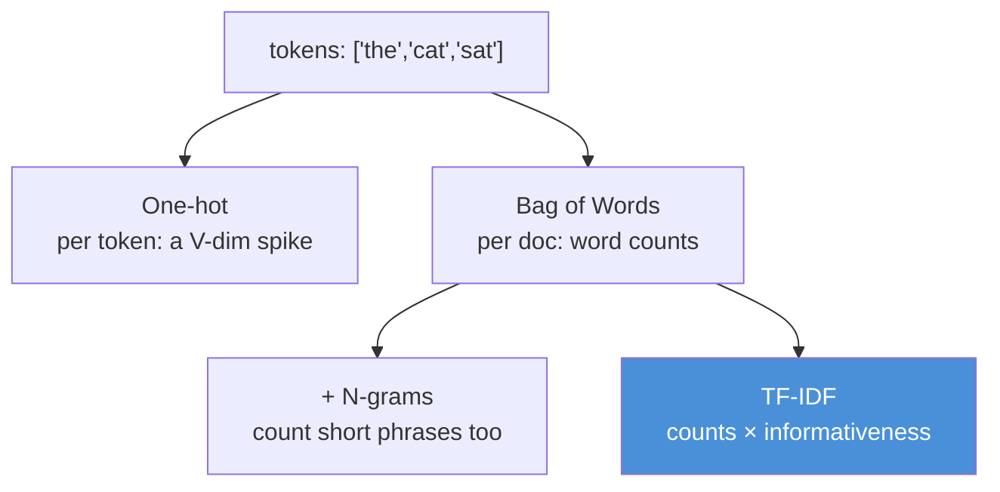
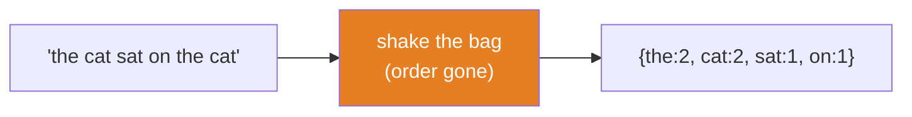
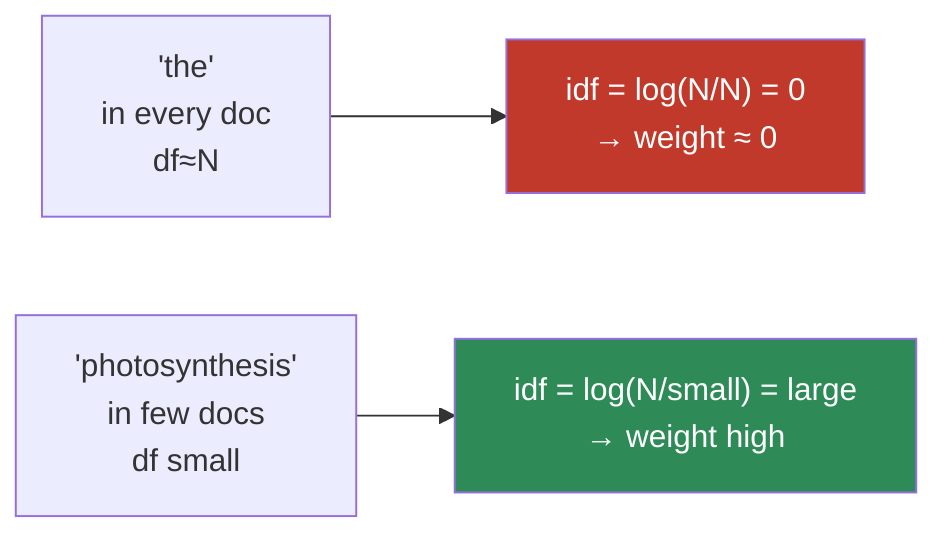

# 10.3 · Text Representation — One-Hot, Bag of Words, N-grams, TF-IDF

[⬅ 10.2 Text Processing](10.2-text-processing.md) · [🏠 Module 10](../README.md) · [➡ 10.4 Word Embeddings](10.4-word-embeddings.md)

> **The lesson in one line:** Before embeddings, every word was an axis of its own — sparse, orthogonal, and meaning-blind — and TF-IDF, the peak of that era, is *still* a baseline you must beat before anything neural earns its keep.

---

## 🎯 Learning objectives

- Turn tokens into vectors with **one-hot encoding, bag-of-words, n-grams, and TF-IDF** — implemented from scratch in NumPy.
- Understand why these representations are **sparse, high-dimensional, and orthogonal** — and what each property costs.
- Derive TF-IDF from first principles and explain *why* the IDF term is a logarithm.
- Know the two fatal limitations (**no word order, no notion of similarity**) that motivate every lesson after this one.

## ✅ Prerequisites

- [10.2](10.2-text-processing.md) — you have tokens.
- [Module 08 · logistic regression](../../08-Machine-Learning/weeks/08.4-logistic-regression.md) — the classifier we'll feed these vectors to.
- [07.6 · TF-IDF intro](../../07-Data-Analysis/weeks/07.6-feature-engineering.md) — a first pass; this lesson derives it.

---

## 🧠 Mental model

> [!IMPORTANT]
> **In the count-based era, a vocabulary of V words means every document is a point in V-dimensional space, and every word is its own axis.** "Cat" is axis 4,182; "dog" is axis 9,001; "feline" is axis 22,736. Because they're separate axes, the representation *cannot know* that cat and feline are related — they are exactly as far apart as cat and refrigerator. This is the defining limitation, and it is what embeddings ([10.4](10.4-word-embeddings.md)) exist to fix.

Everything in this lesson is a way to assign numbers to those axes for a document. One-hot: is the word present (per position)? Bag-of-words: how many times? TF-IDF: how many times, weighted by how *informative* the word is. None of them know what any word *means*.



---

## One-hot encoding — the atom

Assign every word in the vocabulary an index. A word becomes a vector of all zeros with a single 1 at its index.

```python
import numpy as np

vocab = {"cat": 0, "dog": 1, "sat": 2, "the": 3}
V = len(vocab)

def one_hot(word):
    v = np.zeros(V)
    v[vocab[word]] = 1.0
    return v

one_hot("cat")   # array([1., 0., 0., 0.])
one_hot("dog")   # array([0., 1., 0., 0.])
```

The tell-tale problem, made numeric:

```python
cat, dog = one_hot("cat"), one_hot("dog")
np.dot(cat, dog)   # 0.0  ← every distinct word is orthogonal
```

> [!NOTE]
> **The dot product of any two different one-hot vectors is zero** — they are mutually orthogonal. From the [dot-product-as-alignment](../../06-Mathematics/weeks/06.2-linear-algebra-1.md) view, this says "cat and dog share nothing." That is false about language and fatal for any model that relies on similarity. Remember this zero — [10.4](10.4-word-embeddings.md) is the lesson that makes it nonzero.

One-hot is also **enormous**: a realistic vocabulary is 50k–1M, so each word is a 50k–1M-dimensional vector that is 99.99%+ zeros. We never store it densely; we store the index.

---

## Bag of Words — a document as a count vector

Sum the one-hot vectors of all tokens in a document. The result is a vector of **word counts**, indexed by vocabulary. The name says the model: you dump every word into a bag and shake — **all order is destroyed.**

```python
def bag_of_words(tokens, vocab):
    v = np.zeros(len(vocab))
    for tok in tokens:
        if tok in vocab:          # OOV words silently dropped
            v[vocab[tok]] += 1
    return v

doc = ["the", "cat", "sat", "on", "the", "cat"]
# → the:2, cat:2, sat:1, on:1
```



> [!CAUTION]
> **Bag-of-words cannot distinguish "dog bites man" from "man bites dog"** — identical counts, opposite meaning. This is the *word-order* limitation, and it is the reason sequence models ([10.5](10.5-sequence-models.md)) exist. It also has no idea "cat" and "feline" are related — the *similarity* limitation, the reason embeddings exist. Two fatal flaws, two future lessons.

Despite this, BoW + logistic regression is a genuinely strong baseline for **topic classification and spam** — tasks where the *presence* of words ("viagra", "invoice", "refund") matters more than their order.

---

## N-grams — smuggling a little order back in

If single words ("unigrams") lose all order, count short *sequences* too. A **bigram** is an adjacent pair; a **trigram**, a triple.

```
"not good"  →  unigrams: {not, good}      ← BoW: looks like {good, not}, can't see negation
            →  bigrams:  {not_good}       ← now "not_good" is its own feature!
```

Adding bigrams lets the model learn that "not good" is negative even though "not" and "good" individually aren't decisive. It's a cheap, partial fix for word order.

```python
def ngrams(tokens, n):
    return [tuple(tokens[i:i+n]) for i in range(len(tokens) - n + 1)]

ngrams(["not", "very", "good"], 2)   # [('not','very'), ('very','good')]
```

> [!IMPORTANT]
> **N-grams trade sparsity for order.** With a vocabulary V, there are up to V² possible bigrams and V³ trigrams — the feature space explodes and gets *sparser* (most n-grams never occur). You capture local order at the cost of a combinatorial blowup and worse generalization. In practice: unigrams + bigrams is the sweet spot for count-based text classification. Beyond trigrams, you're mostly counting noise.

This tension — **local order vs sparsity** — is exactly what neural sequence models resolve by learning order in a dense space instead of enumerating it.

---

## TF-IDF — the peak of the count-based era

Raw counts have a problem: "the" appears in every document dozens of times and tells you nothing; "photosynthesis" appears rarely and tells you a lot. TF-IDF reweights counts by **how informative a word is**, and it's the single most important idea in this lesson.

### The two terms

**TF — term frequency.** How often word *t* appears in document *d*. (Often normalized by document length, or log-scaled, so long documents don't dominate.)

$$\text{tf}(t, d) = \frac{\text{count of } t \text{ in } d}{\text{total terms in } d}$$

**IDF — inverse document frequency.** How *rare* word *t* is across the whole corpus of *N* documents. Words in every document get near-zero weight; rare words get high weight.

$$\text{idf}(t) = \log\frac{N}{\text{df}(t)}$$

where df(*t*) is the number of documents containing *t*. **TF-IDF** is their product:

$$\text{tfidf}(t, d) = \text{tf}(t, d) \times \text{idf}(t)$$

### Why the logarithm? (The part textbooks skip)

The log is not decoration — it's load-bearing. Without it, IDF would be `N / df`, which for a word in 1 of 1,000,000 documents is *one million* — a single rare word would swamp everything else. Document frequency spans many orders of magnitude, and the log **compresses that range** so weights are comparable. It also encodes a diminishing-returns intuition: the informativeness gap between a word in 1 vs 10 documents is large; between 100,000 vs 100,010, negligible. The log captures exactly that shape. (This is the same reason [information content is `log(1/p)` in 06.8](../../06-Mathematics/weeks/06.8-information-theory.md) — TF-IDF's IDF is, essentially, a term's self-information across the corpus.)



### From scratch in NumPy

```python
import numpy as np
from collections import Counter

def fit_tfidf(corpus_tokens):
    # Build vocab and document frequencies
    vocab = {}
    df = Counter()
    for tokens in corpus_tokens:
        for tok in set(tokens):                 # set: count each doc once
            df[tok] += 1
            vocab.setdefault(tok, len(vocab))
    N = len(corpus_tokens)
    idf = np.zeros(len(vocab))
    for tok, i in vocab.items():
        idf[i] = np.log(N / df[tok]) + 1        # +1 (smoothing) so idf is never 0
    return vocab, idf

def transform_tfidf(tokens, vocab, idf):
    tf = np.zeros(len(vocab))
    for tok in tokens:
        if tok in vocab:
            tf[vocab[tok]] += 1
    tf /= max(len(tokens), 1)                   # normalize by length
    return tf * idf                             # elementwise: TF × IDF

# ⚠️ fit on TRAIN ONLY — the vocab and idf are learned parameters.
# Fitting on test data leaks corpus statistics. (07.11's fit/transform discipline.)
```

> [!CAUTION]
> **IDF is a fitted parameter — fit it on training data only.** Computing IDF over train+test leaks information about the test distribution (which words are rare *there*) into your features. This is the [preprocessing-outside-the-CV-loop leak from 08.13](../../08-Machine-Learning/weeks/08.13-cross-validation.md), wearing an NLP costume. In scikit-learn: `fit_transform` on train, `transform` on test — never `fit` on test.

### Verify against scikit-learn

Per the module discipline: build it, then prove it.

```python
from sklearn.feature_extraction.text import TfidfVectorizer
# Configure sklearn to match our formula, then:
# assert np.allclose(our_tfidf, sklearn_tfidf)   # (after aligning normalization/smoothing settings)
```

The point isn't to reimplement sklearn forever — it's that after this, `TfidfVectorizer` is a fast version of code you understand, not a black box.

---

## The scorecard: what this era can and can't do

| Property | One-hot | BoW | +N-grams | TF-IDF |
|---|---|---|---|---|
| Captures word presence | ✅ | ✅ | ✅ | ✅ |
| Captures frequency | ❌ | ✅ | ✅ | ✅ |
| Down-weights common words | ❌ | ❌ | ❌ | ✅ |
| Captures *some* local order | ❌ | ❌ | ✅ (short) | with n-grams |
| Captures word **similarity** | ❌ | ❌ | ❌ | ❌ |
| Dense / low-dimensional | ❌ | ❌ | ❌❌ | ❌ |

> [!IMPORTANT]
> **Look at the last two rows.** Every representation in this lesson is **sparse, high-dimensional, and — crucially — cannot represent that two words are similar.** "Good" and "great" are orthogonal; "buy" and "purchase" are orthogonal. A model can't transfer anything it learned about one to the other. **That single missing capability — similarity — is what the next lesson delivers, and it changes everything.**

---

## 💻 Production reality check

Do not roll your eyes at these methods. **TF-IDF + linear SVM or logistic regression** is:

- **Fast** — trains in seconds on millions of documents, no GPU.
- **Interpretable** — you can read the top-weighted features per class ([the `coef_` inspection from 08.4](../../08-Machine-Learning/weeks/08.4-logistic-regression.md)).
- **Hard to beat** on many real tasks (topic classification, spam, document routing).

It is the [baseline you must beat from 08.1](../../08-Machine-Learning/weeks/08.1-what-is-ml.md), applied to text. Ship it first; reach for embeddings and Transformers only when it's not enough — and *measure* that it isn't.

---

## ⚡ Performance considerations

- **Never materialize the dense matrix.** A 1M-document × 100k-vocab BoW matrix is 10¹¹ mostly-zero floats. Use **`scipy.sparse`** (CSR) — stores only nonzeros. scikit-learn's vectorizers return sparse matrices by design.
- **Vocabulary size is the memory dial.** Cap it with `max_features`, or drop terms by document frequency (`min_df`, `max_df`) — which also removes noise and near-stop-words.
- **The hashing trick** (feature hashing) skips the vocabulary entirely: hash each token to a fixed number of buckets. Constant memory, no vocab to store or fit, at the cost of rare hash collisions. Useful for streaming/online text.

## 🔒 Security & privacy considerations

> [!CAUTION]
> - **A TF-IDF vocabulary is a leak of your corpus.** The fitted vocabulary and IDF weights reveal which words — including rare names, internal codenames, or PII — appeared in the training documents. A rare term with high IDF *is* a fingerprint of the documents that contained it. Treat the vocabulary as sensitive if the corpus is.
> - **Rare-word re-identification.** In a small corpus, a document's high-IDF terms can uniquely identify it (and its author). This is the [aggregation-is-not-anonymization problem from 07.x](../../07-Data-Analysis/weeks/07.9-data-quality.md) in text form.
> - **The hashing trick offers mild obfuscation** (no readable vocabulary stored) but is not a privacy guarantee — collisions are not encryption.

---

## 🚫 Common mistakes

| Mistake | Consequence |
|---|---|
| **Fitting the vectorizer on train+test** | leaks corpus statistics → optimistic, unreproducible scores |
| **Storing BoW as a dense array** | OOM at any real scale; use sparse matrices |
| **Forgetting IDF's log** | one rare word dominates; weights span millions |
| **Dropping OOV words silently and never checking how many** | your vectors may be mostly empty on new data |
| **Skipping the count-based baseline** | you deploy a Transformer to beat a baseline you never measured |
| **Using high-order n-grams (4+)** | combinatorial sparsity; you count noise |

## ✅ Best practices

- **Always run the TF-IDF + linear model baseline first.** It's the honest yardstick.
- **fit on train, transform on test** — mechanically enforce the leakage boundary.
- **Tune `min_df`/`max_df`** to prune noise (rare typos) and near-stop-words (ubiquitous terms) — often better than a hand-built stop-word list.
- **Add bigrams for tasks with negation** (sentiment); stick to unigrams for pure topic tasks.
- **Inspect the top features per class** — it's free interpretability and a fast leakage detector (a suspicious feature = a bug report, per [08.16](../../08-Machine-Learning/weeks/08.16-interpretability.md)).

---

## 🏋️ Exercises

1. **Orthogonality.** Build one-hot vectors for {king, queen, man, woman}. Show every pairwise dot product is 0. Write one sentence on why this dooms any similarity-based reasoning.
2. **Order-blindness.** Construct the BoW vectors for "dog bites man" and "man bites dog". Show they're identical. Now add bigrams and show they differ.
3. **TF-IDF from scratch.** Implement `fit_tfidf`/`transform_tfidf` in NumPy. On a 5-document toy corpus, print the TF-IDF of "the" and of a word appearing in one document. Confirm "the" ≈ 0.
4. **Why the log.** Recompute IDF as `N/df` (no log) on a corpus where one word appears in 1 of 10,000 docs. Show how it dominates the vector, then show the log fixing it.
5. **Beat the baseline.** On a real text-classification dataset, report F1 for (a) BoW+LR, (b) TF-IDF+LR, (c) TF-IDF+bigrams+LR. Which wins? By how much? Keep this number — you'll compare embeddings against it in [10.4](10.4-word-embeddings.md).
6. **Leakage.** Fit TfidfVectorizer on train+test vs train-only. Show the metric difference and explain the leak.

---

## 🛠️ Mini project — "The Spam Classifier (Count-Based Baseline)"

**Goal:** ship a genuinely good spam classifier with nothing but counts — the baseline every later technique must beat.

**Requirements**
- SMS or email spam dataset ([revisits the 08.8 Naive Bayes project](../../08-Machine-Learning/weeks/08.8-naive-bayes.md), now framed as representation).
- From-scratch TF-IDF, verified against `TfidfVectorizer` with `np.allclose`.
- Logistic regression and multinomial Naive Bayes classifiers.
- **Honest evaluation:** precision/recall/F1 with attention to the imbalanced classes ([08.12](../../08-Machine-Learning/weeks/08.12-evaluation.md)), and **threshold tuning on the cost of a false positive** (a real email in the spam folder is worse than spam in the inbox).

**Folder structure**
```
spam-baseline/
├── tfidf.py           # from-scratch TF-IDF + test_vs_sklearn.py
├── train.py           # BoW/TF-IDF × {LR, NB}, ablation
├── evaluate.py        # PR curves, threshold tuning
├── data/
└── README.md
```

**Architecture diagram**


**Data pipeline:** fit vectorizer on train only; persist vocab + IDF as the model artifact.
**Testing:** `np.allclose` vs sklearn; a no-leakage test (vectorizer fit inside CV); an idempotency test.
**Evaluation:** F1 + the cost-tuned threshold; report the top-20 spam-indicative features.
**Future improvements:** swap TF-IDF for embeddings ([10.4](10.4-word-embeddings.md)) and measure whether the extra complexity actually beats this baseline — often it barely does on spam, which is the lesson.

---

## 📄 Cheat sheet

| Representation | What it is | Kills |
|---|---|---|
| **One-hot** | 1 at the word's index, else 0 | huge, orthogonal (dot=0) |
| **Bag of Words** | word counts per doc | word order |
| **N-grams** | counts of short phrases | sparsity explodes (V²,V³) |
| **⭐ TF-IDF** | count × log(N/df) | common words → 0 weight |
| **IDF = log(N/df)** | rarity = informativeness | log compresses the huge df range |
| **The fatal gap** | none capture **similarity** | → embeddings (10.4) |

**⭐ Rules:** fit on train only · store sparse · always run this baseline first · none of these know "cat" ≈ "feline".

## 🎴 Flashcards

- **Why are one-hot vectors "meaning-blind"?** → Every distinct word is orthogonal (dot product 0); the representation can't encode that any two words are related.
- **What does bag-of-words throw away?** → All word order — "dog bites man" = "man bites dog".
- **⭐ What is TF-IDF?** → term frequency × inverse document frequency = count × log(N/df); frequent-and-informative words score high, ubiquitous words score ~0.
- **Why is IDF a logarithm?** → Document frequency spans orders of magnitude; the log compresses it so one rare word doesn't dominate (and encodes diminishing returns).
- **⭐ Why fit the vectorizer on train only?** → IDF and the vocabulary are learned parameters; fitting on test leaks corpus statistics (a preprocessing leak).
- **What do n-grams buy and cost?** → They recover local word order but explode the feature space (V², V³) into sparsity.
- **Why still learn count-based methods?** → TF-IDF + a linear model is a fast, interpretable, hard-to-beat baseline you must measure before going neural.

## 💬 Interview questions

1. Derive TF-IDF and explain why the IDF term uses a logarithm. What breaks without it?
2. Why can't bag-of-words distinguish "dog bites man" from "man bites dog"? Two ways to mitigate it.
3. Why are one-hot / BoW representations called sparse and meaning-blind? Which limitation do embeddings fix?
4. How does fitting a TF-IDF vectorizer on the full dataset cause leakage? How do you prevent it?
5. When would you deploy TF-IDF + logistic regression over a Transformer in production?

---

## 📝 Summary

- Count-based representations put every word on **its own orthogonal axis** — sparse, high-dimensional, and unable to encode similarity.
- **Bag-of-words** captures presence and frequency but **destroys word order**; **n-grams** recover a little order at the cost of combinatorial sparsity.
- **TF-IDF** — count × log(N/df) — is the era's peak: it down-weights ubiquitous words to near-zero and up-weights rare informative ones; the **log is essential** to compress document frequency's huge range.
- **Fit the vectorizer on training data only** — IDF and vocab are parameters, and fitting on test is leakage.
- These methods remain **strong, fast, interpretable baselines** — but none can represent that "cat" ≈ "feline", which is precisely what [embeddings](10.4-word-embeddings.md) fix next.

## 📚 References

1. **Jurafsky & Martin — _Speech and Language Processing_, ch. 6.** ⭐ Vector semantics, TF-IDF, and the transition to embeddings.
2. **Manning, Raghavan & Schütze — _Introduction to Information Retrieval_, ch. 6.** ⭐⭐ The definitive TF-IDF treatment.
3. **scikit-learn User Guide — _Text feature extraction_.** `CountVectorizer`, `TfidfVectorizer`, the hashing trick.
4. **Wang & Manning (2012) — _Baselines and Bigrams: Simple, Good Sentiment and Topic Classification_.** Why simple count-based models are shockingly strong.

---

## 🧭 Navigation

| Direction | Link |
|---|---|
| ⬅ Previous | [10.2 · Text Processing](10.2-text-processing.md) |
| ➡ Next | [10.4 · Word Embeddings](10.4-word-embeddings.md) |
| 🏠 Module | [Module 10](../README.md) |
| 📖 Lessons | [Lesson index](README.md) |
