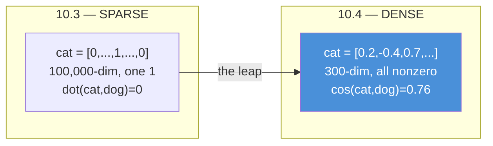
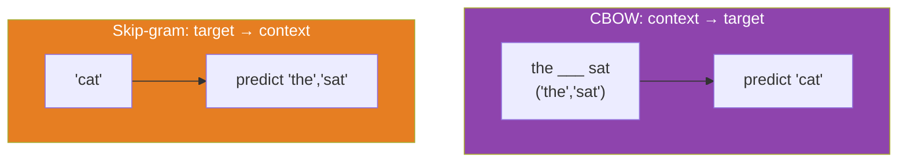
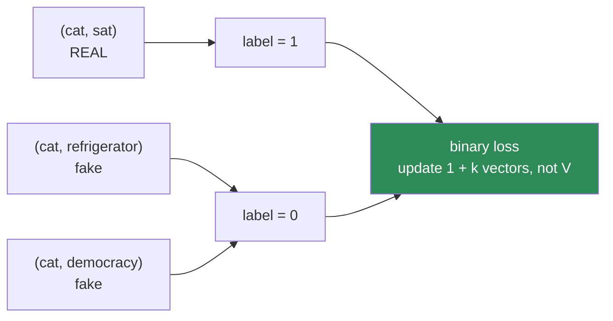
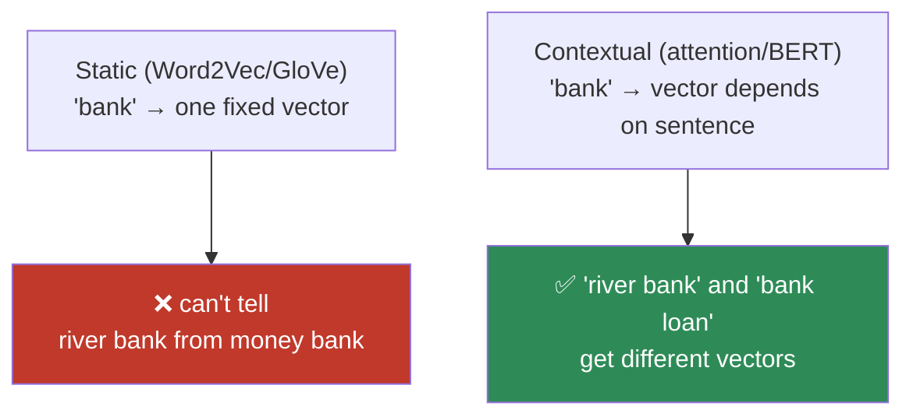
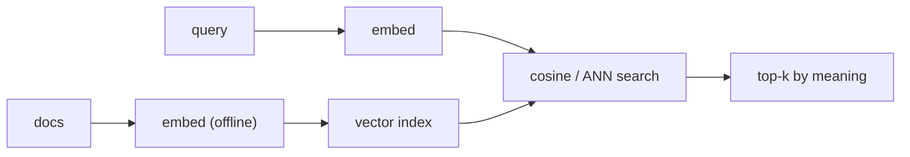

# 10.4 · Word Embeddings — Meaning as Geometry ⭐

[⬅ 10.3 Text Representation](10.3-text-representation.md) · [🏠 Module 10](../README.md) · [➡ 10.5 Sequence Models](10.5-sequence-models.md)

> **The lesson in one line:** An embedding turns a word into a dense vector whose *direction* encodes meaning — so "cat" and "feline" finally sit close together, and the arithmetic `king − man + woman ≈ queen` actually works.

---

## 🎯 Learning objectives

- Explain what a **distributed representation** is and why dense beats sparse.
- Understand **Word2Vec** — both **CBOW** and **skip-gram** — as a shallow network trained on a fake task.
- Derive **negative sampling** and why it made Word2Vec trainable at scale.
- Understand **GloVe** conceptually as the count-based cousin of Word2Vec.
- Reason about **embedding geometry**: cosine similarity, analogies, and the bias baked into the space.
- Know the one limitation embeddings *don't* fix — **a single vector per word regardless of context** — which is the door to attention.

## ✅ Prerequisites

- [10.3](10.3-text-representation.md) — the orthogonality problem you're about to solve.
- [09.4 backprop](../../09-Deep-Learning/weeks/09.4-backpropagation.md), [09.8 embedding layers](../../09-Deep-Learning/weeks/09.8-building-models.md) — Word2Vec is a tiny network trained by the loop you know.
- [06.2 dot product & cosine](../../06-Mathematics/weeks/06.2-linear-algebra-1.md) — the geometry of similarity.

---

## 🧠 Mental model

> [!IMPORTANT]
> **An embedding is a learned lookup table that maps each word to a point in a few-hundred-dimensional space, arranged so that words with similar meanings are near each other.** The sparse, orthogonal 100,000-dim one-hot vector becomes a dense 300-dim vector where *direction is meaning*. Cat and feline point the same way; buy and purchase cluster; and — the result that stunned everyone — the *offset* between "man" and "woman" is the same offset as between "king" and "queen".

This is the single most important conceptual leap in classical NLP. In [10.3](10.3-text-representation.md), similarity was impossible by construction (everything orthogonal). Here, similarity is the *organizing principle* of the whole space.



> **[FIGURE: The embedding space (2-D projection).** A scatter of word points after t-SNE/PCA to 2-D. Clusters visibly form: {cat, dog, hamster, rabbit} in one region; {run, walk, sprint, jog} in another; {Paris, London, Tokyo} in another. Parallel arrows drawn from man→woman, king→queen, uncle→aunt all point the same direction and length. Caption: "Meaning became geometry — similarity is distance, relationship is direction."**]

---

## The core idea: distributed representations

A one-hot vector is a **local** representation — one word, one dimension, all information in a single coordinate. An embedding is a **distributed** representation — a word's meaning is spread across all 300 dimensions, and each dimension participates in representing many words.

The payoff is **generalization**. Because "good" and "great" have nearby vectors, a model that learns "good → positive" gets "great → positive" almost for free — the signal transfers through the geometry. Sparse representations can't do this; every word is an island. **This is the deep reason embeddings improve almost every downstream task: they let learning generalize across related words.**

Where do the dimensions come from? They're **learned, and mostly not human-interpretable.** No one assigns "dimension 47 = royalty." The 300 axes are whatever directions best predict word co-occurrence — the [distributional hypothesis from 10.1](10.1-introduction-to-nlp.md), cashed out as a numeric optimization.

---

## Word2Vec — learning embeddings from a fake task

Word2Vec (Mikolov et al., 2013) is the breakthrough. The trick is beautiful: **you don't have labeled "meaning" data, so invent a self-supervised task where the labels come free from the text itself** — exactly the [self-supervision idea from 08.1](../../08-Machine-Learning/weeks/08.1-what-is-ml.md) that later powered LLMs.

The fake task: **predict a word from its neighbors (or neighbors from a word).** Nobody cares about the predictions. What we keep is the **weight matrix** — the network's internal representation of each word *is* the embedding. The task is a scaffold; the embeddings are the building.

Two variants, mirror images of each other:



| | **CBOW** (Continuous Bag of Words) | **Skip-gram** |
|---|---|---|
| Predicts | the center word from its context | each context word from the center |
| Faster | ✅ (averages context, fewer updates) | ❌ |
| Better on rare words | ❌ | ✅ (each occurrence generates many training pairs) |
| Default choice | small data / speed | ⭐ large data / quality (the usual pick) |

### Skip-gram, concretely

For the sentence "the cat sat on the mat" with a window of 2, the word "sat" generates training pairs:
```
(sat → the), (sat → cat), (sat → on), (sat → the)
```
Each pair says "these two words co-occur." Over billions of such pairs, words that share contexts get pushed toward similar vectors.

The naive architecture: a `V→300` embedding matrix (input), a `300→V` output matrix, and a softmax over the *entire vocabulary* to predict the context word. The embedding of a word is just its row in the input matrix.

```python
# The heart of it: a word is a row lookup, then a softmax over all V words.
# W_in:  (V, 300)  — the embeddings we keep
# W_out: (300, V)  — the output weights we throw away
center_vec = W_in[center_idx]              # (300,)  — a lookup, not a matmul
scores = center_vec @ W_out                # (V,)    — similarity to every word
probs = softmax(scores)                    # predict the context word
# loss = cross-entropy(probs, actual_context_word)   # 09.3's loss, exactly
```

---

## Negative sampling — the trick that made it work

That softmax over the entire vocabulary is the killer. With V = 1,000,000, every single training step computes a million-way softmax and updates a million output vectors. Billions of steps × a million each = intractable.

**Negative sampling** replaces the impossible multi-class problem with an easy binary one:

> Instead of "predict *which* of a million words is the context," ask: "**is this pair a real co-occurrence, or a random fake one?**"

For each real pair `(cat, sat)`, draw *k* (say 5) **negative** pairs by pairing "cat" with random words: `(cat, refrigerator)`, `(cat, democracy)`, etc. Train a binary classifier ([logistic regression, 08.4](../../08-Machine-Learning/weeks/08.4-logistic-regression.md)) to output 1 for the real pair and 0 for the fakes.



Now each step updates **1 + k vectors instead of V** — six instead of a million. The math changes from a V-way softmax to *k*+1 sigmoids. This single trick is what made Word2Vec trainable on billions of words on 2013 hardware.

> [!NOTE]
> **The negatives are drawn from a smoothed unigram distribution** — roughly `P(w) ∝ freq(w)^0.75`. The 0.75 exponent is empirical: it samples frequent words as negatives less often than their raw frequency would, and rare words more often, which improves the embeddings. A small, weird-looking constant doing real work — much like the [√d_k in attention (10.7)](10.7-attention.md).

And notice the gradient: it's the [`predicted − actual` form from 09.4](../../09-Deep-Learning/weeks/09.4-backpropagation.md) again. Word2Vec is not exotic — it's a one-layer network with a clever task and a clever sampling trick, trained by the loop you already own.

---

## GloVe — the count-based cousin (conceptually)

**GloVe** (Global Vectors, Pennington et al., 2014) reaches similar embeddings from the opposite direction. Word2Vec is *predictive* (slide a window, predict neighbors). GloVe is *count-based*: build the giant global word-word **co-occurrence matrix** (how often does word *i* appear near word *j* across the whole corpus?), then factorize it so that

$$\mathbf{w}_i \cdot \mathbf{w}_j \approx \log(\text{count of } i \text{ near } j)$$

The insight GloVe formalizes: **ratios of co-occurrence probabilities encode meaning.** P(ice | solid)/P(steam | solid) is large; the same ratio for "water" is ~1. GloVe trains vectors whose dot products reproduce these log-counts.

| | **Word2Vec** | **GloVe** |
|---|---|---|
| Approach | predictive (local windows) | count-based (global matrix) |
| Sees | one window at a time | the whole corpus at once |
| Training | SGD over pairs | weighted least-squares on log-counts |
| Result | comparable quality embeddings | comparable quality embeddings |

> [!TIP]
> That Word2Vec (predict) and GloVe (count) converge on nearly the same geometry is a deep hint: **both are just different numerical routes to the distributional hypothesis.** Levy & Goldberg later proved skip-gram with negative sampling is *implicitly factorizing* a (shifted) co-occurrence matrix — the two are secretly the same thing.

---

## The geometry: what you can do with embeddings

### Similarity = cosine

Because meaning is direction, **cosine similarity** ([06.2](../../06-Mathematics/weeks/06.2-linear-algebra-1.md)) measures relatedness. Magnitude (roughly, word frequency) is normalized out; only direction matters.

```python
def cosine(a, b):
    return (a @ b) / (np.linalg.norm(a) * np.linalg.norm(b))

cosine(emb["cat"], emb["dog"])          # ~0.76  (related)
cosine(emb["cat"], emb["refrigerator"]) # ~0.05  (unrelated)
```

This is the engine of **semantic search** and **RAG** ([Module 13](../../13-RAG/README.md)): embed the query, find the nearest document vectors by cosine. That entire industry is this one operation at scale.

### Analogies = arithmetic

The famous result:

$$\text{vec(king)} - \text{vec(man)} + \text{vec(woman)} \approx \text{vec(queen)}$$

The vector "man → woman" is a *direction* — roughly "make it female." Adding it to "king" walks you to "queen." Relationships are directions you can add and subtract:

```
Paris - France + Italy ≈ Rome        (capital-of)
walking - walk + swim ≈ swimming     (present-participle)
```

> **[FIGURE: Analogy parallelogram.** Four points — man, woman, king, queen — forming a parallelogram, with the man→woman and king→queen arrows drawn parallel and equal length. A second faint parallelogram for Paris/France/Rome/Italy. Caption: "Analogies are parallelograms: the same relationship is the same vector, wherever it appears."**]

> [!CAUTION]
> **The analogy result is real but oversold.** It works cleanly on curated analogy sets and is fragile in the wild; the standard evaluation even *excludes* the input words from the answer, which flatters it. Treat `king − man + woman ≈ queen` as a striking demonstration that structure exists in the space — not as a reliable reasoning tool.

---

## The bias problem — meaning inherits prejudice

Because embeddings learn meaning purely from co-occurrence, **they absorb every bias in the training text, and encode it as geometry you can measure.** The same arithmetic that gives "king − man + woman ≈ queen" gives:

```
doctor - man + woman ≈ nurse
programmer - man + woman ≈ homemaker
```

These are not glitches — they are faithful reflections of the corpus. Words like "he" sit closer to "engineer" and "doctor"; "she" closer to "nurse" and "receptionist," because that's how the text was written.

> [!IMPORTANT]
> **This is the single most important ethical fact in the module, and it is structural, not incidental.** You cannot fix it by "cleaning the data" alone — bias is diffuse across billions of co-occurrences. Debiasing methods exist (projecting out a "gender direction") but are partial and can hide bias rather than remove it. **Any system built on embeddings — search, résumé screening, recommendations — inherits and can *amplify* this bias.** We return to it in [10.14](10.14-ethics-safety.md); flag it now because it follows inevitably from *how embeddings are made*.

---

## The limitation that opens the next door

> [!IMPORTANT]
> **Word2Vec and GloVe give each word exactly ONE vector, forever, regardless of context.** "Bank" has a single embedding — an incoherent blend of riverbank and financial bank. "Apple" can't be both the fruit and the company. These are **static embeddings**: context-independent.
>
> But [10.1](10.1-introduction-to-nlp.md) told us meaning *is* contextual. The fix is **contextual embeddings** — a word's vector depends on the sentence it's in — which requires a mechanism for a word to look at its neighbors and adjust. That mechanism is **[attention (10.7)](10.7-attention.md)**, and it is the reason this module bends toward Transformers. Static embeddings were the state of the art from 2013–2018; attention replaced them by making the vector *dynamic*.



---

## 🏭 Production examples

| System | Embedding role |
|---|---|
| **Semantic search / RAG** | embed query + docs, retrieve by cosine ([Module 13](../../13-RAG/README.md)) |
| **Recommendation** | item2vec — the same skip-gram trick on purchase sequences instead of word sequences |
| **Deduplication / clustering** | near-duplicate detection by embedding distance |
| **Feature for classifiers** | averaged word embeddings as a document vector (a strong, cheap baseline) |
| **Initializing neural NLP** | pretrained embeddings as the first layer of an LSTM/CNN ([10.11](10.11-nlp-with-pytorch.md)) |

## ⚡ Performance considerations

- **The embedding matrix is often the largest parameter block** in a classical NLP model: V × d = 1M × 300 = 300M floats. It dominates memory.
- **Lookup is O(1)** — an embedding layer is an indexing op, *not* a matmul with a one-hot vector (though they're mathematically equal). Never actually multiply by one-hot; index the row. ([09.8](../../09-Deep-Learning/weeks/09.8-building-models.md).)
- **Nearest-neighbor search doesn't scale by brute force** — cosine against millions of vectors per query is too slow. Approximate nearest neighbor (**HNSW/FAISS**, the [ANN from 08.9](../../08-Machine-Learning/weeks/08.9-knn.md)) gives ~99% recall at ~1000× speed. This is the backbone of every vector database.

## 🔒 Security & privacy considerations

> [!CAUTION]
> - **Embeddings memorize and can leak training data.** Rare tokens (names, IDs, medical terms) get distinctive vectors; membership-inference and inversion attacks can partially recover what was in the training corpus. Embeddings trained on private text are themselves sensitive artifacts.
> - **Embeddings are not anonymization.** "We only stored the vectors, not the text" is false comfort — embeddings can be inverted to approximately reconstruct the input, and they preserve enough structure to re-identify authors. Treat an embedding of PII as PII.
> - **Bias is a safety issue, not just an ethics footnote.** An embedding-based résumé filter that scores "she" closer to "nurse" than "engineer" is a discrimination liability ([10.14](10.14-ethics-safety.md), [08.16 fairness](../../08-Machine-Learning/weeks/08.16-interpretability.md)).

---

## 🚫 Common mistakes

| Mistake | Consequence |
|---|---|
| **Using Euclidean distance instead of cosine** | frequency/magnitude contaminates similarity; cosine normalizes it out |
| **Expecting analogies to work reliably in the wild** | they're a curated-benchmark result, fragile on arbitrary words |
| **Ignoring OOV** | static embeddings have no vector for unseen words (subwords/fastText mitigate) |
| **Assuming one vector per word is fine** | "bank"/"apple"/"python" are polysemous — static embeddings blur senses |
| **Deploying embeddings without a bias audit** | you inherit and amplify the corpus's prejudice |
| **Multiplying by one-hot vectors** | wasteful; an embedding is a row lookup |

## ✅ Best practices

- **Use cosine similarity** for all embedding comparisons.
- **Start from pretrained embeddings** (GloVe, fastText) unless you have a large domain-specific corpus — training your own rarely beats them.
- **Prefer fastText for morphologically rich languages / heavy OOV** — it embeds *subwords*, so it can vector-ize unseen words (a bridge to subword tokenization).
- **Audit for bias** before shipping anything consequential (hiring, lending, moderation).
- **When context matters, reach for contextual embeddings** ([10.7](10.7-attention.md) → BERT); static embeddings are the floor, not the ceiling.

---

## 🏋️ Exercises

1. **Cosine intuition.** Load pretrained GloVe. For 10 word pairs of your choosing (some related, some not), print cosine similarities. Do they match your intuition? Find one surprising pair.
2. **Analogy machine.** Implement `analogy(a, b, c)` = nearest word to `vec(b) − vec(a) + vec(c)`, excluding a/b/c. Test on capital-country, plural-singular, and comparative-adjective analogies. Report where it fails.
3. **Skip-gram pairs.** For "the quick brown fox jumps" with window=2, write out every (center, context) training pair skip-gram generates.
4. **Negative sampling by hand.** For the pair (fox, jumps), draw 5 negatives from a toy vocabulary using `P(w) ∝ freq(w)^0.75`. Write the binary-classification loss for this one step.
5. **Bias measurement.** Compute `cosine(emb["he"], emb["engineer"])` vs `cosine(emb["she"], emb["engineer"])` for a list of professions. Tabulate the gender skew. Write a paragraph on what a hiring system built on these would do.
6. **Beat the baseline (revisited).** Represent documents as *averaged* word embeddings and train a classifier. Compare F1 to your [10.3 TF-IDF baseline](10.3-text-representation.md). Did dense beat sparse? By how much?

---

## 🛠️ Mini project — "Semantic Search Engine"

**Goal:** build a search engine that finds documents by *meaning*, not keywords — the concrete payoff of embeddings and a preview of [RAG](../../13-RAG/README.md).

**Requirements**
- A document corpus (Wikipedia snippets, product descriptions, or docs).
- Embed each document (averaged word embeddings, or a sentence-embedding model conceptually).
- Embed a query and retrieve the top-k by **cosine similarity**.
- Show it finds relevant docs that share **no keywords** with the query (e.g., query "automobile", finds docs about "cars" and "vehicles") — the thing TF-IDF *cannot* do.
- Add **approximate nearest neighbor** (FAISS/HNSW) and measure the speed/recall tradeoff vs brute force ([08.9](../../08-Machine-Learning/weeks/08.9-knn.md)).

**Folder structure**
```
semantic-search/
├── embed.py           # doc + query embedding
├── index.py           # brute-force cosine + FAISS index
├── search.py          # top-k retrieval
├── evaluate.py        # recall@k vs a keyword baseline
├── data/
└── README.md
```

**Architecture diagram**


**Data pipeline:** embed the corpus offline, build the index once, serve queries online.
**Training/eval:** no training needed for pretrained embeddings; evaluate **recall@k** against a TF-IDF keyword baseline on labeled query-doc pairs.
**Testing:** assert semantically-related-but-keyword-disjoint queries retrieve the right docs; assert ANN recall ≥ 0.95 of brute force.
**Future improvements:** swap static embeddings for contextual sentence embeddings ([10.7](10.7-attention.md)/[10.12](10.12-modern-libraries.md)) and measure the jump on polysemous queries ("apple stock" vs "apple pie"). This project *becomes* a RAG retriever in [Module 13](../../13-RAG/README.md).

---

## 📄 Cheat sheet

| Concept | One line |
|---|---|
| **Embedding** | dense vector per word; **direction = meaning** |
| **Distributed rep** | meaning spread across all dims → generalizes across similar words |
| **⭐ Word2Vec** | shallow net on a fake task; keep the weights, throw away the predictions |
| **CBOW / Skip-gram** | context→word (fast) / word→context (better, the default) |
| **⭐ Negative sampling** | turn V-way softmax into k+1 binary "real or fake pair?" — 6 updates, not a million |
| **GloVe** | count-based cousin: `wᵢ·wⱼ ≈ log(co-occurrence)` |
| **Similarity** | **cosine**, not Euclidean |
| **Analogy** | `king − man + woman ≈ queen` (real, but oversold) |
| **⭐ Bias** | co-occurrence learning ⇒ inherited prejudice, as measurable geometry |
| **⭐ The limit** | one vector per word, context-free → attention (10.7) fixes it |

## 🎴 Flashcards

- **⭐ What is a word embedding?** → A dense vector per word, learned so that similar-meaning words are geometrically close (direction encodes meaning).
- **What's the "fake task" in Word2Vec?** → Predict a word from its context (CBOW) or context from a word (skip-gram); the predictions are discarded — the weights are the embeddings.
- **CBOW vs skip-gram?** → context→target (faster) vs target→context (better on rare words; the usual default).
- **⭐ What does negative sampling do?** → Replaces the intractable V-way softmax with a binary "real vs random pair" task, updating 1+k vectors instead of V.
- **How is GloVe different from Word2Vec?** → It factorizes a global co-occurrence count matrix instead of predicting from local windows; similar result.
- **Why cosine, not Euclidean?** → Meaning is direction; cosine ignores magnitude (≈ frequency), which is what you want.
- **⭐ The one thing embeddings can't do?** → Give a word different vectors in different contexts — static embeddings blur polysemy ("bank"), which attention fixes.
- **Where does embedding bias come from?** → The distributional hypothesis: learning meaning from human co-occurrence encodes human prejudice as geometry.

## 💬 Interview questions

1. Explain Word2Vec to someone who knows logistic regression. What's the task, what do you keep, and why does it produce meaningful vectors?
2. Why was negative sampling necessary? What exactly does it replace, and what's the speedup?
3. Contrast Word2Vec and GloVe. Why do they end up with similar embeddings?
4. Why do we use cosine similarity for embeddings? When would Euclidean mislead you?
5. Where does bias in embeddings come from, and why can't you fully remove it by cleaning data?
6. What is the fundamental limitation of static embeddings, and what mechanism solves it?

---

## 📝 Summary

- **Embeddings turn words into dense vectors where direction encodes meaning** — solving [10.3](10.3-text-representation.md)'s fatal orthogonality problem and letting learning generalize across similar words.
- **Word2Vec** learns them from a self-supervised fake task (CBOW: context→word; skip-gram: word→context), keeping the weight matrix and discarding the predictions.
- **Negative sampling** makes it tractable by replacing a million-way softmax with a handful of binary "real-or-fake pair" decisions.
- **GloVe** reaches similar geometry from global co-occurrence counts; both are numerical routes to the distributional hypothesis.
- The geometry supports **cosine similarity** (semantic search, RAG) and **analogy arithmetic** — but also **encodes the corpus's biases** as measurable structure.
- The defining limitation — **one context-free vector per word** — is exactly what **[attention](10.7-attention.md)** overcomes with contextual embeddings, bending this module toward Transformers.

## 📚 References

1. **Mikolov et al. (2013) — _Efficient Estimation of Word Representations in Vector Space_** and **_Distributed Representations of Words and Phrases_.** ⭐⭐ The Word2Vec papers (CBOW, skip-gram, negative sampling).
2. **Pennington, Socher & Manning (2014) — _GloVe: Global Vectors for Word Representation_.** ⭐ The count-based approach.
3. **Bojanowski et al. (2017) — _Enriching Word Vectors with Subword Information_ (fastText).** Subword embeddings that handle OOV.
4. **Bolukbasi et al. (2016) — _Man is to Computer Programmer as Woman is to Homemaker?_** ⭐ The definitive embedding-bias paper.
5. **Levy & Goldberg (2014) — _Neural Word Embedding as Implicit Matrix Factorization_.** Proves skip-gram ≈ factorizing a co-occurrence matrix.
6. **Jay Alammar — _The Illustrated Word2Vec_.** ⭐ The best visual explanation.

---

## 🧭 Navigation

| Direction | Link |
|---|---|
| ⬅ Previous | [10.3 · Text Representation](10.3-text-representation.md) |
| ➡ Next | [10.5 · Sequence Models](10.5-sequence-models.md) |
| 🏠 Module | [Module 10](../README.md) |
| 📖 Lessons | [Lesson index](README.md) |
