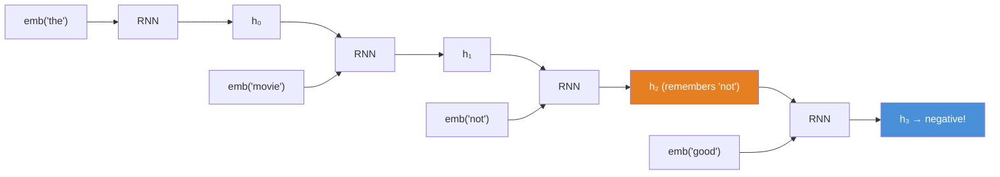
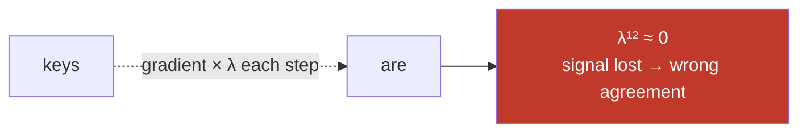
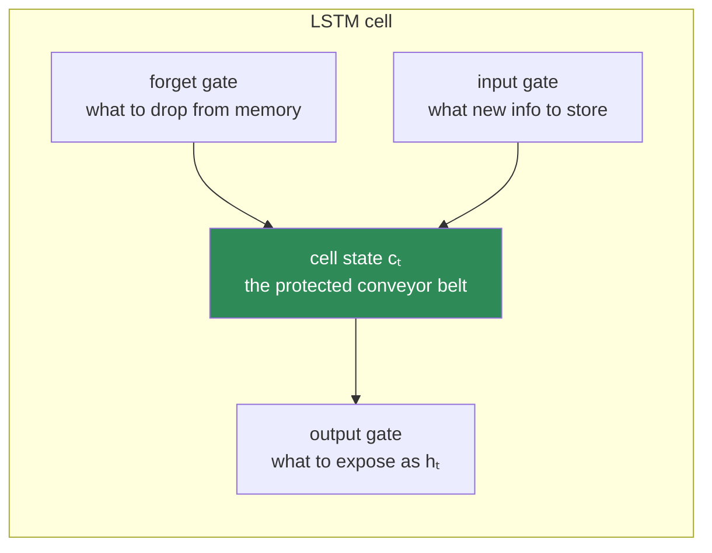
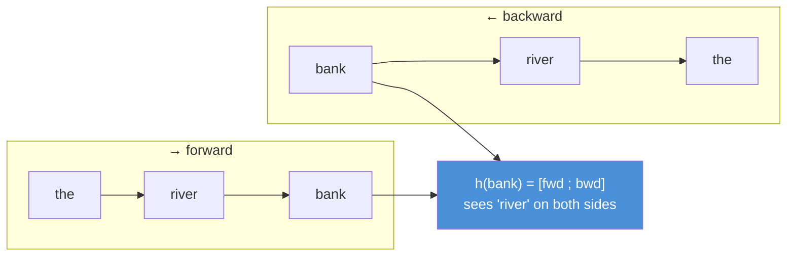
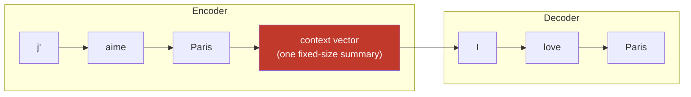
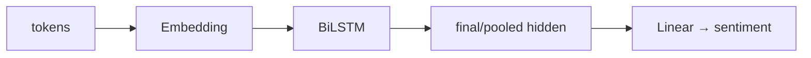

# 10.5 · Sequence Models for NLP — RNN, LSTM, GRU, Bidirectional

[⬅ 10.4 Word Embeddings](10.4-word-embeddings.md) · [🏠 Module 10](../README.md) · [➡ 10.6 NLP Tasks](10.6-nlp-tasks.md)

> **The lesson in one line:** Bag-of-words threw away word order; sequence models read a sentence left-to-right, carrying a memory of what came before — which finally lets "not good" mean the opposite of "good."

---

## 🎯 Learning objectives

- Explain why **word order is signal** and how recurrence encodes it via a running hidden state.
- Apply RNN/LSTM/GRU — first met in [09.12](../../09-Deep-Learning/weeks/09.12-sequence-models.md) — **to language specifically**: embeddings in, hidden state out.
- Understand **bidirectional** models and when you can (and can't) use them.
- Connect the **vanishing-gradient-across-time** problem to concrete NLP failures (long-range agreement, coreference).
- See **sequence-to-sequence** framed as an encoder producing a single summary vector — and feel the bottleneck that motivates attention.

## ✅ Prerequisites

- [09.12 sequence models](../../09-Deep-Learning/weeks/09.12-sequence-models.md) — RNN/LSTM/GRU mechanics and the λⁿ story. **This lesson assumes it and applies it to text.**
- [10.4 embeddings](10.4-word-embeddings.md) — the input to every sequence model here.

---

## 🧠 Mental model

> [!IMPORTANT]
> **A sequence model reads a sentence one word at a time, and after each word updates a single fixed-size vector — the hidden state — that is its running summary of everything seen so far.** The embedding says what *this word* means; the hidden state remembers the *context up to here*. That memory is exactly what bag-of-words lacked, and it's what lets the model treat "not good" and "good" differently: by the time it reads "good," its hidden state already contains "not."

This is the [09.12](../../09-Deep-Learning/weeks/09.12-sequence-models.md) machinery pointed at language. There, the sequences were abstract. Here every timestep is a word embedding from [10.4](10.4-word-embeddings.md), and the failures and fixes become linguistic.



---

## Why order matters — the thing BoW couldn't do

Three examples where identical words, different order, mean different things:

| Sentence A | Sentence B | Same BoW? | Same meaning? |
|---|---|---|---|
| "dog bites man" | "man bites dog" | ✅ | ❌ (one is news) |
| "not good, actually bad" | "not bad, actually good" | ✅ | ❌ (opposite sentiment) |
| "the cat that the dog chased ran" | "the dog that the cat chased ran" | ✅ | ❌ (who chased whom) |

A model that can't use order gets all three wrong. Recurrence is the first mechanism in this module that *can* use it — because the hidden state at position *t* depends on the *sequence* of words up to *t*, not just their multiset.

---

## The RNN, as an NLP layer

The recurrence, from [09.12](../../09-Deep-Learning/weeks/09.12-sequence-models.md), applied to embeddings:

$$h_t = \tanh(W_{xh}\, x_t + W_{hh}\, h_{t-1} + b)$$

where $x_t$ is the embedding of word *t* and $h_{t-1}$ is the previous hidden state. The **same weights** $W_{xh}, W_{hh}$ are reused at every position (weight sharing across time — the sequence analog of a CNN's weight sharing across space). The final $h_T$ is a fixed-size vector summarizing the whole sentence — feed it to a classifier for sentiment, or emit one output per step for tagging.

```python
# One RNN step, conceptually — the loop you'd wrap over a sentence's embeddings
h = np.zeros(hidden_size)
for x_t in embedded_sentence:               # x_t: (embed_dim,)
    h = np.tanh(W_xh @ x_t + W_hh @ h + b)  # update the running summary
sentence_vector = h                         # (hidden_size,) — feeds a classifier
```

> [!NOTE]
> **The embedding layer and the RNN train together.** You don't have to use pretrained Word2Vec — you can start from random embeddings and let backprop shape both the embeddings *and* the recurrence for your task. In practice, initializing from pretrained embeddings ([10.4](10.4-word-embeddings.md)) and fine-tuning is the strong default, especially with limited data.

---

## The vanishing gradient, as an NLP failure

[09.12](../../09-Deep-Learning/weeks/09.12-sequence-models.md) told you *why* RNNs forget: backprop-through-time multiplies the recurrent weight at every step, so the gradient to far-back words scales like **λⁿ** and dies after ~10 steps. In language, that abstract failure has a face — **long-range dependencies**:

```
"The keys that I left on the kitchen table next to the bowl of fruit ___ missing."
                                                                    ↑
                       "are" (agrees with "keys", 12 words back) — an RNN often forgets and picks "is"
```

Other casualties: **coreference** ("the trophy… it…" across a long clause), **long-distance negation**, and **document-level sentiment** where the verdict depends on a sentence far from the end. These aren't contrived — they are everywhere in real text, and they are exactly why vanilla RNNs were never enough for serious NLP.



---

## LSTM and GRU — the memory that survives distance

The fix, from [09.12](../../09-Deep-Learning/weeks/09.12-sequence-models.md): a **gated** cell with a protected memory path. The LSTM adds a **cell state** $c_t$ — a near-linear "conveyor belt" that information rides along with minimal multiplication — plus three learned gates that decide what to forget, what to add, and what to output.



The cell state is the whole point: because it's updated mostly by *addition* (gated), the gradient can flow across hundreds of steps without vanishing — the [residual-connection / gradient-highway idea](../../09-Deep-Learning/weeks/09.11-cnns.md) in recurrent form. That's how an LSTM keeps "keys" alive long enough to agree with "are."

**GRU** is the streamlined cousin: two gates instead of three, merges cell and hidden state, ~fewer parameters, often the same accuracy and faster. The [09.12 guidance](../../09-Deep-Learning/weeks/09.12-sequence-models.md) holds — **try GRU first; reach for LSTM if it underperforms.**

| | RNN | GRU | LSTM |
|---|---|---|---|
| Gates | 0 | 2 | 3 |
| Separate cell state | ❌ | ❌ | ✅ |
| Long-range memory | ~10 steps | ~100s | ~100s |
| Params / speed | fewest / fastest | middle | most / slowest |
| Default | never (baseline only) | ⭐ try first | if GRU underperforms |

---

## Bidirectional models — reading both ways

An RNN reads left-to-right, so at "bank" in "river bank," it hasn't seen "river" yet if "river" comes after. A **bidirectional** model runs two RNNs — one forward, one backward — and concatenates their hidden states, so every position's representation sees the **entire sentence, both sides**.



This is a large win for **understanding** tasks (NER, POS tagging, classification) where the whole sentence is available at once. **BiLSTM** was the workhorse of NLP from ~2015–2018.

> [!CAUTION]
> **You cannot use a bidirectional model when the future isn't available.** Two cases: (1) **generation** — predicting the next word can't peek at words after it (that's the answer); (2) **streaming/real-time** — you don't have the rest of the sentence yet. Bidirectionality requires the full sequence up front. This forward-only constraint is exactly the **causal masking** you'll meet in generative Transformers ([Module 11](../../11-LLMs/README.md)).

---

## Sequence-to-sequence — and the bottleneck you should feel now

Many NLP tasks map one sequence to *another*: translation (English→French), summarization (long→short), question answering. The classic architecture ([full treatment in 10.8](10.8-seq2seq.md)):

1. An **encoder** RNN reads the input and compresses it into its final hidden state — a single fixed-size vector.
2. A **decoder** RNN generates the output sequence, conditioned on that vector.



> [!IMPORTANT]
> **Stare at that red context vector. The encoder must cram an entire sentence — 5 words or 50 — into one fixed-size vector, and the decoder must reconstruct everything from it alone.** This is the **information bottleneck**, and it is the central failure of seq2seq: performance collapses on long sentences because a single 512-dim vector can't hold a 50-word sentence's worth of detail. **The fix — letting the decoder look back at *all* the encoder's hidden states instead of just the last one — is attention ([10.7](10.7-attention.md)), the most important lesson in this module.** Feel the pain of the bottleneck now; [10.7](10.7-attention.md) is the relief.

---

## 🏭 Production examples

| Task | Sequence model |
|---|---|
| **Sentiment / classification** | (Bi)LSTM → final hidden state → linear classifier |
| **NER / POS tagging** | BiLSTM → per-token output (+ often a CRF layer) ([10.6](10.6-nlp-tasks.md)) |
| **Language modeling / autocomplete** | forward-only LSTM predicting the next token |
| **Translation / summarization** | seq2seq LSTM (+ attention) ([10.8](10.8-seq2seq.md)) |
| **Speech / time series** | the same architecture — text isn't special to an RNN |

## ⚡ Performance considerations

- **RNNs are inherently sequential — step *t* needs step *t−1*.** You cannot parallelize across time within a sequence, so RNNs underuse the GPU ([09.12](../../09-Deep-Learning/weeks/09.12-sequence-models.md)). This is *the* performance argument that Transformers win on, and the decisive reason the field moved on.
- **Pad and pack.** Batches contain variable-length sentences; pad to the max, and **`pack_padded_sequence`** so the LSTM doesn't waste compute (and doesn't corrupt state) on padding — the [09.12 gotcha](../../09-Deep-Learning/weeks/09.12-sequence-models.md), which recurs in every NLP project.
- **Clip gradients.** RNNs are prone to *exploding* gradients too; `clip_grad_norm_` is standard ([09.14](../../09-Deep-Learning/weeks/09.14-performance.md)).

## 🔒 Security & privacy considerations

> [!CAUTION]
> - **Generative sequence models memorize training text and can regurgitate it verbatim** — including PII and secrets that appeared in the corpus. A character/word LSTM trained on emails can complete a prompt with a real address it saw. This memorization risk scales up dramatically with LLMs ([10.14](10.14-ethics-safety.md)).
> - **Hidden states are lossy but not safe.** A hidden state summarizing a user's message still encodes its content; logging hidden states or the final context vector can leak sensitive input.
> - **Padding leakage.** If you forget to mask padding, the model can pick up spurious signal from sequence length (e.g., learning that longer messages are spam because of a dataset artifact) — a subtle [leakage bug](../../07-Data-Analysis/weeks/07.12-real-case-studies.md).

## 🚫 Common mistakes

| Mistake | Consequence |
|---|---|
| **Not packing padded sequences** | LSTM processes padding as real input; corrupted hidden state ([09.12](../../09-Deep-Learning/weeks/09.12-sequence-models.md)) |
| **Using a BiLSTM for generation** | it "sees the future" — the token it's supposed to predict |
| **Expecting vanilla RNNs to handle long range** | λⁿ vanishing → forgets agreement/coreference; use LSTM/GRU |
| **Forgetting gradient clipping** | exploding gradients → NaN loss |
| **Averaging embeddings and calling it a sequence model** | that's just BoW with dense vectors — no order |
| **Ignoring the seq2seq bottleneck** | poor long-sentence translation; the fix is attention |

## ✅ Best practices

- **Initialize from pretrained embeddings** and fine-tune, especially with limited labels.
- **Use BiLSTM for understanding tasks, forward-only for generation/streaming.**
- **GRU first, LSTM if needed** — don't pay for three gates until two fall short.
- **Always pack padded batches and clip gradients** — the two operational must-dos.
- **Know when to stop:** if long-range dependencies dominate your task, an RNN is the wrong tool — jump to attention ([10.7](10.7-attention.md)).

## 🏋️ Exercises

1. **Order matters.** Build a tiny dataset of sentence pairs with identical words, opposite meaning (from the table above). Train a BoW+LR baseline and a small LSTM. Show the LSTM separates them and BoW can't.
2. **Long-range agreement.** Construct 20 sentences where a verb must agree with a subject 8–15 words back. Measure a vanilla RNN's vs an LSTM's accuracy at picking the right verb form. Quantify the RNN's degradation with distance.
3. **BiLSTM vs LSTM.** On an NER or POS task, compare forward-only LSTM and BiLSTM token accuracy. Explain the gap in terms of right-context availability.
4. **Feel the bottleneck.** Train a seq2seq LSTM (no attention) on a copy or reversal task. Plot accuracy vs input length. Where does it fall off a cliff? Write one paragraph predicting how attention fixes it.
5. **Packing bug.** Deliberately omit `pack_padded_sequence` on a variable-length batch and measure the accuracy hit. Then add it back.

## 🛠️ Mini project — "The Sentiment Classifier, Done Right"

**Goal:** a sequence model that beats your [10.3 count-based baseline](10.3-text-representation.md) *specifically* on negation and word-order cases.

**Requirements**
- A sentiment dataset with a **hard subset** you construct: reviews containing negation ("not good", "not bad", "wasn't terrible").
- An embedding layer (init from pretrained) → BiLSTM → linear classifier, trained with the [09.10 training loop](../../09-Deep-Learning/weeks/09.10-training-loop.md).
- Compare against TF-IDF+LR *overall* and *on the hard subset*.
- **Deliverable:** show the LSTM's advantage is concentrated on the order/negation cases — the concrete proof that "order is signal."

**Folder structure**
```
sentiment-lstm/
├── data.py            # vocab, embedding matrix, padded+packed batches
├── model.py           # Embedding → BiLSTM → Linear
├── train.py           # 09.10 loop, gradient clipping, best-by-val checkpoint
├── evaluate.py        # overall F1 + hard-subset F1 vs TF-IDF baseline
└── README.md
```

**Architecture diagram**


**Data pipeline:** build vocab on train only; pad + pack batches; hold out the hard negation subset.
**Training:** the standard loop; clip gradients; overfit-one-batch smoke test ([09.15](../../09-Deep-Learning/weeks/09.15-debugging.md)).
**Evaluation:** macro-F1 overall and on the hard subset; a confusion analysis of negation errors.
**Future improvements:** add an attention layer ([10.7](10.7-attention.md)) over the LSTM outputs and measure the further gain — the bridge to the next lessons.

## 📄 Cheat sheet

| Concept | One line |
|---|---|
| **Hidden state** | a fixed-size running summary of everything read so far |
| **Why order matters** | "dog bites man" ≠ "man bites dog" — BoW can't tell; RNNs can |
| **⭐ Vanishing gradient (in NLP)** | λⁿ kills long-range agreement/coreference after ~10 words |
| **LSTM** | protected **cell state** + 3 gates → memory over 100s of steps |
| **GRU** | 2 gates, no separate cell; try it first |
| **Bidirectional** | forward+backward; sees whole sentence — **not for generation** |
| **⭐ Seq2seq bottleneck** | whole input crammed into one vector → fails on long input → **attention (10.7)** |
| **⭐ The fatal cost** | RNNs are **sequential**, can't parallelize → Transformers win |

## 🎴 Flashcards

- **What is a hidden state?** → A fixed-size vector updated after each word; the model's running summary of the sequence so far.
- **Why can an LSTM handle negation when BoW can't?** → It reads in order, so its state already contains "not" when it reaches "good."
- **⭐ How does the vanishing gradient show up in NLP?** → Failed long-range dependencies — subject-verb agreement, coreference, long-distance negation.
- **What does the LSTM cell state do?** → Provides a near-linear memory path (gated, mostly additive) so gradients survive across hundreds of steps.
- **When can't you use a bidirectional model?** → Generation and streaming — you don't have the future tokens.
- **⭐ What is the seq2seq bottleneck?** → The encoder compresses the entire input into one fixed vector; long inputs don't fit → attention fixes it.
- **⭐ Why did the field abandon RNNs?** → They're inherently sequential and can't parallelize across time, wasting the GPU — Transformers can.

## 💬 Interview questions

1. Why can sequence models handle negation and word order when bag-of-words can't? Be concrete about the hidden state.
2. Explain the vanishing gradient in an RNN and name three NLP tasks it breaks.
3. How does an LSTM's cell state preserve long-range gradients? Relate it to residual connections.
4. When is a bidirectional model appropriate, and when is it forbidden?
5. Describe the seq2seq information bottleneck and how attention resolves it.
6. Why are RNNs a poor fit for modern large-scale training, independent of accuracy?

## 📝 Summary

- **Word order is signal**, and sequence models capture it via a **hidden state** — a running fixed-size summary — succeeding exactly where bag-of-words failed (negation, agreement, "dog bites man").
- Applied to NLP, the **vanishing gradient** becomes concrete failures of **long-range dependencies**; **LSTM/GRU** fix it with a gated, protected memory path.
- **Bidirectional** models read both directions for understanding tasks, but are **forbidden for generation and streaming** (no access to the future).
- **Seq2seq** compresses a whole input into one vector — an **information bottleneck** that fails on long sequences and directly motivates **[attention (10.7)](10.7-attention.md)**.
- RNNs' **sequential nature** — the inability to parallelize across time — is the decisive weakness Transformers exploit.

## 📚 References

1. **Jurafsky & Martin — _Speech and Language Processing_, ch. 9 (RNNs & LSTMs).** ⭐
2. **Hochreiter & Schmidhuber (1997) — _Long Short-Term Memory_.** The LSTM.
3. **Cho et al. (2014) — _Learning Phrase Representations using RNN Encoder-Decoder_.** The GRU and seq2seq.
4. **Sutskever, Vinyals & Le (2014) — _Sequence to Sequence Learning with Neural Networks_.** The seq2seq paper — read it, then read [10.8](10.8-seq2seq.md).
5. **Christopher Olah — _Understanding LSTM Networks_.** ⭐⭐ The canonical visual explanation.

---

## 🧭 Navigation

| Direction | Link |
|---|---|
| ⬅ Previous | [10.4 · Word Embeddings](10.4-word-embeddings.md) |
| ➡ Next | [10.6 · NLP Tasks](10.6-nlp-tasks.md) |
| 🏠 Module | [Module 10](../README.md) |
| 📖 Lessons | [Lesson index](README.md) |
