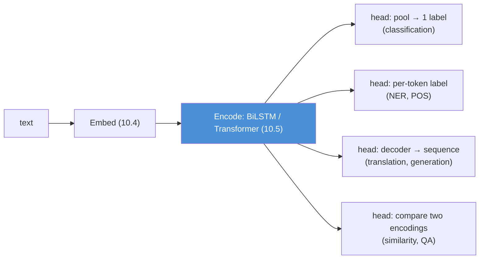
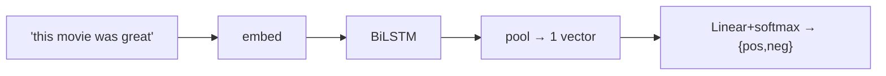
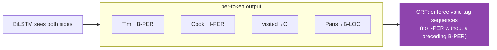
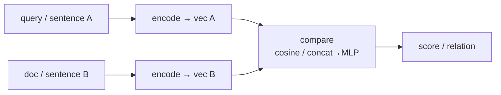
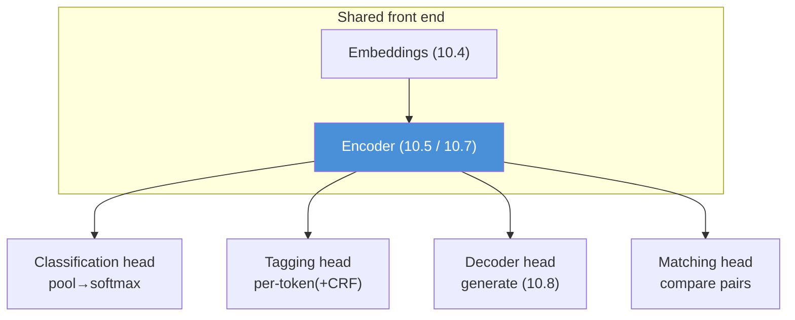
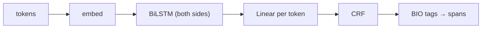

# 10.6 · NLP Tasks — The Architecture Behind Each One

[⬅ 10.5 Sequence Models](10.5-sequence-models.md) · [🏠 Module 10](../README.md) · [➡ 10.7 Attention](10.7-attention.md)

> **The lesson in one line:** There are only a handful of *shapes* of NLP problem — sequence→label, sequence→per-token-labels, sequence→sequence, and pair→score — and once you recognize the shape, the architecture and the metric follow.

---

## 🎯 Learning objectives

- Classify any NLP task into one of four **I/O shapes** and derive its architecture from the shape.
- Know the standard approach for **classification, sentiment, spam, NER, POS tagging, similarity, QA, generation, and translation**.
- Understand why **NER and tagging need per-token outputs** (and often a CRF), while classification needs a single pooled vector.
- See how **every task reuses** the same three pieces: embeddings ([10.4](10.4-word-embeddings.md)), an encoder ([10.5](10.5-sequence-models.md)), and a task-specific head.

## ✅ Prerequisites

- [10.4 embeddings](10.4-word-embeddings.md), [10.5 sequence models](10.5-sequence-models.md) — the reusable front end.
- [08.12 evaluation](../../08-Machine-Learning/weeks/08.12-evaluation.md) — precision/recall/F1 carry over.

---

## 🧠 Mental model

> [!IMPORTANT]
> **You do not learn N unrelated NLP tasks. You learn four I/O shapes and a shared front end.** Almost every model is `embed → encode → head`. The embeddings and encoder are the same across tasks; only the **head** (the last layer) and the **loss** change, and both are dictated by the *shape* of the output. Recognize the shape, and the architecture writes itself.



---

## The four shapes

| Shape | Input → Output | Tasks | Head | Loss |
|---|---|---|---|---|
| **1. Sequence → label** | one text → one class | classification, sentiment, spam, topic, intent | pool the encoding → linear → softmax | cross-entropy |
| **2. Sequence → per-token labels** | one text → a label per token | NER, POS tagging, chunking | linear per position (+ CRF) | per-token CE |
| **3. Sequence → sequence** | one text → another text | translation, summarization, generation | decoder ([10.8](10.8-seq2seq.md)) | per-token CE / teacher forcing |
| **4. Pair → score** | two texts → a relationship | similarity, entailment, retrieval, QA-ranking | encode both → compare | cosine / contrastive / CE |

Learn these four and you can place any new task in seconds. Let's walk each.

---

## Shape 1 — Sequence → label (classification)

The workhorse. Encode the sentence to a single vector (the final hidden state, or a **pooled** average/max over all positions), then a linear layer + softmax.



- **Sentiment analysis** — positive/negative/neutral. The recurring example; the hard part is negation and sarcasm ([10.5](10.5-sequence-models.md), [10.9](10.9-evaluation.md)).
- **Spam detection** — the [10.3 baseline](10.3-text-representation.md) task; TF-IDF+LR is often enough.
- **Topic classification / intent detection** — routing a support ticket or a voice command.

**Metric:** accuracy if balanced; **precision/recall/F1** if not (spam is imbalanced — [08.12](../../08-Machine-Learning/weeks/08.12-evaluation.md)).

> [!TIP]
> **Pooling choice matters.** Last-hidden-state biases toward the sentence end; **mean pooling** spreads attention across the sentence; **max pooling** grabs the single most salient feature. Attention pooling (a learned weighted average — a taste of [10.7](10.7-attention.md)) usually wins. Try mean first.

---

## Shape 2 — Sequence → per-token labels (tagging)

Every token gets its own label. This is where **bidirectionality earns its keep** — labeling a word correctly usually needs both left and right context.

### Named Entity Recognition (NER)

Find and classify spans: people, organizations, locations, dates, money.

```
"Tim Cook   visited  Paris   in  March"
 B-PER I-PER  O       B-LOC   O   B-DATE
```

The **BIO tagging scheme** turns span-finding into per-token classification: **B**egin, **I**nside, **O**utside. "Tim Cook" = B-PER I-PER (a two-token PERSON span).



> [!IMPORTANT]
> **NER often adds a CRF (Conditional Random Field) layer on top.** Independent per-token softmax can emit *illegal* sequences — like `O I-PER` (an "inside-person" tag with no "begin" before it). A CRF models the transition probabilities between tags and finds the best *globally consistent* label sequence, forbidding illegal transitions. BiLSTM-CRF was the dominant NER architecture for years. You don't need to implement the CRF from scratch, but know *why* it's there: **per-token independence is wrong when labels constrain each other.**

### Part-of-Speech (POS) tagging

Label each word's grammatical role: noun, verb, adjective, etc. Same shape as NER, same BiLSTM(-CRF) architecture. Useful as a *feature* for downstream tasks and for resolving the syntactic ambiguity from [10.1](10.1-introduction-to-nlp.md) ("saw" as noun vs verb).

**Metric:** per-token accuracy, but for NER prefer **entity-level F1** (did you get the *whole span* right?) — getting "Tim" but missing "Cook" is a partial failure that token accuracy over-credits.

---

## Shape 3 — Sequence → sequence (generation)

Input text → output text, where the output is itself a sequence the model generates one token at a time. Covered in depth in [10.8](10.8-seq2seq.md); the tasks:

- **Machine translation** — English → French. The task that *invented* attention.
- **Summarization** — long document → short summary (extractive: pick sentences; abstractive: generate new ones).
- **Text generation / language modeling** — predict the next token, repeatedly. This *is* what an LLM does ([Module 11](../../11-LLMs/README.md)).
- **Question answering (generative)** — question → generated answer.

**Architecture:** encoder–decoder ([10.8](10.8-seq2seq.md)) or decoder-only (LLMs). **Metric:** BLEU/ROUGE/perplexity — all flawed ([10.9](10.9-evaluation.md)).

---

## Shape 4 — Pair → score (matching)

Two pieces of text in, a relationship out. The engine of search and QA.

- **Text similarity** — how alike are two sentences? Encode both, compare (cosine of embeddings — [10.4](10.4-word-embeddings.md)).
- **Semantic search / retrieval** — is this document relevant to this query? (The [10.4 project](10.4-word-embeddings.md), scaled → [RAG, Module 13](../../13-RAG/README.md).)
- **Natural language inference (entailment)** — does sentence A imply, contradict, or stay neutral to B?
- **Extractive QA** — given a question and a passage, find the **span** in the passage that answers it (predict start and end token positions — a clever reframing of QA as two classification problems over positions).



> [!NOTE]
> **Two encoding strategies for pairs, and the tradeoff is latency vs accuracy.** A **bi-encoder** (encode each text separately, compare vectors) is fast — you can pre-embed all documents and just compare at query time (essential for search over millions of docs). A **cross-encoder** (feed both texts together, let them attend to each other) is more accurate but must run the full model per pair — too slow to scan a corpus. Production retrieval uses a bi-encoder to *retrieve* candidates and a cross-encoder to *rerank* the top few — the [retrieve-then-rerank pattern of RAG](../../13-RAG/README.md).

---

## The unifying picture



> [!IMPORTANT]
> **This is why one pretrained model can do everything.** BERT and the GPT family are just a strong shared front end (embed + encode); adapting to a new task is mostly swapping the head and fine-tuning ([Module 11](../../11-LLMs/README.md), [Module 15](../../15-Fine-Tuning/README.md)). The "one model, many tasks" magic of modern NLP is exactly the picture above with a Transformer encoder in the middle. You are building the intuition for transfer learning in NLP right now.

---

## 🏭 Production examples

| Product | Task(s) | Shape |
|---|---|---|
| **Support-ticket router** | intent classification | 1 |
| **Résumé/document redactor** | NER (find PII) → mask | 2 |
| **Grammar checker** | POS tagging + rules | 2 |
| **Translation app** | machine translation | 3 |
| **Search / RAG retriever** | similarity + reranking | 4 |
| **FAQ bot** | retrieval (4) + generation (3) | 4→3 |

## ⚡ Performance considerations

- **Tagging is per-token** — output and loss scale with sequence length, not just batch size; long documents are proportionally expensive.
- **Bi-encoders enable pre-computation** — embed your corpus once offline; only the query is embedded at request time. This is the single biggest latency lever in search ([10.13](10.13-production.md)).
- **CRF decoding (Viterbi) is O(n·k²)** in sequence length × number of tags — usually negligible, but a factor for huge tag sets.

## 🔒 Security & privacy considerations

> [!CAUTION]
> - **NER is a double-edged privacy tool.** It's the standard way to *find and redact* PII (names, SSNs, addresses) in free text — and the same model, pointed the other way, is an efficient way to *extract* PII at scale. Deploy it for redaction; guard it against misuse ([10.14](10.14-ethics-safety.md)).
> - **Classification models leak their training distribution.** Confidence scores and errors can reveal what a model was trained on; adversaries probe classifiers to reconstruct sensitive categories.
> - **Generative QA hallucinates authoritatively** ([10.9](10.9-evaluation.md), [10.14](10.14-ethics-safety.md)) — a wrong medical or legal answer delivered confidently is a safety issue, not just an accuracy one.

## 🚫 Common mistakes

| Mistake | Consequence |
|---|---|
| **Token accuracy for NER** | over-credits partial spans; use entity-level F1 |
| **No CRF / consistency layer for tagging** | illegal tag sequences (`O I-PER`) |
| **Using a cross-encoder to scan a whole corpus** | intractable latency; use bi-encoder retrieve + cross-encoder rerank |
| **Last-hidden-state pooling by default** | end-of-sentence bias; try mean/attention pooling |
| **Treating extractive and generative QA as the same** | different heads, metrics, and failure modes |
| **One metric for all shapes** | accuracy for generation is meaningless — see [10.9](10.9-evaluation.md) |

## ✅ Best practices

- **Identify the I/O shape first** — it fixes the head, the loss, and the metric.
- **Reuse the front end** — the same embeddings + encoder serve every task; specialize only the head.
- **Match the metric to the shape** — entity-F1 for NER, BLEU/ROUGE for generation, recall@k for retrieval.
- **Start with a strong baseline per shape** (TF-IDF+LR for classification, dictionary/regex for NER-lite) before neural models.
- **For pairs, default to retrieve-then-rerank** rather than one expensive model.

## 🏋️ Exercises

1. **Shape sorting.** Assign each to a shape and give its head + metric: language detection, hate-speech detection, machine translation, coreference resolution, semantic search, POS tagging, grammatical-acceptability judgment.
2. **BIO by hand.** Tag "Barack Obama was born in Hawaii in 1961" with BIO for PER/LOC/DATE. Then write one illegal tag sequence a CRF would forbid.
3. **Pooling ablation.** On a sentiment task, compare last-hidden, mean-pool, and max-pool. Report F1 for each and explain the differences.
4. **Why CRF.** Take a BiLSTM NER model's raw per-token predictions on 10 sentences. Count how many produce illegal BIO sequences. Argue for the CRF quantitatively.
5. **Bi- vs cross-encoder.** For a retrieval task, measure query latency and accuracy for (a) bi-encoder over the whole corpus, (b) bi-encoder retrieve top-20 + cross-encoder rerank. Chart the tradeoff.

## 🛠️ Mini project — "Named Entity Recognition System"

**Goal:** a production-shaped NER system that finds people, places, and organizations — the canonical Shape-2 task and a real PII-redaction tool.

**Requirements**
- A labeled NER dataset (CoNLL-2003 or similar) in BIO format.
- Embedding → **BiLSTM** → per-token linear → (optional) **CRF**, trained with the [09.10 loop](../../09-Deep-Learning/weeks/09.10-training-loop.md).
- **Entity-level precision/recall/F1** (not token accuracy).
- A demo mode that **redacts** detected entities from free text — the privacy application.

**Folder structure**
```
ner-system/
├── data.py            # BIO parsing, vocab, char/word features
├── model.py           # Embedding → BiLSTM → Linear (→ CRF)
├── train.py           # 09.10 loop
├── evaluate.py        # entity-level P/R/F1 (seqeval-style)
├── redact.py          # find entities → mask → return safe text
└── README.md
```

**Architecture diagram**


**Data pipeline:** build vocab on train; handle OOV with subword/char features.
**Training:** the standard loop; monitor entity-F1, not loss alone.
**Evaluation:** entity-level F1 per type; error analysis of boundary errors (partial spans).
**Testing:** assert no illegal BIO sequences post-CRF; assert redaction removes 100% of gold entities on a held-out set.
**Future improvements:** replace the BiLSTM with a pretrained Transformer encoder ([10.12](10.12-modern-libraries.md)) and measure the F1 jump — the same architecture, a stronger front end.

## 📄 Cheat sheet

| Shape | Tasks | Head | Metric |
|---|---|---|---|
| **Seq → label** | sentiment, spam, topic, intent | pool → softmax | acc / F1 |
| **Seq → per-token** | NER, POS | per-token(+**CRF**) | **entity-F1** |
| **Seq → seq** | translation, summary, generation | decoder (10.8) | BLEU/ROUGE/ppl |
| **Pair → score** | similarity, QA, retrieval | compare encodings | cosine / recall@k |

**⭐ Every model = embed → encode → head.** Only the head + loss + metric change per shape.
**⭐ NER needs a CRF** because per-token labels constrain each other.
**⭐ Retrieval = bi-encoder retrieve + cross-encoder rerank.**

## 🎴 Flashcards

- **⭐ What are the four NLP I/O shapes?** → Seq→label, seq→per-token-labels, seq→seq, pair→score.
- **What's shared across NLP tasks?** → The front end: embeddings + encoder; only the head, loss, and metric change.
- **What is the BIO scheme?** → Begin/Inside/Outside tags that turn span-finding (NER) into per-token classification.
- **⭐ Why does NER add a CRF?** → Per-token softmax can emit illegal sequences (O I-PER); a CRF enforces globally consistent tags.
- **Why entity-F1 over token accuracy for NER?** → Token accuracy over-credits partial spans; you care about whole correct entities.
- **⭐ Bi-encoder vs cross-encoder?** → Encode separately and compare vectors (fast, pre-computable) vs encode together with cross-attention (accurate, slow) → retrieve then rerank.
- **How is extractive QA framed?** → Predict the start and end token positions of the answer span — two position classifications.

## 💬 Interview questions

1. Given a new NLP task, how do you decide its architecture? Walk through the shape → head → loss → metric chain.
2. Why does NER use a BiLSTM and often a CRF? What goes wrong without each?
3. Why is token accuracy a poor metric for NER? What's better?
4. Explain bi-encoders vs cross-encoders and why production retrieval uses both.
5. How can one pretrained model serve classification, NER, and QA? What actually changes per task?

## 📝 Summary

- Nearly every NLP task is one of **four I/O shapes**: sequence→label, sequence→per-token-labels, sequence→sequence, pair→score. The shape dictates the **head, loss, and metric**.
- All share the front end **embed → encode**; only the last layer specializes — which is exactly why **one pretrained model transfers to many tasks**.
- **Tagging (NER/POS) needs per-token outputs and often a CRF** because labels constrain each other; evaluate NER at the **entity level**.
- **Pair tasks trade latency for accuracy** via bi-encoders (fast, pre-computable) and cross-encoders (accurate) — combined as retrieve-then-rerank.
- Recognizing the shape turns "learn N tasks" into "learn four patterns and a shared backbone" — the mental model that carries into Transformers and LLMs.

## 📚 References

1. **Jurafsky & Martin — _Speech and Language Processing_, chs. 8 (POS/NER), 17–18 (QA, IR).** ⭐
2. **Lample et al. (2016) — _Neural Architectures for Named Entity Recognition_.** ⭐ The BiLSTM-CRF NER architecture.
3. **Rajpurkar et al. (2016) — _SQuAD_.** Extractive QA as span prediction.
4. **Reimers & Gurevych (2019) — _Sentence-BERT_.** ⭐ Bi-encoders for efficient similarity/retrieval.
5. **Sang & De Meulder (2003) — _CoNLL-2003 NER shared task_.** The standard NER benchmark and BIO format.

---

## 🧭 Navigation

| Direction | Link |
|---|---|
| ⬅ Previous | [10.5 · Sequence Models](10.5-sequence-models.md) |
| ➡ Next | [10.7 · Attention](10.7-attention.md) |
| 🏠 Module | [Module 10](../README.md) |
| 📖 Lessons | [Lesson index](README.md) |
