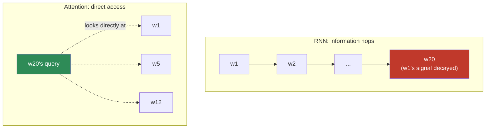
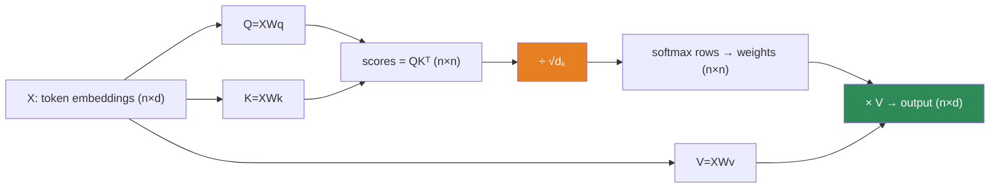
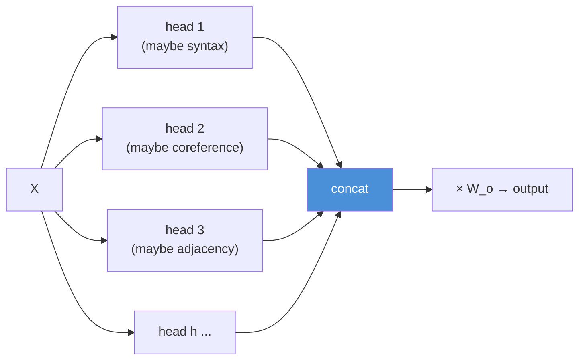
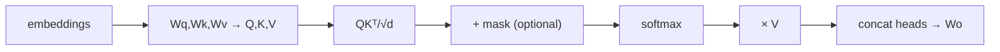

# 10.7 · Attention — Built From Scratch ⭐⭐

[⬅ 10.6 NLP Tasks](10.6-nlp-tasks.md) · [🏠 Module 10](../README.md) · [➡ 10.8 Seq2Seq](10.8-seq2seq.md)

> **The lesson in one line:** Attention lets every token look at every other token and pull in exactly the information it needs — `softmax(QKᵀ/√d)·V` — and once you build it by hand in NumPy, the Transformer stops being magic.

---

## 🎯 Learning objectives

- Explain **why attention was invented**: to break the [seq2seq bottleneck](10.5-sequence-models.md) and give every position direct access to every other.
- Understand **Query, Key, Value** as a differentiable, soft dictionary lookup.
- Derive the attention formula **term by term**, including *why* the `√d` scaling is there.
- **Build scaled dot-product attention and self-attention from scratch in NumPy.**
- Understand **multi-head attention** and why several small attentions beat one big one.
- See how attention produces **contextual embeddings** — the fix for [10.4](10.4-word-embeddings.md)'s one-vector-per-word limit — and why this is the doorway to [Module 11](../../11-LLMs/README.md).

## ✅ Prerequisites

- [10.4 embeddings](10.4-word-embeddings.md) (static → contextual), [10.5 seq2seq bottleneck](10.5-sequence-models.md) (the pain attention relieves).
- [06.2 dot product & softmax](../../06-Mathematics/weeks/06.2-linear-algebra-1.md), [06.11 transformer math](../../06-Mathematics/weeks/06.11-transformer-math.md) — this lesson *is* that math, built up slowly and by hand.
- [09.4 backprop](../../09-Deep-Learning/weeks/09.4-backpropagation.md) — attention is just matmuls + softmax, all differentiable.

---

## 🧠 Mental model

> [!IMPORTANT]
> **Attention is a soft, differentiable dictionary lookup.** Each token asks a question (its **Query**), every token advertises what it offers (its **Key**), and carries content (its **Value**). A token compares its query against all keys to get relevance scores, softmaxes them into weights, and takes a weighted average of the values. The result: each token's new representation is a **blend of the whole sentence, weighted by relevance to itself.** That is the entire idea. Everything else is bookkeeping.

Contrast with the RNN it replaced. An RNN passes information hop-by-hop through a hidden state, so word 1 reaches word 20 only after 19 lossy hops (the [vanishing-gradient/bottleneck problem, 10.5](10.5-sequence-models.md)). **Attention connects word 1 and word 20 directly — one step, no hops, no decay.** Distance stops mattering.



---

## Why attention was needed — the concrete fix for seq2seq

Recall the [seq2seq bottleneck](10.5-sequence-models.md): the encoder crushes the whole input into one fixed vector, and the decoder must generate everything from it. Attention's original 2014 insight (Bahdanau et al.) was:

> **Don't force the decoder to use only the final vector. Let it look back at *all* the encoder's hidden states, and at each output step, focus on the relevant input words.**

When translating "the agreement on the European Economic Area was signed in 1992" → French, as the decoder generates "signé," it should *attend to* "signed"; as it generates "1992," it should attend to "1992." Instead of one frozen summary, the decoder gets a **dynamic, per-step, relevance-weighted view of the input.** Translation quality on long sentences jumped immediately, and the field never looked back.

> **[FIGURE: Attention alignment heatmap.** A grid with English source words on the x-axis and French output words on the y-axis. Bright cells trace a roughly diagonal path with off-diagonal jumps where word order differs between languages (e.g., adjective-noun swaps). Caption: "Each output word's attention weights over the input — the model learned alignment without being told the alignment."**]

---

## Query, Key, Value — the dictionary analogy

Think of a Python dict lookup, then soften it.

```python
d = {"cat": "meow", "dog": "woof"}
d["cat"]   # hard lookup: query "cat" matches key "cat" exactly → return its value
```

A hard lookup returns *one* value where the query exactly equals a key. **Attention is the soft version:** the query is compared to *every* key by similarity, and you return a *weighted blend* of *all* values — mostly the best-matching one, but a little of the others. And crucially, Q, K, V are all **learned linear projections** of the input, so the model learns *what to ask, what to advertise, and what to share.*

| Term | Role | Learned as |
|---|---|---|
| **Query (Q)** | "what am I looking for?" | $Q = XW_Q$ |
| **Key (K)** | "what do I offer / how should I be found?" | $K = XW_K$ |
| **Value (V)** | "what content do I actually carry?" | $V = XW_V$ |

where $X$ is the matrix of input token embeddings and $W_Q, W_K, W_V$ are learned weight matrices. Separating "how you're matched" (Key) from "what you deliver" (Value) is the subtle, powerful part — a token can be *found* by one property and *contribute* something different.

---

## The formula, derived term by term

$$\text{Attention}(Q, K, V) = \text{softmax}\!\left(\frac{QK^\top}{\sqrt{d_k}}\right)V$$

Let's build it piece by piece. Say we have *n* tokens, each projected to dimension $d_k$.

### Step 1 — Scores: $QK^\top$

$Q$ is $(n, d_k)$, $K^\top$ is $(d_k, n)$, so $QK^\top$ is $(n, n)$ — **the score of every token's query against every token's key**, a full pairwise-relevance matrix. Entry $(i, j)$ = how much token *i* should attend to token *j*. This dot product is the [alignment measure from 06.2](../../06-Mathematics/weeks/06.2-linear-algebra-1.md): big when query and key point the same way.

### Step 2 — Scale: $\div \sqrt{d_k}$

Here is the term everyone glosses over, and it's load-bearing. The dot product of two random $d_k$-dimensional vectors has variance proportional to $d_k$. For $d_k = 64$, scores swing to ±8 or more. Feed large values into softmax and it **saturates** — nearly all weight on one token, gradients near zero everywhere else ([the sigmoid/softmax saturation from 09.2](../../09-Deep-Learning/weeks/09.2-neural-network-fundamentals.md)). Dividing by $\sqrt{d_k}$ rescales the scores back to unit variance, keeping softmax in its responsive, high-gradient regime.

> [!IMPORTANT]
> **The `√d_k` is a variance fix protecting a gradient.** It's the same story you saw in [06.11](../../06-Mathematics/weeks/06.11-transformer-math.md): without it, deep attention stacks don't train because the softmax gradients vanish. A tiny constant, doing exactly what negative sampling's 0.75 exponent did in [10.4](10.4-word-embeddings.md) — quietly keeping an optimization well-behaved. Never omit it.

### Step 3 — Softmax (per row)

Softmax each row of the $(n, n)$ score matrix, turning raw scores into **attention weights that sum to 1** across all tokens. Row *i* is now a probability distribution: "how token *i* divides its attention over all tokens." ([06.8's softmax](../../06-Mathematics/weeks/06.8-information-theory.md).)

### Step 4 — Weighted sum: $\times V$

Multiply the $(n, n)$ weights by $V$ $(n, d_v)$ → an $(n, d_v)$ output. **Each output row is a weighted average of all value vectors, weighted by that token's attention.** Token *i*'s new representation is a blend of the whole sentence, focused on what's relevant to *i*.



---

## 💻 Build it from scratch (NumPy)

No frameworks. This is the whole mechanism — read every line.

```python
import numpy as np

def softmax(x, axis=-1):
    x = x - x.max(axis=axis, keepdims=True)      # stability (09.9 / 06.9)
    e = np.exp(x)
    return e / e.sum(axis=axis, keepdims=True)

def attention(Q, K, V):
    """Scaled dot-product attention.
    Q: (n, d_k)   K: (n, d_k)   V: (n, d_v)   →  (n, d_v)
    """
    d_k = Q.shape[-1]
    scores = Q @ K.T / np.sqrt(d_k)              # (n, n) pairwise relevance, scaled
    weights = softmax(scores, axis=-1)           # (n, n) each row sums to 1
    return weights @ V, weights                   # (n, d_v), plus weights for inspection

def self_attention(X, W_q, W_k, W_v):
    """Self-attention: Q, K, V all come from the SAME sequence X.
    X: (n, d_model)  →  contextual representations (n, d_v)
    """
    Q, K, V = X @ W_q, X @ W_k, X @ W_v
    return attention(Q, K, V)
```

That's it. **Attention is three matmuls, a scale, a softmax, and one more matmul.** Every Transformer, every LLM, runs this in a loop. You just wrote the mechanism that powers ChatGPT.

### Watch it resolve "bank"

```python
# Toy demo: "river bank" vs "money bank" — self-attention gives 'bank' DIFFERENT
# representations because it attends to different neighbors.
# In "river bank", 'bank' attends strongly to 'river' → its output vector shifts
# toward the geographic sense. In "money bank", it attends to 'money' → financial sense.
# This is the CONTEXTUAL embedding that static Word2Vec (10.4) could never produce.
```

> [!IMPORTANT]
> **This is the payoff to [10.4](10.4-word-embeddings.md)'s cliffhanger.** Static embeddings gave "bank" one frozen vector. Self-attention gives "bank" a vector that *depends on its neighbors* — a **contextual embedding**. "River bank" and "money bank" now differ, because each "bank" attended to different words. Polysemy: solved, structurally. This single capability is why BERT and GPT crush everything that came before.

---

## Self-attention vs cross-attention

| | **Self-attention** | **Cross-attention** |
|---|---|---|
| Q, K, V from | the *same* sequence | Q from one sequence, K/V from another |
| Purpose | build context *within* a sequence | let one sequence attend to another |
| Used in | encoder; decoder self-attn | decoder attending to encoder ([10.8](10.8-seq2seq.md)) |
| Example | "bank" looking at "river" in its own sentence | French decoder looking at the English input |

The original 2014 attention was cross-attention (decoder→encoder). **Self-attention** — a sequence attending to *itself* — was the 2017 Transformer's key move: stack self-attention layers and you get contextual representations without any recurrence at all.

---

## Multi-head attention — several attentions at once

One attention computes one kind of relevance. But words relate in many ways at once: syntactic (subject-verb), semantic (adjective-noun), coreferential (pronoun-antecedent). **Multi-head attention runs *h* attention operations in parallel**, each with its own $W_Q, W_K, W_V$, then concatenates and projects the results.



Each head projects to a smaller dimension ($d_k = d_{model}/h$), so *h* heads cost about the same as one full-size attention — you get diversity of relationships **for free**. Interpretability studies show heads specializing: some track syntactic dependencies, some resolve pronouns, some just attend to the previous token. You don't design these; they emerge from training.

> [!TIP]
> **Multi-head is "an ensemble of relationship detectors."** One head might be terrible; the concat-and-project lets the model use whichever heads are informative for a given input — echoing the [ensemble decorrelation idea from 08.6](../../08-Machine-Learning/weeks/08.6-ensembles.md). More heads ≠ always better; 8–16 is typical.

---

## Complexity — the cost of looking at everything

Attention's superpower is also its cost. The score matrix $QK^\top$ is $(n, n)$ — **quadratic in sequence length.** Double the sequence, quadruple the compute and memory.

$$\text{Attention cost} \sim O(n^2 \cdot d)$$

For a 512-token sentence that's fine. For a 100,000-token document it's catastrophic — 10¹⁰ entries. This **O(n²) bottleneck** ([06.11](../../06-Mathematics/weeks/06.11-transformer-math.md)) is *the* central engineering problem of modern LLMs, and the reason for an entire research industry (FlashAttention, sparse attention, linear attention, sliding windows). Know it now; it dominates [Module 11](../../11-LLMs/README.md).

| | RNN | Attention |
|---|---|---|
| Path length between any two tokens | O(n) hops | **O(1)** — direct |
| Parallelizable across positions | ❌ sequential | ✅ one big matmul |
| Compute per layer | O(n·d²) | O(n²·d) |
| Long-range dependencies | decays (λⁿ) | **constant** |

> [!IMPORTANT]
> **The two columns explain the whole revolution.** Attention wins on path length (direct access → no vanishing gradient) *and* on parallelism (a matmul, not a sequential loop → full GPU utilization, [09.12](../../09-Deep-Learning/weeks/09.12-sequence-models.md)). It pays for it with O(n²) compute. That trade — quadratic cost for direct access and parallelism — was worth it, and it *is* why "Attention Is All You Need."

---

## 🏭 Production examples

| System | Attention role |
|---|---|
| **Every LLM (GPT, Claude, Llama)** | stacked self-attention *is* the model ([Module 11](../../11-LLMs/README.md)) |
| **Translation (modern)** | encoder self-attn + decoder cross-attn ([10.8](10.8-seq2seq.md)) |
| **BERT-based search/classification** | self-attention → contextual embeddings ([10.12](10.12-modern-libraries.md)) |
| **Vision transformers, protein folding** | attention isn't NLP-specific — it's a general "let elements interact" op |

## ⚡ Performance considerations

- **O(n²) memory is the wall.** The attention matrix, not the parameters, is what OOMs you on long sequences — [09.14's activation-memory story](../../09-Deep-Learning/weeks/09.14-performance.md) at its most acute. FlashAttention computes it without ever materializing the full $(n,n)$ matrix.
- **Attention is matmul-heavy → GPU-ideal.** Unlike RNNs, it saturates Tensor Cores; [mixed precision (09.14)](../../09-Deep-Learning/weeks/09.14-performance.md) is standard.
- **KV-caching** (reusing past keys/values during generation) is the single biggest inference speedup for autoregressive models — a [Module 11](../../11-LLMs/README.md) topic that this lesson's Q/K/V split makes possible.

## 🔒 Security & privacy considerations

> [!CAUTION]
> - **Attention weights are not faithful explanations.** It's tempting to read the heatmap as "the model looked here because it mattered." Research shows attention weights can be manipulated without changing predictions and don't reliably indicate feature importance. Do **not** present attention maps as trustworthy explanations in a high-stakes setting ([08.16](../../08-Machine-Learning/weeks/08.16-interpretability.md)).
> - **Contextual models still memorize.** Self-attention models trained on private text can leak it under extraction attacks, same as [10.5](10.5-sequence-models.md), and more so at scale ([10.14](10.14-ethics-safety.md)).
> - **Long-context = large attack surface.** The O(n²) cost means adversaries can craft long inputs to exhaust memory/compute (a denial-of-service vector) — validate and cap input length in production.

## 🚫 Common mistakes

| Mistake | Consequence |
|---|---|
| **Dropping the `√d_k` scale** | softmax saturates → vanishing gradients → won't train |
| **Softmax over the wrong axis** | weights don't sum over keys; nonsense attention |
| **Confusing Key and Value** | they're separate on purpose — matched-by vs delivered-content |
| **Forgetting the causal mask in generation** | the model "sees the future" ([10.8](10.8-seq2seq.md), Module 11) |
| **Reading attention maps as ground-truth explanations** | they're suggestive, not faithful |
| **Ignoring O(n²) until production** | OOM on long inputs; plan for it early |

## ✅ Best practices

- **Always scale by `√d_k`.** Non-negotiable.
- **Use numerically stable softmax** (subtract the max) — [09.9](../../09-Deep-Learning/weeks/09.9-data-loading.md)/[06.9](../../06-Mathematics/weeks/06.9-numerical-computing.md).
- **Prefer multi-head** with $d_k = d_{model}/h$; 8–16 heads is a sane default.
- **Cap and validate sequence length** — protects both memory and against DoS.
- **Build it once by hand** (this lesson's project) so the Transformer is transparent, then use optimized library kernels (FlashAttention) in production.

## 🏋️ Exercises

1. **By hand, tiny.** With 3 tokens and $d_k=2$, pick small integer Q, K, V. Compute $QK^\top$, scale, softmax, and the output — all with pen and paper. Verify against your NumPy `attention`.
2. **The scale matters.** Run `attention` with and without the `√d_k` division for $d_k \in \{4, 64, 512\}$. Print the max softmax weight in each case. Show saturation growing with $d_k$ when unscaled.
3. **Resolve polysemy.** Build toy embeddings where "bank" is equidistant from "river" and "money." Run self-attention on "river bank" and "money bank." Show "bank"'s output vector differs between the two — a contextual embedding.
4. **Self vs cross.** Implement both. For a toy translation pair, show cross-attention weights aligning output words to input words.
5. **Multi-head.** Extend to *h* heads with $d_k=d_{model}/h$. Confirm the parameter count ≈ single full attention. Inspect whether different heads attend differently on a sentence with a pronoun.
6. **Complexity.** Empirically time `attention` for $n \in \{64,128,256,512,1024\}$. Fit the curve — confirm it's quadratic, not linear.

## 🛠️ Mini project — "Attention From Scratch" ⭐

**Goal:** implement the complete attention mechanism in NumPy, then verify it against PyTorch — the [09.7](../../09-Deep-Learning/weeks/09.7-autograd.md) discipline applied to the most important operation in modern AI.

**Requirements**
- Scaled dot-product attention, self-attention, and multi-head attention — **NumPy only** for the forward pass.
- A `torch.allclose` verification against `torch.nn.functional.scaled_dot_product_attention` (or a hand-built PyTorch version) proving your implementation is correct.
- An **attention-visualization** tool: given a sentence, plot the $(n,n)$ weight heatmap and read off what each token attends to.
- The **polysemy demo**: show "bank" gets different vectors in "river bank" vs "money bank."
- A **causal-masking** option (set future scores to −∞ before softmax) — a preview of generative Transformers.

**Folder structure**
```
attention-from-scratch/
├── attention.py       # softmax, scaled_dot_product, self_attention, multi_head
├── masking.py         # causal + padding masks
├── verify.py          # torch.allclose vs PyTorch
├── visualize.py       # (n×n) heatmap
├── polysemy_demo.py   # 'bank' in two contexts
└── README.md
```

**Architecture diagram**


**Testing strategy:** `torch.allclose` on random inputs (the core correctness test); assert attention weights sum to 1 per row; assert the causal mask zeroes all future weights; gradient-check the whole thing in float64 ([09.4](../../09-Deep-Learning/weeks/09.4-backpropagation.md)).
**Evaluation:** qualitative — do the heatmaps and polysemy vectors match intuition?
**Future improvements:** stack self-attention + a feed-forward block + LayerNorm + residuals and you have a **Transformer encoder layer** — which is exactly where [Module 11](../../11-LLMs/README.md) begins. This project is one `add_norm` away from a Transformer.

## 📄 Cheat sheet

| Concept | One line |
|---|---|
| **⭐ Attention** | `softmax(QKᵀ/√dₖ)·V` — soft, differentiable dictionary lookup |
| **Query / Key / Value** | what I seek / how I'm matched / what I deliver (all learned projections) |
| **⭐ QKᵀ** | (n×n) pairwise relevance — every token vs every token |
| **⭐ √dₖ scaling** | variance fix; without it softmax saturates → gradients vanish |
| **softmax rows** | turn scores into weights summing to 1 |
| **× V** | weighted blend of all values → context-aware output |
| **Self-attention** | Q,K,V from the same sequence → **contextual embeddings** |
| **Cross-attention** | Q from one sequence, K/V from another (decoder→encoder) |
| **Multi-head** | h parallel attentions → many relationship types, ~same cost |
| **⭐ O(n²)** | quadratic in length — the central LLM engineering problem |
| **vs RNN** | O(1) path length + parallel, at O(n²) cost |

## 🎴 Flashcards

- **⭐ State the attention formula.** → `softmax(QKᵀ/√dₖ)·V`.
- **What are Q, K, V?** → Learned projections: Query = what a token seeks, Key = how it's matched, Value = what content it delivers.
- **⭐ Why divide by √dₖ?** → Dot-product variance grows with dₖ; without scaling, softmax saturates and gradients vanish.
- **What does QKᵀ compute?** → An (n×n) matrix of every token's relevance to every other token.
- **⭐ Why is attention better than an RNN for long range?** → Direct O(1) access between any two tokens (no hop-by-hop decay) and full parallelism.
- **What is a contextual embedding?** → A token's representation that depends on its neighbors — self-attention gives "bank" different vectors in different sentences.
- **Self- vs cross-attention?** → Same sequence (context within) vs Q from one, K/V from another (attend across).
- **⭐ Why multi-head?** → Different heads capture different relationship types (syntax, coreference) at ~the cost of one attention.
- **⭐ What's attention's main cost?** → O(n²) in sequence length — the central scaling problem of LLMs.
- **Are attention weights faithful explanations?** → No — suggestive, but manipulable and not reliable importance scores.

## 💬 Interview questions

1. Derive scaled dot-product attention. What does each of Q, K, V do, and why are Key and Value separate?
2. Why the `√d_k` scaling? What fails without it?
3. How does attention solve the seq2seq bottleneck *and* the RNN's long-range problem? Contrast path length and parallelism.
4. What is a contextual embedding, and how does self-attention produce one? Why couldn't Word2Vec?
5. Explain multi-head attention. Why not just use one big attention head?
6. What is the computational complexity of attention, and why does it dominate LLM engineering?
7. Someone shows you an attention heatmap as "proof" the model reasoned a certain way. What's your response?

## 📝 Summary

- **Attention was invented to break the [seq2seq bottleneck](10.5-sequence-models.md)**: instead of one frozen summary vector, let each output step attend to all input positions by relevance.
- The mechanism is a **soft dictionary lookup**: `softmax(QKᵀ/√dₖ)·V`, where **Query/Key/Value** are learned projections — matched-by (Key) is deliberately separate from delivered-content (Value).
- The **`√dₖ` scaling is a variance fix** that keeps softmax responsive and gradients alive — never omit it.
- **Self-attention produces contextual embeddings** — "bank" finally differs by sentence — solving [10.4](10.4-word-embeddings.md)'s one-vector-per-word limit; **multi-head** captures many relationship types at once.
- Attention beats RNNs on **path length (O(1), direct)** and **parallelism (one matmul)**, paying with **O(n²)** compute — the trade that launched the Transformer era and defines [Module 11](../../11-LLMs/README.md).
- **You built it from scratch** — the Transformer is now assembly of parts you own.

## 📚 References

1. **Vaswani et al. (2017) — _Attention Is All You Need_.** ⭐⭐ The Transformer. Read it after this lesson — you'll understand every equation.
2. **Bahdanau, Cho & Bengio (2014) — _Neural Machine Translation by Jointly Learning to Align and Translate_.** ⭐ The paper that introduced attention (for seq2seq).
3. **Jay Alammar — _The Illustrated Transformer_.** ⭐⭐ The best visual walkthrough of Q/K/V and multi-head.
4. **[06.11 Transformer Math](../../06-Mathematics/weeks/06.11-transformer-math.md).** Your own module's symbol-by-symbol derivation.
5. **Jain & Wallace (2019) — _Attention is not Explanation_.** Why attention maps aren't faithful explanations.
6. **Dao et al. (2022) — _FlashAttention_.** How production tames the O(n²) memory cost.

---

## 🧭 Navigation

| Direction | Link |
|---|---|
| ⬅ Previous | [10.6 · NLP Tasks](10.6-nlp-tasks.md) |
| ➡ Next | [10.8 · Sequence-to-Sequence Models](10.8-seq2seq.md) |
| 🏠 Module | [Module 10](../README.md) |
| 📖 Lessons | [Lesson index](README.md) |
