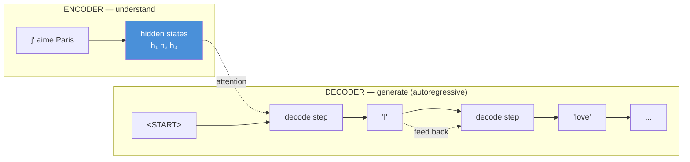
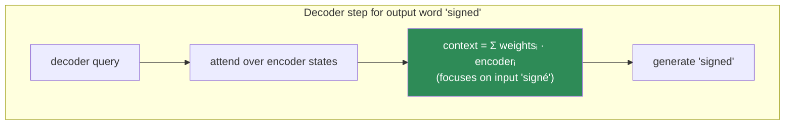
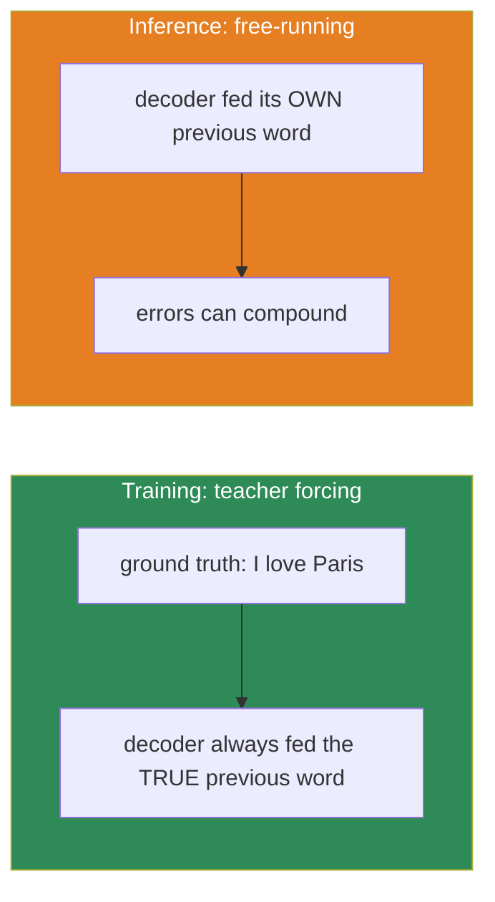
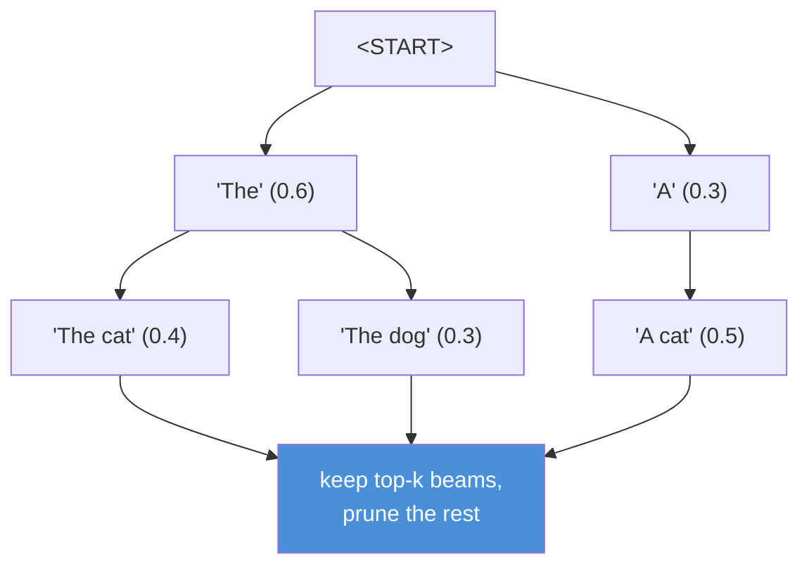
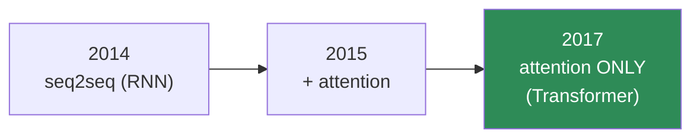
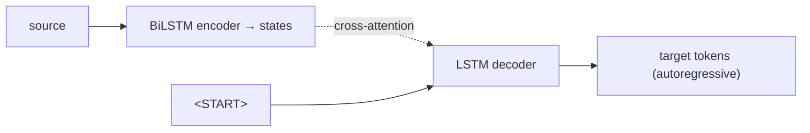

# 10.8 · Sequence-to-Sequence Models — Encoder–Decoder, Teacher Forcing, Beam Search

[⬅ 10.7 Attention](10.7-attention.md) · [🏠 Module 10](../README.md) · [➡ 10.9 Evaluation](10.9-evaluation.md)

> **The lesson in one line:** Seq2seq is how a model turns one sequence into another — an encoder reads, a decoder writes one token at a time — and bolting attention onto it produced the architecture that became the Transformer.

---

## 🎯 Learning objectives

- Build the **encoder–decoder** architecture and understand its division of labor.
- Understand **teacher forcing** — why it speeds training and how it causes exposure bias.
- Understand **autoregressive decoding** and why generation is inherently sequential.
- Compare **greedy, beam, and sampling** decoding strategies.
- See **attention-based seq2seq** as the direct ancestor of the Transformer, and name the last limitation (recurrence) that [Module 11](../../11-LLMs/README.md) removes.

## ✅ Prerequisites

- [10.5 seq2seq bottleneck](10.5-sequence-models.md) — the problem this lesson's attention solves.
- [10.7 attention](10.7-attention.md) — the mechanism; here it's *applied* to encoder–decoder.

---

## 🧠 Mental model

> [!IMPORTANT]
> **Seq2seq splits "transform one sequence into another" into two jobs: an encoder that *understands* the input into a representation, and a decoder that *generates* the output one token at a time, feeding each token it produces back in to produce the next.** Translation, summarization, and chatbots are all this shape. The encoder is comprehension; the decoder is production; attention is the bridge that lets production look back at comprehension.



---

## The encoder–decoder architecture

**Encoder:** an RNN/LSTM (or Transformer) reads the input sequence and produces a set of hidden states — one per input token — plus a final summary. Its job is pure comprehension; it never generates.

**Decoder:** another RNN/LSTM (or Transformer) that generates the output **autoregressively** — one token per step, where each generated token becomes the input for the next step. It starts from a `<START>` token and stops when it emits `<END>` (or hits a length cap).

Without attention (the [10.5 version](10.5-sequence-models.md)), the decoder saw only the encoder's *final* vector — the bottleneck. **With attention ([10.7](10.7-attention.md)), at every decoding step the decoder computes attention over *all* encoder hidden states**, pulling in whichever input words are relevant to the token it's about to produce. That is the whole upgrade, and it's why attention-based seq2seq crushed vanilla seq2seq on long sequences.



---

## Teacher forcing — training the decoder

Training an autoregressive decoder has a chicken-and-egg problem: to produce token *t*, it needs token *t−1* as input — but early in training its own tokens are garbage, so errors compound and it never learns.

**Teacher forcing** fixes this: during *training*, feed the decoder the **ground-truth** previous token, not its own prediction. The model always sees correct context, so it learns fast and each step's loss is clean.



> [!CAUTION]
> **Teacher forcing creates exposure bias.** The model is trained *only* on perfect prefixes but at inference must run on its *own* (imperfect) outputs — a distribution it never saw in training. One early mistake can cascade into gibberish because the model was never exposed to recovering from its own errors. Mitigations: **scheduled sampling** (mix in the model's own predictions during training) and, more fundamentally, large-scale pretraining ([Module 11](../../11-LLMs/README.md)) which makes the model robust enough that exposure bias rarely bites. Know the term — it's a classic interview question.

This is [09.3's cross-entropy loss](../../09-Deep-Learning/weeks/09.3-math-of-neural-networks.md) applied per output token, and — because you feed the whole ground-truth sequence at once — teacher-forced training can be **parallelized across output positions** (a fact the Transformer exploits massively).

---

## Autoregressive decoding — why generation is slow

At *inference* there's no ground truth, so the decoder runs free: generate a token, feed it back, generate the next. This is **inherently sequential** — token *t* literally cannot be computed before token *t−1* exists.

> [!IMPORTANT]
> **This is the deep asymmetry of generation: training parallelizes, inference does not.** You can teacher-force all output positions at once during training, but generation is a hard sequential loop — which is why LLM *inference* is latency-bound and expensive (one forward pass per output token), and why tricks like KV-caching and speculative decoding exist ([Module 11](../../11-LLMs/README.md)). The [09.12](../../09-Deep-Learning/weeks/09.12-sequence-models.md) "RNNs can't parallelize" problem never fully dies — attention kills it for *encoding* and *training*, but *generation* is autoregressive by nature.

---

## Decoding strategies — how to pick each token

At each step the decoder outputs a probability distribution over the vocabulary. How you turn that into a chosen token matters enormously for output quality.

### Greedy decoding

Take the single highest-probability token every step. Fast, deterministic — and **short-sighted**: the locally-best token can lead to a globally-worse sentence. Greedy commits early and can't backtrack.

### Beam search

Keep the *k* best partial sequences ("beams") at every step, expand each, and prune back to the top *k*. It explores multiple hypotheses and usually finds a higher-probability overall sequence than greedy.



| Strategy | Pros | Cons |
|---|---|---|
| **Greedy** | fastest, deterministic | short-sighted; can miss the best sequence |
| **Beam (k)** | higher-probability output; good for translation | k× slower; **favors short, generic, "safe" text**; can be repetitive |
| **Sampling** (temperature/top-k/top-p) | diverse, creative, natural | can wander or produce errors |

> [!TIP]
> **Beam search is right for translation, wrong for open-ended generation.** Translation has a "correct" answer, so maximizing probability helps. Open-ended text (stories, chat) wants *diversity* — and beam search's probability-maximizing bias produces bland, repetitive output ("I don't know. I don't know. I don't know."). That's why LLMs generate with **sampling** — temperature, top-k, top-p — the [06.5 sampling knobs](../../06-Mathematics/weeks/06.5-probability.md) you already met. Match the decoder to the task.

---

## Attention-based seq2seq → the Transformer

Put the pieces together and you have the state of the art circa 2016: **BiLSTM encoder + LSTM decoder + attention.** It powered Google Translate. But it still had one weakness — **the recurrence.** The encoder and decoder were still RNNs, so they were still sequential, still slow to train, still bounded by how much you could parallelize.

The 2017 insight ([_Attention Is All You Need_](../../06-Mathematics/weeks/06.11-transformer-math.md)) was radical and simple:

> **If attention already lets any token access any other directly, why keep the RNN at all? Replace recurrence *entirely* with self-attention.**



Removing recurrence removed the last sequential bottleneck in *encoding* and *training* — now the entire input processes in one parallel pass. Stack self-attention + feed-forward + LayerNorm + residuals, add positional encodings (since attention alone is order-blind — a set operation), and you have the Transformer.

> [!IMPORTANT]
> **You now understand the entire lineage.** BoW → embeddings → RNN → seq2seq → attention → seq2seq+attention → drop the RNN → **Transformer.** Every step solved the previous step's specific failure: embeddings fixed orthogonality, RNNs fixed order, LSTMs fixed vanishing gradients, attention fixed the bottleneck, and the Transformer fixed recurrence's non-parallelism. [Module 11](../../11-LLMs/README.md) starts exactly here — and you built the load-bearing piece (attention) by hand in [10.7](10.7-attention.md). **There is nothing left in the Transformer that is new to you.**

---

## 🏭 Production examples

| System | Seq2seq form |
|---|---|
| **Machine translation** | encoder–decoder + cross-attention (now Transformer-based) |
| **Summarization** | encoder–decoder (BART, T5) |
| **Chatbots / assistants** | decoder-only (GPT family) — a "seq2seq" where the prompt is the input |
| **Speech-to-text, code generation** | the same encoder–decoder shape |
| **Grammar correction, paraphrasing** | text-to-text (T5's "everything is seq2seq") |

## ⚡ Performance considerations

- **Generation cost = output length × per-token forward pass.** A 500-token response is 500 sequential forward passes. This dominates LLM serving cost/latency ([10.13](10.13-production.md), Module 11).
- **Beam search multiplies inference cost by *k*** and needs careful length normalization (longer sequences have lower total probability — divide by length or it always prefers short outputs).
- **KV-caching** avoids recomputing attention over the already-generated prefix each step — the single most important generation optimization, enabled by attention's Q/K/V structure ([10.7](10.7-attention.md)).

## 🔒 Security & privacy considerations

> [!CAUTION]
> - **Generative decoders can emit memorized training data verbatim** — names, addresses, secrets — especially with greedy/beam decoding that favors high-probability (often memorized) sequences. A real risk for models trained on private corpora ([10.14](10.14-ethics-safety.md)).
> - **Hallucination is a decoding-time phenomenon too.** A fluent, high-probability sequence can be entirely fabricated; the decoder optimizes for *plausible*, not *true* ([10.9](10.9-evaluation.md)).
> - **Uncontrolled generation is an injection surface.** In production, a decoder that echoes attacker-controlled input can be steered (prompt injection) — validate and constrain outputs ([Module 11](../../11-LLMs/README.md) safety).

## 🚫 Common mistakes

| Mistake | Consequence |
|---|---|
| **Training free-running instead of teacher-forced** | errors compound early; slow/failed convergence |
| **Forgetting exposure bias** | model brittle on its own outputs at inference |
| **Beam search for open-ended generation** | bland, repetitive, generic text |
| **No length normalization in beam search** | always prefers short outputs |
| **No `<END>` handling** | generation never stops (or stops instantly) |
| **Expecting parallel generation** | it's autoregressive — inherently sequential |

## ✅ Best practices

- **Teacher-force during training; consider scheduled sampling** if exposure bias hurts.
- **Choose the decoder for the task:** beam for translation, sampling (temp/top-p) for open-ended text.
- **Normalize beam scores by length** and cap max length.
- **Always define `<START>`/`<END>`/`<PAD>` tokens** and handle them explicitly.
- **Reach for a Transformer** — attention-based seq2seq with an RNN is a stepping stone; production uses Transformers ([10.12](10.12-modern-libraries.md), Module 11).

## 🏋️ Exercises

1. **Bottleneck vs attention.** Train an RNN seq2seq with and without attention on a reversal or date-format task. Plot BLEU vs input length. Quantify attention's advantage on long inputs.
2. **Teacher forcing.** Train the same decoder with 100% teacher forcing and with scheduled sampling. Compare inference-time quality; find a case where the teacher-forced-only model derails on its own output.
3. **Decoding bake-off.** For one trained model, generate with greedy, beam (k=1,3,5,10), and top-p sampling. Compare output quality and diversity. Where does beam get repetitive?
4. **Beam by hand.** With a toy 4-word vocabulary and made-up step probabilities, run beam search (k=2) for 3 steps by hand. Show the surviving beams at each step.
5. **Alignment.** Extract and plot the cross-attention weights from your attention seq2seq on a translation pair. Do they align output words to the right input words?

## 🛠️ Mini project — "Sequence-to-Sequence Translator"

**Goal:** build an attention-based translator and *feel* every concept in this lesson — then see exactly what the Transformer improves.

**Requirements**
- A small parallel corpus (e.g., a date-normalization task "March 3, 2020" → "2020-03-03", or a small language pair).
- **Encoder** (BiLSTM) + **decoder** (LSTM) + **cross-attention** ([10.7](10.7-attention.md)), trained with **teacher forcing** and the [09.10 loop](../../09-Deep-Learning/weeks/09.10-training-loop.md).
- **Greedy and beam** decoding at inference.
- **BLEU** evaluation ([10.9](10.9-evaluation.md)) and **attention-alignment heatmaps**.
- An ablation: same model **without** attention, to prove the bottleneck's cost on long inputs.

**Folder structure**
```
seq2seq-translator/
├── data.py            # parallel pairs, vocab, <START>/<END>/<PAD>
├── encoder.py         # BiLSTM
├── decoder.py         # LSTM + cross-attention
├── train.py           # teacher forcing, 09.10 loop
├── decode.py          # greedy + beam
├── evaluate.py        # BLEU + alignment heatmaps
└── README.md
```

**Architecture diagram**


**Data pipeline:** build source/target vocabs on train; pad+pack; special tokens.
**Training:** teacher forcing; overfit-one-batch smoke test; gradient clipping.
**Evaluation:** BLEU on held-out; attention heatmaps for qualitative alignment; length-vs-BLEU curve with/without attention.
**Testing:** assert generation terminates on `<END>`; assert beam(k=1) == greedy; assert attention weights sum to 1.
**Future improvements:** replace the RNN encoder/decoder with **self-attention** — you now have a Transformer, the exact starting point of [Module 11](../../11-LLMs/README.md).

## 📄 Cheat sheet

| Concept | One line |
|---|---|
| **Seq2seq** | encoder (understand) → decoder (generate) one token at a time |
| **⭐ Attention in seq2seq** | decoder attends over ALL encoder states each step → no bottleneck |
| **Autoregressive** | each generated token feeds the next → generation is sequential |
| **⭐ Teacher forcing** | train on ground-truth previous token (fast, clean loss) |
| **Exposure bias** | trained on perfect prefixes, tested on own outputs → can derail |
| **Greedy** | pick argmax each step — short-sighted |
| **Beam (k)** | keep k best partials — better probability, but bland for open text |
| **Sampling** | temp/top-k/top-p — diverse; the LLM default |
| **⭐ The lineage** | seq2seq → +attention → drop the RNN → **Transformer** |

## 🎴 Flashcards

- **What are the two halves of seq2seq?** → Encoder (comprehends input into representations) and decoder (autoregressively generates output).
- **⭐ What does attention add to seq2seq?** → The decoder attends over all encoder states each step instead of one fixed vector — killing the bottleneck.
- **What is teacher forcing?** → Feeding the decoder the ground-truth previous token during training (not its own prediction).
- **⭐ What is exposure bias?** → The train/inference mismatch: trained on perfect prefixes, but at inference runs on its own imperfect outputs.
- **Why is generation slow?** → It's autoregressive — token t needs token t−1, so it can't be parallelized (unlike training).
- **Greedy vs beam vs sampling?** → Argmax (short-sighted) / keep k best (high-prob, bland) / random by distribution (diverse, LLM default).
- **⭐ Why use sampling not beam for chatbots?** → Beam maximizes probability → generic, repetitive text; open-ended generation wants diversity.
- **⭐ What was the Transformer's key move over seq2seq+attention?** → Remove recurrence entirely; use only self-attention → full parallelism.

## 💬 Interview questions

1. Explain the encoder–decoder architecture and where attention fits. What problem does the attention solve?
2. What is teacher forcing, and what problem (exposure bias) does it create? How would you mitigate it?
3. Why is autoregressive generation inherently sequential, and why does that matter for LLM serving cost?
4. Compare greedy, beam, and sampling decoding. Which for translation, which for a chatbot, and why?
5. Trace the path from RNN seq2seq to the Transformer. What did each step fix, and what did the Transformer remove?

## 📝 Summary

- **Seq2seq** maps one sequence to another via an **encoder** (comprehension) and an autoregressive **decoder** (generation); it's the shape of translation, summarization, and chat.
- **Attention** upgrades it by letting the decoder look back at *all* encoder states each step — resolving the [10.5 bottleneck](10.5-sequence-models.md).
- **Teacher forcing** trains the decoder on ground-truth prefixes (fast, clean) at the cost of **exposure bias** at inference.
- **Generation is autoregressive and sequential** — training parallelizes, inference does not — the root of LLM latency cost.
- **Decoding strategy is task-dependent:** beam for translation, sampling for open-ended generation.
- The **lineage ends at the Transformer**: attention-based seq2seq minus recurrence — and you've already built its core, so [Module 11](../../11-LLMs/README.md) is assembly, not discovery.

## 📚 References

1. **Sutskever, Vinyals & Le (2014) — _Sequence to Sequence Learning with Neural Networks_.** ⭐ The seq2seq paper.
2. **Bahdanau et al. (2014) — _Neural MT by Jointly Learning to Align and Translate_.** ⭐⭐ Attention for seq2seq.
3. **Vaswani et al. (2017) — _Attention Is All You Need_.** The destination of this lineage.
4. **Bengio et al. (2015) — _Scheduled Sampling for Sequence Prediction_.** The exposure-bias mitigation.
5. **Freitag & Al-Onaizan (2017) — _Beam Search Strategies for NMT_.** Length normalization and beam tuning.

---

## 🧭 Navigation

| Direction | Link |
|---|---|
| ⬅ Previous | [10.7 · Attention](10.7-attention.md) |
| ➡ Next | [10.9 · Evaluation](10.9-evaluation.md) |
| 🏠 Module | [Module 10](../README.md) |
| 📖 Lessons | [Lesson index](README.md) |
