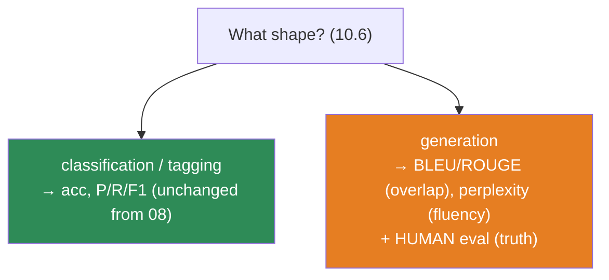
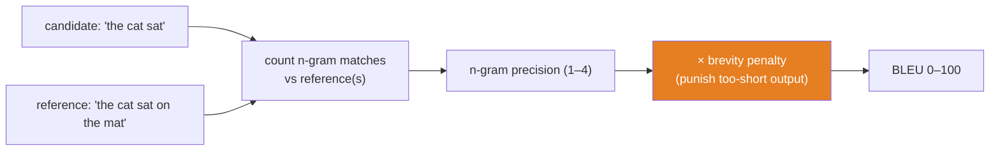
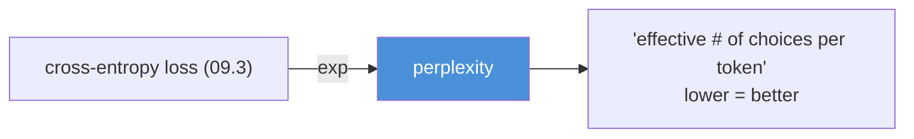
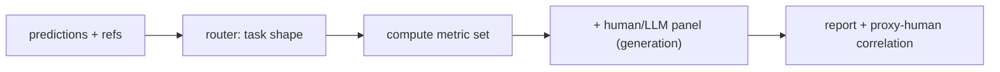

# 10.9 · Evaluation — F1, BLEU, ROUGE, Perplexity, and Why They All Lie

[⬅ 10.8 Seq2Seq](10.8-seq2seq.md) · [🏠 Module 10](../README.md) · [➡ 10.10 NLP Data](10.10-nlp-data.md)

> **The lesson in one line:** Classification metrics carry over unchanged from [Module 08](../../08-Machine-Learning/README.md), but *generation* has no single right answer — so BLEU, ROUGE, and perplexity are useful proxies that systematically miss the thing you actually care about: whether the text is good.

---

## 🎯 Learning objectives

- Reuse **accuracy/precision/recall/F1** for NLP classification — and know when macro vs micro matters.
- Understand **BLEU** and **ROUGE** for generation: what they measure, and their built-in blind spots.
- Understand **perplexity** as the intrinsic language-model metric and its exact link to [cross-entropy (06.8)](../../06-Mathematics/weeks/06.8-information-theory.md).
- Internalize the core discipline: **automated NLP metrics are proxies; human evaluation is the ground truth for generation.**

## ✅ Prerequisites

- [08.12 evaluation](../../08-Machine-Learning/weeks/08.12-evaluation.md) — precision/recall/F1, thresholds; this lesson extends it to language.
- [06.8 information theory](../../06-Mathematics/weeks/06.8-information-theory.md) — perplexity *is* exponentiated cross-entropy.

---

## 🧠 Mental model

> [!IMPORTANT]
> **NLP evaluation splits cleanly by task shape ([10.6](10.6-nlp-tasks.md)).** For **classification and tagging**, the output is a label — there's a right answer, so [Module 08](../../08-Machine-Learning/README.md)'s metrics apply directly. For **generation** (translation, summarization, chat), there are *many* valid outputs and no single truth — so every automated metric is a compromise that measures surface overlap and hopes it correlates with quality. The senior skill is knowing exactly *how* each metric is wrong.



---

## Classification & tagging — Module 08, unchanged

For sentiment, spam, topic, intent, NER, POS — the output is a discrete label, so you already know the metrics ([08.12](../../08-Machine-Learning/weeks/08.12-evaluation.md)):

| Metric | Reminder | NLP note |
|---|---|---|
| **Accuracy** | fraction correct | lies on imbalanced data (spam!) — [08.12](../../08-Machine-Learning/weeks/08.12-evaluation.md) |
| **Precision** | of predicted-positive, how many right | "when I flag spam, am I right?" |
| **Recall** | of actual-positive, how many found | "did I catch all the spam?" |
| **F1** | harmonic mean of P and R | the default for imbalanced text tasks |

**Macro vs micro F1** matters in NLP because classes are usually skewed:

- **Micro-F1** pools all decisions — dominated by frequent classes. Good when every *instance* matters equally.
- **Macro-F1** averages per-class F1 — every *class* counts equally, so a model that ignores rare classes gets punished. Good when rare classes matter (most real NLP).

> [!TIP]
> **Report macro-F1 for imbalanced multi-class NLP.** A sentiment model that's great on "positive"/"negative" but useless on rare "neutral" looks fine on micro-F1 and bad on macro-F1 — and the macro number is the honest one. For **NER**, use **entity-level** F1 (whole spans), not token accuracy ([10.6](10.6-nlp-tasks.md)).

---

## Generation — where evaluation gets hard

Translate "the cat is on the mat." Valid outputs: "le chat est sur le tapis," "le chat se trouve sur le tapis," "un chat est sur le tapis"... all correct. There is no single reference to check against. Automated generation metrics all make the same bet: **measure n-gram overlap with one or more reference texts, and hope overlap tracks quality.** It partly does, and partly doesn't.

### BLEU — precision of n-grams (translation)

**BLEU** (Bilingual Evaluation Understudy) asks: *of the n-grams the model produced, how many appear in the reference?* It's an **n-gram precision** score, combining 1- through 4-grams, with a **brevity penalty** so the model can't game precision by emitting one perfect word.



> [!CAUTION]
> **BLEU's blind spots, all real:**
> - **No semantics.** "The film was great" vs "The movie was excellent" — near-zero n-gram overlap, identical meaning, terrible BLEU. It rewards matching *words*, not *meaning*.
> - **No grammar sense.** Word-salad with the right words can outscore a fluent paraphrase.
> - **Reference-bound.** One reference can't cover all valid translations; more references help but you rarely have them.
> - **Not comparable across datasets/tokenizations.** A BLEU of 35 means nothing in isolation.
>
> BLEU is a *relative* dial for comparing systems on the *same* test set — never an absolute measure of "good."

### ROUGE — recall of n-grams (summarization)

**ROUGE** is BLEU's mirror for summarization: where BLEU is precision-oriented (don't produce junk), **ROUGE is recall-oriented** (did the summary *cover* the reference's content?). Variants: **ROUGE-N** (n-gram recall), **ROUGE-L** (longest common subsequence — rewards in-order overlap without requiring contiguity).

| | **BLEU** | **ROUGE** |
|---|---|---|
| Task | translation | summarization |
| Orientation | **precision** (of what I said, how much matches) | **recall** (of the reference, how much I covered) |
| Rationale | translations shouldn't add junk | summaries shouldn't miss content |
| Shares blind spot | ✅ surface overlap, no semantics | ✅ same |

The precision/recall split makes sense: a translation that omits content is wrong (precision-ish framing), while a summary is *allowed* to omit — its job is coverage of the key points (recall framing).

### Perplexity — the language model's own metric

**Perplexity** measures how well a language model predicts text — how "surprised" it is by the actual next tokens. It is **exponentiated cross-entropy** ([06.8](../../06-Mathematics/weeks/06.8-information-theory.md)):

$$\text{PPL} = \exp\!\left(-\frac{1}{N}\sum_{i=1}^{N}\log p(x_i \mid x_{<i})\right) = e^{\,\text{cross-entropy}}$$

**Intuition:** perplexity is the *effective number of equally-likely choices* the model is deciding among at each step. PPL = 1 → perfect (certain of every token). PPL = 50 → as unsure as picking among 50 options. Lower is better.

> [!IMPORTANT]
> **Perplexity IS your training loss, exponentiated.** You already minimized cross-entropy in [09.3](../../09-Deep-Learning/weeks/09.3-math-of-neural-networks.md); perplexity is just `exp(loss)`, put on a human-readable scale. It needs no reference text — only the model's probabilities — which makes it the standard **intrinsic** metric for pretraining LLMs ([Module 11](../../11-LLMs/README.md)). But note:
> - **Perplexity measures fluency/prediction, not usefulness.** A model can have low perplexity and still be unhelpful, biased, or wrong.
> - **It's only comparable within the same tokenization and vocabulary.** Different tokenizers → incomparable perplexities (a subword model and a word model can't be compared).



---

## The metrics landscape

| Metric | Task | Measures | Fatal flaw |
|---|---|---|---|
| **Accuracy** | classification | fraction correct | lies on imbalance |
| **Macro-F1** | classification (imbalanced) | per-class balance | — (the good default) |
| **Entity-F1** | NER | whole-span correctness | — (use over token acc) |
| **BLEU** | translation | n-gram precision | no semantics; reference-bound |
| **ROUGE** | summarization | n-gram recall | no semantics |
| **Perplexity** | language modeling | prediction/fluency | not usefulness; tokenizer-bound |
| **Human eval** | generation | actual quality | slow, costly, subjective |

> [!IMPORTANT]
> **The uncomfortable truth: for generation, there is no good automated metric, and human evaluation is the only ground truth.** BLEU/ROUGE/perplexity are cheap proxies you use to *iterate quickly*, but the final verdict on a chatbot, summarizer, or translator comes from people rating fluency, adequacy, and correctness. Modern practice adds **learned metrics** (BERTScore — embedding similarity instead of exact overlap; COMET for translation) and **LLM-as-judge** (use a strong model to grade outputs) — better than BLEU, but still imperfect and themselves biased. The honest engineer reports a proxy metric *and* a human eval, and never lets the proxy become the goal ([Goodhart's law](../../08-Machine-Learning/weeks/08.15-hyperparameter-tuning.md)).

---

## 🏭 Production examples

| System | Primary metric | Plus |
|---|---|---|
| **Spam filter** | precision (cost of false positive) + recall | threshold tuning ([08.12](../../08-Machine-Learning/weeks/08.12-evaluation.md)) |
| **NER redactor** | entity-level recall (miss = leaked PII) | precision to avoid over-redaction |
| **Translation** | BLEU/COMET to iterate + human adequacy | |
| **Summarizer** | ROUGE to iterate + human faithfulness | hallucination check ([10.14](10.14-ethics-safety.md)) |
| **LLM pretraining** | perplexity | downstream task benchmarks |

## ⚡ Performance considerations

- **BLEU/ROUGE are cheap** (n-gram counting) → run them every epoch as a cheap signal.
- **Human eval is the bottleneck** → sample a fixed, stratified eval set; don't re-rate everything each iteration.
- **Perplexity is free** — it's your validation loss — so track it continuously ([09.10](../../09-Deep-Learning/weeks/09.10-training-loop.md)).
- **LLM-as-judge costs API calls per example** → budget it; use it on a sampled slice, not the full set.

## 🔒 Security & privacy considerations

> [!CAUTION]
> - **Optimizing a proxy metric hides real failures.** A summarizer tuned for ROUGE can score well while **hallucinating** facts not in the source — ROUGE can't detect fabrication ([10.14](10.14-ethics-safety.md)). High BLEU ≠ safe or true output. Always pair overlap metrics with a **faithfulness/factuality** check.
> - **Test sets leak into training at scale.** Benchmark contamination — the eval set appearing in the training corpus — inflates every metric and is rampant with web-scraped LLM data. Verify your test set isn't in your training data (the [leakage discipline of 08.13](../../08-Machine-Learning/weeks/08.13-cross-validation.md), at web scale).
> - **Human eval data is sensitive.** Rating real user outputs means human raters see real user text — a privacy exposure that needs consent and PII handling.

## 🚫 Common mistakes

| Mistake | Consequence |
|---|---|
| **Accuracy on imbalanced text** | 99% by always predicting majority; catches nothing |
| **Micro-F1 hiding rare-class failure** | model ignores rare classes, metric looks fine |
| **Token accuracy for NER** | over-credits partial spans — use entity-F1 |
| **Reporting BLEU as an absolute score** | "BLEU 35" is meaningless without the same test set/tokenizer |
| **Treating BLEU/ROUGE as quality** | they measure overlap; fluent paraphrases score low, junk can score high |
| **Comparing perplexity across tokenizers** | invalid — PPL depends on the vocabulary |
| **Optimizing the proxy, shipping the proxy** | Goodhart's law — high ROUGE, hallucinated summary |

## ✅ Best practices

- **Match the metric to the task shape** ([10.6](10.6-nlp-tasks.md)): F1 for classification, entity-F1 for NER, BLEU/ROUGE for generation, perplexity for LM.
- **Prefer macro-F1** for imbalanced multi-class; **entity-level** for NER.
- **Never trust a generation metric alone** — pair it with human eval (or LLM-as-judge on a sample) and a faithfulness check.
- **Report the test set and tokenizer** with any BLEU/perplexity number.
- **Guard against benchmark contamination** — confirm test data isn't in training.
- **Fix the eval set early** and hold it constant so numbers are comparable across experiments.

## 🏋️ Exercises

1. **Macro vs micro.** Build a 3-class sentiment set that's 80/15/5. Train a model that ignores the 5% class. Report micro- and macro-F1 and explain the gap.
2. **BLEU by hand.** For candidate "the cat sat" and reference "the cat sat on the mat," compute 1- and 2-gram precision and the brevity penalty. Then show a fluent paraphrase that scores near zero.
3. **ROUGE vs BLEU.** For a summarization pair, compute ROUGE-1/2/L and BLEU. Explain why recall-orientation suits summaries.
4. **Perplexity = exp(loss).** Take a trained LM's validation cross-entropy and compute perplexity. Interpret it as "effective choices per token." Verify `PPL == exp(loss)` numerically.
5. **Break the metric.** Find a translation that has high BLEU but is wrong, and one that is correct but has low BLEU. Write up why automated metrics need human backup.
6. **Contamination check.** Given a test set and a training corpus, write a script to detect exact/near-duplicate overlap. Report how much leaked.

## 🛠️ Mini project — "An NLP Evaluation Harness"

**Goal:** a reusable harness that scores any NLP model with the *right* metric for its task shape — and flags when a metric is being trusted too much.

**Requirements**
- Implement from scratch (verify against libraries): macro/micro-F1, entity-level F1 (seqeval-style), BLEU, ROUGE-1/2/L, and perplexity.
- A **task-shape router** ([10.6](10.6-nlp-tasks.md)) that picks the metric set automatically.
- A **proxy-vs-human panel**: for generation, show BLEU/ROUGE alongside a small human (or LLM-judge) rating, and compute their correlation on your data — making the proxy's unreliability *visible*.
- A **contamination check** between train and test.

**Folder structure**
```
nlp-eval-harness/
├── classification.py  # macro/micro F1, entity-F1
├── generation.py      # BLEU, ROUGE, perplexity
├── router.py          # task shape → metric set
├── human_panel.py     # collect/compare ratings; proxy-human correlation
├── contamination.py   # train/test overlap
├── verify.py          # np.allclose vs sacrebleu/rouge-score/seqeval
└── README.md
```

**Architecture diagram**


**Testing:** `np.allclose` vs `sacrebleu`, `rouge-score`, `seqeval`; assert perplexity == exp(cross-entropy); assert the router picks the right metrics per shape.
**Evaluation:** the harness's own output is the deliverable; validate on a known dataset with published scores.
**Future improvements:** add **BERTScore** and **COMET** (learned metrics) and compare their human-correlation to BLEU/ROUGE on your set — quantifying how much better semantic metrics are.

## 📄 Cheat sheet

| Metric | Task | What | Watch out |
|---|---|---|---|
| **Macro-F1** | classification | per-class balanced F1 | use for imbalance |
| **Entity-F1** | NER | whole-span correctness | not token accuracy |
| **BLEU** | translation | n-gram **precision** + brevity penalty | no semantics; relative only |
| **ROUGE** | summarization | n-gram **recall** (R-N, R-L) | no semantics |
| **⭐ Perplexity** | language modeling | `exp(cross-entropy)` = effective choices/token | tokenizer-bound; ≠ usefulness |
| **Human / LLM-judge** | generation | actual quality | slow/costly; the real truth |

**⭐ Generation has no single right answer → every automated metric is a proxy → pair with human eval.**
**⭐ Perplexity = exp(loss).** BLEU=precision, ROUGE=recall.

## 🎴 Flashcards

- **Which metrics carry over unchanged from Module 08?** → Accuracy/precision/recall/F1 for classification and tagging.
- **Macro vs micro F1?** → Macro averages per-class (rare classes count equally); micro pools decisions (frequent classes dominate). Prefer macro for imbalance.
- **⭐ What does BLEU measure?** → N-gram precision vs reference(s) with a brevity penalty — for translation.
- **⭐ What does ROUGE measure?** → N-gram recall vs reference — for summarization (coverage).
- **⭐ What is perplexity?** → Exponentiated cross-entropy; the effective number of equally-likely choices per token; lower is better.
- **Why is perplexity not comparable across tokenizers?** → It depends on the vocabulary/units the probability is over.
- **⭐ Why do BLEU/ROUGE "lie"?** → They measure surface n-gram overlap, not meaning — fluent paraphrases score low, wrong-but-overlapping text scores high.
- **What's the ground truth for generation quality?** → Human evaluation (or, as a proxy, LLM-as-judge) — automated metrics are only iteration signals.

## 💬 Interview questions

1. Why can't you use accuracy for a spam classifier? What do you use instead?
2. Explain BLEU and ROUGE. Why is one precision-oriented and the other recall-oriented?
3. What is perplexity, and how does it relate to cross-entropy loss? What does a perplexity of 20 mean?
4. Give a concrete example where BLEU misjudges a translation in both directions.
5. How would you evaluate a summarization model that scores high on ROUGE? What could it still be doing wrong?
6. What is benchmark contamination, and how does it corrupt evaluation at LLM scale?

## 📝 Summary

- **Classification/tagging evaluation is [Module 08](../../08-Machine-Learning/README.md) unchanged** — prefer **macro-F1** for imbalance and **entity-F1** for NER.
- **Generation has no single correct output**, so **BLEU** (n-gram precision, translation) and **ROUGE** (n-gram recall, summarization) measure surface overlap — useful for iteration, blind to meaning.
- **Perplexity = exp(cross-entropy)** — the intrinsic language-model metric, readable as "effective choices per token," but tokenizer-bound and a measure of fluency, not usefulness.
- **Automated generation metrics are proxies; human evaluation is the truth** — pair them, add a faithfulness check, and never optimize the proxy into the goal (Goodhart).
- Guard against **benchmark contamination** — test data in training inflates everything.

## 📚 References

1. **Papineni et al. (2002) — _BLEU: a Method for Automatic Evaluation of Machine Translation_.** ⭐ The BLEU paper.
2. **Lin (2004) — _ROUGE: A Package for Automatic Evaluation of Summaries_.** ⭐ The ROUGE paper.
3. **Jurafsky & Martin — _Speech and Language Processing_, ch. 3 (perplexity) & evaluation sections.** ⭐
4. **Zhang et al. (2020) — _BERTScore_** and **Rei et al. (2020) — _COMET_.** Learned, semantic evaluation metrics.
5. **Post (2018) — _A Call for Clarity in Reporting BLEU Scores_ (sacreBLEU).** Why BLEU numbers are so often incomparable.

---

## 🧭 Navigation

| Direction | Link |
|---|---|
| ⬅ Previous | [10.8 · Seq2Seq](10.8-seq2seq.md) |
| ➡ Next | [10.10 · NLP Data](10.10-nlp-data.md) |
| 🏠 Module | [Module 10](../README.md) |
| 📖 Lessons | [Lesson index](README.md) |
