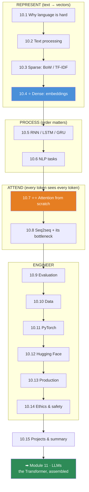

# Module 10 · Natural Language Processing — Lessons

[⬅ Module home](../README.md) · [🗺 Roadmap](../../../ROADMAP.md) · [📚 Curriculum](../../../CURRICULUM.md)

> This is the map of Module 10. **Every lesson is a variation on one question: how do you turn language into numbers a network can compute with — without throwing away the meaning?** We start with the crudest answer (a word is an index) and end one step short of a Transformer, having built attention from scratch with our own hands.

---

## The rule of this module

> [!IMPORTANT]
> **NLP is the discipline of representation.** A model never sees text. It sees the vectors you chose to turn text into — and *every* NLP result you will ever get is bounded by that choice. One-hot vectors can't tell "king" from "queen." Bag-of-words can't tell "dog bites man" from "man bites dog." Embeddings fix the first; sequence models fix the second; **attention fixes both at once and scales — which is the entire reason Transformers exist.**
>
> **The plan:** represent text (sparse → dense) → process sequence (RNN → LSTM) → let every token see every other token (**attention, built by hand in NumPy**) → understand why that replaced recurrence. By the end you will have written the attention mechanism yourself, and [Module 11](../../11-LLMs/README.md)'s Transformer will be pieces you already own.

This module cashes in **[Module 09](../../09-Deep-Learning/README.md)** directly: the [embedding layer](../../09-Deep-Learning/weeks/09.8-building-models.md) is a lookup table trained by [the loop you already wrote](../../09-Deep-Learning/weeks/09.10-training-loop.md); [LSTMs and the vanishing-gradient-across-time story](../../09-Deep-Learning/weeks/09.12-sequence-models.md) are the backbone of Section 5; and [attention](../../09-Deep-Learning/weeks/09.12-sequence-models.md) — sketched there — is *derived* here. It also inherits **[Module 08](../../08-Machine-Learning/README.md)**'s discipline unchanged: TF-IDF + logistic regression is still a real baseline, evaluation is still precision/recall/F1, and *data leakage in NLP is exactly as fatal as anywhere else.*

---

## The 15 lessons

| # | Lesson | The one thing | From scratch? |
|---|---|---|---|
| 10.1 | [Introduction to NLP](10.1-introduction-to-nlp.md) | Language is **ambiguous, contextual, and compositional** — that's why it's hard | — |
| 10.2 | [Text Processing](10.2-text-processing.md) | Normalization is **lossy**; every step you add throws information away | ✅ |
| 10.3 | [Text Representation](10.3-text-representation.md) | One-hot / BoW / **TF-IDF** — sparse, meaning-blind, and still a strong baseline | ✅ |
| 10.4 | [Word Embeddings](10.4-word-embeddings.md) ⭐ | **Meaning is geometry** — Word2Vec turns words into directions | ✅ |
| 10.5 | [Sequence Models for NLP](10.5-sequence-models.md) | Word **order** is signal; RNN/LSTM/GRU/BiLSTM read it | ✅ |
| 10.6 | [NLP Tasks](10.6-nlp-tasks.md) | Classification, NER, tagging, QA, generation — **the architecture per task** | — |
| 10.7 | [Attention](10.7-attention.md) ⭐⭐ | **Every token looks at every other token** — built by hand in NumPy | ✅ |
| 10.8 | [Sequence-to-Sequence Models](10.8-seq2seq.md) | Encoder–decoder, teacher forcing, beam search — and **why the bottleneck killed it** | ✅ |
| 10.9 | [Evaluation](10.9-evaluation.md) | F1, **BLEU, ROUGE, perplexity** — and why they all lie a little | — |
| 10.10 | [NLP Data](10.10-nlp-data.md) | Annotation, label quality, bias, leakage — **the model is only as good as the labels** | — |
| 10.11 | [NLP with PyTorch](10.11-nlp-with-pytorch.md) | The full text pipeline: vocab → embed → encode → classify | ✅ |
| 10.12 | [NLP with Modern Libraries](10.12-modern-libraries.md) | Hugging Face `tokenizers`/`datasets`/`transformers` — **conceptually** | — |
| 10.13 | [NLP Production Systems](10.13-production.md) | Preprocessing pipelines, batch vs online, latency, caching, monitoring | — |
| 10.14 | [NLP Ethics & Safety](10.14-ethics-safety.md) | Bias, toxicity, PII, hallucination — **identify and reduce** | — |
| 10.15 | [Projects & Summary](10.15-projects-summary.md) | Seven projects; the arc from BoW to attention, connected | ✅ |

⭐ marks the load-bearing lessons. **10.4 (embeddings)** is where meaning becomes geometry; **10.7 (attention)** is where you build, by hand, the mechanism that runs the modern world.

---

## The dependency graph

---

## The through-lines (watch these recur)

| Idea | Where it reappears |
|---|---|
| **Text → vectors is the whole game** | Every lesson from 10.3 on |
| **Sparse (one-hot, BoW) → dense (embeddings)** | 10.3 → 10.4; the great leap |
| **Word order is signal** | BoW discards it (10.3), sequence models keep it (10.5), attention preserves it via position (10.7) |
| **⭐ The `predicted − actual` gradient** | Word2Vec (10.4), every classifier (10.6, 10.11) — same as [Module 09](../../09-Deep-Learning/weeks/09.4-backpropagation.md) |
| **⭐ Attention = softmax(QKᵀ/√d)·V** | 10.7 (built), 10.8 (fixes seq2seq), → Module 11 |
| **The fixed-vector bottleneck** | Why seq2seq failed (10.8) → why attention won |
| **Evaluation & MLOps don't change** | 10.9, 10.13 inherit [Module 08](../../08-Machine-Learning/README.md) |
| **Meaning-blind representations propagate bias** | 10.4 (embedding bias) → 10.14 |

---

## Companion artifacts

| Artifact | Purpose |
|---|---|
| [Exercises](../exercises/README.md) | Conceptual, text-processing, NumPy, PyTorch, debugging, evaluation |
| [Quiz](../quizzes/quiz-01.md) + [Answers](../quizzes/answers-01.md) | 40 questions across all 15 lessons |
| [Flashcards](../flashcards/deck.md) | ~90-card spaced-repetition deck |
| [Cheat sheet](../cheat-sheets/nlp-cheatsheet.md) | One-page quick reference |

---

## 🧭 Navigation

| Direction | Link |
|---|---|
| ⬆ Module home | [Module 10](../README.md) |
| ⬅ Previous module | [09 · Deep Learning](../../09-Deep-Learning/README.md) |
| ➡ Next module | [11 · LLMs](../../11-LLMs/README.md) |
| 🗺 Roadmap | [ROADMAP.md](../../../ROADMAP.md) |
