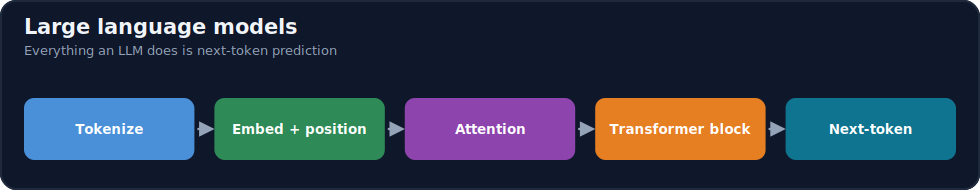
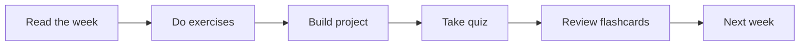

# Module 11 · LLMs

[⬅ 10 · NLP](../10-NLP/README.md) · [🏠 docs](../README.md) · [🗺 Roadmap](../../ROADMAP.md) · [12 · Prompt Engineering ➡](../12-Prompt-Engineering/README.md)

> How large language models are trained, decode, and behave.

---

## Purpose

This module covers **LLMs**. How large language models are trained, decode, and behave. It fits into the overall program as described in the [Roadmap](../../ROADMAP.md) and [Curriculum](../../CURRICULUM.md).

## What you'll learn

- Pretraining objectives and scaling laws
- Decoding strategies (temperature, top-k/top-p)
- Context windows, positional encoding, KV cache
- Model selection: capability, cost, licensing

## 📖 Lessons (start here)

> ✅ **This module's content is written.** Work through the lessons in order via the [lesson index](weeks/README.md).

| # | Lesson | Build? |
|---|---|---|
| 11.1 | [What Is a Language Model?](weeks/11.1-what-is-a-language-model.md) | — |
| 11.2 | [Tokenization](weeks/11.2-tokenization.md) | ✅ |
| 11.3 | [Embeddings & Positional Encoding](weeks/11.3-embeddings-positional.md) | ✅ |
| 11.4 | [Attention](weeks/11.4-attention.md) ⭐ | ✅ |
| 11.5 | [Transformer Architecture](weeks/11.5-transformer-architecture.md) ⭐ | — |
| 11.6 | [Decoder-Only Transformers](weeks/11.6-decoder-only.md) | ✅ |
| 11.7 | [Encoder / Decoder / Encoder-Decoder](weeks/11.7-encoder-decoder-types.md) | — |
| 11.8 | [Build a Mini Transformer](weeks/11.8-build-mini-transformer.md) ⭐⭐ | ✅ |
| 11.9 | [Pretraining](weeks/11.9-pretraining.md) | — |
| 11.10 | [Scaling Laws](weeks/11.10-scaling-laws.md) | — |
| 11.11 | [Fine-Tuning](weeks/11.11-fine-tuning.md) | ✅ |
| 11.12 | [Parameter-Efficient Fine-Tuning (LoRA/QLoRA)](weeks/11.12-peft-lora.md) ⭐ | ✅ |
| 11.13 | [Alignment (RLHF, DPO)](weeks/11.13-alignment.md) | — |
| 11.14 | [Inference & Decoding](weeks/11.14-inference-decoding.md) | ✅ |
| 11.15 | [KV Cache](weeks/11.15-kv-cache.md) ⭐ | ✅ |
| 11.16 | [Inference Optimization](weeks/11.16-inference-optimization.md) | — |
| 11.17 | [LLM Evaluation](weeks/11.17-evaluation.md) | — |
| 11.18 | [LLM Safety](weeks/11.18-safety.md) | — |
| 11.19 | [APIs vs Open Models](weeks/11.19-apis-vs-open-models.md) | — |
| 11.20 | [Production LLM Architecture](weeks/11.20-production-architecture.md) | — |
| 11.21 | [Projects & Summary](weeks/11.21-projects-summary.md) | ✅ |

**Companion artifacts:** [Exercises](exercises/README.md) · [Quiz](quizzes/quiz-01.md) · [Flashcards](flashcards/deck.md) · [Cheat sheet](cheat-sheets/llm-cheatsheet.md)

> [!IMPORTANT]
> **⭐ The rule of this module: an LLM is not a black box.** It is a stack of the self-attention blocks you built in [10.7](../10-NLP/weeks/10.7-attention.md), trained to **predict the next token**, scaled up, and aligned to be useful. Every capability — chat, reasoning, code — is an emergent side effect of getting very good at that one prediction.
>
> You will **build a working GPT from scratch** ([11.8](weeks/11.8-build-mini-transformer.md)) before relying on any library, then learn how real models are **pretrained** ([11.9](weeks/11.9-pretraining.md)), **scaled** ([11.10](weeks/11.10-scaling-laws.md)), **fine-tuned** ([11.11](weeks/11.11-fine-tuning.md)–[11.12](weeks/11.12-peft-lora.md)), **aligned** ([11.13](weeks/11.13-alignment.md)), and **served** ([11.14](weeks/11.14-inference-decoding.md)–[11.20](weeks/11.20-production-architecture.md)).
>
> **And the discipline that carries through: this module cashes in everything before it.** Attention, the [training loop](../09-Deep-Learning/weeks/09.10-training-loop.md), cross-entropy, the [rank argument behind LoRA](../06-Mathematics/weeks/06.3-linear-algebra-2.md), subword tokenization, sampling, and MLOps all came from earlier modules. **There is almost nothing new here — there is assembly, scale, and engineering.**

## How this module is organized

Content is delivered week by week. Each module uses the same subfolders:

| Folder | Contents |
|---|---|
| [`weeks/`](weeks/) | Weekly lesson content, one file per week (`week-01.md`, `week-02.md`, …). |
| [`diagrams/`](diagrams/) | Mermaid sources and exported diagram assets for this module. |
| [`exercises/`](exercises/) | Hands-on practice problems with solutions. |
| [`projects/`](projects/) | Buildable projects that apply this module's skills. |
| [`quizzes/`](quizzes/) | Self-assessment question banks with answer keys. |
| [`flashcards/`](flashcards/) | Spaced-repetition Q/A decks for active recall. |
| [`cheat-sheets/`](cheat-sheets/) | One-page quick references for this module. |
| [`references/`](references/) | Paper summaries and deep-dive notes. |

## Suggested study flow

## File & naming conventions

| Item | Convention | Example |
|---|---|---|
| Weekly lesson | `week-NN.md` | `weeks/week-01.md` |
| Exercise | `exercise-NN.md` (+ `solution-NN.*`) | `exercises/exercise-01.md` |
| Project | `project-NN/` folder with `README.md` | `projects/project-01/` |
| Quiz | `quiz-NN.md` (+ `answers-NN.md`) | `quizzes/quiz-01.md` |
| Flashcards | `deck.md` | `flashcards/deck.md` |
| Diagram | `topic.mmd` / `topic.png` | `diagrams/attention.mmd` |

## Markdown conventions

This file follows the repository Markdown standards — see [CONTRIBUTING.md](../../CONTRIBUTING.md): one H1 per file, tables over prose, GitHub callouts (`> [!NOTE]`), fenced code blocks with a language, Mermaid for diagrams, and relative internal links.

## Related modules

- [NLP](../10-NLP/README.md)
- [Prompt Engineering](../12-Prompt-Engineering/README.md)

---

## Navigation

| Direction | Link |
|---|---|
| ⬆ Parent | [docs/](../README.md) |
| ⬅ Previous | [⬅ 10 · NLP](../10-NLP/README.md) |
| ➡ Next | [12 · Prompt Engineering ➡](../12-Prompt-Engineering/README.md) |
| 🗺 Roadmap | [ROADMAP.md](../../ROADMAP.md) |
| 📚 Curriculum | [CURRICULUM.md](../../CURRICULUM.md) |
| 🏠 Repo root | [README.md](../../README.md) |
