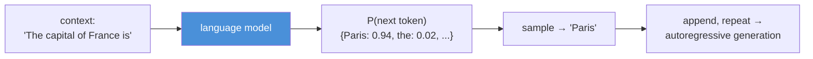
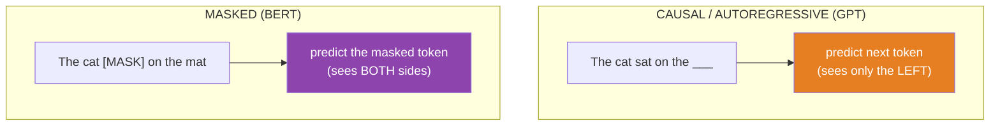
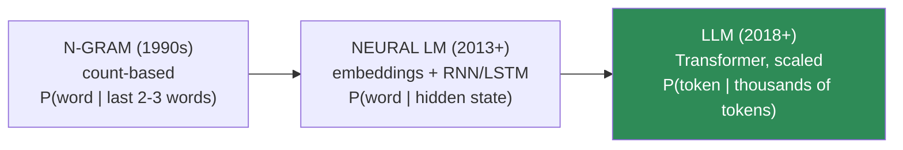
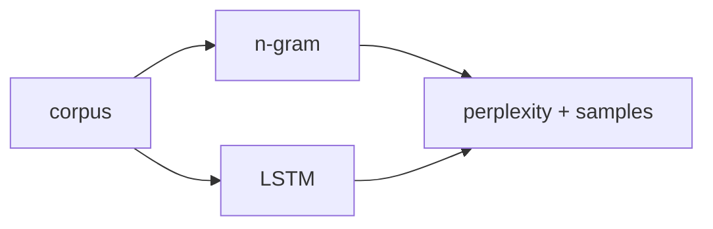

# 11.1 · What Is a Language Model? — Everything Is Next-Token Prediction

[🏠 Module 11](../README.md) · [📖 Lessons](README.md) · [➡ 11.2 Tokenization](11.2-tokenization.md)

> **The lesson in one line:** A language model assigns probabilities to sequences of text, and every modern LLM does it one way — predict the next token given everything before it — so this single objective is the key that unlocks the entire module.

---

## 🎯 Learning objectives

- Define a language model as a **probability distribution over sequences**.
- Understand **next-token prediction** and the **chain rule of probability** that makes it exact.
- Distinguish **autoregressive / causal** LMs from **masked** LMs, and know which powers ChatGPT and why.
- Place today's **LLMs** on the arc from n-gram models → neural LMs → Transformers, and see what "large" actually changed.

## ✅ Prerequisites

- [10.1 what NLP is](../../10-NLP/weeks/10.1-introduction-to-nlp.md), [10.8 seq2seq & the Transformer lineage](../../10-NLP/weeks/10.8-seq2seq.md).
- [06.5 probability & the chain rule](../../06-Mathematics/weeks/06.5-probability.md), [06.8 cross-entropy/perplexity](../../06-Mathematics/weeks/06.8-information-theory.md).

---

## 🧠 Mental model

> [!IMPORTANT]
> **A language model is a function that, given some text, produces a probability distribution over what comes next.** That's it. "The cat sat on the ___" → `{mat: 0.31, floor: 0.12, sofa: 0.09, ...}`. Training makes those probabilities match real language. Generation samples from them in a loop. **Every capability an LLM appears to have — answering questions, writing code, reasoning — is an emergent side effect of getting very, very good at this one prediction.**

The profound and slightly unsettling claim of this module: **there is no separate "understanding" module inside an LLM.** It was trained only to predict the next token. Question-answering, translation, and code generation all emerge because *predicting the next token well, over the entire internet, requires* modeling grammar, facts, reasoning patterns, and code syntax. Competence is a byproduct of compression.



---

## The math: probability of a sequence

A language model assigns a probability to any sequence of tokens $x_1, x_2, \dots, x_n$. The **chain rule of probability** ([06.5](../../06-Mathematics/weeks/06.5-probability.md)) factors that joint probability into a product of conditionals — *exactly*, no approximation:

$$P(x_1, \dots, x_n) = \prod_{t=1}^{n} P(x_t \mid x_1, \dots, x_{t-1})$$

Read it aloud: **the probability of a whole sentence is the product of the probability of each token given all the tokens before it.** This is the single most important equation in the module, because it says: *if you can model $P(x_t \mid x_{<t})$ — the next token given the past — you can model any sequence.* An autoregressive LM is nothing but a very good estimator of that one conditional.

> [!NOTE]
> **This is why LLMs are "autoregressive": each prediction is conditioned on the model's own previous outputs.** During generation you compute $P(x_t \mid x_{<t})$, sample a token, append it, and feed the extended sequence back in for $x_{t+1}$ — the [autoregressive decoding of 10.8](../../10-NLP/weeks/10.8-seq2seq.md). The chain rule is the theoretical license for generating one token at a time.

### Training objective = cross-entropy = perplexity

You already know how to fit this. The model outputs a distribution over the vocabulary; the true next token is the label; the loss is **cross-entropy** ([09.3](../../09-Deep-Learning/weeks/09.3-math-of-neural-networks.md), [06.8](../../06-Mathematics/weeks/06.8-information-theory.md)). Minimizing cross-entropy over a corpus *is* language-model training. And **perplexity** = `exp(cross-entropy)` ([10.9](../../10-NLP/weeks/10.9-evaluation.md)) is the standard measure of how well the model predicts — "how many equally-likely tokens is it choosing among." Nothing new; the objective you learned in Modules 09–10 *is* the LLM objective.

---

## Causal vs masked language models

There are two ways to set up the prediction task, and the difference decides what the model is good for.



| | **Causal / Autoregressive LM** | **Masked LM (MLM)** |
|---|---|---|
| Task | predict the **next** token, left to right | predict **randomly masked** tokens in the middle |
| Sees | only tokens **before** the target | tokens on **both sides** |
| Example | GPT family, Llama, Claude | BERT, RoBERTa |
| Can generate? | ✅ yes (that's the point) | ❌ no (it fills blanks, doesn't continue) |
| Best at | generation, chat, reasoning | understanding — classification, NER ([10.6](../../10-NLP/weeks/10.6-nlp-tasks.md)) |
| Architecture | decoder-only ([11.6](11.6-decoder-only.md)) | encoder-only ([11.7](11.7-encoder-decoder-types.md)) |

> [!IMPORTANT]
> **Modern generative LLMs are causal, and that's not an accident.** A masked model sees the whole sentence at once, so it *cannot* generate text left-to-right — it has no notion of "next." A causal model predicts each token from only its past, which is exactly the setup you need to **generate** by sampling one token at a time. The bidirectional context that makes BERT great at *understanding* is the very thing that makes it useless at *generation*. Causal LMs traded two-sided context for the ability to write — and generation turned out to be where the value was ([11.6](11.6-decoder-only.md)).

---

## The three eras of language modeling

"Language model" isn't new. What changed is *how* $P(x_t \mid x_{<t})$ is estimated, and how much of the past it can use.



| Era | How it estimates $P(x_t \mid x_{<t})$ | Context it can use | Limit |
|---|---|---|---|
| **N-gram** | count how often the phrase occurred / smoothing | last 2–3 words (Markov assumption) | can't see far back; data-sparse ([10.3](../../10-NLP/weeks/10.3-text-representation.md)) |
| **Neural LM** | embeddings + RNN/LSTM hidden state ([10.5](../../10-NLP/weeks/10.5-sequence-models.md)) | ~dozens of tokens (vanishing gradient) | forgets; sequential/slow |
| **LLM (Transformer)** | self-attention over the whole context ([10.7](../../10-NLP/weeks/10.7-attention.md)) | thousands→millions of tokens | O(n²) cost ([11.15](11.15-kv-cache.md)) |

### What does "large" actually mean?

An "LLM" is a Transformer language model made large along **three axes at once** ([scaling laws, 11.10](11.10-scaling-laws.md)):

1. **Parameters** — billions to trillions of weights.
2. **Data** — trained on trillions of tokens (much of the public internet).
3. **Compute** — thousands of GPUs for weeks to months.

> [!IMPORTANT]
> **"Large" is a quantitative change that produced a qualitative one.** The architecture (Transformer) and objective (next-token prediction) were fixed by 2018. What made GPT-3/4 and Claude feel different is *scale* — and scale unlocked **emergent abilities** (in-context learning, few-shot reasoning, instruction following) that small models simply don't exhibit. The same next-token objective, at 1000× the scale, crosses thresholds where new capabilities appear. This is the surprising empirical fact the rest of the module builds on: **you don't need a new idea, you need scale — and knowing how to wield it.**

---

## Emergence and in-context learning — a preview

Two phenomena that only appear at scale, and that you'll return to throughout the module:

- **In-context learning:** a large LM can perform a task it was never explicitly trained on, just from examples in the prompt ("Here are 3 examples of translation; now translate this"). No weight updates — the "learning" happens in the forward pass. This is the foundation of [prompt engineering (Module 12)](../../12-Prompt-Engineering/README.md).
- **Emergent abilities:** capabilities (multi-step arithmetic, chain-of-thought reasoning) that are near-random in small models and jump sharply above a scale threshold.

> [!NOTE]
> **Both emerge from next-token prediction at scale — not from any special mechanism.** To predict the next token in "The answer to 17 × 24 is ___" across billions of examples, the model is pressured to internalize arithmetic. In-context learning falls out because the training data contains countless "example, example, example, answer" patterns. The model learned to *continue patterns*, and a few-shot prompt is just a pattern to continue.

---

## 🏭 Production examples

| System | The LM underneath |
|---|---|
| **ChatGPT / Claude** | causal LLM, instruction-tuned + aligned ([11.11](11.11-fine-tuning.md), [11.13](11.13-alignment.md)) |
| **GitHub Copilot** | causal code LLM — next-token prediction on code |
| **Search / RAG** | often an encoder (embeddings, [10.4](../../10-NLP/weeks/10.4-word-embeddings.md)) + a causal LLM to generate |
| **Autocomplete** | the original next-token application |
| **Classification/NER (still)** | frequently a masked model (BERT) — [11.7](11.7-encoder-decoder-types.md) |

## ⚡ Performance & GPU considerations

- **Generation is sequential** ([10.8](../../10-NLP/weeks/10.8-seq2seq.md)): one forward pass per output token. This is the root of LLM serving cost and the reason for the [KV cache (11.15)](11.15-kv-cache.md).
- **Context length is expensive** — attention is O(n²) ([10.7](../../10-NLP/weeks/10.7-attention.md)); doubling context quadruples attention cost. Every "long-context" claim is an engineering achievement ([11.16](11.16-inference-optimization.md)).
- **Perplexity is cheap to compute** (it's the validation loss) and is the primary pretraining signal ([11.9](11.9-pretraining.md), [11.17](11.17-evaluation.md)).

## 🔒 Security considerations

> [!CAUTION]
> - **A model that predicts probable text will confidently produce false text.** "Probable ≠ true" ([10.14](../../10-NLP/weeks/10.14-ethics-safety.md)) — **hallucination is built into the objective**, not a bug to be patched. Every downstream safety concern ([11.18](11.18-safety.md)) traces back to this.
> - **The model memorizes training data** ([10.14](../../10-NLP/weeks/10.14-ethics-safety.md)) — next-token prediction on rare sequences means verbatim recall of PII/secrets is possible.
> - **The input and the instructions share one channel.** Because everything is "just tokens to continue," the model cannot inherently distinguish your instructions from a user's (or an attacker's) — the root of **prompt injection** ([11.18](11.18-safety.md)).

## 🚫 Common mistakes

| Mistake | Reality |
|---|---|
| **"The LLM understands / knows things"** | it models token probabilities; competence is emergent, not designed |
| **"It looks up facts"** | it has no database — facts are lossily compressed into weights (hence hallucination) |
| **Confusing masked and causal models** | BERT can't generate; GPT isn't bidirectional |
| **"Bigger is always better regardless of data"** | scaling needs data *and* compute in balance ([Chinchilla, 11.10](11.10-scaling-laws.md)) |
| **Treating the LLM as deterministic** | sampling makes it stochastic ([11.14](11.14-inference-decoding.md)) |

## ✅ Best practices

- **Anchor everything to next-token prediction** — when confused about pretraining, fine-tuning, or generation, ask "what token is it predicting, from what context?"
- **Choose the model family by task:** causal for generation, masked/encoder for understanding ([11.7](11.7-encoder-decoder-types.md)).
- **Expect and design around hallucination** — ground with retrieval ([Module 13](../../13-RAG/README.md)), never trust unverified factual output.
- **Measure with perplexity for pretraining, task benchmarks for capability** ([11.17](11.17-evaluation.md)).

## 🏋️ Exercises

1. **Chain rule by hand.** For the sentence "I love NLP", write out the chain-rule factorization of $P(\text{sentence})$. Explain what an autoregressive LM must estimate at each step.
2. **Causal vs masked.** Given "The [MASK] barked loudly", explain why a masked model handles this naturally and a causal model doesn't — and vice versa for continuing "The dog barked...".
3. **N-gram baseline.** Build a trigram language model (count-based, with add-1 smoothing) on a text corpus. Generate 20 words by sampling. Note where it breaks (repetition, incoherence) — the limitation neural LMs fixed.
4. **Perplexity intuition.** Compute perplexity of your trigram model on held-out text. Interpret it as "effective vocabulary size per step."
5. **Emergence essay.** In one paragraph, explain why "predict the next token" over the whole internet pressures a model to learn arithmetic, translation, and code — without ever being explicitly taught them.

## 🛠️ Mini project — "A Language Model, Three Ways"

**Goal:** build the same next-token predictor in three eras and *feel* the progression that leads to LLMs.

**Requirements**
- **N-gram** (count-based trigram with smoothing) — [10.3](../../10-NLP/weeks/10.3-text-representation.md).
- **Neural** (a small LSTM LM) — [10.5](../../10-NLP/weeks/10.5-sequence-models.md).
- (Stub) a **Transformer** LM — to be built for real in [11.8](11.8-build-mini-transformer.md).
- Train all on the same small corpus; compare **perplexity** and generated-sample quality.

**Folder structure**
```
lm-three-ways/
├── ngram_lm.py        # counts + smoothing + sampling
├── lstm_lm.py         # embedding → LSTM → next-token head
├── compare.py         # perplexity + sample quality
└── README.md
```

**Architecture diagram**


**Evaluation:** perplexity on held-out text + qualitative sample coherence.
**Testing:** assert probabilities sum to 1 per step; assert the LSTM beats the n-gram on perplexity.
**Future improvements:** replace the LSTM with the [11.8 mini-Transformer](11.8-build-mini-transformer.md) and watch perplexity drop again — the same objective, a better estimator.

## 📄 Cheat sheet

| Concept | One line |
|---|---|
| **Language model** | a probability distribution over token sequences |
| **⭐ The objective** | predict the next token: `P(xₜ \| x₁…xₜ₋₁)` |
| **Chain rule** | `P(sequence) = ∏ P(xₜ \| x_<t)` — exact factorization |
| **Autoregressive** | condition each prediction on the model's own prior outputs |
| **Causal LM (GPT)** | left-to-right; **can generate**; decoder-only |
| **Masked LM (BERT)** | both-sides; **can't generate**; encoder-only; for understanding |
| **Training loss** | cross-entropy = `log(perplexity)` — nothing new |
| **⭐ "Large"** | params × data × compute, scaled together → **emergence** |
| **In-context learning** | perform new tasks from prompt examples, no weight updates |
| **⭐ Probable ≠ true** | hallucination is built into the objective |

## 🎴 Flashcards

- **⭐ What is a language model?** → A probability distribution over token sequences; concretely, a next-token predictor `P(xₜ | x_<t)`.
- **State the chain rule of probability for a sequence.** → `P(x₁…xₙ) = ∏ P(xₜ | x₁…xₜ₋₁)` — the joint factors exactly into next-token conditionals.
- **What does "autoregressive" mean?** → Each prediction is conditioned on the model's own previously generated tokens.
- **⭐ Causal vs masked LM?** → Left-to-right, can generate (GPT) vs both-sided, can't generate but great at understanding (BERT).
- **Why are generative LLMs causal, not masked?** → Generation needs to predict the *next* token from only the past; a bidirectional model has no notion of "next."
- **What is the LLM training objective?** → Minimize cross-entropy of next-token prediction over a corpus (= minimize perplexity).
- **⭐ What does "large" add?** → Scale in params, data, and compute together — producing emergent abilities and in-context learning.
- **Why does an LLM hallucinate?** → It's trained to produce *probable* text, not *true* text; a fluent falsehood is high-probability.

## 💬 Interview questions

1. Define a language model mathematically. What does the chain rule of probability have to do with it?
2. What's the difference between a causal and a masked language model? Why is ChatGPT causal?
3. Trace the evolution from n-gram to neural to Transformer LMs. What did each fix?
4. What does "large" mean in LLM, and what did scale unlock that architecture alone didn't?
5. Explain in-context learning. Why does it emerge from next-token prediction?
6. Why is hallucination intrinsic to the language-modeling objective?

## 📝 Summary

- A **language model is a probability distribution over token sequences**, and the **chain rule** lets you model any sequence by modeling one thing: **the next token given the past**.
- **Every LLM capability emerges from next-token prediction** — there is no separate "understanding" module; competence is a byproduct of compression at scale.
- **Causal (autoregressive) LMs** predict left-to-right and can **generate** (GPT, Claude); **masked LMs** see both sides and excel at **understanding** but can't generate (BERT).
- LLMs are Transformer LMs scaled along **params × data × compute**, which unlocked **emergent abilities** and **in-context learning** — a quantitative change that became qualitative.
- The objective is the [cross-entropy/perplexity](../../10-NLP/weeks/10.9-evaluation.md) you already know, and **"probable ≠ true"** makes hallucination intrinsic — the seed of every safety concern in [11.18](11.18-safety.md).

## 📚 References

1. **Jurafsky & Martin — _SLP_, ch. 3 (n-gram LMs) & 10 (Transformers/LLMs).** ⭐ The formal foundation.
2. **Bengio et al. (2003) — _A Neural Probabilistic Language Model_.** The first neural LM.
3. **Radford et al. (2018/2019) — _GPT / GPT-2_.** ⭐ Decoder-only causal LM at scale.
4. **Brown et al. (2020) — _Language Models are Few-Shot Learners_ (GPT-3).** ⭐⭐ In-context learning and emergence.
5. **Wei et al. (2022) — _Emergent Abilities of Large Language Models_.** The emergence phenomenon.

---

## 🧭 Navigation

| Direction | Link |
|---|---|
| ⬅ Previous | [Module 10 · NLP](../../10-NLP/README.md) |
| ➡ Next | [11.2 · Tokenization](11.2-tokenization.md) |
| 🏠 Module | [Module 11](../README.md) |
| 📖 Lessons | [Lesson index](README.md) |
