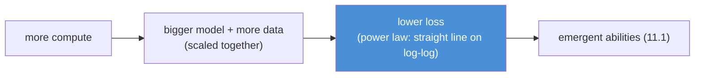
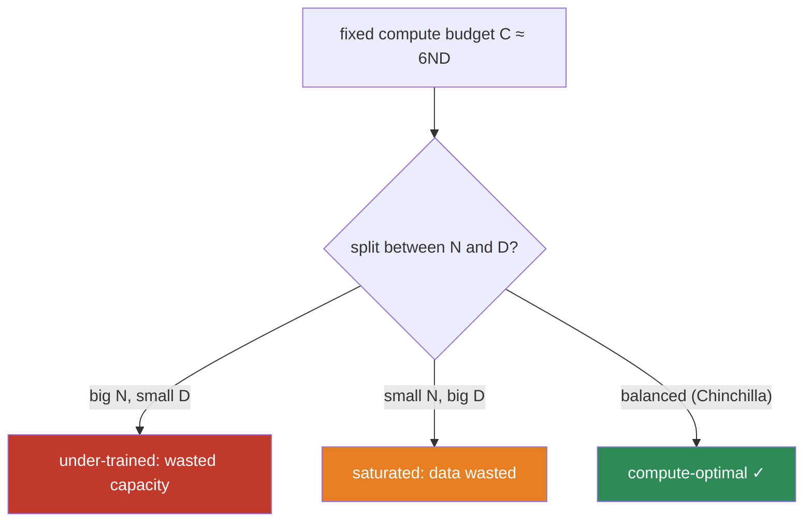
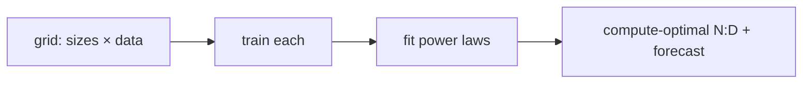

# 11.10 · Scaling Laws — Why Bigger Works, and How Much Data It Needs

[⬅ 11.9 Pretraining](11.9-pretraining.md) · [🏠 Module 11](../README.md) · [➡ 11.11 Fine-Tuning](11.11-fine-tuning.md)

> **The lesson in one line:** Model performance improves predictably as a power law in model size, data, and compute — and the Chinchilla result showed most big models were badly *under-trained*, needing far more data than people assumed.

---

## 🎯 Learning objectives

- Understand **scaling laws**: loss falls as a **power law** in parameters, data, and compute.
- Understand the three-way relationship and why you must scale **model size and data together**.
- Understand the **Chinchilla** finding (compute-optimal training) and its ~20-tokens-per-parameter rule of thumb.
- Reason about the practical trade-offs: training cost vs inference cost, and why small-but-well-trained models exist.

## ✅ Prerequisites

- [11.9 pretraining](11.9-pretraining.md), [11.1 "large"](11.1-what-is-a-language-model.md).
- [08.2 learning curves & the bias–variance tradeoff](../../08-Machine-Learning/weeks/08.2-ml-workflow.md).

---

## 🧠 Mental model

> [!IMPORTANT]
> **Scaling laws say model quality is *predictable*: plot test loss against compute (or params, or data) on log-log axes and you get a straight line — a power law.** This is the empirical bedrock of the LLM era. It means you can *forecast* how good a bigger model will be before training it, and it turned model-building from alchemy into planning. The catch, from Chinchilla: **you must scale parameters and training data together** — a giant model starved of data wastes its capacity.



---

## The power law

Empirically, test loss $L$ falls as a power law in each of three quantities, when the others aren't bottlenecking:

$$L(N) \approx \left(\frac{N_c}{N}\right)^{\alpha_N}, \quad L(D) \approx \left(\frac{D_c}{D}\right)^{\alpha_D}, \quad L(C) \approx \left(\frac{C_c}{C}\right)^{\alpha_C}$$

where $N$ = parameters, $D$ = training tokens, $C$ = compute, and the exponents $\alpha$ are small (~0.05–0.1). On log-log axes, $\log L$ vs $\log N$ is a **straight line**.

> **[FIGURE: Scaling-law lines.** Three log-log plots: test loss (y) vs parameters, vs training tokens, vs compute (x). Each shows a clean downward straight line over many orders of magnitude, with small circles marking real model runs sitting on the line. Caption: "Loss falls predictably as a power law — the empirical law that lets you forecast a bigger model's quality before building it."**]

> [!IMPORTANT]
> **Two consequences of "small exponent power law." First, returns diminish but never stop** — each 10× in compute buys a *fixed* drop in loss, so progress is steady but expensive; there's no wall, but also no free lunch. **Second, tiny loss drops unlock big capability jumps** — a small improvement in next-token loss can cross a threshold where a new ability ([emergence, 11.1](11.1-what-is-a-language-model.md)) appears. The smooth loss curve hides sharp capability transitions.

---

## The three quantities, in balance

Compute is roughly $C \approx 6 \cdot N \cdot D$ (6 FLOPs per parameter per token). Given a fixed **compute budget** (the real-world constraint — GPUs × time × money), how should you split it between a bigger model ($N$) and more data ($D$)?

- **Too big, too little data** → the model is under-trained; capacity wasted; you'd have done better with a smaller model on the same data.
- **Too small, too much data** → the model saturates; extra data barely helps; you'd have done better with a bigger model.
- **The compute-optimal point** balances them.



---

## Kaplan vs Chinchilla — the correction that changed the field

**Kaplan et al. (2020, OpenAI)** found scaling laws and concluded that, given more compute, you should mostly make the **model bigger** (data mattered less). This drove the race to ever-larger models (GPT-3 at 175B, trained on "only" 300B tokens).

**Hoffmann et al. (2022, DeepMind, "Chinchilla")** redid the analysis more carefully and found the opposite balance: **model size and data should scale roughly *equally*.** Most existing large models were **badly under-trained** — too big for the data they saw.

> [!IMPORTANT]
> **The Chinchilla rule of thumb: ~20 training tokens per parameter for compute-optimal training.** Chinchilla (70B params, 1.4T tokens) *beat* Gopher (280B params, 300B tokens) using the *same compute* — a 4× smaller model, better, because it was properly fed. This reframed the field: **more data, not just more parameters.** GPT-3's 175B on 300B tokens (~1.7 tokens/param) was drastically under-trained by this standard. Modern models (Llama, etc.) train far past the Chinchilla point deliberately (below).

| | Kaplan (2020) | Chinchilla (2022) |
|---|---|---|
| Verdict | scale model size faster | scale size and data **equally** |
| Rule of thumb | data secondary | **~20 tokens/param** |
| Effect | race to huge models | "we were under-training everything" |
| Example | GPT-3: 175B / 300B tokens | Chinchilla: 70B / 1.4T tokens, beat 280B Gopher |

---

## Why models are now trained *past* compute-optimal

Chinchilla optimizes **training** compute. But a deployed model's cost is dominated by **inference** — every user query, forever. A smaller model that's cheaper to serve is worth "over-spending" on training data.

> [!IMPORTANT]
> **Inference cost flips the calculus toward small-but-over-trained models.** Llama-2-7B was trained on 2T tokens (~285 tokens/param — *14× past* Chinchilla-optimal). Why "waste" training compute? Because a 7B model that runs on a laptop and serves millions of queries cheaply is far more valuable than a Chinchilla-optimal 13B that's harder to deploy. **The Chinchilla point minimizes training cost; real deployment minimizes total (training + lifetime inference) cost**, which pushes toward smaller models trained on more data than "optimal." This is why the ecosystem is full of capable 7B/8B models — the [inference-economics theme (11.4 GQA, 11.16)](11.16-inference-optimization.md) reshaping training decisions.

---

## 🏭 Production examples

| Model | Params | Tokens | Tokens/param |
|---|---|---|---|
| GPT-3 | 175B | 300B | ~1.7 (under-trained) |
| Chinchilla | 70B | 1.4T | ~20 (compute-optimal) |
| Llama-2 7B | 7B | 2T | ~285 (over-trained for cheap inference) |
| Llama-3 8B | 8B | 15T | ~1875 (extreme over-training) |

## ⚡ Performance & GPU considerations

- **Scaling laws let you plan hardware** — forecast the loss for a given compute budget and decide N, D before committing GPUs.
- **Over-training small models trades training compute for inference savings** — a deliberate, deployment-aware choice.
- **Data becomes the bottleneck** — at 15T+ tokens, high-quality unique text runs scarce; data quality/dedup ([11.9](11.9-pretraining.md)) and synthetic data become the frontier.

## 🔒 Security considerations

> [!CAUTION]
> - **Bigger models memorize more** — memorization (and thus PII/copyright leakage, [10.14](../../10-NLP/weeks/10.14-ethics-safety.md)) scales with model size; larger models are higher-risk for training-data extraction ([11.18](11.18-safety.md)).
> - **Capability scales with size** — including *dangerous* capabilities; scaling has a dual-use dimension that motivates evaluation and safety work ([11.17](11.17-evaluation.md), [11.18](11.18-safety.md)).
> - **Emergence is unpredictable in kind** — you can forecast *loss* but not *which* new capabilities (or failure modes) appear at a given scale, complicating safety planning.

## 🚫 Common mistakes

| Mistake | Consequence |
|---|---|
| **"Bigger is always better"** | a bigger model on the same data can be *worse* (under-trained) |
| **Ignoring the data axis** | Kaplan's error — under-training giant models |
| **Optimizing only training compute** | ignores lifetime inference cost; over-train small for deployment |
| **Expecting to predict emergent abilities** | you can forecast loss, not which capabilities appear |
| **Assuming data is infinite** | high-quality unique text is running out |

## ✅ Best practices

- **Scale model and data together** toward (at least) the Chinchilla ratio.
- **Over-train small models** when inference cost dominates (most deployment cases).
- **Use scaling laws to plan** compute allocation before committing.
- **Invest in data quality** as you scale — dedup and filtering ([11.9](11.9-pretraining.md)) matter more, not less, at the data frontier.
- **Evaluate for emergent capabilities and risks**, since loss alone doesn't reveal them.

## 🏋️ Exercises

1. **Fit a scaling law.** Train your [11.8 nano-GPT](11.8-build-mini-transformer.md) at several sizes (vary layers/width). Plot final validation loss vs parameter count on log-log axes. Is it roughly linear (a power law)?
2. **Chinchilla in miniature.** For a fixed compute budget (fixed total training steps × batch), try (small model + more data) vs (big model + less data). Which wins? Find your local compute-optimal point.
3. **Over-training.** Take a small nano-GPT and keep training past the point where a bigger model would've been "optimal." Does loss keep falling? At what rate?
4. **The 6ND estimate.** For a 7B model on 2T tokens, estimate training FLOPs (6·N·D). Convert to GPU-days at a plausible throughput.
5. **Emergence hunt.** On a task your nano-GPT can't do at small scale (e.g., simple arithmetic or matching brackets), scale it up and find the size where it starts working. Document the jump.

## 🛠️ Mini project — "A Scaling-Law Study"

**Goal:** empirically reproduce a scaling law with nano-GPTs and use it to make a compute-allocation decision.

**Requirements**
- Train nano-GPTs across a grid of sizes and data amounts.
- Fit **loss vs params**, **loss vs tokens**, and **loss vs compute** power laws (log-log linear fits).
- Find your **compute-optimal** N:D ratio for a fixed budget.
- Demonstrate **over-training** a small model and quantify the diminishing-but-nonzero returns.

**Folder structure**
```
scaling-study/
├── train_grid.py      # sweep sizes × data
├── fit_laws.py        # log-log fits, exponents
├── compute_optimal.py # best N:D for a fixed budget
├── plots/
└── README.md
```

**Architecture diagram**


**Evaluation:** the fitted exponents and the compute-optimal point are the deliverables; validate the forecast by training one held-out config and checking it lands on the line.
**Testing:** assert the fits are approximately linear in log-log; assert over-training keeps loss monotonically decreasing.
**Future improvements:** add a data-quality axis (dedup on/off from [11.9](11.9-pretraining.md)); model the training-vs-inference cost trade-off explicitly.

## 📄 Cheat sheet

| Concept | One line |
|---|---|
| **⭐ Scaling law** | test loss falls as a **power law** in params, data, compute (straight line on log-log) |
| **Compute** | `C ≈ 6·N·D` (FLOPs); params × tokens |
| **⭐ Chinchilla** | scale params and data **equally**; ~**20 tokens/param** compute-optimal |
| **Kaplan (superseded)** | thought data was secondary → led to under-trained giants |
| **Under-trained** | big model, too little data → wasted capacity |
| **⭐ Over-training** | small model, extra data → **cheaper inference**, worth it in deployment |
| **Diminishing returns** | small exponent → each 10× compute buys a fixed loss drop |
| **Emergence** | smooth loss hides sharp capability jumps ([11.1](11.1-what-is-a-language-model.md)) |

## 🎴 Flashcards

- **⭐ What is a scaling law?** → Test loss falls as a power law in model size, data, and compute — a straight line on log-log axes, so quality is predictable.
- **What's the compute formula?** → C ≈ 6·N·D (6 FLOPs per parameter per token).
- **⭐ What did Chinchilla show?** → Model size and training data should scale roughly equally (~20 tokens/param); most big models were badly under-trained.
- **How did Chinchilla beat Gopher?** → 70B on 1.4T tokens beat 280B on 300B tokens at equal compute — a 4× smaller, properly-fed model.
- **⭐ Why train small models past compute-optimal?** → Inference cost dominates deployment; a smaller, over-trained model is cheaper to serve for its whole life.
- **What does "under-trained" mean?** → A model too large for the data it saw — capacity is wasted; a smaller model would've matched it.
- **Can you predict emergent abilities from scaling laws?** → No — you can forecast loss, but not which specific capabilities appear at a given scale.

## 💬 Interview questions

1. What is a scaling law, and why did it change how LLMs are built?
2. Explain the Chinchilla result. What was wrong with the prior (Kaplan) view?
3. Given a fixed compute budget, how do you choose model size vs training data?
4. Why do modern 7B models train on far more than 20 tokens per parameter?
5. What's the relationship between scaling laws and emergent abilities?
6. Why might a bigger model perform *worse* than a smaller one?

## 📝 Summary

- **Scaling laws** make LLM quality **predictable**: test loss falls as a **power law** in parameters, data, and compute — a straight line on log-log axes.
- You must **scale model size and data together**; the **Chinchilla** result showed most large models were **under-trained**, with a compute-optimal ratio of **~20 tokens per parameter**.
- **Diminishing but nonzero returns** mean progress is steady and costly; small loss drops can unlock **emergent** capabilities.
- Because **inference cost dominates deployment**, modern models are deliberately **over-trained** (small models on far more data than compute-optimal) — training economics bending to serving economics.
- Scaling laws turned model-building into **planning**, but **which capabilities emerge at a given scale remains unpredictable** — the seam where [evaluation (11.17)](11.17-evaluation.md) and [safety (11.18)](11.18-safety.md) become essential.

## 📚 References

1. **Kaplan et al. (2020) — _Scaling Laws for Neural Language Models_.** ⭐ The original.
2. **Hoffmann et al. (2022) — _Training Compute-Optimal Large Language Models_ (Chinchilla).** ⭐⭐ The correction.
3. **Wei et al. (2022) — _Emergent Abilities of Large Language Models_.** Capability jumps.
4. **Touvron et al. (2023) — _Llama_.** Deliberate over-training for cheap inference.
5. **Sardana & Frankle (2023) — _Beyond Chinchilla-Optimal_.** Accounting for inference cost.

---

## 🧭 Navigation

| Direction | Link |
|---|---|
| ⬅ Previous | [11.9 · Pretraining](11.9-pretraining.md) |
| ➡ Next | [11.11 · Fine-Tuning](11.11-fine-tuning.md) |
| 🏠 Module | [Module 11](../README.md) |
| 📖 Lessons | [Lesson index](README.md) |
