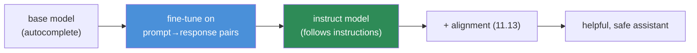
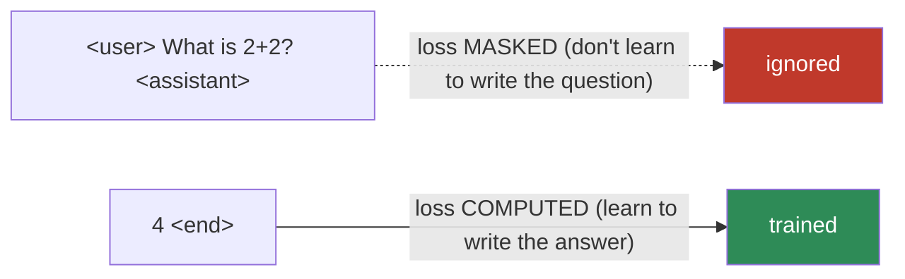
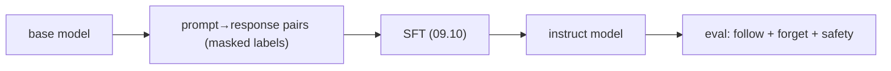

# 11.11 · Fine-Tuning — Turning a Base Model Into an Assistant

[⬅ 11.10 Scaling Laws](11.10-scaling-laws.md) · [🏠 Module 11](../README.md) · [➡ 11.12 Parameter-Efficient Fine-Tuning](11.12-peft-lora.md)

> **The lesson in one line:** A base model just predicts the next token; fine-tuning on curated prompt–response pairs — with the loss masked to score only the response — is what turns it into a model that follows instructions.

---

## 🎯 Learning objectives

- Distinguish **pretraining, full fine-tuning, and instruction tuning (SFT)**.
- Understand **prompt–response datasets** and **loss masking** (why you only train on the response).
- Understand the **base → instruct** transformation and why chat templates matter.
- Know the risks: **catastrophic forgetting**, overfitting, and data quality.

## ✅ Prerequisites

- [11.9 pretraining & base models](11.9-pretraining.md), [11.8 the training loop](11.8-build-mini-transformer.md), [11.2 special/chat tokens](11.2-tokenization.md).
- [09.11 transfer learning](../../09-Deep-Learning/weeks/09.11-cnns.md), [10.12 fine-tuning](../../10-NLP/weeks/10.12-modern-libraries.md).

---

## 🧠 Mental model

> [!IMPORTANT]
> **A base model ([11.9](11.9-pretraining.md)) is a brilliant autocomplete — it continues text, but it doesn't *answer* you.** Ask it "What is the capital of France?" and it might continue with *"What is the capital of Germany? What is the capital of Spain?"* — because that's a plausible continuation of a list of questions. Fine-tuning teaches it a *behavior*: when you see an instruction, produce a helpful response. This is still next-token prediction ([11.1](11.1-what-is-a-language-model.md)) — you've just changed *what text it's trained to continue* (curated instruction–response pairs instead of raw web).



---

## The spectrum of fine-tuning

| Kind | Data | Goal |
|---|---|---|
| **Pretraining** ([11.9](11.9-pretraining.md)) | trillions of raw tokens | learn language/knowledge from scratch |
| **Continued pretraining** | more raw domain text (legal, medical, code) | inject domain knowledge into a base model |
| **Supervised fine-tuning (SFT) / instruction tuning** | curated prompt–response pairs | teach it to *follow instructions* |
| **Alignment** ([11.13](11.13-alignment.md)) | human preferences | make it helpful, harmless, honest |

This lesson is about **SFT / instruction tuning** — the step that converts a base model into something you can talk to. It's [transfer learning (09.11)](../../09-Deep-Learning/weeks/09.11-cnns.md): start from a pretrained model, adapt it on a smaller, task-specific dataset.

---

## Instruction tuning — the data

The dataset is **prompt–response pairs** wrapped in the model's **chat template** ([11.2 special tokens](11.2-tokenization.md)):

```
<|user|>
What is the capital of France?
<|assistant|>
The capital of France is Paris.
<|end|>
```

Thousands to millions of these, spanning tasks — Q&A, summarization, coding, reasoning, refusals. **Quality and diversity beat quantity**: a famous result (LIMA) showed ~1,000 *carefully curated* examples can produce a strong instruction-follower, because the model already *knows* everything from pretraining — SFT just teaches it the *format and behavior* of being helpful.

> [!IMPORTANT]
> **SFT teaches behavior, not knowledge.** The base model already learned facts, grammar, and reasoning from pretraining ([11.9](11.9-pretraining.md)). Instruction tuning doesn't add much new knowledge — it teaches the model to *surface* that knowledge in a helpful, instruction-following format. This is why a small, high-quality SFT set works: you're eliciting a behavior the model can already perform, not teaching it from scratch. It's also why fine-tuning is the wrong tool for adding facts (use [RAG, Module 13](../../13-RAG/README.md) for that) — a recurring senior distinction.

---

## Loss masking — the one technical subtlety ⭐

Here's the detail that trips people up. A training example is the *whole* conversation (prompt + response), but you **do not want the model to learn to generate the user's prompt** — you want it to learn to generate the *response*. So you **mask the loss on the prompt tokens** and compute it only on the response tokens.



```python
# labels = input_ids, but prompt positions set to -100 (ignored by CrossEntropyLoss)
labels = input_ids.clone()
labels[:prompt_len] = -100          # ⭐ ignore_index — don't train on the prompt (09.3, 10.11)
loss = F.cross_entropy(logits.view(-1, V), labels.view(-1), ignore_index=-100)
```

> [!CAUTION]
> **Forgetting loss masking is a silent, common bug.** If you compute loss over the prompt too, the model wastes capacity learning to *generate user questions* (useless) and can behave oddly — sometimes continuing your prompt instead of answering it. The `ignore_index=-100` mechanism is the [tagging-loss `ignore_index` from 10.11](../../10-NLP/weeks/10.11-nlp-with-pytorch.md), applied to prompt tokens. **Only the assistant's tokens should contribute to the loss.** (Multi-turn conversations mask *all* user turns and train on *all* assistant turns.)

Otherwise, the training is your [09.10 loop](../../09-Deep-Learning/weeks/09.10-training-loop.md) unchanged: next-token cross-entropy, AdamW, a low learning rate (fine-tuning perturbs, doesn't rebuild), usually 1–3 epochs (more overfits).

---

## Catastrophic forgetting

Fine-tuning too hard on a narrow dataset can make the model **forget** its general abilities — it gets great at your task and worse at everything else ([the stability–plasticity tension](../../09-Deep-Learning/weeks/09.13-regularization.md)).

> [!TIP]
> **Guard against forgetting with a low learning rate, few epochs, and data diversity.** A tiny LR (e.g., 1e-5) nudges the model rather than overwriting it; 1–3 epochs prevents memorization; and mixing some general instruction data with your task-specific data preserves broad capability. This is a major reason **[parameter-efficient fine-tuning (11.12)](11.12-peft-lora.md)** is popular — freezing the base weights and training small adapters *structurally* prevents catastrophic forgetting, because the original model is untouched.

---

## Full fine-tuning vs the alternatives (preview)

**Full fine-tuning** updates *all* the model's weights. For a 70B model, that means holding the model + gradients + Adam states in memory ([11.9](11.9-pretraining.md)) — hundreds of GB, many GPUs. Expensive and forgetting-prone. This is exactly the problem **[LoRA/QLoRA (11.12)](11.12-peft-lora.md)** solves, letting you fine-tune a 70B model on a single GPU. Full fine-tuning remains best when you have lots of data and compute and want maximum quality; otherwise PEFT is the default.

---

## 🏭 Production examples

| Use case | Fine-tuning approach |
|---|---|
| **Chat assistant** | SFT on instruction data → alignment ([11.13](11.13-alignment.md)) |
| **Domain expert (legal/medical)** | continued pretraining + domain SFT |
| **Structured output (JSON/tool calls)** | SFT on format-specific examples |
| **Style/brand voice** | SFT on curated in-voice examples |
| **Adding facts** | ❌ use [RAG (Module 13)](../../13-RAG/README.md), not fine-tuning |

## ⚡ Performance & GPU considerations

- **Full fine-tuning needs the full training footprint** (weights + grads + Adam, [11.9](11.9-pretraining.md)) — often infeasible on one GPU → [PEFT (11.12)](11.12-peft-lora.md).
- **Low LR, few epochs** — fine-tuning is a gentle perturbation; high LR/many epochs overfit and forget.
- **Sequence packing** (concatenating short examples to fill the context) improves throughput.
- **Gradient checkpointing + mixed precision** ([09.14](../../09-Deep-Learning/weeks/09.14-performance.md)) to fit larger models.

## 🔒 Security considerations

> [!CAUTION]
> - **Fine-tuning can *undo* safety alignment.** SFT on a narrow or adversarial dataset can strip a model's guardrails — even benign-looking fine-tuning has been shown to degrade safety ([11.18](11.18-safety.md)). Re-evaluate safety after any fine-tune.
> - **Fine-tuning data is a poisoning vector** — malicious examples in the SFT set implant backdoors or biases ([11.9](11.9-pretraining.md)). Vet and audit fine-tuning data.
> - **The model memorizes fine-tuning data** ([10.14](../../10-NLP/weeks/10.14-ethics-safety.md)) — never fine-tune on PII/secrets you don't want emitted; redact first ([10.10](../../10-NLP/weeks/10.10-nlp-data.md)).
> - **`torch.load` / checkpoint provenance** — loading untrusted fine-tuned weights is an RCE risk ([09.16](../../09-Deep-Learning/weeks/09.16-saving-loading.md)); prefer safetensors.

## 🚫 Common mistakes

| Mistake | Consequence |
|---|---|
| **⭐ No loss masking** | model learns to generate prompts, not answers |
| **Wrong chat template** | malformed prompts → degraded output ([11.2](11.2-tokenization.md)) |
| **High LR / many epochs** | overfitting + catastrophic forgetting |
| **Fine-tuning to add facts** | wrong tool → use RAG ([Module 13](../../13-RAG/README.md)) |
| **Not re-checking safety** | fine-tuning can strip guardrails |
| **Low-quality/undiverse data** | poor generalization; forgetting |

## ✅ Best practices

- **Mask the loss on prompt tokens** — train only on responses (`ignore_index=-100`).
- **Use the model's exact chat template** ([11.2](11.2-tokenization.md)).
- **Prioritize data quality and diversity** over quantity (LIMA); a small clean set often wins.
- **Low LR, 1–3 epochs**; mix in general data to prevent forgetting.
- **Prefer PEFT/LoRA** ([11.12](11.12-peft-lora.md)) unless you need full-FT quality and have the compute.
- **Re-evaluate safety and general capability** after fine-tuning, not just the target task.

## 🏋️ Exercises

1. **Base vs instruct.** Prompt a base model and its instruct-tuned sibling with the same question. Show the base model "continues" while the instruct model "answers." Explain the difference.
2. **Loss masking.** Fine-tune your [11.8 nano-GPT](11.8-build-mini-transformer.md) on toy prompt–response pairs, once *with* prompt-loss-masking and once *without*. Compare behavior — does the unmasked model start generating questions?
3. **LIMA effect.** Fine-tune on 50 vs 5,000 high-quality instruction examples. Where do diminishing returns kick in? Does quality or quantity matter more?
4. **Catastrophic forgetting.** Fine-tune hard on a single narrow task; measure performance on an unrelated task before and after. Quantify the forgetting; then reduce LR/epochs and show it recovers.
5. **Chat template.** Format the same conversation with the correct template and a wrong one; compare the fine-tuned model's outputs.

## 🛠️ Mini project — "Instruction-Tune a Small Model"

**Goal:** turn a small base model into an instruction-follower, correctly, with loss masking and safety re-checks.

**Requirements**
- A small open base model (or your [11.8 nano-GPT](11.8-build-mini-transformer.md) scaled up) + a curated instruction dataset (prompt–response pairs).
- **Correct chat templating and loss masking** (prompt tokens = `-100`).
- The [09.10 loop](../../09-Deep-Learning/weeks/09.10-training-loop.md): low LR, 1–3 epochs, gradient clipping, checkpointing.
- **Evaluation:** instruction-following quality (before/after), plus a **forgetting check** on general tasks and a **safety re-check**.

**Folder structure**
```
instruction-tune/
├── data.py            # format pairs with chat template; build masked labels
├── train.py           # SFT loop (09.10), low LR, few epochs
├── evaluate.py        # instruction-following + forgetting + safety
└── README.md
```

**Architecture diagram**


**Data pipeline:** template every example; set prompt-token labels to `-100`; pack sequences.
**Testing:** assert prompt tokens are masked in the labels; overfit one batch; assert the tuned model answers rather than continues.
**Evaluation:** win-rate on held-out instructions; general-capability delta; safety delta.
**Future improvements:** switch to **[LoRA (11.12)](11.12-peft-lora.md)** and compare cost/quality/forgetting; add a [DPO alignment (11.13)](11.13-alignment.md) stage.

## 📄 Cheat sheet

| Concept | One line |
|---|---|
| **Base model** | autocomplete; continues text, doesn't answer |
| **⭐ SFT / instruction tuning** | fine-tune on prompt→response pairs → follows instructions |
| **SFT teaches** | **behavior/format**, not knowledge (that's pretraining/RAG) |
| **⭐ Loss masking** | set prompt-token labels to `-100`; train **only on the response** |
| **Chat template** | wrap in the model's role tokens ([11.2](11.2-tokenization.md)) |
| **Data** | quality + diversity > quantity (LIMA: ~1k can suffice) |
| **⭐ Catastrophic forgetting** | narrow/hard FT erodes general ability → low LR, few epochs, diverse data |
| **Adding facts?** | ❌ fine-tuning → use **RAG** ([Module 13](../../13-RAG/README.md)) |

## 🎴 Flashcards

- **What does a base model do vs an instruct model?** → Base continues text (autocomplete); instruct follows instructions and answers.
- **⭐ What does instruction tuning (SFT) teach?** → Behavior/format (how to be helpful), not new knowledge — the base model already knows the facts.
- **⭐ What is loss masking in SFT?** → Setting prompt-token labels to `ignore_index` (-100) so the loss is computed only on the response tokens.
- **What happens if you forget loss masking?** → The model wastes capacity learning to generate prompts and may continue your question instead of answering.
- **Why is a small, high-quality SFT set often enough?** → SFT elicits behavior the model can already perform (LIMA); quality/diversity beat quantity.
- **⭐ What is catastrophic forgetting, and how do you avoid it?** → Losing general ability by over-fine-tuning; use low LR, few epochs, diverse data, or PEFT (frozen base).
- **Should you fine-tune to add facts?** → No — use RAG; fine-tuning teaches behavior, not reliable factual recall.
- **Why re-check safety after fine-tuning?** → Fine-tuning can strip alignment/guardrails, even with benign data.

## 💬 Interview questions

1. What's the difference between a base model and an instruction-tuned model?
2. What does instruction tuning actually teach the model? Why does a small dataset often suffice?
3. Explain loss masking in SFT. What breaks without it?
4. What is catastrophic forgetting, and how do you mitigate it?
5. When should you fine-tune vs use RAG?
6. Why must you re-evaluate safety after fine-tuning?

## 📝 Summary

- A **base model** is autocomplete; **supervised fine-tuning (instruction tuning)** on curated **prompt–response pairs** teaches it to *follow instructions* — still next-token prediction, on different data.
- **SFT teaches behavior and format, not knowledge** — the base model already learned the facts in pretraining, so **small, high-quality datasets work** (LIMA), and **adding facts is RAG's job, not fine-tuning's**.
- **Loss masking** (prompt tokens = `-100`) is essential — train only on the response, or the model learns to generate prompts.
- **Catastrophic forgetting** is the main risk — mitigate with low LR, few epochs, diverse data, or (better) **[PEFT/LoRA (11.12)](11.12-peft-lora.md)**, which freezes the base model.
- **Fine-tuning can strip safety** — always re-evaluate guardrails and general capability afterward.

## 📚 References

1. **Ouyang et al. (2022) — _InstructGPT_.** ⭐⭐ SFT + alignment; the base→assistant recipe.
2. **Zhou et al. (2023) — _LIMA: Less Is More for Alignment_.** ⭐ Quality over quantity in SFT.
3. **Wei et al. (2022) — _Finetuned Language Models Are Zero-Shot Learners_ (FLAN).** Instruction tuning.
4. **Qi et al. (2023) — _Fine-tuning Aligned Language Models Compromises Safety_.** ⭐ Fine-tuning can strip guardrails.
5. **[10.12 Fine-tuning](../../10-NLP/weeks/10.12-modern-libraries.md) & [09.11 Transfer Learning](../../09-Deep-Learning/weeks/09.11-cnns.md).** Your foundations.

---

## 🧭 Navigation

| Direction | Link |
|---|---|
| ⬅ Previous | [11.10 · Scaling Laws](11.10-scaling-laws.md) |
| ➡ Next | [11.12 · Parameter-Efficient Fine-Tuning](11.12-peft-lora.md) |
| 🏠 Module | [Module 11](../README.md) |
| 📖 Lessons | [Lesson index](README.md) |
