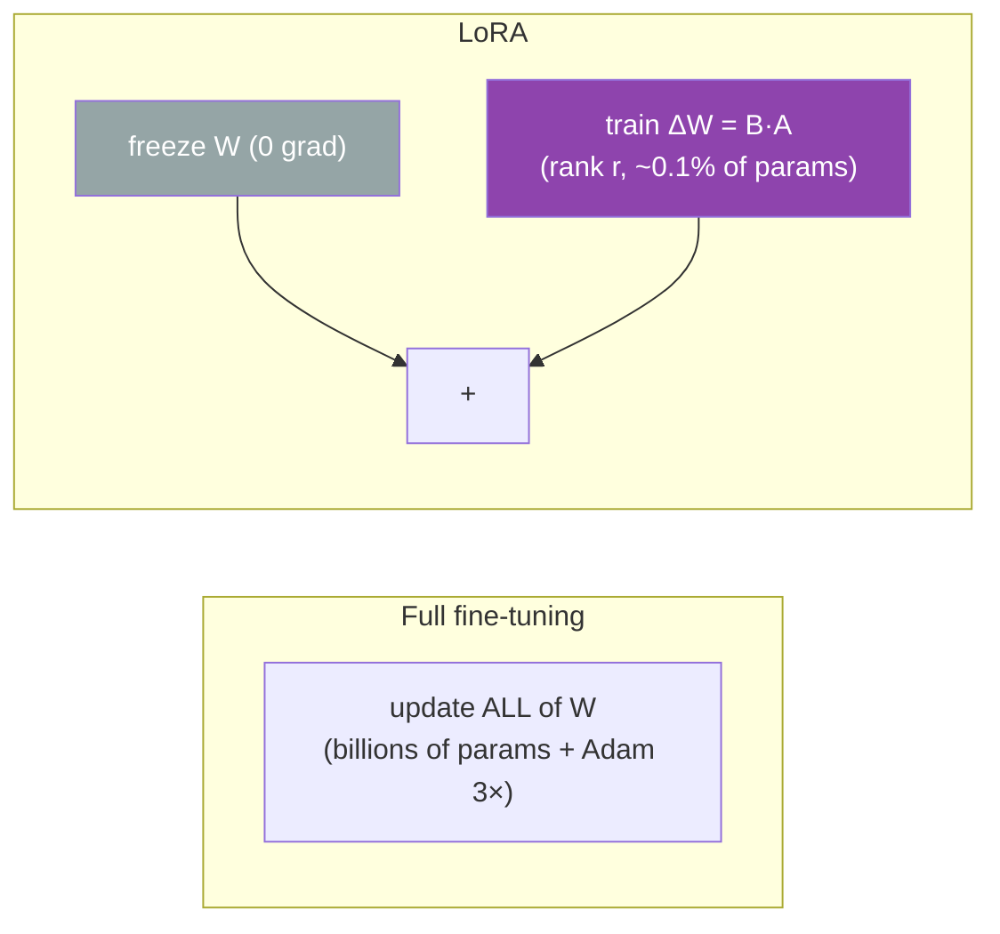
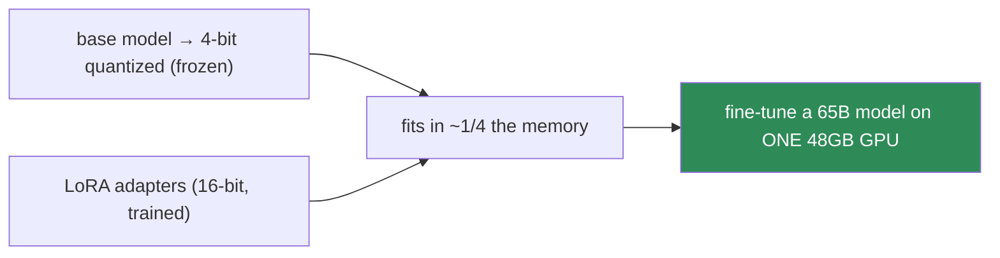
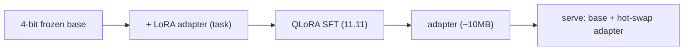

# 11.12 · Parameter-Efficient Fine-Tuning — LoRA, QLoRA, Adapters ⭐

[⬅ 11.11 Fine-Tuning](11.11-fine-tuning.md) · [🏠 Module 11](../README.md) · [➡ 11.13 Alignment](11.13-alignment.md)

> **The lesson in one line:** Instead of updating all 70 billion weights, freeze them and train a tiny number of new ones — LoRA makes fine-tuning a 70B model possible on a single consumer GPU, at ~0.1% of the trainable parameters.

---

## 🎯 Learning objectives

- Understand why **full fine-tuning is prohibitively expensive** and what PEFT changes.
- Understand **LoRA** — the low-rank update — and *why* it works (the rank argument from [06.3](../../06-Mathematics/weeks/06.3-linear-algebra-2.md)).
- Understand **QLoRA** (quantized base + LoRA), **adapters**, and **prefix tuning**.
- Reason about the trade-offs: memory, speed, quality, and serving many fine-tunes.

## ✅ Prerequisites

- [11.11 fine-tuning & its cost](11.11-fine-tuning.md), [11.9 the memory footprint](11.9-pretraining.md).
- [06.3 rank, low-rank, and LoRA as a rank argument](../../06-Mathematics/weeks/06.3-linear-algebra-2.md) — this lesson *is* that argument, applied.

---

## 🧠 Mental model

> [!IMPORTANT]
> **LoRA's bet: the *change* a fine-tune makes to a weight matrix is low-rank — it lives in a tiny subspace — so you don't need to update the full matrix, just represent its update as the product of two skinny matrices.** Freeze the giant pretrained weight $W$ (billions of numbers, untouched), and learn a small correction $\Delta W = BA$ where $B$ and $A$ are thin (rank $r$, maybe 8 or 16). You train ~0.1% of the parameters, use a fraction of the memory, and get quality close to full fine-tuning. **This one idea is why individuals — not just labs — can fine-tune large models.**



---

## Why full fine-tuning is so expensive

Full fine-tuning updates every weight, so you must store, per parameter ([11.9](11.9-pretraining.md), [09.5](../../09-Deep-Learning/weeks/09.5-optimization.md)): the weight, its gradient, and Adam's two moments — plus activations. In mixed precision that's **~16 bytes/parameter**. For a 70B model: **~1.1 TB** of GPU memory just for training state. That's dozens of high-end GPUs for *one* fine-tune. For most people and most tasks, that's a non-starter.

> [!IMPORTANT]
> **The Adam 3× memory tax ([09.5](../../09-Deep-Learning/weeks/09.5-optimization.md)) is what LoRA defeats.** Recall: Adam stores two extra copies of every parameter it trains. If you only *train* 0.1% of the parameters (the LoRA matrices), you only pay Adam's tax on that 0.1% — the frozen 99.9% needs no gradient, no optimizer state, no update. The memory saving is enormous and comes directly from the [09.5 observation](../../09-Deep-Learning/weeks/09.5-optimization.md) that *the optimizer state, not the weights, is what OOMs you.* LoRA is the payoff to that cliffhanger.

---

## LoRA — the low-rank update

For a pretrained weight matrix $W \in \mathbb{R}^{d \times k}$, LoRA freezes it and adds a trainable low-rank correction:

$$W' = W + \Delta W = W + BA, \quad B \in \mathbb{R}^{d \times r}, \; A \in \mathbb{R}^{r \times k}, \; r \ll \min(d, k)$$

Instead of $d \times k$ trainable numbers, you train $r(d + k)$ — for $d=k=4096$ and $r=8$, that's **65,536 vs 16.8 million per matrix** — a ~256× reduction. During the forward pass, the input goes through *both* $W$ (frozen) and $BA$ (trained), and their outputs sum.

```python
class LoRALinear(nn.Module):
    def __init__(self, base_linear, r=8, alpha=16):
        super().__init__()
        self.base = base_linear                       # frozen
        for p in self.base.parameters(): p.requires_grad = False
        d, k = base_linear.out_features, base_linear.in_features
        self.A = nn.Parameter(torch.randn(r, k) * 0.01)   # small init
        self.B = nn.Parameter(torch.zeros(d, r))          # ⭐ zero init → ΔW=0 at start
        self.scale = alpha / r
    def forward(self, x):
        return self.base(x) + self.scale * (x @ self.A.T @ self.B.T)   # W·x + (B·A)·x
```

> [!TIP]
> **Two design details that matter.** (1) **`B` is initialized to zero**, so $\Delta W = BA = 0$ at the start — the fine-tune begins *exactly* as the pretrained model and only diverges as it learns (no random perturbation shock). (2) **The `alpha/r` scaling** decouples the learning-rate-like magnitude from the rank, so you can change $r$ without re-tuning. LoRA is usually applied to the **attention Q/K/V/O projections** (and sometimes the FFN), where the adaptation happens.

### Why low-rank works — the [06.3](../../06-Mathematics/weeks/06.3-linear-algebra-2.md) argument

Why should a fine-tune's update be low-rank? Empirically, fine-tuning nudges a model into a nearby behavior — a small, structured change — and such changes have **low intrinsic rank** ([06.3 rank & SVD](../../06-Mathematics/weeks/06.3-linear-algebra-2.md)). The full $\Delta W$ might be $4096 \times 4096$, but its "true" information content fits in a rank-8 subspace. LoRA simply *parameterizes* that subspace directly. This is the same low-rank intuition behind [PCA and SVD (06.3)](../../06-Mathematics/weeks/06.3-linear-algebra-2.md) — most of the signal lives in a few dimensions.

> [!IMPORTANT]
> **After training, you can merge or keep LoRA separate — and "keep separate" is a superpower.** You can fold $BA$ back into $W$ (`W' = W + BA`) for zero inference overhead, *or* keep the small LoRA "adapter" as a separate file (a few MB) and swap adapters at runtime. **One frozen base model + many tiny task-specific adapters** = serve dozens of fine-tunes from one set of base weights, hot-swapping per request. This is how platforms offer thousands of custom fine-tunes economically — the base model is shared; only the ~10MB adapter changes ([11.20](11.20-production-architecture.md)).

---

## QLoRA — fine-tune a 70B on one GPU

**QLoRA** stacks two ideas: **quantize the frozen base model to 4-bit** (it's frozen, so precision loss barely matters — [11.16](11.16-inference-optimization.md)) *and* train LoRA adapters on top (in higher precision). The 4-bit base slashes the *memory to hold the model*, while LoRA slashes the *memory to train*.



> [!IMPORTANT]
> **QLoRA is the democratization moment: it made fine-tuning a 65B model possible on a single 48GB GPU, with quality matching 16-bit full fine-tuning.** Quantizing the frozen base is nearly free (you're not updating it, so its slight imprecision doesn't compound), and LoRA handles the trainable part in full precision. Together they cut a ~1TB job to fit on hardware a hobbyist can rent. This is arguably the most important practical LLM technique of the open-source era — it's why there are thousands of community fine-tunes.

---

## The PEFT family

| Method | What it trains | Idea |
|---|---|---|
| **⭐ LoRA** | low-rank matrices $B, A$ added to frozen weights | the update is low-rank |
| **⭐ QLoRA** | LoRA on a 4-bit-quantized frozen base | + quantization for memory |
| **Adapters** | small bottleneck MLPs inserted between layers | learn task-specific modules; adds inference latency |
| **Prefix / prompt tuning** | a few trainable "virtual token" vectors prepended to the input | steer the frozen model via learned soft prompts; fewest params |

| Property | Full FT | LoRA | QLoRA | Prompt tuning |
|---|---|---|---|---|
| Trainable params | 100% | ~0.1–1% | ~0.1–1% | <0.01% |
| Training memory | huge | low | **lowest** | very low |
| Quality | best | ~full | ~full | lower (harder tasks) |
| Inference overhead | none | none (if merged) | none | tiny |
| Swap many tasks | ❌ (full copies) | ✅ (tiny adapters) | ✅ | ✅ |

> [!TIP]
> **LoRA/QLoRA is the default; reach for full fine-tuning only when you have the compute and need every last point of quality.** Adapters add inference latency (extra layers), so LoRA (mergeable, zero overhead) usually wins. Prompt/prefix tuning is the most parameter-frugal but struggles on harder tasks. For 95% of real fine-tuning, **LoRA or QLoRA is the right answer.**

---

## 🏭 Production examples

| Scenario | Approach |
|---|---|
| **Custom assistant on limited hardware** | QLoRA on an open model |
| **Serving many customer-specific fine-tunes** | one base + hot-swappable LoRA adapters ([11.20](11.20-production-architecture.md)) |
| **Domain/style adaptation** | LoRA on attention projections |
| **Maximum quality, big budget** | full fine-tuning |

## ⚡ Performance & GPU considerations

- **Memory: LoRA trains ~0.1% of params** → Adam tax only on those → fits far smaller GPUs ([09.5](../../09-Deep-Learning/weeks/09.5-optimization.md)).
- **QLoRA's 4-bit base** cuts model-holding memory ~4× ([11.16](11.16-inference-optimization.md)); the trade is slightly slower matmuls (dequantize on the fly).
- **Merged LoRA = zero inference overhead**; unmerged = one extra small matmul per layer.
- **Adapter-swapping** enables multi-tenant serving from shared base weights ([11.20](11.20-production-architecture.md)).

## 🔒 Security considerations

> [!CAUTION]
> - **LoRA adapters can also strip safety** ([11.11](11.11-fine-tuning.md), [11.18](11.18-safety.md)) — a small adapter is enough to jailbreak an aligned model; re-evaluate safety after any adapter train.
> - **Adapters are distributable artifacts** — a shared LoRA is executable-adjacent; a malicious adapter can implant harmful behavior into a trusted base. Vet adapter provenance.
> - **Quantization can shift behavior** ([11.16](11.16-inference-optimization.md)) — QLoRA's 4-bit base may subtly change outputs vs the full-precision model; validate.

## 🚫 Common mistakes

| Mistake | Consequence |
|---|---|
| **Full fine-tuning when LoRA would do** | 100–1000× the memory for marginal gain |
| **Rank too high** | more params, slower, little quality gain (defeats the point) |
| **Not initializing B to zero** | fine-tune starts with a random perturbation shock |
| **Applying LoRA to the wrong layers** | usually attention Q/K/V/O; missing them hurts |
| **Forgetting adapters can strip safety** | ships a jailbroken model |
| **Assuming QLoRA = full-precision behavior** | validate; quantization shifts outputs |

## ✅ Best practices

- **Default to LoRA/QLoRA**; use full FT only with ample compute and a quality need.
- **Start with rank 8–16** on attention projections; increase only if quality demands.
- **Zero-init B, tune `alpha/r`**; keep a low learning rate ([11.11](11.11-fine-tuning.md)).
- **Keep adapters separate** to serve many fine-tunes from one base; merge for single-task latency-critical serving.
- **Re-check safety and validate quantized behavior** after training.

## 🏋️ Exercises

1. **LoRA from scratch.** Implement `LoRALinear`. Wrap the attention projections of your [11.8 nano-GPT](11.8-build-mini-transformer.md). Count trainable vs total params — confirm ~0.1–1%.
2. **Rank sweep.** Fine-tune with r ∈ {1, 4, 8, 16, 64}. Plot quality vs r and trainable-param count. Find the point of diminishing returns.
3. **Merge vs separate.** Merge a trained LoRA into the base weights; confirm outputs match the unmerged (base + adapter) version and that inference is now overhead-free.
4. **Adapter swapping.** Train two LoRA adapters for two tasks on one base. Swap them at inference and show both work from the same frozen base — multi-task from one model.
5. **QLoRA memory.** Estimate the training memory for full FT vs LoRA vs QLoRA on a 7B model. Show why QLoRA fits on a single consumer GPU.
6. **Zero-init proof.** Train once with B zero-init and once with B random-init; show the zero-init run starts exactly at the base model's behavior and is more stable early.

## 🛠️ Mini project — "LoRA Fine-Tuning, End to End"

**Goal:** fine-tune an open model with LoRA/QLoRA on a real task, at a fraction of full-FT cost, and serve swappable adapters.

**Requirements**
- An open base model + a task dataset ([11.11](11.11-fine-tuning.md) instruction pairs, with masking).
- **LoRA** (and **QLoRA** 4-bit) fine-tuning via `peft`/`bitsandbytes` (or your from-scratch `LoRALinear`).
- **Compare** LoRA vs full FT (if feasible at small scale): trainable params, memory, quality, forgetting ([11.11](11.11-fine-tuning.md)).
- **Serve two adapters** from one base model, hot-swapping per request.

**Folder structure**
```
lora-finetune/
├── lora.py            # LoRALinear or peft config
├── train.py           # QLoRA (4-bit base + LoRA), masked SFT loss (11.11)
├── compare.py         # LoRA vs full FT: params/memory/quality/forgetting
├── serve_adapters.py  # one base + swappable adapters
└── README.md
```

**Architecture diagram**


**Data pipeline:** instruction pairs with prompt-loss masking ([11.11](11.11-fine-tuning.md)).
**Testing:** trainable params ≈ 0.1–1%; merged == unmerged outputs; two adapters both work from one base; safety re-check.
**Evaluation:** task quality vs full FT; memory footprint; forgetting delta.
**Performance:** report the GPU memory that made this fit; measure adapter-swap latency.
**Future improvements:** add [DPO alignment (11.13)](11.13-alignment.md) via LoRA; multi-tenant serving ([11.20](11.20-production-architecture.md)).

## 📄 Cheat sheet

| Concept | One line |
|---|---|
| **Full FT cost** | ~16 bytes/param (weights+grad+Adam) → 70B ≈ 1TB |
| **⭐ LoRA** | freeze W, train `ΔW = B·A` (rank r) → ~0.1% of params |
| **Why low-rank works** | fine-tune updates are low-rank ([06.3](../../06-Mathematics/weeks/06.3-linear-algebra-2.md)) |
| **B=0 init** | fine-tune starts exactly as the base model |
| **⭐ QLoRA** | 4-bit frozen base + LoRA → **fine-tune 65B on one GPU** |
| **Adapters** | inserted bottleneck MLPs; adds inference latency |
| **Prefix/prompt tuning** | learn soft "virtual tokens"; fewest params |
| **⭐ Merge or keep separate** | merge = 0 overhead; keep = **many adapters, one base** |
| **Default** | **LoRA/QLoRA** unless you need full-FT quality |

## 🎴 Flashcards

- **⭐ What is LoRA?** → Freeze the pretrained weight W and train a low-rank update ΔW = B·A (rank r ≪ d), so you train ~0.1% of the parameters.
- **Why does low-rank fine-tuning work?** → Fine-tuning makes a small, structured change whose intrinsic rank is low (the SVD/[06.3](../../06-Mathematics/weeks/06.3-linear-algebra-2.md) intuition).
- **⭐ What memory problem does LoRA solve?** → Adam's optimizer state (3× per trained param) — training only 0.1% of params means paying the Adam tax on only 0.1%.
- **Why initialize B to zero?** → So ΔW = 0 at the start; the fine-tune begins exactly as the pretrained model, avoiding a perturbation shock.
- **⭐ What is QLoRA?** → LoRA on top of a 4-bit-quantized frozen base — fitting a 65B fine-tune on a single 48GB GPU at ~full-precision quality.
- **⭐ Why keep LoRA adapters separate?** → One frozen base + many tiny (~10MB) task adapters can be hot-swapped, serving dozens of fine-tunes from shared weights.
- **When use full fine-tuning over LoRA?** → When you have the compute and need maximum quality; otherwise LoRA/QLoRA is the default.
- **Do LoRA adapters affect safety?** → Yes — a small adapter can strip alignment; re-evaluate safety after training.

## 💬 Interview questions

1. Why is full fine-tuning of a 70B model impractical, and what does LoRA change?
2. Explain LoRA. Why is the low-rank assumption reasonable?
3. What is QLoRA, and how does it fit a 65B fine-tune on one GPU?
4. Why initialize the B matrix to zero?
5. What's the advantage of keeping LoRA adapters separate from the base weights?
6. Compare LoRA, adapters, and prompt tuning. When would you use each?

## 📝 Summary

- **Full fine-tuning is memory-prohibitive** (~16 bytes/param, dominated by Adam's optimizer state) — the exact [09.5](../../09-Deep-Learning/weeks/09.5-optimization.md) problem.
- **LoRA** freezes the base model and trains a **low-rank update** ($\Delta W = BA$), cutting trainable parameters to ~0.1% — because fine-tuning changes are intrinsically low-rank ([06.3](../../06-Mathematics/weeks/06.3-linear-algebra-2.md)).
- **QLoRA** adds a **4-bit quantized frozen base**, making it possible to **fine-tune a 65B model on a single GPU** at near-full quality — the democratizing technique of the open-source era.
- **Keeping adapters separate** lets one base model serve many tiny, hot-swappable fine-tunes — the economics behind custom-model platforms.
- **LoRA/QLoRA is the default**; full fine-tuning only when compute is ample and quality is paramount — and **safety must be re-checked** since even a small adapter can strip alignment.

## 📚 References

1. **Hu et al. (2021) — _LoRA: Low-Rank Adaptation of Large Language Models_.** ⭐⭐ The method.
2. **Dettmers et al. (2023) — _QLoRA: Efficient Finetuning of Quantized LLMs_.** ⭐⭐ 4-bit + LoRA.
3. **Houlsby et al. (2019) — _Parameter-Efficient Transfer Learning (Adapters)_** & **Li & Liang (2021) — _Prefix-Tuning_.**
4. **Aghajanyan et al. (2021) — _Intrinsic Dimensionality_.** Why fine-tuning is low-rank.
5. **Hugging Face — _PEFT_ library.** ⭐ Practical LoRA/QLoRA. And **[06.3 Linear Algebra II](../../06-Mathematics/weeks/06.3-linear-algebra-2.md)** for the rank argument.

---

## 🧭 Navigation

| Direction | Link |
|---|---|
| ⬅ Previous | [11.11 · Fine-Tuning](11.11-fine-tuning.md) |
| ➡ Next | [11.13 · Alignment](11.13-alignment.md) |
| 🏠 Module | [Module 11](../README.md) |
| 📖 Lessons | [Lesson index](README.md) |
