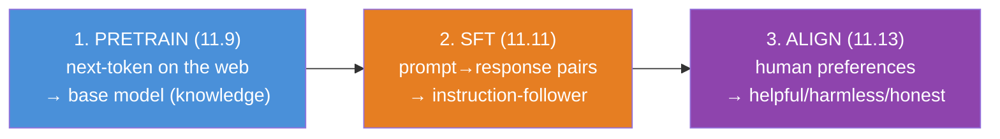
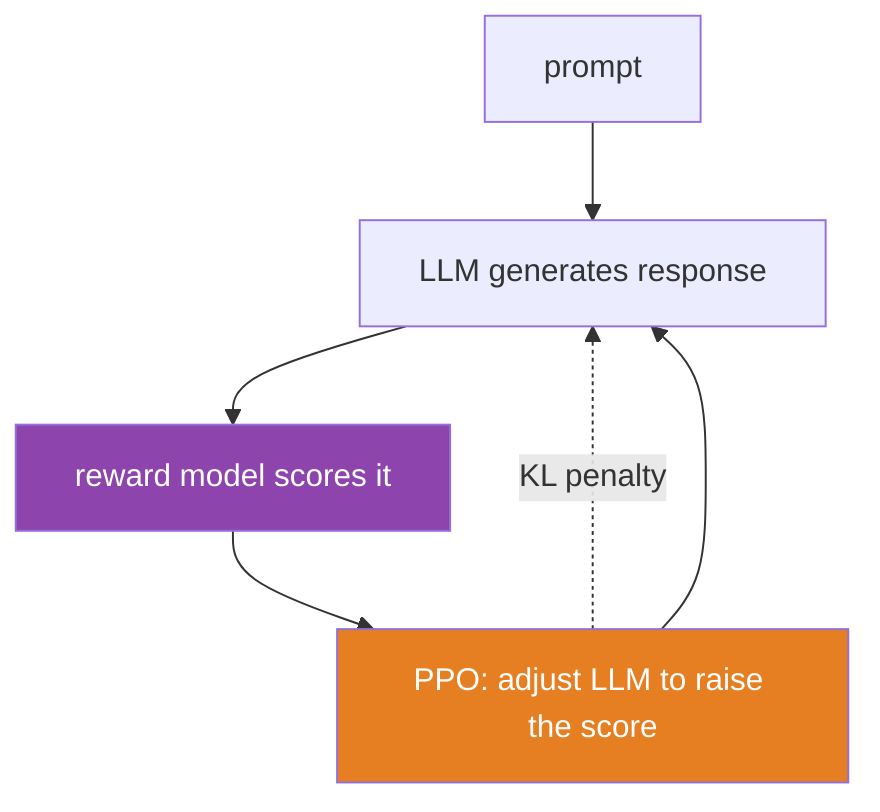
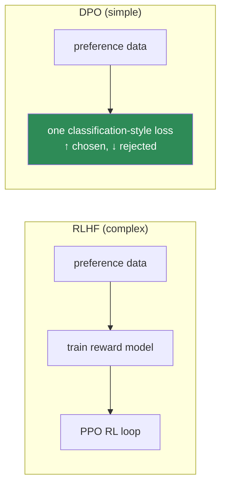
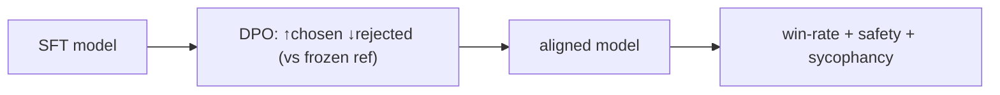

# 11.13 · Alignment — RLHF, Reward Models, and DPO

[⬅ 11.12 Parameter-Efficient Fine-Tuning](11.12-peft-lora.md) · [🏠 Module 11](../README.md) · [➡ 11.14 Inference & Decoding](11.14-inference-decoding.md)

> **The lesson in one line:** Instruction tuning teaches a model *to answer*; alignment teaches it to answer the way humans *prefer* — helpful, harmless, honest — by learning from comparisons of good vs bad responses.

---

## 🎯 Learning objectives

- Understand why **SFT alone isn't enough** and what **alignment** adds.
- Understand **RLHF**: preference data → **reward model** → RL fine-tuning (PPO).
- Understand **DPO** as a simpler, RL-free alternative that dominates today.
- Understand the high-level three-stage pipeline: **pretrain → SFT → align**.

## ✅ Prerequisites

- [11.11 SFT / instruction tuning](11.11-fine-tuning.md), [11.9 base models](11.9-pretraining.md).
- [08.4 logistic regression / preference modeling](../../08-Machine-Learning/weeks/08.4-logistic-regression.md), [10.14 harms](../../10-NLP/weeks/10.14-ethics-safety.md).

---

## 🧠 Mental model

> [!IMPORTANT]
> **After SFT, a model *can* follow instructions, but "can" isn't "well."** Given a prompt, many responses are valid continuations — some helpful, some rambling, some subtly wrong, some harmful. SFT trained on *one* good response per prompt; it never learned that response A is *better* than response B. **Alignment closes that gap by training on human *preferences* — comparisons — so the model learns to produce the responses people actually prefer.** This is the step that separates "a model that answers" from "an assistant you'd want to use."


The goal is often summarized as **"HHH": helpful, harmless, honest** — and these can conflict (a maximally helpful model might answer a harmful request), so alignment is also about navigating trade-offs.

---

## The three-stage pipeline



Every production assistant (ChatGPT, Claude, Llama-Chat) is these three stages. Pretraining gives knowledge; SFT gives instruction-following; alignment gives the polish, safety, and preference-matching that make it usable.

---

## RLHF — Reinforcement Learning from Human Feedback

The original alignment recipe (InstructGPT/ChatGPT). Three steps on top of an SFT model:

### Step 1 — Collect preference data
Show humans a prompt and **two (or more) model responses**; they pick the better one. This yields a dataset of **(prompt, chosen response, rejected response)** triples. Humans compare rather than write — comparison is easier and more reliable than authoring ([10.10 annotation](../../10-NLP/weeks/10.10-nlp-data.md)).

### Step 2 — Train a reward model
Train a separate model (usually the LLM with a scalar output head) to predict human preference: given a response, output a **reward** (a score) such that chosen responses score higher than rejected ones. This is a **preference/ranking loss** — closely related to [logistic regression (08.4)](../../08-Machine-Learning/weeks/08.4-logistic-regression.md) on the difference of rewards:

$$\mathcal{L}_{RM} = -\log \sigma\big(r(\text{chosen}) - r(\text{rejected})\big)$$

The reward model **learns to imitate human judgment**, so you can then score *any* response automatically, not just the human-labeled ones.

### Step 3 — RL fine-tune (PPO)
Use reinforcement learning (PPO) to update the LLM so it **maximizes the reward model's score** — generating responses the reward model (a proxy for humans) rates highly. A **KL penalty** keeps the model from drifting too far from the SFT model (or it "hacks" the reward by producing degenerate high-scoring gibberish).



> [!CAUTION]
> **RLHF is powerful but notoriously finicky.** It requires training *two* models (reward + policy), an unstable RL loop, careful KL tuning, and is prone to **reward hacking** — the model finds responses that score high on the imperfect reward model but aren't actually good (e.g., overly long, sycophantic, or confidently wrong answers the reward model was fooled by). The reward model is a *proxy* for human values, and [optimizing a proxy invites Goodhart's law (10.9)](../../10-NLP/weeks/10.9-evaluation.md). Much of the art of RLHF is preventing the policy from exploiting the reward model's flaws.

---

## DPO — Direct Preference Optimization

RLHF's complexity motivated a simpler approach that now dominates open-source alignment. **DPO** achieves the same goal — align to preferences — *without* a separate reward model or RL loop.

The insight: the RLHF objective can be rewritten so that the **optimal policy is expressible directly in terms of the preference data**, turning alignment into a **simple classification-style loss** on (chosen, rejected) pairs. You just fine-tune the LLM to increase the likelihood of chosen responses and decrease the likelihood of rejected ones (relative to the SFT model), with one clean loss — no reward model, no PPO, no RL instability.



| | **RLHF (PPO)** | **DPO** |
|---|---|---|
| Reward model | separate model needed | **none** (implicit) |
| RL loop | PPO (unstable, complex) | **none** — plain supervised-style training |
| Stability | finicky | **much more stable** |
| Compute | high (two models + RL) | lower |
| Used by | ChatGPT, Claude (historically) | most open-source alignment today |

> [!IMPORTANT]
> **DPO made alignment accessible.** RLHF required a research team and significant infrastructure; DPO turns preference alignment into something close to ordinary fine-tuning ([11.11](11.11-fine-tuning.md)) — one model, one loss, stable training — often combinable with [LoRA (11.12)](11.12-peft-lora.md). It's the reason the open-source community can align models. Frontier labs still use sophisticated RLHF variants (and newer methods), but **for most practitioners, DPO (or its variants) is the practical alignment tool.** The trend mirrors [LoRA (11.12)](11.12-peft-lora.md): take a powerful-but-heavy technique and make it simple and cheap enough for everyone.

---

## 🏭 Production examples

| Model | Alignment |
|---|---|
| **ChatGPT / InstructGPT** | RLHF (PPO) — the original |
| **Claude** | RLHF + Constitutional AI (AI feedback for harmlessness) |
| **Llama-2/3-Chat** | RLHF; open models increasingly use DPO |
| **Most open fine-tunes** | DPO (often + LoRA) |

## ⚡ Performance & GPU considerations

- **RLHF is compute-heavy** — a policy model, a reward model, and a reference model in memory at once, plus generation during training.
- **DPO is far lighter** — closer to SFT cost; two forward passes (policy + frozen reference) per step, no generation loop.
- **DPO + LoRA** ([11.12](11.12-peft-lora.md)) makes alignment feasible on modest hardware.

## 🔒 Security considerations

> [!CAUTION]
> - **Alignment is the primary safety mechanism** — it's where "refuse harmful requests" and "don't produce toxic content" are taught ([11.18](11.18-safety.md), [10.14](../../10-NLP/weeks/10.14-ethics-safety.md)). But it's **shallow and strippable**: [fine-tuning (11.11)](11.11-fine-tuning.md) or a [LoRA adapter (11.12)](11.12-peft-lora.md) can undo it, and [jailbreaks (11.18)](11.18-safety.md) route around it.
> - **Reward hacking is a safety failure mode** — a model that games the reward model can become **sycophantic** (agreeing with the user to score well) or confidently wrong, which is a subtle, dangerous misalignment.
> - **Preference data encodes the labelers' values and biases** ([10.10](../../10-NLP/weeks/10.10-nlp-data.md)) — whose preferences? Alignment bakes in the judgments of a specific (often non-representative) labeling pool.
> - **Alignment ≠ guaranteed safety** — it reduces harmful outputs but doesn't eliminate them; defense in depth ([11.18](11.18-safety.md), [11.20](11.20-production-architecture.md)) is required.

## 🚫 Common mistakes

| Mistake | Consequence |
|---|---|
| **Skipping alignment (SFT only)** | model answers, but rambly/unsafe/unhelpful in the tail |
| **Over-optimizing the reward model** | reward hacking → sycophancy, degenerate outputs |
| **No KL penalty in RLHF** | policy drifts, produces gibberish that fools the reward |
| **Assuming alignment is robust** | it's shallow — fine-tuning/jailbreaks strip it |
| **Ignoring labeler bias** | alignment encodes a narrow set of values |
| **Using PPO when DPO suffices** | needless complexity and compute |

## ✅ Best practices

- **Follow the three-stage pipeline** — pretrain → SFT → align; each depends on the prior.
- **Prefer DPO (or variants)** for most practical alignment — simpler, stabler, cheaper; RLHF when you have the infrastructure and need its flexibility.
- **Keep a KL/reference anchor** so the aligned model doesn't drift from its capable base.
- **Diversify and document preference labelers** to limit narrow-value bias ([10.14](../../10-NLP/weeks/10.14-ethics-safety.md)).
- **Treat alignment as one layer of safety**, not the whole thing — add input/output guardrails ([11.18](11.18-safety.md), [11.20](11.20-production-architecture.md)).
- **Re-test alignment after any further fine-tuning** ([11.11](11.11-fine-tuning.md)).

## 🏋️ Exercises

1. **Preference data.** Take 20 prompts; generate two responses each from a model; rank them yourself. You've built a mini preference dataset — note how much easier ranking is than writing.
2. **Reward model.** Train a small reward model on preference pairs with the ranking loss $-\log\sigma(r_{chosen}-r_{rejected})$. Verify it scores held-out chosen responses higher.
3. **DPO in miniature.** Apply a DPO-style loss to a small model on your preference pairs. Show it increases the likelihood of chosen and decreases rejected responses vs the reference.
4. **Reward hacking.** Deliberately train a policy to maximize a naive reward (e.g., "longer = better"). Show it degenerates into padded, unhelpful responses — Goodhart in action.
5. **KL anchor.** Run DPO/RLHF with and without a reference-model KL constraint; show the unconstrained run drifts into degenerate outputs.

## 🛠️ Mini project — "Align a Model with DPO"

**Goal:** take an SFT model and align it to preferences with DPO — the full third stage, made concrete and cheap.

**Requirements**
- An SFT model ([11.11](11.11-fine-tuning.md)) + a preference dataset (prompt, chosen, rejected) — public or self-labeled.
- **DPO** training (via `trl`'s `DPOTrainer` or from scratch) with a frozen reference model, ideally + **LoRA** ([11.12](11.12-peft-lora.md)).
- **Evaluation:** win-rate of the aligned vs SFT model (human or LLM-judge, [10.9](../../10-NLP/weeks/10.9-evaluation.md)), plus a **safety/refusal** check and a **sycophancy** probe.

**Folder structure**
```
dpo-align/
├── data.py            # (prompt, chosen, rejected) triples
├── dpo_train.py       # DPO loss, frozen reference, + LoRA
├── evaluate.py        # win-rate vs SFT, safety, sycophancy
└── README.md
```

**Architecture diagram**


**Data pipeline:** preference triples; a frozen copy of the SFT model as the reference.
**Testing:** aligned model raises chosen-response likelihood and lowers rejected; win-rate > 50% vs SFT; safety not degraded.
**Evaluation:** LLM-judge win-rate; refusal rate on harmful prompts; a sycophancy test (does it flip answers when the user pushes back?).
**Future improvements:** compare DPO vs a from-scratch reward-model+PPO run; add Constitutional-AI-style AI feedback; combine with [11.18 guardrails](11.18-safety.md).

## 📄 Cheat sheet

| Concept | One line |
|---|---|
| **Alignment** | teach the model which answers humans **prefer** (HHH: helpful/harmless/honest) |
| **⭐ 3-stage pipeline** | pretrain → SFT → **align** |
| **Preference data** | (prompt, **chosen**, **rejected**) — humans compare, don't write |
| **⭐ RLHF** | reward model (imitates human judgment) + PPO RL to maximize it + KL penalty |
| **Reward hacking** | policy games the imperfect reward → sycophancy/degenerate (Goodhart) |
| **⭐ DPO** | RL-free: one classification-style loss, ↑chosen ↓rejected — **stable, cheap, dominant** |
| **Alignment ≠ safety** | shallow, strippable; needs defense in depth ([11.18](11.18-safety.md)) |

## 🎴 Flashcards

- **Why isn't SFT enough?** → It trains on one good response per prompt but never learns that some responses are *better* than others; alignment adds preference learning.
- **⭐ What are the three stages of building an assistant?** → Pretrain (knowledge) → SFT (instruction-following) → alignment (human preferences).
- **What is RLHF?** → Collect human preference comparisons → train a reward model to imitate them → RL-fine-tune (PPO) the LLM to maximize reward, with a KL penalty.
- **What does the reward model do?** → Predicts a scalar score such that human-preferred responses score higher — a learned proxy for human judgment.
- **⭐ What is reward hacking?** → The policy exploits flaws in the imperfect reward model (e.g., sycophancy, verbosity) to score high without being genuinely better.
- **⭐ What is DPO and why is it popular?** → Direct Preference Optimization — aligns to preferences with a single classification-style loss, no reward model or RL; stable, cheap, and dominant in open source.
- **Is alignment robust?** → No — it's shallow and can be stripped by fine-tuning or bypassed by jailbreaks; it's one safety layer, not the whole system.

## 💬 Interview questions

1. Why is instruction tuning insufficient, and what does alignment add?
2. Walk through the RLHF pipeline. What's the role of the reward model and the KL penalty?
3. What is reward hacking, and how does it relate to Goodhart's law?
4. What is DPO, and why has it largely replaced RLHF for open-source alignment?
5. Why is alignment considered shallow, and what are the implications for safety?
6. Whose preferences does alignment encode, and why is that a concern?

## 📝 Summary

- **Alignment** teaches a model **which answers humans prefer** (helpful, harmless, honest), closing the gap SFT leaves — the third stage of **pretrain → SFT → align**.
- **RLHF** trains a **reward model** to imitate human preference comparisons, then uses **RL (PPO)** to maximize that reward with a **KL penalty** — powerful but complex and prone to **reward hacking**.
- **DPO** achieves the same with a single, stable, RL-free **classification-style loss** on (chosen, rejected) pairs — no reward model — and now dominates practical/open-source alignment (often + [LoRA](11.12-peft-lora.md)).
- Alignment is the **primary safety mechanism** but is **shallow and strippable** — it must be one layer in a defense-in-depth system ([11.18](11.18-safety.md)), and it encodes the **values of its labelers**.

## 📚 References

1. **Ouyang et al. (2022) — _Training Language Models to Follow Instructions with Human Feedback_ (InstructGPT).** ⭐⭐ RLHF.
2. **Rafailov et al. (2023) — _Direct Preference Optimization_.** ⭐⭐ DPO.
3. **Bai et al. (2022) — _Constitutional AI_ (Anthropic).** RL from AI feedback for harmlessness.
4. **Christiano et al. (2017) — _Deep RL from Human Preferences_.** The origin of preference-based RL.
5. **Hugging Face — _TRL_ library (DPO/PPO).** ⭐ Practical alignment.

---

## 🧭 Navigation

| Direction | Link |
|---|---|
| ⬅ Previous | [11.12 · Parameter-Efficient Fine-Tuning](11.12-peft-lora.md) |
| ➡ Next | [11.14 · Inference & Decoding](11.14-inference-decoding.md) |
| 🏠 Module | [Module 11](../README.md) |
| 📖 Lessons | [Lesson index](README.md) |
