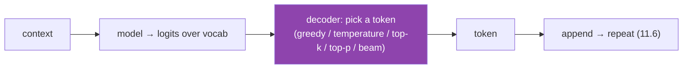
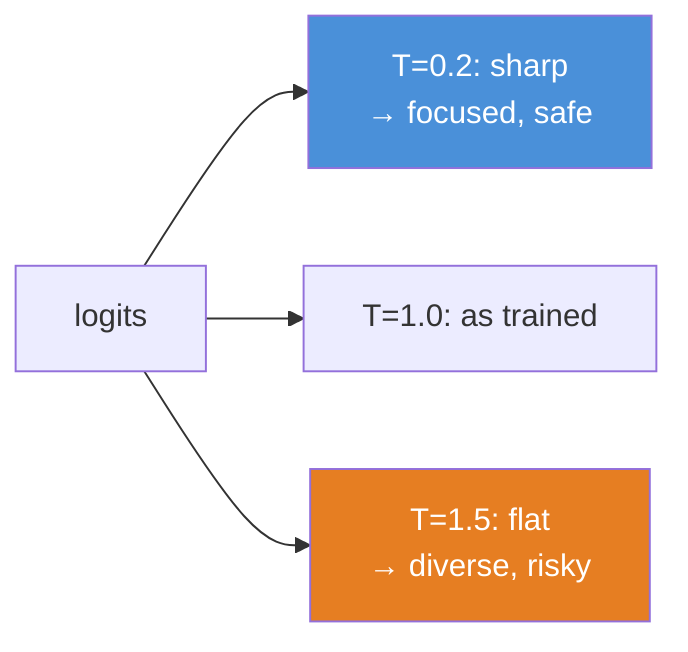
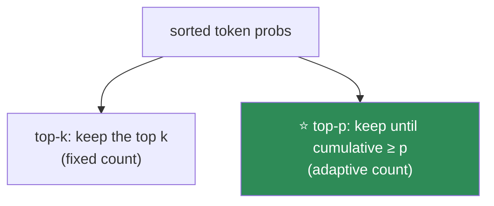
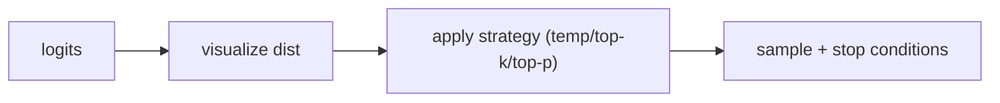

# 11.14 · Inference & Decoding — Turning Logits Into Text

[⬅ 11.13 Alignment](11.13-alignment.md) · [🏠 Module 11](../README.md) · [➡ 11.15 KV Cache](11.15-kv-cache.md)

> **The lesson in one line:** At each step the model gives you a probability distribution over the next token — how you turn that distribution into a chosen token (greedy, temperature, top-k, top-p, beam) controls the entire quality-versus-randomness trade-off of the output.

---

## 🎯 Learning objectives

- Understand **autoregressive generation** as sampling from the model's next-token distribution in a loop.
- Master the **decoding strategies**: greedy, temperature, top-k, top-p (nucleus), beam.
- Understand the **quality vs randomness** (exploration/exploitation) trade-off and which knob to use when.
- Know the practical parameters (`temperature`, `top_p`, `repetition_penalty`, stop conditions).

## ✅ Prerequisites

- [11.6 autoregressive generation](11.6-decoder-only.md), [11.1 the LM objective](11.1-what-is-a-language-model.md).
- [10.8 decoding strategies](../../10-NLP/weeks/10.8-seq2seq.md), [06.5 temperature/top-k/top-p sampling](../../06-Mathematics/weeks/06.5-probability.md).

---

## 🧠 Mental model

> [!IMPORTANT]
> **Generation has two separate parts: the model (produces a probability distribution over the next token) and the decoder (picks a token from that distribution).** The model is fixed after training; the **decoding strategy is a runtime choice** that dramatically changes output — the *same* model can be a precise fact-answerer or a creative storyteller depending only on the sampling settings. Decoding is the cheapest, fastest lever you have on LLM behavior: no retraining, just parameters.



---

## The knobs

### Greedy decoding
Always pick the **highest-probability** token (`argmax`). Deterministic, fast — and short-sighted ([10.8](../../10-NLP/weeks/10.8-seq2seq.md)): the locally-best token can lead to a globally worse, repetitive completion. Good for tasks with one right answer (factual Q&A, classification), bad for anything open-ended.

### Temperature
**Temperature** ($T$) reshapes the distribution *before* sampling by dividing the logits: `softmax(logits / T)`.

- $T \to 0$: distribution sharpens toward the top token → approaches greedy (deterministic, focused).
- $T = 1$: the model's raw distribution.
- $T > 1$: distribution flattens → more diverse, more random, more "creative" (and more error-prone).



> [!IMPORTANT]
> **Temperature is the master dial of the creativity–reliability trade-off ([06.5](../../06-Mathematics/weeks/06.5-probability.md)).** Low temperature for anything where correctness matters (code, facts, extraction, structured output) — you want the model's most confident token. High temperature for brainstorming, fiction, variety. This is the single most impactful inference setting, and the most common mistake is using a high temperature for a task that needs precision (hallucinations rise with temperature).

### Top-k sampling
Restrict sampling to the **k most likely** tokens; renormalize; sample. Cuts off the long tail of low-probability (often nonsensical) tokens while keeping some diversity. Fixed cutoff regardless of how peaked the distribution is.

### Top-p (nucleus) sampling ⭐
Restrict to the **smallest set of tokens whose cumulative probability ≥ p** (e.g., 0.9); renormalize; sample. **Adaptive**: when the model is confident (one token has 0.95 probability), the nucleus is tiny (near-greedy); when uncertain (many plausible tokens), the nucleus is large (more diverse). This adaptivity is why top-p is the modern default.



| Strategy | Picks | Trade-off |
|---|---|---|
| **Greedy** | argmax | deterministic; repetitive; short-sighted |
| **Temperature** | reshape then sample | the master creativity dial |
| **Top-k** | from k most likely | cuts the tail; fixed k ignores confidence |
| **⭐ Top-p (nucleus)** | from cumulative-p nucleus | **adaptive to confidence — the default** |
| **Beam** | keep b best sequences | high-probability but bland; for translation, not chat |

Top-p and temperature are **combined** in practice: temperature reshapes, then top-p (and/or top-k) truncates, then sample.

### Beam search
Keep the *b* highest-probability *sequences* ([10.8](../../10-NLP/weeks/10.8-seq2seq.md)). Better for tasks with a single correct answer (translation), but for **open-ended generation it produces bland, repetitive, generic text** ([10.8](../../10-NLP/weeks/10.8-seq2seq.md)) and is rarely used for chat. Modern LLMs generate with sampling (temperature + top-p), not beam.

### Repetition control
LLMs can loop ("I think that I think that..."). A **repetition penalty** (or frequency/presence penalties) down-weights tokens already generated, breaking loops. A practical necessity for longer generations.

---

## 💻 Implementation (from your [11.8 model](11.8-build-mini-transformer.md))

```python
@torch.no_grad()
def generate(model, idx, max_new_tokens, temperature=1.0, top_k=None, top_p=None):
    for _ in range(max_new_tokens):
        logits = model(idx[:, -model.block_size:])[0][:, -1, :]   # last-position logits
        logits = logits / temperature                              # temperature
        if top_k is not None:                                     # top-k truncation
            v, _ = torch.topk(logits, top_k)
            logits[logits < v[:, [-1]]] = float('-inf')
        if top_p is not None:                                     # top-p (nucleus)
            sorted_logits, sorted_idx = torch.sort(logits, descending=True)
            cum = sorted_logits.softmax(-1).cumsum(-1)
            mask = cum > top_p
            mask[..., 1:] = mask[..., :-1].clone(); mask[..., 0] = False
            logits.scatter_(-1, sorted_idx, torch.where(mask, float('-inf'), sorted_logits))
        probs = logits.softmax(-1)
        next_id = torch.multinomial(probs, 1)                     # sample
        idx = torch.cat([idx, next_id], dim=1)
        if next_id.item() == EOS_ID: break                        # stop on <eos> (11.2)
    return idx
```

> [!TIP]
> **Sensible defaults by task:** factual/code/structured → **temperature 0–0.3, greedy or low top-p** (you want the confident token). Chat/general → **temperature ~0.7, top-p ~0.9**. Creative → **temperature ~1.0+, top-p ~0.95**. Always set **stop conditions** (`<eos>` + max tokens) and a **repetition penalty** for long outputs. These few parameters cover the vast majority of real usage.

---

## 🏭 Production examples

| Use case | Settings |
|---|---|
| **Code generation** | temp ~0.2, low top-p — precision |
| **Factual Q&A / extraction** | temp 0, greedy — deterministic |
| **Chatbot** | temp 0.7, top-p 0.9 — balanced |
| **Creative writing** | temp 1.0, top-p 0.95 — diverse |
| **Structured (JSON) output** | temp 0 + constrained/grammar decoding |

## ⚡ Performance & GPU considerations

- **Decoding is cheap; the model forward pass dominates** — decoding strategy adds negligible compute vs the O(n²)/matmul cost per token ([11.15](11.15-kv-cache.md)).
- **Greedy is deterministic** → reproducible and cacheable; sampling is not (set a seed for reproducibility in tests).
- **Beam multiplies cost by b** and needs length normalization ([10.8](../../10-NLP/weeks/10.8-seq2seq.md)) — another reason chat avoids it.
- **Constrained decoding** (grammars, JSON schemas) masks invalid tokens per step — cheap and hugely useful for structured output.

## 🔒 Security considerations

> [!CAUTION]
> - **Higher temperature increases hallucination and unsafe outputs** — flattening the distribution samples lower-probability (often wrong or off-policy) tokens; use low temperature where correctness/safety matter ([11.18](11.18-safety.md)).
> - **Sampling makes outputs non-deterministic** — a prompt that's safe most of the time may occasionally sample an unsafe token; safety must not rely on "it usually doesn't say that."
> - **Stop conditions are a safety/cost control** — without `<eos>` handling and a max-length cap, generation can run away (cost/DoS) or drift into unsafe territory ([11.6](11.6-decoder-only.md)).
> - **Constrained decoding is a guardrail** — forcing valid JSON/grammar prevents malformed or injected output structures.

## 🚫 Common mistakes

| Mistake | Consequence |
|---|---|
| **High temperature for factual tasks** | hallucinations, wrong answers |
| **Greedy for creative tasks** | repetitive, bland output |
| **Beam search for chat** | generic, repetitive ([10.8](../../10-NLP/weeks/10.8-seq2seq.md)) |
| **No stop conditions** | runaway generation (cost/safety) |
| **No repetition penalty on long text** | loops |
| **Assuming determinism with sampling** | non-reproducible outputs; set a seed for tests |

## ✅ Best practices

- **Match temperature to the task** — low for precision, high for creativity.
- **Default to temperature + top-p** (≈0.7 / 0.9) for general chat; **temp 0 / greedy** for facts/code.
- **Avoid beam for open-ended generation**; reserve it for single-answer tasks.
- **Always set stop tokens and a max-length cap**; add a repetition penalty for long outputs.
- **Use constrained/grammar decoding** for structured output (JSON, tool calls).
- **Fix a seed** when you need reproducible generations (tests, evals).

## 🏋️ Exercises

1. **Temperature sweep.** Generate from your [11.8 nano-GPT](11.8-build-mini-transformer.md) at T ∈ {0.2, 0.7, 1.0, 1.5}. Describe how coherence and diversity change. Find where it becomes incoherent.
2. **Top-k vs top-p.** For a prompt where the model is very confident and one where it's uncertain, show how top-p adapts the nucleus size while top-k doesn't.
3. **Greedy repetition.** Generate a long passage greedily; find the repetition loop. Add a repetition penalty and show it breaks.
4. **Beam is bland.** Generate open-ended text with beam (b=5) vs top-p; compare diversity. Reproduce the "bland beam" effect.
5. **Constrained decoding.** Implement token masking that forces valid JSON structure; show the model can no longer emit malformed JSON.
6. **Determinism.** Show greedy is reproducible and sampling isn't; then fix a seed and make sampling reproducible.

## 🛠️ Mini project — "A Decoding Playground"

**Goal:** a tool that exposes every decoding knob and *visualizes* its effect — building intuition for the quality/randomness trade-off.

**Requirements**
- Wrap a model's generation with greedy, temperature, top-k, top-p, beam, and repetition penalty.
- **Visualize the next-token distribution** at each step and show how each strategy truncates/reshapes it.
- A **task presets** panel (factual / chat / creative / JSON) with sensible defaults.
- Reproducibility via seeds.

**Folder structure**
```
decoding-playground/
├── decode.py          # all strategies + repetition penalty
├── visualize.py       # per-step distribution + nucleus/top-k cutoff
├── presets.py         # task → recommended settings
└── README.md
```

**Architecture diagram**


**Testing:** greedy is deterministic; top-p nucleus adapts to confidence; stop tokens halt generation; seeded sampling is reproducible.
**Evaluation:** qualitative — do the presets produce appropriate output per task?
**Future improvements:** add constrained/grammar decoding for JSON; add speculative decoding hooks ([11.16](11.16-inference-optimization.md)); measure hallucination rate vs temperature.

## 📄 Cheat sheet

| Knob | Effect | Use for |
|---|---|---|
| **Greedy** | argmax; deterministic | facts, code, extraction |
| **⭐ Temperature** | sharpen (low) / flatten (high) the dist | the master creativity dial |
| **Top-k** | keep k most likely | cut the tail (fixed k) |
| **⭐ Top-p (nucleus)** | keep cumulative-p nucleus (adaptive) | **the default** |
| **Beam** | b best *sequences* | translation, **not chat** (bland) |
| **Repetition penalty** | down-weight repeats | long generations (breaks loops) |
| **Stop conditions** | `<eos>` + max tokens | always (safety/cost) |

**⭐ Defaults:** facts/code → temp 0–0.3 · chat → temp 0.7, top-p 0.9 · creative → temp 1.0, top-p 0.95.

## 🎴 Flashcards

- **What are the two parts of generation?** → The model (produces a next-token distribution) and the decoder (picks a token from it — a runtime choice).
- **⭐ What does temperature do?** → Reshapes the distribution before sampling: low sharpens toward the top token (focused), high flattens it (diverse/creative).
- **What is greedy decoding, and when is it appropriate?** → Always pick the argmax; deterministic; good for single-answer tasks (facts, code), bad for open-ended text.
- **Top-k vs top-p?** → Top-k keeps a fixed number of top tokens; top-p (nucleus) keeps the smallest set with cumulative probability ≥ p — adaptive to the model's confidence.
- **⭐ Why is top-p the default?** → It adapts: tiny nucleus when the model is confident (near-greedy), large when uncertain (diverse).
- **Why avoid beam search for chat?** → It maximizes sequence probability, producing bland, repetitive, generic text.
- **⭐ How does temperature relate to safety?** → Higher temperature samples lower-probability tokens, increasing hallucination and unsafe outputs; use low temperature where correctness matters.
- **Why always set stop conditions?** → To prevent runaway generation (cost/DoS) and control output.

## 💬 Interview questions

1. Explain the difference between the model and the decoding strategy in generation.
2. What does temperature do, and how do you choose it per task?
3. Compare top-k and top-p sampling. Why is top-p usually preferred?
4. Why is beam search a poor choice for chatbots?
5. How does decoding strategy affect hallucination and safety?
6. How would you force a model to produce valid JSON?

## 📝 Summary

- Generation splits into the **model** (produces a next-token distribution) and the **decoder** (picks a token) — and decoding is a **cheap runtime lever** that transforms the same model from precise to creative.
- **Temperature** is the master creativity–reliability dial ([06.5](../../06-Mathematics/weeks/06.5-probability.md)); **top-p (nucleus)** sampling is the adaptive default; **greedy** for single-answer tasks; **beam** for translation, not chat (it's bland).
- **Match settings to the task**: low temperature for facts/code, moderate for chat, high for creativity — and always set **stop conditions** and a **repetition penalty**.
- **Higher temperature raises hallucination and unsafe outputs**, and **sampling is non-deterministic** — decoding is a safety-relevant choice, not just a stylistic one.

## 📚 References

1. **Holtzman et al. (2020) — _The Curious Case of Neural Text Degeneration_ (nucleus/top-p sampling).** ⭐⭐ Why top-p.
2. **Fan et al. (2018) — _Hierarchical Neural Story Generation_ (top-k).**
3. **[06.5 Probability](../../06-Mathematics/weeks/06.5-probability.md) & [10.8 Seq2Seq decoding](../../10-NLP/weeks/10.8-seq2seq.md).** Your foundations.
4. **Wolf et al. — _Hugging Face `generate()` documentation_.** ⭐ Every knob, practically.
5. **Willard & Louf (2023) — _Efficient Guided Generation_ (Outlines).** Constrained/grammar decoding.

---

## 🧭 Navigation

| Direction | Link |
|---|---|
| ⬅ Previous | [11.13 · Alignment](11.13-alignment.md) |
| ➡ Next | [11.15 · KV Cache](11.15-kv-cache.md) |
| 🏠 Module | [Module 11](../README.md) |
| 📖 Lessons | [Lesson index](README.md) |
