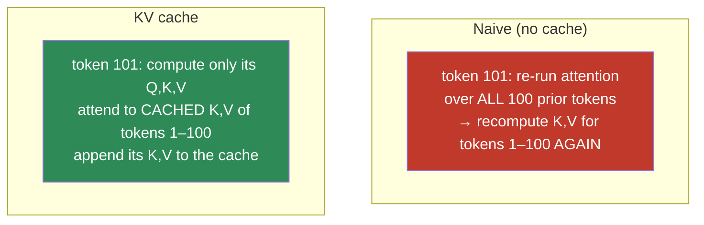
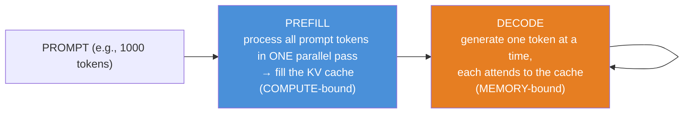
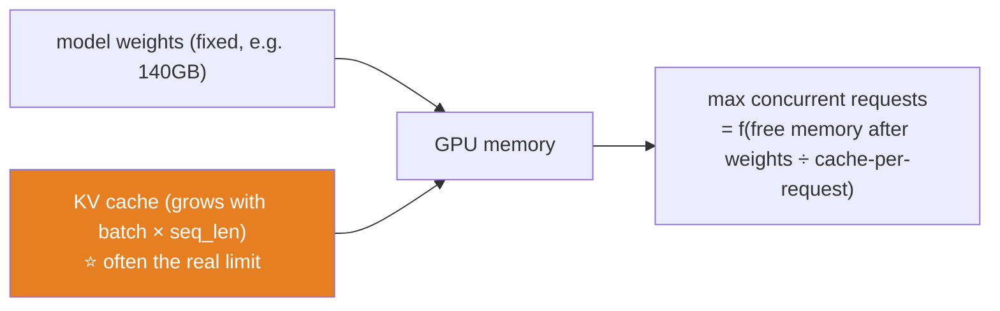
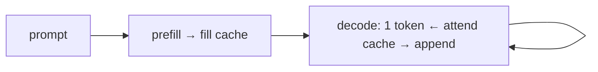

# 11.15 · KV Cache — Why Generation Is Memory-Bound ⭐

[⬅ 11.14 Inference & Decoding](11.14-inference-decoding.md) · [🏠 Module 11](../README.md) · [➡ 11.16 Inference Optimization](11.16-inference-optimization.md)

> **The lesson in one line:** Naively, generating each new token re-runs attention over the entire prompt — O(n²) wasted work — so LLMs cache the keys and values of every past token, turning generation from quadratic to linear at the cost of a big, growing memory buffer.

---

## 🎯 Learning objectives

- Understand why naive autoregressive generation is **wasteful** (recomputes the whole prefix each step).
- Understand the **KV cache** — storing past keys/values so each new token does O(n) work, not O(n²).
- Understand the two phases of inference: **prefill** (compute-bound) and **decode** (memory-bound).
- Reason about **KV-cache memory** and why it (not the weights) often limits batch size and context length.

## ✅ Prerequisites

- [11.4 attention & GQA](11.4-attention.md), [11.6 autoregressive generation](11.6-decoder-only.md).
- [09.14 memory-bandwidth vs compute-bound](../../09-Deep-Learning/weeks/09.14-performance.md).

---

## 🧠 Mental model

> [!IMPORTANT]
> **When generating token 101, the keys and values for tokens 1–100 are *identical* to what they were when generating token 100 — the past doesn't change. So don't recompute them: cache them.** The KV cache stores the key and value vectors of every token processed so far, for every layer and head. Each new token computes *its own* Q, K, V, attends to the cached K/V of all previous tokens, and appends its K/V to the cache. Generation goes from re-processing the whole sequence each step (O(n²) total) to processing one token against a cache (O(n) total). **This single optimization is what makes LLM serving viable.**



---

## Why naive generation is wasteful

Recall attention ([11.4](11.4-attention.md)): each token's Q attends to *all* tokens' K/V. In naive generation, at each step you re-run the full forward pass over the entire growing sequence. But the K and V of past tokens are **deterministic functions of those tokens**, which haven't changed — so you recompute the same K/V matrices over and over. Generating an *n*-token sequence naively costs O(n²) work (step *t* processes *t* tokens; summed, ~n²/2). Almost all of it is redundant.

The causal mask ([11.6](11.6-decoder-only.md)) makes this precise: token *t* only attends to tokens ≤ *t*, and those tokens' representations don't depend on anything after them. **The past is frozen** — so cache it.

---

## The two phases: prefill and decode

KV-cache generation has two distinct phases with *opposite* performance characteristics:



### Prefill — process the prompt (compute-bound)
The prompt is known upfront, so all its tokens are processed in **one parallel forward pass** (like training — the causal mask lets all positions compute at once, [11.6](11.6-decoder-only.md)), filling the cache. This is **compute-bound**: lots of matmul FLOPs, GPU well-utilized. Prefill produces the *first* token and determines "time to first token."

### Decode — generate the response (memory-bound)
Then, one token at a time: compute one token's Q/K/V, attend to the cache, append. Each decode step does *tiny* compute (one token) but must **read the entire KV cache and all model weights from memory**. This is **memory-bandwidth-bound** ([09.14](../../09-Deep-Learning/weeks/09.14-performance.md)) — the GPU is starved for data, not compute. Decode determines "time per output token."

> [!IMPORTANT]
> **The prefill/decode split is the key to understanding LLM serving.** Prefill is compute-bound (parallel, efficient); decode is memory-bound (sequential, GPU underutilized). This is why: (1) **batching helps decode enormously** — process many requests' decode steps together to reuse the weight reads across requests ([11.16 continuous batching](11.16-inference-optimization.md)); (2) **the first token is slow (prefill) but subsequent tokens have steady latency (decode)**; (3) optimizations differ per phase. Every LLM serving system is organized around this distinction. Memorize it.

---

## KV-cache memory — the new bottleneck

The cache stores, **per token, per layer, per KV-head**, a key and a value vector. Its size:

$$\text{KV cache} = 2 \times \text{layers} \times \text{seq\_len} \times \text{n\_kv\_heads} \times d_{head} \times \text{bytes} \times \text{batch}$$

The "2" is key + value. It grows **linearly with sequence length and batch size** — and it can be *enormous*.

> [!IMPORTANT]
> **For long contexts and large batches, the KV cache rivals or exceeds the model weights in memory — and it's often what actually limits how many requests you can serve.** A 70B model in fp16 is ~140GB of weights (fixed); its KV cache for a batch of 32 requests at 8K context can be *tens of GB and growing per token*. You can't fit more concurrent requests not because of the weights but because of the **cache**. This is precisely why **[GQA/MQA (11.4)](11.4-attention.md)** exist — reducing the number of KV-heads shrinks the cache several-fold, directly increasing how many requests fit. The KV cache is the reason "how long is your context" and "how many concurrent users" trade off against each other.



---

## 💻 KV cache in code (conceptual)

```python
# Decode step with a KV cache
def decode_step(model, new_token, kv_cache):
    q, k, v = model.qkv(new_token)              # only the NEW token's Q,K,V
    kv_cache.append(k, v)                        # append to cache (past K,V reused, not recomputed)
    # attend new token's Q to ALL cached K,V (past + present)
    out = attention(q, kv_cache.keys, kv_cache.values, causal=True)
    return model.head(out), kv_cache            # next-token logits + updated cache
```

The whole trick: **the past K/V come from the cache, not from recomputation.** Real implementations (vLLM's PagedAttention, [11.16](11.16-inference-optimization.md)) manage this cache cleverly to avoid fragmentation and enable sharing.

---

## 🏭 Production examples

| System | KV-cache technique |
|---|---|
| **vLLM** | **PagedAttention** — manages the cache like OS virtual memory (no fragmentation, sharing) |
| **All serving stacks** | KV cache is mandatory; without it, generation is unusably slow |
| **Long-context models** | KV-cache memory is the primary constraint; GQA + cache compression |
| **Shared-prefix serving** | cache the system prompt's K/V once, reuse across requests |

## ⚡ Performance & GPU considerations

- **Decode is memory-bound** ([09.14](../../09-Deep-Learning/weeks/09.14-performance.md)) — the bottleneck is reading weights + cache from HBM, not FLOPs. This is why decode throughput barely improves with a faster GPU but improves a lot with more memory bandwidth.
- **Batching amortizes weight reads across requests** — the single biggest decode-throughput lever ([11.16](11.16-inference-optimization.md)).
- **KV-cache memory limits batch size and context** — reduce it with **GQA/MQA** ([11.4](11.4-attention.md)), quantized cache, or paged management.
- **Prefix caching** — reuse the KV cache of a shared prompt prefix (e.g., a common system prompt) across requests, saving prefill compute.

## 🔒 Security considerations

> [!CAUTION]
> - **KV-cache sharing can leak across requests** — if a shared-prefix cache isn't properly isolated per user/tenant, one request's cached context could influence another. Multi-tenant serving must isolate caches ([11.20](11.20-production-architecture.md)).
> - **The cache holds the full conversation in memory** — including any PII/secrets in the prompt ([10.14](../../10-NLP/weeks/10.14-ethics-safety.md)); it's a sensitive in-memory data store subject to the same handling as the conversation.
> - **Long-context requests are a memory-DoS vector** — a request with a huge prompt/generation balloons the KV cache and can exhaust GPU memory, starving other requests. Enforce context and generation caps ([11.14](11.14-inference-decoding.md), [11.18](11.18-safety.md)).

## 🚫 Common mistakes

| Mistake | Consequence |
|---|---|
| **Generating without a KV cache** | O(n²) recomputation → unusably slow |
| **Ignoring KV-cache memory in capacity planning** | OOM at high concurrency/long context |
| **Assuming weights are the memory limit** | the cache often is |
| **Using MHA when GQA would do** | needlessly large cache → fewer concurrent requests |
| **Not isolating caches in multi-tenant serving** | cross-request leakage |
| **No context/generation cap** | memory-DoS |

## ✅ Best practices

- **Always use a KV cache** for generation (every serving framework does).
- **Plan capacity around KV-cache memory**, not just model weights — it grows with batch × context.
- **Use GQA/MQA** ([11.4](11.4-attention.md)) and consider **quantized KV cache** to fit more requests.
- **Batch decode steps** to amortize weight reads ([11.16](11.16-inference-optimization.md)).
- **Cache shared prefixes** (system prompts) to save prefill.
- **Isolate caches per tenant; cap context and generation length.**

## 🏋️ Exercises

1. **Add a KV cache.** Extend your [11.8 nano-GPT](11.8-build-mini-transformer.md) `generate` to cache K/V. Measure the speedup vs the naive re-run version as sequence length grows. Confirm the outputs are identical.
2. **O(n²) → O(n).** Time naive vs cached generation for outputs of length {50, 100, 200, 400}. Plot both; confirm naive is quadratic and cached is linear.
3. **Prefill vs decode.** Instrument your model to separately time the prefill (prompt) pass and per-token decode steps. Show prefill is one big compute-bound pass and decode is many small memory-bound steps.
4. **Cache-size estimate.** Compute the KV-cache size for a 7B model (32 layers, 32 heads, d_head=128, fp16) at seq_len 4096, batch 16. Compare to the weight size. Which limits concurrency?
5. **GQA saves cache.** Recompute the cache size with 8 KV-heads (GQA) instead of 32. Report the reduction and the extra concurrent requests it enables.

## 🛠️ Mini project — "KV Cache From Scratch + Capacity Model"

**Goal:** implement a KV cache, prove the speedup, and build a capacity model that predicts max concurrent requests from memory.

**Requirements**
- Add a KV cache to your [11.8 model](11.8-build-mini-transformer.md); verify identical outputs vs naive.
- **Benchmark** naive vs cached generation across lengths (confirm O(n²) vs O(n)).
- Separately measure **prefill vs decode** time.
- A **capacity calculator**: given model config, context length, and GPU memory, compute KV-cache-per-request and max batch — with MHA vs GQA.

**Folder structure**
```
kv-cache/
├── cache.py           # KV cache (append, read)
├── generate.py        # cached generation; verify == naive
├── benchmark.py       # naive vs cached; prefill vs decode timing
├── capacity.py        # memory → max concurrent requests (MHA/GQA)
└── README.md
```

**Architecture diagram**


**Testing:** cached output == naive output (bit-identical); cached generation scales linearly; capacity model matches measured OOM point.
**Evaluation:** the speedup curve and the capacity table (MHA vs GQA) are the deliverables.
**Performance:** report tokens/sec for naive vs cached; time-to-first-token (prefill) vs per-token (decode).
**Future improvements:** add a quantized KV cache and paged management ([11.16](11.16-inference-optimization.md)); add prefix caching for a shared system prompt.

## 📄 Cheat sheet

| Concept | One line |
|---|---|
| **The waste** | naive generation recomputes past K/V every step → O(n²) |
| **⭐ KV cache** | store past K/V; each new token does O(n) work, not O(n²) |
| **Why it's valid** | the past is frozen (causal mask) → K/V don't change |
| **⭐ Prefill** | process the whole prompt in one parallel pass — **compute-bound** |
| **⭐ Decode** | generate one token at a time from the cache — **memory-bound** |
| **⭐ Cache memory** | `2·layers·seq·kv_heads·d_head·bytes·batch` — grows with batch × context |
| **The real limit** | KV cache (not weights) often caps concurrency & context |
| **Shrink it** | **GQA/MQA** ([11.4](11.4-attention.md)), quantized cache, paged mgmt |

## 🎴 Flashcards

- **⭐ What is the KV cache?** → A store of the key and value vectors of all past tokens, so each new token attends to cached K/V instead of recomputing them.
- **Why is naive generation O(n²)?** → Each step re-runs attention over the whole growing sequence, recomputing past K/V that never change.
- **Why is caching K/V valid?** → The causal mask means past tokens' representations don't depend on future tokens — the past is frozen.
- **⭐ What are the two phases of inference?** → Prefill (process the prompt in one parallel pass — compute-bound) and decode (generate one token at a time from the cache — memory-bound).
- **⭐ Why is decode memory-bound?** → Each step does tiny compute but must read all weights + the whole cache from memory; the GPU is starved for data.
- **⭐ What often limits concurrency, weights or cache?** → The KV cache — it grows with batch × context and can exceed the (fixed) weight memory.
- **How do you shrink the KV cache?** → Fewer KV-heads (GQA/MQA), quantized cache, and paged memory management.
- **Why does batching help decode so much?** → It amortizes the expensive weight reads across many requests (memory-bound → share the reads).

## 💬 Interview questions

1. What is the KV cache, and what problem does it solve?
2. Why is caching keys and values valid — what property of the model allows it?
3. Explain prefill vs decode. Why is one compute-bound and the other memory-bound?
4. Why does the KV cache often limit concurrency more than the model weights?
5. How does GQA relate to the KV cache?
6. Why does batching dramatically improve decode throughput but not prefill as much?

## 📝 Summary

- Naive autoregressive generation **recomputes the past every step (O(n²))**; the **KV cache** stores past keys/values so each new token does **O(n)** work — the optimization that makes LLM serving viable.
- Inference has two phases: **prefill** (process the prompt in one parallel, **compute-bound** pass — filling the cache) and **decode** (generate token by token from the cache — **memory-bound**).
- **KV-cache memory grows with batch × context** and **often limits concurrency more than the model weights do** — which is exactly why **GQA/MQA** ([11.4](11.4-attention.md)) exist.
- The prefill/decode distinction and the memory-bound nature of decode explain every serving optimization in [11.16](11.16-inference-optimization.md): **batching, quantized caches, and paged attention.**

## 📚 References

1. **Pope et al. (2022) — _Efficiently Scaling Transformer Inference_.** ⭐ Prefill/decode, KV cache, memory analysis.
2. **Kwon et al. (2023) — _Efficient Memory Management for LLM Serving with PagedAttention_ (vLLM).** ⭐⭐ The cache-as-virtual-memory idea.
3. **Shazeer (2019) — _Fast Transformer Decoding_ (MQA)** & **Ainslie et al. (2023) — _GQA_.** Shrinking the cache.
4. **[09.14 Performance](../../09-Deep-Learning/weeks/09.14-performance.md).** Memory-bound vs compute-bound.
5. **[11.4 Attention](11.4-attention.md).** Where Q/K/V and GQA come from.

---

## 🧭 Navigation

| Direction | Link |
|---|---|
| ⬅ Previous | [11.14 · Inference & Decoding](11.14-inference-decoding.md) |
| ➡ Next | [11.16 · Inference Optimization](11.16-inference-optimization.md) |
| 🏠 Module | [Module 11](../README.md) |
| 📖 Lessons | [Lesson index](README.md) |
