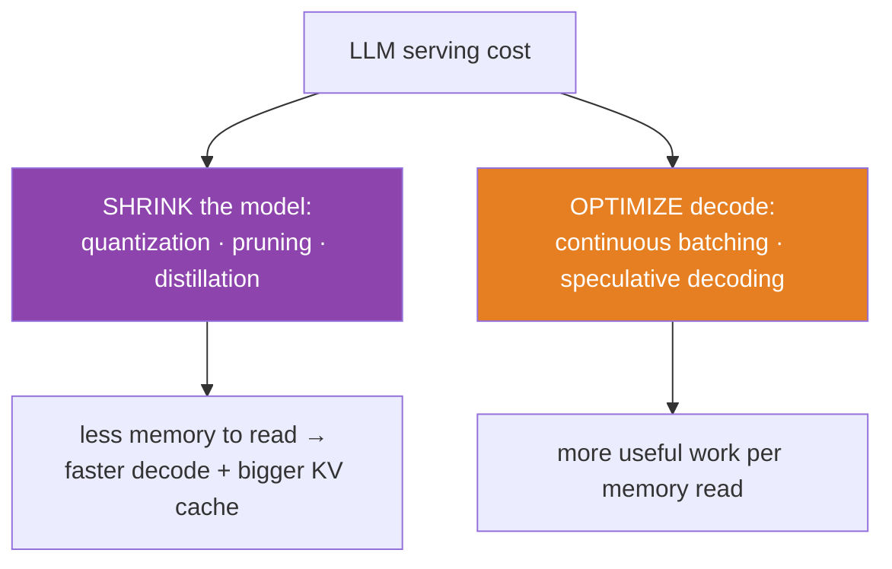
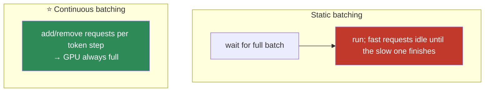
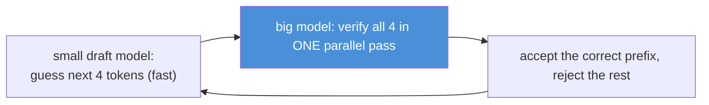
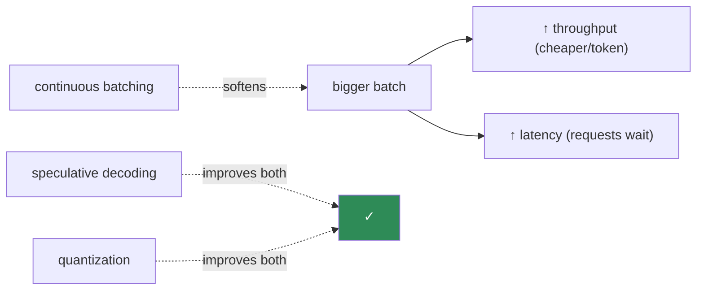
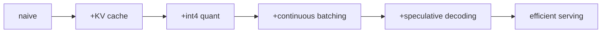

# 11.16 · LLM Inference Optimization — Quantization, Batching, Speculative Decoding

[⬅ 11.15 KV Cache](11.15-kv-cache.md) · [🏠 Module 11](../README.md) · [➡ 11.17 LLM Evaluation](11.17-evaluation.md)

> **The lesson in one line:** Serving an LLM affordably means shrinking the model (quantization, distillation, pruning) and making the memory-bound decode phase efficient (continuous batching, speculative decoding) — all navigating the latency-versus-throughput trade-off.

---

## 🎯 Learning objectives

- Understand **model compression**: quantization, pruning, distillation — and their trade-offs.
- Understand **serving optimizations**: (continuous) batching and speculative decoding.
- Understand the **latency vs throughput** trade-off and how each technique moves it.
- Connect every technique to the **memory-bound decode** insight from [11.15](11.15-kv-cache.md).

## ✅ Prerequisites

- [11.15 KV cache, prefill/decode](11.15-kv-cache.md), [11.4 attention/GQA](11.4-attention.md).
- [09.14 mixed precision & memory](../../09-Deep-Learning/weeks/09.14-performance.md), [09.17 production/latency-throughput](../../09-Deep-Learning/weeks/09.17-production.md).

---

## 🧠 Mental model

> [!IMPORTANT]
> **LLM inference is dominated by two costs: holding the model in memory and the memory-bound decode phase ([11.15](11.15-kv-cache.md)). Every optimization attacks one or both.** *Compression* (quantization, pruning, distillation) shrinks the model → less memory to read per token → faster decode and more room for the KV cache. *Serving* techniques (batching, speculative decoding) make the decode phase do more useful work per memory read. Since decode is memory-bound, **the winning move is almost always "read less" or "do more per read."**



---

## Model compression

### Quantization ⭐
Store and compute weights in **lower precision** — fp16 → int8 → int4 (even lower). A 70B model in fp16 is ~140GB; in int4 it's ~35GB, fitting on far smaller/cheaper hardware and reading 4× less memory per token (faster decode, [11.15](11.15-kv-cache.md)).

- **Post-training quantization (PTQ)** — quantize an already-trained model (GPTQ, AWQ). Fast, no retraining; slight quality loss.
- **Quantization-aware training** — train with quantization in the loop; better quality, more expensive.
- Weights quantize well; **activations and the KV cache can also be quantized** (with more care).

> [!IMPORTANT]
> **Quantization is the highest-leverage inference optimization, and it's nearly free down to int8/int4.** Because decode is memory-bound ([11.15](11.15-kv-cache.md)), cutting the bytes-per-weight directly cuts the dominant cost — a 4-bit model decodes ~4× faster *and* leaves 4× more room for the KV cache (more concurrent requests). Modern methods (GPTQ, AWQ) lose only ~1% quality at int4. This is also what made [QLoRA (11.12)](11.12-peft-lora.md) possible. **Quantize first; it's the biggest, cheapest win.**

### Distillation
Train a small "student" model to imitate a large "teacher" ([10.12 DistilBERT](../../10-NLP/weeks/10.12-modern-libraries.md)). The student learns from the teacher's outputs (soft labels), reaching much of the quality at a fraction of the size. Used to make small, fast production models (DistilBERT, and many small chat models distilled from larger ones).

### Pruning
Remove weights/neurons/attention-heads that contribute little (near-zero). **Structured pruning** (remove whole heads/layers) gives real speedups; **unstructured pruning** (zero out individual weights) saves memory but needs sparse-hardware support to speed up. Generally lower-leverage than quantization for LLMs.

| Technique | What | Trade-off |
|---|---|---|
| **⭐ Quantization** | lower precision (int8/int4) | ~free ~4× memory/speed win; slight quality loss |
| **Distillation** | small student imitates teacher | big size reduction; needs training + teacher |
| **Pruning** | remove low-value weights/heads | speedup needs structured pruning / sparse HW |

---

## Serving optimizations

### Continuous (in-flight) batching ⭐
Static batching waits to collect a fixed batch, then runs them together — but requests finish at different times ([variable output lengths, 11.14](11.14-inference-decoding.md)), so the GPU idles waiting for the slowest. **Continuous batching** adds new requests to the running batch *as soon as slots free up*, at the token level — never idling.



> [!IMPORTANT]
> **Continuous batching is the single biggest throughput win in LLM serving, and it works *because* decode is memory-bound.** The expensive part of each decode step is reading the model weights from memory ([11.15](11.15-kv-cache.md)); that read is *shared* across every request in the batch. So packing more requests into each step costs almost no extra memory reads — you get near-linear throughput gains until you run out of KV-cache memory ([11.15](11.15-kv-cache.md)). vLLM's continuous batching + PagedAttention is why it serves many times the throughput of naive serving. **This is the payoff of the [11.15](11.15-kv-cache.md) prefill/decode insight.**

### Speculative decoding
Decode is memory-bound, so the GPU has *spare compute* during each step. Speculative decoding exploits it: a small, fast "draft" model proposes several tokens ahead; the big model then **verifies them all in one parallel forward pass** (verification is cheap — it's like prefill). Accepted drafts are free; rejected ones fall back to normal decode. Net: **2–3× faster generation with identical output distribution** (the big model still decides).



> [!TIP]
> **Speculative decoding turns spare compute into speed, for free quality-wise.** Because decode wastes compute (memory-bound), verifying 4 guessed tokens in parallel costs almost the same as decoding 1. If the draft model is often right, you generate several tokens per big-model pass. Crucially, the **output distribution is provably identical** to normal decoding — you're not trading quality for speed, you're using idle compute. A beautiful exploitation of the [memory-bound decode](11.15-kv-cache.md) fact.

---

## Latency vs throughput — the eternal trade-off

Two different goals ([09.17](../../09-Deep-Learning/weeks/09.17-production.md)):

- **Latency** — time for *one* request (time-to-first-token + per-token). What a single user feels.
- **Throughput** — total tokens/sec across *all* requests. What determines your cost-per-token.

They conflict: bigger batches raise throughput (share weight reads) but raise latency (requests wait). **Continuous batching** softens the conflict (add requests without waiting); **speculative decoding** improves *both*; **quantization** improves both. But the fundamental tension — batch more for throughput, batch less for latency — governs serving-system tuning.



---

## 🏭 Production examples

| Technique | Where |
|---|---|
| **Quantization (GPTQ/AWQ, int4)** | almost all self-hosted open-model serving |
| **Continuous batching + PagedAttention** | vLLM, TGI, TensorRT-LLM |
| **Speculative decoding** | frontier APIs and vLLM/TGI |
| **Distillation** | small production models (DistilBERT, small chat models) |
| **GQA + quantized KV cache** | long-context serving ([11.4](11.4-attention.md), [11.15](11.15-kv-cache.md)) |

## ⚡ Performance & GPU considerations

- **All roads lead back to memory-bandwidth** ([09.14](../../09-Deep-Learning/weeks/09.14-performance.md), [11.15](11.15-kv-cache.md)) — decode is memory-bound, so "read less" (quantize) and "share reads" (batch) dominate.
- **Quantization frees KV-cache room** — smaller weights → more memory for more concurrent requests.
- **Use a serving framework** (vLLM, TGI, TensorRT-LLM) — they implement continuous batching, paging, and quantization correctly; don't hand-roll.
- **Speculative decoding needs a good draft model** — too weak and it's rejected often (no gain); a distilled version of the target model works well.

## 🔒 Security considerations

> [!CAUTION]
> - **Quantization can shift behavior/safety** — a 4-bit model may answer slightly differently, occasionally weakening alignment ([11.13](11.13-alignment.md)); re-evaluate safety after quantizing.
> - **Shared batching = shared failure domain** — a malicious request (huge context, [11.15 memory-DoS](11.15-kv-cache.md)) in a continuous batch can degrade every co-batched request; enforce per-request caps and isolation ([11.20](11.20-production-architecture.md)).
> - **Speculative decoding preserves the output distribution** — it doesn't change safety behavior, but the draft model shouldn't be an untrusted third-party model that could be probed.
> - **Distilled students inherit teacher biases/memorization** ([10.14](../../10-NLP/weeks/10.14-ethics-safety.md)).

## 🚫 Common mistakes

| Mistake | Consequence |
|---|---|
| **Not quantizing** | paying 4× the memory/latency for ~1% quality |
| **Static batching for variable-length generation** | GPU idles → poor throughput |
| **Hand-rolling a serving stack** | miss continuous batching/paging → far worse throughput |
| **Speculative decoding with a bad draft model** | high rejection rate → no speedup |
| **Not re-checking safety after quantization** | subtle alignment shifts |
| **Ignoring the latency/throughput trade-off** | over-batch (bad latency) or under-batch (bad cost) |

## ✅ Best practices

- **Quantize first** (int8/int4 via GPTQ/AWQ) — the biggest, cheapest win.
- **Use a production serving framework** with **continuous batching + paged KV cache** (vLLM/TGI).
- **Add speculative decoding** with a distilled draft model for latency-sensitive serving.
- **Combine with GQA + quantized KV cache** ([11.4](11.4-attention.md), [11.15](11.15-kv-cache.md)) to maximize concurrency.
- **Tune batch size to your latency SLA**; measure time-to-first-token and per-token separately.
- **Re-evaluate quality and safety** after any compression.

## 🏋️ Exercises

1. **Quantize and measure.** Quantize an open model to int8 and int4 (GPTQ/AWQ or `bitsandbytes`). Report memory, tokens/sec, and quality (perplexity + a few tasks) at each precision. Where does quality break?
2. **Batching throughput.** Serve a model with batch sizes 1, 4, 16, 32. Plot throughput and p50/p99 latency. Find the latency/throughput knee.
3. **Continuous vs static.** With variable-length prompts, compare static batching vs continuous batching (vLLM) throughput. Quantify the idle-time savings.
4. **Speculative decoding.** Set up a small draft + large target model. Measure speedup and the draft acceptance rate. Show output is distributionally identical to normal decoding.
5. **KV-cache room.** Show that quantizing weights from fp16 to int4 lets you fit N× more concurrent requests (more KV-cache memory), quantifying N.

## 🛠️ Mini project — "An Optimized Serving Stack"

**Goal:** take an open model from "runs slowly" to "serves efficiently," applying and *measuring* each optimization.

**Requirements**
- Baseline: naive generation (from [11.15](11.15-kv-cache.md)).
- Add, one at a time, measuring each: **KV cache** → **quantization (int4)** → **continuous batching** (via vLLM) → **speculative decoding**.
- Report **latency (TTFT, per-token) and throughput (tokens/sec)** at each stage, and the **quality/safety delta**.
- A **latency/throughput frontier** chart across batch sizes.

**Folder structure**
```
serving-stack/
├── baseline.py        # naive → +KV cache (11.15)
├── quantize.py        # int8/int4 (GPTQ/AWQ)
├── serve_vllm.py      # continuous batching + paged cache
├── speculative.py     # draft + target verification
├── benchmark.py       # TTFT, per-token, throughput, quality
└── README.md
```

**Architecture diagram**


**Testing:** each stage preserves output quality within tolerance; throughput increases monotonically; safety re-check after quantization.
**Evaluation:** the stage-by-stage latency/throughput table and the frontier chart are the deliverables.
**Performance:** report the cumulative speedup and cost-per-token reduction from baseline.
**Future improvements:** add prefix caching ([11.15](11.15-kv-cache.md)); tune GQA/quantized-KV; add autoscaling ([11.20](11.20-production-architecture.md)).

## 📄 Cheat sheet

| Technique | Attacks | Note |
|---|---|---|
| **⭐ Quantization (int8/int4)** | model memory + decode speed | ~free ~4× win; **do first** |
| **Distillation** | model size | student imitates teacher |
| **Pruning** | weights/heads | speedup needs structured/sparse |
| **⭐ Continuous batching** | decode throughput | add requests per token → GPU never idle |
| **Speculative decoding** | decode latency | draft guesses, big model verifies in parallel; **same output** |
| **⭐ Latency vs throughput** | the trade-off | batch more = throughput↑ latency↑ |
| **The key fact** | decode is **memory-bound** ([11.15](11.15-kv-cache.md)) | "read less" / "share reads" wins |

## 🎴 Flashcards

- **⭐ What is the highest-leverage LLM inference optimization?** → Quantization (int8/int4) — since decode is memory-bound, fewer bytes per weight directly cuts the dominant cost, ~4× for ~1% quality loss.
- **Quantization vs distillation vs pruning?** → Lower precision / small student imitates teacher / remove low-value weights (needs structured pruning for real speedup).
- **⭐ What is continuous batching and why does it work?** → Add/remove requests from the running batch per token so the GPU never idles; it works because decode is memory-bound and the weight read is shared across the batch.
- **⭐ What is speculative decoding?** → A small draft model guesses several tokens; the big model verifies them in one parallel pass — 2–3× faster with identical output distribution, using decode's spare compute.
- **Why does batching improve throughput but hurt latency?** → Bigger batches amortize memory reads (throughput↑) but make requests wait to be batched (latency↑).
- **⭐ Why do all these optimizations trace back to memory?** → Decode is memory-bandwidth-bound; "read less" (quantize) and "share/reuse reads" (batch, cache) are the winning moves.
- **Does speculative decoding change output quality?** → No — the big model still decides; the output distribution is provably identical.

## 💬 Interview questions

1. Why is quantization the highest-leverage LLM inference optimization?
2. Explain continuous batching. Why does it work so well for LLM decode?
3. What is speculative decoding, and why doesn't it hurt output quality?
4. Compare quantization, distillation, and pruning.
5. Explain the latency vs throughput trade-off and how each technique moves it.
6. Why do nearly all LLM inference optimizations reduce to memory considerations?

## 📝 Summary

- LLM serving cost is dominated by **holding the model in memory** and the **memory-bound decode phase** ([11.15](11.15-kv-cache.md)); every optimization attacks one or both.
- **Compression** — **quantization** (int8/int4, ~free ~4× win — do it first), **distillation** (small student), **pruning** (structured) — shrinks the model, speeding decode and freeing KV-cache room.
- **Serving** — **continuous batching** (the biggest throughput win, working because decode is memory-bound) and **speculative decoding** (draft-and-verify, 2–3× faster with identical output) — make decode efficient.
- All of it navigates the **latency vs throughput** trade-off, and **all of it traces back to memory bandwidth** — the recurring truth that decode is memory-bound.

## 📚 References

1. **Frantar et al. (2023) — _GPTQ_** & **Lin et al. (2023) — _AWQ_.** ⭐ Post-training quantization.
2. **Yu et al. (2022) — _Orca (continuous/in-flight batching)_** & **Kwon et al. (2023) — _vLLM / PagedAttention_.** ⭐⭐ Serving throughput.
3. **Leviathan et al. (2023) — _Fast Inference via Speculative Decoding_** & **Chen et al. (2023) — _Accelerating LLM Decoding_.** ⭐ Speculative decoding.
4. **Hinton et al. (2015) — _Distilling the Knowledge in a Neural Network_.** Distillation.
5. **[09.14 Performance](../../09-Deep-Learning/weeks/09.14-performance.md) & [11.15 KV Cache](11.15-kv-cache.md).** The memory foundation.

---

## 🧭 Navigation

| Direction | Link |
|---|---|
| ⬅ Previous | [11.15 · KV Cache](11.15-kv-cache.md) |
| ➡ Next | [11.17 · LLM Evaluation](11.17-evaluation.md) |
| 🏠 Module | [Module 11](../README.md) |
| 📖 Lessons | [Lesson index](README.md) |
