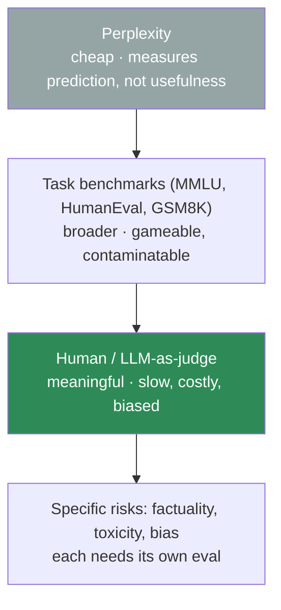
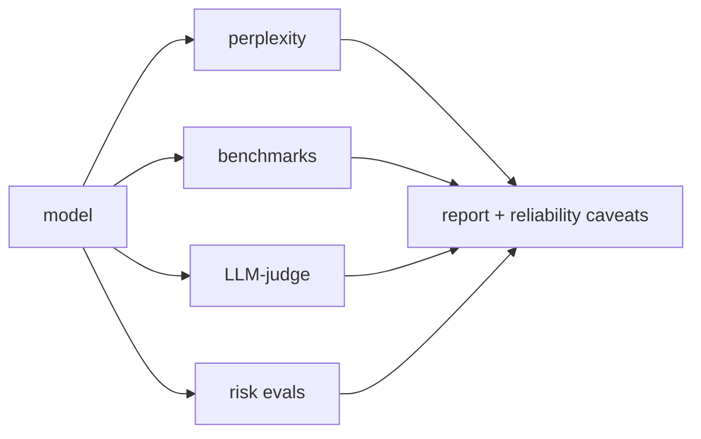

# 11.17 · LLM Evaluation — Why It's So Hard

[⬅ 11.16 Inference Optimization](11.16-inference-optimization.md) · [🏠 Module 11](../README.md) · [➡ 11.18 LLM Safety](11.18-safety.md)

> **The lesson in one line:** Perplexity measures prediction, benchmarks measure narrow skills, and neither measures whether an assistant is actually *good* — so LLM evaluation climbs a ladder from cheap automated proxies to expensive human judgment, and every rung has a flaw.

---

## 🎯 Learning objectives

- Understand the **evaluation ladder**: perplexity → task benchmarks → human/LLM-judge.
- Understand why generation quality is **intrinsically hard to measure** ([10.9](../../10-NLP/weeks/10.9-evaluation.md), amplified).
- Evaluate the specific risks: **factuality/hallucination, toxicity, bias**.
- Know the pitfalls: **benchmark contamination, gaming, and the reliability of LLM-as-judge**.

## ✅ Prerequisites

- [10.9 NLP evaluation (BLEU/ROUGE/perplexity)](../../10-NLP/weeks/10.9-evaluation.md), [10.14 harms](../../10-NLP/weeks/10.14-ethics-safety.md).
- [11.1 perplexity](11.1-what-is-a-language-model.md), [11.13 alignment](11.13-alignment.md).

---

## 🧠 Mental model

> [!IMPORTANT]
> **There is no single number that tells you an LLM is "good."** A model can have low perplexity and be unhelpful; ace benchmarks and hallucinate constantly; sound fluent and be confidently wrong. Evaluation is a **ladder of increasingly meaningful but increasingly expensive measures** — perplexity (cheap, narrow) → task benchmarks (broader, gameable) → human evaluation (meaningful, slow, subjective). The senior skill is knowing what each rung actually measures and where it lies.



---

## The evaluation ladder

### Rung 1 — Perplexity
`exp(cross-entropy)` ([11.1](11.1-what-is-a-language-model.md), [10.9](../../10-NLP/weeks/10.9-evaluation.md)) — how well the model predicts held-out text. Cheap (it's the validation loss) and the primary **pretraining** signal. But it measures **prediction, not usefulness** ([10.9](../../10-NLP/weeks/10.9-evaluation.md)): a model can predict text well yet be unhelpful, and perplexity is tokenizer-bound (incomparable across models with different tokenizers). Necessary for tracking pretraining; useless for comparing assistants.

### Rung 2 — Task benchmarks
Standardized test sets measuring specific capabilities:

| Benchmark | Measures |
|---|---|
| **MMLU** | broad knowledge (57 subjects, multiple choice) |
| **HumanEval / MBPP** | code generation (pass unit tests) |
| **GSM8K / MATH** | math reasoning |
| **HellaSwag / ARC** | commonsense reasoning |
| **TruthfulQA** | resistance to generating falsehoods |
| **MT-Bench / Chatbot Arena** | conversational/assistant quality |

Benchmarks give comparable numbers and drove rapid progress. But they measure **narrow slices** and are increasingly **gamed and contaminated**.

> [!CAUTION]
> **Benchmark contamination is rampant and invalidates scores.** If a benchmark's questions appear in the training data ([10.9](../../10-NLP/weeks/10.9-evaluation.md), [11.9](11.9-pretraining.md)) — and web-scraped corpora *contain* most public benchmarks — the model may have *memorized* the answers, inflating scores without real capability. A model can top MMLU by having seen it, not by reasoning. This is why: (1) frontier labs build **private, held-out** evals; (2) benchmark scores must be read skeptically; (3) **dedup against benchmarks** is a pretraining requirement ([11.9](11.9-pretraining.md)). High benchmark scores are necessary but far from sufficient.

### Rung 3 — Human and LLM-as-judge evaluation
The ground truth for assistant quality is **human judgment** ([10.9](../../10-NLP/weeks/10.9-evaluation.md)) — people rating or comparing responses. **Chatbot Arena** (humans vote on blind pairwise comparisons → Elo ratings) is the gold standard for real-world quality. It's meaningful but **slow, expensive, and subjective** ([10.10 IAA](../../10-NLP/weeks/10.10-nlp-data.md)).

**LLM-as-judge** — using a strong model (e.g., GPT-4) to grade responses — scales human-like evaluation cheaply and correlates reasonably with human preference. But it has biases:

> [!CAUTION]
> **LLM-as-judge is useful but biased in known ways.** It exhibits **position bias** (favors the first response shown), **verbosity bias** (prefers longer answers), **self-preference** (a model rates its own family's outputs higher), and can be **fooled by confident-but-wrong** answers. Mitigate with randomized positions, length controls, and multiple judges — but never treat an LLM judge as ground truth for high-stakes decisions. It's a fast proxy, subject to the same *"optimizing a proxy invites Goodhart"* ([10.9](../../10-NLP/weeks/10.9-evaluation.md)) as BLEU/ROUGE.

---

## Evaluating specific risks

Beyond general quality, deployment requires evaluating **specific failure modes** ([10.14](../../10-NLP/weeks/10.14-ethics-safety.md), [11.18](11.18-safety.md)):

- **Factuality / hallucination** — does it state falsehoods? ([10.14](../../10-NLP/weeks/10.14-ethics-safety.md)) Hard because it requires checking claims against ground truth. Evals: TruthfulQA, retrieval-grounded fact-checking, human verification. **Structural** ([11.1](11.1-what-is-a-language-model.md)): the model optimizes *probable*, not *true*.
- **Toxicity** — harmful/offensive output. Evals: toxicity classifiers on generations (themselves bias-audited, [10.14](../../10-NLP/weeks/10.14-ethics-safety.md)).
- **Bias** — disparate treatment across groups ([10.14](../../10-NLP/weeks/10.14-ethics-safety.md)). Evals: disaggregated performance, counterfactual/stereotype probes (BBQ, WEAT).
- **Robustness/safety** — resistance to jailbreaks and injection ([11.18](11.18-safety.md)).

> [!IMPORTANT]
> **General benchmarks say nothing about your specific risks — you must evaluate them directly.** A model that aces MMLU can still hallucinate medical facts, emit toxic content under pressure, or discriminate. Each risk needs its own targeted evaluation, ideally on *your* domain and inputs. And because these evals are proxies too, **pair automated risk evals with human review** for anything consequential ([10.9](../../10-NLP/weeks/10.9-evaluation.md), [10.14](../../10-NLP/weeks/10.14-ethics-safety.md)).

---

## Why LLM evaluation is uniquely hard

| Reason | Explanation |
|---|---|
| **Open-ended output** | many valid answers, no single reference ([10.9](../../10-NLP/weeks/10.9-evaluation.md)) |
| **General-purpose** | one model does thousands of tasks; no single test covers it |
| **Capabilities emerge** | new abilities appear at scale ([11.10](11.10-scaling-laws.md)); old benchmarks saturate |
| **Contamination** | test data leaks into training ([11.9](11.9-pretraining.md)) |
| **Subjectivity** | "helpful" and "good" are human judgments ([10.10 IAA](../../10-NLP/weeks/10.10-nlp-data.md)) |
| **Gaming** | optimizing for a benchmark ≠ real capability (Goodhart, [10.9](../../10-NLP/weeks/10.9-evaluation.md)) |

---

## 🏭 Production examples

| Goal | Evaluation |
|---|---|
| **Track pretraining** | perplexity + a benchmark suite |
| **Compare models** | MMLU/HumanEval/GSM8K + Chatbot Arena Elo |
| **Ship an assistant** | task-specific evals on *your* data + human review |
| **Regression testing** | a fixed eval set run on every model update |
| **Risk gating** | factuality/toxicity/bias evals as a deploy gate ([11.20](11.20-production-architecture.md)) |

## ⚡ Performance & GPU considerations

- **Perplexity is free** (validation loss); **benchmarks are cheap** (batch inference); **human eval is the bottleneck** — sample and stratify ([10.9](../../10-NLP/weeks/10.9-evaluation.md)).
- **LLM-as-judge costs API calls per example** — budget it; run on a sampled slice.
- **Build a fixed, versioned eval set** and run it automatically on every model/prompt change (regression testing).

## 🔒 Security considerations

> [!CAUTION]
> - **Contamination is a security-adjacent integrity issue** — inflated benchmark scores mislead deployment decisions; verify test data isn't in training ([11.9](11.9-pretraining.md)).
> - **Evaluate adversarial robustness, not just average behavior** — a model safe on typical inputs may fail under jailbreaks/injection ([11.18](11.18-safety.md)); red-team it.
> - **Human eval exposes raters to real (possibly harmful) content** ([10.10](../../10-NLP/weeks/10.10-nlp-data.md)) — care for annotator wellbeing.
> - **Don't publish held-out evals** — once public, they contaminate future training.

## 🚫 Common mistakes

| Mistake | Consequence |
|---|---|
| **Using perplexity to compare assistants** | measures prediction, not usefulness; tokenizer-bound |
| **Trusting benchmark scores at face value** | contamination/gaming inflate them |
| **Treating LLM-as-judge as ground truth** | position/verbosity/self-preference bias |
| **Skipping risk-specific evals** | ship a model that hallucinates/toxic/biased on your domain |
| **No regression eval set** | silent quality drops on model/prompt updates |
| **One metric for a general model** | no single number captures capability |

## ✅ Best practices

- **Climb the ladder deliberately** — perplexity for pretraining, benchmarks for capability, human/LLM-judge for quality.
- **Guard against contamination** — dedup against benchmarks; keep private held-out evals.
- **Evaluate your specific risks** (factuality, toxicity, bias) on *your* data, with human review.
- **Debias LLM-as-judge** (randomize position, control length, multiple judges) and treat it as a proxy.
- **Maintain a fixed, versioned eval set** for regression testing on every change.
- **Red-team for adversarial robustness**, not just average-case quality.

## 🏋️ Exercises

1. **Perplexity's limits.** Show two models where the lower-perplexity one is *less* helpful on a task — demonstrating perplexity ≠ usefulness.
2. **Contamination check.** Take a public benchmark and search a training corpus for its questions. Report overlap and estimate the score inflation ([11.9](11.9-pretraining.md)).
3. **LLM-as-judge bias.** Run an LLM judge on response pairs, swapping their order. Measure position bias (how often it favors position 1). Then test verbosity bias.
4. **Risk eval.** Build a small factuality eval (claim → verify) and a toxicity eval for a model. Report rates. Compare to its MMLU score — do they correlate?
5. **Arena in miniature.** Do blind pairwise human comparisons of two models on 30 prompts; compute a win-rate/Elo. Compare to an LLM-judge on the same pairs.

## 🛠️ Mini project — "An LLM Evaluation Harness"

**Goal:** a harness that climbs the whole ladder and flags where each metric is unreliable — the [10.9 harness](../../10-NLP/weeks/10.9-evaluation.md) extended to LLMs.

**Requirements**
- **Perplexity** on held-out text; a **benchmark runner** (MMLU-style MC + HumanEval-style code); an **LLM-as-judge** pairwise comparator (debiased); **risk evals** (factuality, toxicity, bias).
- A **contamination checker** (benchmark ∩ training).
- A **regression mode**: fixed eval set, run on any model/prompt version, diff results.

**Folder structure**
```
llm-eval-harness/
├── perplexity.py
├── benchmarks.py      # MC + code (pass@k)
├── judge.py           # LLM-as-judge, position/length debiasing
├── risks.py           # factuality, toxicity, bias
├── contamination.py   # benchmark vs training overlap
├── regression.py      # fixed set, versioned diffs
└── README.md
```

**Architecture diagram**


**Testing:** judge debiasing reduces position bias; contamination checker catches planted overlap; regression detects an injected quality drop.
**Evaluation:** the harness's report is the deliverable; validate against published scores on a known model.
**Future improvements:** add adversarial/jailbreak robustness ([11.18](11.18-safety.md)); add an Arena-style Elo from pairwise comparisons.

## 📄 Cheat sheet

| Rung | Measures | Flaw |
|---|---|---|
| **Perplexity** | prediction | ≠ usefulness; tokenizer-bound |
| **Benchmarks (MMLU, HumanEval, GSM8K)** | narrow skills | **contamination**, gaming |
| **Human eval / Arena** | real quality | slow, costly, subjective |
| **LLM-as-judge** | scalable proxy for human | **position/verbosity/self-preference bias** |
| **Risk evals (factuality/toxicity/bias)** | specific harms | proxies; need human review |

**⭐ No single number = "good."** Climb the ladder; guard against contamination; evaluate *your* risks on *your* data.

## 🎴 Flashcards

- **⭐ Why can't one number tell you an LLM is good?** → A model can have low perplexity and be unhelpful, ace benchmarks and hallucinate, sound fluent and be wrong — capability is multi-dimensional.
- **What is the evaluation ladder?** → Perplexity (cheap, narrow) → task benchmarks (broader, gameable) → human/LLM-judge (meaningful, expensive).
- **What does perplexity measure, and not measure?** → Prediction quality on held-out text; not usefulness, and it's tokenizer-bound.
- **⭐ What is benchmark contamination?** → Test questions appearing in training data → memorized answers inflate scores without real capability.
- **⭐ What biases does LLM-as-judge have?** → Position (favors first), verbosity (prefers longer), self-preference, and being fooled by confident-but-wrong answers.
- **Why must you evaluate risks separately?** → General benchmarks say nothing about factuality/toxicity/bias on your domain — each needs targeted evaluation.
- **What's the gold standard for assistant quality?** → Human preference (e.g., Chatbot Arena Elo from blind pairwise votes).

## 💬 Interview questions

1. Why is evaluating LLMs so much harder than classification models?
2. Walk through the evaluation ladder. What does each rung measure and miss?
3. What is benchmark contamination, and how does it corrupt reported scores?
4. What are the biases of LLM-as-judge, and how do you mitigate them?
5. How would you evaluate a model for hallucination, toxicity, and bias?
6. Why is perplexity insufficient for comparing chat assistants?

## 📝 Summary

- **No single metric captures LLM quality** — evaluation is a **ladder**: perplexity (prediction, cheap) → benchmarks (narrow skills, gameable) → human/LLM-judge (real quality, expensive).
- **Perplexity ≠ usefulness**; **benchmarks suffer contamination and gaming** (a model can memorize the test); **human eval is the ground truth** but slow and subjective.
- **LLM-as-judge** scales evaluation but has **position, verbosity, and self-preference biases** — a useful proxy, not ground truth.
- **Specific risks (factuality, toxicity, bias) need their own targeted evals** on your data, paired with human review — general benchmarks don't cover them.
- Guard against **contamination**, maintain a **regression eval set**, and **red-team for adversarial robustness** — because the model that looks good on average may fail exactly where it matters ([11.18](11.18-safety.md)).

## 📚 References

1. **Hendrycks et al. (2021) — _MMLU_**, **Chen et al. (2021) — _HumanEval_**, **Cobbe et al. (2021) — _GSM8K_.** ⭐ Core benchmarks.
2. **Zheng et al. (2023) — _Judging LLM-as-a-Judge (MT-Bench, Chatbot Arena)_.** ⭐⭐ LLM-judge biases + human Elo.
3. **Lin et al. (2022) — _TruthfulQA_** & **Parrish et al. (2022) — _BBQ_ (bias).** Risk-specific evals.
4. **Zhou et al. (2023) / various — _Benchmark contamination_ studies.** ⭐ Why scores mislead.
5. **[10.9 NLP Evaluation](../../10-NLP/weeks/10.9-evaluation.md) & [10.14 Ethics](../../10-NLP/weeks/10.14-ethics-safety.md).** Foundations.

---

## 🧭 Navigation

| Direction | Link |
|---|---|
| ⬅ Previous | [11.16 · Inference Optimization](11.16-inference-optimization.md) |
| ➡ Next | [11.18 · LLM Safety](11.18-safety.md) |
| 🏠 Module | [Module 11](../README.md) |
| 📖 Lessons | [Lesson index](README.md) |
