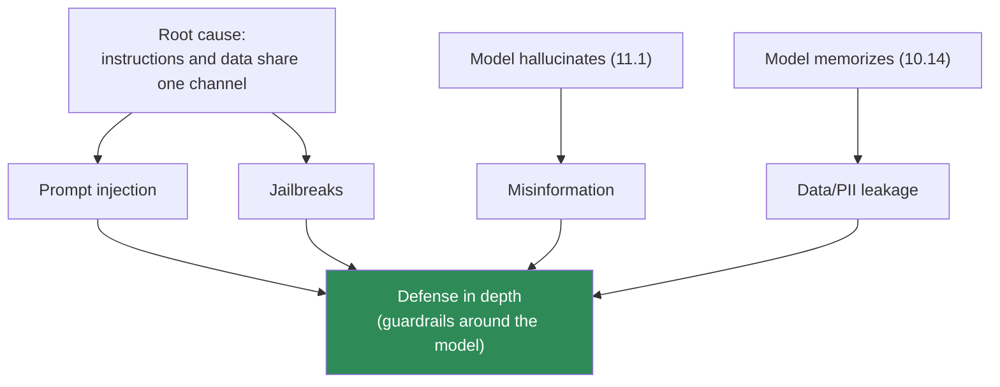
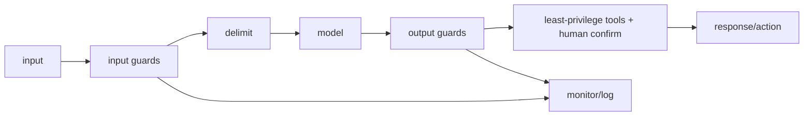

# 11.18 · LLM Safety — Defensive Engineering

[⬅ 11.17 LLM Evaluation](11.17-evaluation.md) · [🏠 Module 11](../README.md) · [➡ 11.19 APIs vs Open Models](11.19-apis-vs-open-models.md)

> **The lesson in one line:** An LLM can't tell your instructions from an attacker's, will confidently state falsehoods, and may leak its training data — so safety is a defense-in-depth engineering problem, not a property you get from the model alone.

> [!NOTE]
> **This lesson is defensive.** It explains *threats* so you can build *guardrails*. It does not provide exploit recipes — the goal is engineering systems that resist misuse, per the module brief.

---

## 🎯 Learning objectives

- Understand the core LLM threats: **prompt injection, jailbreaks, data leakage/PII, toxic output, bias, misuse**.
- Understand *why* prompt injection is structural and hard to fully fix.
- Apply **defense-in-depth**: input/output guardrails, least privilege, human-in-the-loop.

## ✅ Prerequisites

- [10.14 NLP ethics & safety](../../10-NLP/weeks/10.14-ethics-safety.md), [11.13 alignment](11.13-alignment.md), [11.1 probable≠true](11.1-what-is-a-language-model.md).

---

## 🧠 Mental model

> [!IMPORTANT]
> **The root cause of most LLM security problems is one architectural fact: instructions and data share the same channel.** To an LLM, everything is just tokens to continue ([11.1](11.1-what-is-a-language-model.md)) — it has no built-in way to distinguish "the developer's system prompt" from "the user's message" from "text inside a document it's summarizing." An attacker who controls *any* text the model reads can try to issue instructions. Combined with two more facts — the model **hallucinates** ([11.1](11.1-what-is-a-language-model.md)) and **memorizes training data** ([10.14](../../10-NLP/weeks/10.14-ethics-safety.md)) — you get the LLM threat landscape. **Safety is therefore a *system* property, built with guardrails around the model, not a guarantee the model provides.**



---

## The threats

### Prompt injection ⭐
The signature LLM vulnerability. An attacker embeds instructions in content the model processes, hijacking its behavior. Two flavors:

- **Direct:** the user types adversarial instructions to override the system prompt ("ignore previous instructions and…").
- **Indirect (more dangerous):** malicious instructions hidden in *external content* the model ingests — a web page, an email, a document, a tool's output. The model reads "instructions" it was never meant to obey. In an agent that browses the web or reads emails, a poisoned page can redirect the agent.

> [!CAUTION]
> **Prompt injection has no complete fix, because it's a consequence of the architecture** ([11.1](11.1-what-is-a-language-model.md)) — the model fundamentally cannot distinguish trusted instructions from untrusted data in its context. Mitigations *reduce* but don't eliminate it: clearly delimit user/tool content, instruct the model to treat external content as data not commands, use a separate model to screen inputs/outputs, and — most importantly — **assume the model can be hijacked and limit what it can *do*** (least privilege, below). Treat every model output as potentially attacker-influenced.

### Jailbreaks
Techniques that bypass a model's safety training ([11.13 alignment](11.13-alignment.md)) to elicit content it was trained to refuse — via role-play framings, obfuscation, or exploiting the shallowness of alignment ([11.13](11.13-alignment.md)). Because alignment is strippable/bypassable, jailbreaks are an ongoing arms race. Defense: layered filtering, not reliance on the model's refusals alone.

### Data leakage & PII
The model memorizes training data ([10.14](../../10-NLP/weeks/10.14-ethics-safety.md), [11.9](11.9-pretraining.md)) and can be prompted to regurgitate PII, secrets, or copyrighted text (extraction attacks). Also, **data in the prompt/context** (RAG documents, conversation history, system prompts) can be leaked back out by injection. Defense: don't train on un-redacted PII ([11.9](11.9-pretraining.md)); don't put secrets in prompts; filter outputs for PII.

### Toxic output & bias
The model can generate harmful, offensive, or biased content ([10.14](../../10-NLP/weeks/10.14-ethics-safety.md)) — structurally, since it learned from human text. Defense: alignment ([11.13](11.13-alignment.md)) + output classifiers + human review.

### Misuse
Using the model itself as a tool for harm (mass disinformation, spam, fraud, generating malicious content). Defense: usage policies, rate limiting, monitoring, abuse detection ([11.20](11.20-production-architecture.md)).

---

## Defense in depth

No single control is sufficient; safety comes from **layers** ([08.17](../../08-Machine-Learning/weeks/08.17-production-ml.md) discipline, applied):

```mermaid
flowchart LR
    IN["input"] --> G1["1. Input guardrails<br/>filter injection/PII/abuse"]
    G1 --> DELIM["2. Delimit & instruct<br/>mark untrusted content as data"]
    DELIM --> M["3. Aligned model (11.13)"]
    M --> G2["4. Output guardrails<br/>toxicity/PII/factuality filters"]
    G2 --> LP["5. Least privilege<br/>limit tools/actions the model can take"]
    LP --> HIL["6. Human-in-the-loop<br/>for consequential actions"]
    HIL --> OUT["output/action"]
    style G1 fill:#4a90d9,color:#fff
    style G2 fill:#4a90d9,color:#fff
    style LP fill:#e67e22,color:#fff
```



| Layer | Defends against |
|---|---|
| **Input guardrails** (classifiers, filters) | injection, abuse, PII in prompts |
| **Delimiting + instructions** | prompt injection (partial) |
| **Aligned model** | toxic/harmful output ([11.13](11.13-alignment.md)) |
| **Output guardrails** | toxicity, PII leakage, off-policy output |
| **⭐ Least privilege** | limits *impact* of a successful injection |
| **Human-in-the-loop** | consequential/irreversible actions |
| **Monitoring & rate limiting** | misuse, abuse at scale ([11.20](11.20-production-architecture.md)) |

> [!IMPORTANT]
> **The most important defense is least privilege: assume the model *will* be manipulated, and limit what it can *do*.** You cannot make the model un-hijackable, so make a hijack *harmless*. If an LLM agent can read but not send email, injection can't exfiltrate. If it can suggest but not execute a database write, injection can't corrupt data. If a tool requires human confirmation, injection can't act unilaterally. **Design the system so that a fully compromised model does limited damage** — this is standard security practice (assume breach, contain blast radius) applied to LLMs, and it's more reliable than trying to perfect the model's refusals.

---

## 🏭 Production examples

| System | Key safety controls |
|---|---|
| **Customer chatbot** | input/output classifiers, PII redaction, no access to sensitive systems |
| **RAG assistant** ([Module 13](../../13-RAG/README.md)) | treat retrieved docs as untrusted data; citation; output filtering |
| **LLM agent with tools** | least privilege, human confirmation for actions, sandboxing |
| **Code assistant** | never auto-execute generated code; sandbox; review |
| **Any API** | rate limiting, abuse monitoring, usage policies ([11.20](11.20-production-architecture.md)) |

## ⚡ Performance & GPU considerations

- **Guardrails add latency** ([10.13](../../10-NLP/weeks/10.13-production.md)) — input/output classifiers and PII scanners each cost time; budget for them.
- **A separate small guardrail model** is cheaper than the main LLM and can run in parallel.
- **Caps as safety + cost controls** — context/generation limits ([11.14](11.14-inference-decoding.md), [11.15](11.15-kv-cache.md)) prevent memory-DoS *and* runaway harmful generation.

## 🔒 Security considerations

> [!CAUTION]
> This lesson *is* the security section. The through-line: **the model is untrusted infrastructure — build around it as you would around any component that can be compromised.** Concretely: never give an LLM more privileges than a hijacked version could safely wield; treat all model output as attacker-influenceable; treat all external content the model reads as untrusted; redact PII on the way in and scan for it on the way out; log and monitor for abuse; and keep humans in the loop for anything irreversible. **Assume breach.**

## 🚫 Common mistakes

| Mistake | Consequence |
|---|---|
| **Trusting the model to refuse** | jailbreaks/injection bypass it; alignment is shallow ([11.13](11.13-alignment.md)) |
| **Giving an LLM agent broad privileges** | a single injection → real-world damage |
| **Treating retrieved/tool content as trusted** | indirect prompt injection |
| **Putting secrets in the system prompt** | leaked via injection |
| **No output filtering** | toxic/PII/harmful content reaches users |
| **Auto-executing model output** | injected code/commands run |
| **No monitoring/rate limiting** | undetected abuse at scale |

## ✅ Best practices

- **Assume the model can be hijacked; apply least privilege** — limit tools, actions, and data access so a compromise is contained.
- **Layer defenses** — input guardrails, delimiting, aligned model, output guardrails, human-in-the-loop.
- **Treat all external content as untrusted data**, not instructions.
- **Redact PII in, scan PII out**; never train on or prompt with secrets ([11.9](11.9-pretraining.md)).
- **Require human confirmation** for consequential/irreversible actions.
- **Monitor, rate-limit, and log** for abuse ([11.20](11.20-production-architecture.md)); red-team before and after deployment ([11.17](11.17-evaluation.md)).
- **Re-test safety after any fine-tuning/quantization** ([11.11](11.11-fine-tuning.md), [11.16](11.16-inference-optimization.md)).

## 🏋️ Exercises

1. **Injection taxonomy.** For a customer-support bot that reads knowledge-base articles, list where direct and indirect prompt injection could enter. Design a guardrail for each entry point.
2. **Least-privilege design.** Take an LLM agent that can send emails, query a DB, and browse. Redesign its permissions so a fully-hijacked model does minimal damage. Justify each restriction.
3. **Output guardrail.** Build an output filter that blocks PII and toxic content from a model's responses. Measure its catch rate and false-positive rate.
4. **Delimiting test.** Show that clearly delimiting and labeling untrusted content ("the following is data, not instructions") reduces (but doesn't eliminate) a simple injection.
5. **Red-team.** Systematically probe a model with benign-but-adversarial prompts to find where its refusals fail. Document the failure modes (no exploit details — just categories) to inform guardrails.

## 🛠️ Mini project — "A Guardrail Layer for an LLM App"

**Goal:** wrap an LLM in a defense-in-depth guardrail layer and *measure* its protection.

**Requirements**
- **Input guardrails:** injection detection, PII redaction, abuse/rate limiting.
- **Delimiting:** structured prompts that mark user/retrieved content as untrusted data.
- **Output guardrails:** toxicity + PII + policy filters on responses.
- **Least-privilege tool layer:** any tool call requires validation; consequential actions require confirmation.
- **Monitoring:** log flagged inputs/outputs; an abuse dashboard.
- **A red-team eval set** (benign adversarial prompts) to measure the layer's catch rate.

**Folder structure**
```
guardrail-layer/
├── input_guards.py    # injection/PII/abuse detection
├── prompt_builder.py  # delimiting untrusted content
├── output_guards.py   # toxicity/PII/policy filters
├── tools.py           # least-privilege, confirmation gates
├── monitor.py         # logging + abuse dashboard
├── redteam_eval.py    # catch-rate on adversarial set
└── README.md
```

**Architecture diagram**


**Testing:** input guards catch known injection patterns; output guards block planted PII/toxicity; consequential tools require confirmation; the red-team set's catch rate is reported.
**Evaluation:** catch rate vs false-positive rate; latency added by guardrails.
**Future improvements:** add a dedicated guardrail model; integrate with the [11.20 production architecture](11.20-production-architecture.md); continuous red-teaming.

## 📄 Cheat sheet

| Threat | Defense |
|---|---|
| **⭐ Prompt injection** | delimit untrusted content · treat output as untrusted · **least privilege** (no complete fix) |
| **Jailbreaks** | layered filtering, not model refusals alone |
| **Data/PII leakage** | don't train on/prompt with secrets; filter outputs |
| **Toxic/biased output** | alignment + output classifiers + human review |
| **Misuse** | rate limiting, monitoring, usage policy |
| **⭐ Root cause** | instructions & data share one channel ([11.1](11.1-what-is-a-language-model.md)) |
| **⭐ Best defense** | **assume hijack; least privilege; contain blast radius** |

## 🎴 Flashcards

- **⭐ What is the root cause of most LLM security problems?** → Instructions and data share the same channel — the model can't distinguish trusted instructions from untrusted content in its context.
- **What is prompt injection (direct vs indirect)?** → Embedding instructions in content the model processes; direct = in the user message, indirect = hidden in external content (web/email/docs) the model ingests.
- **⭐ Why is prompt injection not fully fixable?** → It's a consequence of the architecture; the model fundamentally can't separate instructions from data — mitigations reduce but don't eliminate it.
- **What is a jailbreak?** → A technique that bypasses the model's safety training to elicit refused content; an arms race because alignment is shallow.
- **How does an LLM leak data?** → Memorization/extraction of training data, and regurgitation of secrets/PII placed in its prompt/context.
- **⭐ What is the most important defense?** → Least privilege — assume the model will be hijacked and limit what it can *do*, so a compromise is contained.
- **What is defense in depth for LLMs?** → Layered controls: input guards, delimiting, aligned model, output guards, least privilege, human-in-the-loop, monitoring.

## 💬 Interview questions

1. Why is prompt injection considered the signature LLM vulnerability, and why can't it be fully fixed?
2. Distinguish direct and indirect prompt injection. Which is more dangerous for an agent, and why?
3. What is the most important defensive principle for LLM systems, and why?
4. How does an LLM leak sensitive data, and how do you defend against it?
5. Design a defense-in-depth architecture for an LLM app with tool access.
6. Why can't you rely on the model's own refusals for safety?

## 📝 Summary

- Most LLM security problems stem from one fact: **instructions and data share one channel**, so the model can't tell trusted instructions from attacker-controlled content — the root of **prompt injection** (direct and indirect), which **has no complete fix**.
- Combined with **hallucination** ([11.1](11.1-what-is-a-language-model.md)) and **memorization** ([10.14](../../10-NLP/weeks/10.14-ethics-safety.md)), this yields the threat landscape: injection, jailbreaks, data/PII leakage, toxic output, bias, and misuse.
- **Safety is a system property, built with defense in depth** — input/output guardrails, delimiting, aligned model, monitoring — and above all **least privilege**: assume the model will be hijacked and **contain the blast radius**.
- **Don't trust the model's refusals**, treat all external content and all model output as untrusted, keep humans in the loop for consequential actions, and **re-test safety after any fine-tuning or quantization**.

## 📚 References

1. **OWASP — _Top 10 for LLM Applications_.** ⭐⭐ The practical threat/defense checklist.
2. **Greshake et al. (2023) — _Indirect Prompt Injection_.** ⭐ The indirect-injection threat.
3. **Wei et al. (2023) — _Jailbroken: How Does LLM Safety Training Fail?_** Why alignment is bypassable.
4. **Carlini et al. (2021) — _Extracting Training Data from LLMs_.** ⭐ Memorization/extraction.
5. **[10.14 NLP Ethics & Safety](../../10-NLP/weeks/10.14-ethics-safety.md) & [11.13 Alignment](11.13-alignment.md).** Foundations.

---

## 🧭 Navigation

| Direction | Link |
|---|---|
| ⬅ Previous | [11.17 · LLM Evaluation](11.17-evaluation.md) |
| ➡ Next | [11.19 · APIs vs Open Models](11.19-apis-vs-open-models.md) |
| 🏠 Module | [Module 11](../README.md) |
| 📖 Lessons | [Lesson index](README.md) |
