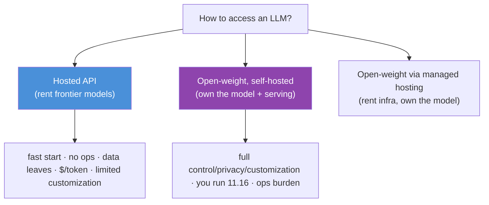
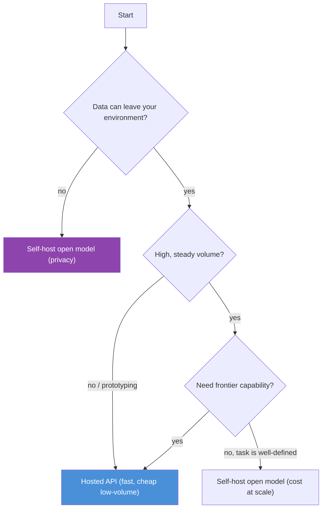
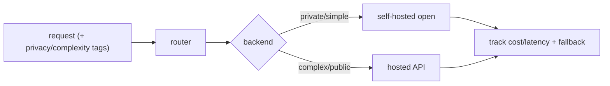

# 11.19 · LLM APIs and Open Models — Hosted, Open-Weight, or Self-Hosted

[⬅ 11.18 LLM Safety](11.18-safety.md) · [🏠 Module 11](../README.md) · [➡ 11.20 Production LLM Architecture](11.20-production-architecture.md)

> **The lesson in one line:** You can call a hosted API, download open weights, or self-host — and the choice is a trade-off across capability, cost, latency, privacy, customization, and operational burden, not a question of which model is "best."

---

## 🎯 Learning objectives

- Distinguish **hosted APIs, open-weight models, and self-hosted deployments**.
- Weigh the trade-offs: **capability, cost, latency, privacy, customization, infrastructure**.
- Choose the right option for a given use case — and know when to mix them.

## ✅ Prerequisites

- [11.16 inference optimization](11.16-inference-optimization.md), [11.12 fine-tuning options](11.12-peft-lora.md), [11.18 safety](11.18-safety.md).

---

## 🧠 Mental model

> [!IMPORTANT]
> **The choice is "rent vs own," and it's a business/engineering trade-off, not a capability contest.** A **hosted API** (OpenAI, Anthropic, Google) is renting the best models with zero infrastructure — fast to start, pay-per-token, but you send your data out and can't deeply customize. **Open-weight models** (Llama, Mistral, Qwen) you download and run yourself — full control, privacy, and customization, but you own the serving stack ([11.16](11.16-inference-optimization.md)) and the ops burden. **Self-hosting** is running open weights on your own infrastructure. The right answer depends on your constraints — privacy, cost at scale, latency, and how much you need to customize.



---

## The three options

### Hosted APIs
Call a provider's endpoint; they run the model. **Best capability with zero infrastructure.**

- ✅ Access to frontier models; no GPUs to manage; scales automatically; fastest to prototype.
- ❌ **Your data leaves your environment** (privacy/compliance); **pay per token** (expensive at scale); **rate limits**; limited customization (only prompting + maybe hosted fine-tuning); **vendor lock-in** and model-deprecation risk.

### Open-weight models, self-hosted
Download weights (Llama, Mistral, Qwen, etc.); run on your own hardware/cloud.

- ✅ **Data never leaves**; full customization (fine-tune, [LoRA](11.12-peft-lora.md), quantize, [11.16](11.16-inference-optimization.md)); predictable cost at scale; no per-token fees; no vendor lock-in.
- ❌ **You own the serving stack** ([11.16](11.16-inference-optimization.md)) and ops (GPUs, scaling, monitoring, [11.20](11.20-production-architecture.md)); frontier open models still often trail the best closed ones; large upfront/fixed infrastructure cost.

### Managed open-model hosting
A middle path: providers (Together, Fireworks, Bedrock, etc.) host *open* models for you — you get open-weight models via an API, renting the infrastructure but keeping model choice/portability.

---

## The trade-off dimensions

| Dimension | Hosted API | Self-hosted open |
|---|---|---|
| **Capability** | best (frontier) | strong, often slightly behind |
| **Time to start** | minutes | days–weeks (infra) |
| **⭐ Cost** | $/token — cheap low-volume, **expensive at scale** | fixed infra — **cheaper at high volume** |
| **Latency** | network + provider queue | **you control it** (co-locate, optimize) |
| **⭐ Privacy** | data leaves your environment | **data stays in** |
| **Customization** | prompting + limited fine-tune | full (fine-tune, LoRA, quantize) |
| **Ops burden** | none | **significant** (GPUs, scaling, monitoring) |
| **Lock-in** | vendor + deprecation risk | portable weights |

> [!IMPORTANT]
> **The two decisive factors are usually privacy and cost-at-scale.** If your data can't leave your environment (healthcare, finance, regulated industries), self-hosting an open model may be *mandatory* regardless of other factors. And the **cost curves cross**: hosted APIs are far cheaper for low/spiky volume (no idle GPUs), but at high, steady volume, a self-hosted model amortizes fixed infrastructure and wins decisively on cost per token. **Prototype on an API; consider self-hosting when volume is high, latency is critical, or data can't leave.** Many production systems use both — API for frontier reasoning, self-hosted small models for high-volume simple tasks ([11.7](11.7-encoder-decoder-types.md)).

---

## Choosing



> [!TIP]
> **Right-size the model to the task, then pick the deployment** ([11.7](11.7-encoder-decoder-types.md)). Don't call a frontier API to classify sentiment — a fine-tuned small open model self-hosted is cheaper, faster, and private. Reserve frontier APIs for tasks that genuinely need frontier reasoning. The **cascade pattern** — a cheap small model handles easy cases, escalating hard ones to a frontier model — captures most of the cost savings with most of the capability ([11.20](11.20-production-architecture.md)).

---

## 🏭 Production examples

| Scenario | Choice |
|---|---|
| **Prototype / MVP** | hosted API (fastest) |
| **Regulated data (health/finance)** | self-hosted open model (privacy) |
| **High-volume classification** | fine-tuned small open model, self-hosted |
| **Complex reasoning, low volume** | hosted frontier API |
| **Cost-sensitive at scale** | self-hosted open (or cascade) |
| **Best of both** | cascade: small self-hosted → escalate to API |

## ⚡ Performance & GPU considerations

- **Self-hosting = you own [11.16](11.16-inference-optimization.md)** — quantization, batching, KV cache, autoscaling — and the GPU capacity planning ([11.15](11.15-kv-cache.md)).
- **Hosted APIs abstract all of that** but add network latency and are subject to provider rate limits/outages.
- **Cost modeling is essential** — compute the break-even volume where self-hosting beats per-token API pricing (includes idle-GPU cost, ops headcount).
- **Latency control** favors self-hosting for real-time UX (co-locate, tune, no provider queue).

## 🔒 Security considerations

> [!CAUTION]
> - **Hosted APIs mean your prompts (and any data in them) leave your environment** — a compliance and confidentiality decision ([10.14](../../10-NLP/weeks/10.14-ethics-safety.md)); check data-processing/retention terms, and never send data you're not permitted to.
> - **Self-hosting keeps data in but makes *you* responsible for security** — model provenance ([09.16 RCE](../../09-Deep-Learning/weeks/09.16-saving-loading.md)), guardrails ([11.18](11.18-safety.md)), and infrastructure hardening are now your job.
> - **Open weights can be fine-tuned to remove safety** ([11.11](11.11-fine-tuning.md)) — a self-hosted model has whatever guardrails *you* add; hosted APIs enforce provider guardrails.
> - **Vendor lock-in is an availability risk** — model deprecation or a provider outage can break your product; abstract the provider behind an interface.

## 🚫 Common mistakes

| Mistake | Consequence |
|---|---|
| **Sending regulated data to a hosted API** | compliance violation |
| **Self-hosting for a prototype** | weeks of ops for something an API does in minutes |
| **Frontier API for a trivial task** | 10–100× the cost of a small model |
| **Ignoring the cost crossover** | overpaying (API at scale) or over-building (self-host at low volume) |
| **No provider abstraction** | lock-in; a deprecation breaks you |
| **Assuming self-hosted = automatically safe** | you own the guardrails now |

## ✅ Best practices

- **Prototype on a hosted API; revisit deployment** as volume, latency, and privacy needs clarify.
- **Right-size the model to the task**; use a **cascade** (small→frontier) to balance cost and capability.
- **Self-host when data can't leave, volume is high/steady, or latency is critical.**
- **Model the cost crossover** explicitly (per-token API vs fixed infra + ops).
- **Abstract the provider** behind an interface to avoid lock-in and enable A/B and fallback.
- **Own the guardrails** ([11.18](11.18-safety.md)) regardless of deployment; verify provider data terms for APIs.

## 🏋️ Exercises

1. **Cost crossover.** For a workload of X requests/day at Y tokens each, model the monthly cost of a hosted API vs a self-hosted open model (GPU rental + ops). Find the break-even volume.
2. **Right-sizing.** For three tasks (sentiment, summarization, complex reasoning), pick API vs self-hosted open and justify by capability, cost, and privacy.
3. **Cascade.** Design a cascade that routes easy queries to a small self-hosted model and hard ones to a frontier API. Estimate the cost savings vs API-only.
4. **Privacy decision.** For a healthcare use case, argue why self-hosting may be mandatory. What would you need to send to an API, and why can't you?
5. **Provider abstraction.** Write a thin interface that lets you swap between two providers (or API↔self-hosted) with one config change. Show a fallback path.

## 🛠️ Mini project — "A Model-Routing Layer"

**Goal:** a provider-agnostic layer that routes each request to the right model/deployment by cost, capability, and privacy — the practical embodiment of this lesson.

**Requirements**
- A **unified interface** over ≥2 backends (a hosted API + a self-hosted open model).
- A **router**: rules (privacy tag → self-hosted; complexity → frontier) + a cascade (small→large).
- **Cost/latency tracking** per backend; a **fallback** on provider failure.
- A **cost report** comparing API-only, self-hosted-only, and the routed/cascade approach on a sample workload.

**Folder structure**
```
model-router/
├── backends.py        # unified interface: api | self_hosted
├── router.py          # privacy/complexity rules + cascade
├── fallback.py        # provider failure handling
├── costing.py         # per-backend cost/latency, workload comparison
└── README.md
```

**Architecture diagram**


**Testing:** private-tagged requests never hit the API; cascade escalates only hard cases; fallback triggers on simulated provider failure.
**Evaluation:** the cost/latency comparison across strategies is the deliverable.
**Future improvements:** add quality-based routing (escalate on low-confidence); integrate the [11.18 guardrails](11.18-safety.md) and [11.20 production architecture](11.20-production-architecture.md).

## 📄 Cheat sheet

| Option | Pros | Cons |
|---|---|---|
| **Hosted API** | best capability, zero ops, fast start | data leaves, $/token at scale, lock-in, limited customization |
| **Self-hosted open** | privacy, full customization, cheap at scale | you own serving+ops, often behind frontier |
| **Managed open hosting** | open models via API, less ops | still data-out; middle ground |
| **⭐ Deciders** | **privacy** & **cost-at-scale** | prototype on API; self-host for privacy/volume/latency |
| **⭐ Cascade** | small→frontier | most savings, most capability |

## 🎴 Flashcards

- **What are the three ways to access an LLM?** → Hosted API (rent), open-weight self-hosted (own), and managed open-model hosting (rent infra, own model choice).
- **⭐ What are the two decisive factors in the choice?** → Privacy (can data leave?) and cost-at-scale (the API vs self-host cost curves cross at high volume).
- **When is a hosted API best?** → Prototyping, low/spiky volume, and tasks needing frontier capability with no strict data-residency requirement.
- **When must you self-host?** → When data can't leave your environment (regulated industries) or when high steady volume/latency makes it cheaper/faster.
- **⭐ What is the cascade pattern?** → Route easy queries to a cheap small model, escalate hard ones to a frontier model — most of the savings with most of the capability.
- **Why abstract the provider?** → To avoid lock-in and enable fallback/A-B when a model is deprecated or a provider fails.
- **Does self-hosting make you safe automatically?** → No — you now own the guardrails, provenance, and infrastructure security.

## 💬 Interview questions

1. Compare hosted APIs, open-weight self-hosting, and managed hosting across the key trade-off dimensions.
2. What are the two most decisive factors in choosing, and why?
3. When do the cost curves of API vs self-hosting cross, and how do you model it?
4. What is a model cascade, and why is it cost-effective?
5. What are the security implications of each deployment option?
6. Why should you abstract the LLM provider behind an interface?

## 📝 Summary

- Accessing an LLM is **rent (hosted API) vs own (open-weight, self-hosted)**, with **managed open hosting** as a middle path — a business/engineering trade-off, not a capability contest.
- Weigh **capability, cost, latency, privacy, customization, and ops burden**; the **two decisive factors are usually privacy and cost-at-scale** (the cost curves cross at high volume).
- **Prototype on an API; self-host when data can't leave, volume is high/steady, or latency is critical** — and **right-size the model to the task**, using a **cascade** to balance cost and capability.
- **Abstract the provider** to avoid lock-in, and remember you **own the guardrails** ([11.18](11.18-safety.md)) either way — self-hosting doesn't grant safety, it transfers responsibility.

## 📚 References

1. **Provider docs — _OpenAI / Anthropic / Google API pricing & data policies_.** ⭐ Read the data-retention terms.
2. **Meta — _Llama_, Mistral, Qwen model cards & licenses.** ⭐ Open-weight options and their licenses.
3. **vLLM / TGI / Ollama documentation.** Self-hosting stacks ([11.16](11.16-inference-optimization.md)).
4. **Chen et al. (2023) — _FrugalGPT_.** ⭐ Cascades and cost-optimal LLM use.
5. **[11.16 Inference Optimization](11.16-inference-optimization.md).** What self-hosting requires you to own.

---

## 🧭 Navigation

| Direction | Link |
|---|---|
| ⬅ Previous | [11.18 · LLM Safety](11.18-safety.md) |
| ➡ Next | [11.20 · Production LLM Architecture](11.20-production-architecture.md) |
| 🏠 Module | [Module 11](../README.md) |
| 📖 Lessons | [Lesson index](README.md) |
