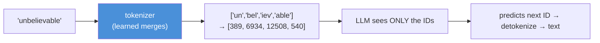
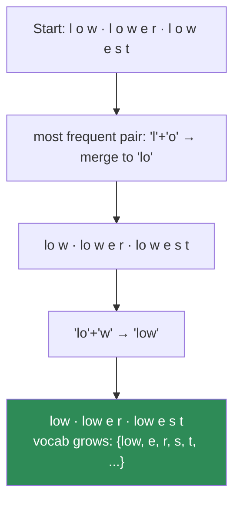
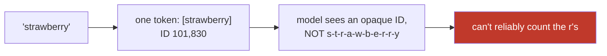
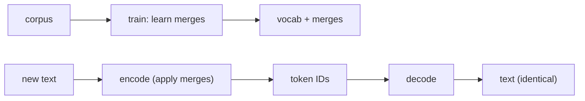

# 11.2 · Tokenization — The Atom of an LLM

[⬅ 11.1 What Is a Language Model?](11.1-what-is-a-language-model.md) · [🏠 Module 11](../README.md) · [➡ 11.3 Embeddings & Positional Encoding](11.3-embeddings-positional.md)

> **The lesson in one line:** Before an LLM can predict the next *token*, you have to decide what a token *is* — and the answer, subword tokenization via BPE, quietly shapes context length, cost, multilingual fairness, and why models can't spell.

---

## 🎯 Learning objectives

- Understand the granularity choices — **characters, words, subwords** — and why subwords won.
- Understand and implement **Byte-Pair Encoding (BPE)** from scratch; know **WordPiece, SentencePiece, and Unigram** conceptually.
- Reason about **vocabulary, special tokens, token IDs, context length, and token efficiency**.
- Explain the practical consequences: **cost per token, context limits, the "why can't GPT count letters" phenomenon, and multilingual inequity.**

## ✅ Prerequisites

- [10.2 text processing & BPE preview](../../10-NLP/weeks/10.2-text-processing.md), [10.12 subword tokenization](../../10-NLP/weeks/10.12-modern-libraries.md).
- [11.1 the LM objective](11.1-what-is-a-language-model.md) — the token is what it predicts.

---

## 🧠 Mental model

> [!IMPORTANT]
> **The token is the atomic unit of an LLM — the thing it reads, the thing it predicts, and the thing you pay for.** A tokenizer is a reversible mapping between text and a sequence of integer IDs from a fixed vocabulary. Every design decision downstream — context window, pricing, positional encoding, even whether the model can rhyme — is measured in tokens. Get the tokenizer wrong and nothing else matters, because the model literally never sees your text; it sees your token IDs.



---

## The granularity choice

How do you split text into units? Three options, each a trade-off between vocabulary size and sequence length.

| Granularity | "unbelievable" → | Vocab size | Sequence length | Problem |
|---|---|---|---|---|
| **Character** | u-n-b-e-l-i-e-v-a-b-l-e | tiny (~100) | very long | sequences too long; O(n²) explodes |
| **Word** | [unbelievable] | huge (millions) | short | **unknown words** ([10.1 long tail](../../10-NLP/weeks/10.1-introduction-to-nlp.md)); enormous embedding table |
| **⭐ Subword** | [un, bel, iev, able] | **tunable (~50k)** | moderate | the sweet spot — the modern default |

> [!IMPORTANT]
> **Subword tokenization is the resolution of a fundamental tension.** Characters give a tiny vocabulary but ruinously long sequences (and attention is O(n²) — [11.4](11.4-attention.md)). Words give short sequences but a giant vocabulary that still can't handle unseen words. **Subwords give a fixed, moderate vocabulary with no unknown words** — frequent words stay whole ("the"), rare words split into pieces ("tokenization" → "token"+"ization"), and anything decomposes to characters in the worst case. This is the [10.2/10.12](../../10-NLP/weeks/10.12-modern-libraries.md) idea, now the foundation of every LLM.

---

## Byte-Pair Encoding (BPE) — the dominant algorithm

BPE is a compression algorithm repurposed as a tokenizer. The training procedure:

1. Start with a vocabulary of individual characters (or **bytes** — see below).
2. Count all adjacent symbol pairs in the corpus.
3. **Merge the most frequent pair** into a new symbol; add it to the vocabulary.
4. Repeat until you reach the target vocabulary size (e.g., 50,000).



The learned **merge rules** are saved. At inference, you apply them to any text: greedily merge pairs in the learned order, and any string tokenizes into known pieces.

### From scratch (the core of BPE training)

```python
from collections import Counter

def get_pair_counts(word_freqs):
    pairs = Counter()
    for word, freq in word_freqs.items():
        symbols = word.split()
        for i in range(len(symbols) - 1):
            pairs[(symbols[i], symbols[i+1])] += freq
    return pairs

def merge_pair(pair, word_freqs):
    bigram = " ".join(pair)
    replacement = "".join(pair)
    return {w.replace(bigram, replacement): f for w, f in word_freqs.items()}

def train_bpe(word_freqs, num_merges):
    # word_freqs: {"l o w </w>": 5, "l o w e r </w>": 2, ...}  (chars space-separated)
    merges = []
    for _ in range(num_merges):
        pairs = get_pair_counts(word_freqs)
        if not pairs: break
        best = max(pairs, key=pairs.get)      # most frequent adjacent pair
        word_freqs = merge_pair(best, word_freqs)
        merges.append(best)                    # record the rule, in order
    return merges
```

That's the whole idea. Real tokenizers (Hugging Face `tokenizers`) do this in Rust for speed, but the algorithm is these fifteen lines.

### Byte-level BPE — the "no unknown token, ever" guarantee

GPT-2 onward use **byte-level BPE**: the base vocabulary is the 256 possible *bytes*, not characters. Because *any* text — any language, emoji, code, corrupted bytes — is ultimately a sequence of bytes, **every possible input tokenizes with zero unknown tokens**, and there's no `<unk>` at all. This is why modern LLMs never choke on weird input; the worst case is just "more tokens."

---

## The other algorithms (conceptually)

| Algorithm | How it differs | Used by |
|---|---|---|
| **BPE** | merge the most **frequent** adjacent pair | GPT, Llama, most models |
| **WordPiece** | merge the pair that most increases training-data **likelihood** (not raw frequency); marks continuations with `##` | BERT ([10.12](../../10-NLP/weeks/10.12-modern-libraries.md)) |
| **Unigram** | start with a **large** vocabulary, iteratively **remove** tokens that hurt likelihood least (top-down, opposite of BPE) | T5, many multilingual models |
| **SentencePiece** | not an algorithm but a **framework** (wraps BPE or Unigram) that treats text as a raw stream including spaces (as `▁`), so it's language-agnostic and fully reversible — no pre-tokenization needed | Llama, T5, most non-English models |

> [!TIP]
> **SentencePiece's key trick: treat the space as a normal character (`▁`).** Classical tokenizers pre-split on whitespace, which assumes spaces separate words — false for Chinese, Japanese, Thai ([10.2](../../10-NLP/weeks/10.2-text-processing.md)). SentencePiece encodes the space into the token stream, so "▁Hello" and "Hello" are different tokens and detokenization is exact and lossless. This is why it dominates multilingual models.

---

## Vocabulary, special tokens, and IDs

The tokenizer produces integer **token IDs** indexing a fixed **vocabulary**. Alongside real tokens, the vocabulary reserves **special tokens** that carry structural meaning:

| Special token | Role |
|---|---|
| `<bos>` / `<s>` | beginning of sequence |
| `<eos>` / `</s>` | end of sequence — **how the model signals "I'm done"** ([11.14](11.14-inference-decoding.md)) |
| `<pad>` | padding for batching ([10.11](../../10-NLP/weeks/10.11-nlp-with-pytorch.md)) |
| `<unk>` | unknown (absent in byte-level BPE) |
| chat/role tokens | `<|user|>`, `<|assistant|>`, `<|system|>` — structure instruction-tuned conversations ([11.11](11.11-fine-tuning.md)) |

> [!IMPORTANT]
> **Special tokens are how raw next-token prediction becomes a chatbot.** An instruction-tuned model is trained on data wrapped in role tokens, so `<|user|>What is 2+2?<|assistant|>` prompts it to continue *as the assistant*. The "chat" abstraction is entirely built from special tokens in the token stream — there's no separate "conversation engine." Using the **exact chat template** the model was trained with is essential ([11.11](11.11-fine-tuning.md), [11.19](11.19-apis-vs-open-models.md)); a wrong template silently degrades output.

---

## Context length & token efficiency — where tokens hit the wallet

**Context length** (context window) is the maximum number of tokens the model can attend to at once — 4K, 8K, 128K, 1M depending on the model. It's a hard limit set by training and by attention's O(n²) cost ([11.15](11.15-kv-cache.md)).

**Token efficiency** — how many tokens a given text costs — is a real economic and capability variable:

- **You pay per token.** API pricing is per-token; a verbose tokenizer costs more for the same text.
- **Context is measured in tokens.** A tokenizer that splits your language into many tokens gives you *less effective context*.
- **Latency scales with tokens.** More tokens = more forward passes = slower ([11.15](11.15-kv-cache.md)).

> [!CAUTION]
> **Tokenization is quietly unfair across languages.** English tokenizes efficiently (~1.3 tokens/word) because the vocabulary was trained mostly on English. The *same sentence* in Hindi, Thai, or Burmese can cost 5–10× more tokens, because those scripts fragment into many subwords. Consequence: non-English users pay more, get less effective context, and are served slower — a structural inequity baked into the tokenizer ([10.14](../../10-NLP/weeks/10.14-ethics-safety.md)). When building multilingual products, measure token cost per language.

### Why LLMs "can't count letters" or spell reliably

A classic puzzle: ask an LLM how many "r"s are in "strawberry" and it often fails. The reason is **tokenization**: "strawberry" might be a single token (or "straw"+"berry"), so the model never sees individual letters — it sees an opaque ID. It reasons over tokens, not characters, so character-level tasks (counting letters, reversing strings, precise spelling) are unnaturally hard. This isn't a reasoning failure; it's a *representation* consequence of the token being the atom.



---

## ⚡ Performance & GPU considerations

- **Tokenization is CPU-bound and can bottleneck the pipeline** — use fast (Rust) tokenizers so the GPU isn't starved ([09.9](../../09-Deep-Learning/weeks/09.9-data-loading.md), [10.12](../../10-NLP/weeks/10.12-modern-libraries.md)).
- **Vocabulary size trades off two costs:** a bigger vocab means a bigger embedding matrix and output projection (memory) but shorter sequences (less attention compute). Typical LLM vocabs: 32k–256k.
- **The embedding + output layers are `vocab_size × d_model`** — for a 128k vocab and d=4096, that's ~0.5B params in embeddings alone, often **tied** (shared input/output weights) to save memory.

## 🔒 Security considerations

> [!CAUTION]
> - **Tokenization is an attack surface.** Adversarial inputs using unusual token splits, homoglyphs, or invisible characters can bypass content filters that operate on text but not on the model's actual token view ([10.2](../../10-NLP/weeks/10.2-text-processing.md)). "Token smuggling" jailbreaks exploit exactly this gap ([11.18](11.18-safety.md)).
> - **Token-boundary confusion enables prompt injection.** If user input isn't clearly delimited by special tokens, an attacker can craft text that the model reads as instructions ([11.18](11.18-safety.md)).
> - **Special-token injection.** If you don't sanitize user input, a user who types the literal string of a role token (e.g., `<|system|>`) may hijack the conversation structure. Never let user text introduce control tokens.

## 🚫 Common mistakes

| Mistake | Consequence |
|---|---|
| **Mismatched tokenizer and model** | wrong IDs → garbage output, no error ([10.12](../../10-NLP/weeks/10.12-modern-libraries.md)) |
| **Ignoring the chat template** | instruction-tuned model gets malformed prompts → degraded output |
| **Assuming 1 token ≈ 1 word** | ~0.75 words/token for English; wildly different per language |
| **Estimating cost/context in characters** | it's tokens; measure with the actual tokenizer |
| **Expecting character-level reliability** | the model sees tokens, not letters (strawberry problem) |
| **Letting user input contain special tokens** | conversation-structure hijack |

## ✅ Best practices

- **Always use the model's own tokenizer** and its exact chat template ([10.12](../../10-NLP/weeks/10.12-modern-libraries.md)).
- **Measure token counts with the real tokenizer**, especially for cost, context budgeting, and non-English text.
- **Prefer byte-level BPE / SentencePiece** for robustness to any input.
- **Sanitize user input** so it can't inject special/control tokens.
- **Budget context in tokens**, and remember prompt + generation must fit the window together.

## 🏋️ Exercises

1. **BPE from scratch.** Implement `train_bpe`. On `["low"×5, "lower"×2, "lowest"×2, "newer"×6, "newest"×3]`, run 10 merges. Print the vocabulary and the merge order. Then tokenize "lowest" and "newest" with your learned merges.
2. **Byte-level robustness.** Tokenize an emoji, a Chinese sentence, a code snippet, and random bytes with a GPT tokenizer (`tiktoken`). Confirm no `<unk>` and note the token counts.
3. **The multilingual tax.** Tokenize the same sentence ("Artificial intelligence is transforming the world") in English, Hindi, and one more language. Report tokens per language. Quantify the cost/context inequity.
4. **The strawberry problem.** Show how "strawberry", "raspberry", and "1234567" tokenize. Explain why letter-counting and digit arithmetic are hard for the model.
5. **Special tokens.** Take an instruction-tuned model's chat template. Format a 2-turn conversation manually with role tokens. Then format it *wrong* and observe the output difference.
6. **Vocab size trade-off.** Train BPE at vocab sizes 500, 2000, 8000 on a corpus. For each, measure the average sequence length of a held-out text. Chart the trade-off.

## 🛠️ Mini project — "A Tokenizer From Scratch"

**Goal:** implement a real BPE tokenizer end to end and verify it against a production library — the [09.7 discipline](../../09-Deep-Learning/weeks/09.7-autograd.md) for tokenization.

**Requirements**
- BPE **training** (learn merges) and **encoding/decoding** (apply merges, reverse to text).
- Byte-level base vocabulary (no `<unk>` possible).
- Special-token support (`<bos>`, `<eos>`, `<pad>`).
- Verify token IDs match `tiktoken`/`tokenizers` on shared text where configs align, and prove **encode→decode is lossless**.
- A **token-efficiency report** across 3+ languages.

**Folder structure**
```
tokenizer-from-scratch/
├── bpe.py             # train, encode, decode
├── special.py         # special-token handling
├── verify.py          # vs tiktoken; round-trip lossless test
├── efficiency.py      # tokens-per-language report
└── README.md
```

**Architecture diagram**


**Data pipeline:** train merges on a corpus; persist vocab + merges as the artifact.
**Testing:** round-trip `decode(encode(x)) == x` for arbitrary bytes; merge order matches a reference; special tokens survive encode/decode.
**Evaluation:** compression ratio (chars/token) and cross-language token counts.
**Future improvements:** add a Unigram tokenizer and compare vocab quality; feed the tokenizer into the [11.8 mini-Transformer](11.8-build-mini-transformer.md) — your tokenizer, your model.

## 📄 Cheat sheet

| Concept | One line |
|---|---|
| **Token** | the atomic unit an LLM reads, predicts, and bills |
| **Granularity** | char (long seq) · word (huge vocab, OOV) · **subword (sweet spot)** |
| **⭐ BPE** | start from chars/bytes, repeatedly merge the most frequent pair |
| **Byte-level BPE** | base = 256 bytes → **no unknown token, ever** |
| **WordPiece** | merge by likelihood (BERT); `##` continuations |
| **Unigram** | start big, prune tokens (T5) |
| **SentencePiece** | framework; encodes spaces as `▁` → language-agnostic, reversible |
| **Special tokens** | `<bos>/<eos>/<pad>` + chat roles → structure & "I'm done" |
| **⭐ Context length** | max tokens attended to; hard limit (O(n²)) |
| **⭐ Token efficiency** | tokens/text → cost, context, latency; **unfair across languages** |
| **Strawberry problem** | model sees tokens, not letters → weak at spelling/counting |

## 🎴 Flashcards

- **Why subwords over words or characters?** → Fixed moderate vocabulary, no unknown words, manageable sequence length — resolving the vocab-size vs sequence-length tension.
- **⭐ How does BPE train?** → Start from characters/bytes; repeatedly merge the most frequent adjacent pair; stop at target vocab size; save the merge rules.
- **What is byte-level BPE and why use it?** → Base vocabulary is the 256 bytes, so *any* input tokenizes with zero unknown tokens.
- **BPE vs WordPiece vs Unigram?** → Merge by frequency / merge by likelihood / start large and prune by likelihood.
- **What does SentencePiece add?** → Treats spaces as tokens (`▁`), so it's language-agnostic and losslessly reversible with no pre-tokenization.
- **⭐ What are special tokens for?** → Structure: `<eos>` signals completion, `<pad>` batches, and chat-role tokens turn next-token prediction into a chatbot.
- **⭐ What is token efficiency and why does it matter?** → Tokens per text — it drives cost, context budget, and latency, and is much worse for non-English scripts.
- **Why can't LLMs reliably count letters?** → They see opaque token IDs, not individual characters (the strawberry problem).

## 💬 Interview questions

1. Walk through BPE training. Why does merging frequent pairs produce a good vocabulary?
2. Why do modern LLMs use byte-level BPE? What problem does it eliminate?
3. Compare BPE, WordPiece, and Unigram. When would you choose SentencePiece?
4. What is token efficiency, and why is tokenization considered unfair across languages?
5. Why do LLMs struggle to count letters or do character-level tasks?
6. How can tokenization be a security/attack surface?

## 📝 Summary

- The **token is the atom of an LLM** — what it reads, predicts, and bills — so the tokenizer silently shapes everything downstream.
- **Subword tokenization** resolves the vocab-size vs sequence-length tension; **BPE** (merge the most frequent pair) dominates, and **byte-level BPE** guarantees no unknown tokens.
- **WordPiece, Unigram, and SentencePiece** are variants; SentencePiece's space-as-token trick makes it the multilingual default.
- **Special tokens** (`<eos>`, chat roles) turn raw next-token prediction into structured chat.
- **Context length and token efficiency** are hard economic/capability limits — measured in tokens, unfair across languages, and the root of the "can't count letters" phenomenon.

## 📚 References

1. **Sennrich, Haddow & Birch (2016) — _Neural Machine Translation of Rare Words with Subword Units_.** ⭐⭐ BPE for NLP.
2. **Kudo & Richardson (2018) — _SentencePiece_** & **Kudo (2018) — _Subword Regularization / Unigram_.** ⭐
3. **Radford et al. (2019) — _GPT-2_ (byte-level BPE).** The byte-level trick.
4. **Hugging Face — _tokenizers_ library & NLP Course, tokenization chapter.** ⭐ Practical.
5. **OpenAI — _tiktoken_.** The GPT tokenizer, to experiment with.

---

## 🧭 Navigation

| Direction | Link |
|---|---|
| ⬅ Previous | [11.1 · What Is a Language Model?](11.1-what-is-a-language-model.md) |
| ➡ Next | [11.3 · Embeddings & Positional Encoding](11.3-embeddings-positional.md) |
| 🏠 Module | [Module 11](../README.md) |
| 📖 Lessons | [Lesson index](README.md) |
