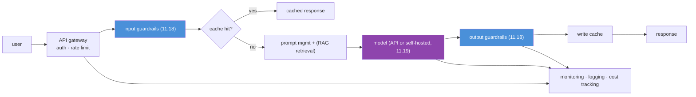
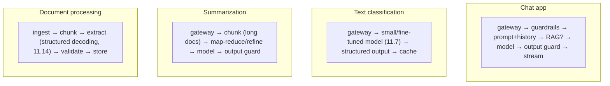
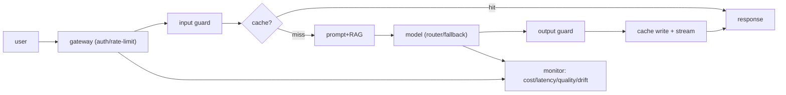

# 11.20 · Production LLM Architecture — Designing the System Around the Model

[⬅ 11.19 APIs vs Open Models](11.19-apis-vs-open-models.md) · [🏠 Module 11](../README.md) · [➡ 11.21 Projects & Summary](11.21-projects-summary.md)

> **The lesson in one line:** A production LLM system is mostly *not* the model — it's the API layer, prompt management, caching, guardrails, monitoring, rate limiting, and fallbacks that surround it, and getting those right is what separates a demo from a product.

---

## 🎯 Learning objectives

- Design the **reference architecture** for LLM applications (chat, classification, summarization, doc processing).
- Understand the essential layers: **API, prompt/model, caching, guardrails, monitoring, rate limiting**.
- Apply the **MLOps discipline** (unchanged from [08.17](../../08-Machine-Learning/weeks/08.17-production-ml.md)/[10.13](../../10-NLP/weeks/10.13-production.md)) to LLM-specific concerns.

## ✅ Prerequisites

- [11.18 safety/guardrails](11.18-safety.md), [11.19 deployment options](11.19-apis-vs-open-models.md), [11.16 inference optimization](11.16-inference-optimization.md).
- [08.17 production ML](../../08-Machine-Learning/weeks/08.17-production-ml.md), [10.13 NLP production](../../10-NLP/weeks/10.13-production.md).

---

## 🧠 Mental model

> [!IMPORTANT]
> **In a production LLM system, the model is one component — the interesting engineering is the system around it.** The model call is a single box in a diagram full of other boxes: an API gateway, prompt templates and versioning, a cache, input/output guardrails ([11.18](11.18-safety.md)), retrieval ([RAG, Module 13](../../13-RAG/README.md)), monitoring, rate limiting, and fallbacks. **This is [08.17](../../08-Machine-Learning/weeks/08.17-production-ml.md)/[10.13](../../10-NLP/weeks/10.13-production.md) MLOps discipline, unchanged — plus LLM-specific pieces (prompt management, token-cost control, guardrails).** The recurring lesson of the handbook holds: the fancy model didn't change the discipline.



---

## The reference architecture, layer by layer

### API layer / gateway
Authentication, **rate limiting** (per-user/tenant — cost *and* abuse control, [11.18](11.18-safety.md)), request validation, routing ([11.19 model router](11.19-apis-vs-open-models.md)). The front door.

### Prompt & model layer
- **Prompt management:** templates, versioning, and testing ([Module 12](../../12-Prompt-Engineering/README.md)). **Version prompts like code** — a prompt change is a behavior change and needs review, testing, and rollback.
- **The model call:** API or self-hosted ([11.19](11.19-apis-vs-open-models.md)), with **fallbacks** (retry, alternate provider/model) for outages.
- **Retrieval (RAG):** for knowledge-grounded apps, fetch context before the model call ([Module 13](../../13-RAG/README.md)) — the fix for hallucination/staleness ([11.1](11.1-what-is-a-language-model.md)).

### Caching ⭐
LLM calls are slow and expensive, so cache aggressively:

| Cache | What |
|---|---|
| **Exact-match** | identical prompt → stored response (FAQs, repeated queries) |
| **Semantic** | *similar* prompt → cached response (embedding similarity, [10.4](../../10-NLP/weeks/10.4-word-embeddings.md)) |
| **Prefix (KV)** | shared system-prompt KV cache ([11.15](11.15-kv-cache.md)) |

> [!IMPORTANT]
> **Caching is the highest-leverage cost and latency lever in an LLM app.** Because generation is slow and per-token-billed ([11.14](11.14-inference-decoding.md), [11.15](11.15-kv-cache.md)), a cache hit is a free, instant response. **Semantic caching** (return a cached answer for a *semantically similar* query, via embeddings — [10.4](../../10-NLP/weeks/10.4-word-embeddings.md)) can serve a large fraction of traffic in FAQ-like workloads. Combined with prefix/KV caching ([11.15](11.15-kv-cache.md)) for shared system prompts, caching often cuts cost and latency more than any model optimization.

### Guardrails ([11.18](11.18-safety.md))
Input guardrails (injection/PII/abuse) before the model; output guardrails (toxicity/PII/policy) after. Least privilege for any tool access.

### Monitoring, logging, cost tracking ⭐
The [08.17](../../08-Machine-Learning/weeks/08.17-production-ml.md)/[10.13](../../10-NLP/weeks/10.13-production.md) discipline, with LLM-specifics:

- **Cost tracking** — tokens in/out per request; **token cost is the new latency** ([11.2](11.2-tokenization.md)) — monitor and budget it or bills explode.
- **Quality monitoring** — no labels arrive, so use proxies: the prediction/output distribution ([08.17 canary](../../08-Machine-Learning/weeks/08.17-production-ml.md)), user feedback (thumbs up/down), and LLM-as-judge on samples ([11.17](11.17-evaluation.md)).
- **Latency** — TTFT and per-token ([11.15](11.15-kv-cache.md)), p50/p99.
- **Drift** — input drift and, [10.13](../../10-NLP/weeks/10.13-production.md)-style, *the language/topics change*; also **model drift** when a hosted model is silently updated ([11.19](11.19-apis-vs-open-models.md)).
- **Logging** — redact PII before logging prompts/responses ([10.13](../../10-NLP/weeks/10.13-production.md), [10.14](../../10-NLP/weeks/10.14-ethics-safety.md)).

---

## System designs by use case



| Use case | Key design notes |
|---|---|
| **Chat** | conversation history mgmt (fits context, [11.2](11.2-tokenization.md)), streaming responses, RAG for knowledge, guardrails |
| **Classification** | a **small/fine-tuned model** ([11.7](11.7-encoder-decoder-types.md), [11.12](11.12-peft-lora.md)) — don't use a frontier LLM; structured output; cache |
| **Summarization** | chunk long docs (map-reduce/refine over the context limit); output guardrails for faithfulness ([11.17](11.17-evaluation.md)) |
| **Document processing** | structured/constrained decoding ([11.14](11.14-inference-decoding.md)) for extraction; validate outputs; batch (offline) |

> [!TIP]
> **Right-size per use case** ([11.7](11.7-encoder-decoder-types.md), [11.19](11.19-apis-vs-open-models.md)): a frontier LLM for open-ended chat, a small fine-tuned model for high-volume classification, a cascade ([11.19](11.19-apis-vs-open-models.md)) for cost balance. Streaming (return tokens as generated) is essential for chat UX — it hides the sequential generation latency ([11.15](11.15-kv-cache.md)) by showing progress.

---

## 🏭 Production examples

| System | Architecture highlights |
|---|---|
| **Customer support bot** | RAG + guardrails + semantic cache + human handoff |
| **Coding assistant** | streaming, low-temp decoding ([11.14](11.14-inference-decoding.md)), sandbox, no auto-execute ([11.18](11.18-safety.md)) |
| **Document extraction** | batch, constrained decoding, output validation |
| **Content moderation** | small fine-tuned classifier + human review ([10.14](../../10-NLP/weeks/10.14-ethics-safety.md)) |

## ⚡ Performance & GPU considerations

- **Caching + streaming** are the top UX/cost levers; add before optimizing the model.
- **Batching/continuous batching** ([11.16](11.16-inference-optimization.md)) for self-hosted throughput; async/queue for spiky load.
- **Right-size the model** ([11.7](11.7-encoder-decoder-types.md)) — the biggest cost lever is not using a giant model where a small one works.
- **Autoscaling** for variable load; capacity planning around KV-cache memory ([11.15](11.15-kv-cache.md)) for self-hosted.

## 🔒 Security considerations

> [!CAUTION]
> - **Guardrails are architecture, not an afterthought** ([11.18](11.18-safety.md)) — input/output filtering, least privilege, and human-in-the-loop are *layers in the system diagram*.
> - **Rate limiting is cost *and* abuse control** — an unthrottled LLM endpoint is a runaway bill and a DoS/misuse target ([11.18](11.18-safety.md)).
> - **Redact PII before logging/caching** ([10.13](../../10-NLP/weeks/10.13-production.md), [10.14](../../10-NLP/weeks/10.14-ethics-safety.md)) — logs and caches are data stores subject to privacy rules; isolate caches per tenant ([11.15](11.15-kv-cache.md)).
> - **Monitor for prompt-injection and abuse patterns** ([11.18](11.18-safety.md)); alert on anomalous cost/output-distribution shifts.
> - **Hosted-model updates are silent behavior changes** ([11.19](11.19-apis-vs-open-models.md)) — pin versions where possible; regression-test on updates ([11.17](11.17-evaluation.md)).

## 🚫 Common mistakes

| Mistake | Consequence |
|---|---|
| **Model call with no system around it** | a demo, not a product — no caching/guardrails/monitoring |
| **No caching** | needless cost and latency |
| **No cost tracking/budget** | surprise bills at scale |
| **Frontier model for everything** | 10–100× overspend on simple tasks |
| **No rate limiting** | runaway cost + abuse/DoS |
| **Prompts unversioned** | untracked behavior changes, no rollback |
| **No quality monitoring** | silent degradation (esp. on hosted-model updates) |
| **Logging raw prompts** | PII breach |

## ✅ Best practices

- **Build the full system, not just the model call** — gateway, guardrails, cache, monitoring, fallbacks.
- **Cache aggressively** (exact + semantic + prefix); **stream** responses for chat.
- **Track token cost per request and budget it**; **rate-limit** every endpoint.
- **Version prompts like code**; regression-test on prompt *and* model changes ([11.17](11.17-evaluation.md)).
- **Right-size the model per use case**; use a cascade ([11.19](11.19-apis-vs-open-models.md)).
- **Guardrails and least privilege by design** ([11.18](11.18-safety.md)); redact PII before logging.
- **Monitor cost, latency, quality proxies, and drift**; alert on anomalies; keep a human escalation path.

## 🏋️ Exercises

1. **Design a chat app.** Draw the full architecture for a customer-support chatbot with RAG, guardrails, caching, and human handoff. Label every layer's responsibility.
2. **Semantic cache.** Implement a semantic cache (embed query, return cached response if cosine > threshold). Measure the hit rate and cost savings on a FAQ workload; tune the threshold vs false-hit rate.
3. **Cost dashboard.** Instrument an LLM app to track tokens-in/out and cost per request. Build a dashboard; set a budget alert.
4. **Right-sizing.** For a mixed workload (classification + chat + summarization), design which model/deployment handles each and estimate the cost vs frontier-for-everything.
5. **Prompt versioning.** Set up prompt templates under version control with a test suite; show how a prompt change is reviewed, tested, and rolled back.
6. **Failure handling.** Add provider fallback and graceful degradation (cache/smaller model) for when the primary model is down.

## 🛠️ Mini project — "A Production LLM Service"

**Goal:** build a complete, production-shaped LLM service — the capstone system that integrates the whole "serve & operate" half of the module.

**Requirements**
- **API gateway** with auth + **rate limiting**.
- **Input/output guardrails** ([11.18](11.18-safety.md)).
- **Prompt management** (versioned templates) + a **model router/fallback** ([11.19](11.19-apis-vs-open-models.md)).
- **Caching**: exact + **semantic** + prefix ([11.15](11.15-kv-cache.md)).
- **Streaming** responses.
- **Monitoring**: cost per request, latency (TTFT/per-token), a quality-proxy (feedback/LLM-judge), drift, PII-redacted logging.
- Optional **RAG** hook ([Module 13](../../13-RAG/README.md)).

**Folder structure**
```
llm-service/
├── gateway.py         # auth, rate limit, routing
├── guardrails.py      # input/output (11.18)
├── prompts/           # versioned templates
├── router.py          # model selection + fallback (11.19)
├── cache.py           # exact + semantic + prefix
├── serve.py           # streaming responses
├── monitor.py         # cost, latency, quality, drift, PII-safe logs
└── README.md
```

**Architecture diagram**


**Data pipeline:** prompt templates versioned; PII redacted before cache/log.
**Testing:** guardrails block injection/PII; cache hit returns instantly; rate limit enforced; fallback triggers on model failure; cost tracked per request.
**Evaluation:** cache hit-rate + cost savings; p50/p99 latency; a quality-proxy trend; a regression eval ([11.17](11.17-evaluation.md)) on prompt/model change.
**Performance:** streaming TTFT; cache impact on cost/latency.
**Future improvements:** add continuous batching for self-hosted ([11.16](11.16-inference-optimization.md)); autoscaling; a cascade router ([11.19](11.19-apis-vs-open-models.md)); full RAG ([Module 13](../../13-RAG/README.md)).

## 📄 Cheat sheet

| Layer | Responsibility |
|---|---|
| **Gateway** | auth · **rate limiting** (cost + abuse) · routing |
| **Guardrails** | input/output filtering ([11.18](11.18-safety.md)) · least privilege |
| **Prompt/model** | **versioned prompts** · model call ([11.19](11.19-apis-vs-open-models.md)) · **fallback** · RAG |
| **⭐ Caching** | exact + **semantic** + prefix/KV → biggest cost/latency win |
| **⭐ Monitoring** | **cost/token** · latency (TTFT/per-token) · quality proxies · drift · PII-safe logs |
| **⭐ The discipline** | **[08.17](../../08-Machine-Learning/weeks/08.17-production-ml.md)/[10.13](../../10-NLP/weeks/10.13-production.md) MLOps, unchanged** + LLM specifics |

## 🎴 Flashcards

- **⭐ In a production LLM system, what's the main engineering?** → The system *around* the model — gateway, guardrails, caching, monitoring, rate limiting, fallbacks; the model call is one box.
- **What caching types matter for LLMs?** → Exact-match, **semantic** (embedding-similar queries), and prefix/KV cache ([11.15](11.15-kv-cache.md)).
- **⭐ Why is semantic caching high-leverage?** → Generation is slow and per-token-billed; returning a cached answer for a *similar* query serves much of FAQ-like traffic for free.
- **What LLM-specific things must you monitor?** → Token cost per request, TTFT/per-token latency, quality proxies (feedback/LLM-judge), input/topic drift, and silent hosted-model updates.
- **Why version prompts like code?** → A prompt change is a behavior change needing review, testing, and rollback.
- **⭐ Why rate-limit?** → Cost control *and* abuse/DoS prevention — an unthrottled LLM endpoint is a runaway bill and an attack target.
- **What's the recurring lesson?** → Production LLM engineering is the [08.17](../../08-Machine-Learning/weeks/08.17-production-ml.md)/[10.13](../../10-NLP/weeks/10.13-production.md) MLOps discipline, unchanged, plus LLM-specific pieces.

## 💬 Interview questions

1. Draw the reference architecture for a production LLM application. What does each layer do?
2. Why is caching (especially semantic caching) so important, and how would you implement it?
3. What do you monitor in an LLM system that you wouldn't in a classical ML system?
4. How do you control cost in a production LLM app?
5. Why version prompts, and how do you test prompt/model changes?
6. How much of LLM production engineering is new vs inherited MLOps discipline?

## 📝 Summary

- A production LLM system is **mostly the system around the model** — API gateway, prompt management, caching, guardrails, monitoring, rate limiting, and fallbacks — and it's the **[08.17](../../08-Machine-Learning/weeks/08.17-production-ml.md)/[10.13](../../10-NLP/weeks/10.13-production.md) MLOps discipline, unchanged**, plus LLM specifics.
- **Caching (exact + semantic + prefix)** and **streaming** are the top cost/latency/UX levers; add them before optimizing the model.
- **Track token cost, latency, quality proxies, and drift**; **rate-limit** every endpoint (cost + abuse); **version prompts like code** and regression-test on changes.
- **Right-size the model per use case** ([11.7](11.7-encoder-decoder-types.md), [11.19](11.19-apis-vs-open-models.md)) with cascades, and build **guardrails and least privilege by design** ([11.18](11.18-safety.md)) — the difference between a demo and a product.

## 📚 References

1. **Chip Huyen — _Designing Machine Learning Systems_ & _AI Engineering_.** ⭐⭐ Production LLM system design.
2. **Bahree — _Building LLM Powered Applications_** & **_LLM app patterns_ (various).** Reference architectures.
3. **vLLM / LangChain / LlamaIndex production docs.** Caching, routing, serving.
4. **[08.17 Production ML](../../08-Machine-Learning/weeks/08.17-production-ml.md) & [10.13 NLP Production](../../10-NLP/weeks/10.13-production.md).** ⭐ The unchanged discipline.
5. **[11.18 Safety](11.18-safety.md) & [11.16 Inference Optimization](11.16-inference-optimization.md).** Guardrails and serving.

---

## 🧭 Navigation

| Direction | Link |
|---|---|
| ⬅ Previous | [11.19 · APIs vs Open Models](11.19-apis-vs-open-models.md) |
| ➡ Next | [11.21 · Projects & Summary](11.21-projects-summary.md) |
| 🏠 Module | [Module 11](../README.md) |
| 📖 Lessons | [Lesson index](README.md) |
